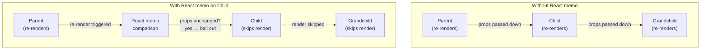

# Component-Level Memoization

React's rendering model re-renders a component when its parent renders, when its own state
changes, or when context it consumes changes. For most components, this is correct and fast.
For components that are expensive to render — large lists, complex canvas operations, heavy
computations — unnecessary re-renders accumulate into perceptible latency. Memoization APIs
(`React.memo`, `useMemo`, `useCallback`) allow components and values to skip recalculation
when their inputs have not changed.

The React team's guidance is to apply memoization after profiling, not preemptively.
Memoization has a cost: the comparison of previous and current props or dependencies on every
render. For cheap components, the comparison cost exceeds the render cost it avoids. Blanket
application of `React.memo` to every component is not optimization — it is noise that makes
code harder to read and may even make performance worse in aggregate. Optimization that is not
grounded in a measured problem is speculation, and speculation compounds over time into a
codebase that no one can reason about confidently.

The correct mental model for memoization is breaking the re-render chain. `React.memo`
prevents a component from re-rendering when its parent re-renders and the props have not
changed. `useMemo` prevents a value from being recomputed when the component re-renders and
the dependencies have not changed. `useCallback` prevents a function from being re-created
when the component re-renders and the dependencies have not changed. All three work by
referential stability — they only help when the consumer cares about reference equality.
Referential stability matters for `React.memo`-wrapped children (props comparison) and for
hooks that list a value as a dependency. It does not matter for values used only in the
current component's own render output.

Understanding these three APIs as a coordinated system rather than independent tools is the
key to applying them correctly. `React.memo` on a child component only pays off when the
props passed to it are themselves stable, which typically requires `useMemo` or `useCallback`
in the parent for any prop that is an object, array, or function. The three APIs are most
effective when applied together as a chain, not sprinkled independently across the codebase.

## Design Thinking

### The cost of memoization itself

A common misconception is that memoization is free when it avoids a render. In practice,
memoization has a fixed cost on every render: the comparison of the previous and current
dependencies (for `useMemo` and `useCallback`) or props (for `React.memo`). For `useMemo` and
`useCallback`, this cost is proportional to the number of items in the dependency array. For
`React.memo`, the cost is proportional to the number of props. When the component being
memoized is cheap to render — a component that returns a simple fragment with a few DOM nodes
— the comparison cost on every render may exceed the render cost that memoization avoids.

This asymmetry is why the React team's guidance is to apply memoization after profiling, not
preemptively. A memoized component that renders rarely still pays the comparison cost on every
render of its parent. If the parent renders thousands of times per second — for example, in an
animation frame loop — and the memoized child renders cheaply, the comparison overhead
accumulates without producing proportional benefit. The profile must show that the child render
itself is the bottleneck, not that the parent renders frequently.

### When React.memo actually helps

`React.memo` prevents a component from re-rendering when a parent re-renders and the child's
props have not changed by reference. For it to provide a net benefit, three conditions must
all be true simultaneously: the parent re-renders frequently, the child's props are stable
across those parent re-renders, and the child render itself is expensive enough that skipping
it saves measurable time. In most component trees, at least one of these conditions is false.
A parent that re-renders only on user interaction does so infrequently enough that child
re-renders are not the bottleneck. A child that receives a new object literal as a prop on
every parent render has unstable props, so `React.memo` performs the comparison and then
re-renders anyway. A child that returns a small fragment renders so cheaply that saving its
render time is not observable.

The practical test before adding `React.memo` is to open the Profiler, record the interaction
that feels slow, and look at whether the component in question shows up as a long bar. If it
does not appear as a slow component, `React.memo` will not help. If it does appear, check
whether its props are actually stable — inspect the "why did this render?" annotation in the
Profiler to see which props changed. When both conditions are confirmed by measurement,
`React.memo` is justified.

A subtle but important point is that `React.memo` uses Object.is semantics for comparison,
which is a shallow reference comparison for objects and arrays. Two arrays that contain the
same items but are different array instances compare as unequal. This means that if a parent
passes a filtered list computed inline — `items.filter(predicate)` in the JSX — `React.memo`
will see a new array reference on every parent render and re-render the child regardless. The
parent must stabilize the array with `useMemo` before passing it as a prop for `React.memo`
to have any chance of bailing out. Forgetting this interaction between `React.memo` and
unstable prop references is one of the most common reasons a developer adds `React.memo` and
then observes no improvement in the Profiler.

### useMemo for expensive computations

`useMemo` memoizes a computed value and reuses it across renders as long as the listed
dependencies have not changed. The use cases where it meaningfully helps are filtering or
sorting a large list, building a lookup map or index from an array, running a layout or
geometry calculation, or constructing a derived dataset that multiple children consume.

The key qualifier is "expensive." Most array operations on lists under a thousand items
complete in under a millisecond, which is below the threshold of perceptible latency. Adding
`useMemo` to a ten-item filter adds a dependency array evaluation, the overhead of the
memoization cache lookup, and cognitive complexity — for zero user-visible benefit. A simple
heuristic is to benchmark the computation with `console.time` before memoizing: if it
completes in under one millisecond consistently, the cost of `useMemo` overhead and the
maintenance burden of a dependency array are unlikely to be worthwhile.

A secondary valid use case for `useMemo` is producing a stable object reference to pass as a
prop to a `React.memo`-wrapped child. In this case, the computation itself may be cheap, but
referential stability is the goal rather than skipping an expensive calculation. This is the
one scenario where `useMemo` on a cheap computation is defensible — but it still requires that
the child is actually `React.memo`-wrapped and that re-renders are measured to be a problem.

### useCallback and referential stability

`useCallback(fn, deps)` returns a memoized function reference that remains stable across
renders as long as the listed dependencies have not changed. Its purpose is specifically
referential stability, not skipping expensive work. The two scenarios where it provides a net
benefit are: passing the function as a prop to a `React.memo`-wrapped child, where a new
function reference on each parent render would defeat the memo; and listing the function as a
dependency of another hook such as `useEffect`, where a new function reference on each render
would cause the effect to run on every render.

Outside these two scenarios, `useCallback` provides no benefit. A function used only inside
the component's own event handlers — not passed down, not listed as a dependency — re-creates
on every render, but that has no effect because neither `React.memo` nor any hook is watching
the reference. Wrapping such a function in `useCallback` adds a dependency array that must be
maintained and adds conceptual overhead for reviewers without any runtime benefit.

A related pattern worth understanding is that `useCallback` and `useMemo` are two sides of the
same coin: `useCallback(fn, deps)` is precisely equivalent to `useMemo(() => fn, deps)`. The
distinction is readability — `useCallback` communicates that the memoized value is a function
rather than a computed value. Knowing this equivalence helps when reasoning about which hook to
use for a given scenario and why the dependency rules are identical between them. Both hooks
store the result of their first argument, and both compare the dependency array on every render
to decide whether to return the stored result or re-run the computation.

### React Compiler and auto-memoization

React 19 includes the React Compiler, a build-time transform that automatically applies
memoization to components and hooks based on static analysis of their inputs. When the React
Compiler is active, it emits code equivalent to what a developer would write with `React.memo`,
`useMemo`, and `useCallback` — but derived from the code's actual data flow rather than from
manually maintained dependency arrays. This eliminates the most common category of memoization
bugs: incorrect or incomplete dependency arrays.

In projects using the React Compiler, manual `useMemo` and `useCallback` become largely
unnecessary. The compiler handles the common cases automatically, and the places where manual
memoization is still meaningful are narrower: computations that the compiler's static analysis
cannot infer as expensive, or cases where the developer wants to express intent explicitly for
documentation purposes. The `use no memo` directive allows opting specific functions out of
compiler-managed memoization when the automatic behavior is incorrect. Teams adopting React 19
SHOULD evaluate whether the React Compiler can be enabled for their codebase, because it
addresses the root cause of most memoization-related bugs while reducing the amount of
annotation code that engineers must write and maintain.

## Best Practices

**MUST enable the `react-hooks/exhaustive-deps` ESLint rule and treat all its warnings as
errors.** An incomplete dependency array in `useMemo` or `useCallback` produces a stale
closure that reads outdated values from a previous render. This is the most common source of
subtle, hard-to-reproduce bugs introduced by memoization. The symptom is a component that
displays or computes based on values that were current at the time the hook first ran but have
since changed — because the dependency was omitted, the hook never re-ran to pick up the
updated value. The linting rule detects the problem statically before it reaches production.
Silencing the rule with `// eslint-disable-next-line` to make a stale closure "intentional"
MUST be accompanied by a comment explaining the reasoning; in the vast majority of cases, the
correct fix is to include the dependency rather than suppress the warning.

**SHOULD measure render performance with the React DevTools Profiler before applying
`React.memo`, `useMemo`, or `useCallback`.** Memoization that is not grounded in a measured
problem adds complexity without verified benefit. The Profiler flame graph shows which
components re-render on each interaction, how long each render takes, and which prop or state
change caused the re-render. This data distinguishes a real bottleneck — a component that
takes 20ms to render and fires on every keystroke — from a false positive — a component that
re-renders but completes in under 0.5ms. A measured baseline before adding memoization and a
measured result after applying it SHOULD both be recorded so that the optimization can be
evaluated and reverted if it does not produce the expected improvement.

**MUST NOT use `useCallback` to memoize functions that are not passed to `React.memo`-wrapped
components or listed as dependencies of other hooks.** A `useCallback` on a function used only
in the current component's own event handlers provides no benefit; the component re-renders
whether the function reference is stable or not, because nothing outside the component is
watching the reference. `useCallback` in this scenario is a cost — a dependency array to
maintain and a layer of indirection for reviewers — with no payoff. The rule of thumb is:
before adding `useCallback`, identify which `React.memo` child or which hook dependency
requires the stable reference. If neither exists, the `useCallback` is not needed.

## Visual



## Example

```jsx
// ExpensiveList only re-renders when items or onSelect changes by reference.
// React.memo performs a shallow props comparison on every parent re-render.
const ExpensiveList = React.memo(function ExpensiveList({ items, onSelect }) {
  return (
    <ul>
      {items.map(item => (
        <li key={item.id} onClick={() => onSelect(item)}>
          {item.name}
        </li>
      ))}
    </ul>
  );
});

function Parent({ items }) {
  const [selected, setSelected] = React.useState(null);

  // Without useCallback, a new function reference is created on every Parent render.
  // React.memo on ExpensiveList would see a changed onSelect prop and re-render anyway.
  // useCallback keeps the reference stable as long as deps (none here) have not changed.
  const handleSelect = React.useCallback((item) => {
    setSelected(item);
  }, []); // no deps: setSelected is stable from useState

  return (
    <>
      <ExpensiveList items={items} onSelect={handleSelect} />
      {selected && <p>Selected: {selected.name}</p>}
    </>
  );
}
```

## Common Mistakes

- **Adding `React.memo` to every component "just in case."** This adds comparison overhead
  to every render of every component without verifying that the comparison cost is lower than
  the render cost it avoids. For cheap components, the comparison itself is the more expensive
  operation. Apply `React.memo` only where a Profiler measurement shows a bottleneck.
- **Omitting dependencies from `useMemo` or `useCallback` to silence a lint warning.** The
  lint warning exists because the omitted value is read inside the hook. Silencing the warning
  does not fix the stale closure; it hides it. The function will continue reading a value from
  a past render until the hook re-runs for another reason. Include the dependency and let the
  memoization invalidate correctly, or restructure the code so the value is not needed inside
  the hook.
- **Using `useCallback` on functions that are not passed to memoized children.** A function
  used only in the component's own event handlers does not need referential stability. No
  external consumer compares its reference. Wrapping it in `useCallback` adds a dependency
  array to maintain and a layer of indirection for no runtime benefit.
- **Not measuring before memoizing.** Applying memoization based on intuition rather than
  Profiler data leads to over-engineered components that are harder to refactor. The Profiler
  takes under a minute to record an interaction and identify which renders are slow. That
  minute spent measuring saves hours of maintenance on unnecessary memoization.
- **Forgetting that `React.memo` only does a shallow comparison.** If a prop is an object
  constructed inline — `<MemoChild config={&#123;&#123; flag: true &#125;&#125;} />` — `React.memo` sees a new
  reference on every parent render and re-renders the child anyway. The parent must stabilize
  the reference with `useMemo` or hoist the object outside the component for `React.memo` to
  have any effect.

## Related FEEs

- [FEE-500 — Component Architecture & Design Patterns Overview](./500.md)
- [FEE-511 — Provider Hierarchy & Context Composition](./511.md)
- [FEE-601 — Local Component State](../State%20Management/601.md)
- [FEE-702 — Virtual DOM, Reconciliation & Diffing](../Rendering%20and%20Performance/702.md)

## References

- [React docs: useMemo](https://react.dev/reference/react/useMemo) — the authoritative
  reference for `useMemo`, covering when to use it, how to write dependency arrays correctly,
  and the React team's own guidance on when not to use it; the "You might not need useMemo"
  section is required reading before applying the hook
- [React docs: useCallback](https://react.dev/reference/react/useCallback) — covers the
  purpose of `useCallback`, the relationship between referential stability and `React.memo`,
  and examples of cases where `useCallback` is and is not needed; includes the React team's
  explicit guidance that `useCallback` helps only when passed to optimized components
- [React docs: memo](https://react.dev/reference/react/memo) — documents `React.memo`
  behavior, the shallow comparison semantics, and the conditions under which memoization
  actually improves performance; the "Should you add memo everywhere?" section directly
  addresses the blanket-application anti-pattern
- [React DevTools Profiler](https://react.dev/learn/react-developer-tools) — the official
  browser extension providing the Profiler flame graph used to identify slow renders, count
  re-renders per interaction, and determine which prop or state change caused each re-render;
  this is the measurement tool that makes memoization decisions evidence-based rather than
  speculative
- [React Compiler documentation](https://react.dev/learn/react-compiler) — explains the
  React 19 build-time compiler that automatically applies memoization based on static analysis,
  covers the opt-in/out semantics with `use no memo`, and describes how to incrementally adopt
  the compiler in an existing codebase without changing component code; essential background for
  teams evaluating whether manual memoization can be replaced by compiler-managed memoization
