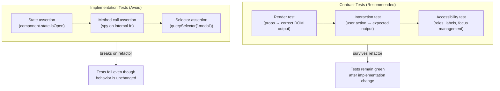

# Testing Component Contracts

A component's contract is its public API: the props it accepts, the events it emits, the slots
it renders, and the accessibility attributes it maintains. Tests that verify the contract give
consumers confidence that the component behaves correctly without specifying how it achieves
that behavior internally. Tests that verify the implementation — which internal function was
called, what internal state was set — must be updated whenever the implementation changes, even
when the observable behavior does not change.

The Testing Library family of tools (React Testing Library, Vue Testing Library, etc.) was
designed around this distinction. Its guiding principle — "the more your tests resemble the
way your software is used, the more confidence they can give you" — is a restatement of
testing the contract, not the implementation. Querying by `role` and `label` rather than by
CSS class or component name is how that principle is operationalized.

Component contracts become especially important in design systems and shared component
libraries. A button component that changes its internal DOM structure for accessibility
improvements should not require updates to every test that queried for the old structure.
Tests written against the contract — the button is rendered with `role="button"`, pressing
Enter triggers `onClick` — survive implementation refactors.

Thinking about components through the lens of their contract also improves component design.
If a component is difficult to test without reaching for `data-testid` or mocking internals,
the cause is frequently that the component has not surfaced the right semantic structure in its
DOM output. The testing friction is a symptom of a design problem: the component's public
interface does not match how users and assistive technologies perceive it. Treating testability
by contract as a design requirement — alongside functionality and visual appearance — produces
components that are more accessible, more composable, and more independently upgradeable.
Approaching tests as the primary specification of a component's public behavior is a useful
framing for teams new to contract testing: write the test that describes what the component
should do for the user, then implement the component to make it pass.

## Design Thinking

### The contract as a design feedback mechanism

Testability is not separate from component design — it is a direct reflection of it. A
component that can only be tested by reaching into its internals signals that its public
interface does not expose enough semantic information. When a test requires `querySelector`
to find an element, the component is missing a role or label that would make the element
discoverable through its user-facing identity. When a test must mock a child component to
isolate behavior, the parent component is doing too much and would benefit from a narrower
interface or a clearer composition boundary.

This feedback loop is one of the most underutilized aspects of contract-oriented testing.
Teams that write tests before or alongside implementation — rather than after — encounter
design problems early, when they are cheap to fix. A difficult test is an early warning that
the component's contract is incomplete. Resolving the testing friction by improving the
component's semantic structure simultaneously improves its accessibility and composability. The
test suite becomes a continuous design audit, not a retroactive verification step.

### Contract vs. implementation testing

The difference between contract testing and implementation testing becomes concrete when you
compare two tests that check whether a modal dialog is open. An implementation test might
assert that `component.state.isOpen === true`. A contract test asserts that
`getByRole('dialog')` is visible in the document. When the component is refactored to manage
open state with a reducer instead of `useState`, the implementation test breaks — the state
shape changed. The contract test passes without modification, because the visible dialog is
still present. This asymmetry is the core argument for contract-oriented tests: implementation
details change as code evolves; the observable behavior for the user should not.

The contract test also communicates intent more clearly. `getByRole('dialog')` says "a dialog
is visible to users and assistive technology." `component.state.isOpen === true` says "an
internal variable has a certain value." The first statement is the behavior users care about.
The second statement is an artifact of one particular implementation approach. Tests that read
as behavioral specifications are easier for teams to understand, maintain, and extend over
time.

From a maintenance cost perspective, the advantage of contract tests is even more pronounced at
scale. A component in a design system may be depended on by dozens of consuming test suites. If
each consuming suite asserts on internal state or class names, every implementation improvement
— such as refactoring the DOM structure for better accessibility — triggers failures across all
consumers, even when the user-visible behavior is identical. Contract-oriented tests allow the
implementation to evolve freely as long as the observable behavior remains stable. This
stability is critical when maintaining shared component libraries that span multiple teams and
applications. Consumers can upgrade to new component versions without updating their tests,
because the contract — not the implementation — defines the compatibility surface.

### Query priority: semantic first

Testing Library defines a query priority hierarchy that reflects how tightly each query is
coupled to implementation details. From lowest coupling to highest: `getByRole` (semantic HTML
and ARIA roles that users and screen readers rely on) → `getByLabelText` (form element
associations that define accessible names) → `getByPlaceholderText` (hint text visible to
sighted users) → `getByText` (text content visible in the rendered output) →
`getByDisplayValue` (current value of form fields) → `getByAltText` (image alt text) →
`getByTitle` (title attribute) → `getByTestId` (a custom attribute with no user-facing
meaning).

The practical implication is to reach for `getByRole` first in every test. When the element
has no meaningful role — which is rare for interactive components — move down the hierarchy
until you find a query that is grounded in something a user would perceive. Reserve
`getByTestId` for the small set of cases where the element genuinely has no accessible
characteristic to query on, and treat its use as a signal to re-examine whether the component
needs a role or label added to make it testable by contract.

The `name` option of `getByRole` is a key detail that elevates its usefulness. `getByRole(
'button', { name: 'Submit' })` does not merely confirm that a button element is rendered — it
confirms that the button has the correct accessible name, which is how screen reader users
identify the control. Accessible names come from `aria-label`, `aria-labelledby`, or visible
text content. When a page contains multiple elements of the same role, the `name` option is the
principal way to distinguish them without falling back to position or class attributes. Writing
`getByRole` queries with explicit `name` options catches missing or incorrect accessible names
as early as the test run, before an accessibility audit or user report surfaces the problem.

### User event vs. fireEvent

Testing Library ships two approaches for simulating user input: `fireEvent` dispatches a
single synthetic DOM event, while `@testing-library/user-event` simulates the full sequence of
events a real browser generates for a user interaction. Clicking a button in a browser fires
`pointerover`, `pointerenter`, `mouseover`, `mouseenter`, `pointermove`, `mousemove`,
`pointerdown`, `mousedown`, `focus`, `pointerup`, `mouseup`, `click` in sequence.
`fireEvent.click` fires only `click`. A component that depends on `focus` being set before
`click` — for example, a dropdown that opens only when focused — will not work correctly in a
test that uses `fireEvent.click`.

Prefer `userEvent.click()` over `fireEvent.click()` for all interaction tests.
`@testing-library/user-event` v14 uses the `pointer` and `keyboard` APIs to produce a
realistic event sequence, and its `setup()` factory creates a user session that carries state
across multiple interactions — useful for testing focus management, multi-step keyboard
navigation, and interactions where the order of events matters. The cost of the more realistic
simulation is negligible in test runtimes; the benefit is tests that exercise the component in
conditions closer to actual browser behavior.

### Storybook play functions as contract tests

Storybook's `play` function, introduced with the interaction addon, allows stories to include
automated interactions that run in the browser after the story renders. A `play` function
written with `@storybook/test` utilities — which use `@testing-library/user-event` under the
hood — serves as a browser-executed contract test co-located with the story that documents the
component. Storybook can run these play functions in CI via `storybook test`, making them part
of the automated test suite rather than only visual documentation.

The strategic value of play functions is that they live next to the component's stories and
are visible in the Storybook UI, which means they double as living documentation of the
component's interaction contract. A developer reviewing the component's stories can watch the
play function execute in real time to understand how the component is supposed to behave.
Unlike unit tests that run in a simulated DOM environment, play functions run in a real browser
context — catching browser-specific rendering issues that jsdom-based tests miss.

The organizational benefit is a reduction in duplication between tests and documentation. In a
typical setup without play functions, a component has stories that document its visual states
and separate test files that verify its behavior. These two artifacts can drift: the story
shows one interaction pattern while the test verifies a different one. Play functions collapse
the gap — the story and the contract test are the same artifact. Teams working on design
systems in particular benefit from this colocation, because it makes the component's expected
behavior discoverable to consumers without requiring them to read the test file separately from
the usage documentation.

## Best Practices

**MUST use `getByRole` as the primary query in component tests.** Roles correspond to semantic
HTML and ARIA roles that users and screen readers interact with. A test that queries
`getByRole('button', { name: 'Submit' })` will fail if the rendered element lacks the correct
role or accessible name — which is exactly the failure mode that matters. A test that queries
`document.querySelector('.submit-btn')` will pass even if the button is not keyboard accessible.
When a component test cannot be written using `getByRole`, the reason is almost always that the
component itself needs to be improved to expose the correct semantic structure.

**MUST test interactive components by simulating user interactions, not by calling component
methods or setting internal state directly.** If a dialog opens when a button is clicked, test
it by clicking the button: `await userEvent.click(getByRole('button', { name: 'Open' }))`. Do
not call `component.open()` or `setState({ isOpen: true })`. The user cannot call internal
methods; the test MUST NOT be able to either. Direct state manipulation bypasses all event
handlers, validation logic, and side effects that are triggered by the interaction — producing
a test that passes even when the real user-facing interaction is broken.

**MUST NOT mock child components in component tests unless the child is from an external package whose behavior cannot be controlled in the test environment.** Mocking internal child components breaks integration — the test no longer exercises the actual rendered output — and produces false confidence when the real interaction between parent and child is incorrect. Test the component as it renders in real use, including its children.

**SHOULD include keyboard interaction tests for all interactive components.** A dropdown that
opens on click but not on Enter fails keyboard users. A test that presses Tab to focus the
trigger and Enter to open covers this case. Keyboard interaction tests are the most effective
way to catch accessibility contract violations before they reach production. The `userEvent.tab()`
and `userEvent.keyboard('{Enter}')` utilities make these tests straightforward to write. Teams
SHOULD budget for at least one keyboard interaction test per interactive component as part of
the definition of done for any new component work.

## Visual



## Example

```jsx
import { render, screen } from '@testing-library/react';
import userEvent from '@testing-library/user-event';
import { Dialog } from './Dialog';

test('opens dialog on trigger click and closes on Escape', async () => {
  render(
    <Dialog trigger={<button>Open</button>} title="Confirm">
      <p>Content</p>
    </Dialog>
  );

  // Dialog is not present before interaction
  expect(screen.queryByRole('dialog')).not.toBeInTheDocument();

  // Simulate a realistic click — userEvent fires the full browser event sequence
  await userEvent.click(screen.getByRole('button', { name: 'Open' }));

  // Assert against the contract: a dialog with accessible name "Confirm" is visible
  expect(screen.getByRole('dialog', { name: 'Confirm' })).toBeVisible();

  // Simulate pressing Escape to close — keyboard interaction is part of the contract
  await userEvent.keyboard('{Escape}');

  // Dialog is gone from the DOM after close
  expect(screen.queryByRole('dialog')).not.toBeInTheDocument();
});
```

## Common Mistakes

- **Reaching for `getByTestId` as the default query.** `data-testid` provides no information
  about the component's role, label, or visible text — the attributes that determine whether
  users can perceive and interact with the element. A test written against `data-testid` passes
  even when the element is invisible, lacks a keyboard role, or has no accessible name. Use
  `getByRole` first; add `data-testid` only when the element has no user-perceptible
  characteristics to query on.
- **Mocking child components to isolate the unit under test.** Mocking children transforms a
  component test into a partial test that only verifies the parent's rendering logic, not the
  actual interaction between parent and child. When the real child component changes in a way
  that breaks the composition, the test with the mocked child continues to pass. Only mock
  children from external packages that cannot be controlled in the test environment.
- **Using `fireEvent` for interaction tests.** `fireEvent` dispatches a single synthetic event,
  which is often sufficient for unit tests but misses the multi-event sequences that real browser
  interactions generate. Components that depend on `focus`, `pointerdown`, or `keydown` events
  that precede the final `click` will behave differently under `fireEvent` than in a real
  browser. Prefer `userEvent` for all interaction simulation.
- **Asserting on internal state or method calls.** Tests that use `wrapper.instance().state` or
  spy on an internal method encode an implementation choice into the test suite. When the
  implementation is refactored — even to improve it — these tests fail and require updates that
  provide no additional confidence about user-visible behavior. Rewrite such tests to assert on
  the rendered output instead.
- **Omitting keyboard and focus tests from interactive components.** Click-based tests cover
  one input modality; keyboard users, switch users, and screen reader users rely on a different
  interaction model. A component that passes all mouse-based tests may still be completely
  inaccessible by keyboard. Including at least one keyboard path through each interactive
  component's contract test ensures that the component's accessibility contract is verified
  alongside its pointer-based contract.

## Related FEEs

- [FEE-500 — Component Architecture & Design Patterns Overview](./500.md)
- [FEE-1100 — Testing Strategies Overview](../Testing%20Strategies/1100.md)
- [FEE-1102 — Component Testing with Testing Library](../Testing%20Strategies/1102.md)
- [FEE-1001 — ARIA & Semantic HTML](../Accessibility/1001.md)

## References

- [Testing Library: Guiding Principles](https://testing-library.com/docs/guiding-principles) —
  the canonical statement of why Testing Library is designed around user-visible queries; the
  principle "the more your tests resemble the way your software is used, the more confidence
  they can give you" is the foundation for all contract-oriented component testing; reading this
  page before writing any component test establishes the mental model that makes query priority
  choices intuitive rather than arbitrary
- [Testing Library: Query priority](https://testing-library.com/docs/queries/about#priority) —
  the official priority order for queries from `getByRole` through `getByTestId`, with
  explanations of why each rank reflects how tightly the query is coupled to implementation
  details versus user-facing behavior; the page includes the explicit guidance that `getByTestId`
  should be the last resort, used only when no semantic characteristic can be queried
- [Kent C. Dodds: Testing Implementation Details](https://kentcdodds.com/blog/testing-implementation-details) —
  the essay that articulated the contract vs. implementation distinction in the context of React
  testing; explains why testing implementation details produces false positives (tests pass when
  the behavior is broken) and false negatives (tests fail when only the implementation changed),
  and why user-observable behavior is the correct unit of test assertion; the two categories of
  implementation detail — component instance methods and internal state — are directly applicable
  to any component framework, not only React
- [WAI-ARIA Authoring Practices Guide: Patterns](https://www.w3.org/WAI/ARIA/apg/patterns/) —
  the W3C reference for expected keyboard interaction patterns per ARIA role; when writing keyboard
  interaction tests for a dialog, accordion, or combobox, the APG pattern for that component
  defines which keyboard events are part of the accessibility contract; tests that do not cover
  these patterns leave the accessibility contract partially unverified
- [Storybook: Interaction testing](https://storybook.js.org/docs/writing-tests/interaction-testing) —
  the official documentation for `play` functions and the Storybook test runner; covers how to
  write interaction tests using `@storybook/test`, how to run them in CI with `storybook test`,
  and how the browser execution context catches issues that jsdom-based tests cannot reproduce;
  relevant for teams using Storybook who want contract tests co-located with component stories
