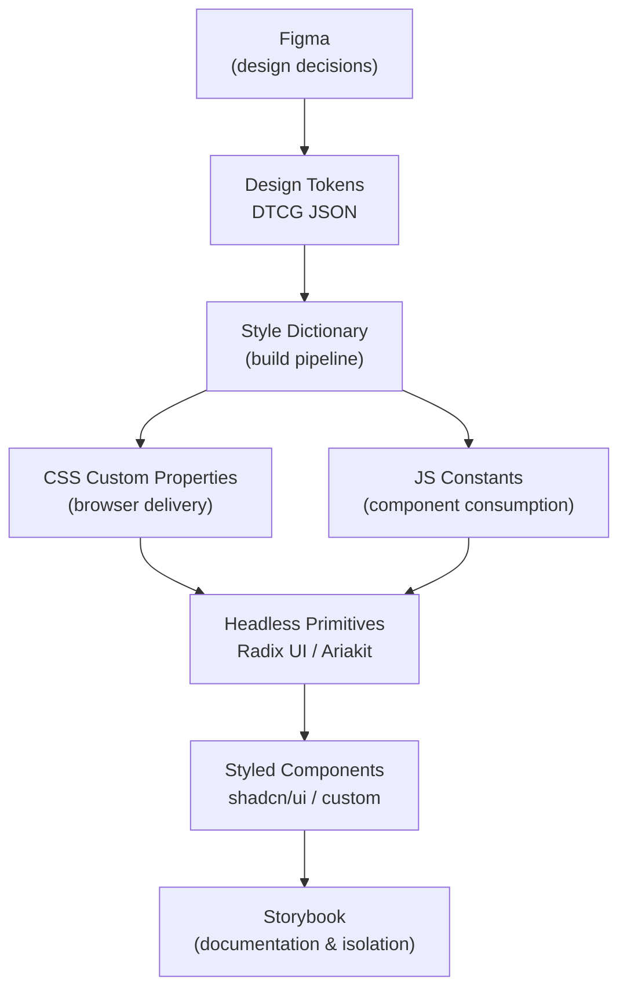

# Design Systems & UI Libraries Overview

A design system is the shared language between design and engineering. It transforms raw design decisions — color, spacing, typography, interaction — into a structured, versioned, and machine-readable artifact that can be consumed across every surface a product touches. Modern design systems are not monoliths. They are layered stacks, where each layer has a precise responsibility and a well-defined interface to the layers above and below it.

The discipline has matured significantly. What started as shared CSS files and scattered component utilities in the early 2010s has evolved into a principled, toolchain-supported practice with formal specifications (W3C DTCG), dedicated build tools (Style Dictionary), accessibility-first component primitives (Radix UI, React Aria), and documentation workshops (Storybook) that serve as the living contract between design and engineering.

This overview introduces the four-layer model that has emerged as the industry standard for scalable design systems, explains the boundaries between this category and the CSS (200 series) and Build Tooling (800 series) categories, and maps out the articles that follow.

## Why a Design System

Without a design system, consistency is a social contract enforced by individual code review. Every engineer makes local decisions about spacing, color, elevation, and interactive state. Over time — across teams, across repositories, across product surfaces — those decisions diverge. The result is visual inconsistency that users notice but cannot articulate, and technical debt in the form of hundreds of slightly different button implementations that are impossible to update atomically.

A design system replaces social contracts with technical contracts. When the brand primary color lives in a token that is consumed by every button, every link, and every focus ring across every product surface, changing that color is a one-line edit followed by a pipeline run. Without a design system, changing that color is a multi-week engineering project with a non-trivial risk of regressions.

Mature design systems increasingly use tokens as their primary distribution mechanism, enabling multi-brand and multi-platform theming from a single source of truth. The transition from ad-hoc shared stylesheets to structured token-based systems represents the central architectural shift of the past five years in frontend engineering.

## When to Build vs. When to Adopt

Not every team needs to build a design system from scratch. The decision depends on the scale of the surface area, the team's design constraints, and the degree of visual differentiation required.

**Adopt an existing styled library** when the product is early-stage, when the visual design does not need to differentiate significantly from a well-known aesthetic, or when engineering velocity is the primary constraint. Mantine, Chakra UI, and shadcn/ui cover the majority of component needs out of the box.

**Adopt and extend a headless library** when the product requires a custom visual identity but the team does not want to reimplement accessibility primitives. This is the Radix UI + custom styling pattern, and it represents the right balance of leverage and control for most growth-stage product teams.

**Build a full system** when the product operates across multiple platforms (web, iOS, Android, email), when multiple brand themes must co-exist in the same codebase, or when a platform team is specifically chartered to serve downstream product teams. This is where the full token-pipeline investment pays off.

## The Four-Layer Model

### Layer 1 — Token Layer

Design tokens are the foundation of every modern design system. A token is a named, typed pairing of a design decision and its value: `color.brand.primary = #0057B8`, `spacing.md = 16px`, `shadow.card = 0 2px 8px rgba(0,0,0,0.12)`. By encoding decisions as tokens rather than hard-coded values, teams gain a single source of truth that propagates consistently to every platform and theme.

The token space is organized into three tiers:

- **Primitive tokens** (also called global or option tokens) store raw values without meaning. `color.blue.500 = #2563EB` is a primitive token. It describes what exists, not when to use it.
- **Semantic tokens** (also called alias or decision tokens) map primitives to intent. `color.interactive.default = {color.blue.500}` is a semantic token. It describes _when_ a value should appear.
- **Component tokens** scope semantic decisions to a specific component. `button.background.default = {color.interactive.default}` links the component's visual property to a semantic intent.

This three-tier token hierarchy — primitive, semantic, component — is the structure prescribed by the W3C Design Token Community Group (DTCG) format specification — an evolving standard that tools like Style Dictionary 4.x and Figma Variables are actively converging on. The toolchain that transforms DTCG JSON into platform artifacts is Style Dictionary, developed by Amazon. Style Dictionary reads token JSON and emits CSS custom properties, JavaScript constants, iOS Swift files, Android XML, or any other format a target platform requires.

The practical consequence is that a single token change — say, adjusting the brand primary color — propagates atomically to web, iOS, and Android in one pipeline run, eliminating the manual synchronization that used to cost design-engineering teams days of work.

### Layer 2 — Primitive Layer (Headless Components)

Raw tokens define _what values look like_. Headless primitives define _how interactive components behave_. A headless component is a component that encodes accessibility behavior — keyboard navigation, ARIA role assignments, focus management, screen-reader announcements — without applying any visual styling. It is a behavioral contract, not a visual one.

The WAI-ARIA Authoring Practices Guide (APG) specifies the expected keyboard and screen-reader behavior for every composite widget: tabs, dialogs, comboboxes, disclosure patterns, and more. Implementing those patterns correctly from scratch is non-trivial and error-prone. Headless component libraries do this work once, correctly, and expose the result as unstyled React (or framework-agnostic) primitives.

The leading libraries in this space are:

- **Radix UI** — a suite of unstyled, accessible primitives for React. Each primitive ships with full keyboard support and ARIA semantics, zero default styles, and a composition API built around the Radix `asChild` pattern that lets consumers forward their own element types without breaking accessibility. Radix UI has become one of the most widely adopted headless component libraries in the React ecosystem, with millions of weekly npm downloads.
- **Ariakit** — a lower-level toolkit that exposes individual accessibility hooks and widgets for React, with an explicit focus on composability and progressive enhancement.
- **React Aria** (Adobe) — a hooks-based library covering the full breadth of ARIA patterns, with strong support for internationalization and mobile touch interaction.

The primitive layer does not care about tokens. Its interface is behavioral. The styled layer above it consumes primitives and applies tokens.

### Layer 3 — Styled Layer

The styled layer is where tokens and primitives meet the finished component that a product engineer drops into a page. There are two implementation strategies:

**Versioned distribution** — the traditional model. A styled component library is published to npm. Consumers install it and receive components that carry their own styles, tokens, and behavior. Updates arrive through version bumps. Chakra UI, Mantine, and Ant Design follow this model.

**Copy-paste distribution** — the model popularized by shadcn/ui. Components are not installed as a dependency; they are copied into the consuming project's source tree. Each component is a thin, opinionated composition of a Radix UI primitive, styled with Tailwind CSS utility classes, consuming CSS custom property tokens. The consumer owns the code. There is no version lock and no encapsulation barrier.

The copy-paste model has grown rapidly because it aligns with two trends: the rise of Tailwind CSS as the dominant styling utility and the preference for full ownership of component source code in AI-assisted development workflows, where engineers iterate on component code directly rather than waiting for upstream releases.

### Layer 4 — Documentation Layer (Storybook)

A design system without documentation is a private language. Storybook is the industry-standard tool for building the documentation layer — a frontend workshop that renders components in isolation, outside the application context.

Each component is described through one or more **stories**: named configurations that exercise a component in a specific state (default, disabled, loading, error, with long text, with RTL locale, and so on). Storybook's Docs addon auto-generates a documentation page from stories and TypeScript prop types, producing live code examples, prop tables, and usage notes without additional authoring effort.

The documentation layer serves multiple audiences simultaneously:

- **Engineers** use Storybook as a development environment, iterating on components without spinning up the full application.
- **Designers** use Storybook to verify that implemented components match design intent, often connected through the Figma plugin to compare design and implementation side by side.
- **QA and product** use Storybook to review component states without navigating application flows.
- **Accessibility engineers** use Storybook's a11y addon to run automated ARIA audits against every story on every build.

The documentation layer is the single source of truth for what the design system provides, how to use it, and what its components look like under every condition.

## The Design System Stack

Design decisions originate in Figma. Style Dictionary transforms DTCG token JSON into CSS custom properties and JS constants. Headless primitives consume those values and provide behavioral contracts. Styled components wrap primitives with visual polish. Storybook surfaces the complete system as a living, searchable, testable document.

Each arrow in the diagram represents a handoff with a defined format: Figma exports DTCG JSON; Style Dictionary reads JSON and writes platform files; components import CSS custom properties and JS constants; Storybook renders components and produces static documentation. The boundaries between layers are explicit contracts, not informal conventions.

## The Design System Maturity Spectrum

Design systems do not appear fully formed. They evolve through recognizable stages:

1. **Shared stylesheet** — a common `global.css` or design token file with agreed-upon values, but no component library. Teams share values, not behaviors.
2. **Internal component library** — a project-scoped collection of reusable components, typically styled Tailwind or CSS Modules components with no accessibility guarantees beyond what the team has time to implement. This is the most common starting point for product teams.
3. **Headless + styled composition** — the team adopts a headless primitive library (Radix UI, React Aria) and writes a styled composition layer on top. Accessibility guarantees come from the headless layer; visual design is fully owned.
4. **Token-driven multi-platform system** — the full pipeline: DTCG tokens in Figma, Style Dictionary transforming them for web, iOS, and Android, headless primitives providing behavior, a versioned or copy-paste styled layer for product teams, and Storybook as the living specification.

Most teams operate between stages 2 and 3. The articles in this category serve teams at every stage, from adopting existing libraries to building a mature multi-platform token pipeline.

## Category Boundaries

### Boundary with CSS (200 Series)

The CSS and Layout Systems category (FEE-200 series) covers cascade mechanics, specificity, layout algorithms (Flexbox, Grid, Container Queries), and the browser rendering model. It explains _how CSS works_.

The Design Systems category covers the organizational layer built on top of CSS: how to encode design decisions into tokens, how to deliver those tokens as CSS custom properties, and how to build components that consume them through agreed conventions. It explains _what CSS should say and why_.

A concrete example: the behavior of `var(--color-interactive-default)` falling back to `var(--color-blue-500)` is a CSS mechanics question (FEE-200 series). The decision that interactive surfaces should reference `color.interactive.default` rather than a raw color primitive is a token architecture question (FEE-900 series).

### Boundary with Build Tooling (800 Series)

The Build Tooling category (FEE-800 series) covers the transformation pipeline that converts source code into browser-deliverable artifacts: Vite, esbuild, Rollup, PostCSS, module bundling, tree-shaking, and code splitting. It explains _how code gets to the browser_.

Style Dictionary is a build tool for design systems, but it lives in the Design Systems category because its input and output are design artifacts (token JSON and CSS/JS constants), not application code. The Design Systems category defines _what the build pipeline produces_; the Build Tooling category defines _how the application build pipeline works_.

## Category Roadmap

This series covers the complete design systems and UI libraries stack:

- [FEE-901: Design Tokens](./901.md) — Token anatomy, the DTCG JSON format, the primitive/semantic/component tier model, and Style Dictionary configuration.
- [FEE-902: Headless Component Libraries](./902.md) — WAI-ARIA authoring patterns, Radix UI and Ariakit architecture, the `asChild` composition pattern, and how to evaluate a headless library.
- [FEE-903: Copy-Paste Component Libraries](./903.md) — The shadcn/ui model, comparing copy-paste versus versioned distribution, Tailwind integration, and building a project-internal component library.
- [FEE-904: Storybook & Component Documentation](./904.md) — Story authoring, the Docs addon, interaction testing, accessibility auditing, and Storybook in CI.
- [FEE-905: Theming & Dark Mode](./905.md) — Token-driven theming strategies, the CSS custom property override pattern, `prefers-color-scheme`, and managing theme state in React.
- [FEE-906: Design System Versioning & Publishing](./906.md) — Monorepo package structure, semantic versioning, publishing to npm, consuming shared systems, and managing breaking changes across teams.
- [FEE-907: Icon Systems](./907.md) — SVG sprite versus inline SVG versus icon font tradeoffs, accessible icon patterns, and integrating icon sets (Lucide, Heroicons, Phosphor) into a token-aware system.

## Related FEEs

- [FEE-200: CSS & Layout Systems Overview](../CSS%20and%20Layout%20Systems/200.md) — The cascade, layout algorithms, and CSS mechanics that the token layer builds upon.
- [FEE-500: Component Architecture Overview](../Component%20Architecture%20and%20Design%20Patterns/500.md) — Component composition patterns, state management, and the design contracts that design system components must respect.
- [FEE-1000: Accessibility Overview](../Accessibility/1000.md) — The WAI-ARIA specification, WCAG conformance, and testing practices that headless component libraries implement.
