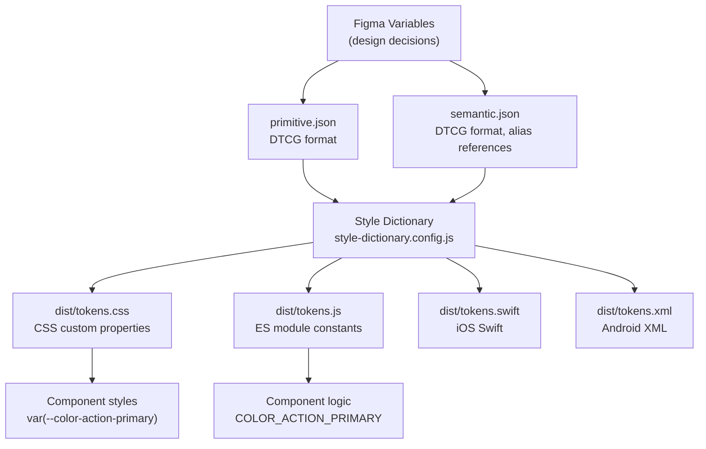

# Design Tokens

Every color, spacing value, border radius, and shadow that appears consistently across a product's interface exists because someone, at some point, made a decision about it. Design tokens are the mechanism by which those decisions stop living in engineers' heads, in Figma layer names, or in ad-hoc CSS variables, and start living in a structured, versioned, toolchain-readable format that every platform can consume simultaneously.

A design token is a named, typed pairing of a design decision and its value. The name carries the semantic intent; the type describes the category of value; the value is the raw data. What makes this definition useful is the combination of all three: a name without a type is ambiguous, a value without a name is a magic number, and neither without structure is a system.

The W3C Design Token Community Group (DTCG) has been formalizing a standard JSON format for tokens since 2019. Style Dictionary 4.x, Figma Variables, and an expanding set of design tools now support the DTCG format, making it the interoperability layer between design and engineering toolchains. This article covers the DTCG format in depth, the three-tier token hierarchy that every scalable system requires, the Style Dictionary build pipeline, and the CSS custom property delivery mechanism that brings tokens to the browser with no runtime overhead.

## Design Thinking

### The Three-Tier Token Hierarchy

The three-tier hierarchy is not an optional organizational preference — it is the architectural structure that separates a token system from a token list.

**Tier 1 — Primitive tokens** store raw values with no semantic meaning attached. A primitive token describes what exists in the design language: `color.blue.500: #3b82f6`, `space.4: 16px`, `font-size.lg: 1.125rem`. Primitive tokens are the vocabulary of the system. They answer "what values are available?" but not "when should a value be used?" They are exhaustive and non-normative.

**Tier 2 — Semantic tokens** map primitive tokens to intent. A semantic token describes when a value should appear: `color.action.primary: {color.blue.500}`, `space.inset.md: {space.4}`. Semantic tokens are the grammar of the system. They encode the design rules. Dark mode support lives entirely at this tier: the dark mode override switches `color.action.primary` from `{color.blue.500}` to `{color.blue.400}` — one alias change, zero component changes. Semantic tokens are selective and normative.

**Tier 3 — Component tokens** scope semantic decisions to a specific component: `button.background.default: {color.action.primary}`, `button.padding.horizontal: {space.inset.md}`. Component tokens provide a stable interface for component customization: a consumer who needs to override button background overrides the component token, not a semantic token that might affect dozens of other components. Component tokens are optional in systems that do not need component-level customization.

This structure has a direct consequence for dark mode architecture: only Tier 2 tokens need variants. Primitive tokens are theme-neutral; they are the same in every theme. Component tokens reference semantic tokens; they inherit theme behavior automatically. Teams that implement dark mode by duplicating all tokens at every tier have misunderstood the hierarchy.

### The W3C DTCG Format

The DTCG format uses `$value` and `$type` as the reserved property keys for token definitions within a JSON object. Grouping tokens into nested objects creates a namespace hierarchy. The full path from root object to token name becomes the token's reference path.

A DTCG color token:

```json
{
  "color": {
    "blue": {
      "500": {
        "$value": "#3b82f6",
        "$type": "color"
      }
    }
  }
}
```

The reference path is `color.blue.500`. In a Style Dictionary alias, this is written `{color.blue.500}`.

The DTCG format defines a set of standard `$type` values, including `color`, `dimension`, `fontFamily`, `fontWeight`, `duration`, `cubicBezier`, `number`, and the composite types `typography`, `shadow`, `border`, `transition`, and `strokeStyle`. Composite types group related sub-values under a single token:

```json
{
  "typography": {
    "heading": {
      "lg": {
        "$value": {
          "fontFamily": "{font-family.sans}",
          "fontSize": "{font-size.2xl}",
          "fontWeight": "{font-weight.bold}",
          "lineHeight": "{line-height.tight}"
        },
        "$type": "typography"
      }
    }
  }
}
```

Using DTCG format from the start ensures that token files are portable across tools. Figma's Variable import/export uses DTCG. Style Dictionary 4.x is built around DTCG. Design tooling that supports DTCG today or adds support later will be able to consume the token files without transformation.

### Style Dictionary as the Build Pipeline

Style Dictionary is the build system for design tokens. It accepts DTCG token JSON as input and emits any number of platform-specific output formats. The transformation pipeline has three stages:

1. **Load** — Style Dictionary reads all token files and merges them into a single dictionary. This is where the namespace hierarchy is assembled.
2. **Transform** — Each token is transformed according to the configured transform chain. Transforms modify token values (e.g., converting `px` to `rem`, converting hex to HSL), token names (e.g., converting dot-separated paths to kebab-case CSS variable names), or token attributes (e.g., adding a `category` attribute for filtering).
3. **Format** — The transformed tokens are passed to a formatter that emits the target platform file. Built-in formatters emit CSS custom properties, JavaScript ES module constants, CommonJS constants, iOS Swift files, Android XML, and others.

The Style Dictionary configuration file (`style-dictionary.config.js`) defines the token source files, the platforms to emit for, and the transforms and formats to apply per platform. Style Dictionary 4.x uses ESM by default.

### CSS Custom Properties as Browser Delivery

CSS custom properties are the standard delivery mechanism for design tokens in the browser. They have three properties that make them the right choice:

**Cascade inheritance** — CSS custom properties cascade and inherit exactly as other CSS properties do. This means that setting `--color-action-primary: #2563eb` on `:root` makes it available everywhere, and overriding it on `.dark` makes all components within a dark-themed subtree automatically adopt the override without any JavaScript involvement.

**No runtime overhead** — CSS custom properties are resolved by the browser at paint time. There is no JavaScript, no class computation, and no re-render cycle involved in theme switching when the switch is implemented as a class toggle on the `<html>` element that activates a CSS override block.

**Reference preservation with `outputReferences: true`** — When Style Dictionary emits CSS with `outputReferences: true`, alias references in the token source are preserved as CSS variable references in the output. `button.background.default: {color.action.primary}` becomes `--button-background-default: var(--color-action-primary)`. This means runtime overrides of `--color-action-primary` propagate automatically to all component tokens that reference it, without needing to override each component token individually.

## Best Practices

**Adopt DTCG format from the first token file.** The `$value` / `$type` syntax is the interoperability standard. Starting with legacy format and migrating later is a destructive operation across every tool that consumes the tokens.

**Never reference primitive tokens from component code.** This is the most common token architecture violation, and it eliminates the primary benefit of a token hierarchy. Component CSS and component JS constants MUST reference semantic tokens. The enforcement mechanism is code review and, in mature systems, a linter rule.

**Output `rem`, not `px`, for spacing and typography dimensions.** Users who configure a larger default font size in their browser settings receive proportionally scaled spacing and type when values are in `rem`. A Style Dictionary transform that divides `px` spacing values by 16 and emits `rem` is a one-time configuration that respects user accessibility preferences by default.

**Use `outputReferences: true` on the CSS platform.** This preserves the reference chain in generated CSS and enables runtime theme overrides via CSS variable assignment. The only reason to use `outputReferences: false` is when generating CSS for environments that do not support CSS variable nesting, which is effectively no longer a relevant constraint for modern browser targets.

**Version token packages alongside component packages.** Any rename, removal, or type change in a semantic token is a breaking change. Token packages SHOULD follow semantic versioning. The CHANGELOG MUST document token API changes explicitly. Teams that consume tokens as a dependency must be able to pin a version and upgrade deliberately.

**Structure token namespaces to survive brand expansion.** A token namespace designed for one brand will break when the second brand is introduced if all tokens live under a flat namespace. Semantic tokens SHOULD be brand-agnostic: `color.action.primary` expresses intent; `color.vivotek-blue` expresses a brand constraint. The former survives multi-brand; the latter does not.

## Token Pipeline Architecture



Figma exports DTCG JSON for primitive and semantic token tiers. Style Dictionary reads both files and emits platform-specific artifacts for every target. Browser-delivered components consume the CSS custom properties; component logic that needs token values at runtime imports the JS constants. Native platforms consume Swift and XML artifacts generated from the same source.

## Example

The following example demonstrates a complete, working token setup with DTCG format, Style Dictionary 4.x configuration, and generated output.

In the example below, component tokens are co-located in `semantic.json` for brevity. In a production token system, component tokens typically live in a separate `component.json` file added to the Style Dictionary `source` array.

### `tokens/primitive.json`

```json
{
  "color": {
    "blue": {
      "400": { "$value": "#60a5fa", "$type": "color" },
      "500": { "$value": "#3b82f6", "$type": "color" },
      "600": { "$value": "#2563eb", "$type": "color" }
    },
    "neutral": {
      "0":   { "$value": "#ffffff", "$type": "color" },
      "50":  { "$value": "#f8fafc", "$type": "color" },
      "900": { "$value": "#0f172a", "$type": "color" },
      "950": { "$value": "#020617", "$type": "color" }
    }
  },
  "space": {
    "1":  { "$value": "4px",  "$type": "dimension" },
    "2":  { "$value": "8px",  "$type": "dimension" },
    "3":  { "$value": "12px", "$type": "dimension" },
    "4":  { "$value": "16px", "$type": "dimension" },
    "5":  { "$value": "20px", "$type": "dimension" },
    "6":  { "$value": "24px", "$type": "dimension" }
  },
  "font-size": {
    "sm":   { "$value": "14px", "$type": "dimension" },
    "base": { "$value": "16px", "$type": "dimension" },
    "lg":   { "$value": "18px", "$type": "dimension" },
    "xl":   { "$value": "20px", "$type": "dimension" }
  },
  "border-radius": {
    "sm": { "$value": "4px",  "$type": "dimension" },
    "md": { "$value": "8px",  "$type": "dimension" },
    "lg": { "$value": "12px", "$type": "dimension" }
  }
}
```

### `tokens/semantic.json`

```json
{
  "color": {
    "action": {
      "primary":          { "$value": "{color.blue.500}", "$type": "color" },
      "primary-hover":    { "$value": "{color.blue.600}", "$type": "color" },
      "primary-dark":     { "$value": "{color.blue.400}", "$type": "color" }
    },
    "surface": {
      "page":             { "$value": "{color.neutral.0}",   "$type": "color" },
      "page-dark":        { "$value": "{color.neutral.950}", "$type": "color" },
      "elevated":         { "$value": "{color.neutral.50}",  "$type": "color" },
      "elevated-dark":    { "$value": "{color.neutral.900}", "$type": "color" }
    },
    "text": {
      "default":          { "$value": "{color.neutral.900}", "$type": "color" },
      "default-dark":     { "$value": "{color.neutral.50}",  "$type": "color" },
      "on-action":        { "$value": "{color.neutral.0}",   "$type": "color" }
    }
  },
  "space": {
    "inset": {
      "sm": { "$value": "{space.2}", "$type": "dimension" },
      "md": { "$value": "{space.4}", "$type": "dimension" },
      "lg": { "$value": "{space.6}", "$type": "dimension" }
    },
    "gap": {
      "sm": { "$value": "{space.2}", "$type": "dimension" },
      "md": { "$value": "{space.4}", "$type": "dimension" }
    }
  },
  // Component tokens co-located for brevity.
  // In larger systems, component tokens live in tokens/component.json
  // and are added to the Style Dictionary source array separately.
  "button": {
    "background":         { "$value": "{color.action.primary}",       "$type": "color" },
    "background-hover":   { "$value": "{color.action.primary-hover}",  "$type": "color" },
    "foreground":         { "$value": "{color.text.on-action}",        "$type": "color" },
    "padding-x":          { "$value": "{space.inset.md}",              "$type": "dimension" },
    "padding-y":          { "$value": "{space.inset.sm}",              "$type": "dimension" },
    "border-radius":      { "$value": "{border-radius.md}",            "$type": "dimension" }
  }
}
```

### `style-dictionary.config.js`

```js
import StyleDictionary from 'style-dictionary';

// px-to-rem transform: divides dimension values in px by 16
StyleDictionary.registerTransform({
  name: 'size/pxToRem',
  type: 'value',
  filter: (token) => token.$type === 'dimension',
  transform: (token) => {
    const val = parseFloat(token.$value);
    return `${val / 16}rem`;
  },
});

export default {
  usesDtcg: true,
  source: ['tokens/primitive.json', 'tokens/semantic.json'],
  platforms: {
    css: {
      transformGroup: 'css',
      transforms: ['name/kebab', 'size/pxToRem', 'color/css'],
      prefix: '',
      buildPath: 'dist/',
      files: [
        {
          destination: 'tokens.css',
          format: 'css/variables',
          options: {
            outputReferences: true,
            selector: ':root',
          },
        },
      ],
    },
    js: {
      transformGroup: 'js',
      transforms: ['name/constant', 'size/pxToRem', 'color/css'],
      buildPath: 'dist/',
      files: [
        {
          destination: 'tokens.js',
          format: 'javascript/es6',
        },
      ],
    },
  },
};
```

### `dist/tokens.css` (generated output)

The generated file shows CSS variable references rather than resolved values, because `outputReferences: true` was set. This is critical: the cascade chain is preserved in the output, enabling runtime theme overrides.

```css
:root {
  /* Primitive tokens — color */
  --color-blue-400: #60a5fa;
  --color-blue-500: #3b82f6;
  --color-blue-600: #2563eb;
  --color-neutral-0: #ffffff;
  --color-neutral-50: #f8fafc;
  --color-neutral-900: #0f172a;
  --color-neutral-950: #020617;

  /* Primitive tokens — space (rem output) */
  --space-1: 0.25rem;
  --space-2: 0.5rem;
  --space-3: 0.75rem;
  --space-4: 1rem;
  --space-5: 1.25rem;
  --space-6: 1.5rem;

  /* Primitive tokens — font-size (rem output) */
  --font-size-sm: 0.875rem;
  --font-size-base: 1rem;
  --font-size-lg: 1.125rem;
  --font-size-xl: 1.25rem;

  /* Primitive tokens — border-radius (rem output) */
  --border-radius-sm: 0.25rem;
  --border-radius-md: 0.5rem;
  --border-radius-lg: 0.75rem;

  /* Semantic tokens — color.action */
  --color-action-primary: var(--color-blue-500);
  --color-action-primary-hover: var(--color-blue-600);
  --color-action-primary-dark: var(--color-blue-400);

  /* Semantic tokens — color.surface */
  --color-surface-page: var(--color-neutral-0);
  --color-surface-page-dark: var(--color-neutral-950);
  --color-surface-elevated: var(--color-neutral-50);
  --color-surface-elevated-dark: var(--color-neutral-900);

  /* Semantic tokens — color.text */
  --color-text-default: var(--color-neutral-900);
  --color-text-default-dark: var(--color-neutral-50);
  --color-text-on-action: var(--color-neutral-0);

  /* Semantic tokens — space.inset */
  --space-inset-sm: var(--space-2);
  --space-inset-md: var(--space-4);
  --space-inset-lg: var(--space-6);

  /* Semantic tokens — space.gap */
  --space-gap-sm: var(--space-2);
  --space-gap-md: var(--space-4);

  /* Component tokens — button */
  --button-background: var(--color-action-primary);
  --button-background-hover: var(--color-action-primary-hover);
  --button-foreground: var(--color-text-on-action);
  --button-padding-x: var(--space-inset-md);
  --button-padding-y: var(--space-inset-sm);
  --button-border-radius: var(--border-radius-md);
}

/* Dark mode override — only semantic tokens need overrides */
.dark {
  --color-action-primary: var(--color-action-primary-dark);
  --color-surface-page: var(--color-surface-page-dark);
  --color-surface-elevated: var(--color-surface-elevated-dark);
  --color-text-default: var(--color-text-default-dark);
}
```

This is the complete output the pipeline produces. Notice that:

1. All dimension values are in `rem`, not `px`, because the `size/pxToRem` transform was applied.
2. Semantic tokens reference primitive tokens as CSS variables — `var(--color-blue-500)` — because `outputReferences: true` was set.
3. Component tokens reference semantic tokens — `var(--color-action-primary)` — preserving the full chain.
4. The `.dark` override block touches only semantic tokens. Because component tokens reference semantic tokens as CSS variables, the button's background automatically shifts to the dark-mode blue when `.dark` is applied to an ancestor — no additional component-level overrides are needed.

### Consuming tokens in a component

With the token CSS imported, a button component's stylesheet is clean and self-documenting:

```css
.button {
  background-color: var(--button-background);
  color: var(--button-foreground);
  padding: var(--button-padding-y) var(--button-padding-x);
  border-radius: var(--button-border-radius);
  transition: background-color 150ms ease;
}

.button:hover {
  background-color: var(--button-background-hover);
}
```

There is not a single hardcoded value in this stylesheet. Every value is a token reference. When the brand primary color changes, `primitive.json` changes, the pipeline runs, and the button is updated without touching the component file.

## Common Mistakes

**Setting `outputReferences: false` in the CSS platform configuration.** This causes Style Dictionary to resolve all references to their final values before emitting CSS. The generated `--button-background` becomes `#3b82f6` instead of `var(--color-action-primary)`. The CSS variable cascade chain is severed. Runtime theme overrides no longer propagate through the chain — to switch themes, every token at every tier must be explicitly overridden, which reintroduces the manual synchronization problem that the reference chain was designed to eliminate.

**Defining dark mode overrides at the primitive tier.** Dark mode in a token system is a semantic-tier concern. There is no such thing as a "dark blue-500" — blue-500 is a raw value. Dark mode means "in dark contexts, the action primary color should be the lighter blue-400 rather than the default blue-500." That mapping belongs in the semantic tier as `color.action.primary-dark: {color.blue.400}`. Teams that create dark-mode variants of every primitive token misunderstand what primitives are for, and produce a token file that is twice the size it needs to be.

## Related FEEs

- [FEE-900: Design Systems & UI Libraries Overview](./900.md) — The four-layer design system model, the role of tokens in the stack, and the category roadmap.
- [FEE-905: Theming & Dark Mode](./905.md) — How semantic tokens enable dark mode via CSS custom property overrides, `prefers-color-scheme`, and React theme state management.
- [FEE-207: CSS Custom Properties & Theming](../CSS%20and%20Layout%20Systems/207.md) — The CSS mechanics of custom properties: cascade, inheritance, fallback values, and how browser resolution works.

## References

- [W3C Design Token Community Group — Format Specification](https://www.designtokens.org/tr/drafts/format/) — The normative specification for the DTCG JSON format, including all defined `$type` values, composite token structures, and alias reference syntax.
- [Style Dictionary Documentation](https://styledictionary.com) — Official docs for Style Dictionary 4.x, including the DTCG migration guide, transform reference, format reference, and platform configuration API.
- [Style Dictionary 4 — DTCG Migration Guide](https://styledictionary.com/version-4/dtcg/) — Step-by-step instructions for migrating from legacy `value`/`type` format to DTCG `$value`/`$type` format, including the `outputReferences` behavior change.
- [Figma — Variables and Design Tokens](https://help.figma.com/hc/en-us/articles/15339657135383-Guide-to-variables-in-Figma) — Official Figma documentation for Variables, including DTCG import/export and the mapping between Figma variable types and DTCG `$type` values.
- Nathan Curtis — [Naming Tokens in Design Systems](https://medium.com/eightshapes-llc/naming-tokens-in-design-systems-9e86c7444676) — The canonical reference on token naming strategy, the tier model, and the semantic naming conventions that have become industry standard.
