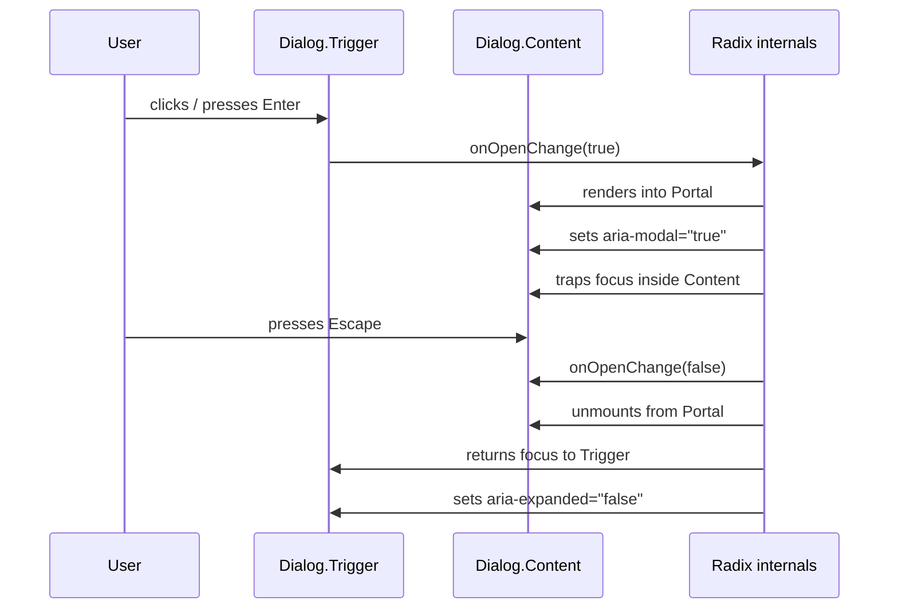

# Headless Component Libraries

Every product eventually needs a modal dialog. It needs to trap focus inside itself when open, dismiss on Escape, restore focus to the element that opened it when closed, and communicate its state to screen readers through a handful of ARIA attributes. None of that behavior is visible. None of it touches color, spacing, or typography. And yet teams spend weeks re-implementing it, introduce subtle bugs in the process, and end up with dialog components that fail screen reader testing in ways that are difficult to diagnose and harder to fix.

Headless component libraries are the answer to this recurring problem. A headless library separates the behavioral contract of a component — keyboard interaction, focus management, ARIA state — from the visual presentation entirely. The library authors implement the behavior once, to specification, tested against real assistive technology. Teams using the library provide only styles. The behavioral contract is inherited automatically.

This article covers how headless libraries work, the three major options in the React ecosystem — Radix UI, Ariakit, and Headless UI — the `asChild` pattern that makes headless composition practical, and the rules for using headless primitives without accidentally breaking the behavior they provide.

## Principle

Accessibility is not a feature added after styling — it is a behavioral contract that MUST be authored once and inherited everywhere. Every interactive component in a product's UI has a WAI-ARIA interaction pattern: which keyboard events it handles, which ARIA attributes it maintains, which focus management rules apply. These patterns exist in the specification and are tested by screen readers. When a team implements them correctly, once, in a shared primitive, every product that consumes that primitive inherits correct behavior without any additional effort.

Teams MUST NOT re-implement keyboard navigation, focus trapping, or ARIA attribute management from scratch. The cost of a correct implementation is high: the WAI-ARIA Authoring Practices Guide runs to hundreds of pages; screen reader behavior varies across AT/browser combinations; and focus management edge cases — Escape during a transition, focus returning to a destroyed element, nested dialog interactions — are easy to miss and hard to test manually. Libraries like Radix UI have already absorbed that cost. Using them is not a shortcut; it is the correct architectural decision.

When composing headless primitives, teams MUST NOT suppress keyboard events that the primitive depends on. Calling `event.stopPropagation()` or `event.preventDefault()` on events inside a Radix dialog — particularly Escape — breaks the behavioral contract the library provides. The developer sees no immediate error, but the component is now non-conformant to the WAI-ARIA pattern.

Teams SHOULD verify ARIA attribute output with a real screen reader after every custom composition. Headless libraries manage attribute values programmatically, but they cannot guarantee that the announced text makes sense for a given composition. An icon-only close button, for example, will have the correct `role="button"` and be keyboard-accessible, but will announce as an unnamed button unless the developer provides `aria-label`.

## Design Thinking

### What "Headless" Means

The word "headless" describes a component that has behavior but no visual output. A headless dialog manages open/closed state, mounts and unmounts its content, traps focus inside the content when open, listens for Escape, returns focus to the trigger when closing, and sets `aria-modal`, `aria-expanded`, and the appropriate `role` attributes. It renders no colors, no borders, no shadows, no transitions. Those are the developer's responsibility.

This division is not aesthetic. It solves a real architectural problem: behavior and styles have completely different change rates and ownership. Behavior is specified by WAI-ARIA, changes rarely, and MUST be correct. Styles are dictated by the design system, change frequently, and can vary per brand, per theme, and per context. Coupling them means every style change risks breaking behavior. Separating them means style changes are safe by construction.

### Radix UI: Compound Components and asChild

Radix UI is the most widely adopted headless library in the React ecosystem. It provides over 30 primitives — Dialog, Tooltip, Popover, Select, Dropdown Menu, Tabs, Toggle, Slider, and more — each implemented to the corresponding WAI-ARIA pattern.

Radix uses a compound component pattern. A dialog is not a single `<Dialog>` component with a dozen props — it is a set of primitives that compose explicitly:

```tsx
import * as Dialog from '@radix-ui/react-dialog';

<Dialog.Root>
  <Dialog.Trigger>Open</Dialog.Trigger>
  <Dialog.Portal>
    <Dialog.Overlay />
    <Dialog.Content>
      <Dialog.Title>Title</Dialog.Title>
      <Dialog.Description>Description</Dialog.Description>
      <Dialog.Close>Close</Dialog.Close>
    </Dialog.Content>
  </Dialog.Portal>
</Dialog.Root>
```

Each part of the composition has a specific role:

- `Dialog.Root` — owns the open/closed state and provides it to all children via context
- `Dialog.Trigger` — the element that opens the dialog; receives `aria-expanded` and `aria-haspopup`
- `Dialog.Portal` — renders content into a portal outside the current DOM subtree, preventing stacking context issues
- `Dialog.Overlay` — the backdrop; Radix attaches the dismiss-on-click handler here
- `Dialog.Content` — the dialog panel; Radix mounts the focus trap, sets `role="dialog"`, `aria-modal="true"`, and manages Escape handling here
- `Dialog.Close` — a button that triggers close; Radix wires the `onClick` handler automatically

The `asChild` prop is the mechanism that makes this composition flexible without adding extra DOM nodes. When `asChild` is set on a Radix primitive, Radix merges its behavior props onto the single child element rather than rendering its own wrapper element:

```tsx
// Without asChild: Radix renders <button>, then <a> inside it — invalid HTML
<Dialog.Trigger>
  <a href="#">Open dialog</a>
</Dialog.Trigger>

// With asChild: Radix merges its props onto <a> — single element, valid HTML
<Dialog.Trigger asChild>
  <a href="#">Open dialog</a>
</Dialog.Trigger>
```

Without `asChild`, the developer gets a Radix-rendered element wrapping their element — often a `<button>` wrapping an `<a>`, which is invalid HTML and breaks the ARIA tree. With `asChild`, the developer's element receives all the behavior props directly. The DOM is clean; the ARIA tree is correct.

The `asChild` pattern is implemented through Radix's `Slot` component, which uses `React.cloneElement` to merge refs and event handlers onto a single child. Teams can use `Slot` directly when building their own compound primitives that need the same forwarding behavior.

### Ariakit: Explicit State Objects

Ariakit takes a different approach: rather than managing state internally through context, it exposes state objects that the developer creates explicitly using hooks like `useDialogStore`. This makes state available outside the component tree — useful when dialog open/close state needs to be driven by URL routing, URL search params, or an external state manager.

```tsx
import { useDialogStore, Dialog, DialogHeading, Button } from '@ariakit/react';

function MyDialog() {
  const dialog = useDialogStore();
  return (
    <>
      <Button store={dialog}>Open</Button>
      <Dialog store={dialog}>
        <DialogHeading>Title</DialogHeading>
        {/* content */}
      </Dialog>
    </>
  );
}
```

Ariakit is more granular than Radix. It exposes individual state setters and getters, allows composing behaviors across unrelated components, and handles complex scenarios like controlled dialogs driven by external state with less boilerplate. The trade-off is a steeper API surface: simpler use cases require more explicit wiring than Radix's compound component model.

### Headless UI: Tailwind-First Simplicity

Headless UI is maintained by Tailwind Labs and targets React and Vue projects. Its API is the simplest of the three, making common cases fast to implement:

```tsx
import { Dialog } from '@headlessui/react';

<Dialog open={isOpen} onClose={() => setIsOpen(false)}>
  <Dialog.Panel>
    <Dialog.Title>Title</Dialog.Title>
    {/* content */}
  </Dialog.Panel>
</Dialog>
```

Headless UI covers the most common primitives — Dialog, Disclosure, Listbox, Menu, Popover, RadioGroup, Switch, Tabs, Transition — with clean, conventional APIs. It integrates tightly with Tailwind's `transition` utilities. The limitation is coverage: it has far fewer primitives than Radix, lacks some of the more complex patterns (Tooltip, Context Menu, Slider), and its Vue support means some React-specific patterns are constrained by cross-framework parity requirements.

### Choosing a Library

The decision depends on the project's primary needs:

**Choose Radix UI** for most React projects. It has the broadest primitive coverage, the largest ecosystem, and is the foundation that shadcn/ui is built on. The compound component pattern has a learning curve but produces clean, readable JSX. If the project uses shadcn/ui, Radix is already the dependency — there is no separate installation required.

**Choose Ariakit** when fine-grained state control is a requirement: dialogs controlled by URL state, complex nested interactions, or scenarios where multiple components share state that must be synchronized precisely. Ariakit's explicit store pattern handles these cases with less imperative workaround than Radix's context-based approach.

**Choose Headless UI** for Tailwind-first projects where the primitive coverage is sufficient and tight Transition integration is a priority. It is the right choice for projects that use the Tailwind ecosystem comprehensively and do not need the long tail of Radix's primitive set.

## Best Practices

**Choose Radix UI for most React projects.** It provides the most comprehensive primitive set, has the widest community support, and its compound component pattern is well-documented. When using shadcn/ui, Radix is already in the dependency tree — there is no additional library choice to make.

**Use `asChild` instead of wrapping primitives in extra elements.** An extra wrapper element between a Radix primitive and its intended semantic element breaks the ARIA tree. `<button><a>Link</a></button>` is invalid HTML. `<Dialog.Trigger asChild><a>Link</a></Dialog.Trigger>` is clean. Reach for `asChild` whenever the default element type Radix would render is not the element the design requires.

**Do not suppress Radix keyboard events.** Calling `event.stopPropagation()` or `event.preventDefault()` inside Radix content — particularly on `keydown` events — breaks the behavioral contract. Radix's focus trap and Escape handling depend on events bubbling correctly. If a child component inside a Dialog is intercepting Escape for its own purpose (a nested search input, for example), coordinate the behavior explicitly rather than suppressing the event.

**Provide `aria-label` on every icon-only interactive element.** Headless libraries provide correct roles and keyboard behavior, but they cannot generate meaningful accessible names for elements with no text content. A close button that contains only an SVG icon will announce as "button" — without any indication of its purpose — unless `aria-label="Close"` is added explicitly. This applies to all icon-only buttons, not just Radix close buttons.

**Test with a real screen reader after every custom composition.** VoiceOver on macOS is accessible at no cost; NVDA on Windows is free. The test does not need to be exhaustive — open the component, navigate through it with keyboard only, and listen to what the screen reader announces. ARIA attributes being structurally correct does not guarantee that the announced text is comprehensible. Real screen reader testing catches the gap between "structurally valid" and "actually usable."

**Do not re-implement what headless libraries already provide.** Adding a manual `document.addEventListener('keydown', ...)` to handle Escape inside a Radix Dialog introduces a second handler competing with Radix's own handler. The result is unpredictable. Trust the library's behavioral contract and work within it.

## Radix Dialog Keyboard Behavior

The following sequence diagram illustrates the complete keyboard interaction flow for a Radix Dialog, from trigger activation through close and focus return.



The focus trap is implemented by Radix intercepting Tab and Shift+Tab inside the Content and cycling through focusable descendants. When the dialog closes, Radix stores a reference to the element that was focused when the dialog opened and returns focus to it — this is the "return-focus" behavior required by the WAI-ARIA dialog pattern.

## Example

The following example demonstrates a complete, accessible modal dialog using `@radix-ui/react-dialog` with Tailwind CSS for styling. All keyboard interaction, focus trapping, ARIA attribute management, and focus return behavior are provided by Radix. The developer provides only the visual structure and styles.

```tsx
import * as Dialog from '@radix-ui/react-dialog';
import { X } from 'lucide-react';

interface ConfirmDialogProps {
  trigger: React.ReactNode;
  title: string;
  description: string;
  onConfirm: () => void;
}

export function ConfirmDialog({
  trigger,
  title,
  description,
  onConfirm,
}: ConfirmDialogProps) {
  return (
    <Dialog.Root>
      {/*
        asChild: Radix merges its behavior props (aria-haspopup, aria-expanded,
        onClick handler) directly onto the consumer-provided element.
        No extra wrapper <button> is rendered around the trigger element.
      */}
      <Dialog.Trigger asChild>
        {trigger}
      </Dialog.Trigger>

      <Dialog.Portal>
        {/*
          Overlay: covers the viewport behind the dialog.
          Radix attaches dismiss-on-click here automatically.
        */}
        <Dialog.Overlay
          className="fixed inset-0 bg-black/50 data-[state=open]:animate-in data-[state=closed]:animate-out data-[state=closed]:fade-out-0 data-[state=open]:fade-in-0"
        />

        {/*
          Content: the dialog panel.
          Radix sets role="dialog", aria-modal="true", manages the focus trap,
          and handles Escape key dismissal here.
        */}
        <Dialog.Content
          className="fixed left-1/2 top-1/2 -translate-x-1/2 -translate-y-1/2 w-full max-w-md rounded-lg bg-white p-6 shadow-lg focus:outline-none"
        >
          <Dialog.Title className="text-lg font-semibold text-gray-900">
            {title}
          </Dialog.Title>

          <Dialog.Description className="mt-2 text-sm text-gray-600">
            {description}
          </Dialog.Description>

          <div className="mt-6 flex justify-end gap-3">
            {/*
              Close wraps a button that cancels the action.
              Radix wires the onClick handler to close the dialog automatically.
            */}
            <Dialog.Close asChild>
              <button
                type="button"
                className="rounded-md px-4 py-2 text-sm font-medium text-gray-700 ring-1 ring-gray-300 hover:bg-gray-50"
              >
                Cancel
              </button>
            </Dialog.Close>

            <button
              type="button"
              className="rounded-md bg-red-600 px-4 py-2 text-sm font-medium text-white hover:bg-red-700"
              onClick={onConfirm}
            >
              Confirm
            </button>
          </div>

          {/*
            Icon-only close button in the top-right corner.
            aria-label="Close" is required: the button has no text content,
            so without aria-label it announces as an unnamed "button".
          */}
          <Dialog.Close
            aria-label="Close"
            className="absolute right-4 top-4 rounded-sm text-gray-400 hover:text-gray-600 focus:outline-none focus-visible:ring-2 focus-visible:ring-blue-500"
          >
            <X className="h-4 w-4" aria-hidden="true" />
          </Dialog.Close>
        </Dialog.Content>
      </Dialog.Portal>
    </Dialog.Root>
  );
}
```

### Usage

```tsx
// The trigger can be any element — asChild merges Radix behavior onto it directly.
<ConfirmDialog
  trigger={
    <button type="button" className="rounded-md bg-red-600 px-4 py-2 text-white">
      Delete item
    </button>
  }
  title="Delete item?"
  description="This action cannot be undone. The item will be permanently removed."
  onConfirm={handleDelete}
/>
```

Several things to note in the implementation:

1. `Dialog.Trigger asChild` — the consumer passes any React element as the trigger. Radix merges `aria-haspopup`, `aria-expanded`, and the click handler onto that element. No extra DOM node is introduced.
2. `Dialog.Portal` — renders the overlay and content outside the current DOM subtree, preventing clipping from `overflow: hidden` ancestors and stacking context conflicts.
3. `Dialog.Content` — Radix sets `role="dialog"` and `aria-modal="true"` on this element automatically. The developer does not need to set these.
4. The icon-only `Dialog.Close` has `aria-label="Close"` and the icon has `aria-hidden="true"` — this ensures screen readers announce "Close, button" rather than reading out the SVG content.
5. Tailwind's `data-[state=open]` and `data-[state=closed]` attribute selectors work because Radix sets `data-state` on its elements. The developer can use these for CSS transitions without managing animation state in JavaScript.

## Common Mistakes

**Wrapping Radix primitives in extra `<div>` elements.** Adding `<div>` wrappers between Radix elements and their intended semantic role breaks the ARIA tree. `<Dialog.Trigger><div><button>Open</button></div></Dialog.Trigger>` results in Radix setting `aria-expanded` on the outer `<button>` that Radix renders, not on the inner button the developer intended. The fix is `asChild`: `<Dialog.Trigger asChild><button>Open</button></Dialog.Trigger>` collapses the nesting to a single element.

**Calling `event.preventDefault()` on Escape inside a Dialog.** Radix's Dialog listens for Escape at the document level to close the dialog and return focus to the trigger. If a child inside `Dialog.Content` calls `event.preventDefault()` on `keydown` for the Escape key — perhaps to prevent a text input from losing its value — Radix's handler is cancelled. The dialog no longer closes on Escape. Focus is not returned. The component no longer conforms to the WAI-ARIA dialog pattern. If Escape needs to be intercepted for a nested component, use `onEscapeKeyDown` on `Dialog.Content` to coordinate the behavior deliberately rather than suppressing the event at the child.

**Forgetting `aria-label` on icon-only close buttons.** A close button containing only an icon will announce as "button" to screen reader users — they hear a button exists but cannot determine its purpose. The WAI-ARIA requirement for interactive elements is an accessible name. For icon-only buttons, `aria-label="Close"` provides it. Mark the icon itself as `aria-hidden="true"` to prevent the screen reader from attempting to announce its SVG path or title element.

## Related FEEs

- [FEE-1001: ARIA & Semantic HTML](../Accessibility/1001.md) — The ARIA attribute model, landmark roles, and how browsers compute accessible names from element content.
- [FEE-1002: Keyboard Navigation & Focus Management](../Accessibility/1002.md) — Focus trap implementation, focus ring visibility requirements, and roving tabindex patterns — the underlying primitives that headless libraries manage on the developer's behalf.
- [FEE-903: Copy-Paste Libraries](./903.md) — shadcn/ui, which is built on Radix UI primitives with Tailwind styling pre-applied, making it a higher-level alternative to using Radix directly.

## References

- [Radix UI Primitives Documentation](https://www.radix-ui.com/primitives) — Official documentation for every Radix primitive, including prop references, keyboard interaction tables, and ARIA attribute descriptions.
- [Ariakit Documentation](https://ariakit.org) — Official docs for Ariakit, including the store-based state model, component API reference, and examples of complex state synchronization patterns.
- [Headless UI Documentation](https://headlessui.com) — Official documentation for Headless UI (React and Vue), including component API and Tailwind integration examples.
- [WAI-ARIA Authoring Practices Guide — Dialog (Modal) Pattern](https://www.w3.org/WAI/ARIA/apg/patterns/dialog-modal/) — The normative specification for dialog keyboard interaction, focus management requirements, and required ARIA attributes. The reference against which all dialog implementations should be tested.
- [Radix UI — Composition (asChild)](https://www.radix-ui.com/primitives/docs/guides/composition) — Official guide to the `asChild` prop and the `Slot` component, including the merging behavior for refs and event handlers.
