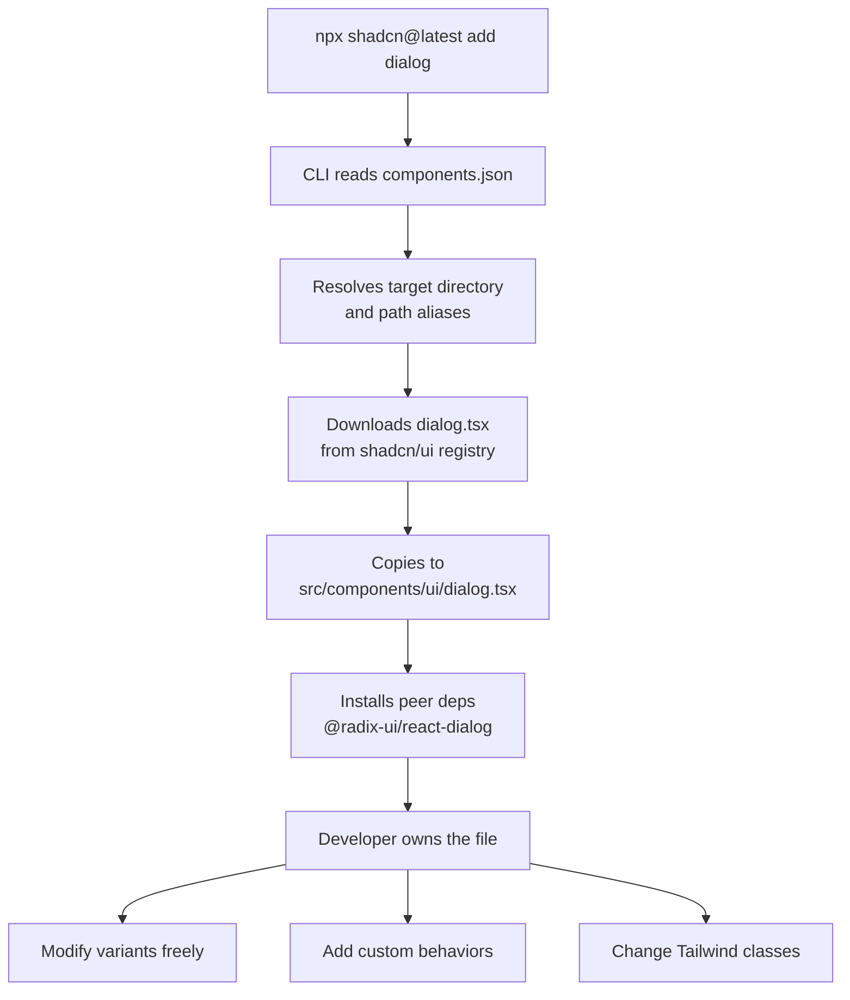

# Copy-Paste Component Libraries

For most of the history of front-end component sharing, the model was simple: install a package from npm, import the component, and use it. When you needed to change something — a prop the library did not expose, a variant the design required, a behavior the library's API made difficult — you reached for `className` overrides, wrapper components, or monkey-patches, and accepted the friction as the cost of using a library.

Copy-paste component libraries invert this model. Instead of publishing a versioned package that consumers install and cannot modify, a copy-paste library provides a CLI that copies source files directly into the consumer's codebase. The files become the developer's own code. There is no upstream version to fight. Every prop, every variant, every behavior is visible and changeable because the source is sitting in `src/components/ui/`.

This article explains the architecture of copy-paste libraries — using shadcn/ui as the canonical example — the `class-variance-authority` (cva) pattern that makes variant management composable, and the tradeoffs that should inform whether a project uses a copy-paste library, a versioned library, or both. It also covers the `cn` utility, compound variants, and the practical mechanics of keeping owned component source up to date with upstream changes.

## Design Thinking

### The shadcn/ui Model

shadcn/ui is the most widely adopted copy-paste component library in the React ecosystem. Its installation model is a CLI command:

```bash
npx shadcn@latest add button
```

This command reads `components.json` — the project's configuration file — determines the target directory, downloads `button.tsx` from the shadcn/ui repository, writes it into `src/components/ui/button.tsx`, and installs the required peer dependencies. The developer now has a file they own. There is no `node_modules/shadcn-ui` to update, no API boundary to stay within, no `!important` overrides needed.

The `components.json` file configures the entire project's integration:

```json
{
  "style": "default",
  "rsc": true,
  "tsx": true,
  "tailwind": {
    "config": "tailwind.config.ts",
    "css": "app/globals.css",
    "baseColor": "slate",
    "cssVariables": true
  },
  "aliases": {
    "components": "@/components",
    "utils": "@/lib/utils"
  }
}
```

The `style` field selects between two visual aesthetics (`default` and `new-york`). The `aliases` field maps to TypeScript path aliases, so the CLI writes imports using the project's alias conventions rather than relative paths.

### Architectural Stack

shadcn/ui components are built from a specific four-layer stack:

**Radix UI primitives** provide the behavioral and accessibility foundation. A `<Button>` has no Radix dependency, but a `<Dialog>` wraps `@radix-ui/react-dialog`, which provides focus trapping, Escape handling, `aria-modal`, and the `asChild` composition primitive. Developers get correct keyboard behavior and ARIA attributes without implementing them.

**Tailwind CSS** provides the styling layer. Components use utility classes directly in JSX, which means the full design system is expressed in code, hot-reloads immediately, and produces no runtime CSS-in-JS overhead.

**`class-variance-authority` (cva)** manages variant composition. Variants are defined declaratively, composed without string concatenation errors, and integrate with TypeScript so component props match the variant map.

**`cn` utility** merges class names. It wraps `tailwind-merge` (which resolves Tailwind class conflicts, such as `p-4` overriding `p-2`) and `clsx` (which handles conditional class logic). Every component calls `cn(buttonVariants(...), className)` to accept consumer-provided overrides safely.

### The `cva` Pattern

`class-variance-authority` solves a specific problem: Tailwind class strings for variants grow quickly and become difficult to maintain as strings. Consider a button with three variants and two sizes — that is six combinations, each requiring a distinct class string. Without a variant system, the result is nested ternaries or string concatenation that is easy to get wrong and hard to read.

`cva` provides a declarative alternative:

```ts
import { cva } from 'class-variance-authority';

const buttonVariants = cva(
  // Base classes applied to every variant
  'inline-flex items-center justify-center rounded-md text-sm font-medium transition-colors focus-visible:outline-none focus-visible:ring-2 focus-visible:ring-ring focus-visible:ring-offset-2 disabled:pointer-events-none disabled:opacity-50',
  {
    variants: {
      variant: {
        default: 'bg-primary text-primary-foreground hover:bg-primary/90',
        secondary: 'bg-secondary text-secondary-foreground hover:bg-secondary/80',
        outline: 'border border-input bg-background hover:bg-accent hover:text-accent-foreground',
        ghost: 'hover:bg-accent hover:text-accent-foreground',
        destructive: 'bg-destructive text-destructive-foreground hover:bg-destructive/90',
      },
      size: {
        default: 'h-10 px-4 py-2',
        sm: 'h-9 rounded-md px-3',
        lg: 'h-11 rounded-md px-8',
        icon: 'h-10 w-10',
      },
    },
    defaultVariants: {
      variant: 'default',
      size: 'default',
    },
  }
);
```

The variant map is a plain object. `cva` computes the correct class string from the variant keys. TypeScript infers the variant prop types automatically from the map, so `variant="nonexistent"` is a type error. Variant combinations are composable — `buttonVariants({ variant: 'outline', size: 'sm' })` returns the correct merged class string without any manual string concatenation.

### When Copy-Paste Beats Versioned

Copy-paste is the right default for teams that have:

- **A non-standard design language.** If the product's design diverges significantly from any library's defaults, owned source means changes are local diffs rather than upstream workarounds.
- **A small team with unified ownership.** When one team owns all components, there is no consumer upgrade path problem — every component update is applied immediately.
- **Iteration speed as a priority over API stability.** Copy-paste components can change their API without a semver event, which is appropriate when the team consuming the component is also the team maintaining it.

### When Versioned Beats Copy-Paste

Versioned libraries are the right default for teams that have:

- **Multiple consuming teams.** A versioned package provides a clear upgrade path. Consumers can pin to a version, read a changelog, and upgrade on their own schedule.
- **A dedicated design system team.** When the team building components is not the team consuming them, a versioned package formalizes the API boundary and enables the design system team to refactor internals without breaking consumers unexpectedly.
- **Consumers who need upgrade paths.** `package.json` version ranges, changelogs, and major version bumps are the communication mechanism. Without versioning, coordinating breaking changes across consumers is done informally.

### Compound Variants

`cva` supports compound variants — variants that only apply when multiple variant dimensions have specific values simultaneously. This is useful for cases where the combination of `variant="outline"` and `size="icon"` requires a different padding than `variant="default"` and `size="icon"`:

```ts
const buttonVariants = cva('...base...', {
  variants: {
    variant: { default: '...', outline: '...' },
    size: { default: '...', icon: '...' },
  },
  compoundVariants: [
    {
      variant: 'outline',
      size: 'icon',
      class: 'border-2', // extra class applied only for this combination
    },
  ],
  defaultVariants: { variant: 'default', size: 'default' },
});
```

Compound variants prevent the alternative: a growing `if (variant === 'outline' && size === 'icon')` condition tree inside the component render function. The logic lives in the `cva` config, not in JSX.

### The `cn` Utility

The `cn` function — typically implemented as:

```ts
import { clsx, type ClassValue } from 'clsx';
import { twMerge } from 'tailwind-merge';

export function cn(...inputs: ClassValue[]) {
  return twMerge(clsx(inputs));
}
```

— is a small but important piece of the shadcn/ui stack. `clsx` handles conditional class logic (`cn('base', isActive && 'active', { disabled: isDisabled })`). `tailwind-merge` resolves Tailwind class conflicts by understanding the utility naming conventions — it knows that `p-4` should override `p-2` rather than adding both classes. Without `tailwind-merge`, consumer-provided `className` props that include Tailwind utilities would silently fail to override the component's base classes.

### Keeping owned source synchronized with upstream

One friction point of the copy-paste model is staying aware of upstream improvements. When shadcn/ui publishes an updated component that fixes an accessibility defect or adds a commonly needed variant, there is no package manager mechanism that notifies the team. A practical approach is to run `npx shadcn@latest diff` periodically, which compares each owned component file against the current upstream source and reports the differences. The output is a list of line-level changes, not an automatic merge — the team reviews each diff, decides which upstream changes to incorporate, and applies them manually. This preserves local customizations while making upstream improvements visible and opt-in rather than either missing entirely or overwriting local changes automatically.

Tracking upstream changes is most important for accessibility and security-related updates. A Radix UI release that patches a focus-trap bug, or a shadcn/ui update that corrects an ARIA attribute, should be applied promptly. Teams that treat owned component source as a snapshot from the day of installation, never reviewed against upstream again, accumulate accessibility debt invisibly.
Adding a recurring review step — quarterly, or aligned with major Radix UI releases — keeps the debt manageable without requiring a dedicated synchronization sprint.

### Catalyst

Catalyst, published by Tailwind Labs, uses the same copy-paste model as shadcn/ui but with a different aesthetic — it targets a more polished, commercially-oriented visual style and ships as a paid product through Tailwind UI. Teams choosing between the two should evaluate aesthetics and base component coverage, not the model, since both are owned-source copy-paste libraries.

## Best Practices

**Run `npx shadcn@latest add` rather than copying files manually.** The CLI does more than copy a file: it resolves the target directory from `components.json`, installs peer dependencies, and writes imports using the project's configured path aliases. Manual copying misses at least one of these steps.

**Extend variants using `cva()`, not className overrides.** When a component needs a new variant — `destructive-outline`, `brand`, `ghost-sm` — add it to the `cva` variant map in the component file. This keeps the variant logic in one place, maintains TypeScript prop completeness, and avoids the specificity battles that come with applying conditional overrides at the call site.

**Keep `cn` as the only Tailwind merge utility.** `tailwind-merge` resolves class conflicts by understanding Tailwind's utility naming conventions. Using both `tailwind-merge` and another merge utility, or calling `clsx` directly for Tailwind class merging, produces class conflicts that are silent at runtime but visually incorrect. The `cn` wrapper ensures all Tailwind class merging passes through `tailwind-merge`.

**Re-run `npx shadcn@latest add <component>` to update a component, then review the diff before committing.** shadcn/ui publishes updated component source periodically. Re-running the add command overwrites the component file with the latest version. Review the diff: the update may include bug fixes worth keeping, or it may overwrite customizations the team made. Treat the update as a patch to evaluate, not an automatic upgrade.

**Do not treat `src/components/ui/` as a black box.** The entire value of the copy-paste model is that the files are readable and modifiable. Read the component source when debugging unexpected behavior. The source is the documentation.

**Organize shared utility types separately from component files.** When multiple components share the same `size` or `intent` variant values, extract a shared `variants.ts` module that re-exports the `cva` variant definitions. This prevents the variant maps from drifting out of sync across components that are supposed to share the same size scale.

**Audit `components.json` when onboarding new developers.** The `aliases` configuration determines where imports resolve. A developer who sets up the project without the TypeScript path aliases configured in `tsconfig.json` will see import errors immediately. Document the required tsconfig paths alongside the `components.json` setup step.

**MUST evaluate whether the long-term cost of fighting a versioned library's prop API exceeds the cost of maintaining owned source before committing to a versioned component library.** When product requirements diverge significantly from a library's defaults, the accumulated workarounds — className overrides, wrapper components, prop-forwarding hacks — impose an ongoing tax on every feature built with that library. Owned source eliminates the constraint entirely and makes every divergence a local diff rather than an upstream negotiation.

**SHOULD default to copy-paste for greenfield projects with a dedicated design language.** When the product's visual identity differs materially from any published library's defaults, adopting a copy-paste library avoids compounding friction from day one. The team owns the source from the start and never accumulates workarounds against an upstream API that was not designed for their design language.

**SHOULD prefer versioned libraries when multiple teams consume the same component set.** A versioned package gives each consuming team an explicit upgrade path: they can pin to a version, read a changelog, and schedule upgrades independently. Without versioning, coordinating breaking changes across consumers requires informal communication that scales poorly as the number of consuming teams grows.

## Add Command Flow

The following diagram illustrates what happens when a developer runs `npx shadcn@latest add dialog`.



## Example

The following example demonstrates adding a `destructive-outline` variant to a shadcn/ui Button component. This is the correct pattern: modify the `cva` variant map in the owned component file, extend the TypeScript props automatically, and use the new variant at call sites with full type safety.

```tsx
// src/components/ui/button.tsx
// Owned file — modified to add a custom variant

import * as React from 'react';
import { Slot } from '@radix-ui/react-slot';
import { cva, type VariantProps } from 'class-variance-authority';
import { cn } from '@/lib/utils';

const buttonVariants = cva(
  'inline-flex items-center justify-center rounded-md text-sm font-medium transition-colors focus-visible:outline-none focus-visible:ring-2 focus-visible:ring-ring focus-visible:ring-offset-2 disabled:pointer-events-none disabled:opacity-50',
  {
    variants: {
      variant: {
        default: 'bg-primary text-primary-foreground hover:bg-primary/90',
        secondary: 'bg-secondary text-secondary-foreground hover:bg-secondary/80',
        outline: 'border border-input bg-background hover:bg-accent hover:text-accent-foreground',
        ghost: 'hover:bg-accent hover:text-accent-foreground',
        destructive: 'bg-destructive text-destructive-foreground hover:bg-destructive/90',
        // Custom variant added to the owned component file.
        // No className override needed at call sites — this is part of the variant map.
        'destructive-outline':
          'border border-destructive text-destructive bg-background hover:bg-destructive hover:text-destructive-foreground',
      },
      size: {
        default: 'h-10 px-4 py-2',
        sm: 'h-9 rounded-md px-3',
        lg: 'h-11 rounded-md px-8',
        icon: 'h-10 w-10',
      },
    },
    defaultVariants: {
      variant: 'default',
      size: 'default',
    },
  }
);

// VariantProps infers the TypeScript type from the cva config.
// variant: "destructive-outline" is now a valid prop value.
export interface ButtonProps
  extends React.ButtonHTMLAttributes<HTMLButtonElement>,
    VariantProps<typeof buttonVariants> {
  asChild?: boolean;
}

const Button = React.forwardRef<HTMLButtonElement, ButtonProps>(
  ({ className, variant, size, asChild = false, ...props }, ref) => {
    const Comp = asChild ? Slot : 'button';
    return (
      <Comp
        className={cn(buttonVariants({ variant, size }), className)}
        ref={ref}
        {...props}
      />
    );
  }
);
Button.displayName = 'Button';

export { Button, buttonVariants };
```

### Usage

```tsx
// Both variants are type-safe — TypeScript knows all valid variant values.

// Existing destructive variant
<Button variant="destructive">Delete</Button>

// New custom variant — no className override, no specificity battle
<Button variant="destructive-outline">Remove from list</Button>

// Size still composes correctly with the new variant
<Button variant="destructive-outline" size="sm">Remove</Button>
```

The key difference from a className override approach: the variant is declared once in the `cva` config, TypeScript validates its name at every call site, and the class string is computed by `cva` without string concatenation. Adding it required editing one file — the component file the team owns.

## Related FEEs

- [FEE-902: Headless Component Libraries](./902.md) — shadcn/ui is built on Radix UI headless primitives; the accessibility and behavior of interactive components comes from Radix.
- [FEE-501: Component Composition Patterns](../Component%20Architecture%20and%20Design%20Patterns/501.md) — The composition patterns that copy-paste components rely on: `asChild`, `forwardRef`, compound components.
- [FEE-206: Modern CSS Frameworks](../CSS%20and%20Layout%20Systems/206.md) — Tailwind CSS, which is the styling layer in the shadcn/ui stack.

## References

- [shadcn/ui Documentation](https://ui.shadcn.com) — Official docs, including `components.json` configuration reference, available components, and CLI usage.
- [class-variance-authority (cva) Documentation](https://cva.style) — Official docs for cva: variant maps, compound variants, and TypeScript integration.
- [tailwind-merge Documentation](https://github.com/dcastil/tailwind-merge) — How `tailwind-merge` resolves conflicting Tailwind utility classes.
- [Catalyst — Tailwind UI](https://tailwindui.com/templates/catalyst) — Tailwind Labs' commercially licensed copy-paste component library, demonstrating the same model with a different aesthetic.
- [Radix UI Slot](https://www.radix-ui.com/primitives/docs/utilities/slot) — The `Slot` primitive used internally by shadcn/ui components to implement `asChild` prop forwarding.
- [shadcn/ui components.json reference](https://ui.shadcn.com/docs/components-json) — Detailed reference for all `components.json` configuration fields, including style, Tailwind config, and path alias setup.
