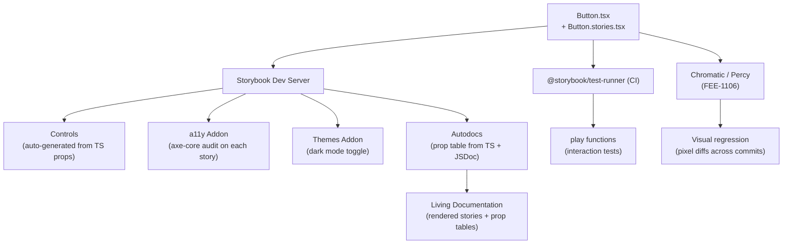

# Storybook & Component Documentation

A component exists in the codebase. It has props. It renders output. But unless someone has explicitly documented what it looks like when `disabled`, when `loading`, when the content overflows, when it receives an error state — no one knows what the correct behavior is. That knowledge lives in the original developer's head, degrades over time, and surfaces only when something breaks in production.

Storybook solves this by making component documentation an executable artifact. Each story is a rendered instance of a component in a specific state, displayed in isolation, with the correct prop values. The story file and the component file live next to each other in the repository. Documentation is not a separate site that falls out of sync — it is a set of stories that run with the same toolchain as the tests.

This article covers Storybook's Component Story Format 3 (CSF 3), the args system that makes controls and testing composable, the `play` function for interaction testing, autodocs for automatic prop table generation, and the right scope boundary between Storybook and visual regression testing.

## Design Thinking

### Two Purposes of Storybook

Storybook serves two distinct purposes, and both are important.

The first is **component isolation**. During development, running a story is faster and more focused than running the full application. There is no authentication flow to navigate, no server to start, no database seed to apply. The component renders with the exact props the story specifies. This makes development of edge states — loading, error, empty, disabled — practical. Building the loading state of a data table is simple when you can pass `isLoading={true}` directly, without needing a slow network response to trigger it.

The second is **living documentation**. The rendered story is the spec. When a designer wants to verify what the `secondary` button variant looks like, they open Storybook and see it rendered. When a new team member wants to understand the available button sizes, they see them rendered with controls. This is documentation that cannot fall out of sync with the component because it is executed against the component's actual code.

These two purposes are served simultaneously. The same story file that developers use for isolation becomes the documentation that stakeholders, designers, and new contributors use to understand the component library.

### CSF 3: satisfies Meta

Component Story Format 3 is the current standard for Storybook story files. The key change from earlier versions is the use of `satisfies Meta<typeof Component>` for the meta export:

```ts
import type { Meta, StoryObj } from '@storybook/react';
import { Button } from './button';

const meta = {
  title: 'UI/Button',
  component: Button,
  tags: ['autodocs'],
  argTypes: {
    variant: {
      control: 'radio',
      options: ['default', 'secondary', 'outline', 'ghost', 'destructive'],
    },
  },
} satisfies Meta<typeof Button>;

export default meta;
type Story = StoryObj<typeof meta>;
```

The `satisfies` operator (not `as`) gives full TypeScript type inference on the meta object while still exporting the meta with a known type. Story objects then derive their type from the meta, so `args` values are checked against the component's actual prop types.

### The Args System

The args system is Storybook's mechanism for passing prop values to stories. An arg is a prop value: `{ variant: 'default', disabled: false }`. Args can be defined at three levels: global (all stories), component (all stories in a file), and story (a single story).

Args at the component level become defaults for all stories in the file. Individual stories override specific args:

```ts
export const Default: Story = {
  args: {
    children: 'Button',
    variant: 'default',
  },
};

export const Secondary: Story = {
  args: {
    ...Default.args,
    variant: 'secondary',
  },
};
```

The `controls` addon auto-generates interactive UI from the TypeScript prop types of the component, but `argTypes` can customize the control presentation — using `control: 'radio'` for a small set of known string values provides a better developer experience than the default text input.

### The `play` Function

The `play` function enables interaction tests inside Storybook stories. It executes after the story renders, simulates user interactions using Testing Library's `userEvent`, and makes assertions using `expect`. These tests run in the Storybook UI during development and can be run in CI with `@storybook/test-runner`.

```ts
import { userEvent, within, expect } from '@storybook/test';

export const ClickInteraction: Story = {
  args: { children: 'Click me', onClick: fn() },
  play: async ({ canvasElement, args }) => {
    const canvas = within(canvasElement);
    const button = canvas.getByRole('button', { name: /click me/i });
    await userEvent.click(button);
    expect(args.onClick).toHaveBeenCalledOnce();
  },
};
```

Play functions are interaction tests, not visual tests. They verify that clicking a button calls the correct handler, that a form submits with the right data, that a dialog opens when a trigger is clicked. Visual regression (pixel-diff testing across commits) is covered by Chromatic or Percy running against Storybook stories (FEE-1106) — that is a separate concern from interaction testing.

### Autodocs

The `tags: ['autodocs']` declaration on the meta object instructs Storybook to generate a documentation page for the component automatically. This page includes:

- A prop table derived from the component's TypeScript prop types and JSDoc comments
- Live rendered stories with controls
- The story source code

No manual documentation is required. The JSDoc comments on the component's props become the documentation for each row in the prop table. This means documentation and type information are co-located in the source file and cannot drift independently.

To get useful prop descriptions in the table, write JSDoc on the component's props interface:

```tsx
export interface ButtonProps
  extends React.ButtonHTMLAttributes<HTMLButtonElement> {
  /** The visual treatment of the button. Defaults to 'default'. */
  variant?: 'default' | 'secondary' | 'outline' | 'ghost' | 'destructive';
  /** The size of the button. Use 'icon' for square icon-only buttons. */
  size?: 'default' | 'sm' | 'lg' | 'icon';
  /** When true, renders as a Slot — merges props onto the child element. */
  asChild?: boolean;
}
```

The JSDoc strings appear in the prop table description column automatically. No additional configuration is required.

### Addons Scope

**`@storybook/addon-a11y`** runs an automated axe-core accessibility audit on every rendered story. The results appear in the Accessibility panel in the Storybook UI. This catches issues at development time: missing `aria-label` on icon-only buttons, insufficient color contrast between text and background, invalid ARIA attribute usage.

**`@storybook/addon-themes`** enables toggling between light and dark mode — or any CSS class — in the Storybook preview. This is the correct way to verify that components render correctly in dark mode without opening the full application.

**Chromatic / Percy** (FEE-1106) are visual regression tools that run against Storybook stories. They capture pixel-accurate screenshots of stories and flag visual diffs across commits. This is a separate workflow from Storybook's `play` functions — visual regression is not an addon but an external service. Keep the scope boundary clear: Storybook handles component isolation, documentation, and interaction tests; Chromatic handles visual regression.

## Best Practices

**Co-locate story files with component files.** `Button.stories.tsx` lives in the same directory as `Button.tsx`. This is not optional — it is the convention that makes stories visible during component work and prevents documentation drift.

**Write stories for every meaningful state.** The minimum story set for most components: Default (happy path), a variant that demonstrates the primary secondary-use case, Disabled, Loading (if the component has a loading state), Error (if the component has an error state), and Empty (if the component renders a collection that can have zero items). These are the states that have visual requirements and the states that break silently.

**Use `play` functions for interaction tests.** If a component has interactive behavior — a button that calls a handler, a form that validates on submit, a dropdown that opens on trigger click — write a `play` function that exercises it. Play functions run in CI with `@storybook/test-runner` and provide the same kind of coverage as component tests, without requiring a separate test file.

**Add `@storybook/addon-a11y`.** Every interactive component has accessibility requirements. The addon surfaces axe-core failures at development time, before QA, before deployment. Run it as part of the Storybook configuration from the beginning of the project.

**Use `tags: ['autodocs']` on Meta.** Manual documentation of prop tables is maintenance work that falls behind. `autodocs` generates the prop table from TypeScript types and JSDoc automatically. Write JSDoc comments on component props — they become documentation.

**Keep story args in story files, not in the component.** Stories configure the component through args. Components do not contain story configuration, mock data, or development-only prop values. The separation ensures that component code ships without test artifacts.

**Prefer named exports for stories.** Named exports (`export const Default: Story = ...`) are the CSF convention. They give each story a stable identifier that Storybook uses in the URL, in the sidebar, and in test-runner output. Avoid default-exporting individual stories.

## Storybook Documentation and Test Pipeline



## Example

The following complete CSF 3 story file demonstrates the patterns described above: `satisfies Meta`, named story objects, `args` system with spread, `argTypes` for control customization, `tags: ['autodocs']`, and a `play` function for interaction testing.

```tsx
// src/components/ui/button.stories.tsx
// Co-located with Button.tsx — the story file is next to the component file.

import type { Meta, StoryObj } from '@storybook/react';
import { fn, userEvent, within, expect } from '@storybook/test';
import { Button } from './button';

// satisfies Meta<typeof Button> — not "as Meta<...>"
// This gives TypeScript full inference on the meta object while
// exporting a known type for story objects to derive from.
const meta = {
  title: 'UI/Button',
  component: Button,
  tags: ['autodocs'],
  argTypes: {
    // radio control: better developer experience than text input
    // for a small, known set of variant values.
    variant: {
      control: 'radio',
      options: ['default', 'secondary', 'outline', 'ghost', 'destructive'],
      description: 'The visual variant of the button.',
    },
    size: {
      control: 'select',
      options: ['default', 'sm', 'lg', 'icon'],
    },
  },
  args: {
    // fn() creates a Storybook action spy — calls are logged in the Actions panel
    // and can be asserted in play functions.
    onClick: fn(),
  },
} satisfies Meta<typeof Button>;

export default meta;
type Story = StoryObj<typeof meta>;

// Default story: the primary happy path.
export const Default: Story = {
  args: {
    children: 'Button',
    variant: 'default',
  },
};

// Secondary story: spreads Default.args and overrides variant.
// This pattern prevents args from drifting between stories.
export const Secondary: Story = {
  args: {
    ...Default.args,
    variant: 'secondary',
  },
};

export const Destructive: Story = {
  args: {
    ...Default.args,
    variant: 'destructive',
    children: 'Delete',
  },
};

// Disabled: a meaningful state with visual requirements.
// Disabled buttons should not trigger onClick — this story documents that.
export const Disabled: Story = {
  args: {
    ...Default.args,
    disabled: true,
    children: 'Button',
  },
};

// Interaction test: verifies that clicking the button calls the onClick handler.
// Runs in the Storybook UI during development and in CI via @storybook/test-runner.
export const ClickInteraction: Story = {
  args: {
    ...Default.args,
    children: 'Click me',
  },
  play: async ({ canvasElement, args }) => {
    const canvas = within(canvasElement);

    // Find the button by its accessible role and label.
    const button = canvas.getByRole('button', { name: /click me/i });

    // Simulate a user click.
    await userEvent.click(button);

    // Assert that the onClick handler was called exactly once.
    expect(args.onClick).toHaveBeenCalledOnce();
  },
};
```

The story file demonstrates several conventions:

1. `satisfies Meta<typeof Button>` — TypeScript checks that the meta object's properties are valid for the `Button` component's type.
2. `argTypes` with `control: 'radio'` — the Storybook controls UI presents a radio button group for the `variant` prop rather than a free-text input.
3. Story spreading — `...Default.args` reduces duplication and ensures that secondary stories only specify the values that differ from the default.
4. `fn()` for the `onClick` arg — creates an action spy that logs calls in the Actions panel and supports `toHaveBeenCalledOnce()` assertions in play functions.
5. `play` function using `within`, `userEvent`, and `expect` — the full interaction test pattern.

## Common Mistakes

**Putting business logic in story files.** Stories configure components through args. They do not import services, make API calls, manage component state, or contain conditional rendering logic. If a story needs to simulate an async state, use args to pass a mock value directly — `isLoading={true}` — rather than importing and mocking a service inside the story file.

## Related FEEs

- [FEE-1102: Component Testing with Testing Library](../Testing%20Strategies/1102.md) — play functions use Testing Library's `userEvent` and `within` — the same API used in component unit tests.
- [FEE-1106: Visual Regression Testing](../Testing%20Strategies/1106.md) — Chromatic runs against Storybook stories to catch pixel-level visual regressions across commits.
- [FEE-901: Design Tokens](./901.md) — design token values can be surfaced in Storybook's globals, enabling token preview alongside component documentation.

## References

- [Storybook Documentation](https://storybook.js.org/docs) — Official documentation for Storybook, including CSF 3 reference, addons, and configuration.
- [Component Story Format 3 Specification](https://storybook.js.org/docs/api/csf) — Official CSF 3 spec: `satisfies Meta`, `StoryObj`, args, argTypes, and play functions.
- [addon-a11y Documentation](https://storybook.js.org/docs/writing-tests/accessibility-testing) — How to configure and use the a11y addon, including axe-core rule configuration.
- [storybook/test-runner Documentation](https://storybook.js.org/docs/writing-tests/test-runner) — CI configuration for running play functions as automated tests outside the Storybook browser UI.
