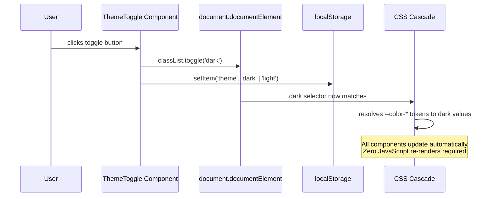

# Theming & Dark Mode

Every component in a design system renders colors. A surface color, a text color, a border color, an interactive state color. The question is not whether components use colors — they must — but whether those colors are expressed as hardcoded values or as references to a shared semantic contract.

When colors are hardcoded — `bg-white`, `text-gray-900`, `border-gray-200` — dark mode requires changing every component. A codebase with 50 components has 50 files to update, and the risk that one was missed. When colors are expressed as CSS custom property references — `var(--color-surface-page)`, `var(--color-text-primary)`, `var(--color-border-subtle)` — dark mode requires overriding a set of variables once. Zero component changes. Zero JavaScript re-renders.

This article covers the CSS custom property cascade as the theming engine, the correct implementation of system-preference detection and user-controlled toggle, the specific problem of server-side rendering flash, and the `color-scheme` CSS property that tells the browser to apply its native dark mode to form controls, scrollbars, and selection highlights.

## Design Thinking

### CSS Custom Properties as the Theming Engine

The CSS custom property cascade is the mechanism that makes theming work. The light theme tokens are defined on `:root`. The dark theme overrides are defined on `[data-theme="dark"]` or `.dark` applied to the `html` or `:root` element. All components reference the semantic tokens. When the class or attribute changes, the cascade resolves the tokens to their dark values, and every element that references those tokens updates automatically — no JavaScript needed to re-render components.

```css
/* Light theme: defaults on :root */
:root {
  --color-surface-page: hsl(0 0% 100%);
  --color-surface-raised: hsl(0 0% 98%);
  --color-text-primary: hsl(222 47% 11%);
  --color-text-secondary: hsl(215 16% 47%);
  --color-border-subtle: hsl(220 13% 91%);
  --color-interactive-default: hsl(217 91% 60%);
}

/* Dark theme: overrides on .dark applied to html/root */
.dark {
  --color-surface-page: hsl(222 47% 11%);
  --color-surface-raised: hsl(217 33% 17%);
  --color-text-primary: hsl(210 40% 98%);
  --color-text-secondary: hsl(215 20% 65%);
  --color-border-subtle: hsl(217 33% 25%);
  --color-interactive-default: hsl(213 94% 68%);
}
```

Components never set `background-color: white` or `color: #111`. They set `background-color: var(--color-surface-page)` and `color: var(--color-text-primary)`. The theme determines what those values are.

### prefers-color-scheme: System Preference Baseline

`prefers-color-scheme` is a CSS media query that reflects the user's operating system color scheme setting. It requires no JavaScript and no stored preference:

```css
@media (prefers-color-scheme: dark) {
  :root {
    --color-surface-page: hsl(222 47% 11%);
    /* ... other dark token overrides ... */
  }
}
```

This is the baseline. Users who set "dark mode" in their OS preferences automatically receive the dark theme without any user interaction in the app, without any stored preference, and without any JavaScript execution. It also works if JavaScript fails to load.

The limitation is that `prefers-color-scheme` reflects the OS setting — if the user wants the app to use light mode while their OS is in dark mode, a pure CSS implementation cannot accommodate that. Class-based toggle solves this.

### Class-Based Toggle for User Override

A class-based toggle allows users to override their system preference within the app. The implementation has three parts:

1. A JavaScript function that reads the user's stored preference from `localStorage` and sets the class on `document.documentElement`.
2. A React (or framework-specific) toggle component that reads and writes the preference and updates the class.
3. An inline `<script>` in `<head>` that applies the stored class synchronously before first paint, preventing flash.

```js
// Reading and applying the preference
function applyTheme() {
  const stored = localStorage.getItem('theme');
  const prefersDark = window.matchMedia('(prefers-color-scheme: dark)').matches;
  const isDark = stored === 'dark' || (!stored && prefersDark);
  document.documentElement.classList.toggle('dark', isDark);
}
```

The `classList.toggle('dark', isDark)` form is preferable to conditional add/remove calls — it is a single call that sets the class to the correct state in both directions.

### The SSR Flash Problem

Server-side rendering presents a specific challenge: the server renders HTML without access to the user's stored theme preference. The client's first paint uses the server-rendered HTML — which reflects the default (light) theme. A fraction of a second later, JavaScript executes, reads `localStorage`, and applies the dark class. The page flashes from light to dark. This is called FOUC (Flash of Unstyled Content) for themes.

The fix is an inline `<script>` tag in `<head>` that runs synchronously — before the browser parses the rest of the document — reads `localStorage`, and applies the theme class:

```html
<head>
  <!-- This script MUST be inline, MUST NOT have defer or async.
       It must execute synchronously before first paint.
       A defer or async script executes after HTML parsing — too late. -->
  <script>
    (function() {
      var stored = localStorage.getItem('theme');
      var prefersDark = window.matchMedia('(prefers-color-scheme: dark)').matches;
      if (stored === 'dark' || (!stored && prefersDark)) {
        document.documentElement.classList.add('dark');
      }
    })();
  </script>
</head>
```

This script is render-blocking by design. Render-blocking means the browser cannot display the page until this script has executed — which is exactly what prevents the flash. The script is tiny (a few hundred bytes) and executes in microseconds, so the render-blocking penalty is negligible. The alternatives — `useEffect` in React, dynamic script insertion — execute after first paint and cannot prevent the flash.

### The `color-scheme` CSS Property

`color-scheme` is a CSS property that tells the browser which color scheme is active for an element. When `color-scheme: dark` is set on `:root`, the browser applies its native dark mode styling to form elements (`<input>`, `<select>`, `<textarea>`), scrollbars, and text selection highlights. Without this property, a dark-themed page may have light-colored scrollbars, light-colored select dropdowns, and light-colored `<input>` backgrounds — because the browser does not know the page is dark.

```css
:root {
  color-scheme: light;
}

.dark {
  color-scheme: dark;
}
```

`color-scheme` is a one-line addition with a meaningful effect on the visual consistency of the dark theme across native UI elements. It should always be included alongside the CSS custom property overrides for dark mode.

### Token Scope: Only Semantic Tokens Need Variants

Primitive tokens are raw values:

```css
:root {
  --color-blue-500: hsl(217 91% 60%);
  --color-blue-400: hsl(213 94% 68%);
  --color-gray-900: hsl(222 47% 11%);
  --color-gray-50: hsl(210 40% 98%);
}
```

These never change between themes. They are the color palette of the design system. Semantic tokens map intentions to primitive tokens:

```css
:root {
  --color-interactive-default: var(--color-blue-500);
  --color-text-primary: var(--color-gray-900);
}

.dark {
  --color-interactive-default: var(--color-blue-400);
  --color-text-primary: var(--color-gray-50);
}
```

Only the semantic layer changes between themes. This is the correct structure. Overriding primitive tokens in `.dark` — changing what `--color-blue-500` resolves to — breaks the token's contract as a raw value reference and creates confusion about what the primitive represents.

## Best Practices

**Only semantic tokens need dark mode variants.** Primitive tokens are palette values that do not change. Only semantic tokens — which express intentions — have theme-specific overrides. Keep primitive tokens out of `.dark` overrides.

**Use `transition` on color properties only, not `all`.** When transitioning between themes, animate color, background-color, and border-color specifically. Using `transition: all` animates every CSS property that changes, including layout properties like width and height. This produces unexpected animation on components that resize when content changes during the theme switch.

**Set `color-scheme` on the root element.** Include `color-scheme: light` on `:root` and `color-scheme: dark` in the `.dark` override. This ensures native browser UI elements (scrollbars, form controls) match the active theme.

**Test contrast in both themes.** WCAG 2.1 AA requires a minimum 4.5:1 contrast ratio for normal text in both light and dark themes. Colors that pass in light mode do not automatically pass in dark mode. Test both. The `@storybook/addon-a11y` addon runs axe-core contrast checks on every story render, which helps catch failures during development.

**Store the user preference in `localStorage`, not a cookie.** Cookies are sent with every HTTP request — they are not appropriate for client-only state like theme preference. `localStorage` is synchronous, accessible in inline scripts, and appropriate for preferences that do not need to be server-readable.

**MUST NOT use hardcoded color values in component styles.** A component that renders `bg-white` or `color: #1a1a1a` must be individually updated for every new theme. Replacing every hardcoded value with a semantic CSS custom property reference (`var(--color-surface-page)`, `var(--color-text-primary)`) makes theme switching a CSS variable override with zero component changes.

**MUST NOT add theme-specific overrides to primitive tokens.** Primitive tokens represent palette values, not semantic intentions. Overriding a primitive token (`--color-blue-500`) under a dark theme leaks theme logic into the palette layer and causes any semantic token that references that primitive to change unexpectedly. Theme overrides belong exclusively on semantic tokens.

**SHOULD implement both `prefers-color-scheme` media query detection and a class-based user-controlled toggle.** The media query serves users who have not set a per-app preference; the class-based toggle serves users who want a different mode in the app than their OS setting. Implementing only one mechanism produces a broken experience for users in the other category.

## Theme Toggle Sequence



## Example

The following three-part example shows the complete dark mode implementation: CSS token overrides, a React `ThemeToggle` component, and the SSR flash prevention inline script.

```css
/* tokens.css — semantic token definitions */

:root {
  /* Light theme semantic tokens */
  --color-surface-page: hsl(0 0% 100%);
  --color-surface-raised: hsl(0 0% 98%);
  --color-text-primary: hsl(222 47% 11%);
  --color-text-secondary: hsl(215 16% 47%);
  --color-border-subtle: hsl(220 13% 91%);
  --color-interactive-default: hsl(217 91% 60%);
  --color-interactive-hover: hsl(221 83% 53%);

  /* color-scheme tells the browser to apply light native UI */
  color-scheme: light;

  /* Transition only color properties — not 'all' */
  transition:
    color 150ms ease,
    background-color 150ms ease,
    border-color 150ms ease;
}

/* Dark theme: override only semantic tokens */
.dark {
  --color-surface-page: hsl(222 47% 11%);
  --color-surface-raised: hsl(217 33% 17%);
  --color-text-primary: hsl(210 40% 98%);
  --color-text-secondary: hsl(215 20% 65%);
  --color-border-subtle: hsl(217 33% 25%);
  --color-interactive-default: hsl(213 94% 68%);
  --color-interactive-hover: hsl(210 100% 75%);

  /* color-scheme tells the browser to apply dark native UI */
  color-scheme: dark;
}
```

```tsx
// ThemeToggle.tsx — React component for user-controlled toggle

'use client';
import { useEffect, useState } from 'react';

type Theme = 'light' | 'dark';

function getInitialTheme(): Theme {
  if (typeof window === 'undefined') return 'light'; // SSR guard
  const stored = localStorage.getItem('theme') as Theme | null;
  if (stored) return stored;
  return window.matchMedia('(prefers-color-scheme: dark)').matches ? 'dark' : 'light';
}

export function ThemeToggle() {
  const [theme, setTheme] = useState<Theme>('light');

  useEffect(() => {
    // Initialize from stored preference or system preference
    setTheme(getInitialTheme());
  }, []);

  function toggleTheme() {
    const next: Theme = theme === 'dark' ? 'light' : 'dark';
    setTheme(next);
    document.documentElement.classList.toggle('dark', next === 'dark');
    localStorage.setItem('theme', next);
  }

  return (
    <button
      type="button"
      onClick={toggleTheme}
      aria-label={`Switch to ${theme === 'dark' ? 'light' : 'dark'} mode`}
    >
      {theme === 'dark' ? 'Light mode' : 'Dark mode'}
    </button>
  );
}
```

> **Note:** The label text above is for clarity. Production toggles typically render icon components — for example, `<Sun />` and `<Moon />` from `lucide-react` — with `aria-hidden="true"` on the SVG and the `aria-label` on the button (see FEE-907 for accessible icon patterns).

```html
<!-- Inline script in <head> for SSR flash prevention.
     MUST be inline. MUST NOT have defer or async.
     Executes synchronously before first paint. -->
<head>
  <script>
    (function() {
      var stored = localStorage.getItem('theme');
      var prefersDark = window.matchMedia('(prefers-color-scheme: dark)').matches;
      if (stored === 'dark' || (!stored && prefersDark)) {
        document.documentElement.classList.add('dark');
      }
    })();
  </script>
</head>
```

The three pieces work together: the CSS handles the visual update without JavaScript re-renders; the React component handles user interaction; the inline script handles the SSR synchronization problem.

## Common Mistakes

**Hardcoding colors in component styles.** Using `bg-white` or `text-gray-900` in Tailwind, or `background-color: white` in CSS, means dark mode requires changing the component. The fix is to use semantic CSS custom property references: `bg-[var(--color-surface-page)]` in Tailwind or `background-color: var(--color-surface-page)` in CSS.

**Using `useEffect` for theme initialization without an inline script.** A `useEffect` that reads `localStorage` and applies the dark class runs after the component mounts — after first paint. On a server-rendered page with a dark mode preference stored in `localStorage`, the page flashes light then dark on every navigation. The only fix is the inline render-blocking script in `<head>`.

## Related FEEs

- [FEE-901: Design Tokens](./901.md) — the semantic token layer is what makes dark mode a single CSS variable override rather than a component-level change.
- [FEE-207: CSS Custom Properties & Theming](../CSS%20and%20Layout%20Systems/207.md) — the CSS custom property cascade, inheritance, and specificity rules that make theming work.
- [FEE-1003: Color, Contrast & Visual Accessibility](../Accessibility/1003.md) — WCAG 2.1 contrast requirements apply to both light and dark themes independently.

## References

- [MDN: prefers-color-scheme](https://developer.mozilla.org/en-US/docs/Web/CSS/@media/prefers-color-scheme) — CSS media query reference, browser support table, and examples.
- [MDN: color-scheme](https://developer.mozilla.org/en-US/docs/Web/CSS/color-scheme) — CSS property reference for `color-scheme`, with explanation of native UI element behavior.
- [WCAG 2.1 — Contrast (Minimum) 1.4.3](https://www.w3.org/WAI/WCAG21/Understanding/contrast-minimum.html) — Normative contrast ratio requirements for text content.
- [Next.js — Dark Mode](https://nextjs.org/docs/app/building-your-application/styling/css#dark-mode) — Next.js theming guidance, including the `next-themes` package for handling SSR flash.
