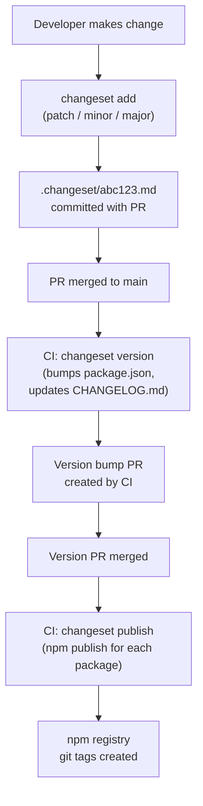

# Design System Versioning & Publishing

A design system that ships as npm packages is a shared API. Consumers depend on it. They import component props, they expect default behaviors to be stable, they write tests against documented interfaces. When the design system team changes a prop, renames a component, or alters a default behavior without announcing it as a breaking change, consumers' builds break unexpectedly — often in CI, sometimes in production.

The practices in this article treat a component library's public interface with the same rigor that a REST API team would apply to endpoint contracts: semantic versioning for all changes, a documented process for communicating breaking changes before they ship, and tooling (Changesets) that makes the workflow enforceable in CI.

This article covers the monorepo package structure that separates publishable surface areas, the Changesets workflow for versioning and publishing, the `peerDependencies` discipline that prevents the Two Reacts problem, and the `package.json` configuration fields (`exports`, `sideEffects`) that enable correct tree-shaking and TypeScript resolution for consumers.

## Design Thinking

### Monorepo Package Structure

A design system is rarely a single package. The minimal structure separates concerns that consumers might want independently:

```
packages/
  tokens/          # CSS custom properties, design tokens
  components/      # React component library
  icons/           # Icon set
```

Each package has its own `package.json`, its own version, and its own publish lifecycle. A consumer who needs only tokens installs only `@acme/tokens` — no React dependency. A consumer who needs components installs `@acme/components`, which lists `@acme/tokens` as a regular dependency (always bundled at the same version) or a peer dependency (if the consumer might already have tokens and wants version control).

Separate packages also enforce the separation of concerns at the module boundary. A team that only imports from `@acme/tokens` cannot accidentally import a React component. A team that imports from `@acme/icons` can use the icons in a non-React project.

Monorepo tooling (`pnpm workspaces`, `turborepo`, `nx`) manages the build and test pipelines across packages. FEE-805 covers monorepo tooling. This article focuses on the versioning and publishing workflow.

### Changesets Workflow

Changesets is the standard tool for versioning and publishing in monorepos. The workflow has three phases:

**Development phase**: When a developer makes a change that should be versioned, they run `changeset add` and select the affected packages, the semver bump type (patch/minor/major), and write a description. The tool writes a `.changeset/<random-id>.md` file:

```md
---
"@acme/components": minor
---

Add `asChild` prop to Button, enabling polymorphic rendering via Radix Slot.
```

This file is committed alongside the code change in the same PR. The description becomes the consumer-facing changelog entry.

**Version bump phase**: When the team is ready to release, CI runs `changeset version`. This command reads all accumulated `.changeset/*.md` files, bumps the affected packages' `package.json` version fields by the appropriate amount, and writes the changes to `CHANGELOG.md` files. The `.changeset/*.md` files are deleted. A "version bump" commit is created.

**Publish phase**: CI runs `changeset publish`. This command reads the updated `package.json` files, runs `npm publish` for each package whose version is not yet in the npm registry, and creates git tags for each published version.

The `changesets/action@v1` GitHub Action automates the version and publish phases: it creates a PR for the version bump, and when that PR merges, it runs publish automatically.

### The Two Reacts Problem

React MUST be in `peerDependencies`, not `dependencies`. This is the single most impactful peer dependency rule for React libraries.

When React is in `dependencies`, npm installs the library's specified React version in the library's own `node_modules`. The consuming application also has React in its `node_modules`. If the versions differ — or even if they are the same version but installed twice due to hoisting resolution — React is loaded twice. React uses module-level state for hooks. Loading React twice means hooks fail with "Invalid hook call" errors. Context does not cross the React instance boundary.

The correct `package.json` for a React component library:

```json
{
  "name": "@acme/components",
  "peerDependencies": {
    "react": ">=17",
    "react-dom": ">=17"
  },
  "devDependencies": {
    "react": "^18.0.0",
    "react-dom": "^18.0.0"
  }
}
```

`peerDependencies` declares the requirement. `devDependencies` installs a version for local development and testing. The consumer's application provides the actual React instance at runtime.

TypeScript is also a peer dependency, not a regular dependency. If `typescript` is in `dependencies`, npm may install a different TypeScript version in the library's `node_modules` from the consumer's TypeScript. This can produce subtle type compatibility errors.

### The `exports` Field and TypeScript Resolution

Modern `package.json` uses the `exports` field to define what consumers can import from the package. Without an `exports` field, consumers can import any file by its path. With an `exports` field, only the explicitly declared entry points are accessible.

The correct `exports` configuration for a TypeScript component library:

```json
{
  "exports": {
    ".": {
      "import": "./dist/index.js",
      "require": "./dist/index.cjs",
      "types": "./dist/index.d.ts"
    },
    "./tokens": {
      "import": "./dist/tokens.js",
      "types": "./dist/tokens.d.ts"
    }
  },
  "types": "./dist/index.d.ts"
}
```

The `import` condition is used by ESM bundlers (Vite, webpack 5, Rollup). The `require` condition is used by CommonJS environments. The `types` condition is used by TypeScript to find the declaration files.

Without the `types` condition in `exports`, TypeScript falls back to the top-level `types` field, which may not correctly resolve for sub-path imports. Consumers importing `@acme/components/tokens` would not get TypeScript types unless the tokens sub-path has its own `types` condition.

### `sideEffects: false`

The `sideEffects` field in `package.json` tells bundlers whether the package has modules that produce side effects when imported. A side effect is code that runs at import time and cannot be removed by tree-shaking — for example, a module that registers itself globally or mutates `window`.

For a component library that contains only React components and utility functions, `"sideEffects": false` is correct. This tells bundlers: "every module in this package is pure — if you import Button but do not use Dialog, you can remove Dialog's code from the bundle entirely."

```json
{
  "sideEffects": false
}
```

If the package contains CSS files that must be imported for side effects (a `global.css` that injects reset styles), use an array:

```json
{
  "sideEffects": ["**/*.css"]
}
```

Missing `"sideEffects": false` means bundlers cannot tree-shake the package. A consumer who imports only `Button` from `@acme/components` gets the entire component library in their bundle.

### Semver for UI Libraries

The practical challenge of semver discipline for UI libraries is that "breaking change" is sometimes ambiguous. A visual change — making a button two pixels taller — does not change the prop API, but it may break pixel-perfect snapshot tests in consumer codebases. A behavior change — altering animation timing — does not change the prop API, but it may break interaction tests. The working definition of "breaking" for a design system should be documented explicitly and shared with consuming teams so they know what a major bump means in practice. Most teams land on: any change that requires consumer code changes to maintain existing behavior is breaking. Visual changes that preserve the semantic intent of the component are not breaking, but warrant a detailed changelog entry.

A pre-release tag (`2.0.0-beta.1`) is the correct vehicle for distributing breaking changes to early adopters before committing the major version to all consumers. Pre-release tags are not installed by `npm update` or by dependency managers resolving `^` ranges, which means consumers who need stability are not exposed to the breaking change until they explicitly opt in. Using pre-release versions also allows the design system team to gather feedback and iterate on the API before finalizing it as the stable major release. Changesets supports pre-release mode with `changeset pre enter beta`, which routes all subsequent version bumps into the pre-release channel until `changeset pre exit` is called.

Summarized versioning rules for common UI library changes:

| Change type | Bump |
|---|---|
| Remove a prop | Major |
| Rename a prop | Major |
| Change a prop default value | Major |
| New required peer dependency major version | Major |
| Add an optional prop | Minor |
| Add a new component | Minor |
| Add a new variant to an existing component | Minor |
| Visual bug fix (no API change) | Patch |
| Accessibility fix (no API change) | Patch |
| Internal refactor (no API change) | Patch |

### Communicating breaking changes to consuming teams

A major version bump is a signal, not a complete communication. Consuming teams need to know what changed, what the migration path is, and how long the previous version will receive security patches. The design system changelog entry for a breaking change should include: the before/after API diff, the reason for the change, the exact migration steps required, and the end-of-life date for the previous major version. Teams that publish a major version without a migration guide shift the investigation cost to every consuming team individually, multiplying a one-time documentation effort into many hours of detective work across the organization.

## Best Practices

**Run `changeset add` before merging any PR that modifies a package.** Add a CI check using `changeset status --since=origin/main` that fails if a PR modifies package source without a corresponding changeset file. This prevents the team from accidentally merging unversioned changes.

**Test the published package with `npm pack --dry-run` before release.** This simulates the publish and shows exactly which files would be included in the tarball. Common mistakes caught by this check: the `dist/` directory is missing (build was not run before publish), `node_modules` are included (`.npmignore` is missing), or source `.ts` files are included unnecessarily.

**Use `"sideEffects": false` in `package.json`.** This is required for tree-shaking to work correctly. Without it, bundlers cannot eliminate unused components from consumer bundles.

**Publish `types` and `exports` correctly.** Use the `exports` map in `package.json` with both `import` and `types` entries: `"exports": { ".": { "import": "./dist/index.js", "types": "./dist/index.d.ts" } }`. Without `types`, TypeScript consumers get no type information. Without `exports`, bundlers may resolve to the wrong entry point. Always verify the published package provides both with `npm pack --dry-run` and `tsc --noEmit` in a consuming project.

**Declare React and TypeScript as `peerDependencies` with broad version ranges.** Use `"react": ">=17"` rather than `"react": "^18.0.0"`. Pinning to a major version range that excludes valid consumer React versions forces unnecessary upgrades and causes version conflicts in monorepos where multiple projects share a React version.

**Publish from CI, not from developer machines.** Local publish runs with the developer's npm credentials and local state. CI publishes from a clean checkout with consistent credentials. The `changesets/action@v1` GitHub Action implements this correctly.

**MUST treat every prop removal, prop rename, default value change, or new required peer dependency major version as a breaking change and publish it as a major version bump.** Publishing a breaking API change as a patch or minor bump breaks consumers who upgrade expecting safety, erodes trust in the versioning signal, and causes consumers to stop upgrading promptly — which means they stop receiving security patches and bug fixes.

**MUST NOT publish a patch or minor version for changes that alter the public component API.** Semantic versioning is the communication mechanism between the design system team and consumer teams. A patch bump signals "safe to upgrade immediately"; violating that signal with a breaking change imposes an unbudgeted migration cost on every consumer who upgrades on that signal.

## Changesets Publishing Flow



## Example

### Package Configuration

```json
// packages/components/package.json
{
  "name": "@acme/components",
  "version": "2.1.0",
  "description": "ACME Design System React components",
  "main": "./dist/index.cjs",
  "module": "./dist/index.js",
  "types": "./dist/index.d.ts",
  "exports": {
    ".": {
      "import": "./dist/index.js",
      "require": "./dist/index.cjs",
      "types": "./dist/index.d.ts"
    }
  },
  "files": ["dist"],
  "sideEffects": false,
  "peerDependencies": {
    "react": ">=17",
    "react-dom": ">=17"
  },
  "devDependencies": {
    "react": "^18.2.0",
    "react-dom": "^18.2.0",
    "typescript": "^5.0.0"
  },
  "dependencies": {
    "@acme/tokens": "workspace:*",
    "@radix-ui/react-dialog": "^1.0.0",
    "class-variance-authority": "^0.7.0"
  }
}
```

### Changeset File

```md
---
"@acme/components": major
---

**Breaking:** Remove deprecated `size="xs"` from Button. Use `size="sm"` instead.

Consumers using `size="xs"` will receive a TypeScript error after upgrading. Replace all usages with `size="sm"`.
```

### GitHub Actions Release Workflow

```yaml
# .github/workflows/release.yml
name: Release

on:
  push:
    branches: [main]

jobs:
  release:
    name: Release
    runs-on: ubuntu-latest
    steps:
      - uses: actions/checkout@v4
        with:
          # Full history required for changeset version to compute correctly
          fetch-depth: 0

      - uses: pnpm/action-setup@v4
        with:
          version: 8

      - uses: actions/setup-node@v4
        with:
          node-version: 20
          cache: pnpm

      - run: pnpm install --frozen-lockfile

      - run: pnpm build

      - name: Create Release PR or Publish
        uses: changesets/action@v1
        with:
          publish: pnpm changeset publish
          version: pnpm changeset version
          commit: "chore(release): version packages"
          title: "chore(release): version packages"
        env:
          GITHUB_TOKEN: ${{ secrets.GITHUB_TOKEN }}
          NPM_TOKEN: ${{ secrets.NPM_TOKEN }}
```

The `changesets/action@v1` handles the two-phase workflow automatically: when changesets are present and unversioned, it creates a "version packages" PR. When that PR is merged, it runs `changeset publish` on the main branch.

## Common Mistakes

**React in `dependencies` instead of `peerDependencies`.** This is the most common error and the hardest to debug. The symptom is "Invalid hook call" — React detects two copies of itself in the module graph and throws. The fix is moving React to `peerDependencies` in the library's `package.json` and ensuring the consuming application provides a single React instance.

## Related FEEs

- [FEE-805: Monorepos & Workspaces](../Build%20Tooling%20and%20Module%20Systems/805.md) — `pnpm workspaces`, `turborepo`, and the monorepo tooling that manages multi-package repositories.
- [FEE-1507: Release Automation](../CI%20CD%20and%20Deployment/1507.md) — CI/CD pipeline patterns for automated releases.
- [FEE-1604: Commit Conventions](../Developer%20Experience%20and%20Tooling/1604.md) — Commit message conventions (Conventional Commits) that feed into changelog generation.

## References

- [Changesets Documentation](https://github.com/changesets/changesets) — Official docs for the Changesets CLI: `add`, `version`, `publish`, and configuration.
- [npm `exports` field documentation](https://docs.npmjs.com/cli/v10/configuring-npm/package-json#exports) — Official reference for `package.json` `exports` conditions.
- [changesets/action GitHub Action](https://github.com/changesets/action) — The GitHub Action that automates version bump PRs and npm publishing.
- [TypeScript — Publishing packages](https://www.typescriptlang.org/docs/handbook/declaration-files/publishing.html) — TypeScript's official guide for publishing type-safe npm packages.
