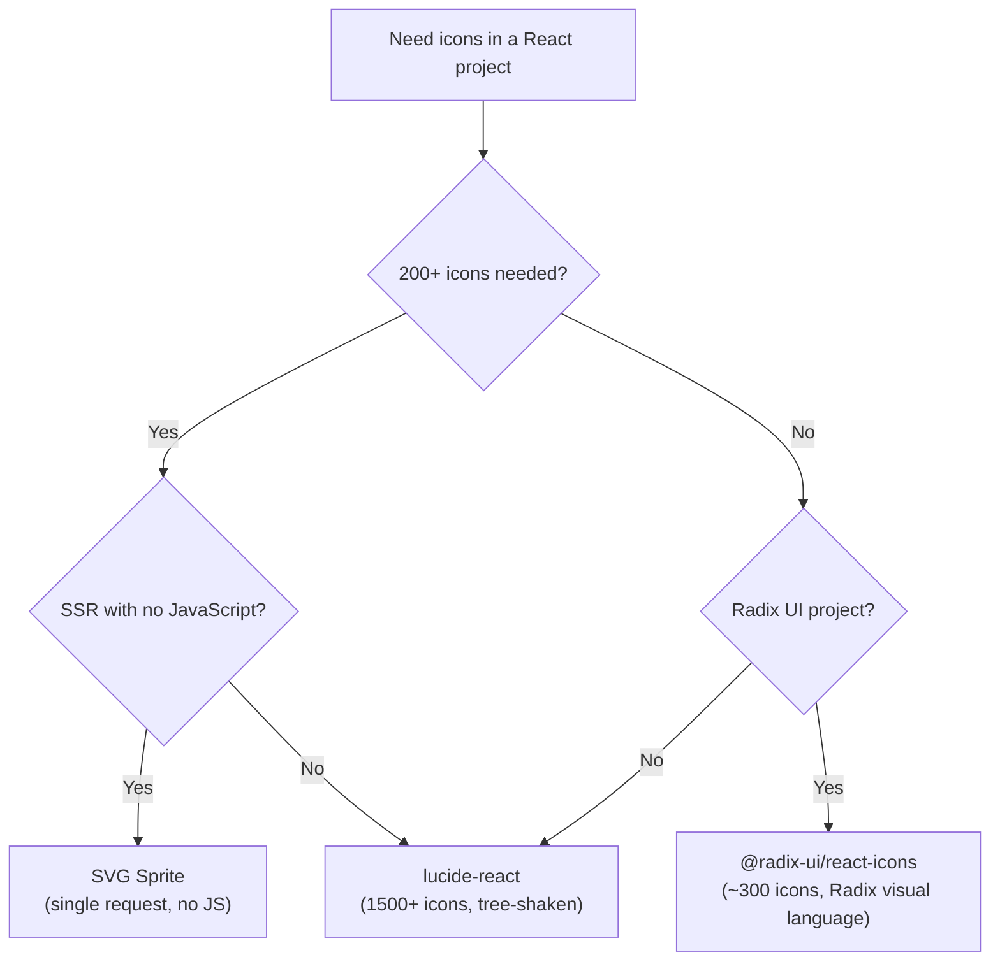

# Icon Systems

An icon on a web page can arrive in four ways: as an `` tag, as an icon font character, as an inline SVG, or as a React component that renders SVG. The choice is not aesthetic — it has direct consequences for styling capability, accessibility, bundle size, and developer experience. These four approaches have been used at different points in the industry's history, and legacy codebases often contain multiple approaches side by side. Understanding the tradeoffs of each is necessary for making the right choice in new projects and for migrating legacy implementations.

`` tags cannot be styled with `currentColor`. Icon fonts have known accessibility failure modes and render quality inconsistencies. Inline SVG and React SVG components are the only delivery mechanisms that participate fully in the CSS cascade, inherit `color` from their parent, and support TypeScript props.

This article covers the three viable delivery approaches — component-per-icon, SVG sprite, and icon font (legacy) — the recommended default libraries (`lucide-react`, `@radix-ui/react-icons`), tree-shaking behavior by bundler, the conventions for custom icon sets, and the accessibility patterns required for decorative versus meaningful icons. It also explains the `currentColor` inheritance model and the sizing conventions that make icons responsive and composable with the rest of the design system.

## Design Thinking

### Component-Per-Icon: The Modern Default

Each icon is a `.tsx` file that exports a React component rendering an inline SVG. The component is tree-shaken individually: importing `ChevronDown` does not include `Settings` or `User` in the bundle.

```tsx
// lucide-react ships hundreds of components like this:
export const ChevronDown = ({ size = 24, color = 'currentColor', ...props }) => (
  <svg width={size} height={size} viewBox="0 0 24 24" fill="none"
    stroke={color} strokeWidth={2} strokeLinecap="round" strokeLinejoin="round"
    {...props}
  >
    <polyline points="6 9 12 15 18 9" />
  </svg>
);
```

Tree-shaking works correctly when the bundler can statically analyze the import. With Vite (which uses Rollup under the hood), named imports from `lucide-react` are tree-shaken automatically:

```tsx
import { ChevronDown, Settings } from 'lucide-react';
// Only ChevronDown and Settings are included in the bundle.
// All other icons are eliminated.
```

With webpack, tree-shaking requires `"sideEffects": false` in the package's `package.json`. `lucide-react` includes this field. The result is the same: only imported icons are bundled.

The failure mode: `import * as Icons from 'lucide-react'`. This defeats tree-shaking in webpack and other bundlers without Rollup's scope analysis. Vite (which uses Rollup) can still tree-shake namespace imports, but this behavior is bundler-specific. Prefer named imports for guaranteed elimination across all bundlers.

### SVG Sprite

An SVG sprite is a single SVG file containing many `<symbol>` elements, each with a unique `id`. Icons are rendered with `<use href="#icon-name">`:

```html
<!-- sprite.svg -->
<svg xmlns="http://www.w3.org/2000/svg" style="display: none;">
  <symbol id="chevron-down" viewBox="0 0 24 24">
    <polyline points="6 9 12 15 18 9" />
  </symbol>
  <symbol id="settings" viewBox="0 0 24 24">
    <!-- ... -->
  </symbol>
</svg>

<!-- Usage -->
<svg width="24" height="24" aria-hidden="true">
  <use href="/sprite.svg#chevron-down" />
</svg>
```

Advantages: single HTTP request for all icons (or inline in the HTML), `currentColor` works, no JavaScript required. Usable in non-React contexts.

Disadvantages: no per-icon tree-shaking (all icons in the sprite are always loaded), requires a build step to generate the sprite file, `<use>` references can be complex to type-check, harder to manage in component-driven workflows.

SVG sprites are the right choice for SSR-only or no-JS environments where component-per-icon is not viable, or for performance-critical pages that load many different icons simultaneously and benefit from the single-request optimization.

### Icon Font: Legacy, Not Recommended

Icon fonts deliver icons as characters in a custom font. The glyph at a Unicode code point renders as an icon. This approach has persistent problems:

- **Render quality**: Icons render as text, subject to font antialiasing. On non-retina displays, icon fonts can appear blurry or misaligned at small sizes.
- **Accessibility**: Icon font glyphs are text characters. Screen readers attempt to read them. The standard workaround is `aria-hidden="true"` on every glyph element, but this requires discipline at every usage site and is easy to miss.
- **`currentColor`**: Works in some browsers, but less reliably than SVG `stroke` and `fill` attributes, particularly for complex multi-color icons.
- **Loading failure**: If the font fails to load, blank squares or Unicode replacement characters render instead of icons, with no fallback.

Icon fonts are not recommended for new projects. Use them only when maintaining a legacy system where the migration cost to SVG components is not justified.

### lucide-react: Recommended Default

`lucide-react` is the recommended default for React projects:

- **Coverage**: 1,500+ icons, updated regularly with new icon requests.
- **Consistency**: All icons use a 2px stroke, 24x24 viewBox, and rounded line caps. The visual language is cohesive and works at sizes from 16px to 48px.
- **TypeScript props**: `size` (number, default 24), `color` (string, default 'currentColor'), `strokeWidth` (number, default 2), `className` (string). All are optional and composable.
- **Tree-shaking**: Named exports, `"sideEffects": false` in `package.json`. Correct automatic tree-shaking with Vite, correct with webpack when `sideEffects` is respected.
- **shadcn/ui integration**: `lucide-react` is the default icon library in shadcn/ui. Projects using shadcn/ui already have it installed.

### @radix-ui/react-icons: Radix-First Projects

`@radix-ui/react-icons` ships approximately 300 icons designed to match the Radix UI visual language — consistent with the design aesthetic of Radix primitives and shadcn/ui components. The icon set is smaller than `lucide-react` but curated for Radix-first projects.

Use `@radix-ui/react-icons` when the project uses Radix UI primitives extensively and visual consistency between icons and Radix components is a priority. For projects that need a larger icon set, use `lucide-react` instead — the two libraries can coexist.

### Custom Icon Components

When a project has a proprietary icon set (designed by the team, not from a library), each icon should be authored as a React SVG component following the same conventions as `lucide-react`:

- `stroke="currentColor"` (not a hardcoded hex color)
- `viewBox="0 0 24 24"` (consistent coordinate space)
- `width` and `height` driven by a `size` prop with a sensible default
- `aria-hidden`, `role`, `aria-label` as pass-through props via `{...rest}`
- Named export from a barrel `index.ts`

A consistent structure for custom icons allows the same accessibility wrapper components and sizing conventions to work across the custom icon set and any third-party icons used in the same project.

### Bundler-Specific Tree-Shaking Notes

Tree-shaking behavior depends on the bundler:

- **Vite (Rollup)**: Named imports from any package are tree-shaken automatically by Rollup's scope analysis. Namespace imports (`import * as`) are also partially tree-shaken by Rollup when it can determine which properties are actually used. Still, named imports are safer and should be the default.
- **webpack 5**: Tree-shaking works for packages marked with `"sideEffects": false`. Without that field, webpack cannot eliminate unused exports even with named imports. `lucide-react` and `@radix-ui/react-icons` both include `"sideEffects": false`.
- **webpack 4**: Tree-shaking works only with ESM output. If the icon package ships only CJS, webpack 4 cannot tree-shake it.

For most projects using Vite (the current standard for new React projects), icon tree-shaking works correctly out of the box with named imports.

### `currentColor` and Sizing

SVG icons inherit `color` from their parent element because `lucide-react` (and most React SVG icon libraries) uses `stroke="currentColor"`. This means:

```tsx
// The icon inherits the button's text color, including hover/focus states
<button className="text-gray-700 hover:text-blue-600">
  <Settings className="h-5 w-5" aria-hidden="true" />
  Settings
</button>
```

When the button's text color changes on hover, the icon's stroke color changes with it — no additional CSS required.

For sizing, prefer CSS (`h-5 w-5` in Tailwind, or `width: 1.25rem; height: 1.25rem` in CSS) over the `size` prop for icons that should scale with text context. Use the `size` prop for icons in fixed-size contexts where the size should not be responsive.

Using `em` units for icon sizing produces icons that scale with the font size of their parent, which is correct for inline icons (icons within a sentence or heading):

```css
.inline-icon {
  width: 1em;
  height: 1em;
}
```

## Best Practices

**Apply `aria-hidden="true"` to decorative icons.** An icon inside a button that already has a visible text label is decorative. The text label provides the accessible name. Adding `aria-hidden="true"` to the SVG removes it from the accessibility tree and prevents the screen reader from attempting to describe the SVG path or title element.

**Add `aria-label` to icon-only buttons — on the button, not the SVG.** A button that contains only an icon has no visible text label. The accessible name must be provided. Add `aria-label` to the `<button>` element. Mark the SVG as `aria-hidden="true"`. Do not add `aria-label` to the `<svg>` — the button element is the interactive element that needs the name, not the icon.

**Never use `` for UI icons.** `` cannot inherit `currentColor`, cannot receive CSS hover/focus color changes, and requires `alt` text management at every usage site. Use SVG components.

**Import named icons, not namespace imports.** `import { ChevronDown } from 'lucide-react'` tree-shakes correctly. `import * as Icons from 'lucide-react'` includes every icon in the bundle. This rule applies to every icon library, not just `lucide-react`.

**Use CSS for icon sizing when the size should be responsive.** The `size` prop on `lucide-react` icons sets the SVG `width` and `height` HTML attributes. HTML attributes are less flexible than CSS properties — they cannot use media queries, `em` units, or Tailwind responsive prefixes. Use `className="h-5 w-5"` or a CSS rule for icons that need responsive sizing.

**Audit icon usage for missing `aria-hidden` in code reviews.** Icon accessibility attributes are the type of detail that slips through individual review. A checklist item in the PR template — "Does every icon have either `aria-hidden='true'` or `aria-label` on a parent interactive element?" — catches missing attributes before merge rather than after a11y audit.

**Keep `strokeWidth` consistent across the application.** `lucide-react`'s default `strokeWidth={2}` should remain the standard unless the design system explicitly specifies a different weight. Mixing `strokeWidth={1}` and `strokeWidth={2}` icons on the same page creates visual inconsistency. If the design system uses a different stroke weight, configure it once in a shared Icon wrapper component rather than passing `strokeWidth` at every call site.

## Icon Library Decision Guide



## Example

The following three patterns demonstrate the correct accessibility approach for the three main usage contexts of icons in a React UI.

```tsx
import { Settings, Search, X } from 'lucide-react';

// Pattern 1: Decorative icon inside a button with visible text label.
// The text label provides the accessible name.
// aria-hidden="true" removes the icon from the a11y tree entirely.
function SettingsButton() {
  return (
    <button type="button" className="flex items-center gap-2">
      <Settings className="h-4 w-4" aria-hidden="true" />
      Settings
    </button>
  );
}

// Pattern 2: Icon-only button.
// The button needs an accessible name — the icon does not provide one.
// aria-label on the <button> provides the name.
// aria-hidden="true" on the <svg> prevents double-announcement.
function CloseButton({ onClose }: { onClose: () => void }) {
  return (
    <button
      type="button"
      onClick={onClose}
      aria-label="Close dialog"
      className="rounded p-1 hover:bg-gray-100"
    >
      <X className="h-4 w-4" aria-hidden="true" />
    </button>
  );
}

// Pattern 3: Custom SVG wrapper with currentColor, size prop, and aria pass-through.
// This pattern is useful when building a design system icon component that
// wraps lucide-react or a custom SVG set.
interface IconProps extends React.SVGProps<SVGSVGElement> {
  icon: React.FC<React.SVGProps<SVGSVGElement>>;
  size?: number | string;
  label?: string; // When provided, icon is meaningful; when absent, decorative.
}

function Icon({ icon: IconComponent, size = 24, label, className, ...rest }: IconProps) {
  if (label) {
    // Meaningful icon: aria-label provides accessible name, role="img"
    return (
      <IconComponent
        width={size}
        height={size}
        {...rest}
        role="img"
        aria-label={label}
        className={className}
      />
    );
  }
  // Decorative icon: hidden from accessibility tree
  return (
    <IconComponent
      width={size}
      height={size}
      {...rest}
      aria-hidden="true"
      className={className}
    />
  );
}

// Usage:
// <Icon icon={Settings} size={20} />              // decorative, aria-hidden
// <Icon icon={Search} size={20} label="Search" /> // meaningful, role="img" + aria-label
```

The three patterns cover the full range of icon usage:

1. **Decorative with adjacent label** — `aria-hidden="true"` on the icon; accessible name from surrounding text.
2. **Icon-only interactive** — `aria-label` on the `<button>`, `aria-hidden="true"` on the icon.
3. **Standalone meaningful icon** — `role="img"` + `aria-label` on the SVG, used when the icon conveys information independently (e.g., a status indicator without adjacent text).

A useful heuristic for deciding which pattern to use: if the icon is next to text that already describes the action or meaning, it is decorative and needs `aria-hidden`. If the icon is the only visual representation of an action (icon-only button), the accessible name must come from the button's `aria-label`. If the icon stands alone as a status or informational element with no interactive parent, `role="img"` and `aria-label` on the SVG itself is correct.

The Icon wrapper component in Pattern 3 is the recommended approach for design systems that want to enforce consistent accessibility behavior across all icon usages. Rather than relying on developers to remember to add `aria-hidden` or `role="img"` at every call site, the wrapper component makes the correct behavior the default: if no `label` is provided, the icon is treated as decorative automatically.

## Migrating from Icon Fonts

Legacy projects using icon fonts can migrate to SVG components incrementally. The recommended approach:

1. Install `lucide-react` (or the chosen SVG library) alongside the existing font.
2. Replace icon font usages one component at a time, starting with the most visible interactive elements.
3. Verify `aria-hidden` and `aria-label` correctness as each icon is replaced — the migration is an opportunity to audit accessibility.
4. Remove the icon font CSS and font file once all usages are replaced.

Migrating to SVG components eliminates the font loading dependency, removes the accessibility workarounds required at every icon font glyph, and enables `currentColor` inheritance without additional CSS.

## Common Mistakes

**Rendering icons as `` with empty `alt`.** Some developers use `` to suppress the screen reader announcement, treating it like `aria-hidden`. While `alt=""` does silence screen readers, it does not fix the `currentColor` limitation — the icon still cannot inherit CSS color from its parent. The fix is to use an SVG component, not to suppress the image.

**`aria-label` on `<svg>` when the parent button already has an accessible name.** Adding `aria-label` to both the `<button>` and the `<svg>` causes screen readers to announce the name twice — once for the button, once for the SVG. The `<svg>` should have `aria-hidden="true"` when it is inside an element that already has an accessible name.

**`import * as Icons from 'lucide-react'` in non-tree-shaken environments.** This imports the entire library. In Vite, even namespace imports are tree-shaken by Rollup's scope hoisting — but this behavior is bundler-specific and not guaranteed. In webpack without explicit tree-shaking configuration, namespace imports include all exports. Prefer named imports: `import { ChevronDown, Settings } from 'lucide-react'`.

## Related FEEs

- [FEE-1001: ARIA & Semantic HTML](../Accessibility/1001.md) — the ARIA patterns for accessible icons: `aria-hidden`, `aria-label`, `role="img"`, and how browsers compute accessible names.
- [FEE-903: Copy-Paste Component Libraries](./903.md) — `lucide-react` is the default icon library in shadcn/ui; projects using shadcn/ui already have it installed.

## References

- [lucide-react Documentation](https://lucide.dev/guide/packages/lucide-react) — Official docs for `lucide-react`, including installation, props reference, and tree-shaking notes.
- [@radix-ui/react-icons Documentation](https://www.radix-ui.com/icons) — Official docs for the Radix icon set, including the full icon catalog.
- [MDN: aria-hidden](https://developer.mozilla.org/en-US/docs/Web/Accessibility/ARIA/Attributes/aria-hidden) — When and how to use `aria-hidden` to remove elements from the accessibility tree.
- [MDN: aria-label](https://developer.mozilla.org/en-US/docs/Web/Accessibility/ARIA/Attributes/aria-label) — How `aria-label` provides accessible names for interactive elements without visible text.
- [SVG `symbol` a Good Choice for Icons — CSS Tricks](https://css-tricks.com/svg-symbol-good-choice-icons/) — Comparison of SVG sprite (`symbol`/`use`) vs inline SVG vs `` approaches, with trade-offs for each.
- [SVG Accessibility — CSS Tricks](https://css-tricks.com/accessible-svgs/) — Comprehensive reference for accessible SVG patterns, including title, desc, role, and aria attributes.
- [Heroicons](https://heroicons.com) — Another popular MIT-licensed SVG icon set from Tailwind Labs, available as React components, useful as reference for icon component conventions.
- [Phosphor Icons](https://phosphoricons.com) — A flexible icon set with six weights (thin, light, regular, bold, fill, duotone), demonstrating the multi-weight icon component approach.
- [Material Symbols (Google Fonts)](https://fonts.google.com/icons) — Google's icon set available as SVG downloads or as a variable font, with variable axes for fill, weight, grade, and optical size. Useful for projects using Material Design or needing a very large icon set.
- [WCAG — Non-text Content 1.1.1](https://www.w3.org/WAI/WCAG21/Understanding/non-text-content.html) — Normative requirement for text alternatives for non-text content, including icons used as controls or informational graphics.
