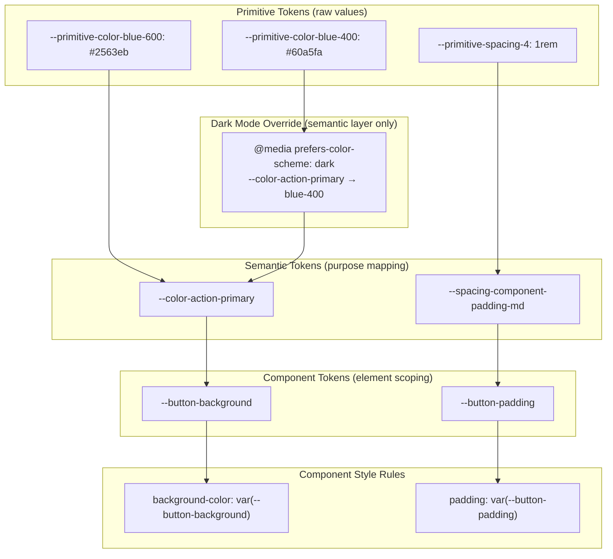

# Variant & Token Composition

Component variants — primary/secondary/destructive buttons, small/medium/large
inputs, enabled/disabled states — are among the most common sources of ad-hoc
className logic in frontend codebases. A component with three size variants,
four color variants, and two interaction states can produce twelve distinct
combinations, and naive conditional class strings scale poorly as each new
variant dimension multiplies the number of cases that must be handled
explicitly.

Class Variance Authority (CVA), `tailwind-variants`, and similar tools provide
a structured API for expressing variant combinations as a configuration object
that maps variant values to class strings. This moves variant logic out of the
component's render function and into a declarative data structure that is easier
to read, test, and extend. The full variant matrix becomes visible in one place,
and adding a new variant dimension requires a single new key in the
configuration rather than a new branch across every existing conditional.

Design token layering — primitive tokens that hold specific values such as
`#1a1a2e`, semantic tokens that express purpose such as `color-text-primary`,
and component tokens that scope semantic tokens to a specific element such as
`button-background` — allows a design system to support multiple themes without
changing any component code. The component references semantic tokens; the
theme changes the values that those semantic tokens map to.

Together, variant configuration libraries and a well-structured token hierarchy
address the two most common sources of design system fragility: combinatorial
className logic and theme-coupled color references. This article explains how
to compose these two techniques and use TypeScript to make the composition
type-safe.

## Design Thinking

### CVA and compound variants

CVA's core API takes a base class string and a configuration object with three
keys: `variants`, `defaultVariants`, and `compoundVariants`. The `variants` key
is a record mapping variant dimension names to records mapping variant values to
class strings. When the generated function is called with a set of variant
props, it merges the base classes with each matching variant's classes and
returns the resulting merged string. The base classes are always present —
they express the invariants of the component's appearance — while each
variant's classes layer on top to express the differences.

The design of the `variants` key as a flat record of named dimensions
encourages thinking about component variation as a set of truly independent
axes. Size is one axis; visual style is another; interactive state may be a
third. When a dimension is genuinely independent — when the classes for
`size: 'lg'` do not depend on the value of `variant` — expressing them as
separate entries in `variants` is correct and sufficient. The configuration
reads as a matrix: any combination of rows is valid, and the resulting classes
are the union of each row's matched entry.

Compound variants handle the cases that simple independent variants cannot
express: class combinations that only apply when multiple variant dimensions
simultaneously have specific values. The `compoundVariants` array holds objects
pairing a set of variant value conditions with a class string that is appended
only when all conditions match. For example, a ghost button at large size might
need additional horizontal padding beyond what the size variant alone
contributes, because the ghost variant's lack of background makes the default
large padding feel cramped. Without compound variants this would require a
conditional expression that inspects both `variant` and `size` together; with
compound variants it is a single entry in the configuration array that declares
the intent clearly.

The mental model for compound variants is that they are overrides layered on
top of the base variant resolution. They do not replace the matched base
variant classes; they append additional classes when the compound condition
matches. Compound variants should express genuinely compound style choices —
padding adjustments, border radius overrides, shadow changes — rather than
redundantly restating what the individual variants already declare. Keeping
compound variants focused on the exceptions and letting the base variants
handle the common cases keeps the configuration readable.

If a component's configuration has more compound variant entries than base
variant entries, the variant dimensions are probably not as independent as the
model assumes. A component with deeply entangled dimensions is often better
split into two or more focused components than modeled as one with a large
compound variant table. CVA is a tool for expressing a variant model, not a
reason to make variant models more complex than the design warrants.

### Token hierarchy: primitive, semantic, and component tokens

The three-layer token hierarchy exists because different kinds of style
decisions change at different rates and for different reasons. Primitive tokens
— also called reference tokens in some systems — hold specific values:
`--primitive-color-blue-600: #2563eb`, `--primitive-spacing-4: 1rem`. They
change only when the raw design language changes: a new palette or a new
spacing scale. These are the source of truth for all values in the system.
Primitive tokens should never be referenced directly by components; they exist
so that semantic tokens have a single, well-named value to point to.

Semantic tokens map purpose to primitive values:
`--color-action-primary: var(--primitive-color-blue-600)`. They change when
the system's meaning changes — when a brand update reassigns which blue shade
is the primary action color — and they change only at the semantic layer
without touching any primitive or component value. Dark mode is implemented
almost entirely at the semantic layer: overriding `--color-action-primary`
to point to `--primitive-color-blue-400` under a dark media query or a
`data-theme="dark"` attribute changes the rendered color of every component
that uses `--color-action-primary`. The component itself never changes.

Naming semantic tokens well is one of the most impactful decisions in token
system design. A token named `--color-blue-600-alias` is not semantic; it
still couples consumers to a specific color. A token named
`--color-action-primary` communicates the token's role: it is the primary
color for action-initiating elements. When a designer says "the primary button
color is changing to teal," the engineer updates the semantic token's value,
and the change propagates everywhere the token is used. The semantic name
creates a shared vocabulary between design and engineering that survives
palette changes.

Component tokens are optional but valuable for complex components. They scope
a semantic token to a specific element:
`--button-background: var(--color-action-primary)`. This allows a consuming
application to override the button's background for a specific context —
inside a promotional banner, for instance, where the button should use the
banner's accent color — without touching the global semantic token. The
override affects only the button in that context, not all components that use
`--color-action-primary`. Component tokens are the right lever for one-off
contextual overrides; semantic tokens are the right lever for theme-wide
changes.

The practical consequence of this hierarchy is that dark mode, brand theming,
and high-contrast accessibility modes can all be implemented by swapping
semantic token values — typically in a small stylesheet applied to the root
element — without touching component code. In a large component library, this
can mean hundreds of individual file changes for what should be a single
stylesheet update. Components that reference primitive tokens or hardcoded
values become obstacles to this pattern because they must be individually
updated whenever a theme changes.

### TypeScript-enforced variant APIs

CVA generates TypeScript types for valid variant combinations automatically.
The `VariantProps<typeof buttonVariants>` utility type, exported from the CVA
package, extracts the union types for each variant dimension from the
configuration object. This means the component's prop type for all
variant-related props is derived from the single configuration object rather
than being written separately. When a variant is added, renamed, or removed in
the configuration, the TypeScript type changes with it, and the compiler
surfaces every call site that references the old variant name.

This approach eliminates an entire class of bugs that arise when a component's
TypeScript types and its className logic diverge. Without CVA, it is possible
to add a new variant value to the className conditional without adding it to
the prop type union, or vice versa, because the two are separate declarations.
CVA's type generation makes the two definitionally the same: the configuration
object is the type declaration. Renaming a variant from `'ghost'` to
`'outline'` in the configuration immediately produces a type error at every
call site that passes `variant="ghost"`, without any additional type
maintenance required.

When using component tokens defined as CSS custom properties, TypeScript can
enforce valid token references by defining the token names as a string literal
union type and using that type as the accepted value for CSS custom property
strings. If design tokens are authored in a TypeScript file and exported as a
typed object, the keys of that object can be used to derive the literal union.
This means a component that references `--color-action-primry` (a typo)
produces a type error rather than silently rendering with no background, because
the misspelled token name is not in the union.

The combination of CVA-derived variant types and token-keyed CSS property types
creates a component API that is fully statically verified: valid variant
combinations are checked at compile time, and valid token references are checked
at compile time. This is a significant improvement over the typical state of
design system component code, where variant values and token names are plain
strings with no static validation. The type safety becomes especially valuable
during refactoring: renaming a token or variant value produces compiler errors
that locate every affected call site, rather than relying on manual search or
visual inspection across the entire codebase.

### tailwind-variants vs. CVA

`tailwind-variants` extends the CVA model with two additional capabilities:
responsive variants and slots. Responsive variants allow a variant dimension
to have different values at different breakpoints without conditional logic in
the component, expressed as an object `{ initial: 'sm', md: 'lg' }` rather
than a string. Instead of computing a size class from window width in the
component, the caller passes an object and the library resolves the correct
class for each breakpoint through Tailwind's responsive prefix system. This
keeps responsive behavior in the configuration layer where it can be read and
reasoned about without inspecting JavaScript.

Slots allow compound components — a `Card` composed of a `CardHeader`,
`CardBody`, and `CardFooter`, for example — to share a variant configuration
where each slot has its own class mapping for each variant value. This makes
it possible to change the visual treatment of a complex multi-element component
by changing a single variant prop on the root component, with each child slot
receiving the classes appropriate to that variant automatically. Without slots,
a compound component's variant logic must either be duplicated across each
sub-component or centralized in a context that each sub-component reads — both
approaches are manageable but more complex than a shared slots configuration.

CVA is simpler and sufficient for single-element components and for teams that
do not need responsive variant syntax. It has a smaller API surface and fewer
concepts to learn. `tailwind-variants` is the better choice when building a
component library that serves multiple breakpoints with design-specified
per-breakpoint variant differences, or when building compound components where
slot-level class isolation is valuable.

Both libraries solve the same core problem: moving variant logic from
imperative conditional expressions to declarative configuration. The choice
between them is primarily about whether the additional capabilities of
`tailwind-variants` are needed. Either choice is preferable to unstructured
inline conditional className logic for any component with two or more
independent variant dimensions. Teams that start with CVA can migrate to
`tailwind-variants` incrementally if they encounter a need for responsive
variants or slots, because both libraries use the same underlying conceptual
model and their configurations are structurally similar.

## Best Practices

**SHOULD** use CVA or `tailwind-variants` for components with two or more
independent variant dimensions. Inline conditional class strings
(`cx(size === 'lg' && '...', color === 'primary' && '...')`) scale poorly as
variants multiply: three dimensions with three values each require nine
conditionals and produce no TypeScript type inference. CVA's configuration
object is declarative, generates TypeScript types automatically, and makes
the full variant matrix visible in one place so reviewers can understand the
component's full visual API without reading conditional logic.

**MUST** reference semantic design tokens, not primitive tokens, in all
component-level styles. Semantic tokens (`--color-action-primary`,
`--spacing-component-padding-md`) provide a stable abstraction that survives
theme changes, brand updates, and dark/light mode toggling. Primitive tokens
hardcode the current theme's resolved values into the component, requiring
component source changes whenever the theme's mapping changes.

**MUST NOT** mix primitive token references and semantic token references
within the same component's styles. A component that uses
`var(--primitive-color-blue-600)` for its background but
`var(--color-border-default)` for its border will behave inconsistently under
theme changes: the border will update correctly while the background will not.
All token references in a component should be at the same semantic layer to
ensure the component responds uniformly to theme switching.

**SHOULD** generate component token types using TypeScript when the design
token system is authored in code. If design tokens are defined as a TypeScript
object or imported from a token file, using the token keys as string literal
types for CSS custom property names ensures that component code references
only valid, defined tokens and produces a type error when a token is renamed
or removed. This prevents the silent failures that occur when a CSS custom
property reference becomes stale after a token rename.

**SHOULD** define `defaultVariants` in every CVA configuration. A component
without default variants requires callers to always specify every variant
dimension, creating verbose call sites and making it easy to omit a required
dimension. Default variants establish a clear baseline appearance, reduce
required props at call sites, and document which combination of variants is
the canonical default state of the component.

**MUST NOT** hardcode compound variant combinations that can be expressed as
independent variant values. If a compound variant applies a class that would
be better modeled as part of one of the participating base variants, the
configuration has too much coupling between dimensions. Compound variants
should express genuinely cross-cutting style decisions — adjustments that only
make sense when two dimensions interact — not workarounds for base variants
that are insufficiently detailed.

**SHOULD** co-locate the CVA configuration with the component file rather than
in a shared variants file. When a component's variant configuration lives
adjacent to the component's render logic and types, it is easy to understand
the full surface of the component in one location. Shared variant files can
create implicit dependencies and make it harder to determine which components
are affected when a configuration changes.

## Visual



## Example

```ts
import { cva, type VariantProps } from 'class-variance-authority';

export const buttonVariants = cva(
  'inline-flex items-center font-medium transition-colors focus-visible:outline-none',
  {
    variants: {
      variant: {
        primary:     'bg-[var(--color-action-primary)] text-[var(--color-text-on-action)]',
        secondary:   'border border-[var(--color-border-default)] bg-transparent',
        destructive: 'bg-[var(--color-action-destructive)] text-white',
      },
      size: {
        sm: 'h-8 px-3 text-sm',
        md: 'h-10 px-4 text-base',
        lg: 'h-12 px-6 text-lg',
      },
    },
    compoundVariants: [
      {
        variant: 'secondary',
        size: 'lg',
        class: 'px-8',
      },
    ],
    defaultVariants: { variant: 'primary', size: 'md' },
  }
);

export type ButtonVariants = VariantProps<typeof buttonVariants>;
```

## Common Mistakes

- Referencing `--primitive-*` tokens directly in component styles instead of
  semantic tokens, causing the component to break under theme or dark mode
  changes.
- Writing inline ternary or short-circuit className logic for three or more
  independent variant dimensions instead of adopting CVA, making the variant
  matrix invisible and unmaintainable.
- Omitting `defaultVariants` from a CVA configuration, forcing every call site
  to specify every variant dimension and making the default state implicit and
  easily forgotten.
- Using compound variants to work around under-specified base variants rather
  than to express genuinely cross-cutting style interactions between variant
  dimensions.
- Defining component token overrides at the semantic layer rather than the
  component token layer, causing an intended local override to affect all
  components that share that semantic token.
- Writing separate TypeScript prop types for variant dimensions rather than
  deriving them from the CVA configuration via `VariantProps`, allowing the
  types and the className logic to diverge silently.
- Passing raw Tailwind color classes (e.g. `bg-blue-600`) in variant
  configurations instead of semantic token references, embedding palette
  values directly into the variant matrix and making dark mode impossible
  without rewriting the configuration.

## Related FEEs

- [FEE-900 — Design Systems & UI Libraries Overview](./900.md)
- [FEE-901 — Design Tokens](./901.md)
- [FEE-905 — Theming & Dark Mode](./905.md)
- [FEE-909 — Multi-Brand Design Systems](./909.md)

## References

- [Class Variance Authority](https://cva.style)
- [tailwind-variants](https://www.tailwind-variants.org)
- [Tokens Studio: Token hierarchy](https://docs.tokens.studio/tokens/token-types)
