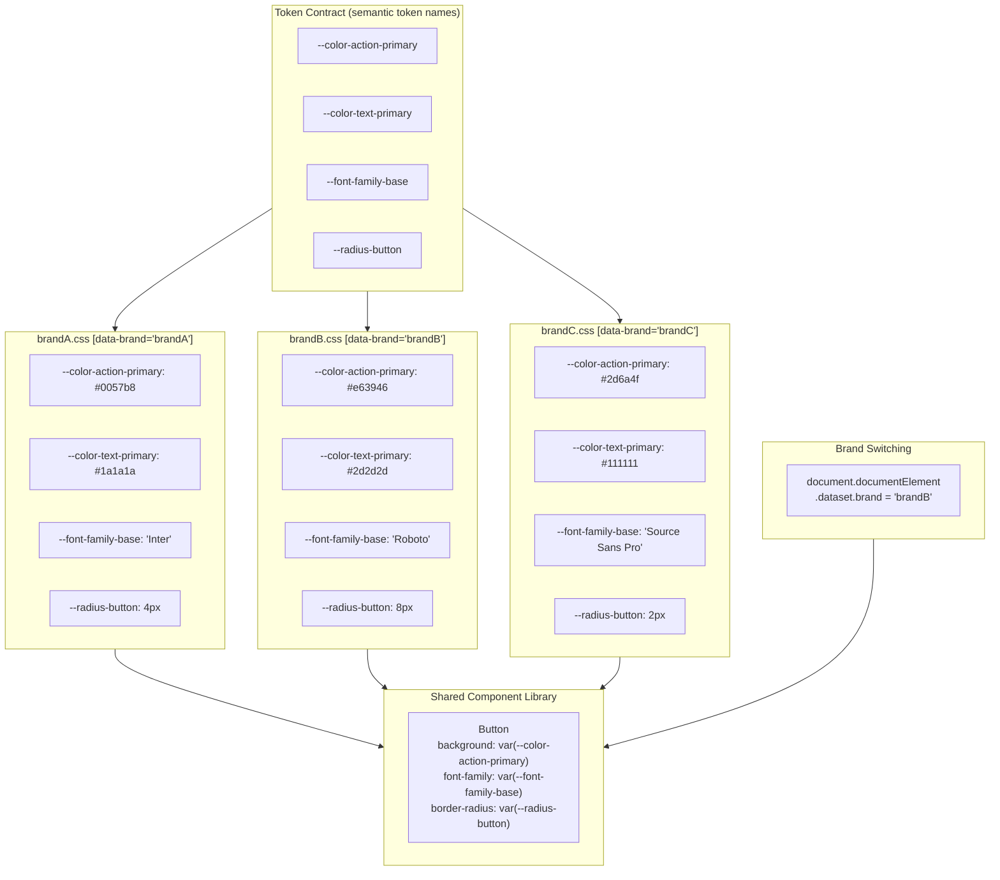

# Multi-Brand Design Systems

A multi-brand design system serves multiple product lines, subsidiaries, or
white-label customers from a single component library. The components are
shared; the visual identity — colors, typography, spacing, iconography —
varies by brand. This is distinct from theming (light/dark mode): theming
changes values within a single brand's identity; multi-brand changes which
identity is applied. The distinction matters architecturally because theming
assumes a stable semantic vocabulary and varies values within it, while
multi-brand assumes multiple independent vocabularies that all satisfy the
same structural contract.

The architectural challenge is separating the structural behavior of components
from their visual expression. A button component should work identically across
brands; its background color, border radius, and font family are brand-specific.
The mechanism for separation is the token layer: components reference semantic
tokens; each brand defines its own semantic token values. The component
implementation is written once and tested once. The brand-specific layer is a
separately maintained artifact — typically a CSS file of custom property
declarations — that fulfills the token contract without touching component code.

Build-time versus runtime theming is the central trade-off. Build-time theming
produces a separate CSS bundle per brand — each bundle contains tokens compiled
to specific values, with no runtime overhead. The server or CDN serves the
appropriate bundle based on brand context, and the browser loads only the
relevant values. Runtime theming uses CSS custom properties that can be switched
by swapping a class or attribute on the `<html>` element, enabling brand
switching without a page reload. Runtime theming pays a small overhead for
maintaining all brands' token definitions in memory, but it enables dynamic
brand selection and is simpler to manage in development environments where
multiple brands must be previewed simultaneously.

## Design Thinking

### Token namespacing per brand

The recommended mechanism for scoping brand tokens in CSS is the
`[data-brand="brandA"]` attribute selector. CSS custom property inheritance
means that brand tokens defined on an element with `[data-brand]` cascade to
all descendant elements. Because CSS custom properties inherit by default, a
single root-level attribute is sufficient to scope all tokens for an entire
page or application. Switching from one brand to another at runtime requires
only `document.documentElement.dataset.brand = 'brandB'`; all descendant
components immediately receive the new brand's token values on the next paint.

Attribute selectors are preferable to class names for brand namespacing because
they cleanly express the single-valued nature of brand context: an element
belongs to exactly one brand at a time. A `data-brand` attribute enforces this
semantically — an element cannot have two values for the same attribute —
whereas multiple class names can coexist, making it possible to accidentally
apply two brands' token blocks simultaneously and produce unpredictable
specificity resolution. Attribute selectors also interact cleanly with
server-side rendering: the brand attribute can be written directly into the HTML
response based on the request context, without requiring any JavaScript
execution before the browser paints content. This eliminates the flash of
unstyled or incorrectly branded content that can occur when brand switching
depends on a JavaScript initialization step.

When implementing nested brand contexts — for example, a widget embedded in a
host page that belongs to a different brand — the CSS cascade handles
re-scoping automatically. Setting `[data-brand="widgetBrand"]` on the widget's
root element overrides the ancestor brand's tokens for all elements within the
widget without any JavaScript coordination. The cascade's nearest-ancestor
resolution means the widget's tokens win for widget elements, and the page's
tokens apply everywhere outside the widget. This composability is one of the
strongest arguments for CSS custom property inheritance as the token delivery
mechanism.

### Build-time token compilation

Style Dictionary, Theo, and Tokens Studio are the most widely adopted tools for
compiling token JSON files to brand-specific CSS outputs. Each tool takes a
source of truth — typically JSON or YAML files that map token names to values
— and transforms it into one or more output formats per brand. The transformation
step normalizes raw design values (hex colors, pixel measurements, font names)
into the CSS custom property declarations that components consume. Because the
output is plain CSS, it integrates with any build pipeline: Webpack, Vite,
Next.js, or a CDN-hosted static file.

Build-time compilation produces a separate CSS artifact per brand. Each artifact
contains only that brand's token values; there is no runtime representation of
other brands' tokens in the browser. This means the browser parses and stores
only the token values it will actually use, keeping memory and parse time
proportional to a single brand's token count regardless of how many brands the
system supports. The trade-off is that switching brands requires loading a
different CSS file, which typically means a navigation or a dynamic stylesheet
insertion — there is no instantaneous in-page switch without pre-loading
additional brand CSS. For applications that serve exactly one brand per page
load, build-time compilation is the correct default choice.

The build-time approach also enables per-brand validation. During the
compilation step, a lint pass can verify that every brand's token file defines
all required tokens in the contract, that all color values meet a minimum WCAG
contrast ratio when composed with their typical background tokens, and that no
token references a value that does not exist in that brand's primitive set. This
validation catches missing or invalid tokens before they reach production,
shifting the error from a runtime visual defect to a build failure.

Style Dictionary's transform and format system is particularly well suited to
multi-brand workflows because it supports multiple platforms per brand — a
single source token file can produce a CSS file, an iOS Swift constants file,
and an Android resources XML file simultaneously. This is important for design
systems that span native and web surfaces: the token contract is defined once in
JSON and compiled to each platform's native format, ensuring that the same brand
identity is expressed consistently across web, iOS, and Android without
maintaining separate source files per platform.

### Shared component library with brand adapter pattern

The brand adapter pattern separates the component library's token contract from
any brand's implementation of it. The library exports unstyled or minimally
styled components along with a published list of the semantic token names those
components depend on. Each brand ships its own token file — a CSS file of custom
property declarations — that fulfills the contract. A `BrandProvider` component
or a root-level attribute injection mechanism applies the brand's token file to
the document, making the tokens available to all components rendered beneath it.
The components themselves have no knowledge of which brand is active; they
reference only the semantic token names defined in the contract.

The adapter pattern makes it straightforward to add a new brand without touching
the component library. A new brand team receives the token contract — the list
of semantic token names and their expected semantic roles — and produces a CSS
file that assigns values to each name. The library's CI pipeline can validate
the new brand's token file against the contract schema to verify completeness.
Once the token file passes validation, the new brand is deployable without any
component code changes. This decoupling is the primary operational advantage of
the adapter pattern for organizations with many brands or brands maintained by
separate teams.

The adapter pattern also facilitates incremental brand adoption. An established
product that was not originally built on a design system can adopt the shared
component library one component at a time by providing a token file that maps
the new token names to the values already in use. The token file becomes the
translation layer between the old product's visual identity and the new shared
component system. As the product's visual identity converges with the system's
design language over time, the token file's overrides shrink until the product's
token file simply maps to the system's default values.

### Brand-specific overrides beyond tokens

Some brands require structural differences beyond token value changes. A brand
with a distinctive navigation pattern, a different logo placement in the header,
or a fundamentally different card layout represents a structural difference, not
a token-level difference. No amount of token value changes will move a logo from
the left side of the navigation to the center; that requires a different markup
structure or a different component variant.

The right model is to distinguish carefully between what tokens can express and
what requires a separate component surface. Token-level differences — colors,
typography, spacing, border radii, shadows — are handled by the token layer
without any component changes. Structural differences — layout variations,
element presence or absence, interaction pattern changes — require either a new
component variant or a separate brand-specific component that wraps the shared
component. Trying to express structural differences through tokens overloads the
token system and creates semantic token names that are not genuinely semantic
(for example, `--navigation-logo-alignment: center` is a structural instruction,
not a design value).

When structural overrides are needed, a brand extension model works well. The
shared library provides the token contract and the base components. A brand
package wraps the shared components with brand-specific structural choices,
re-exporting the composed result as brand-aware components. Consumers of the
brand package import from the brand package rather than directly from the shared
library. The brand package depends on the shared library and is versioned
independently, allowing the brand's structural choices to evolve at a different
cadence than the underlying component library.

### Versioning the token contract

The token contract — the set of semantic token names that the shared component
library depends on — must be versioned alongside the component library because
changes to the contract directly affect every brand team that consumes the
library. The contract is effectively a public API for brand teams; it deserves
the same versioning discipline applied to any other public API.

Breaking changes to the contract include: adding a new required token without a
default value, renaming an existing token, removing a token that was previously
in the contract. Each of these changes requires every brand team to update their
token file before they can safely upgrade to the new library version. Breaking
changes must be communicated with a major version bump and a migration guide
that specifies which tokens were added, renamed, or removed and what values
brand teams should assign.

Additive changes — adding a new optional token that has a fallback default value
defined in the base layer — are non-breaking. If a brand does not define the
new optional token, the fallback value applies and all components render
correctly. Optional tokens should be used judiciously: an accumulation of
optional tokens with defaults can obscure which values a brand is actually
controlling versus inheriting from the base layer, making it difficult to audit
what a brand's token file actually determines about the brand's appearance.

A token contract changelog, maintained alongside the component library's
changelog, gives brand teams the information they need to plan upgrades. The
changelog entry for each contract change should state the token name, whether
the change is breaking or additive, the recommended value for the new or renamed
token, and the fallback behavior when the token is not defined.

## Best Practices

**SHOULD** implement multi-brand theming using CSS custom properties and a
`[data-brand]` attribute selector rather than separate CSS class names per
brand. The `[data-brand="X"]` attribute selector allows brand-scoped tokens to
be defined once per brand in a single CSS block, applied by setting a single
attribute on the root element, and inherited by all descendant components.
Separate CSS class names per brand introduce specificity conflicts when multiple
brand class names are accidentally present on the same element, and they do not
convey the single-valued nature of brand context as clearly as an attribute does.

**MUST** define a stable, versioned token contract between the shared component
library and brand-specific token files. The contract specifies which semantic
token names the library depends on. Adding a new token to the contract without
a default value breaks all brands that do not define it; the contract should be
versioned alongside the component library and breaking changes require a major
version bump. Brand teams depend on the contract for planning their upgrade
timeline and the contract changelog is the primary communication channel for
breaking changes.

**SHOULD** test components against each brand's token set in CI. Visual
regression tests that render components with each brand's tokens detect
unintended visual changes when tokens are updated. A component that looks
correct in the default brand may have unreadable contrast in another brand's
token set if the token values were not validated against WCAG contrast
requirements. Running visual regression across all brands in CI prevents these
defects from reaching production and catches token contract violations before
they affect users.

## Visual



## Example

```css
/* brandA.css */
[data-brand="brandA"] {
  --color-action-primary: #0057b8;
  --color-text-primary: #1a1a1a;
  --font-family-base: 'Inter', sans-serif;
  --radius-button: 4px;
}

/* brandB.css */
[data-brand="brandB"] {
  --color-action-primary: #e63946;
  --color-text-primary: #2d2d2d;
  --font-family-base: 'Roboto', sans-serif;
  --radius-button: 8px;
}

/* Button component — no brand logic, only token references */
.button {
  background-color: var(--color-action-primary);
  color: var(--color-text-primary);
  font-family: var(--font-family-base);
  border-radius: var(--radius-button);
}

/* Switching brand in JavaScript */
/* document.documentElement.dataset.brand = 'brandB'; */
```

## Common Mistakes

- Adding `if (brand === 'X')` conditionals inside component files instead of
  delegating all brand-specific differences to token values, coupling the
  component implementation to the list of brands and requiring component changes
  for every new brand or visual update.
- Using CSS class names (`.brand-a { --color: ... }`) rather than the
  `[data-brand]` attribute selector, allowing multiple brand classes to coexist
  on the same element and producing unpredictable specificity conflicts.
- Adding a new required token to the token contract without a fallback default,
  silently breaking all brand token files that do not define the new token,
  causing components to render with no value for that property.
- Attempting to express structural differences (logo placement, navigation
  layout, element presence) through token values, producing token names that are
  structural instructions rather than design values and overloading the token
  system beyond its intended abstraction level.
- Failing to version the token contract separately from the component changelog,
  making it impossible for brand teams to determine which library upgrades
  require token file changes without reading component source diffs.
- Testing visual regression only against the default brand's token set, allowing
  contrast failures, layout breaks, or missing values in other brands' token
  sets to reach production undetected.
- Mixing build-time compiled token values and runtime CSS custom properties in
  the same component, producing inconsistent behavior where some properties
  respond to brand switching and others do not.

## Related FEEs

- [FEE-900 — Design Systems & UI Libraries Overview](./900.md)
- [FEE-901 — Design Tokens](./901.md)
- [FEE-905 — Theming & Dark Mode](./905.md)
- [FEE-908 — Variant & Token Composition](./908.md)

## References

- [Style Dictionary](https://styledictionary.com)
- [Tokens Studio for Figma](https://tokens.studio)
- [Smashing Magazine: Multi-Brand Design Systems](https://www.smashingmagazine.com/2022/09/frameworks-design-systems/)
