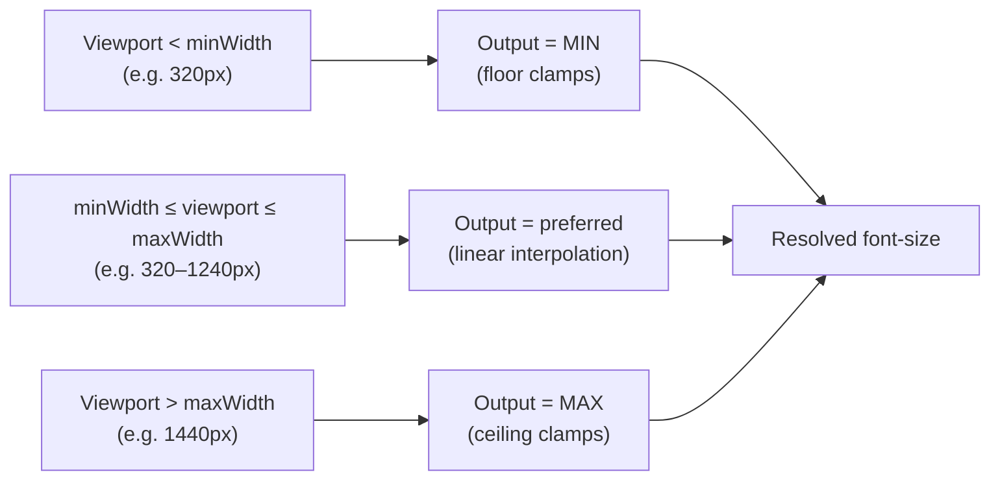

# [FEE-916] Fluid Typography & Type Scale Tokens

:::info
Fluid typography uses CSS `clamp()` to interpolate `font-size` continuously across viewport widths so a single token replaces a stack of breakpoint overrides. The technique reached Baseline in July 2020 and has since become the default expression of typographic tokens in design systems built on Utopia, Material 3, and the DTCG `typography` composite. A fluid token MUST be tuned so its maximum is at least 2x its minimum (with both expressed in `rem`), or the resulting text fails WCAG 1.4.4 at 200% zoom.
:::

## Context

Before fluid typography, responsive type scales were built from breakpoint-keyed media queries that step-changed `font-size` at 768px, 1024px, and so on. The web.dev Baseline guide for fluid type frames the shift: with `clamp()` "the change in `font-size` is constant over a range of viewport widths, rather than jumping from one value to another."

The enabling primitive is CSS `clamp(min, preferred, max)`, which MDN defines as resolving to `max(MIN, min(VAL, MAX))` — one expression carrying floor, curve, and ceiling at once. MDN records the cross-browser availability date: `clamp()` "has been available across browsers since July 2020," placing it inside the Baseline-widely-available window for any modern design system.

Type-scale tokens sit on top of that primitive. A token like `--fee-font-size-body` holds one `clamp()` expression generated from a calculator (Utopia) or a published scale (Material 3) and consumed through DTCG-format JSON.

## Visual

The diagram below traces how a single `clamp(min, preferred, max)` token resolves at three viewport widths inside its declared range.



| Region | Input viewport | Resolution rule | Effective `font-size` |
| --- | --- | --- | --- |
| Below floor | `vw < minWidth` | `max(MIN, …)` wins | `MIN` |
| In range | `minWidth ≤ vw ≤ maxWidth` | preferred value linear in `100vw` | interpolated |
| Above ceiling | `vw > maxWidth` | `min(…, MAX)` wins | `MAX` |

## Example

**Utopia preferred-value formula.** The Utopia "CSS clamp() as a fluid calculator" article gives the closed form: compute `Slope = (MaxSize - MinSize) / (MaxWidth - MinWidth)` and `yIntersection = (-1 * MinWidth) * Slope + MinSize`, then write `font-size: clamp(MinSize[rem], yIntersection[rem] + Slope * 100vw, MaxSize[rem])`. The Utopia type calculator emits exactly that form per step, e.g. `--step-0: clamp(1.125rem, 1.0739rem + 0.2273vw, 1.25rem)` for a body token interpolating from 18px at the small viewport to 20px at the large.

```css
:root {
  /* Utopia step-0 (body) — 18px → 20px across 320–1240px */
  --fee-font-size-body: clamp(1.125rem, 1.0739rem + 0.2273vw, 1.25rem);
  /* Utopia step-1 (h6) — 22.5px → 25px */
  --fee-font-size-h6:   clamp(1.40625rem, 1.3437rem + 0.2784vw, 1.5625rem);
}
```

**Material 3 type scale tokens.** Material 3 publishes a 15-token system: 5 roles (display, headline, title, body, label) crossed with 3 sizes (large, medium, small). Material's docs note that "tokens follow the naming convention `--md-sys-typescale-<scale>-<size>-<property>`." Each cell in the 5x3 grid ships a family/size/weight/line-height/tracking quintuple, and each `*-size-*` token can be authored as a `clamp()` rather than a static `rem`.

## Best Practices

- **MUST** cap fluid type with a relative unit (`rem`) and keep the max at least 2x the min — MDN: "make sure that the maximum allowed value is a relative length unit that is no less than twice the minimum allowed value."
- **SHOULD** publish typography as a DTCG `typography` composite token bundling `fontFamily`, `fontSize`, `fontWeight`, and `lineHeight` together; the DTCG draft format defines the shape (`{ "$value": { "fontFamily": [...], "fontSize": {...}, "fontWeight": 400, "lineHeight": 1.5 }, "$type": "typography" }`) and `letterSpacing` is included by convention.
- **SHOULD** treat viewport-anchoring as a calibration knob, not a default-on aesthetic. The web.dev Baseline article warns that "the more your typography responds to the viewport, the less it will respond to user preferences," so heavy `vw` weighting trades user agency for responsiveness.

## Design Thinking

Utopia's "Designing with fluid type scales" article frames the trade differently from a single-scale system: rather than picking one ratio, the designer picks two — "a typographic scale of 1.2x at 320px (mobile-ish) and 1.333x at 1500px (desktop-ish)" — and lets the math interpolate every step continuously between them. A tighter scale on small screens preserves vertical rhythm; a more dramatic scale on large screens earns hierarchy; the cost is a token whose runtime value is no longer one inspectable number.

## Deep Dive

**Hybrid pixel-plus-viewport preferred values.** The web.dev Baseline article notes a zoom-behavior nuance: "a `font-size` of `calc(16px + 1vw)` is based on both the viewport size, and also the current (zoom-relative) size of a pixel." Mixing a pixel offset with a viewport unit restores partial zoom responsiveness that pure-`vw` preferred values lose, because the pixel term scales with zoom while the `vw` term does not. Authors who avoid pixel units in tokens can express the same idea with a `rem` offset.

**Modular scales with `pow()`.** CSS `pow()` reached Baseline 2023 and, per MDN, "can be useful for strategies like CSS Modular Scale." A modular scale of ratio `r` over step `n` is `r^n`, which `pow(r, n)` expresses directly — letting a token system derive an entire ladder from one ratio variable rather than hand-coding each step.

## WCAG 1.4.4 Compliance Strategy

WCAG 2.1 Success Criterion 1.4.4 (AA) requires that "text can be resized without assistive technology up to 200 percent without loss of [content or functionality]." Naive fluid typography breaks this reproducibly.

**Why pure-`vw` ceilings fail.** Adrian Roselli's "Responsive Type and Zoom": "When people zoom a page, it is typically because they want the text to be bigger. When we anchor the text to the viewport size... we can take away their ability to do that." Viewport units (`vw`, `vi`) compute from the viewport, not the zoom-adjusted root size, so a `font-size` clamped to a `vw`-only ceiling refuses to grow when the user zooms — and 200% becomes unreachable.

**The 2x floor rule (MDN).** MDN's `clamp()` reference sets the minimum bar: "When `clamp()` is used for controlling text size, make sure that the maximum allowed value is a relative length unit that is no less than twice the minimum allowed value." Both bounds in `rem` plus a 2x ratio guarantees the user can reach 200% by zooming, because zoom scales `rem` with the root size.

**The 2.5x safe target (Barvian).** Maxwell Barvian's Smashing Magazine article tightens the rule with safety margin: "the maximum value must be less than or equal to 2.5 times the minimum value." The two numbers reconcile cleanly — 2x is the WCAG-derived floor, 2.5x is a working target that absorbs rounding, zoom granularity, and sub-pixel quirks without slipping under the floor.

**Authoring rule for tokens.** Every fluid type token MUST be authored so that, with `min` and `max` both in `rem`, `max / min ≥ 2`, and SHOULD aim for `max / min ≈ 2.5`. The Utopia calculator outputs `rem`-bounded `clamp()` by default — e.g. `--step-0: clamp(1.125rem, 1.0739rem + 0.2273vw, 1.25rem)` — making the ratio inspectable at token-review time. A linter on the token export can reject any composite `typography` token whose `fontSize.$value` `clamp()` falls below the 2x floor.

## Related Topics

- [FEE-901 Design Tokens](/en/Design%20Systems%20and%20UI%20Libraries/901)
- [DTCG Token Format Spec](/en/Design%20Systems%20and%20UI%20Libraries/dtcg-token-format-spec)

## References

- web.dev, "Baseline in action: How to use fluid type and space," web.dev (2024). https://web.dev/articles/baseline-in-action-fluid-type
- MDN contributors, "clamp() — CSS," MDN Web Docs. https://developer.mozilla.org/en-US/docs/Web/CSS/Reference/Values/clamp
- MDN contributors, "pow() — CSS," MDN Web Docs. https://developer.mozilla.org/en-US/docs/Web/CSS/Reference/Values/pow
- W3C, "Understanding Success Criterion 1.4.4: Resize text," WCAG 2.1 Understanding Documents. https://www.w3.org/WAI/WCAG21/Understanding/resize-text.html
- Adrian Roselli, "Responsive Type and Zoom," adrianroselli.com (2019). https://adrianroselli.com/2019/12/responsive-type-and-zoom.html
- Maxwell Barvian, "Addressing Accessibility Concerns With Using Fluid Type," Smashing Magazine (2023). https://www.smashingmagazine.com/2023/11/addressing-accessibility-concerns-fluid-type/
- Utopia, "Fluid type scale calculator," utopia.fyi. https://utopia.fyi/type/calculator/
- James Gilyead and Trys Mudford, "CSS clamp() as a fluid calculator," utopia.fyi. https://utopia.fyi/blog/clamp/
- James Gilyead and Trys Mudford, "Designing with fluid type scales," utopia.fyi. https://utopia.fyi/blog/designing-with-fluid-type-scales/
- Design Tokens Community Group, "Design Tokens Format Module (Draft)," designtokens.org. https://www.designtokens.org/tr/drafts/format/
- Material Web, "Typography theming," material-web.dev. https://material-web.dev/theming/typography/
