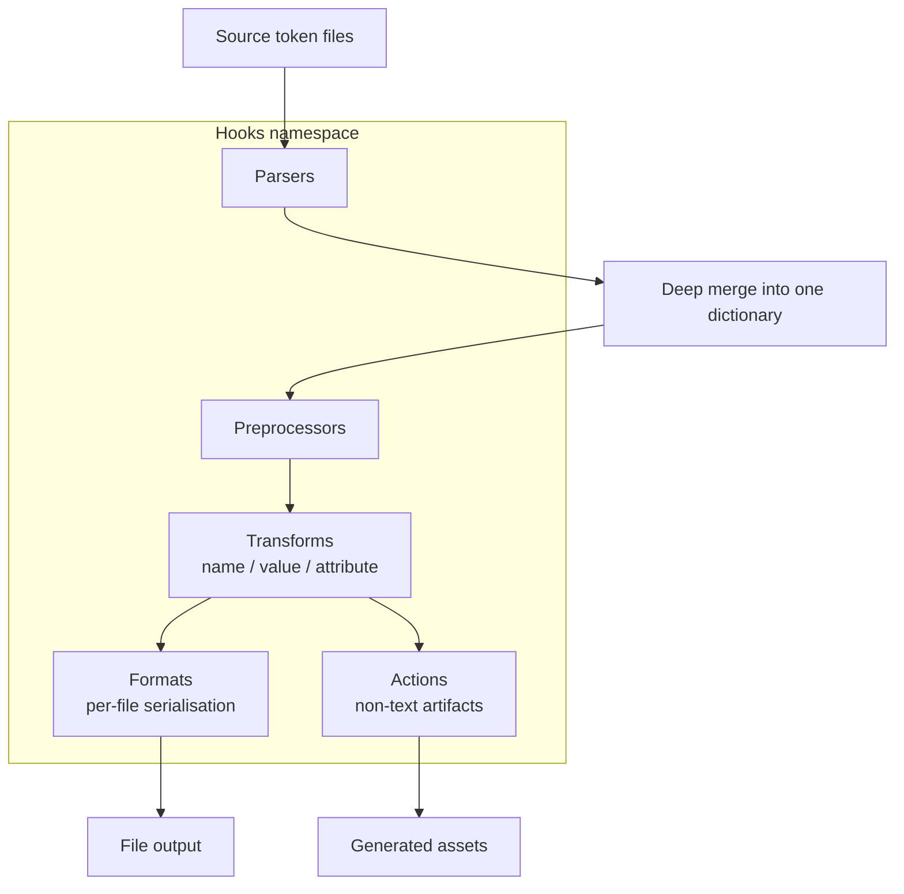

# [FEE-911] Style Dictionary 4 Build Pipeline — Transforms, Formats, Hooks

:::info
Style Dictionary 4 reorganises every extension point under a single `hooks` namespace and runs a fixed phase order: parsers, deep-merge, preprocessors, transforms, formats, then actions. Senior tooling owners need to know which hook to reach for, how transitive transforms interact with reference resolution, and which v3 idioms break under the new ESM-only, async, DTCG-aware runtime. This article walks the pipeline, shows a custom format that preserves CSS `var()` references, lists every hook type, and tracks the v3-to-v4 breaking changes.
:::

## Context

Style Dictionary is a token build system whose architecture documentation describes a single pass: it "takes all the files it found and performs a deep merge... it then performs all the transforms defined in your config in order... for each file defined in the platform it formats the token object and write the output to a file." That sentence packs the entire pipeline into one phrase, so each stage is worth naming on its own: parsers ingest the source files, deep-merge combines them into one tree, preprocessors operate on the merged dictionary, transforms rewrite individual tokens for a target platform, formats serialise platform output, and actions run side-effects such as copying assets.

Transforms carry the per-platform translation work. The reference docs define a transform as a function "that modify a token so that it can be understood by a specific platform" — the transform mutates the token's `name`, `value`, or `attributes` so that a single source token can land as `--color-bg-default` in CSS, `colorBgDefault` in JavaScript, and `R.color.bg_default` in Android. Phases compose: a transform that converts a hex value to an Android `Color` int produces the value the format then stamps into `colors.xml`.

## Visual



## Example

A custom CSS variables format that respects DTCG token shape and emits `var()` references when the source token referenced another token.

```js
// build.config.js
import StyleDictionary from 'style-dictionary';

StyleDictionary.registerFormat({
  name: 'css/variables-with-refs',
  format: ({ dictionary, options, file, usesDtcg }) => {
    const valueKey = usesDtcg ? '$value' : 'value';
    const lines = dictionary.allTokens.map((token) => {
      // When outputReferences is true, use the original (un-resolved) value
      // so references serialise as var(--token-name) rather than literals.
      const raw = token.original[valueKey];
      const out = options.outputReferences && dictionary.usesReference(raw)
        ? dictionary.getReferences(raw).reduce((acc, ref) => {
            return acc.replace(ref.value, `var(--${ref.name})`);
          }, raw)
        : token[valueKey];
      return `  --${token.name}: ${out};`;
    });
    return `:root {\n${lines.join('\n')}\n}\n`;
  },
});

const sd = new StyleDictionary({
  source: ['tokens/**/*.json'],
  platforms: {
    css: {
      transformGroup: 'css',
      files: [{
        destination: 'build/variables.css',
        format: 'css/variables-with-refs',
        options: { outputReferences: true },
      }],
    },
  },
});

await sd.buildAllPlatforms();
```

The format function signature is `(args) => string` per the formats reference, which states a format "takes an object as the argument and should return a string which is then written to a file." The `usesDtcg` arg "tells you whether the Design Token Community Group spec is used with $ prefixes ($value, $type etc.)," letting one format serve both legacy and DTCG inputs. The `outputReferences: true` option keeps `var(--color-base)` in the output instead of inlining the resolved hex, per the formats docs: "The css variables file now keeps the references you have in your Style Dictionary."

## Best Practices

- **MUST** start from a predefined `transformGroup` when targeting a known platform. The `css`, `scss`, `js`, `android`, `ios-swift`, `compose`, `flutter`, and `react-native` groups bundle the conventional transforms (`name/kebab`, `size/rem`, `color/css`, etc.); override individual transforms only when the bundled chain produces wrong output.
- **SHOULD** set `outputReferences: true` on CSS, Sass, and JS formats whose tokens form a layered scale (primitives → semantic → component). Preserving `var(--color-base)` lets downstream theming swap the primitive at runtime without rebuilding.
- **SHOULD** scope multi-file output via the file-level `filter` option. The formats reference notes that `filter` "will filter the tokens before they get to the format," letting one platform emit `colors.css` and `spacing.css` from disjoint subsets.
- **MAY** combine `outputReferences` with a token-aware predicate function in v4 when only a subset of references should survive.

## Design Thinking

The v4 pipeline trades configuration density for namespace clarity. Folding `transform`, `format`, `filter`, `parser`, `preprocessor`, `action`, and `fileHeader` registries into a single plural-keyed `hooks` object adds one indirection on every registration call and eliminates the v3 ambiguity where `filter` could refer to a token filter, a function, or a registered name depending on context. Tooling authors writing generic plugins now have one shape to target.

The split between transforms (per-token, platform-scoped) and preprocessors (whole-dictionary, optionally platform-scoped) is a similar trade. Preprocessors let plugins normalise shape (e.g., expand DTCG composite types) before transforms run, so transforms stop repeating defensive parsing. The price is one more phase to reason about when debugging output.

## Deep Dive

Reference resolution in v4 is iterative. The transforms reference describes the algorithm: "Style Dictionary will transform and resolve values iteratively." Concretely, the runtime first transforms every non-referenced token, then resolves references that pointed at those now-transformed values, then runs transforms again on the freshly-resolved tokens, and continues until the dictionary stabilises. A chain `--color-button → --color-brand → #0066ff` therefore goes through transform-resolve-transform rather than resolve-once-then-transform.

Transitive transforms make this loop observable. A normal `value` transform sees the original raw value and is skipped when the value is a reference (Style Dictionary cannot run `color/hex` on the literal string `{color.brand}`). A transitive transform opts into running on the already-resolved downstream value: the transforms reference says transitive transforms "allow you to transform a referenced value." This is the correct hook for behaviour that depends on the final value, such as computing a contrast-aware foreground or appending an opacity suffix. Mark `transitive: true` on the transform and Style Dictionary places it in the iterative loop. If a transform appears skipped on referenced tokens, flip it to transitive rather than flattening references upstream.

## Hook Type Reference Table

Every extension point in v4 lives under `hooks` with a plural key. The migration guide states it directly: "Hooks are now all grouped under the `hooks` property, they all use plural form vs singular."

| Hook key | Phase | Operates on | Purpose |
| --- | --- | --- | --- |
| `hooks.parsers` | Ingest | A single source file | Read non-JSON token sources (YAML, JS5, TS) and return a JSON-serialisable object |
| `hooks.preprocessors` | Post-merge | The whole merged dictionary (global or per-platform) | Normalise or rewrite the token tree before transforms run |
| `hooks.transforms` | Per-platform | Individual tokens | Three subtypes: `value` rewrites the rendered value, `name` rewrites the token name, `attribute` adds metadata to `token.attributes` |
| `hooks.transformGroups` | Per-platform | Ordered list of transforms | Named bundle of transforms a platform applies in order |
| `hooks.filters` | Pre-format | Token list | Subset the dictionary that reaches a single file or format |
| `hooks.formats` | Per-file | The filtered token list | Serialise tokens to a string written to disk |
| `hooks.fileHeaders` | Per-file | File context | Emit the comment header prepended to formatted output |
| `hooks.actions` | Post-format | Platform output directory | Generate non-text artifacts (sprites, copy images, write binaries) |

Parsers unlock alternative source formats: the parsers reference notes "you can define custom parsers to parse design token files," provided the parser returns JSON-shaped data. Preprocessors are the right layer for cross-token rewrites; the preprocessors reference describes them as processing "the dictionary object as a whole, after all token files have been parsed and combined into one." Actions are the escape hatch the actions reference frames as "a way to run custom build code such as generating binary assets like images" — reach for them when output is not a single text file.

## Migration from 3.x

Style Dictionary 4 ships breaking changes that are mechanical to apply but easy to miss in a partial upgrade.

- **ESM-only, browser-compatible.** The migration guide records: "Style Dictionary has been entirely rewritten in ES Modules, in a way that is browser-compatible out of the box." CommonJS `require('style-dictionary')` no longer works; consumers must use `import` or dynamic `import()`. The library is now an instantiable class.
- **Async build APIs.** `extend()`, `exportPlatform()`, `getPlatform()`, and `buildAllPlatforms()` are all async per the migration guide. Every call site must `await` (or `.then()`) the result; a forgotten `await` returns a pending Promise and silently skips the build.
- **DTCG first-class, exclusive per instance.** The DTCG info page states: "As of version 4, Style Dictionary has first-class support for the DTCG format." A single Style Dictionary instance reads DTCG keys (`$value`, `$type`, `$description`) or legacy keys, with no mixing.
- **Type routing replaces CTI.** The migration guide documents the change: "In version 4, we have removed almost all hard-coupling/reliances on CTI structure and instead we will look for a `token.type` property." Custom transforms that matched on `attributes.category` need to switch to `token.type`.
- **`properties`/`allProperties` removed.** The v4.0.0 release notes confirm: "allProperties / properties was deprecated in v3, and is now removed from StyleDictionary.Core, use allTokens and tokens instead." Format authors who reached into `dictionary.allProperties` must rename.
- **Filter namespace moved.** Per the v4.0.0 release notes: "Filters, when registered, are put inside the hooks.filters property now, as opposed to filter." Same call shape, different location on the registry.

## Related Topics

- [Design Tokens (FEE-901)](/en/Design%20Systems%20and%20UI%20Libraries/901)
- [DTCG Token Format Spec](/en/Design%20Systems%20and%20UI%20Libraries/dtcg-token-format-spec)

## References

- Style Dictionary, "Architecture." https://styledictionary.com/info/architecture/
- Style Dictionary, "Hooks: Transforms." https://styledictionary.com/reference/hooks/transforms/
- Style Dictionary, "Predefined Transform Groups." https://styledictionary.com/reference/hooks/transform-groups/predefined/
- Style Dictionary, "Hooks: Formats." https://styledictionary.com/reference/hooks/formats/
- Style Dictionary, "Hooks: Parsers." https://styledictionary.com/reference/hooks/parsers/
- Style Dictionary, "Hooks: Preprocessors." https://styledictionary.com/reference/hooks/preprocessors/
- Style Dictionary, "Hooks: Actions." https://styledictionary.com/reference/hooks/actions/
- Style Dictionary, "Configuration." https://styledictionary.com/reference/config/
- Style Dictionary, "DTCG Support." https://styledictionary.com/info/dtcg/
- Style Dictionary, "v4 Migration Guide." https://styledictionary.com/versions/v4/migration/
- Amazon, "style-dictionary v4.0.0 release notes," GitHub (2024). https://github.com/amzn/style-dictionary/releases/tag/v4.0.0
