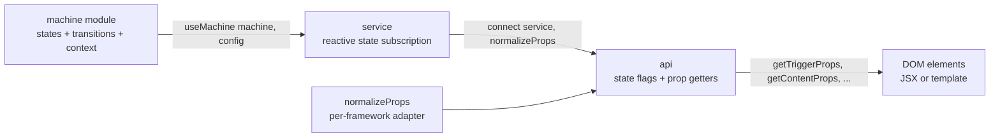

# [FEE-914] Framework-Agnostic State Machines — Zag.js and Ark UI

:::info
Zag.js models complex, accessible UI components as finite state machines so the same logic can power React, Vue, Solid, and Svelte through thin adapters. Ark UI wraps those machines into 45+ headless components with identical APIs across frameworks. This article covers the machine model, the `connect` API, and how the architecture differs from React-only headless libraries.
:::

## Context

Zag.js describes itself as "a framework agnostic toolkit for implementing complex, interactive, and accessible UI components in your design system and web applications." The core idea is to write each component's behavior once as a state machine, then expose it to any framework through a small adapter layer. The base implementation is inspired by XState. Zag credits "XState for inspiring the base implementation of the state machine," though Zag does not depend on XState at runtime.

Because the machine itself is plain JavaScript, the same component logic is reused via thin adapters across React, Vue, and Solid: "We provide adapters for JS frameworks so you can use it in React, Solid, or Vue 3." Ark UI builds on this foundation: it is "a headless library with 45+ accessible components" whose React, Solid, Vue, and Svelte packages share a single source of truth in Zag.

The project is maintained by Chakra Systems Inc. under the GitHub `chakra-ui` organization and is MIT-licensed: "The Zag.js project is licensed under the MIT License, with copyright held by Chakra UI as of 2021." Despite the Chakra heritage, both Zag.js and Ark UI are framework-agnostic and unstyled, with no dependency on Chakra UI's styling layer.

## Visual

The data flow from machine definition to rendered DOM follows a fixed pipeline: a machine module is instantiated by `useMachine` (the framework adapter), which produces a service; `connect` then combines the service with `normalizeProps` to produce an `api` of prop getters that get spread onto DOM elements.



The pipeline mirrors the documented integration steps: "All frameworks follow this basic structure: 1. Import the machine and framework adapter 2. Initialize with useMachine ... 3. Connect the machine using connect() with normalizeProps 4. Access API methods like getTriggerProps() and getContentProps()."

## Example

The canonical usage pattern, taken from the Zag installation guide for the tooltip component, is:

```tsx
import * as tooltip from "@zag-js/tooltip"
import { useMachine, normalizeProps } from "@zag-js/react"

function Tooltip() {
  const service = useMachine(tooltip.machine, { id: "1" })
  const api = tooltip.connect(service, normalizeProps)

  return (
    <div>
      <button {...api.getTriggerProps()}>Hover me</button>
      {api.open && (
        <div {...api.getPositionerProps()}>
          <div {...api.getContentProps()}>Tooltip content</div>
        </div>
      )}
    </div>
  )
}
```

Three points are load-bearing. First, `useMachine(tooltip.machine, { id: "1" })` returns a `service`: a reactive subscription handle, not raw state. Second, `tooltip.connect(service, normalizeProps)` produces `api`, an object exposing both state flags (`api.open`) and prop getters (`api.getTriggerProps`, `api.getContentProps`). Third, every interactive element receives its props by spreading a getter call; the getters carry event handlers, ARIA attributes, and identifiers tied to the machine. The same pattern, with `@zag-js/vue` or `@zag-js/solid` substituted for `@zag-js/react`, produces equivalent components in those frameworks.

## Best Practices

- **MUST** treat Zag and Ark UI as headless. Zag ships no styling: "The machine APIs are completely unstyled." Bring your own CSS, Tailwind layer, or design tokens; do not expect visual defaults.
- **MUST** rely on the machines' built-in accessibility rather than reimplementing keyboard handling. Zag is "built with accessibility in mind," with WAI-ARIA roles, keyboard interactions, focus management, and ARIA attributes baked into each machine. Ark UI inherits this: "Built on top of Zag.js state machines, Ark UI delivers robust, framework-agnostic component logic" with WCAG-compliant defaults.
- **SHOULD** pick Ark UI when the design system targets multiple frameworks. Per the LogRocket comparison, "Framework Support — Radix Primitives & React Aria: React only. Ark UI: React, Vue, Solid"; choosing Ark UI removes the cost of reimplementing primitives in each framework.
- **SHOULD** match the mental model to the team's bias. The same comparison summarizes: "Radix Primitives: Component anatomy and composition. React Aria: Hooks with explicit state. Ark UI: State machines and parts." Teams comfortable with explicit state transitions will find Zag/Ark natural; teams that think in component anatomy may prefer Radix.
- **MAY** mix Ark UI with framework-specific libraries when a project is single-framework and needs ecosystem features the other libraries provide. Framework-agnosticism is a benefit only when more than one framework is in scope.

## Design Thinking

Segun Adebayo, the original author of Chakra UI, framed the motivation explicitly: "Every interactive component in Chakra UI will be modeled as a state machine ... any solution we build has to be framework agnostic." The trade-off is that authoring component logic as a state machine costs more upfront than writing a React-specific hook, but it lets one implementation power React, Vue, Solid, Angular, and Svelte without divergence. For a maintainer of a design system that wants to support more than one framework, the per-framework reimplementation cost grows linearly with framework count, while the machine cost is paid once. Chakra Systems chose to absorb the upfront cost so the long-tail maintenance burden stays bounded.

## Deep Dive

The closest peer to Ark UI in the React ecosystem, React Aria Components, takes a different architectural path: behavior is propagated through React contexts. The Adobe documentation states that "React Aria Components automatically provide behavior to their children by passing event handlers and other attributes via context." This binds the library to React's runtime (context, hooks, and the reconciler) and rules out a direct port to Vue or Svelte without rewriting the propagation mechanism.

Zag's machine + `connect` approach replaces the React context with two plain values: a `service` (reactive subscription) and an `api` object (prop getters). Both are framework-neutral; the only React-specific code lives in `@zag-js/react`, which knows how to subscribe a component to the service and how `normalizeProps` should shape event names. Swapping React for Solid swaps only the adapter package. The behavior, accessibility, and state transitions are unchanged because they live in the machine module, not in a framework-specific hook tree.

## State Machine Connect API

A Zag state machine is "a way to model stateful, reactive behavior using: A finite number of states [and] A finite number of transitions between those states." Each machine also carries a reactive `context`: the per-instance data (current value, selected index, anchor element, etc.) that transitions can read and update. The machine module itself is declarative: states, events, transitions, guards, and actions, with no DOM access.

The `connect` function is the bridge from machine state to DOM. It exposes prop getters: "Methods like getButtonProps() return normalized attributes for elements, encapsulating the machine's state and event handlers for framework-agnostic consumption." Each getter returns an object containing the event handlers (`onClick`, `onKeyDown`), ARIA attributes (`aria-expanded`, `aria-controls`), `id`, `role`, and `data-*` attributes appropriate for the current machine state. The component author spreads the result onto the matching JSX element.

`normalizeProps` is the per-framework shim that reconciles surface differences between frameworks. It "converts the props of the component into the format that is compatible" with the target framework. For example, React uses camelCase event names like `onKeyDown` while Vue templates use lowercase `onKeydown`, and inline-style shapes differ across frameworks. The machine emits a canonical prop shape; `normalizeProps` translates it. This is why the same machine and the same `connect` call work unchanged across `@zag-js/react`, `@zag-js/vue`, and `@zag-js/solid`: only the imported `normalizeProps` changes.

## Related Topics

- [React Aria Components](/en/Design%20Systems%20and%20UI%20Libraries/react-aria-components)
- [Headless Component Libraries (FEE-902)](/en/Design%20Systems%20and%20UI%20Libraries/902)

## References

- Zag.js, "Introduction." https://zagjs.com/overview/introduction
- Zag.js, "Homepage." https://zagjs.com/
- Zag.js, "What's a Machine?" https://zagjs.com/overview/whats-a-machine
- Zag.js, "Installation." https://zagjs.com/overview/installation
- Chakra Systems, "chakra-ui/zag (GitHub repository)." https://github.com/chakra-ui/zag
- Chakra Systems, "Zag.js LICENSE (MIT)." https://github.com/chakra-ui/zag/blob/main/LICENSE
- Ark UI, "Homepage." https://ark-ui.com/
- Chakra Systems, "chakra-ui/ark (GitHub repository)." https://github.com/chakra-ui/ark
- Segun Adebayo, "The Future of Chakra UI." https://www.adebayosegun.com/blog/the-future-of-chakra-ui
- LogRocket, "Headless UI alternatives: Radix Primitives, React Aria, Ark UI." https://blog.logrocket.com/headless-ui-alternatives-radix-primitives-react-aria-ark-ui/
- Adobe, "React Aria — Advanced (Contexts)." https://react-spectrum.adobe.com/react-aria/advanced.html
