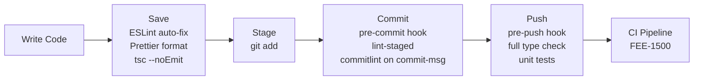
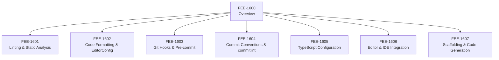

# Developer Experience & Tooling Overview

:::info
This category covers the tooling that runs on your machine while you write code —
linters, formatters, git hooks, commit validators, type checkers, and scaffolding generators.
These tools enforce quality incrementally, at the point where it costs the least to fix problems.
:::

## Context

Most frontend engineering teams invest heavily in build tooling and CI pipelines.
They pick a bundler, configure tree-shaking, tune chunk splitting, and spend real effort
ensuring that the artifact delivered to users is correct, fast, and well-tested.
That investment is reasonable — the build pipeline is the last gate before production.

But a parallel investment is often missing: the tooling that shapes code *as it is being written*.
Many teams treat editor plugins, linters, and commit hooks as personal preferences —
optional additions that individual engineers configure (or skip) on their own machines.
The result is predictable: pull request diffs full of formatting noise,
CI pipelines that fail on lint errors that a pre-commit hook would have caught in two seconds,
and codebases where the commit history is either unstructured or maintained only through social pressure.

Developer Experience (DX) tooling is the category of tools that close this gap.
They do not transform code for the browser — that is Build Tooling's job.
They enforce quality agreements between engineers *while code is being written and committed*,
before anything reaches a shared branch.

The economic argument is straightforward.
Fixing a problem at the editor layer — a misconfigured import, a missing type annotation —
costs one keystroke and a tooltip.
Fixing the same problem after it lands in a pull request costs a review cycle.
Fixing it after it reaches CI costs a pipeline run and a context switch.
Fixing it in production costs an incident.
The earlier in the lifecycle a problem is caught, the cheaper it is to address.
DX tooling moves the catch point as close to the origin as possible.

This category, FEE-1600 through FEE-1607, examines every layer of that lifecycle:

- **FEE-1601 — Linting & Static Analysis:** ESLint, its plugin ecosystem,
  and how static analysis catches correctness problems that formatters cannot see.
- **FEE-1602 — Code Formatting & EditorConfig:** Prettier and EditorConfig —
  how opinionated auto-formatting eliminates style debates and what EditorConfig contributes
  for multi-editor teams.
- **FEE-1603 — Git Hooks & Pre-commit Automation:** Husky, lint-staged, and the
  `.husky/` directory — how hooks run quality checks only on staged files
  and how to make them fast enough that engineers never disable them.
- **FEE-1604 — Commit Conventions & commitlint:** Conventional Commits and commitlint —
  how a structured commit message format enables automated changelogs, semantic versioning,
  and meaningful git history.
- **FEE-1605 — TypeScript Configuration:** `tsconfig.json` strategy — strict mode,
  project references, incremental compilation, and how TypeScript fits into the save and push layers.
- **FEE-1606 — Editor & IDE Integration:** Language Server Protocol, extensions,
  and how to surface lint errors and type information in real time inside the editor itself.
- **FEE-1607 — Scaffolding & Code Generation:** Plop, Hygen, and custom generators —
  how code generation eliminates copy-paste errors and enforces structural conventions
  at the moment a new module is created.

## Design Thinking

### DX Tooling Is an Engineering Concern, Not a Personal Preference

The most common failure mode in this space is treating DX tooling as optional infrastructure —
something a senior engineer sets up once for themselves and documents in a README
that new team members may or may not read.

This framing is wrong in two ways.

First, the benefits of DX tooling are multiplied by consistency.
An ESLint config that only some engineers run produces inconsistent lint results —
files touched by engineers who skip the config accumulate violations,
and those violations are discovered only when someone else runs the linter later.
A Prettier configuration that some engineers run on save and others ignore
means that every pull request touching a shared file produces formatting-only diffs
that obscure the real change.
The tooling only eliminates the noise when everyone on the team runs the same tools
against the same configuration on every relevant action.

Second, DX tooling encodes team agreements.
When your ESLint config disallows `any` in TypeScript, it is not a style choice —
it is a documented statement that this team does not escape the type system without explicit justification.
When your commitlint config enforces Conventional Commits, it is not a formatting preference —
it is a decision that your release toolchain can read the commit log and derive a changelog.
These agreements belong in version-controlled configuration files that run automatically,
not in style guides that depend on engineers remembering to read and apply them.

The practical implication: DX tooling should be installed, configured, and version-controlled in the repository.
New engineers who clone the repository and run the standard install command
should get all quality gates activated without any additional setup.
That is the baseline.

### The Boundary with Build Tooling (FEE-800)

The FEE-800 category covers the pipeline that transforms source code into browser-executable assets:
transpilation, bundling, tree-shaking, minification.
That pipeline runs when you trigger a build — either locally with `pnpm build`
or automatically in CI.

DX tooling runs earlier in a different dimension: in the editor, on save, on stage, on commit, on push.
The two categories operate on the same codebase but serve entirely different purposes.

| Dimension | Build Tooling (FEE-800) | DX Tooling (FEE-1600) |
|-----------|------------------------|----------------------|
| **Purpose** | Transform code for the browser | Enforce quality as code is written |
| **Trigger** | `pnpm build`, CI pipeline | Save, stage, commit, push |
| **Output** | Optimized static assets | Error reports, formatted files, blocked commits |
| **Scope** | Entire project at build time | Changed files at development time |
| **Primary tools** | Vite, Webpack, esbuild, Rollup | ESLint, Prettier, Husky, commitlint |

The two categories complement each other.
Build tooling ensures the artifact is correct for users.
DX tooling ensures the source code is correct for engineers.
A project that invests in build tooling but neglects DX tooling will produce correct builds
from an increasingly inconsistent and hard-to-navigate codebase.
A project that invests in DX tooling but neglects build tooling will have a clean source tree
that still does not load correctly in target environments.
Both are necessary; neither substitutes for the other.

### The Four Layers of the DX Lifecycle

Developer experience tooling is best understood as four layers that intercept code
at progressively later points in the development cycle.
Each layer has a different cost-to-fix ratio: the earlier the layer, the cheaper each fix.

**Editor layer** — Tooling that surfaces feedback inside the editor in real time,
before a file is even saved.
The Language Server Protocol (LSP) is the key infrastructure here:
`typescript-language-server`, `vscode-eslint`, and similar extensions communicate with
language servers that analyze code continuously and report errors, warnings, and code actions
inline as you type.
The editor layer has the fastest feedback loop in software development.
The engineer sees the problem at the moment they create it.

**Save layer** — Tooling that runs when the engineer saves a file.
Prettier re-formats the file to match the project's style configuration.
ESLint auto-fixes what it can and flags the rest.
TypeScript type-checks the module if configured to run on save.
This layer ensures that files are always in a consistent state before they are staged.

**Commit layer** — Tooling that runs when the engineer commits staged changes.
Husky activates the `pre-commit` hook, which invokes lint-staged.
lint-staged runs linters and formatters only on the files that are staged —
not the entire codebase — which keeps the hook fast.
After the commit message is composed, the `commit-msg` hook invokes commitlint,
which validates that the message conforms to the Conventional Commits format.
This layer ensures that no malformed code or unconventional commit message
ever enters the repository.

**Push layer** — Tooling that runs when the engineer pushes a branch.
The `pre-push` hook runs the full TypeScript type check across the project
(not just staged files — a change in one module can break type compatibility in another),
and optionally runs a subset of tests.
This layer provides a final local quality gate before the code reaches CI.

## Visual

### The DX Tooling Lifecycle

The following diagram maps each stage of the developer workflow to the tools that run at that stage.
Moving left to right, each gate catches problems before they reach the next stage,
where the cost of fixing them increases.

### Category Map

## Category Roadmap

The seven articles in this category each focus on one layer or tooling concern.
They can be read in order or individually — each article is self-contained.

- **[FEE-1601 — Linting & Static Analysis](./1601.md)**
  ESLint architecture, rule configuration, the plugin ecosystem (typescript-eslint, eslint-plugin-react),
  and how to distinguish correctness rules from style rules so your config stays maintainable.

- **[FEE-1602 — Code Formatting & EditorConfig](./1602.md)**
  Prettier's opinionated formatting model, EditorConfig for cross-editor whitespace consistency,
  and how to configure both to work together without conflicts.

- **[FEE-1603 — Git Hooks & Pre-commit Automation](./1603.md)**
  How Git hooks work, Husky's setup model, and lint-staged's staged-file scoping strategy —
  the combination that makes pre-commit automation fast enough to keep enabled permanently.

- **[FEE-1604 — Commit Conventions & commitlint](./1604.md)**
  The Conventional Commits specification, commitlint configuration, and how a structured commit format
  enables automated semantic versioning and changelog generation.

- **[FEE-1605 — TypeScript Configuration](./1605.md)**
  `tsconfig.json` in depth — strict mode flags, project references, composite builds,
  and how to position TypeScript checking at the right layer in the DX lifecycle.

- **[FEE-1606 — Editor & IDE Integration](./1606.md)**
  Language Server Protocol fundamentals, VS Code and WebStorm extension configuration,
  and how to surface lint errors and type diagnostics inline without requiring a separate terminal run.

- **[FEE-1607 — Scaffolding & Code Generation](./1607.md)**
  Plop and Hygen as code generation frameworks — how generator templates enforce structural conventions
  at the moment a new component, hook, or module is created, eliminating copy-paste drift.

## Related FEEs

- [FEE-1601 — Linting & Static Analysis](./1601.md) —
  ESLint, rule configuration, and static analysis for correctness
- [FEE-1602 — Code Formatting & EditorConfig](./1602.md) —
  Prettier and EditorConfig for consistent style
- [FEE-1603 — Git Hooks & Pre-commit Automation](./1603.md) —
  Husky and lint-staged: automating quality checks at commit time
- [FEE-1604 — Commit Conventions & commitlint](./1604.md) —
  Conventional Commits and automated commit message validation
- [FEE-1605 — TypeScript Configuration](./1605.md) —
  tsconfig.json strategy and TypeScript in the DX lifecycle
- [FEE-1606 — Editor & IDE Integration](./1606.md) —
  Language servers and real-time diagnostics in the editor
- [FEE-1607 — Scaffolding & Code Generation](./1607.md) —
  Code generators that enforce structural conventions at creation time
- [FEE-800 — Build Tooling & Module Systems Overview](../Build%20Tooling%20and%20Module%20Systems/800.md) —
  The complementary category: transforming code for the browser
- [FEE-1100 — Testing Strategies Overview](../Testing%20Strategies/1100.md) —
  Tests that run in the pre-push hook as a local quality gate
- [FEE-1500 — CI/CD Overview](../CI%20CD%20and%20Deployment/1500.md) —
  The pipeline that mirrors and extends local DX quality gates
