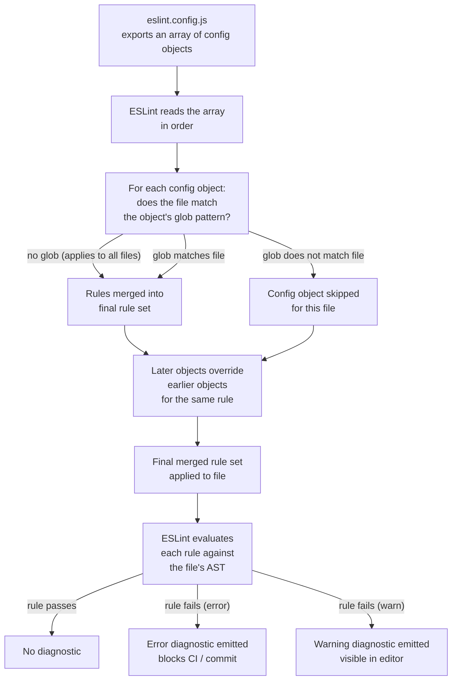

# Linting & Static Analysis

Linting is automated code review. Every time you save a file, a linter reads the abstract syntax tree of your code and compares it against a set of rules — patterns known to be incorrect, dangerous, or inconsistent with your team's agreements. Violations are reported immediately, in the editor, before the file is even staged for a commit.

The practical effect is a quality gate that never sleeps, never has a bad day, and never misses a file. A lint rule that fires on every save catches a class of bugs more reliably than any PR review process, because it runs on every line every time — not just when a reviewer happens to look at that path, not just when a test exercises that branch.

Static analysis extends this idea beyond stylistic concerns. Tools like TypeScript's type checker and type-aware ESLint rules operate on the full semantic model of the program — they know what type each variable holds, which functions can return `null`, and whether a `Promise` is being awaited. These checks catch bugs that are invisible to a pure syntax parser and impossible to detect without understanding the relationship between modules.

## Principle

Lint errors must be treated as blocking, not advisory. Set all actionable rules to `error`; reserve `warn` only for rules being phased in or phased out, and remove `warn` rules once the migration is complete. Run `eslint --max-warnings 0` in CI to enforce this contract. A lint warning that developers learn to ignore is not a quality gate — it is noise that trains engineers to ignore the tool.

## Design Thinking

### Why ESLint flat config replaced `.eslintrc`

ESLint's original configuration system used a cascade: ESLint would walk the directory tree upward from the file being linted, collecting every `.eslintrc.*` file it found, and merge them all together. This was convenient at first — you could drop an `.eslintrc` file into a subdirectory to override rules for that subtree. But the cascade introduced a category of problems that proved difficult to escape.

The first problem was implicit behavior. The set of rules applied to any given file depended on the directory hierarchy of the machine running ESLint. Two engineers with different project layouts could see different lint results for the same file. A monorepo with packages at varying depths was particularly difficult to reason about: which package's `.eslintrc` won for a file at a given path?

The second problem was plugin loading. In the cascade model, plugins were loaded by name string (`"plugin:react/recommended"`). ESLint resolved the plugin from `node_modules` using its own resolution logic, which differed from Node's standard module resolution. This led to version conflicts, especially in monorepos where the same plugin appeared at multiple depths in `node_modules`.

ESLint's flat config, introduced in v9 and backported as an option in v8, solves both problems with a single mechanism: `eslint.config.js` is a normal JavaScript module. It uses explicit `import` statements to load plugins. There is no directory traversal, no hidden config lookup, and no implicit merging — the file simply exports an array of configuration objects, and ESLint applies them in order. Later objects in the array override earlier ones for files that match both objects' glob patterns. This is the same composability model used by Vite plugins, Rollup plugins, and every other modern JavaScript build tool.

The explicit import model also unlocks shareable configs as proper npm packages that export arrays of config objects, rather than as strings that trigger special resolution logic. A shared config is now just a function or array you import and spread into your own config.

### Why type-aware rules are worth the performance cost

ESLint's base rule set operates on the syntax tree of a single file. It can tell you that a variable is declared but never used, that a `switch` statement is missing a `default` case, or that `==` is used where `===` is required. What it cannot tell you, without type information, is whether a function call might receive `undefined` where a `string` is expected, or whether an `async` function's return value is being discarded without `await`.

Type-aware rules bridge this gap by passing each file's AST through TypeScript's type checker before evaluating the rules. The rules then have access to the full type of every node — they know that `user.name` is `string | null`, that `fetchUser()` returns `Promise<User>`, and that forgetting to `await` it means the code is working with a `Promise` object instead of a `User`.

The performance cost is real: type-checking requires building the full dependency graph across all files in the TypeScript project, which takes significantly longer than parsing a single file. On a large codebase with hundreds of modules, this can add several seconds to each lint run if configured incorrectly.

The correct configuration avoids this by using `parserOptions.projectService: true` — the modern API introduced in typescript-eslint v6 and now the recommended approach for v8+. `projectService` creates a single TypeScript language service that is shared across all files being linted, rather than re-running `tsc` on each file independently. The language service caches type information and reuses it across rule evaluations, which keeps the performance overhead proportional to the size of the project rather than the number of files being linted.

The performance cost is justified on any codebase where catching a missed `await` or a null pointer dereference before it reaches production is worth more than the lint time. On large production codebases, that trade-off almost always favors type-aware rules.

### `warn` is usually wrong

ESLint has three rule severities: `error`, `warn`, and `off`. The distinction between `error` and `warn` seems useful: `error` stops the process, `warn` is informational. In practice, `warn` is a trap.

Warnings appear as yellow underlines in the editor. Developers quickly learn that yellow underlines do not block anything — they are ambient noise. Within weeks of a rule being set to `warn`, the violations accumulate unaddressed. The warning provides no quality gate: it does not block the commit, it does not fail CI (unless you pass `--max-warnings 0`), and it does not prevent deployment.

The only legitimate use case for `warn` is during an active migration — a period where you are moving a rule from `off` to `error` and need to see the current violations without immediately blocking CI. The migration should have a deadline. Once the violations are addressed, the rule moves to `error`. If the violation count is too high to address immediately, configure the rule as `error` with targeted `eslint-disable` comments on the known violations, and remove those comments as you fix each one.

A warning developers learn to ignore provides no quality gate. Use `error` for issues that must never ship, and `off` to explicitly disable rules rather than leaving them absent from the config.

### Biome vs ESLint: when each is the right choice

Biome is a fast, all-in-one frontend tool that combines linting and formatting in a single binary with no JavaScript runtime overhead. It is significantly faster than ESLint for large codebases because it is written in Rust and processes files in parallel — benchmarks routinely show Biome completing in milliseconds on codebases where ESLint takes seconds. This is not a marginal improvement: on a monorepo with thousands of files, Biome's throughput can be orders of magnitude higher than an equivalent ESLint run. Its rule set covers the most common correctness and style concerns, and it integrates well with CI pipelines that prioritize speed.

Biome makes the most sense for greenfield projects and teams whose rule requirements fit within its built-in coverage. If you are starting a new TypeScript project with no legacy plugin dependencies, Biome's zero-configuration speed advantage is real and worth taking. Teams that have standardized on Biome's formatter instead of Prettier also benefit from having a single tool for both linting and formatting, which eliminates the coordination overhead between two separate configurations. Most significantly, Biome has no type-aware rules and no TypeScript language service integration. Checks like `no-floating-promises` and `await-thenable` — rules that catch real bugs by examining types, not just syntax — are unavailable in Biome and will remain so until the language service is integrated.

ESLint is the right choice when you need rules that Biome does not provide. The ESLint plugin ecosystem is the widest in the frontend tooling space: `eslint-plugin-react-hooks` enforces the Rules of Hooks with precision that requires understanding React's execution model; `eslint-plugin-jsx-a11y` catches accessibility violations in JSX that require knowledge of ARIA semantics; `eslint-plugin-security` detects patterns like `dangerouslySetInnerHTML` with unsanitized input; `eslint-plugin-unicorn` enforces a broad set of modern JavaScript idioms. These plugins encode domain-specific expertise that Biome's general rule set does not replicate. Critically, if your project requires any plugin that has no Biome equivalent — a security scanning plugin, an in-house rule package written for your team's conventions, or a framework-specific plugin from a third-party library — Biome cannot be used as a drop-in replacement for ESLint in that role.

For most frontend projects — especially those using React, TypeScript, and accessibility requirements — ESLint with a well-configured plugin set provides substantially more signal than Biome. Biome is the right choice for tooling-heavy monorepos where lint speed is a bottleneck and the rule set needed is well within its coverage. The two tools are not mutually exclusive: some teams run Biome for formatting and import sorting, and ESLint for correctness rules.

## Best Practices

### Flat config structure

Use `eslint.config.js` with explicit imports. Define separate config objects for source files, test files, and config files — each with their own rule sets. This makes it clear which rules apply to which files and avoids the need for inline disable comments to suppress false positives in test utilities or config scripts.

The array structure maps directly to file scope: the first objects in the array establish the baseline for all files, and subsequent objects with glob patterns narrow or override rules for specific file types. This is readable, predictable, and does not require understanding a directory-traversal cascade.

### Type-aware rules

Set `parserOptions.projectService: true` — the modern API for typescript-eslint v8+, replacing the older `parserOptions.project` which required specifying tsconfig paths manually. `projectService` lets typescript-eslint create and manage its own TypeScript language service, which automatically discovers the correct `tsconfig.json` for each file based on TypeScript's own project resolution logic.

Always set `tsconfigRootDir: import.meta.dirname` alongside `projectService` to anchor the tsconfig search to the directory containing `eslint.config.js`. Without this, tsconfig discovery may produce different results depending on where the `eslint` command is invoked from.

### Plugin selection

A well-rounded plugin set for a React + TypeScript project:

- **`eslint-plugin-react`** — React-specific rules: prop types, display names, JSX key in lists.
- **`eslint-plugin-react-hooks`** — Enforces the Rules of Hooks. This plugin is non-negotiable in any React project; missing `useEffect` dependencies cause subtle bugs that are easy to introduce and hard to diagnose.
- **`eslint-plugin-jsx-a11y`** — Accessibility rules for JSX: requires `alt` text on images, enforces keyboard navigability on interactive elements, catches ARIA misuse.
- **`eslint-plugin-security`** — Catches patterns that introduce XSS, injection, and prototype pollution vulnerabilities, including `dangerouslySetInnerHTML` with unsanitized values and `eval` usage.
- **`eslint-plugin-unicorn`** — A broad collection of modern JavaScript idioms: prefer `Array.from` over `Array.prototype.slice.call`, avoid `null` as a default argument, use named capture groups in regex. The plugin enforces consistent modern JavaScript throughout the codebase.

Each plugin serves a distinct concern. Include all of them rather than picking and choosing — the full set catches more than the sum of its parts.

### Rule severity discipline

Use `error` for issues that must never ship: unused variables (`no-unused-vars`), console statements in production builds (`no-console`), explicit `any` in TypeScript (`@typescript-eslint/no-explicit-any`), and floating promises (`@typescript-eslint/no-floating-promises`). These rules catch bugs, not style preferences.

Use `warn` only for issues being actively migrated — rules you are in the process of introducing to a codebase with existing violations. Set a deadline for the migration and move to `error` when it completes.

Use `off` to explicitly disable rules rather than leaving them absent. Absent rules are ambiguous: it is unclear whether the rule was considered and rejected, or simply never encountered. An explicit `"rule-name": "off"` in the config is a documented decision.

### Migrating from `.eslintrc` to flat config

If your project uses an existing `.eslintrc`-based configuration — whether your own or an inherited shared config — you do not need to rewrite everything at once. The `@eslint/eslintrc` package provides a `FlatCompat` utility that bridges the two systems: it wraps a legacy `.eslintrc`-style config into a flat config object, allowing you to incrementally migrate.

```js
import { FlatCompat } from "@eslint/eslintrc";

const compat = new FlatCompat({
  baseDirectory: import.meta.dirname,
});

export default [
  // Wrap a legacy shared config or .eslintrc file
  ...compat.extends("some-legacy-config"),
  // Add native flat config objects alongside the legacy wrapper
  {
    rules: {
      "no-console": "error",
    },
  },
];
```

`FlatCompat` handles the plugin resolution and rule merging that the old cascade system performed automatically. The `baseDirectory` option anchors the resolution to the directory containing `eslint.config.js`, matching the behavior of the old `.eslintrc` lookup. Once you have the legacy config loading correctly through `FlatCompat`, you can migrate individual plugins and rules to native flat config objects one at a time, removing the `compat.extends()` call for each one as you go.

This migration path is important for teams that rely on shared configs published by other teams or vendors. Not all shared configs have been updated to export flat config objects — `FlatCompat` allows you to adopt `eslint.config.js` without waiting for every upstream dependency to publish a flat config release.

### CI integration

Run `eslint --max-warnings 0` in CI. This treats any warning as a failure, which prevents the accumulation of unaddressed warnings that developers learn to ignore locally. Combined with the lint-staged pre-commit hook (FEE-1603), this creates two gates: warnings are caught locally before commit, and any that slip through are caught in CI before merge.

## Visual

### ESLint Flat Config Resolution

The following flowchart shows how ESLint processes a file using the flat config system. The key insight is that the config array is traversed linearly — each object is checked for a glob match, and matching objects contribute their rules to the final rule set for that file. There is no tree traversal, no parent-directory lookup, and no implicit inheritance.



## Example

The following is a complete `eslint.config.js` for a React + TypeScript project. It establishes a base configuration with type-aware rules, a plugin set covering hooks, accessibility, security, and modern idioms, and a separate config block for test files that relaxes rules appropriate to test code.

```js
// eslint.config.js
import js from "@eslint/js";
import tseslint from "typescript-eslint";
import reactPlugin from "eslint-plugin-react";
import reactHooksPlugin from "eslint-plugin-react-hooks";
import jsxA11y from "eslint-plugin-jsx-a11y";
import security from "eslint-plugin-security";
import unicorn from "eslint-plugin-unicorn";

export default tseslint.config(
  js.configs.recommended,
  tseslint.configs.recommendedTypeChecked,
  {
    languageOptions: {
      parserOptions: {
        projectService: true,
        tsconfigRootDir: import.meta.dirname, // Node 21.2+; use path.dirname(fileURLToPath(import.meta.url)) on Node 20 LTS
      },
    },
    plugins: {
      react: reactPlugin,
      "react-hooks": reactHooksPlugin,
      "jsx-a11y": jsxA11y,
      security,
      unicorn,
    },
    rules: {
      ...reactPlugin.configs.recommended.rules,
      // eslint-plugin-react-hooks v4 API; v5 uses configs['recommended-latest']
      ...reactHooksPlugin.configs.recommended.rules,
      ...jsxA11y.configs.recommended.rules,
      ...security.configs.recommended.rules,
      "react/react-in-jsx-scope": "off", // not needed with React 17+
      "react/prop-types": "off",         // TypeScript handles this
      "@typescript-eslint/no-explicit-any": "error",
      "@typescript-eslint/no-floating-promises": "error",
      "no-console": "error",
    },
  },
  {
    // Relax rules in test files
    files: ["**/*.test.ts", "**/*.test.tsx", "**/*.spec.ts", "**/*.spec.tsx"],
    rules: {
      "@typescript-eslint/no-explicit-any": "warn",
    },
  },
  {
    ignores: ["dist/**", "node_modules/**", "eslint.config.js"],
  }
);
```

### Key points in this configuration

**`tseslint.config()`** is a helper function from the typescript-eslint package that handles the repetitive work of merging config objects and applying TypeScript parser settings. You can use it as a typed wrapper around the plain array export.

**`...tseslint.configs.recommendedTypeChecked`** spreads the recommended type-aware rule set. This includes rules like `@typescript-eslint/no-floating-promises` and `@typescript-eslint/await-thenable` that require type information to evaluate. These rules would silently no-op without `parserOptions.projectService: true`.

**The test file block** relaxes `@typescript-eslint/no-explicit-any` to `warn` rather than `error`. Test utilities frequently use `any` for mock types and spy arguments. Allowing it as a warning in tests — rather than erroring — avoids noise without entirely disabling the rule.

**The `ignores` block** uses glob patterns to exclude generated output (`dist/`), dependencies (`node_modules/`), and the ESLint config file itself from linting. Linting the config file with type-aware rules requires special handling that adds complexity without benefit.

### Running in CI

```bash
# Treat any warning as a failure
npx eslint --max-warnings 0 .

# Or if eslint is installed locally
./node_modules/.bin/eslint --max-warnings 0 .
```

### Running with lint-staged (pre-commit)

```js
// lint-staged.config.js
export default {
  "*.{ts,tsx}": ["eslint --fix --max-warnings 0"],
  "*.{js,jsx}": ["eslint --fix --max-warnings 0"],
};
```

This runs ESLint on staged files only, auto-fixes what it can, and fails the commit if any unfixable errors remain.

### Installing the plugin packages

```bash
npm install --save-dev \
  eslint \
  typescript-eslint \
  @eslint/js \
  eslint-plugin-react \
  eslint-plugin-react-hooks \
  eslint-plugin-jsx-a11y \
  eslint-plugin-security \
  eslint-plugin-unicorn
```

## Common Mistakes

### Adding `// eslint-disable-next-line` instead of fixing the issue

Each `eslint-disable-next-line` comment is a hole in the lint coverage. The line it suppresses will never be checked by that rule again, regardless of how the code changes in the future. A rule suppressed on a line that later gains an actual violation will silently pass.

The correct response to a lint error is either: fix the underlying code issue, or configure the rule correctly so it does not fire on a pattern that is intentionally permitted in your codebase. If the rule fires on a third-party type or an unavoidable pattern, configure a targeted exception in `eslint.config.js` using a glob-scoped rule override, not a line-level disable comment.

Suppress comments belong in two situations: a temporary suppression with a documented reason (`// eslint-disable-next-line no-console -- debug logging, remove before release`) and a known false positive in generated code that cannot be excluded via `ignores`. Every other suppress comment is deferred maintenance.

### Enabling type-aware rules without configuring `parserOptions.projectService`

If you spread `tseslint.configs.recommendedTypeChecked` into your config but omit `parserOptions.projectService: true`, typescript-eslint will attempt to run the type-aware rules without type information. The result depends on the version: in some versions, the rules silently skip evaluation (no errors, no warnings, no signal); in others, ESLint reports a configuration error and aborts.

The silent-skip behavior is the more dangerous outcome: your CI passes, your editor shows no errors, and you believe the type-aware rules are active — but they are not catching anything. The `@typescript-eslint/no-floating-promises` rule, for example, will report zero violations even if your codebase is full of unawaited promises.

Always verify that type-aware rules are actually running by temporarily introducing a known violation (`const p = Promise.resolve(); p;`) and confirming that ESLint reports it. If it does not, the type-aware rules are misconfigured.

### Setting rules to `warn` that should be `error`

Developers quickly learn to ignore yellow underlines. A warning accumulates. After a few weeks, the editor's problems panel shows dozens of warnings, none of which are addressed, and the team's effective policy is that these patterns are acceptable — because they are never blocked by the tooling.

If a pattern is worth detecting, it is worth blocking. Set it to `error`. If the codebase currently has violations that cannot be addressed immediately, use targeted `eslint-disable` comments on the known violations, file issues to remove them, and set the rule to `error` so new violations are blocked from the start.

The one exception: during the initial introduction of a strict rule to an existing codebase, use `warn` for a short period to surface the violation count without breaking CI. Set a concrete deadline — ideally within the same sprint — to move to `error`.

## Related FEEs

- [FEE-1600 — Developer Experience & Tooling Overview](./1600.md) — Category context: the four-layer DX lifecycle that linting fits into
- [FEE-1602 — Code Formatting & EditorConfig](./1602.md) — ESLint handles logic rules; Prettier handles formatting. The two tools should not overlap.
- [FEE-1603 — Git Hooks & Pre-commit Automation](./1603.md) — lint-staged runs ESLint on staged files before every commit
- [FEE-1605 — TypeScript Configuration](./1605.md) — The `tsconfig.json` that type-aware linting uses to build the type graph
- [FEE-1203 — XSS Prevention](../Security/1203.md) — `eslint-plugin-security` catches `dangerouslySetInnerHTML` patterns and other injection vectors at lint time
- [FEE-1000 — Accessibility Overview](../Accessibility/1000.md) — `eslint-plugin-jsx-a11y` enforces accessibility rules at lint time, before manual testing or audits

## References

- [ESLint flat config documentation](https://eslint.org/docs/latest/use/configure/configuration-files)
- [ESLint flat config migration guide](https://eslint.org/docs/latest/use/configure/migration-guide)
- [typescript-eslint: Getting Started](https://typescript-eslint.io/getting-started/)
- [typescript-eslint: `projectService` parserOptions](https://typescript-eslint.io/packages/parser/#projectservice)
- [typescript-eslint: typed linting](https://typescript-eslint.io/getting-started/typed-linting)
- [eslint-plugin-react-hooks](https://www.npmjs.com/package/eslint-plugin-react-hooks)
- [eslint-plugin-jsx-a11y](https://github.com/jsx-eslint/eslint-plugin-jsx-a11y)
- [eslint-plugin-security](https://github.com/eslint-community/eslint-plugin-security)
- [eslint-plugin-unicorn](https://github.com/sindresorhus/eslint-plugin-unicorn)
- [Biome documentation](https://biomejs.dev/linter/)
