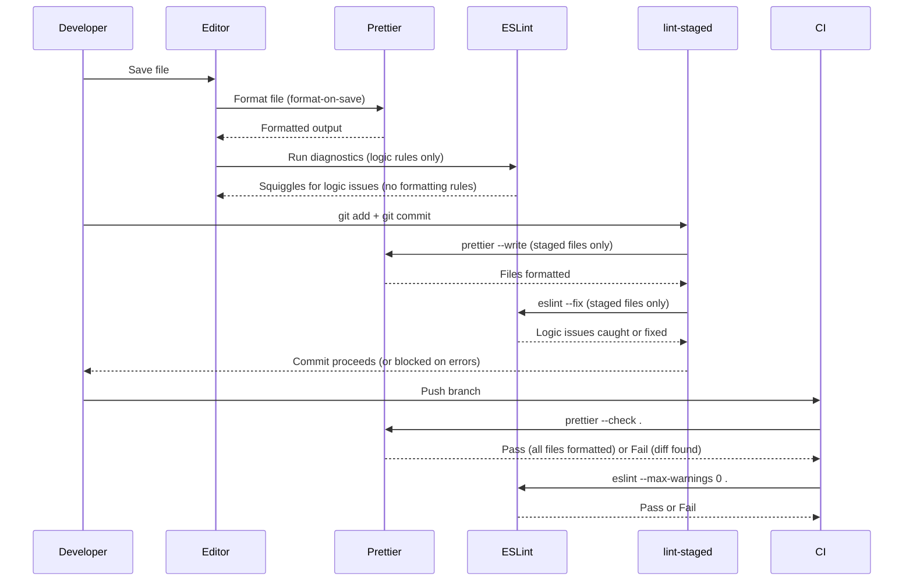

# Code Formatting & EditorConfig

Every developer has opinions about formatting. Tabs or spaces. Semicolons or not. Single quotes or double. Trailing commas. Print width. These opinions are durable, deeply held, and ultimately irrelevant to the correctness of the code. The debate over formatting style is not a technical problem — it is a coordination problem. Formatters solve it by removing the decision from human consideration entirely.

When a formatter is the authority on how code looks, formatting ceases to be a matter of personal taste. The formatter decides. Every file in the repository looks the way the formatter produces it. Pull request diffs show logic changes — not whitespace adjustments, not quote normalization, not trailing comma additions. Code review becomes faster and more accurate because reviewers are not pattern-matching against noise.

This article covers the three layers of automatic formatting that a well-configured frontend project uses: EditorConfig for cross-editor baseline consistency, Prettier for language-aware opinionated formatting, and the integration between Prettier and ESLint that prevents the two tools from fighting each other.

## Principle

Formatting is a collaboration protocol, not an aesthetic preference. Teams MUST designate a single authoritative formatter and commit its configuration to the repository. All contributors MUST format with the same tool at the same version. Formatting decisions MUST NOT appear in code review discussions — the formatter is the referee, and the formatter's output is the correct answer.

The formatter configuration SHOULD be minimal. Every option added to the formatter config is a decision the team made collectively and must maintain collectively. Options that represent genuine team preferences (quote style, semicolons) belong in the config. Options that reflect personal taste without team consensus SHOULD be left at the formatter's default.

Format-on-save in the editor SHOULD be configured for every contributor. Format-on-commit via lint-staged MUST be in place as a safety net. CI MUST run `prettier --check` and fail on any unformatted file. These three layers form a progressive enforcement chain: immediate feedback, commit-time gate, merge-time gate.

## Design Thinking

### Why Prettier's opinionated design is a feature

Most developer tools offer configuration. The more options, the more flexible — that is the conventional wisdom. Prettier inverts this: it is deliberately opinionated, offering a small set of options and resisting additions. The Prettier team reviews option proposals and rejects the vast majority of them.

This is not a limitation. It is the core value proposition.

When a formatter has many options, teams must make many decisions. Each decision becomes a potential source of disagreement — a bike-shedding surface. A team adopting a configurable formatter does not eliminate formatting debates; it relocates them. Instead of arguing about how to format code in pull requests, the team argues about how to configure the formatter. The debate persists; only the venue changes.

Prettier's small option set means the debate space is small. The decisions teams realistically need to make — print width, semicolons, quote style, trailing commas — fit in a handful of lines of config. Once those decisions are made and committed, they are made. The formatter enforces them automatically, consistently, and without further discussion. Developers stop thinking about formatting and start thinking about logic.

The uniformity of Prettier's output also has a compound benefit: it makes the output predictable. A developer reading any Prettier-formatted file knows what to expect. There is no variation by author, by file age, or by which editor generated the file. The codebase is visually homogeneous. This homogeneity reduces cognitive load when reading unfamiliar code.

### Why `eslint-config-prettier` is necessary

ESLint and Prettier overlap. Both tools have opinions about formatting: ESLint has rules for indent size, quote style, semicolons, spacing, and dozens of other formatting concerns. Prettier has its own output for all of these. When both tools run on the same file, they can — and do — conflict.

The conflict is not theoretical. Without intervention, ESLint will flag code that Prettier has correctly formatted as a lint error. A developer running `prettier --write` followed by `eslint --fix` may find the two tools fighting each other: Prettier applies its format, ESLint rewrites it, Prettier disagrees with ESLint's output. The result is non-deterministic formatting — each tool's output depends on which ran last.

`eslint-config-prettier` resolves the conflict by disabling all ESLint rules that handle formatting. It does not add new rules; it only turns off rules that Prettier supersedes. With it installed and placed last in the ESLint config, ESLint handles only correctness and logic — unused variables, floating promises, accessibility violations, type errors. Prettier handles all formatting. The two tools no longer overlap.

The placement requirement is strict: `eslint-config-prettier` MUST be the last entry in the ESLint config array. Any config object after it that re-enables a formatting rule will reintroduce the conflict. The common mistake is placing it early in the array and letting plugin configs override it.

`eslint-plugin-prettier` is an alternative approach that runs Prettier inside ESLint as a rule, reporting formatting differences as lint errors. This approach is slower (Prettier runs on every file as an ESLint rule, not as a separate pass), produces confusing error messages (formatting differences reported as lint errors instead of a diff), and blurs the separation between formatting and correctness. The Prettier team does not recommend it. Use `eslint-config-prettier` instead.

### Biome as a Prettier alternative

Biome is a Rust-based frontend toolchain that combines formatting and linting in a single binary. Its formatter is Prettier-compatible for most cases and processes files approximately 100 times faster than Prettier in benchmarks. For a large repository, this difference is practical: Prettier might take several seconds to format all files; Biome finishes in under a second.

The speed advantage matters most in CI and in pre-commit hooks, where every second of overhead accumulates across hundreds of commits per day. Teams that have adopted Biome for formatting report that the speed improvement makes format checking feel instantaneous, which encourages compliance rather than bypass.

The trade-off is ecosystem maturity. Prettier has a well-established plugin ecosystem for languages beyond JavaScript and TypeScript — GraphQL, Markdown, CSS, YAML, HTML. Biome's language coverage is growing but narrower. Biome also does not support Prettier plugins written by the community, which rules it out for projects with specialized formatting requirements (templating languages, DSLs, custom file types handled by Prettier plugins).

For projects that format only JavaScript, TypeScript, JSON, and CSS, Biome's coverage is complete and its speed advantage is real. For projects with broader formatting needs — particularly those using Prettier plugins for GraphQL schemas, Markdown prose formatting, or YAML config files — Prettier remains the more complete option.

Biome and ESLint are not mutually exclusive. Some teams use Biome for formatting and ESLint for linting, running both tools in the same pipeline. This gives them Biome's formatting speed without sacrificing ESLint's plugin ecosystem for correctness rules.

### EditorConfig's role in the stack

EditorConfig operates at a layer below all language-aware tools. It is not a formatter and it does not understand syntax. It communicates simple file-level settings — indent style, indent size, line endings, character encoding — to any editor that reads `.editorconfig` files. Every major editor supports EditorConfig natively or via a plugin: VS Code, JetBrains IDEs, Vim, Neovim, Emacs, Sublime Text, and others.

The purpose of EditorConfig is to prevent the class of inconsistencies that arise before any formatter runs. A Windows developer whose editor defaults to CRLF line endings will commit files with Windows line endings into a repository that expects LF. A developer whose editor defaults to tabs will open a file that uses spaces and, if the editor auto-converts indentation, commit a mixed-indent file. These problems are invisible to the author — the editor is just doing what it defaults to — but they produce noisy diffs and can cause issues in shell scripts, Docker files, and other tools that are sensitive to line endings.

EditorConfig solves this by establishing the baseline before code is written. The editor reads `.editorconfig` on file open and applies the settings immediately: new files get the right line endings, indentation uses the right style, and the file is saved with the right encoding. No post-processing needed.

The practical division of responsibility is:

- **EditorConfig**: indent style, indent size, line endings, charset, trailing whitespace, final newline — settings that apply to every file type, before any tool runs.
- **Prettier**: language-aware formatting — semicolons, quote style, bracket spacing, trailing commas, print width, function call formatting — settings that require understanding the syntax of the language.
- **ESLint**: logic and correctness rules — unused variables, type errors, accessibility violations, security patterns.

The three layers do not overlap. Each handles the concerns that only it can handle.

## Best Practices

### Minimal Prettier config

Start with no `prettier.config.js`. Prettier's defaults are well-chosen: 80-character print width, double quotes, semicolons, ES5 trailing commas. For many teams these defaults are acceptable without modification. Accepting defaults means zero config surface — nothing to debate, nothing to maintain, nothing to diverge between environments.

When the team agrees that specific defaults do not fit the project, add only those options. Common deviations:

- `singleQuote: true` — preferred in projects with a lot of JSX, where double quotes inside attributes conflict with double-quoted strings.
- `semi: false` — preferred by teams following ASI-aware styles.
- `trailingComma: "all"` — ensures trailing commas on function parameters, which produces cleaner diffs when adding arguments.
- `printWidth: 100` — appropriate for teams with wide monitors and dense TypeScript generics.

Every option added is a decision. Add options only when there is genuine team consensus, not when one developer has a preference.

### ESLint and Prettier coexistence

Install `eslint-config-prettier` and add it as the last entry in the ESLint config array:

```js
// eslint.config.js
import eslintConfigPrettier from "eslint-config-prettier";

export default tseslint.config(
  // ... other configs ...
  eslintConfigPrettier, // MUST be last — disables formatting rules
);
```

This single change eliminates the overlap. ESLint no longer has opinions about formatting. Prettier is the sole authority on how code looks. The two tools can run in either order without conflict.

Never use `eslint-plugin-prettier`. It runs Prettier inside ESLint as a lint rule, which is slower, produces less readable error output, and conflates formatting with correctness in the output. The `eslint-config-prettier` approach — turning off conflicting ESLint rules — is the approach recommended by both the Prettier and ESLint teams.

### CI format check

Add a format check step to CI that runs before tests:

```bash
# Check: fail if any file differs from Prettier's output
prettier --check .

# With cache for large repos (cache stored per CI run, keyed on file hashes)
prettier --check --cache .
```

The `--check` flag causes Prettier to exit with a non-zero code if any file would be changed by formatting. This is a gate, not an auto-fix: CI should not commit code changes. The developer is responsible for running the formatter locally; CI verifies that they did.

The `--cache` flag stores a hash of each file alongside Prettier's output decision. On subsequent runs, files whose hash has not changed are skipped. On a large repository, this reduces format check time from seconds to milliseconds for unchanged files.

### Format-on-save and format-on-commit

Format-on-save is configured in the editor and provides immediate feedback. When a developer saves a file, the editor runs Prettier and applies the formatted output before the buffer is written to disk. The developer sees the result immediately — no waiting for CI, no pre-commit hook delay.

Format-on-commit runs via lint-staged as part of the pre-commit hook. lint-staged runs Prettier only on staged files, which makes it fast even on large repositories. This is a safety net: it catches files that were never saved through an editor with format-on-save configured (scripts, generated files, files edited via the command line).

Both mechanisms serve different failure modes. Use both.

```js
// lint-staged.config.js
export default {
  "*.{js,jsx,ts,tsx,json,css,md}": ["prettier --write"],
};
```

### EditorConfig baseline

Every project MUST commit a `.editorconfig` file. The minimum required settings:

```ini
root = true

[*]
indent_style = space
indent_size = 2
end_of_line = lf
charset = utf-8
trim_trailing_whitespace = true
insert_final_newline = true
```

The `end_of_line = lf` setting is the most important on cross-platform teams. Windows developers using Git with `core.autocrlf = true` may still produce CRLF files in some workflows. EditorConfig instructs the editor to use LF regardless of the OS default, preventing line-ending contamination before it reaches the repository.

The `[*.md]` section should override `trim_trailing_whitespace` to `false`. Markdown uses trailing spaces for line breaks (`  \n` produces a hard line break in rendered Markdown). Stripping them changes the document's rendered output.

## Visual

### Formatting Workflow: Save to Commit

The following sequence diagram shows how formatting is applied at each stage of the development workflow. The key insight is that each stage is independent — format-on-save provides immediate feedback, lint-staged provides a commit-time safety net, and CI provides a merge-time gate. A failure at any stage is caught before it reaches the next.



## Example

### Installation

```bash
npm install --save-dev prettier eslint-config-prettier

# Optional: lint-staged for pre-commit formatting
npm install --save-dev lint-staged
```

### prettier.config.js

```js
// prettier.config.js
/** @type {import("prettier").Config} */
export default {
  printWidth: 100,
  singleQuote: true,
  trailingComma: "all",
  semi: true,
};
```

This is a representative config for a TypeScript + React project. If your team is comfortable with Prettier's defaults, omit this file entirely. Any options listed here MUST reflect team consensus.

### eslint.config.js (Prettier integration)

```js
// eslint.config.js (relevant excerpt — add after other configs)
import eslintConfigPrettier from "eslint-config-prettier";

export default tseslint.config(
  // ... other configs ...
  eslintConfigPrettier, // MUST be last — disables formatting rules
);
```

`eslint-config-prettier` disables rules from `@typescript-eslint`, `eslint-plugin-react`, and all other plugins that handle formatting. It does not need to know which plugins are loaded — it disables all formatting-related rules regardless of origin.

### .editorconfig

```ini
# .editorconfig
root = true

[*]
indent_style = space
indent_size = 2
end_of_line = lf
charset = utf-8
trim_trailing_whitespace = true
insert_final_newline = true

[*.md]
trim_trailing_whitespace = false
```

The `root = true` declaration stops EditorConfig from looking for further `.editorconfig` files in parent directories. Always include this in the top-level file of the repository.

### lint-staged integration

```js
// lint-staged.config.js
export default {
  // Format all supported file types
  "*.{js,jsx,ts,tsx,json,css,scss,md,yaml,yml}": ["prettier --write"],
  // Run ESLint on JS/TS files after formatting
  "*.{js,jsx,ts,tsx}": ["eslint --fix --max-warnings 0"],
};
```

The order matters: Prettier runs first (formatting), ESLint runs second (logic). Running ESLint on unformatted code is safe but produces less readable output; running Prettier after ESLint would overwrite any formatting ESLint applied, so Prettier goes first.

### VS Code workspace settings for format-on-save

```json
// .vscode/settings.json
{
  "editor.formatOnSave": true,
  "editor.defaultFormatter": "esbenp.prettier-vscode",
  "[markdown]": {
    "editor.defaultFormatter": "esbenp.prettier-vscode"
  }
}
```

Committing `.vscode/settings.json` to the repository ensures that all VS Code users on the team have format-on-save enabled with Prettier as the formatter, without requiring each developer to configure it manually.

### Using Biome as the formatter

```json
// biome.json
{
  "$schema": "https://biomejs.dev/schemas/1.9.4/schema.json",
  "formatter": {
    "enabled": true,
    "indentStyle": "space",
    "indentWidth": 2,
    "lineWidth": 100
  },
  "javascript": {
    "formatter": {
      "quoteStyle": "single",
      "trailingCommas": "all",
      "semicolons": "always"
    }
  }
}
```

```bash
# CI check with Biome
biome ci .

# Format all files locally
biome format --write .
```

When using Biome as the formatter, install `eslint-config-prettier` regardless — Biome does not replace ESLint, and the ESLint formatting rules still need to be disabled.

## Common Mistakes

### Using `eslint-plugin-prettier` instead of `eslint-config-prettier`

`eslint-plugin-prettier` runs Prettier as an ESLint rule. Every file is formatted by Prettier during the lint pass, and any difference between the file's current state and Prettier's output is reported as a lint error. The intent is to surface formatting issues in the ESLint output.

The problems are practical. First, speed: running Prettier on every file as a lint rule is slower than running Prettier as a separate pass. On a large repository, this adds measurable time to every lint run. Second, error messages: formatting differences appear as ESLint rule violations with rule IDs like `prettier/prettier`, producing error messages that look like logic errors but are actually whitespace diffs. This is confusing for developers unfamiliar with the setup. Third, conceptual: it conflates formatting with linting in a single tool output, making it harder to distinguish correctness issues from style issues.

The correct approach is `eslint-config-prettier`: disable all formatting rules in ESLint, run Prettier separately. The tools are independent, their outputs are readable independently, and the performance is better.

### Not placing `eslint-config-prettier` last in the config

`eslint-config-prettier` works by disabling ESLint rules. If a config object that appears after it in the array re-enables any of those rules, the conflict reappears. Common failure mode: a plugin's `recommended` config object is spread after `eslint-config-prettier`, and that plugin includes formatting rules.

The fix is mechanical: `eslint-config-prettier` is always the last item in the ESLint config array. No exceptions.

```js
export default tseslint.config(
  js.configs.recommended,
  tseslint.configs.recommendedTypeChecked,
  reactPlugin.configs.recommended, // may include formatting rules
  // ... other plugin configs ...
  eslintConfigPrettier, // last — disables all formatting rules from everything above
);
```

### Not committing the Prettier config

If `prettier.config.js` is not committed to the repository — if it is in `.gitignore` or simply never added — then different developers may be running Prettier with different options. A developer who has a global Prettier config in their home directory will format with those options. A developer with no global config will format with defaults. CI will run with defaults. The result is a codebase where formatting varies by contributor and by environment.

The solution is to always commit `prettier.config.js`. If you intend to use defaults, commit an empty config or a config with explicit comments noting that defaults are intentional. The presence of the file signals that the formatting decision has been made deliberately.

### Ignoring the `.editorconfig` file on Windows

On Windows, Git may be configured with `core.autocrlf = true`, which converts LF line endings to CRLF on checkout and back to LF on commit. This setting coexists poorly with repositories that expect LF throughout. A developer may never see CRLF in their editor — Git silently converts — but intermediate states (Git stash, patches, certain tooling) may expose the CRLF files. More importantly, if a file somehow escapes the conversion (binary mode, a specific Git configuration, a CI runner on Windows), CRLF files enter the repository.

EditorConfig's `end_of_line = lf` instructs the editor to save files with LF, preventing CRLF from being written in the first place. This operates before Git's autocrlf conversion and is more reliable than relying on Git alone.

Always commit `.editorconfig`. Always set `end_of_line = lf` for all text files. For repositories that must support Windows-native line endings in certain files, add explicit overrides for those file types.

## Related FEEs

- [FEE-1600 — Developer Experience & Tooling Overview](./1600.md) — Category context: the four-layer DX lifecycle that formatting fits into
- [FEE-1601 — Linting & Static Analysis](./1601.md) — ESLint handles logic rules; Prettier handles formatting. `eslint-config-prettier` prevents overlap.
- [FEE-1603 — Git Hooks & Pre-commit Automation](./1603.md) — lint-staged runs `prettier --check` on staged files before every commit
- [FEE-1606 — Editor & IDE Integration](./1606.md) — `editor.formatOnSave` and `editor.defaultFormatter` settings for VS Code and JetBrains

## References

- [Prettier documentation](https://prettier.io/docs/en/)
- [Prettier: Why Prettier?](https://prettier.io/docs/en/why-prettier.html)
- [Prettier: Configuration](https://prettier.io/docs/en/configuration.html)
- [eslint-config-prettier README](https://github.com/prettier/eslint-config-prettier)
- [EditorConfig specification](https://editorconfig.org/)
- [Biome formatter documentation](https://biomejs.dev/formatter/)
- [Biome vs Prettier: migration guide](https://biomejs.dev/guides/migrate-eslint-prettier/)
