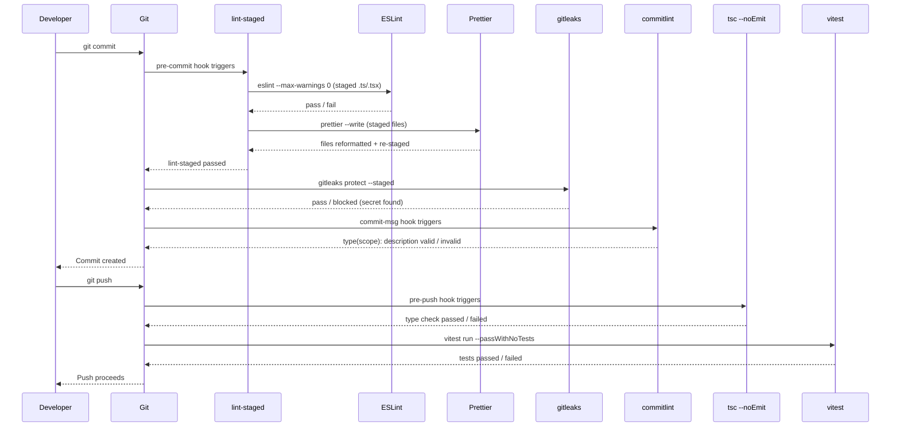

# Git Hooks & Pre-commit Automation

The cheapest place to catch a defect is before it enters version control. A bug that a linter would have flagged at commit time costs nothing to fix — the developer edits a line and moves on. That same bug discovered in a pull request review costs review time, a review cycle, a comment thread, and a second look. Discovered in production, it costs incident response, rollback, and postmortem. The cost of a defect rises with distance from its origin. Git hooks collapse that distance to zero.

Git hooks are executable scripts that Git calls at specific points in the workflow — before a commit is created, after a commit message is written, before a push is sent to the remote. They are not optional quality gates that developers remember to run; they are mandatory gates that run automatically, without requiring developer discipline or memory. Configured once, they run on every relevant Git operation for every team member.

The combination of Husky (hook management), lint-staged (selective file processing), commitlint (commit message validation), and gitleaks (secret scanning) forms a complete quality layer that operates entirely before code leaves the local machine. This layer is not a replacement for CI — it is a complement that shifts routine quality checks left to the moment of authorship.

## Design Thinking

### The three hook stages and what belongs at each

Git provides many hook types, but three are universally relevant for frontend quality automation: `pre-commit`, `commit-msg`, and `pre-push`. Each has a different latency budget and a different scope of work that fits within it.

**`pre-commit`** runs after the developer types `git commit` but before the commit object is created. The developer is sitting at the terminal, waiting. The budget for this stage is strict: under 5 seconds is ideal, under 10 seconds is acceptable, over 10 seconds is a problem. Developers who wait 30 seconds before every commit will find `--no-verify` and use it habitually, at which point the hook provides no protection at all.

What belongs in `pre-commit`: lint and format checking on staged files. Not the full test suite. Not type checking the entire project. Not running integration tests. These checks take too long. The correctness test for what belongs in `pre-commit` is: "if this check takes two seconds, would we add it?" If no, it does not belong here.

lint-staged is the critical enabling technology for keeping `pre-commit` fast. Without lint-staged, a naive `pre-commit` hook runs ESLint on the entire codebase — every file, including files that have not been touched. On a large repository, this takes 30 seconds or more. With lint-staged, ESLint runs only on the files currently staged for this commit — typically 1–5 files. The check completes in under a second. The hook is fast enough that developers never think about bypassing it.

**`commit-msg`** runs after the developer has written a commit message but before the commit is created. It receives the path to a temporary file containing the message. The budget here is essentially zero — commitlint reads one file and runs a regex, completing in under 100 milliseconds. This stage validates that the commit message conforms to the team's convention (Conventional Commits format: `type(scope): description`). A commit with a malformed message is rejected before it enters the log; the developer sees an error, edits the message, and re-commits.

**`pre-push`** runs after the developer types `git push` but before the push is sent to the remote. The developer is about to share their work; a longer wait is acceptable here. A 30–60 second check is reasonable because pushes happen less frequently than commits. This stage is appropriate for type checking (`tsc --noEmit`) and unit test runs (`vitest run --passWithNoTests`). These checks are too slow for `pre-commit` but are important enough to run before code reaches the shared repository.

### Why lint-staged is not optional

The naive implementation of a `pre-commit` hook runs tools on the entire working tree:

```sh
# naive — do not do this
npm run lint
npm run format:check
```

This approach has a fundamental performance problem. On a repository with 500 TypeScript files, ESLint processes 500 files. A developer fixing a typo in a comment stages one file but triggers ESLint on all 500. The hook becomes a 30-second tax on every commit, regardless of what was changed.

lint-staged solves this with a precise observation: a commit affects only the staged files. Quality checks for a commit need only run on those files. lint-staged reads the Git index, identifies staged files, applies the configured tool commands only to those files, and re-stages them if any tool (like Prettier) modifies them. The result: a repository with 500 TypeScript files runs ESLint on the 3 files staged for this commit. The check completes in under a second.

lint-staged also handles the re-staging step correctly. When Prettier rewrites a staged file, the rewritten content needs to be in the index for the commit — not in the working tree only. lint-staged re-stages modified files automatically after each tool runs. Without this, a developer would commit the unformatted version of a file even though Prettier ran successfully.

### Why running the full test suite in pre-commit is the most common hook misconfiguration

The logic is intuitive: "We want to ensure tests pass before code is committed, so we'll run tests in `pre-commit`." The execution is self-defeating.

A full unit test suite takes 20–120 seconds in a typical frontend project. Running it before every commit means:

- A developer makes a small documentation change: 45 seconds wait.
- A developer fixes a typo in a utility function: 45 seconds wait.
- A developer creates 10 work-in-progress commits during a refactor: 7.5 minutes of waiting for test output.

The developer learns that commits are expensive. They commit less frequently. They batch more changes into each commit. Work-in-progress state is harder to recover when something goes wrong. The Git history becomes less granular and less useful. Or — more likely — the developer discovers `--no-verify` and uses it for all commits, at which point the test check provides no protection whatsoever.

Tests belong in `pre-push`, where they run once per push rather than once per commit. The developer is about to share code with the team; the extra 60 seconds is proportionate to the consequence (pushing broken tests to the shared branch). At the commit stage, the developer is making a local checkpoint; 45 seconds is not proportionate to that consequence.

### Secret scanning as a last-line defense

Secrets — API keys, private keys, JWT signing secrets, database connection strings with credentials, cloud provider tokens — enter git history in two common scenarios. The first is accidental staging: a developer adds a `.env` file or a credentials file to a commit. The second is inline embedding: a developer hardcodes an API key in a configuration file to test something quickly, intends to remove it before committing, and forgets.

Once a secret enters git history, removing it is difficult. `git filter-branch` and `git filter-repo` can rewrite history to remove a specific string from every commit, but this rewrites every commit after the introduction point, invalidating all existing clone references. If the branch was pushed before the rewrite, anyone with a clone of the pre-rewrite history still has the secret. The only reliable remediation after a secret enters a pushed branch is to rotate the secret (revoke the old one, generate a new one) — not to try to remove it from history.

gitleaks addresses this at the commit stage. `gitleaks protect --staged` scans staged content — not the entire repository history, just the changes about to be committed — for known secret patterns: AWS access keys, GitHub tokens, generic high-entropy strings, private key headers, and hundreds of other patterns. If it finds a match, the commit is blocked and the developer sees which file and which pattern triggered the detection. The developer removes the secret before it enters version control.

This is not a substitute for not embedding secrets in code. The correct practice is to use environment variables or a secrets management system (Vault, AWS Secrets Manager, 1Password Secrets Automation) and never write secrets into source files. gitleaks is a safety net for the moments when the correct practice is accidentally violated.

### Husky v9 configuration model

Husky v9 (released 2024) simplified the configuration model compared to earlier versions. There is no `.huskyrc` file, no complex configuration object, and no separate install step. Hook scripts live in `.husky/` as plain shell scripts. The `npx husky init` command creates the `.husky/` directory and a sample `pre-commit` hook.

The `"prepare": "husky"` script in `package.json` runs Husky's install routine, which registers the `.husky/` directory as Git's hook path. This runs automatically on `npm install`, `yarn install`, or `pnpm install`, ensuring that every developer who clones the repository and installs dependencies gets the hooks without any additional step.

In CI environments where the hooks should not run (hooks running in CI are redundant — CI has its own checks), set `HUSKY=0` as an environment variable. Husky v9 respects this and skips hook installation.

```yaml
# .github/workflows/ci.yml (relevant snippet)
env:
  HUSKY: "0"   # disable Husky hooks in CI — CI has its own quality gates
```

Set `HUSKY=0` as an environment variable in CI to skip hook installation. Hooks are for local development feedback; CI pipelines have their own lint, type-check, and test steps that are the authoritative gate.

The shell scripts in `.husky/` are standard POSIX shell. They receive Git's hook arguments via positional parameters (`$1` for the commit message file in `commit-msg`, etc.). They exit non-zero to block the hook's operation or exit zero to allow it.

## Best Practices

**MUST add `"prepare": "husky"` to `package.json` scripts so hooks install automatically.** This script runs on every `npm install`, `yarn install`, and `pnpm install`, ensuring every contributor has hooks active after their first install without any manual step. For pnpm v8+ projects, teams MUST also add `enable-pre-post-scripts=true` to `.npmrc` to restore automatic `prepare` execution, or document a required `pnpm prepare` step in the onboarding guide. CI environments MUST set `HUSKY=0` to skip hook installation during automated runs.

**MUST configure lint-staged to run ESLint before Prettier on staged files.** Lint-staged MUST be configured with `eslint --max-warnings 0` as the first command for TypeScript and JavaScript patterns, followed by `prettier --write`; ESLint runs first to catch errors, then Prettier reformats and lint-staged re-stages the result so the commit contains the formatted version. Without `--max-warnings 0`, ESLint exits zero on warnings and the hook passes silently, allowing warned violations to accumulate.

**MUST assign each tool to its correct hook stage.** The `pre-commit` stage MUST run lint-staged and secret scanning only, targeting under five seconds total. The `commit-msg` stage MUST run commitlint only, targeting under one second. The `pre-push` stage MUST run `tsc --noEmit` and unit tests, targeting under sixty seconds. Moving type checking to `pre-commit` makes hooks too slow; moving secret scanning to `pre-push` allows secrets to enter local commit history before detection.

**MUST add gitleaks to the `pre-commit` hook using `gitleaks protect --staged`.** This command scans only the staged diff rather than the entire repository, keeping it within the pre-commit latency budget. Teams MUST commit a `.gitleaks.toml` configuration file with allowlist entries for patterns that match gitleaks rules but are not actual secrets; without an allowlist, false positives cause developers to reach for `--no-verify`. Teams MUST also add gitleaks as a separate CI step in addition to, not instead of, the pre-commit hook.

**SHOULD document an explicit bypass policy for `--no-verify` and enforce it through code review culture.** Work-in-progress commits on unshared personal branches and emergency hotfixes during active incidents are the only acceptable bypass scenarios, and both SHOULD result in a follow-up ticket. Bypassing because hooks are slow is a signal that hook configuration needs optimization, not that bypassing is appropriate; bypassing because a rule is inconvenient MUST be addressed either by fixing the rule in the ESLint config or by fixing the violation.

## Visual

### Git Hook Automation Sequence

The following sequence diagram shows the complete flow from `git commit` through `git push`, including the three hook stages and the checks that run at each stage. A failure at any stage blocks the operation and returns control to the developer for remediation.



## Example

### Installation

```bash
npm install --save-dev husky lint-staged
npx husky init
```

`npx husky init` creates `.husky/pre-commit` with a sample command and updates `package.json` to add `"prepare": "husky"` to the scripts. After running it, replace the sample content with the actual hook commands.

Also install commitlint and gitleaks:

```bash
# commitlint
npm install --save-dev @commitlint/cli @commitlint/config-conventional

# gitleaks (macOS)
brew install gitleaks
# gitleaks (Linux — download binary from https://github.com/gitleaks/gitleaks/releases)
```

### package.json (relevant sections)

```json
{
  "scripts": {
    "prepare": "husky"
  },
  "lint-staged": {
    "*.{ts,tsx}": [
      "eslint --max-warnings 0",
      "prettier --write"
    ],
    "*.{js,jsx,cjs,mjs}": [
      "eslint --max-warnings 0",
      "prettier --write"
    ],
    "*.{css,json,md,yaml}": [
      "prettier --write"
    ]
  }
}
```

### .husky/pre-commit

```sh
#!/bin/sh
npx lint-staged
gitleaks protect --staged -v
```

The `gitleaks` command runs after lint-staged. If lint-staged fails (a lint error or format issue), the hook exits early and gitleaks does not run. If lint-staged passes, gitleaks scans the staged content for secrets. Both must pass for the commit to proceed.

### .husky/commit-msg

```sh
#!/bin/sh
npx --no -- commitlint --edit "$1"
```

The `$1` argument is the path to the temporary file containing the commit message. `--edit` tells commitlint to read from that file. The `--no` flag to `npx` prevents npx from attempting to install commitlint if it is not found — it fails with a clear error instead.

### .husky/pre-push

```sh
#!/bin/sh
npx tsc --noEmit
npx vitest run --passWithNoTests
```

`tsc --noEmit` performs a full TypeScript type check without emitting output files. It validates that the entire project type-checks correctly before the push. `--passWithNoTests` in vitest ensures the hook does not fail on a project or branch that has no tests yet — it passes with a note rather than failing.

### commitlint.config.js

```js
// commitlint.config.js  (requires "type": "module" in package.json)
// For CommonJS projects, use commitlint.config.cjs with module.exports instead
export default {
  extends: ["@commitlint/config-conventional"],
};
```

```js
// commitlint.config.cjs  (for CommonJS projects without "type": "module")
module.exports = {
  extends: ["@commitlint/config-conventional"],
};
```

`@commitlint/config-conventional` enforces Conventional Commits format: `type(scope): description`. Valid types include `feat`, `fix`, `docs`, `style`, `refactor`, `test`, `chore`, and others. The scope is optional. The description is required and must start with a lowercase letter.

Examples of valid commit messages:
- `feat(auth): add OAuth2 login flow`
- `fix(api): handle null response from user endpoint`
- `docs: update README with local development steps`
- `chore(deps): upgrade vitest to 2.0`

Examples of invalid commit messages (commitlint will reject these):
- `fixed a bug` — no type prefix
- `Fix: update styling` — type capitalized, which is not the convention
- `feat: Added the new dashboard component` — description starts with capital letter

### .gitleaks.toml (allowlist example)

```toml
[allowlist]
  description = "Project allowlist"
  regexes = [
    # Example JWT used in test fixtures — not a real secret
    'eyJhbGciOiJIUzI1NiIsInR5cCI6IkpXVCJ9\\.eyJzdWIiOiJ0ZXN0In0\\.[A-Za-z0-9_-]+',
  ]
  paths = [
    # Ignore all files in the test fixtures directory
    '''tests/fixtures/.*''',
  ]
```

Add this file to the repository root. gitleaks reads it automatically. Without an allowlist, test fixtures containing example tokens and documentation examples with placeholder keys will trigger false positives, causing developers to add `--no-verify` reflexively.

## Common Mistakes

### Treating git hooks as a substitute for CI

Hooks can be bypassed. `git commit --no-verify` is always available to any developer. A developer under time pressure will use it. A developer who does not understand why a hook is failing will use it. A developer with a corrupted Node environment will use it.

CI cannot be bypassed. A pull request that fails CI checks cannot be merged (if branch protection rules are configured correctly). CI is the authoritative gate; hooks are a convenience that catches issues earlier, before they reach CI.

The correct mental model: hooks shift quality checks left, reducing friction and speeding up the feedback loop. CI enforces the quality bar that the team has agreed to. Both are necessary; neither substitutes for the other.

### Not committing the hook scripts

Husky v9 stores hook scripts in `.husky/`. These files MUST be committed to the repository. They are the hook definitions — without them, `npx husky` installs the hook machinery but there are no actual checks to run.

A common omission is adding `.husky/` to `.gitignore` by mistake (treating it like a generated directory). Check that `.husky/pre-commit`, `.husky/commit-msg`, and `.husky/pre-push` are all tracked by Git.

## Related FEEs

- [FEE-1600 — Developer Experience & Tooling Overview](./1600.md) — Category context: Git hooks operate at the commit layer of the DX lifecycle
- [FEE-1601 — Linting & Static Analysis](./1601.md) — ESLint is what lint-staged runs inside the pre-commit hook
- [FEE-1602 — Code Formatting & EditorConfig](./1602.md) — Prettier runs via lint-staged in the pre-commit hook to reformat staged files
- [FEE-1604 — Commit Conventions & commitlint](./1604.md) — commitlint runs in the commit-msg hook to validate message format
- [FEE-1205 — Supply Chain Security](../Security/1205.md) — gitleaks secret scanning runs in pre-commit as the last line of defense before sensitive values enter git history
- [FEE-1101 — Unit Testing with Vitest & Jest](../Testing%20Strategies/1101.md) — vitest runs in the pre-push hook to validate correctness before code reaches the shared branch

## References

- [Husky documentation](https://typicode.github.io/husky/)
- [lint-staged README](https://github.com/lint-staged/lint-staged)
- [gitleaks documentation](https://github.com/gitleaks/gitleaks)
- [commitlint documentation](https://commitlint.js.org/)
- [Conventional Commits specification](https://www.conventionalcommits.org/)
- [Git hooks documentation](https://git-scm.com/docs/githooks)
