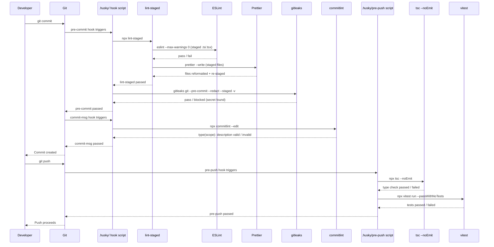

# [FEE-1603] Git Hooks & Pre-commit Automation

:::info
Git hooks run scripts at fixed points in the commit workflow: before a commit object is created, after a commit message is written, before a push reaches the remote. A lint error caught at commit time costs one edit; the same error caught in pull request review costs a review cycle. Husky, lint-staged, commitlint, and gitleaks are one popular stack for wiring checks into those points, but not the only one: lefthook, the Python `pre-commit` framework, and bare `core.hooksPath` solve the same distribution problem differently. This article covers the three latency-tiered hook stages, the husky-based stack in detail, and where the alternatives fit.
:::

## Context

Git has supported hooks since its earliest versions: shell scripts dropped into `.git/hooks/` that fire on commit, push, and other lifecycle events. The friction was distribution. `.git/hooks/` is not tracked by Git itself, so a hook one developer writes does not reach any other clone of the repository without a manual copy step or a separate installation script. Node tooling filled that gap starting in the mid-2010s: npm packages that write into `.git/hooks/` during `npm install`, culminating in Husky, the one that stuck for most JavaScript and TypeScript projects.

Husky itself only solves distribution. It points `core.hooksPath` at a generated shim directory (`.husky/_`) whose shims run the project-tracked scripts in `.husky/`, so hook scripts travel with the repository. It does not decide what a hook script runs or how fast. That is the job of the other tools this article covers: lint-staged narrows a check to the files actually staged, commitlint validates the commit message format, and gitleaks scans staged content for secret patterns.

Husky is not the only way to solve the distribution problem, and a current tool choice should weigh the alternatives:

- **lefthook** is a single Go binary with no Node runtime dependency. It replaces both husky and lint-staged: its YAML config declares file globs and can run matching commands in parallel, so there is no separate staged-file tool to configure. Teams choose it to cut per-hook startup time and to run checks across polyglot repositories where husky's Node-only assumption does not fit.
- **simple-git-hooks** is a minimal alternative to husky alone: a small config block in `package.json` that installs hooks, with no companion staged-file runner built in. lint-staged still handles that half.
- **the Python `pre-commit` framework** (pre-commit.com) manages hooks as versioned, language-agnostic plugins declared in `.pre-commit-config.yaml`. It is common in mixed Python/JS repositories where a single hook manager needs to run both ecosystems' checks.
- **bare `core.hooksPath`** is what husky configures under the hood: `git config core.hooksPath .githooks` plus a tracked `.githooks/` directory. Zero dependencies, but everything husky adds on top (staged-file filtering via lint-staged, the cross-platform shim, the `HUSKY=0` escape hatch) the team writes itself.

The rest of this article uses the husky + lint-staged + commitlint + gitleaks stack as the worked example. The Best Practices and Design Thinking sections describe husky-stack-specific guidance unless noted otherwise.

## Visual

### Git Hook Automation Sequence

The following sequence diagram shows the complete flow from `git commit` through `git push`. Git fires exactly one `pre-commit` hook; the `.husky/pre-commit` script internally sequences lint-staged and gitleaks, so both run inside that single invocation. A failure at any stage blocks the operation and returns control to the developer for remediation.



## Example

### Installation

```bash
npm install --save-dev husky lint-staged
npx husky init
```

`npx husky init` creates `.husky/pre-commit` with a sample command and updates `package.json` to add `"prepare": "husky"` to the scripts. After running it, replace the sample content with the actual hook commands.

Also install commitlint and gitleaks:

```bash
# commitlint
npm install --save-dev @commitlint/cli @commitlint/config-conventional

# gitleaks (macOS)
brew install gitleaks
# gitleaks (Linux: download binary from https://github.com/gitleaks/gitleaks/releases)
```

### package.json (relevant sections)

```json
{
  "scripts": {
    "prepare": "husky"
  },
  "lint-staged": {
    "*.{ts,tsx}": [
      "eslint --max-warnings 0",
      "prettier --write"
    ],
    "*.{js,jsx,cjs,mjs}": [
      "eslint --max-warnings 0",
      "prettier --write"
    ],
    "*.{css,json,md,yaml}": [
      "prettier --write"
    ]
  }
}
```

### .husky/pre-commit

```sh
#!/bin/sh
npx lint-staged
gitleaks git --pre-commit --redact --staged -v
```

The `gitleaks` command runs after lint-staged. husky executes hook scripts with `sh -e`, so the first failing command aborts the script: if lint-staged fails, gitleaks does not run. (Outside husky, for example with bare `core.hooksPath`, add `set -e` explicitly or chain commands with `&&`; without it, a shell runs both commands regardless and the exit status is whichever command ran last.) If lint-staged passes, gitleaks scans the staged content for secrets. Both must pass for the commit to proceed.

### .husky/commit-msg

```sh
#!/bin/sh
npx --no -- commitlint --edit "$1"
```

The `$1` argument is the path to the temporary file containing the commit message. `--edit` tells commitlint to read from that file. The `--no` flag to `npx` prevents npx from attempting to install commitlint if it is not found; it fails with a clear error instead.

### .husky/pre-push

```sh
#!/bin/sh
npx tsc --noEmit
npx vitest run --passWithNoTests
```

`tsc --noEmit` performs a full TypeScript type check without emitting output files. It validates that the entire project type-checks correctly before the push. `--passWithNoTests` in vitest ensures the hook does not fail on a project or branch that has no tests yet; it passes with a note rather than failing.

### commitlint.config.js

```js
// commitlint.config.js  (requires "type": "module" in package.json)
// For CommonJS projects, use commitlint.config.cjs with module.exports instead
export default {
  extends: ["@commitlint/config-conventional"],
};
```

```js
// commitlint.config.cjs  (for CommonJS projects without "type": "module")
module.exports = {
  extends: ["@commitlint/config-conventional"],
};
```

`@commitlint/config-conventional` enforces Conventional Commits format: `type(scope): description`. Valid types include `feat`, `fix`, `docs`, `style`, `refactor`, `test`, `chore`, and others. The scope is optional. The description is required and must start with a lowercase letter.

Examples of valid commit messages:
- `feat(auth): add OAuth2 login flow`
- `fix(api): handle null response from user endpoint`
- `docs: update README with local development steps`
- `chore(deps): upgrade vitest to 2.0`

Examples of invalid commit messages (commitlint will reject these):
- `fixed a bug`: no type prefix
- `Fix: update styling`: type capitalized, which is not the convention
- `feat: Added the new dashboard component`: description starts with a capital letter

### .gitleaks.toml (allowlist example)

```toml
[[allowlists]]
  description = "Project allowlist"
  regexes = [
    # Example JWT used in test fixtures — not a real secret
    'eyJhbGciOiJIUzI1NiIsInR5cCI6IkpXVCJ9\.eyJzdWIiOiJ0ZXN0In0\.[A-Za-z0-9_-]+',
  ]
  paths = [
    # Ignore all files in the test fixtures directory
    '''tests/fixtures/.*''',
  ]
```

Add this file to the repository root. gitleaks reads it automatically. The `[[allowlists]]` array-of-tables form replaced the older `[allowlist]` global table in gitleaks 8.25.0 (April 2025); the old form still parses via a compatibility shim but new setups should use `[[allowlists]]`. Without an allowlist, test fixtures containing example tokens and documentation examples with placeholder keys will trigger false positives, causing developers to add `--no-verify` reflexively.

## Best Practices

The MUSTs below apply to the husky + lint-staged + commitlint + gitleaks stack described in this article. Teams using lefthook or the Python `pre-commit` framework should carry over the same latency and staging principles into that tool's own config format.

**MUST add `"prepare": "husky"` to `package.json` scripts so hooks install automatically.** This script runs on `npm install`, `pnpm install`, and `bun install`, so every contributor has active hooks after their first install with no manual step. Yarn 2+ (Berry) is the exception: it does not run the `prepare` lifecycle script at all. Yarn projects need `"postinstall": "husky"` instead, plus `pinst` (`"prepack": "pinst --disable"`, `"postpack": "pinst --enable"`) to keep that postinstall step from running during `npm publish` (husky docs, How To). CI environments MUST set `HUSKY=0` to skip hook installation during automated runs.

**MUST configure lint-staged to run ESLint before Prettier on staged files.** Lint-staged MUST be configured with `eslint --max-warnings 0` as the first command for TypeScript and JavaScript patterns, followed by `prettier --write`; ESLint runs first to catch errors, then Prettier reformats and lint-staged re-stages the result so the commit contains the formatted version. Without `--max-warnings 0`, ESLint exits zero on warnings and the hook passes silently, allowing warned violations to accumulate.

**MUST assign each tool to its correct hook stage.** The `pre-commit` stage MUST run lint-staged and secret scanning only, on staged files. The `commit-msg` stage MUST run commitlint only. The `pre-push` stage MUST run `tsc --noEmit` and unit tests, which need full-project context that `pre-commit` does not have time for. Moving type checking to `pre-commit` makes hooks too slow; moving secret scanning to `pre-push` allows secrets to enter local commit history before detection.

**MUST add gitleaks to the `pre-commit` hook using `gitleaks git --pre-commit --redact --staged -v`.** This command scans only the staged diff, not the entire repository history, keeping it inside the pre-commit latency budget. The older `gitleaks protect --staged` form still runs but has been deprecated since gitleaks 8.19.0 (September 2024); new setups should use the `git` subcommand. Teams MUST commit a `.gitleaks.toml` configuration file with allowlist entries for patterns that match gitleaks rules but are not actual secrets; without an allowlist, false positives cause developers to reach for `--no-verify`. Teams MUST also add gitleaks as a separate CI step in addition to, not instead of, the pre-commit hook.

**SHOULD document an explicit bypass policy for `--no-verify` and enforce it through code review culture.** Work-in-progress commits on unshared personal branches and emergency hotfixes during active incidents are the only acceptable bypass scenarios, and both SHOULD result in a follow-up ticket. Bypassing because hooks are slow is a signal that hook configuration needs optimization, not that bypassing is appropriate; bypassing because a rule is inconvenient SHOULD be addressed by fixing the rule in the ESLint config or by fixing the violation.

## Design Thinking

### The three hook stages and what belongs at each

Git provides many hook types, but three are universally relevant for frontend quality automation: `pre-commit`, `commit-msg`, and `pre-push`. Each has a different latency budget, and the tighter the budget, the narrower the scope of checks that fit inside it. The specific second counts below are this article's own calibration, not an industry spec; a team tunes them to its own file counts and CI capacity.

**`pre-commit`** runs after the developer types `git commit` but before the commit object is created, while the developer is waiting at the terminal. This article treats under 5 seconds as the target and over 10 seconds as a problem: past that point, developers habitually add `--no-verify` and the check stops running at all. A check belongs in `pre-commit` only if it meets two conditions: it runs in seconds against staged files alone, and its failure is something the developer can fix immediately at the keyboard, such as a lint or formatting rule. Checks that need whole-project context (a full test suite, a full `tsc` pass) belong in `pre-push` or CI instead, no matter how valuable they are on their own.

lint-staged is what keeps `pre-commit` fast. Without it, a naive `pre-commit` hook runs ESLint against the entire codebase, including files nobody touched this commit, so cost scales with total file count rather than with the size of the change. With lint-staged, ESLint runs only on the files staged for this commit, so cost scales with the commit instead of the repository.

**`commit-msg`** runs after the developer has written a commit message but before the commit is created. It receives the path to a temporary file containing the message. commitlint is a short-lived Node process, not an instantaneous check: it resolves its configuration through cosmiconfig and parses the message with `conventional-commits-parser`, and in practice its cost is dominated by Node startup rather than by the parse itself. This stage validates that the commit message conforms to the team's convention (Conventional Commits format: `type(scope): description`). A commit with a malformed message is rejected before it enters the log; the developer sees an error, edits the message, and re-commits.

**`pre-push`** runs after the developer types `git push` but before the push is sent to the remote. The developer is about to share their work, so a longer wait is acceptable: this article treats up to 60 seconds as reasonable, since pushes happen far less often than commits. This stage is appropriate for type checking (`tsc --noEmit`) and unit test runs (`vitest run --passWithNoTests`). These checks need the whole project, not just the staged files, which is exactly why they do not fit in `pre-commit`.

### Why lint-staged is not optional

The naive implementation of a `pre-commit` hook runs tools on the entire working tree:

```sh
# naive, do not do this
npm run lint
npm run format:check
```

This scales with the repository, not the change. A developer fixing a typo in one comment stages one file but triggers a lint pass across every file in the project; on a large repository the wait grows with total file count regardless of what was actually changed.

lint-staged fixes this by scoping to what a commit actually touches. It reads the Git index, identifies staged files, applies the configured tool commands only to those files, and re-stages them if any tool (Prettier, for example) modifies them. Cost now scales with the size of the commit instead of the size of the repository.

lint-staged's re-staging step has a side effect worth knowing before it surprises anyone. lint-staged backs up the original state in a git stash and, for partially staged files, hides the unstaged hunks while tasks run, restoring them afterward. This matters most for partially staged files, the classic `git add -p` case, where the unstaged hunks are the part getting hidden. If a tool crashes mid-run, it can look like lint-staged ate work in progress; it has not, the stash is still there. Run `git stash list` to find and recover it.

### Why the full test suite does not belong in pre-commit

The logic is intuitive: "we want to ensure tests pass before code is committed, so we'll run tests in `pre-commit`." The execution works against the goal.

Suppose a project's full unit test suite takes 45 seconds, a plausible number for a mid-sized frontend codebase with a few hundred test files. Running it before every commit means a developer fixing a typo waits 45 seconds for tests that have nothing to do with the typo. During an active refactor, where 10 work-in-progress commits in an hour is normal, that adds up to 7.5 minutes spent waiting on test output the developer already expects to pass.

The developer adapts to the cost, and not in the direction anyone wants: they commit less often, batch more changes into each commit, and lose the fine-grained history that makes `git bisect` and reverts useful. Or they find `--no-verify` and start using it on every commit, at which point the test check protects nothing.

Tests belong in `pre-push` instead, where they run once per push rather than once per commit. Pushing shares code with the team, so a wait proportionate to that stake is reasonable. A local commit is a personal checkpoint; the same wait is not proportionate there.

### Secret scanning as a first-line defense

Secrets (API keys, private keys, JWT signing secrets, database connection strings with credentials, cloud provider tokens) enter git history in two common scenarios. The first is accidental staging: a developer adds a `.env` file or a credentials file to a commit. The second is inline embedding: a developer hardcodes an API key in a configuration file to test something quickly, intends to remove it before committing, and forgets.

Once a secret enters git history, removing it is difficult. `git filter-branch` and `git filter-repo` can rewrite history to strip a specific string from every commit, but the rewrite touches every commit after the introduction point and invalidates existing clone references. Anyone who cloned the pre-rewrite history still has the secret if the branch was pushed before the rewrite happened. The only reliable remediation once a secret reaches a pushed branch is to rotate it: revoke the old credential and generate a new one, rather than trying to scrub history.

gitleaks catches this at the commit stage, before it becomes a history problem at all. `gitleaks git --pre-commit --redact --staged -v` scans staged content (the changes about to be committed, not the whole repository) against known secret patterns: AWS access keys, GitHub tokens, generic high-entropy strings, private key headers, and hundreds of others. If it finds a match, the commit is blocked and the developer sees which file and which pattern triggered the detection. The older `gitleaks protect --staged` form still runs but has been deprecated since gitleaks 8.19.0, released September 2024; new setups should use the `git` subcommand shown above.

Calling the local hook a last line of defense overstates it: any hook is bypassable with `--no-verify`, so a developer who skips it gets no scan at all. The actual last line, the one a developer cannot opt out of, is server-side. GitHub's secret scanning push protection blocks the push itself when it detects a known secret pattern, and has been enabled by default on new public repositories owned by personal accounts since March 2024. GitLab's equivalent is secret push protection (Ultimate tier), generally available since GitLab 17.5. The local gitleaks hook is better understood as a first-line check: it catches the mistake earliest, while it is cheapest to fix, but push protection is what actually cannot be skipped.

This is not a substitute for keeping secrets out of code in the first place. The correct practice is to use environment variables or a secrets management system (Vault, AWS Secrets Manager, 1Password Secrets Automation) and never write secrets into source files. gitleaks and push protection are both safety nets for the moments when that practice is accidentally violated.

### Husky v9 configuration model

Husky v9 (released 2024) simplified the configuration model compared to earlier versions. v4 configured hooks through a `.huskyrc` object; v5-v8 replaced that with plain shell scripts plus a manual `husky install` step; v9 keeps the shell scripts and folds setup into a single `npx husky init`. The `npx husky init` command creates the `.husky/` directory and a sample `pre-commit` hook.

The `"prepare": "husky"` script in `package.json` runs Husky's install routine, which points `core.hooksPath` at the generated shim directory (`.husky/_`) whose shims run the project-tracked scripts in `.husky/`. npm, pnpm, and bun all run `prepare` automatically on install, so every developer who clones the repository and installs dependencies gets the hooks with no extra step. Yarn 2+ (Berry) does not run `prepare` at all; see Best Practices for the Yarn-specific setup.

In CI environments where the hooks should not run (CI has its own checks, so running hooks there is redundant), set `HUSKY=0` as an environment variable. Husky v9 respects this and skips hook installation.

```yaml
# .github/workflows/ci.yml (relevant snippet)
env:
  HUSKY: "0"   # disable Husky hooks in CI - CI has its own quality gates
```

Hooks are for local development feedback; CI pipelines have their own lint, type-check, and test steps that are the authoritative gate.

The shell scripts in `.husky/` are standard POSIX shell. They receive Git's hook arguments via positional parameters (`$1` for the commit message file in `commit-msg`, etc.). They exit non-zero to block the hook's operation or exit zero to allow it.

## Common Mistakes

### Treating git hooks as a substitute for CI

Hooks can be bypassed. Any developer can bypass hooks with `git commit --no-verify`, and under deadline pressure, someone eventually will.

CI cannot be bypassed the same way: a pull request that fails CI checks cannot be merged, if branch protection rules are configured correctly. CI is the authoritative gate; hooks are a convenience that catches issues earlier, before they reach CI.

The correct mental model: hooks shift quality checks left, reducing friction and speeding up the feedback loop. CI enforces the quality bar the team has agreed to.

### Not committing the hook scripts

Husky v9 stores hook scripts in `.husky/`. These files MUST be committed to the repository: they are the hook definitions, and without them, `npx husky` installs the hook machinery but there are no actual checks to run.

A common omission is adding `.husky/` to `.gitignore` by mistake, treating it like a generated directory. Check that `.husky/pre-commit`, `.husky/commit-msg`, and `.husky/pre-push` are all tracked by Git.

### Hooks pass in the terminal but fail in GUI clients

A frequent husky failure that is not a config mistake at all, prominent enough that husky's docs dedicate a startup-files mechanism to it: a hook that runs cleanly from a terminal fails with `command not found: node` (or `npx`) inside a GUI Git client such as VS Code's Source Control panel, Sourcetree, or Tower. Node version managers like nvm, fnm, asdf, and volta set up `PATH` in shell startup files that only run for interactive shells. A GUI client launches Git without sourcing them, so the shell that runs the hook cannot find `node` at all.

Husky's fix is `~/.config/husky/init.sh`, which husky sources before every hook it runs. Copying the version manager's initialization line into that file (for nvm: `export NVM_DIR="$HOME/.nvm"; [ -s "$NVM_DIR/nvm.sh" ] && . "$NVM_DIR/nvm.sh"`) makes the same `PATH` available to hooks launched from a GUI, not just a terminal. If a hook works from the command line but a teammate reports it failing from their editor's commit button, this file is the first thing to check.

## Related Topics

- [FEE-1600 Developer Experience & Tooling Overview](./1600.md). Category context: Git hooks operate at the commit layer of the DX lifecycle.
- [FEE-1601 Linting & Static Analysis](./1601.md). ESLint is what lint-staged runs inside the pre-commit hook.
- [FEE-1602 Code Formatting & EditorConfig](./1602.md). Prettier runs via lint-staged in the pre-commit hook to reformat staged files.
- [FEE-1604 Commit Conventions & commitlint](./1604.md). commitlint runs in the commit-msg hook to validate message format.
- [FEE-1205 Supply Chain Security](../Security/1205.md). gitleaks secret scanning runs in pre-commit as a first-line check before sensitive values enter git history.
- [FEE-1101 Unit Testing with Vitest & Jest](../Testing%20Strategies/1101.md). vitest runs in the pre-push hook to validate correctness before code reaches the shared branch.

## References

- typicode, "Husky," Husky Docs (2026). https://typicode.github.io/husky/
- typicode, "How To," Husky Docs (2026). https://typicode.github.io/husky/how-to.html
- lint-staged maintainers, "lint-staged README," GitHub (2026). https://github.com/lint-staged/lint-staged
- lint-staged maintainers, "v16.0.0 Release Notes," GitHub Releases (2025). https://github.com/lint-staged/lint-staged/releases/tag/v16.0.0
- gitleaks maintainers, "gitleaks," GitHub (2026). https://github.com/gitleaks/gitleaks
- gitleaks maintainers, "v8.19.0 Release Notes: Deprecate detect and protect, add git, dir, stdin," GitHub Releases (2024). https://github.com/gitleaks/gitleaks/releases/tag/v8.19.0
- commitlint maintainers, "commitlint," commitlint Docs (2026). https://commitlint.js.org/
- Conventional Commits, "Conventional Commits Specification," conventionalcommits.org (2026). https://www.conventionalcommits.org/
- Git, "githooks," Git Documentation (2026). https://git-scm.com/docs/githooks
- GitHub, "Secret scanning and push protection are enabled by default on new public repositories," GitHub Changelog (2024). https://github.blog/changelog/2024-03-11-secret-scanning-and-push-protection-are-enabled-by-default-on-new-public-repositories/
- Gazar, "Lefthook vs Husky: Why I Switched and Never Looked Back," gazar.dev (2026). https://gazar.dev/devops/lefthook-vs-husky-git-hooks
