# Commit Conventions & commitlint

:::info
Most commit messages fail to communicate: "fix stuff", "wip", "update", "changes" record that something happened but leave the reader to open the diff to learn what changed or why. Conventional Commits fixes this with a structured format, `type(scope): description`, that machines can parse and humans can read. commitlint enforces the format in the `commit-msg` Git hook, rejecting malformed messages before they enter the repository. Because commit types carry version-bump meaning for some release tools, the discipline pays off downstream: `semantic-release` derives version numbers directly from commit types, while `changesets` uses an explicit per-change file instead of parsing commits at all.
:::

## Context

Conventional Commits formalizes commit structure as `type(scope): description`. The type field encodes the kind of change: `feat`, `fix`, `chore`, `refactor`, `perf`, `revert`, `ci`, `docs`, `test`, `build`, `style`. The scope narrows the change to a specific area of the codebase, and the description completes the sentence "If applied, this commit will... [description]." The result is a message that is both human-readable and machine-readable.

Machine-readability is what enables the release tooling built around the format, though not all of that tooling reads commits the same way. `semantic-release` parses commit history directly: it reads each commit's `type`, and a `feat` commit triggers a minor bump, a `fix` commit triggers a patch bump, and a `BREAKING CHANGE` footer or `!` suffix triggers a major bump. `changesets` works differently: it never parses commit messages. A contributor runs `pnpm changeset` to write an explicit markdown file declaring the semver bump and changelog entry for that change, and `changeset version` later consumes those files to compute the next version. Conventional Commits still helps a changesets-based repository by keeping the commit log itself consistent and groupable, but the type field carries no version-bump authority there. (The "Integration with release automation" section below walks through both flows step by step.)

commitlint enforces the Conventional Commits contract at the moment of authorship. It runs in the `commit-msg` Git hook, after the developer writes the message but before the commit object is created, and a malformed message is rejected immediately with an explanation of what was wrong. The developer corrects the message and re-commits.

## Visual

### commitlint Validation Flow

The following flowchart shows the commitlint validation sequence that runs in the `commit-msg` hook. Every commit passes through this sequence; a rejection at any step returns the developer to the editing stage. The 72-character header limit shown here is a project-specific choice configured later in this article; `@commitlint/config-conventional`'s own default is 100 characters.



```mermaid
flowchart TD
    A[Developer writes commit message] --> B[commitlint parses: type&#40;scope&#41;: description]
    B --> C{Is type in allowed list?}
    C -- No --> D[Hook rejects: unknown type]
    C -- Yes --> E{Scope provided but\nnot in allowed list?}
    E -- Yes --> F[Hook rejects:\nscope not in enum]
    E -- No --> G{Is description non-empty and header <= 72 chars?}
    G -- No --> H[Hook rejects with character count]
    G -- Yes --> I[Commit accepted]

    style D fill:#fee2e2,stroke:#ef4444
    style F fill:#fee2e2,stroke:#ef4444
    style H fill:#fee2e2,stroke:#ef4444
    style I fill:#dcfce7,stroke:#22c55e
```

## Example

### Installation

```bash
npm install --save-dev @commitlint/cli @commitlint/config-conventional
```

Wire commitlint into the `commit-msg` hook. If using Husky (see [FEE-1603 — Git Hooks & Pre-commit Automation](./1603.md)):

```sh
# .husky/commit-msg
#!/bin/sh
npx --no -- commitlint --edit "$1"
```

The `$1` argument is the path to the temporary file containing the commit message. `--edit` reads from that file. The `--no` flag prevents npx from silently installing commitlint if it is missing; it fails with an explicit error instead.

### commitlint.config.js

```js
// commitlint.config.js  (requires "type": "module" in package.json)
// For CommonJS projects, use commitlint.config.cjs with module.exports instead
/** @type {import("@commitlint/types").UserConfig} */
export default {
  extends: ["@commitlint/config-conventional"],
  rules: {
    "scope-enum": [
      2,
      "always",
      ["ui", "api", "auth", "dashboard", "infra", "deps", "ci"],
    ],
    "header-max-length": [2, "always", 72],
    "body-max-line-length": [2, "always", 100],
  },
};
```

```js
// commitlint.config.cjs  (for CommonJS projects without "type": "module")
/** @type {import("@commitlint/types").UserConfig} */
module.exports = {
  extends: ["@commitlint/config-conventional"],
  rules: {
    "scope-enum": [
      2,
      "always",
      ["ui", "api", "auth", "dashboard", "infra", "deps", "ci"],
    ],
    "header-max-length": [2, "always", 72],
    "body-max-line-length": [2, "always", 100],
  },
};
```

### Valid and Invalid commit messages

```
# Valid
feat(auth): add OAuth 2.0 PKCE flow for SPA login
fix(api): correct 401 response when refresh token is expired
chore(deps): update eslint to v9.0.0
docs(ui): add usage examples to Button component

# Breaking change — both ! suffix and BREAKING CHANGE footer required
feat(api)!: replace userId with sub claim in JWT payload

BREAKING CHANGE: The userId field in the JWT response has been renamed
to sub to align with the OIDC specification. Consumers must update
token parsing logic to read sub instead of userId.

# Invalid — commitlint will reject these
fixed stuff                    # No type, no scope
feat: update the thing         # Vague description (passes format but not quality)
Feature(Auth): Add login       # Wrong case, scope not in allowed list
fix(payments): resolve the issue   # 'payments' not in scope-enum — rejected
```

### Verifying commitlint locally

```bash
# Lint the most recent commit message
echo "feat(auth): add PKCE flow" | npx commitlint

# Lint commit messages from the last N commits
npx commitlint --from HEAD~3 --to HEAD

# Lint all commits since branching from main
npx commitlint --from main
```

The last form is useful in CI to validate that all commits in a pull request follow the convention, not just the most recent one.

### CI integration

Add a commitlint step to your CI pipeline to catch any commits that bypassed the local hook (via `--no-verify` or a non-Husky setup):

```yaml
# .github/workflows/ci.yml
- name: Validate commit messages
  run: npx commitlint --from ${{ github.event.pull_request.base.sha }} --to ${{ github.event.pull_request.head.sha }}
```

This validates every commit in the pull request against the configured rules. It is the CI backstop that catches messages that slipped past the local `commit-msg` hook.

### Squash-merge and the PR title

Per-commit validation only protects `main` if every commit actually survives to `main`. Most GitHub repositories merge pull requests with "Squash and merge," which discards the individual commit messages and creates a single commit from the PR title. `semantic-release` then reads that squash commit, not the well-formed commits commitlint validated along the way. A PR built entirely from conforming commits can still land a non-conforming squash commit if the PR title itself was never checked.

Two changes close this gap. First, enable "Default to PR title for squash merge commits" in the repository's merge settings, so the squash commit uses the PR title rather than a generic merge message. Second, validate the PR title itself, not just the commits, using an action such as [amannn/action-semantic-pull-request](https://github.com/amannn/action-semantic-pull-request) as a required status check. One detail matters for header length: GitHub appends the PR number (for example, `(#482)`) to the squashed commit message, so a title that fits within commitlint's 100-character default, or a project's tightened 72, can exceed the limit once merged; account for that suffix when setting `header-max-length`.

### Monorepo scope configuration

For a monorepo with packages under `packages/`, align scope names with package directory names:

```js
// commitlint.config.js
/** @type {import("@commitlint/types").UserConfig} */
export default {
  extends: ["@commitlint/config-conventional"],
  rules: {
    "scope-enum": [
      2,
      "always",
      // Package scopes
      ["ui", "api-client", "server", "docs",
       // Cross-cutting scopes
       "deps", "ci", "infra", "release"],
    ],
    "header-max-length": [2, "always", 72],
  },
};
```

The cross-cutting scopes (`deps`, `ci`, `infra`, `release`) handle commits that do not belong to any single package: dependency updates that span all packages, CI pipeline changes, infrastructure configuration.

## Best Practices

**MUST extend `@commitlint/config-conventional` and add a `scope-enum` rule enumerating project-specific scopes.** The base config enforces type, format, and length constraints; the `scope-enum` rule makes those constraints project-specific and prevents unconstrained scope values from entering the history. Rule severity MUST be set to `2` (error) for rules that block the commit, and MUST NOT be left at `1` (warn) for rules that are intended as hard requirements.

**SHOULD write description fields that complete the sentence "If applied, this commit will..."** Descriptions such as "update", "fix bug", or "WIP" pass minimum validation but communicate nothing and corrupt the automated changelog. When the description alone is insufficient, teams SHOULD add a commit body separated from the header by a blank line to explain why the approach was chosen, what alternatives were considered, and what constraints drove the decision. None of that is visible in the diff.

**MUST include three elements in every breaking change commit: the `!` suffix in the header, a `BREAKING CHANGE:` footer, and a migration description.** The footer value is included verbatim in the generated CHANGELOG and MUST be written for a developer who has ninety seconds to understand exactly what they need to change in their consuming code. Omitting any of these three elements prevents automated tooling from correctly identifying and documenting the breaking change.

**MUST use commit types according to their precise definitions and MUST NOT conflate `feat`, `fix`, `refactor`, and `docs`.** Labeling a refactor as `feat` corrupts the minor version bump signal; labeling a documentation fix as `fix` corrupts the patch version bump signal. The correct mappings are: `feat` for user-visible or API-visible new behavior, `fix` for corrections of broken behavior, `refactor` for restructuring with no behavior change, and `docs` for documentation-only changes.

**SHOULD configure `semantic-release` with an explicit plugins list rather than relying on defaults, or adopt `changesets` for monorepos that need per-package bump control.** The required `semantic-release` plugins are `@semantic-release/commit-analyzer`, `@semantic-release/release-notes-generator`, `@semantic-release/changelog`, `@semantic-release/npm`, and `@semantic-release/git`. With this configuration, `feat` triggers a minor release, `fix` and `perf` trigger a patch release, and any commit with a `BREAKING CHANGE` footer triggers a major release. Teams using `changesets` instead SHOULD run `pnpm changeset` to write an explicit bump declaration per change; Conventional Commits types still help there, but only for keeping the commit log and changelog grouping readable, not for deciding the version.

## Design Thinking

### The type field as a versioning signal

The type field is a versioning instruction: `feat` maps to a minor bump, `fix` to a patch. But the full mapping is split between the spec and the tooling. The Conventional Commits spec itself fixes only two mappings, plus the breaking-change case:

- `feat` → MINOR version bump (defined by the spec)
- `fix` → PATCH version bump (defined by the spec)
- `BREAKING CHANGE` footer or `!` suffix → MAJOR version bump, regardless of type (defined by the spec)
- Every other type → the spec states it has "no implicit effect in Semantic Versioning"

The bump behavior most teams actually observe comes from the release tool's default rules, not the spec. `semantic-release`'s default release rules additionally bump `perf` commits and any `revert` commit to PATCH. The remaining types, `chore`, `refactor`, `ci`, `docs`, `test`, `build`, `style`, produce no release under those defaults.

`semantic-release` reads this mapping literally from the commit history. A repository that uses `feat` for refactors, chore work, or documentation changes will produce incorrect version numbers. A dependency that jumps from 2.3.1 to 2.4.0 tells its consumers that new functionality shipped; if 2.4.0 was actually a refactor with no user-visible change, that signal is wrong, and consumers who read CHANGELOG entries to decide whether to upgrade get misled.

Type discipline keeps the version signal reliable: consumers can install a minor bump without inspecting the diff first. Get it wrong consistently, and every update requires manual inspection regardless of what the version number claims.

### Scope design: single-app vs. monorepo

The `scope` field's meaning differs between repository structures:

In a **single-application repository**, scopes are typically feature areas or architectural layers:
- `auth`: authentication and authorization
- `dashboard`: the dashboard feature area
- `api`: API client or service layer
- `ui`: shared UI component library
- `infra`: infrastructure-level code (build config, environment)

In a **monorepo**, scopes are typically package names:
- `@acme/ui` or just `ui`: a UI package
- `@acme/api-client` or `api-client`: the API client package
- `server`: the backend server package
- `docs`: the documentation package

The key principle in both cases is that scopes MUST be consistent. A changelog for the `auth` scope is only useful if every commit uses the same scope string: `auth`, not `Auth` or `authentication`. The `scope-enum` rule in commitlint enforces the allowed list and rejects commits with scopes outside it.

For repositories where some commits are genuinely cross-cutting (dependency updates that affect all packages, CI configuration changes), the `deps` and `ci` scopes serve as collectors for those commits.

### The `!` suffix and BREAKING CHANGE footer

A breaking change is any change that requires consumers to update their code, configuration, or data before upgrading. Conventional Commits provides two mechanisms to communicate this:

1. The `!` suffix on the type/scope: `feat(api)!: replace userId with sub claim in JWT payload`
2. The `BREAKING CHANGE:` footer in the commit body

The `!` suffix is a visual warning in `git log` output. Any developer scanning the commit history who sees `!` knows to pay attention. The `BREAKING CHANGE:` footer is parsed by tooling. `semantic-release` reads the footer value and includes it in the generated CHANGELOG under a Breaking Changes section, so that consumers who read the changelog know specifically what changed and what they need to do to migrate.

Both mechanisms serve different audiences and should always be used together. A commit with `!` but no `BREAKING CHANGE:` footer gives human readers a warning but gives tools nothing to include in the changelog. A commit with a `BREAKING CHANGE:` footer but no `!` is parseable but not visually prominent in the git log.

The footer value should explain both what changed and how consumers should adapt:

```
BREAKING CHANGE: The userId field in the JWT response has been renamed
to sub to align with the OIDC specification. Consumers must update
token parsing logic to read sub instead of userId.
```

A footer that says only "API changed" is insufficient: it identifies that something broke but gives no migration path.

### Commitizen as an optional onboarding aid

Commitizen (`cz-cli`) is an interactive CLI that guides developers through the Conventional Commits format by prompting for type, scope, description, breaking change flag, and issue references. Running `git cz` instead of `git commit` launches the interactive prompt.

Commitizen is useful for teams new to Conventional Commits, where the format is not yet internalized and developers frequently write free-form messages by habit. The prompts enforce structure without requiring the developer to memorize the format.

For experienced teams where the format is second nature, Commitizen adds interaction overhead to what is otherwise a fast operation. A developer who knows to type `feat(auth): add PKCE flow` does not benefit from four additional interactive prompts to produce the same output. commitlint alone is the right tool here: a millisecond check that validates after the fact.

The typical team lifecycle: adopt Commitizen during the initial onboarding period, drop it once the format is internalized, keep commitlint permanently as the enforcement layer.

### How commitlint fits in the Git hook chain

commitlint runs in the `commit-msg` hook, which Git calls after the developer has written a commit message but before the commit object is created. The hook receives the path to a temporary file containing the message. commitlint reads the file, parses the message against the configured rules, and exits non-zero with an error explanation if any rule is violated.

The check is fast: commitlint reads a single file and runs a parser, finishing in well under a second. The developer sees the error immediately, corrects the message, and re-runs `git commit`. The round-trip is measured in seconds, not minutes.

commitlint's position in the hook chain matters. It runs after `pre-commit` (which checks staged file quality with lint-staged) but before the commit is created. A commit that passes `pre-commit` but fails `commit-msg` does not create a commit object. The developer fixes only the message and re-commits, without re-staging files or re-running lint.

### Integration with release automation

The end-to-end flow from commit to release depends on which release tool the repository uses, because `semantic-release` and `changesets` decide version bumps in fundamentally different ways.

**With `semantic-release`:**

1. Developer writes a commit following Conventional Commits format.
2. commitlint validates the message in the `commit-msg` hook.
3. The commit enters the repository.
4. On merge to the main branch, `semantic-release` reads the commit history since the last release and inspects the `type` of each commit: `feat` triggers a minor bump, `fix` and `perf` trigger a patch bump, and a `BREAKING CHANGE` footer or `!` suffix triggers a major bump.
5. It generates a CHANGELOG grouped by commit type, bumps the version, tags the release, and publishes.

**With `changesets`:**

1. Developer makes a change and runs `pnpm changeset`, answering prompts for the semver bump type and a changelog summary. This writes a markdown file into `.changeset/`.
2. The commit (which may still follow Conventional Commits format for readability) and the changeset file both enter the repository, typically in the same pull request.
3. `changeset version` consumes the accumulated changeset files, computes the next version for each affected package, and writes the CHANGELOG.
4. A publish step (`changeset publish`) tags and publishes the release.

In the `semantic-release` flow, the commit type is the version-bump decision. In the `changesets` flow, the changeset file is the version-bump decision, and the commit type only keeps the git history readable. Without well-formed commits under `semantic-release`, or without changeset files under `changesets`, the release step falls back to manual curation: someone inspects the diff, picks a version number, and writes a changelog entry by hand.

## Common Mistakes

### Writing vague descriptions

commitlint validates format, not meaning. "feat(auth): update" passes `@commitlint/config-conventional` validation: it has a valid type, a valid scope, and a non-empty description. It communicates nothing.

The test for a good description: can a team member understand what changed without reading the diff? "add OAuth 2.0 PKCE flow for SPA login" passes this test. "update" does not.

Vague descriptions accumulate in the commit history and become permanently useless. Six months later, "fix(api): fix the issue" tells the reader that something was fixed in the API, but nothing about what the issue was, what caused it, or what the fix changed. The diff is still available, but the intent is gone.

### Skipping commitlint in CI

Some teams install commitlint only as a local hook and do not add it to CI. This creates a gap: a developer who uses `--no-verify` can push commits with malformed messages, which then appear in the changelog generation step with unpredictable results.

Add a commitlint step to CI that validates every commit in a pull request. The CI check is the authoritative enforcement; the local hook is a fast-feedback convenience. If CI does not validate commits, malformed messages can reach the main branch.

### Trusting per-commit validation under squash-merge

Validating every commit in a pull request does not guarantee a conforming commit reaches `main`. If the repository merges with "Squash and merge," GitHub discards the individual commit messages and creates one commit from the PR title, and that squash commit is what `semantic-release` reads, not the commits commitlint checked. Fix this by validating the PR title itself (see "Squash-merge and the PR title" in the Example section above) and enabling "Default to PR title for squash merge commits" in the repository settings.

## Related Topics

- [FEE-1600 — Developer Experience & Tooling Overview](./1600.md) — Category context: commit conventions are enforced at the commit layer of the DX lifecycle
- [FEE-1603 — Git Hooks & Pre-commit Automation](./1603.md) — The `commit-msg` hook is where commitlint runs; Husky manages hook installation
- [FEE-1507 — Release Automation: Semantic Versioning & Changelogs](../CI%20CD%20and%20Deployment/1507.md) — Conventional Commits are the structured input that drives automated semantic versioning and changelog generation

## References

- Conventional Commits, "Conventional Commits 1.0.0," conventionalcommits.org (2023). https://www.conventionalcommits.org/en/v1.0.0/
- commitlint, "commitlint documentation," commitlint.js.org. https://commitlint.js.org/
- conventional-changelog, "@commitlint/config-conventional source," GitHub. https://github.com/conventional-changelog/commitlint/tree/master/%40commitlint/config-conventional
- semantic-release, "Getting Started," semantic-release.org. https://semantic-release.org/intro/
- semantic-release, "commit-analyzer default release rules," GitHub. https://github.com/semantic-release/commit-analyzer/blob/master/lib/default-release-rules.js
- Changesets, "Intro to using changesets," GitHub. https://github.com/changesets/changesets/blob/main/docs/intro-to-using-changesets.md
- amannn, "action-semantic-pull-request," GitHub. https://github.com/amannn/action-semantic-pull-request
