# Commit Conventions & commitlint

A commit message is a unit of communication. It tells the next person — or the automated tool — what changed and why. Most commit messages fail at this. "fix stuff", "wip", "update", "changes" — these are noise, not communication. They tell the reader that a commit happened, not what it did or why it mattered.

Conventional Commits formalizes this communication by specifying a structure: `type(scope): description`. The type field encodes the kind of change — `feat`, `fix`, `chore`, `refactor`, `perf`, `ci`, `docs`, `test`, `build`, `style`. The scope narrows the focus to a specific area of the codebase. The description completes a sentence: "If applied, this commit will... [description]." Together they produce a commit message that is simultaneously human-readable and machine-readable.

The machine-readability is what enables the tooling ecosystem. `semantic-release` and `changesets` both read commit history to determine version bumps: `feat` commits trigger minor bumps, `fix` commits trigger patch bumps, and commits with a `BREAKING CHANGE` footer or a `!` suffix trigger major bumps. Changelog generators produce structured release notes from the commit log, grouped by type. None of this is possible with free-form commit messages. Conventional Commits is the contract between the developer and the tools.

commitlint enforces the contract at the moment of authorship — in the `commit-msg` Git hook — before the commit enters the repository. A malformed message is rejected immediately, with an explanation of what was wrong. The developer corrects the message and re-commits. The constraint is invisible when followed; it only surfaces when violated.

## Design Thinking

### The type field as a versioning signal

The `type` field in Conventional Commits is not a label — it is a versioning instruction. The mapping is fixed:

- `feat` → minor version bump (new functionality, backward compatible)
- `fix` → patch version bump (bug correction, backward compatible)
- `BREAKING CHANGE` footer or `!` suffix → major version bump (backward incompatible change)
- All other types (`chore`, `refactor`, `perf`, `ci`, `docs`, `test`, `build`, `style`) → no release

Tools like `semantic-release` and `changesets` read this mapping literally. A repository that uses `feat` loosely — for refactors, for chore work, for documentation — will produce incorrect version numbers. A dependency that bumps from 2.3.1 to 2.4.0 signals to its consumers that new functionality was added. If 2.4.0 was actually a refactor with no user-visible changes, the signal is wrong, and consumers who read CHANGELOG entries to decide whether to upgrade are misled.

Type discipline is not about pedantic adherence to rules — it is about preserving the reliability of the version signal. When the signal is reliable, consumers can trust minor version bumps and apply them safely. When it is unreliable, every update requires manual inspection of the diff.

### Scope design: single-app vs. monorepo

The `scope` field's meaning differs between repository structures:

In a **single-application repository**, scopes are typically feature areas or architectural layers:
- `auth` — authentication and authorization
- `dashboard` — the dashboard feature area
- `api` — API client or service layer
- `ui` — shared UI component library
- `infra` — infrastructure-level code (build config, environment)

In a **monorepo**, scopes are typically package names:
- `@acme/ui` or just `ui` — a UI package
- `@acme/api-client` or `api-client` — the API client package
- `server` — the backend server package
- `docs` — the documentation package

The key principle in both cases is that scopes MUST be consistent. A changelog for the `auth` scope is only useful if every commit related to authentication uses `auth` — not `Auth`, not `authentication`, not `login`. The `scope-enum` rule in commitlint enforces the allowed list and rejects commits with scopes outside it.

For repositories where some commits are genuinely cross-cutting (dependency updates that affect all packages, CI configuration changes), the `deps` and `ci` scopes serve as collectors for those commits.

### The `!` suffix and BREAKING CHANGE footer

A breaking change is any change that requires consumers to update their code, configuration, or data before upgrading. Conventional Commits provides two mechanisms to communicate this:

1. The `!` suffix on the type/scope: `feat(api)!: replace userId with sub claim in JWT payload`
2. The `BREAKING CHANGE:` footer in the commit body

The `!` suffix is a visual warning in `git log` output. Any developer scanning the commit history who sees `!` knows to pay attention. The `BREAKING CHANGE:` footer is parsed by tooling. `semantic-release` reads the footer value and includes it in the generated CHANGELOG under a Breaking Changes section, so that consumers who read the changelog know specifically what changed and what they need to do to migrate.

Both mechanisms serve different audiences and should always be used together. A commit with `!` but no `BREAKING CHANGE:` footer gives human readers a warning but gives tools nothing to include in the changelog. A commit with a `BREAKING CHANGE:` footer but no `!` is parseable but not visually prominent in the git log.

The footer value should explain both what changed and how consumers should adapt:

```
BREAKING CHANGE: The userId field in the JWT response has been renamed
to sub to align with the OIDC specification. Consumers must update
token parsing logic to read sub instead of userId.
```

A footer that says only "API changed" is insufficient — it identifies that something broke but provides no migration path.

### Commitizen as an optional onboarding aid

Commitizen (`cz-cli`) is an interactive CLI that guides developers through the Conventional Commits format by prompting for type, scope, description, breaking change flag, and issue references. Running `git cz` instead of `git commit` launches the interactive prompt.

Commitizen is useful for teams new to Conventional Commits, where the format is not yet internalized and developers frequently write free-form messages by habit. The prompts enforce structure without requiring the developer to memorize the format.

For experienced teams where the format is second nature, Commitizen adds interaction overhead to what is otherwise a fast operation. A developer who knows to type `feat(auth): add PKCE flow` does not benefit from four additional interactive prompts to produce the same output. In this case, commitlint alone — a millisecond check that validates after the fact — is the right tool.

The typical team lifecycle: adopt Commitizen during the initial onboarding period, drop it once the format is internalized, keep commitlint permanently as the enforcement layer.

### How commitlint fits in the Git hook chain

commitlint runs in the `commit-msg` hook, which Git calls after the developer has written a commit message but before the commit object is created. The hook receives the path to a temporary file containing the message. commitlint reads the file, parses the message against the configured rules, and exits non-zero with an error explanation if any rule is violated.

The check is instantaneous — commitlint reads a single file and runs a parser, completing in under 100 milliseconds. This puts it firmly within the `commit-msg` stage's latency budget, which is effectively zero. The developer sees the error immediately, corrects the message, and re-runs `git commit`. The round-trip is measured in seconds.

commitlint's position in the hook chain matters. It runs after `pre-commit` (which checks staged file quality with lint-staged) but before the commit is created. A commit that passes `pre-commit` but fails `commit-msg` does not create a commit object — the developer must fix only the message and re-commit, not re-stage files or re-run lint.

### Integration with release automation

The end-to-end flow from commit to release works as follows:

1. Developer writes a commit following Conventional Commits format
2. commitlint validates the message in the `commit-msg` hook
3. The commit enters the repository
4. When a release is triggered (typically on merge to the main branch), `semantic-release` or `changesets` reads the commit history since the last release
5. It analyzes the `type` of each commit to determine the version bump: `feat` → minor, `fix` → patch, `BREAKING CHANGE` → major
6. It generates a CHANGELOG grouped by commit type
7. It bumps the version, tags the release, and publishes

Without well-formed commits, step 4-7 require human curation. A developer must manually inspect the diff, decide on a version number, and write a changelog entry. With Conventional Commits, the entire process is automated and deterministic. The human decision is: "is this change a feat, a fix, or something else?" — a decision that happens at authorship, not at release time.

## Best Practices

### commitlint configuration

Use `@commitlint/config-conventional` as the base and customize it for your project. The minimum meaningful customization is a `scope-enum` rule that enumerates allowed scopes for your specific codebase.

```js
// commitlint.config.js  (requires "type": "module" in package.json)
// For CommonJS projects, use commitlint.config.cjs with module.exports instead
/** @type {import("@commitlint/types").UserConfig} */
export default {
  extends: ["@commitlint/config-conventional"],
  rules: {
    "scope-enum": [
      2,
      "always",
      ["ui", "api", "auth", "dashboard", "infra", "deps", "ci"],
    ],
    "header-max-length": [2, "always", 72],
    "body-max-line-length": [2, "always", 100],
  },
};
```

```js
// commitlint.config.cjs  (for CommonJS projects without "type": "module")
/** @type {import("@commitlint/types").UserConfig} */
module.exports = {
  extends: ["@commitlint/config-conventional"],
  rules: {
    "scope-enum": [
      2,
      "always",
      ["ui", "api", "auth", "dashboard", "infra", "deps", "ci"],
    ],
    "header-max-length": [2, "always", 72],
    "body-max-line-length": [2, "always", 100],
  },
};
```

Rule severity is specified as the first element of the array: `0` = off, `1` = warn, `2` = error. Use `2` for rules that must block the commit. Use `1` for rules where you want visibility without enforcement.

The `"always"` condition means the rule applies when the condition is true. `"never"` inverts the condition. For `scope-enum`, `"always"` means the scope must be in the enum if it is provided.

### Commit message quality

The description field is the part most often written carelessly. "update", "fix bug", "changes", "WIP" — these pass `@commitlint/config-conventional`'s minimum validation (non-empty, lowercase, no trailing period) but communicate nothing.

A description should complete the sentence "If applied, this commit will...":

- "add OAuth 2.0 PKCE flow for SPA login" — specific, states what was added
- "correct 401 response when refresh token is expired" — specific, states what was corrected
- "update the thing" — fails the test; what thing? what update?

When a commit is complex enough that the description is insufficient, add a body. The body is separated from the header by a blank line and can span multiple paragraphs. The body is the place to explain the why — why the approach was chosen, what alternatives were considered, what constraints drove the decision. The "what" is often visible in the diff; the "why" is not.

### Breaking change documentation

A breaking change commit MUST contain three things:

1. The `!` suffix after the type/scope in the header
2. A `BREAKING CHANGE:` footer that begins the explanation
3. A migration description that tells consumers exactly what to change

```
feat(api)!: replace userId with sub claim in JWT payload

BREAKING CHANGE: The userId field in the JWT response has been renamed
to sub to align with the OIDC specification. Consumers must update
token parsing logic to read sub instead of userId. If you use the
@acme/auth-client library, upgrade to version 3.0.0 which handles
this migration automatically.
```

The footer value is included verbatim in the generated CHANGELOG. Write it for a developer who is upgrading your library and has 90 seconds to understand what they need to change.

### Type discipline

The ten types defined by `@commitlint/config-conventional` have precise meanings:

| Type | Use for |
|------|---------|
| `feat` | A new feature visible to end users or API consumers |
| `fix` | A bug correction — something that was broken and is now working |
| `docs` | Documentation only (no code changes) |
| `style` | Formatting, whitespace, missing semicolons — no logic change |
| `refactor` | Code restructuring that is neither a feat nor a fix |
| `perf` | A change that improves performance without behavior change |
| `test` | Adding or updating tests |
| `build` | Changes to the build system, scripts, or external dependencies |
| `ci` | Changes to CI/CD configuration files and scripts |
| `chore` | Maintenance tasks that don't fit other types |

The most common misuse is labeling refactors as `feat` (they are not features) or documentation fixes as `fix` (they are `docs`). Both errors corrupt the version bump signal.

### Integration with release automation

Configure `semantic-release` to read the `type` field for version bump decisions. The default configuration maps Conventional Commits types correctly, but the configuration should be explicit:

```json
{
  "plugins": [
    "@semantic-release/commit-analyzer",
    "@semantic-release/release-notes-generator",
    "@semantic-release/changelog",
    "@semantic-release/npm",
    "@semantic-release/git"
  ]
}
```

`@semantic-release/commit-analyzer` uses the `conventionalcommits` preset by default, which follows the same type-to-bump mapping as the Conventional Commits specification: `feat` triggers a minor release, `fix` triggers a patch release, and any commit with a `BREAKING CHANGE` footer triggers a major release.

For monorepos using `changesets`, the flow is slightly different: developers run `pnpm changeset` to create a changeset file that describes the bump explicitly, and the commit message format is used for changelog grouping rather than direct version determination. The principle is the same — structured commits enable structured releases — but the mechanism differs.

## Visual

### commitlint Validation Flow

The following flowchart shows the commitlint validation sequence that runs in the `commit-msg` hook. Every commit passes through this sequence; a rejection at any step returns the developer to the editing stage.

```mermaid
flowchart TD
    A[Developer writes commit message] --> B[commitlint parses: type&#40;scope&#41;: description]
    B --> C{Is type in allowed list?}
    C -- No --> D[Hook rejects: unknown type]
    C -- Yes --> E{Scope provided but\nnot in allowed list?}
    E -- Yes --> F[Hook rejects:\nscope not in enum]
    E -- No --> G{Is description non-empty and header <= 72 chars?}
    G -- No --> H[Hook rejects with character count]
    G -- Yes --> I[Commit accepted]

    style D fill:#fee2e2,stroke:#ef4444
    style F fill:#fee2e2,stroke:#ef4444
    style H fill:#fee2e2,stroke:#ef4444
    style I fill:#dcfce7,stroke:#22c55e
```



## Example

### Installation

```bash
npm install --save-dev @commitlint/cli @commitlint/config-conventional
```

Wire commitlint into the `commit-msg` hook. If using Husky (see [FEE-1603 — Git Hooks & Pre-commit Automation](./1603.md)):

```sh
# .husky/commit-msg
#!/bin/sh
npx --no -- commitlint --edit "$1"
```

The `$1` argument is the path to the temporary file containing the commit message. `--edit` reads from that file. The `--no` flag prevents npx from silently installing commitlint if it is missing — it fails with an explicit error instead.

### commitlint.config.js

```js
// commitlint.config.js  (requires "type": "module" in package.json)
// For CommonJS projects, use commitlint.config.cjs with module.exports instead
/** @type {import("@commitlint/types").UserConfig} */
export default {
  extends: ["@commitlint/config-conventional"],
  rules: {
    "scope-enum": [
      2,
      "always",
      ["ui", "api", "auth", "dashboard", "infra", "deps", "ci"],
    ],
    "header-max-length": [2, "always", 72],
    "body-max-line-length": [2, "always", 100],
  },
};
```

```js
// commitlint.config.cjs  (for CommonJS projects without "type": "module")
/** @type {import("@commitlint/types").UserConfig} */
module.exports = {
  extends: ["@commitlint/config-conventional"],
  rules: {
    "scope-enum": [
      2,
      "always",
      ["ui", "api", "auth", "dashboard", "infra", "deps", "ci"],
    ],
    "header-max-length": [2, "always", 72],
    "body-max-line-length": [2, "always", 100],
  },
};
```

### Valid and Invalid commit messages

```
# Valid
feat(auth): add OAuth 2.0 PKCE flow for SPA login
fix(api): correct 401 response when refresh token is expired
chore(deps): update eslint to v9.0.0
docs(ui): add usage examples to Button component

# Breaking change — both ! suffix and BREAKING CHANGE footer required
feat(api)!: replace userId with sub claim in JWT payload

BREAKING CHANGE: The userId field in the JWT response has been renamed
to sub to align with the OIDC specification. Consumers must update
token parsing logic to read sub instead of userId.

# Invalid — commitlint will reject these
fixed stuff                    # No type, no scope
feat: update the thing         # Vague description (passes format but not quality)
Feature(Auth): Add login       # Wrong case, scope not in allowed list
fix(payments): resolve the issue   # 'payments' not in scope-enum — rejected
```

### Verifying commitlint locally

```bash
# Lint the most recent commit message
echo "feat(auth): add PKCE flow" | npx commitlint

# Lint commit messages from the last N commits
npx commitlint --from HEAD~3 --to HEAD

# Lint all commits since branching from main
npx commitlint --from main
```

The last form is useful in CI to validate that all commits in a pull request follow the convention, not just the most recent one.

### CI integration

Add a commitlint step to your CI pipeline to catch any commits that bypassed the local hook (via `--no-verify` or a non-Husky setup):

```yaml
# .github/workflows/ci.yml
- name: Validate commit messages
  run: npx commitlint --from ${{ github.event.pull_request.base.sha }} --to ${{ github.event.pull_request.head.sha }}
```

This validates every commit in the pull request against the configured rules. It is the CI backstop that catches messages that slipped past the local `commit-msg` hook.

### Monorepo scope configuration

For a monorepo with packages under `packages/`, align scope names with package directory names:

```js
// commitlint.config.js
/** @type {import("@commitlint/types").UserConfig} */
export default {
  extends: ["@commitlint/config-conventional"],
  rules: {
    "scope-enum": [
      2,
      "always",
      // Package scopes
      ["ui", "api-client", "server", "docs",
       // Cross-cutting scopes
       "deps", "ci", "infra", "release"],
    ],
    "header-max-length": [2, "always", 72],
  },
};
```

The cross-cutting scopes (`deps`, `ci`, `infra`, `release`) handle commits that do not belong to any single package — dependency updates that span all packages, CI pipeline changes, infrastructure configuration.

## Common Mistakes

### Writing vague descriptions

commitlint validates format, not meaning. "feat(auth): update" passes `@commitlint/config-conventional` validation — it has a valid type, a valid scope, and a non-empty description. It communicates nothing.

The test for a good description: can a team member understand what changed without reading the diff? "add OAuth 2.0 PKCE flow for SPA login" passes this test. "update" does not.

Vague descriptions accumulate in the commit history and become permanently useless. Six months later, "fix(api): fix the issue" tells the reader that something was fixed in the API — nothing about what the issue was, what caused it, or what the fix changed. The diff is still available, but the intent is gone.

### Skipping commitlint in CI

Some teams install commitlint only as a local hook and do not add it to CI. This creates a gap: a developer who uses `--no-verify` can push commits with malformed messages, which then appear in the changelog generation step with unpredictable results.

Add a commitlint step to CI that validates every commit in a pull request. The CI check is the authoritative enforcement; the local hook is a fast-feedback convenience. If CI does not validate commits, malformed messages can reach the main branch.

## Related FEEs

- [FEE-1600 — Developer Experience & Tooling Overview](./1600.md) — Category context: commit conventions are enforced at the commit layer of the DX lifecycle
- [FEE-1603 — Git Hooks & Pre-commit Automation](./1603.md) — The `commit-msg` hook is where commitlint runs; Husky manages hook installation
- [FEE-1507 — Release Automation: Semantic Versioning & Changelogs](../CI%20CD%20and%20Deployment/1507.md) — Conventional Commits are the structured input that drives automated semantic versioning and changelog generation

## References

- [Conventional Commits specification](https://www.conventionalcommits.org/)
- [commitlint documentation](https://commitlint.js.org/)
- [@commitlint/config-conventional](https://github.com/conventional-changelog/commitlint/tree/master/%40commitlint/config-conventional)
- [semantic-release documentation](https://semantic-release.gitbook.io/semantic-release/)
- [changesets documentation](https://github.com/changesets/changesets)
