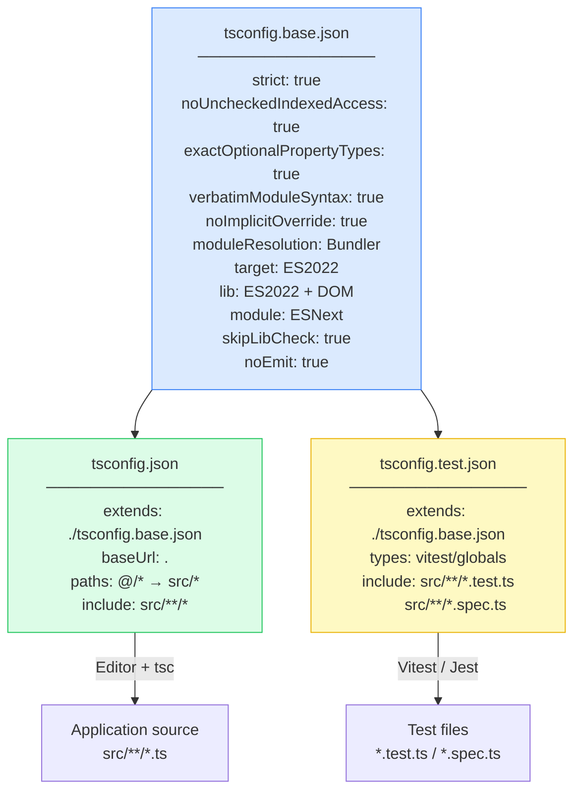

# TypeScript Configuration

A `tsconfig.json` file is the contract between your source code and the TypeScript compiler. It determines which type errors the compiler will catch, what syntax the output targets, how modules resolve, and whether the build is incremental. Every team has one — most teams treat it as boilerplate, copied from a project starter and rarely revisited.

That default approach leaves type safety on the table. The `strict` flag is not enabled by default in TypeScript. `noUncheckedIndexedAccess`, which prevents silent `undefined` reads from arrays and index signatures, is not part of `strict`. `verbatimModuleSyntax`, which prevents import/export mismatches that cause runtime failures in transpile-only pipelines, is disabled by default. These gaps are not obscure edge cases — they are whole categories of bugs that the compiler could catch and is not.

The modern TypeScript ecosystem has also introduced configuration options that did not exist two years ago: `moduleResolution: "Bundler"` (TypeScript 5.0) correctly models how Vite, esbuild, and other bundlers resolve modules, replacing the legacy `"node"` setting that still appears in most project starters. `verbatimModuleSyntax` replaced the older `importsNotUsedAsValues` and `preserveValueImports` flags, consolidating type-import discipline into a single, clearer option.

Configuration is not a one-time setup task. It is a living document that must be updated as the TypeScript compiler adds new checks, as the module system evolves, and as the project's build pipeline changes. A `tsconfig.json` that was correct in 2022 may silently miss errors in 2024.

## Principle

Every `tsconfig.json` option MUST be treated as a type-safety contract, not a preference. Loosening a compiler flag eliminates an entire class of type errors permanently — teams MUST justify each loosened flag explicitly and document the reason in a comment.

The `strict` flag MUST be enabled in all application code. Disabling `strict` and selectively re-enabling individual flags (`strictNullChecks`, `strictFunctionTypes`, etc.) is not equivalent — `strict` enables additional checks beyond those individual flags, and new strictness flags added in future TypeScript versions are automatically included when `strict: true` is set.

`noUncheckedIndexedAccess` MUST be enabled alongside `strict`. Array indexing and index signature lookups return `T | undefined` under this flag, not `T`. Code that indexes without this flag running is making an implicit assumption that the index is valid — an assumption the compiler cannot verify.

`verbatimModuleSyntax` MUST be enabled in projects that use transpile-only build tools (esbuild, SWC, Babel, Vite). These tools do not run the TypeScript type checker — they strip type annotations mechanically. Without `verbatimModuleSyntax`, a value import used only as a type will survive into the JavaScript output, causing a runtime reference to a module that may not export that value, or a circular dependency that manifests only at runtime.

`moduleResolution` MUST match the actual module resolution algorithm of the runtime or bundler. In modern Vite and Next.js projects, `moduleResolution: "Bundler"` (TypeScript 5.0+) is the correct setting. Using `"node"` in a bundler-based project means TypeScript models a resolution algorithm that the bundler does not use, causing false negatives: TypeScript reports no error for an import that will fail at bundle time.

Path aliases defined in `paths` MUST be mirrored in the bundler configuration. TypeScript's `paths` is a type-checking-time construct only — it does not affect the emitted JavaScript. Aliases that exist in `tsconfig.json` but not in `vite.config.ts` or `webpack.config.js` will type-check successfully and fail at runtime.

`tsconfig.json` files SHOULD be layered: a shared base configuration that enforces strictness, an application configuration that adds project-specific paths and includes, and a test configuration that enables test-framework-specific globals.

## Design Thinking

### The strict umbrella and why partial flags are not equivalent

TypeScript's `--strict` flag is a shorthand for enabling a set of individual strictness flags: `strictNullChecks`, `strictFunctionTypes`, `strictBindCallApply`, `strictPropertyInitialization`, `noImplicitAny`, `noImplicitThis`, `alwaysStrict`, and `useUnknownInCatchVariables`. Developers who disable `strict` and manually enable only `strictNullChecks` believe they have replicated the important parts of strict mode — they have not.

The individual flags miss two things. First, `strict` is forward-compatible: when TypeScript adds new strictness flags in future releases, they are automatically included under `strict: true`. A project that manually lists individual flags will silently not receive new checks. Second, `strict` includes interactions between flags that are not individually re-creatable. The correct approach is always to start with `strict: true` and add additional flags on top — never to assemble an ad-hoc collection of individual strictness options.

The migration path for projects that cannot immediately fix all strict errors is `// @ts-ignore` on specific lines or `@ts-expect-error` with explanations, not disabling `strict` globally. A project with `strict: true` and 20 suppressed errors is in a much better position than a project with `strict: false` — the 20 suppressions are visible, tracked, and can be resolved incrementally.

### target vs. lib vs. module: a common misconception

Three `tsconfig.json` fields control output, and they are commonly confused:

- `target` — the JavaScript syntax version that TypeScript emits. `"ES2022"` means TypeScript will emit ES2022 syntax (arrow functions, optional chaining, etc. are left as-is; older syntax is downleveled). It does NOT mean you have access to ES2022 APIs.
- `lib` — the type definitions included for the runtime environment. `"ES2022"` in `lib` means TypeScript knows about `Array.prototype.at()`, `Object.hasOwn()`, and other ES2022 APIs. Without the matching `lib` entry, TypeScript will report these as unknown.
- `module` — the module format of the emitted JavaScript. `"ESNext"` emits ES module syntax (`import`/`export`). `"CommonJS"` emits `require()`/`module.exports`.

A project with `target: "ES2022"` but no `lib: ["ES2022"]` will see errors when using `Array.prototype.at()` even though the runtime supports it. A project with `lib: ["ES2022"]` but `target: "ES5"` will have type-safe access to `Array.prototype.at()` but emit code that calls it in an ES5 bundle — a runtime error if the polyfill is absent.

In practice: for browser apps with a modern bundler, set `target: "ES2022"`, `lib: ["ES2022", "DOM", "DOM.Iterable"]`, and `module: "ESNext"`. Let the bundler handle transpilation to the actual browser targets via its own configuration (e.g., Vite's `build.target` or Babel's `@babel/preset-env`).

### Path aliases: type-checking layer vs. runtime resolution

TypeScript's `paths` field maps import aliases to file paths at type-checking time. When the compiler sees `import { Button } from '@/components/Button'`, it looks up `@/*` in `paths`, resolves it to `['src/*']`, and finds `src/components/Button.ts`. The import type-checks correctly.

None of this affects the emitted JavaScript. The compiled output still contains `import { Button } from '@/components/Button'` — a bare specifier that Node.js or the browser does not know how to resolve. The bundler must also be configured to resolve the same alias.

This two-layer architecture is frequently the source of an insidious class of bugs: the TypeScript compiler passes, CI passes, the app fails at runtime or bundle time with a "Cannot find module '@/components/Button'" error. The fix is to always configure aliases in both places — and to use `vite-tsconfig-paths` in Vite projects, which reads `tsconfig.json` paths automatically and applies them to Vite's module resolution, eliminating the duplication.

### verbatimModuleSyntax and transpile-only pipelines

TypeScript's traditional compilation model runs full type checking before emit. Transpile-only tools (esbuild, SWC, Babel, Vite's transform pipeline) do not — they strip type annotations mechanically, file by file, without a full program analysis. This creates a specific failure mode with type imports.

Consider:

```typescript
import { UserRole } from './types'

const check = (role: UserRole) => role === 'admin'
```

If `UserRole` is a type (not a value), the traditional TypeScript compiler removes the import during type erasure. A transpile-only tool that strips types file-by-file may or may not remove this import, depending on its implementation — it may emit `import { UserRole } from './types'` into the JavaScript output, creating a runtime import of a symbol that does not exist as a value.

`verbatimModuleSyntax` solves this by requiring explicit `import type` syntax for type-only imports. The compiler error is immediate and visible: "This import is never used as a value and must use 'import type' because 'verbatimModuleSyntax' is specified." Developers learn the distinction, write `import type { UserRole } from './types'`, and the transpile-only tool has an unambiguous signal to strip the import.

## Best Practices

### Start Strict: strict, noUncheckedIndexedAccess, exactOptionalPropertyTypes

Enable `strict: true` as the baseline and add three additional flags that are not included in the `strict` umbrella but catch significant error categories:

**`noUncheckedIndexedAccess`**: Adds `| undefined` to any array index access (`arr[0]`) and index signature lookup (`obj[key]`). Without this flag, `const first = arr[0]` types `first` as `T`, even when the array may be empty. With this flag, `first` is typed as `T | undefined`, forcing explicit null-guards.

```typescript
const arr: string[] = getData()

// Without noUncheckedIndexedAccess: first is string — no error
// With noUncheckedIndexedAccess: first is string | undefined — must guard
const first = arr[0]
if (first !== undefined) {
  console.log(first.toUpperCase()) // safe
}
```

**`exactOptionalPropertyTypes`**: Distinguishes between a property being `undefined` and a property being absent. Without this flag, `{ key?: string }` accepts `{ key: undefined }` as equivalent to omitting `key`. With this flag, they are different: a property typed as `string | undefined` must be explicitly assigned `undefined`; an optional property `string | undefined` can be absent.

**`noImplicitOverride`**: Requires the `override` keyword on methods that override a base class method. Prevents silent failures when a base class method is renamed — the derived class method no longer overrides anything, but without this flag, TypeScript does not warn.

### verbatimModuleSyntax: enforce import type discipline

Enable `verbatimModuleSyntax: true` in any project using a transpile-only build tool. This flag enforces that type-only imports use `import type`, and type-only re-exports use `export type`.

```typescript
// Before verbatimModuleSyntax — ambiguous for transpilers
import { User, UserRole } from './types'
import { createUser } from './api'

// After verbatimModuleSyntax — explicit
import type { User, UserRole } from './types'
import { createUser } from './api'

// Inline type import (also valid)
import { type User, createUser } from './api'
```

The inline `import { type Foo }` syntax allows mixing type and value imports from the same module in a single import statement — useful when a module exports both types and values.

Projects migrating to `verbatimModuleSyntax` from the older `importsNotUsedAsValues: "error"` setting should know that `verbatimModuleSyntax` is a superset: it also requires `export type` for type-only re-exports. The migration is straightforward — run `tsc`, fix the reported errors, commit.

### Alias Sync: paths in tsconfig must match vite.config.ts

Define path aliases in `tsconfig.json` for type checking, and sync them to the bundler configuration. In Vite projects, use the `vite-tsconfig-paths` plugin to eliminate duplication:

```typescript
// vite.config.ts
import { defineConfig } from 'vite'
import tsconfigPaths from 'vite-tsconfig-paths'

export default defineConfig({
  plugins: [tsconfigPaths()],
})
```

With `vite-tsconfig-paths`, any alias defined in `tsconfig.json` under `paths` is automatically available in Vite's module resolution. No manual duplication in `resolve.alias` is needed.

For projects not using `vite-tsconfig-paths`, the aliases must be explicitly mirrored:

```typescript
// vite.config.ts — manual sync (error-prone)
import path from 'path'

export default defineConfig({
  resolve: {
    alias: {
      '@': path.resolve(__dirname, 'src'),
      '@components': path.resolve(__dirname, 'src/components'),
    },
  },
})
```

This manual approach creates a synchronization hazard: adding an alias to `tsconfig.json` without adding it to `vite.config.ts` causes a type-check success and a runtime failure. The `vite-tsconfig-paths` plugin eliminates this class of error.

### tsconfig Layering: base, app, test

Structure configuration in three layers:

1. **`tsconfig.base.json`** — Strictness, compiler behavior, module system. No `include`/`exclude` (these are project-specific). Shared across all packages in a monorepo.

2. **`tsconfig.json`** — Extends base. Adds `baseUrl`, `paths`, and `include` for the application source. This is the file the editor and `tsc` use for the main codebase.

3. **`tsconfig.test.json`** — Extends base (not app). Adds test-framework types (`vitest/globals`, `@types/jest`) and includes test file patterns. Does not inherit application paths to keep test configuration isolated.

The base-extends-nothing pattern is intentional: the base file defines behavior that should not be overridden in derived configs. Application-specific settings go in the app config where they can vary between projects.

### Project References for Monorepos

In a monorepo with multiple TypeScript packages, use project references with `composite: true` to enable incremental builds and cross-package type checking:

```json
// packages/ui/tsconfig.json
{
  "compilerOptions": {
    "composite": true,
    "declaration": true,
    "declarationMap": true
  }
}
```

```json
// apps/web/tsconfig.json
{
  "references": [
    { "path": "../../packages/ui" }
  ]
}
```

Running `tsc --build` at the root uses the project graph to rebuild only changed packages and their dependents. Type errors in `packages/ui` are reported when building `apps/web` — the full type-checking chain works across package boundaries without running a separate build step per package.

`declarationMap: true` enables go-to-definition to navigate to source files rather than `.d.ts` declarations — essential for developer experience in a monorepo where packages are developed alongside the consuming app.

## Visual

### tsconfig Inheritance Chain

The following diagram shows how the three-layer tsconfig inheritance chain is structured and what each layer contributes.



## Example

### Complete tsconfig Setup

This example shows a complete, production-ready tsconfig setup for a Vite + Vitest application.

```json
// tsconfig.base.json
{
  "compilerOptions": {
    "strict": true,
    "noUncheckedIndexedAccess": true,
    "exactOptionalPropertyTypes": true,
    "noImplicitOverride": true,
    "verbatimModuleSyntax": true,

    "target": "ES2022",
    "lib": ["ES2022", "DOM", "DOM.Iterable"],
    "module": "ESNext",
    "moduleResolution": "Bundler",

    "skipLibCheck": true,
    "noEmit": true,
    "resolveJsonModule": true,
    "isolatedModules": true,

    "jsx": "react-jsx"
  }
}
```

Note: `moduleResolution: "Bundler"` was introduced in TypeScript 5.0. It correctly models the module resolution algorithm used by Vite, esbuild, and other bundlers — they support index files, extension omission, and `exports` field in `package.json` in a way that the legacy `"node"` setting does not model accurately.

```json
// tsconfig.json  (application config, used by editor and tsc)
{
  "extends": "./tsconfig.base.json",
  "compilerOptions": {
    "baseUrl": ".",
    "paths": {
      "@/*": ["src/*"],
      "@components/*": ["src/components/*"],
      "@lib/*": ["src/lib/*"]
    }
  },
  "include": ["src/**/*", "vite.config.ts"]
}
```

```typescript
// vite.config.ts
import { defineConfig } from 'vite'
import react from '@vitejs/plugin-react'
import tsconfigPaths from 'vite-tsconfig-paths'

export default defineConfig({
  plugins: [
    react(),
    tsconfigPaths(), // reads paths from tsconfig.json automatically
  ],
  build: {
    target: 'es2022',
  },
})
```

```json
// tsconfig.test.json  (test config, used by Vitest)
{
  "extends": "./tsconfig.base.json",
  "compilerOptions": {
    "types": ["vitest/globals"]
  },
  "include": [
    "src/**/*.test.ts",
    "src/**/*.test.tsx",
    "src/**/*.spec.ts",
    "src/**/*.spec.tsx"
  ]
}
```

Configure Vitest to use `tsconfig.test.json`:

```typescript
// vitest.config.ts
import { defineConfig } from 'vitest/config'
import tsconfigPaths from 'vite-tsconfig-paths'

export default defineConfig({
  plugins: [tsconfigPaths()],
  test: {
    globals: true,
    environment: 'jsdom',
    tsconfig: './tsconfig.test.json',
  },
})
```

### Using the Configuration in Code

With `noUncheckedIndexedAccess` enabled, array index access now returns `T | undefined`:

```typescript
// src/lib/users.ts
import type { User } from '@/types'  // verbatimModuleSyntax requires import type

const users: User[] = fetchUsers()

// TypeScript error without undefined guard:
// const name = users[0].name  — Object is possibly 'undefined'

const first = users[0]
if (first !== undefined) {
  console.log(first.name)  // safe: first is User here
}

// Or use optional chaining:
const name = users[0]?.name  // string | undefined
```

With `exactOptionalPropertyTypes`, optional property assignment is stricter:

```typescript
interface Config {
  timeout?: number  // can be absent, but not explicitly undefined
}

// Error with exactOptionalPropertyTypes:
// const cfg: Config = { timeout: undefined }

// Correct:
const cfg1: Config = {}             // property absent — OK
const cfg2: Config = { timeout: 5000 }  // property present — OK

// If you need to allow explicit undefined:
interface Config2 {
  timeout?: number | undefined      // explicitly allows undefined assignment
}
```

## Common Mistakes

### strict: false with manual flags

A common migration pattern for legacy codebases is to disable `strict` and manually enable only the flags that currently pass:

```json
// Anti-pattern — do not do this
{
  "compilerOptions": {
    "strict": false,
    "strictNullChecks": true,
    "noImplicitAny": true
  }
}
```

This creates a false sense of safety. `strictFunctionTypes`, `strictBindCallApply`, `strictPropertyInitialization`, `useUnknownInCatchVariables`, and other flags in the `strict` umbrella are not enabled. More critically, future TypeScript releases may add new strictness flags under `strict` — a project using `strict: false` will never receive them.

The correct migration path: enable `strict: true` and suppress individual failing locations with `// @ts-expect-error` comments that include an explanation. The suppressions are visible, reviewable, and removable incrementally. They do not silently disable entire categories of type checking.

### paths in tsconfig but not in bundler

Type aliases defined in `tsconfig.json` are a TypeScript-only construct. The TypeScript compiler resolves them for type checking but does not transform the emitted `import` statements. This means:

```json
// tsconfig.json — has @/* alias
{
  "compilerOptions": {
    "paths": { "@/*": ["src/*"] }
  }
}
```

```typescript
// src/App.tsx — imports using the alias
import { Button } from '@/components/Button'
```

```typescript
// vite.config.ts — alias NOT configured
export default defineConfig({
  // No resolve.alias, no vite-tsconfig-paths
})
```

Result: TypeScript reports no error. Vite fails to bundle with "Cannot find module '@/components/Button'". This class of error is particularly dangerous because it is invisible to `tsc --noEmit` and only surfaces at build time or in the browser.

Fix: always use `vite-tsconfig-paths` or manually mirror every alias in the bundler configuration.

### ts-node without `esm: true`

Running TypeScript files directly with `ts-node` in a project configured with `"module": "ESNext"` causes a `SyntaxError: Cannot use import statement in a module` at runtime, even though `tsc` reports no errors. The fix is to add `ts-node` configuration to `tsconfig.json`:

```json
{
  "compilerOptions": {
    "module": "ESNext",
    "moduleResolution": "Bundler"
  },
  "ts-node": {
    "esm": true,
    "experimentalSpecifierResolution": "node"
  }
}
```

Alternatively, use `tsx` (a `ts-node` replacement using esbuild) which handles ESM projects without configuration.

### moduleResolution: "node" in a Vite or Next.js project

`moduleResolution: "node"` models the CommonJS resolution algorithm from Node.js 12 and earlier. It does not understand:

- The `exports` field in `package.json` (used by most modern ESM packages for subpath exports)
- Extensionless imports of `.ts` files (allowed by bundlers, not by Node's CJS resolver)
- `index` file resolution without explicit extensions in some contexts

Using `"node"` in a Vite project means TypeScript silently accepts imports that will fail at bundle time, and silently rejects imports that will succeed — a double failure mode. It also means TypeScript cannot correctly type-check packages that use `exports` field subpath conditions (`"types"` condition in `package.json` `exports`).

The correct setting for Vite projects is `moduleResolution: "Bundler"` (TypeScript 5.0+). For projects that must stay on TypeScript 4.x, `"node16"` or `"nodenext"` is preferable to `"node"`, though these require `.js` extensions on relative imports, which can be disruptive.

## Related FEEs

- [FEE-1600 — Developer Experience & Tooling Overview](./1600.md) — Category context: TypeScript configuration is the foundation of the type-safety layer in the DX lifecycle
- [FEE-1601 — Linting & Static Analysis](./1601.md) — Type-aware ESLint rules (`@typescript-eslint/recommended-type-checked`) require a `tsconfig.json` with `project` path configured; strict tsconfig produces more accurate lint results
- [FEE-803 — Transpilation](../Build%20Tooling%20and%20Module%20Systems/803.md) — esbuild, SWC, and Babel are transpile-only tools that strip TypeScript without type checking; `verbatimModuleSyntax` and `isolatedModules` are the tsconfig flags that align TypeScript's model with transpiler behavior
- [FEE-805 — Monorepo Tooling](../Build%20Tooling%20and%20Module%20Systems/805.md) — Project references with `composite: true` are the TypeScript-native approach to incremental builds and cross-package type checking in monorepos

## References

- [TypeScript tsconfig reference](https://www.typescriptlang.org/tsconfig)
- [TypeScript 5.0 release — moduleResolution: "Bundler"](https://devblogs.microsoft.com/typescript/announcing-typescript-5-0/#moduleresolution-bundler)
- [verbatimModuleSyntax documentation](https://www.typescriptlang.org/tsconfig#verbatimModuleSyntax)
- [noUncheckedIndexedAccess documentation](https://www.typescriptlang.org/tsconfig#noUncheckedIndexedAccess)
- [vite-tsconfig-paths](https://github.com/aleclarson/vite-tsconfig-paths)
- [TypeScript project references](https://www.typescriptlang.org/docs/handbook/project-references.html)
