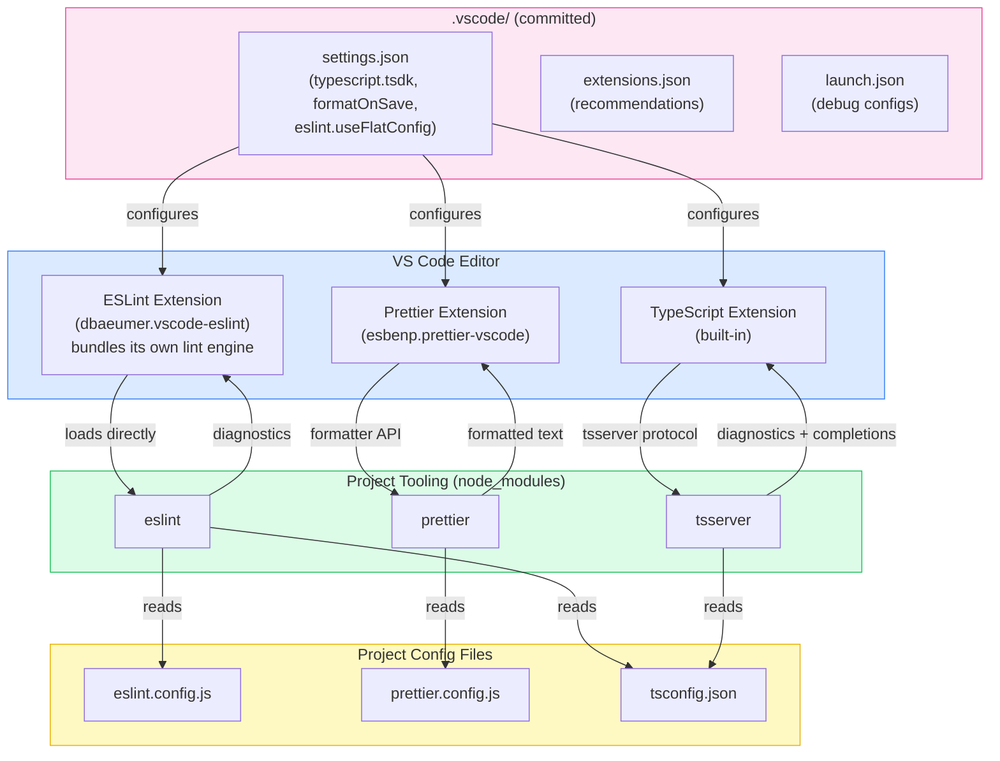

# Editor & IDE Integration

:::info
An editor that surfaces type errors, lint violations, and formatting problems while the developer types catches mistakes before they reach CI, where a failed check costs a push, a re-run, and a context switch instead of a single keystroke. Without committed editor configuration, two developers on the same project can see different diagnostics: one has an outdated global TypeScript version selected, another has format-on-save disabled and pushes unformatted commits. Three files committed to `.vscode/` (`settings.json`, `extensions.json`, and `launch.json`) fix the version, the formatter, and the debug setup, and recommend the extensions that make those fixes work, so every VS Code user sees the same signal. TypeScript, ESLint, and Prettier each reach the editor through a different mechanism; what actually travels between editors is the project's own config files: `tsconfig.json`, `eslint.config.js`, and `prettier.config.js`.
:::

## Context

Editor tooling for JavaScript and TypeScript used to be reimplemented per editor: the VS Code TypeScript extension, the WebStorm TypeScript service, and assorted Vim plugins each parsed the language independently and drifted apart in behavior. The Language Server Protocol (LSP), announced by Microsoft together with Red Hat and Codenvy in June 2016, gave editors a shared wire protocol for diagnostics, completions, and hover info, and many language tools have adopted it since. TypeScript is a partial holdout: its `tsserver` process predates LSP and still speaks its own JSON protocol, and standard LSP support arrived only with the TypeScript 7 `tsgo` compiler in mid-2026. ESLint ships no standalone LSP server and runs bundled inside each editor's own extension, and Prettier has no LSP server at all. This article documents which `.vscode/` settings to commit, how `tsserver`, ESLint, and Prettier actually integrate with the editor, and where WebStorm and other editors diverge from VS Code.

## Visual

### Editor Integration Architecture

The diagram below shows how each VS Code extension actually reaches project code. TypeScript's built-in extension talks to `tsserver` over TypeScript's own protocol, the ESLint extension loads the project's `eslint` package and runs it in-process, and the Prettier extension calls Prettier's formatter API directly. Only the project config files are shared with other editors.



Neovim and Zed reach the same `tsserver` process through a community wrapper, `typescript-language-server` or `vtsls`, that translates LSP calls into TypeScript's protocol; neither editor runs `tsserver` as a native LSP server. WebStorm skips both `tsserver` and any ESLint server: it uses its own TypeScript service and invokes the `eslint` package directly, the way the VS Code extension does. The one piece every editor in this diagram actually shares is the bottom-right box: the project config files.

## Example

### Three Committed .vscode Configuration Files

The following three files form a complete, committed editor configuration for a TypeScript project using ESLint flat config, Prettier, Vitest, and Next.js.

**`.vscode/settings.json`**

```json
{
  // TypeScript: use project TypeScript, not VS Code bundled version
  "typescript.tsdk": "node_modules/typescript/lib",
  "typescript.enablePromptUseWorkspaceTsdk": true,

  // Formatting: Prettier on save for all file types
  "editor.formatOnSave": true,
  "editor.defaultFormatter": "esbenp.prettier-vscode",
  "[typescript]": {
    "editor.defaultFormatter": "esbenp.prettier-vscode"
  },
  "[typescriptreact]": {
    "editor.defaultFormatter": "esbenp.prettier-vscode"
  },
  "[javascript]": {
    "editor.defaultFormatter": "esbenp.prettier-vscode"
  },
  "[javascriptreact]": {
    "editor.defaultFormatter": "esbenp.prettier-vscode"
  },
  "[json]": {
    "editor.defaultFormatter": "esbenp.prettier-vscode"
  },

  // ESLint: pin flat config support and run auto-fix on save
  "eslint.useFlatConfig": true,
  "eslint.validate": [
    "javascript",
    "javascriptreact",
    "typescript",
    "typescriptreact"
  ],
  "editor.codeActionsOnSave": {
    "source.fixAll.eslint": "explicit"
  },

  // Line endings: LF on all platforms to prevent diff noise
  "files.eol": "\n",

  // Search: exclude build artifacts from workspace search
  "search.exclude": {
    "**/node_modules": true,
    "**/.next": true,
    "**/dist": true,
    "**/.turbo": true
  }
}
```

**`.vscode/extensions.json`**

```json
{
  "recommendations": [
    "dbaeumer.vscode-eslint",
    "esbenp.prettier-vscode",
    "eamodio.gitlens",
    "usernamehw.errorlens",
    "streetsidesoftware.code-spell-checker"
  ]
}
```

**`.vscode/launch.json`**

```json
{
  "version": "0.2.0",
  "configurations": [
    {
      "name": "Debug Vitest Tests",
      "type": "node",
      "request": "launch",
      "runtimeExecutable": "pnpm",
      "runtimeArgs": ["exec", "vitest", "--run", "--reporter=verbose", "--pool=forks"],
      "console": "integratedTerminal",
      "internalConsoleOptions": "neverOpen",
      "skipFiles": ["<node_internals>/**"]
    },
    {
      "name": "Debug Vitest: Current File",
      "type": "node",
      "request": "launch",
      "runtimeExecutable": "pnpm",
      "runtimeArgs": [
        "exec",
        "vitest",
        "--run",
        "--reporter=verbose",
        "--pool=forks",
        "${relativeFile}"
      ],
      "console": "integratedTerminal",
      "internalConsoleOptions": "neverOpen",
      "skipFiles": ["<node_internals>/**"]
    },
    {
      "name": "Debug Next.js Server",
      "type": "node",
      "request": "launch",
      "runtimeExecutable": "pnpm",
      "runtimeArgs": ["next", "dev"],
      "env": {
        "NODE_OPTIONS": "--inspect"
      },
      "console": "integratedTerminal",
      "internalConsoleOptions": "neverOpen",
      "skipFiles": ["<node_internals>/**"]
    }
  ]
}
```

> This configuration covers server-side Node.js debugging (API routes, Server Actions, middleware). For client-side browser debugging, add a separate `launch` or `attach` configuration targeting Chrome using the `pwa-chrome` type.

### What Each Setting Does

`typescript.tsdk` combined with `typescript.enablePromptUseWorkspaceTsdk` ensures every developer uses the same TypeScript version as CI. On first open, VS Code displays: "This workspace contains a TypeScript version. Do you want to use the workspace TypeScript version?" Selecting "Use Workspace Version" activates the project TypeScript.

`eslint.useFlatConfig` explicitly pins the ESLint extension to flat-config mode. Since vscode-eslint v3.0.10, the extension auto-detects flat config, and the setting now defaults to `true` for any project on ESLint v9 or later, since flat config is the ESLint v9+ default. Setting it explicitly is optional in 2026; it mainly matters for a project still pinned to ESLint 8.57–8.x, where the default remains `false` and the extension falls back to looking for `.eslintrc.*` files.

`"source.fixAll.eslint": "explicit"` in `codeActionsOnSave` applies ESLint auto-fixes on every manual save. Fixable rules include import ordering (if configured), removal of unused imports (with the `eslint-plugin-unused-imports` plugin), and many `@typescript-eslint` fixable rules. Non-fixable violations remain as diagnostic squiggles.

The launch configs use `runtimeExecutable: "pnpm"`. Projects on npm or Yarn should change this to `"npm"` or `"npx"`. `skipFiles: ["<node_internals>/**"]` prevents the debugger from stepping into Node.js internals, so the step-through experience stays on application code.

## Best Practices

**MUST set `typescript.tsdk` to `node_modules/typescript/lib` in `.vscode/settings.json` and commit this file.** VS Code ships with a bundled TypeScript that is often behind the version declared in the project's `devDependencies`, causing diagnostic inconsistencies where the editor does not show errors that the project's TypeScript version introduces. Setting `typescript.enablePromptUseWorkspaceTsdk: true` alongside `typescript.tsdk` causes VS Code to prompt developers to activate workspace TypeScript on first open, ensuring the committed version is used without any manual setup step. Projects that opt into TypeScript 7's native `tsgo` compiler enable it separately: pre-GA, this ran through the experimental `typescript.experimental.useTsgo` toggle, and since the TypeScript 7.0 GA release VS Code's TypeScript 7 support instead ships as a dedicated extension that becomes the default experience once installed, with command-palette commands to enable or disable it; `typescript.tsdk` still matters for any tool or editor that falls back to the classic `tsserver`.

**MUST configure `editor.formatOnSave: true`, `editor.defaultFormatter` pointing to Prettier, and `editor.codeActionsOnSave` with `"source.fixAll.eslint": "explicit"` in `.vscode/settings.json`.** Per-language overrides for TypeScript and TypeScript React MUST be included as safety valves to override any conflicting global user settings. The `"explicit"` value for the ESLint code action MUST be used instead of `true` so that ESLint auto-fix runs only on manual saves and not on every auto-save event.

**MUST commit a `.vscode/extensions.json` file with a minimal, curated list of recommended extensions.** The minimum set for a TypeScript project includes the ESLint extension, the Prettier formatter extension, GitLens for blame and history, and Error Lens for inline error display. Teams MUST keep this list small because every added recommendation is an install prompt to every developer; experimental or team-specific extensions SHOULD be placed in `unwantedRecommendations` instead.

**SHOULD commit a `.vscode/launch.json` with ready-to-use debug configurations for the project's test runner and server.** A working debug configuration is a force multiplier: developers can step through failing tests or attach to a running server process immediately without any configuration research. For Vitest projects, the configuration SHOULD include both a full test suite launcher and a current-file launcher using `--pool=forks`, which runs tests in a single process that VS Code's Node.js debugger can attach to with reliable breakpoint resolution.

**SHOULD document equivalent WebStorm settings for teams with mixed editor environments.** WebStorm detects ESLint, Prettier, and TypeScript automatically from project config files and requires no workspace settings file; developers SHOULD set ESLint to "Automatic ESLint configuration", Prettier to "Automatic Prettier configuration" with run-on-save enabled, and the TypeScript service to "TypeScript from node_modules". The underlying `tsconfig.json`, `eslint.config.js`, and `prettier.config.js` serve as the shared source of truth for both editors.

## Design Thinking

### Language Server Protocol: what's standardized and what isn't

Before LSP, every editor reimplemented language support itself: the VS Code TypeScript extension was a VS Code artifact, the WebStorm TypeScript integration was a separate JetBrains artifact, and the two diverged in behavior. Microsoft, Red Hat, and Codenvy announced LSP in June 2016 to fix this by giving editors and language tools a common JSON-RPC protocol for diagnostics, completions, and hover info. Editors that speak LSP can plug into any LSP server without editor-specific glue code.

TypeScript, ESLint, and Prettier each landed on a different side of that standard as of 2026.

`tsserver`, TypeScript's own server, predates LSP and still speaks TypeScript's original, pre-LSP JSON protocol. VS Code's built-in TypeScript extension bridges directly to that protocol; it is not an LSP client. Other editors reach `tsserver` through a community wrapper, `typescript-language-server` or `vtsls`, that translates LSP requests into `tsserver`'s protocol. TypeScript 7's native `tsgo` compiler, generally available July 8, 2026, changes this: its editor mode is built on standard LSP, so editors that adopt it get a real LSP server instead of a bridged one.

ESLint has no standalone, official LSP server in wide use. The VS Code ESLint extension bundles its own lint-running server internally and loads the project's `eslint` package from `node_modules`; it does not expose a separate `eslint-language-server` binary for other editors to share. Community LSP wrappers for ESLint exist, but no single official package plays the role `tsserver` plays for TypeScript.

Prettier has no LSP server. The VS Code Prettier extension calls Prettier's formatter API directly, the way a build script would, and other editors' Prettier integrations do the same.

A different integration model has emerged alongside this ESLint-and-Prettier pattern. Rust-based tools such as Biome and oxc's `oxlint` ship their own LSP server directly (`biome lsp-proxy` and `oxlint --lsp`), with editor extensions that are thin LSP clients from the start. That single-binary model sidesteps the split described above: one process handles both linting and formatting and speaks LSP natively, at the cost of not yet matching ESLint's plugin ecosystem.

What is actually portable, regardless of which of these mechanisms a given tool uses, is the project's own config: `tsconfig.json`, `eslint.config.js`, `prettier.config.js`. Every integration above, LSP-based or not, reads these files and the project's installed tool version from `node_modules`. Setting `typescript.tsdk` to `node_modules/typescript/lib` works because it points the client at that installed version, not because `tsserver` speaks LSP.

### Which settings belong in the repo vs. global user config

The boundary between project settings and personal settings follows one principle: settings that affect code output belong in the project, and settings that affect the developer's personal experience belong in user config.

Settings that belong in `.vscode/settings.json` (committed):
- `editor.formatOnSave`: whether code is formatted on save determines whether committed code is formatted.
- `editor.defaultFormatter`: which formatter is used determines whether committed formatting matches CI.
- `editor.codeActionsOnSave`: which ESLint fixes are applied on save determines whether lint violations appear in commits.
- `typescript.tsdk`: which TypeScript version is used for type checking determines whether editor diagnostics match CI.
- `eslint.useFlatConfig`: pins the ESLint extension to flat-config mode. Optional for ESLint v9+, where the extension already defaults it to `true`, but still worth committing for reproducibility across extension versions.
- `files.eol`: line ending normalization prevents cross-platform diff noise.

Settings that belong in personal user config (not committed):
- `editor.fontSize`, `editor.fontFamily`, `editor.lineHeight`: personal preference, no effect on code.
- `editor.colorTheme`, `workbench.colorTheme`: personal preference.
- `editor.minimap.enabled`: personal preference.

When in doubt: ask whether a different setting value would cause a CI failure or a code review comment. If yes, it belongs in the repo.

### VS Code workspace trust and extension activation

VS Code's workspace trust model, introduced in 2021, prevents extensions from running automatically in untrusted workspaces. When a developer clones a repository for the first time, VS Code prompts them to trust the workspace before extensions like ESLint and Prettier activate.

This is a security boundary: a malicious repository could include an `.eslintrc` that runs arbitrary code via a custom plugin. Workspace trust gates this. The practical consequence: if a developer opens a project in restricted mode or declines the trust prompt, ESLint and Prettier will not run in the editor, and format-on-save will silently do nothing.

Teams should document this in onboarding: after cloning, trust the workspace. The trust prompt appears once per workspace path. For monorepos, trust applies to the root. Nested packages inherit the root's trust status.

This is also why `.vscode/extensions.json` matters beyond convenience: it gives developers an explicit signal of which extensions the project expects, making it clear what should be activated.

### WebStorm and other editors: shared config, different integration

WebStorm and other JetBrains IDEs with the TypeScript plugin do not run `tsserver`, and they do not share an ESLint server with VS Code. WebStorm uses its own TypeScript service, and it invokes the `eslint` package directly from the project's `node_modules`, the same package the command line and the VS Code extension use, without going through vscode-eslint's bundled server or any LSP layer. What WebStorm does share with VS Code is the configuration: `tsconfig.json` drives TypeScript, `eslint.config.js` drives ESLint, `prettier.config.js` drives Prettier. There is no JetBrains-specific config file to commit.

The differences are in the UI surface and default behavior. WebStorm enables ESLint and Prettier automatically when it detects the relevant config files; there is no `eslint.useFlatConfig`-equivalent setting to configure, because WebStorm reads `eslint.config.js` directly regardless of format. Format-on-save in WebStorm is configured in Settings > Languages & Frameworks > JavaScript > Prettier (for Prettier) and the Reformat Code action. The `.vscode/` folder is ignored by JetBrains IDEs.

Neovim and Zed take a third path: neither ships a bundled TypeScript or ESLint integration, so both rely on external LSP servers, typically `typescript-language-server` or `vtsls` for TypeScript and a community ESLint LSP wrapper for ESLint. VS Code, WebStorm, Neovim, and Zed all read the same `tsconfig.json`, `eslint.config.js`, and `prettier.config.js`. None of them run the same server process to do it.

For teams where some developers use VS Code and others use WebStorm, the committed configuration strategy is: commit `.vscode/` for VS Code users, and rely on WebStorm's auto-detection for JetBrains users. The underlying project config remains the shared source of truth for both. The `.vscode/` settings configure a VS Code extension's behavior; they do not need a JetBrains equivalent because WebStorm reads the same project config files on its own.

## Common Mistakes

### format-on-save set globally but overridden locally

A developer has `"editor.formatOnSave": true` in their global user settings but `"editor.defaultFormatter": "esbenp.vscode-eslint"` (a non-existent or incorrect formatter) in a personal workspace override. Formatting silently does nothing for TypeScript files.

The workspace-committed `.vscode/settings.json` takes precedence over user settings for workspace-level settings. However, language-specific settings in user config (`"[typescript]": { "editor.defaultFormatter": "..." }`) can still override workspace-level general settings. To prevent this, commit explicit language-specific formatter overrides in `.vscode/settings.json` as shown in the Example section above.

## Related Topics

- [FEE-1600 — Developer Experience & Tooling Overview](./1600.md) — Category context: editor integration is the real-time feedback layer of the DX lifecycle
- [FEE-1601 — Linting & Static Analysis](./1601.md) — The ESLint extension is the backend for in-editor lint diagnostics; `eslint.useFlatConfig` pins it to flat config on older extension versions
- [FEE-1602 — Code Formatting & EditorConfig](./1602.md) — Prettier is the formatter behind `editor.formatOnSave`; EditorConfig sets baseline whitespace rules read by both VS Code and WebStorm
- [FEE-1605 — TypeScript Configuration](./1605.md) — `typescript.tsdk` ensures the editor uses the same `tsconfig.json` and TypeScript version as CI

## References

- Codenvy, Microsoft, and Red Hat, "Red Hat, Codenvy and Microsoft Collaborate on Language Server Protocol," GlobeNewswire (2016). https://www.globenewswire.com/news-release/2016/06/27/1202314/0/en/Red-Hat-Codenvy-and-Microsoft-Collaborate-on-Language-Server-Protocol.html
- Microsoft, "Language Server Protocol Specification," microsoft.github.io. https://microsoft.github.io/language-server-protocol/
- Microsoft/TypeScript maintainers, "Standalone Server (tsserver)," GitHub Wiki. https://github.com/microsoft/TypeScript/wiki/Standalone-Server-(tsserver)
- TypeScript team, "Announcing TypeScript 7.0," Microsoft DevBlogs (2026). https://devblogs.microsoft.com/typescript/announcing-typescript-7-0/
- typescript-language-server maintainers, "typescript-language-server," npm. https://www.npmjs.com/package/typescript-language-server
- Microsoft, "vscode-eslint," GitHub. https://github.com/microsoft/vscode-eslint
- JetBrains, "ESLint," WebStorm Documentation, jetbrains.com. https://www.jetbrains.com/help/webstorm/eslint.html
- oxc-project, "Editor Setup," oxc.rs. https://oxc.rs/docs/guide/usage/linter/editors
- Biome maintainers, "Biome Language Server," biomejs.dev. https://biomejs.dev/editors/introduction/
- Microsoft, "Workspace Trust," Visual Studio Code Docs. https://code.visualstudio.com/docs/editor/workspace-trust
- Microsoft, "Workspace Recommended Extensions (extensions.json)," Visual Studio Code Docs. https://code.visualstudio.com/docs/editor/extension-marketplace#_workspace-recommended-extensions
- Microsoft, "launch.json Reference," Visual Studio Code Docs. https://code.visualstudio.com/docs/editor/debugging#_launch-configurations
- Microsoft, "User and Workspace Settings," Visual Studio Code Docs. https://code.visualstudio.com/docs/getstarted/settings
