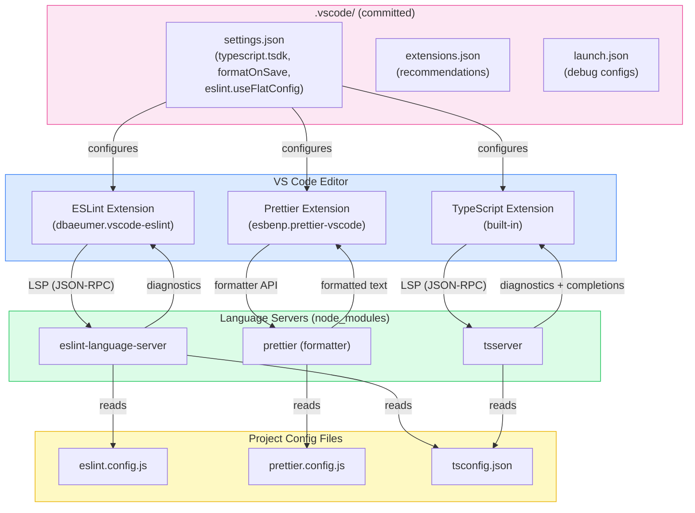

# Editor & IDE Integration

An editor that surfaces type errors, lint violations, and formatting problems in real time eliminates an entire class of feedback-loop latency. The developer sees the problem as they type, not at CI time. This is not convenience — it is a structural shift in when errors are caught and how expensive they are to fix.

The challenge is consistency. Without committed configuration, two developers on the same project may see entirely different diagnostics: one has `typescript.tsdk` pointing to a global TypeScript 4.9 install while the project runs 5.4; another has format-on-save disabled so their commits trigger Prettier failures. The editor becomes an unreliable signal, and developers stop trusting it.

The modern editor integration story has a principled architecture. Every major language tool — TypeScript, ESLint, Prettier — now exposes its functionality through the Language Server Protocol. The VS Code extension for each tool is a thin LSP client; the actual intelligence lives in the language server process spawned from the project's own `node_modules`. This architecture means that editor integration is not a VS Code-specific concern — the same language servers power JetBrains IDEs, Neovim, Zed, and any other LSP-capable editor. The configuration committed to the repository works across all of them.

## Principle

Project-scoped editor configuration MUST be committed to the repository. Settings that affect how code is written — format on save, default formatter, ESLint auto-fix — define project standards and MUST NOT be left to individual developer preference.

`.vscode/settings.json`, `.vscode/extensions.json`, and `.vscode/launch.json` MUST be tracked in version control and treated with the same rigor as `tsconfig.json` or `.eslintrc`. They are not personal dotfiles — they are project infrastructure.

The `typescript.tsdk` setting MUST point to the project-local TypeScript installation. Using VS Code's bundled TypeScript for type checking while CI uses the project's TypeScript introduces a version split that produces inconsistent diagnostics: errors the editor does not show will fail the build, and editor errors that do not exist in CI undermine developer trust.

Format on save MUST be enabled with the project's formatter set as the default. A project using Prettier MUST set `editor.defaultFormatter` to `"esbenp.prettier-vscode"` and MUST enable `editor.formatOnSave`. Relying on a pre-commit hook alone means formatting errors surface at commit time rather than as the developer types — a slower feedback loop with a worse experience.

ESLint auto-fix MUST be configured via `editor.codeActionsOnSave` so that fixable violations are resolved on save without manual intervention. Projects using ESLint's flat config format MUST also set `"eslint.useFlatConfig": true` in workspace settings; without this flag, the ESLint VS Code extension does not load `eslint.config.js`.

Recommended extensions SHOULD be declared in `.vscode/extensions.json`. VS Code surfaces these to developers who clone the repository and do not have them installed. This is the lowest-friction path to a consistent toolchain across the team.

Debug configurations SHOULD be committed in `.vscode/launch.json`. A working debug configuration that does not need to be reconstructed from scratch saves hours per developer and removes a silent barrier to using the debugger.

## Design Thinking

### Language Server Protocol: why editor integration is now portable

Before LSP, every editor had to implement its own TypeScript parser, its own ESLint runner, its own Prettier formatter. The VS Code TypeScript integration was a VS Code artifact; the WebStorm TypeScript integration was a JetBrains artifact. They diverged in behavior and were expensive to maintain.

LSP, introduced by Microsoft in 2016, inverts this model. A language server is an independent process that speaks a JSON-RPC protocol. The editor is a client that speaks the same protocol. TypeScript ships `tsserver`, which is an LSP server. ESLint ships `eslint-language-server`. Prettier integration works similarly through a language server adapter.

The consequence for project configuration is significant: the language server reads the project's own config files — `tsconfig.json`, `eslint.config.js`, `prettier.config.js` — and uses the project's own installed version from `node_modules`. The editor extension does not contain intelligence; it contains a client. This is why `typescript.tsdk` matters: it tells the TypeScript LSP client where to find the language server binary. Point it at `node_modules/typescript/lib` and the editor uses the same TypeScript the build uses.

The portability implication: when a developer switches from VS Code to Zed or WebStorm, they bring the same language servers and the same project config. The diagnostics are consistent. The committed configuration does not need to be replicated per editor — the LSP layer abstracts it.

### Which settings belong in the repo vs. global user config

The boundary between project settings and personal settings is not arbitrary — it follows a clear principle: settings that affect code output belong in the project; settings that affect the developer's personal experience belong in user config.

Settings that belong in `.vscode/settings.json` (committed):
- `editor.formatOnSave` — whether code is formatted on save determines whether committed code is formatted
- `editor.defaultFormatter` — which formatter is used determines whether committed formatting matches CI
- `editor.codeActionsOnSave` — which ESLint fixes are applied on save determines whether lint violations appear in commits
- `typescript.tsdk` — which TypeScript version is used for type checking determines whether editor diagnostics match CI
- `eslint.useFlatConfig` — whether the ESLint extension uses flat config determines whether it finds `eslint.config.js`
- `files.eol` — line ending normalization prevents cross-platform diff noise

Settings that belong in personal user config (not committed):
- `editor.fontSize`, `editor.fontFamily`, `editor.lineHeight` — personal preference, no effect on code
- `editor.colorTheme`, `workbench.colorTheme` — personal preference
- `editor.keyBindings` — personal preference
- `editor.minimap.enabled` — personal preference

When in doubt: ask whether a different setting value would cause a CI failure or a code review comment. If yes, it belongs in the repo.

### VS Code workspace trust and extension activation

VS Code's workspace trust model, introduced in 2021, prevents extensions from running automatically in untrusted workspaces. When a developer clones a repository for the first time, VS Code prompts them to trust the workspace before extensions like ESLint and Prettier activate.

This is a security boundary: a malicious repository could include an `.eslintrc` that runs arbitrary code via a custom plugin. Workspace trust gates this. The practical consequence: if a developer opens a project in restricted mode or declines the trust prompt, ESLint and Prettier will not run in the editor, and format-on-save will silently do nothing.

Teams should document this in onboarding: after cloning, trust the workspace. The trust prompt appears once per workspace path. For monorepos, trust applies to the root — nested packages inherit the root's trust status.

This is also why `.vscode/extensions.json` matters beyond convenience: it gives developers an explicit signal of which extensions the project expects, making it clear what should be activated.

### JetBrains and WebStorm: the same LSP layer, different UI

WebStorm (and the broader JetBrains IDEs with the TypeScript plugin) uses the same `tsserver` and `eslint-language-server` processes. The configuration files are the same: `tsconfig.json` drives TypeScript, `eslint.config.js` drives ESLint, `prettier.config.js` drives Prettier. There is no JetBrains-specific config to commit.

The differences are in the UI surface and default behavior. WebStorm enables ESLint and Prettier integration automatically when it detects the relevant config files — there is no need to configure `eslint.useFlatConfig` in an IDE settings file, because WebStorm reads `eslint.config.js` directly. Format-on-save in WebStorm is configured in Settings > Languages & Frameworks > JavaScript > Prettier (for Prettier) and the Reformat Code action. The `.vscode/` folder is ignored by JetBrains IDEs.

For teams where some developers use VS Code and others use WebStorm, the committed configuration strategy is: commit `.vscode/` for VS Code users; rely on WebStorm's auto-detection for JetBrains users. The underlying project config — `tsconfig.json`, `eslint.config.js`, `prettier.config.js` — is the shared source of truth for both. The `.vscode/` settings are not duplicated into a JetBrains-specific format; they are VS Code-specific conveniences layered on top of the project config that both editors read.

## Best Practices

### typescript.tsdk: use project TypeScript, not bundled VS Code TypeScript

VS Code ships with a bundled TypeScript that is used by default for language services. This version is often behind the version declared in the project's `devDependencies`. The split causes a class of diagnostic inconsistencies: the editor may not show errors that the project's TypeScript version introduces (or vice versa), and developers can become accustomed to a type-checking experience that does not match CI.

Set `typescript.tsdk` in `.vscode/settings.json` to the project-local TypeScript:

```json
{
  "typescript.tsdk": "node_modules/typescript/lib",
  "typescript.enablePromptUseWorkspaceTsdk": true
}
```

`typescript.tsdk` tells VS Code where to find the TypeScript language server. `typescript.enablePromptUseWorkspaceTsdk` causes VS Code to prompt the developer to switch to the workspace TypeScript when they open the project, rather than silently using the bundled version.

After setting these values, developers need to run the "TypeScript: Select TypeScript Version" command from the command palette and choose "Use Workspace Version". With `typescript.enablePromptUseWorkspaceTsdk: true`, VS Code prompts this automatically on first open. The selected version is stored in `.vscode/settings.json` under `typescript.tsdk` — committing this file ensures everyone uses the same version without any manual step.

The practical impact is most visible when the project uses a TypeScript version newer than VS Code's bundled version: new type narrowing behavior, new `satisfies` operator syntax, new `moduleResolution: "Bundler"` checks — all of these may be silently absent in the editor if `typescript.tsdk` is not set.

### Format on Save: formatOnSave, defaultFormatter, and codeActionsOnSave

Three settings combine to make the editor enforce formatting and fixable lint violations on every save:

```json
{
  "editor.formatOnSave": true,
  "editor.defaultFormatter": "esbenp.prettier-vscode",
  "[typescript]": {
    "editor.defaultFormatter": "esbenp.prettier-vscode"
  },
  "[typescriptreact]": {
    "editor.defaultFormatter": "esbenp.prettier-vscode"
  },
  "editor.codeActionsOnSave": {
    "source.fixAll.eslint": "explicit"
  }
}
```

`editor.formatOnSave: true` triggers the formatter after each save. `editor.defaultFormatter` sets Prettier as the formatter for all file types. The per-language overrides (`[typescript]`, `[typescriptreact]`) are explicit safety valves — if a developer has a global user setting overriding the default formatter for TypeScript files, the workspace setting takes precedence.

`editor.codeActionsOnSave` with `"source.fixAll.eslint": "explicit"` runs ESLint's auto-fix on save, applying fixable rules (unused imports removal, import ordering if configured, accessibility attributes for simple cases). The `"explicit"` value means the action runs on manual saves (`Ctrl+S` / `Cmd+S`) but not on auto-save — this is the recommended setting to avoid ESLint running on every keystroke during auto-save configurations.

The result: by the time a developer runs `git commit`, the staged files have already been formatted by Prettier and have had fixable ESLint violations resolved. The pre-commit hook (if present) becomes a safety net, not a primary enforcement point.

### Recommended Extensions: commit .vscode/extensions.json

The `.vscode/extensions.json` file declares which extensions VS Code should recommend to developers who open the workspace. When a developer opens the project and the file is present, VS Code shows a notification: "This workspace has extension recommendations." Clicking "Show Recommendations" takes them to the Extension Marketplace with the recommended list pre-filtered.

Commit a minimal, curated set:

```json
{
  "recommendations": [
    "dbaeumer.vscode-eslint",
    "esbenp.prettier-vscode",
    "eamodio.gitlens",
    "usernamehw.errorlens",
    "streetsidesoftware.code-spell-checker"
  ]
}
```

Extension IDs follow the format `publisher.extension-name`, visible on the extension's Marketplace page or in the Extensions panel. Use the official IDs — they are case-insensitive but canonical IDs prevent ambiguity.

The minimum set for a TypeScript project:
- `dbaeumer.vscode-eslint` — ESLint language server client
- `esbenp.prettier-vscode` — Prettier formatter
- `eamodio.gitlens` — Git blame, history, and branch visualization
- `usernamehw.errorlens` — Inline error messages in the editor gutter (eliminates the need to hover over squiggles to read the error message)

Keep the list small. Every added extension is an install prompt to every developer — noise reduces compliance. If an extension is experimental or team-specific, use the `unwantedRecommendations` array instead of adding it to recommendations.

### Debug Configurations: commit .vscode/launch.json

A working debug configuration is a force multiplier. A developer who needs to step through failing Vitest tests or attach to a Next.js server process can do so immediately — no configuration research required. A developer without a working configuration resorts to `console.log` debugging, which is slower and leaves noise in commits.

Commit a `launch.json` with configurations for the project's test runner and server:

```json
{
  "version": "0.2.0",
  "configurations": [
    {
      "name": "Debug Vitest Tests",
      "type": "node",
      "request": "launch",
      "runtimeExecutable": "pnpm",
      "runtimeArgs": ["vitest", "--run", "--reporter=verbose"],
      "console": "integratedTerminal",
      "internalConsoleOptions": "neverOpen",
      "skipFiles": ["<node_internals>/**"]
    },
    {
      "name": "Debug Vitest: Current File",
      "type": "node",
      "request": "launch",
      "runtimeExecutable": "pnpm",
      "runtimeArgs": [
        "vitest",
        "--run",
        "--reporter=verbose",
        "${relativeFile}"
      ],
      "console": "integratedTerminal",
      "internalConsoleOptions": "neverOpen",
      "skipFiles": ["<node_internals>/**"]
    },
    {
      "name": "Debug Next.js Server",
      "type": "node",
      "request": "launch",
      "runtimeExecutable": "pnpm",
      "runtimeArgs": ["next", "dev"],
      "env": {
        "NODE_OPTIONS": "--inspect"
      },
      "console": "integratedTerminal",
      "internalConsoleOptions": "neverOpen",
      "skipFiles": ["<node_internals>/**"]
    }
  ]
}
```

The "Debug Vitest: Current File" configuration is particularly useful: it runs only the test file currently open in the editor, with full breakpoint support. A developer can place a breakpoint in a test, open the test file, and launch the debugger — breakpoints resolve correctly because Vitest runs under Node.js and VS Code's Node.js debugger attaches to the process.

Adapt configurations to the project's package manager (`npm`, `yarn`, `pnpm`) and test runner (Jest, Vitest, Playwright). The investment is one-time per project; the payoff is every debugging session for every developer for the project's lifetime.

### JetBrains Notes: equivalent settings in WebStorm

WebStorm and the JetBrains family detect ESLint, Prettier, and TypeScript automatically from `package.json` and config files — no workspace settings file is needed. The equivalent configurations are in Settings (or Preferences on macOS):

- **ESLint**: Settings > Languages & Frameworks > JavaScript > Code Quality Tools > ESLint. Set to "Automatic ESLint configuration" and WebStorm reads `eslint.config.js` directly. For flat config, WebStorm 2023.3+ supports it natively.
- **Prettier**: Settings > Languages & Frameworks > JavaScript > Prettier. Set to "Automatic Prettier configuration" and enable "Run on Save". WebStorm uses the project-local Prettier from `node_modules`.
- **TypeScript**: Settings > Languages & Frameworks > TypeScript. The TypeScript service version is set to "TypeScript from node_modules" — the equivalent of `typescript.tsdk`. WebStorm picks up `tsconfig.json` automatically.
- **Error display**: WebStorm shows inline error annotations by default, equivalent to Error Lens in VS Code. No additional plugin is required.

For teams that mix VS Code and WebStorm users, the committed `.vscode/` configuration serves VS Code users transparently. WebStorm ignores `.vscode/` and uses its own settings, but both editors read the same underlying `tsconfig.json`, `eslint.config.js`, and `prettier.config.js`. The project-level config is the single source of truth; the editor-level config is a thin client layer on top of it.

## Visual

### Editor Integration Architecture

The following diagram shows how VS Code editor plugins communicate with language servers, which read project configuration files and return diagnostics.



## Example

### Three Committed .vscode Configuration Files

The following three files form a complete, committed editor configuration for a TypeScript project using ESLint flat config, Prettier, Vitest, and Next.js.

**`.vscode/settings.json`**

```json
{
  // TypeScript: use project TypeScript, not VS Code bundled version
  "typescript.tsdk": "node_modules/typescript/lib",
  "typescript.enablePromptUseWorkspaceTsdk": true,

  // Formatting: Prettier on save for all file types
  "editor.formatOnSave": true,
  "editor.defaultFormatter": "esbenp.prettier-vscode",
  "[typescript]": {
    "editor.defaultFormatter": "esbenp.prettier-vscode"
  },
  "[typescriptreact]": {
    "editor.defaultFormatter": "esbenp.prettier-vscode"
  },
  "[javascript]": {
    "editor.defaultFormatter": "esbenp.prettier-vscode"
  },
  "[javascriptreact]": {
    "editor.defaultFormatter": "esbenp.prettier-vscode"
  },
  "[json]": {
    "editor.defaultFormatter": "esbenp.prettier-vscode"
  },

  // ESLint: enable flat config support and run auto-fix on save
  "eslint.useFlatConfig": true,
  "eslint.validate": [
    "javascript",
    "javascriptreact",
    "typescript",
    "typescriptreact"
  ],
  "editor.codeActionsOnSave": {
    "source.fixAll.eslint": "explicit"
  },

  // Line endings: LF on all platforms to prevent diff noise
  "files.eol": "\n",

  // Search: exclude build artifacts from workspace search
  "search.exclude": {
    "**/node_modules": true,
    "**/.next": true,
    "**/dist": true,
    "**/.turbo": true
  }
}
```

**`.vscode/extensions.json`**

```json
{
  "recommendations": [
    "dbaeumer.vscode-eslint",
    "esbenp.prettier-vscode",
    "eamodio.gitlens",
    "usernamehw.errorlens",
    "streetsidesoftware.code-spell-checker"
  ]
}
```

**`.vscode/launch.json`**

```json
{
  "version": "0.2.0",
  "configurations": [
    {
      "name": "Debug Vitest Tests",
      "type": "node",
      "request": "launch",
      "runtimeExecutable": "pnpm",
      "runtimeArgs": ["vitest", "--run", "--reporter=verbose"],
      "console": "integratedTerminal",
      "internalConsoleOptions": "neverOpen",
      "skipFiles": ["<node_internals>/**"]
    },
    {
      "name": "Debug Vitest: Current File",
      "type": "node",
      "request": "launch",
      "runtimeExecutable": "pnpm",
      "runtimeArgs": [
        "vitest",
        "--run",
        "--reporter=verbose",
        "${relativeFile}"
      ],
      "console": "integratedTerminal",
      "internalConsoleOptions": "neverOpen",
      "skipFiles": ["<node_internals>/**"]
    },
    {
      "name": "Debug Next.js Server",
      "type": "node",
      "request": "launch",
      "runtimeExecutable": "pnpm",
      "runtimeArgs": ["next", "dev"],
      "env": {
        "NODE_OPTIONS": "--inspect"
      },
      "console": "integratedTerminal",
      "internalConsoleOptions": "neverOpen",
      "skipFiles": ["<node_internals>/**"]
    }
  ]
}
```

### What Each Setting Does

`typescript.tsdk` combined with `typescript.enablePromptUseWorkspaceTsdk` ensures every developer uses the same TypeScript version as CI. On first open, VS Code displays: "This workspace contains a TypeScript version. Do you want to use the workspace TypeScript version?" Selecting "Use Workspace Version" activates the project TypeScript.

`eslint.useFlatConfig: true` is required when the project uses `eslint.config.js` (ESLint v9 flat config format). Without this flag, the ESLint extension looks for `.eslintrc.*` files and silently finds nothing — ESLint diagnostics do not appear in the editor. With this flag, the extension reads `eslint.config.js` correctly.

`"source.fixAll.eslint": "explicit"` in `codeActionsOnSave` applies ESLint auto-fixes on every manual save. Fixable rules include import ordering (if configured), removal of unused imports (with the `eslint-plugin-unused-imports` plugin), and many `@typescript-eslint` fixable rules. Non-fixable violations remain as diagnostic squiggles.

The launch configurations use `runtimeExecutable: "pnpm"` — adapt to `"npm"` or `"npx"` depending on the project's package manager. `skipFiles: ["<node_internals>/**"]` prevents the debugger from stepping into Node.js internals, keeping the step-through experience focused on application code.

## Common Mistakes

### eslint.useFlatConfig not set with flat config projects

Projects that have migrated to ESLint's flat config format (`eslint.config.js`, ESLint v9+) but have not set `"eslint.useFlatConfig": true` in workspace settings will see no ESLint diagnostics in the editor. The ESLint extension silently fails to find a config file because it looks for `.eslintrc.*` by default.

The symptom: ESLint output in the VS Code Output panel (View > Output > ESLint) shows "No ESLint configuration found" or "ESLint: Could not find config file." The fix is a single workspace setting.

This mistake is common because the ESLint extension's default behavior predates flat config. Developers migrating to ESLint v9 update `eslint.config.js` but do not realize the extension requires an explicit opt-in to read it.

### typescript.tsdk not set, leading to version split

A project declares `"typescript": "^5.4.0"` in `devDependencies`. VS Code ships with TypeScript 5.2 bundled. Without `typescript.tsdk`, the editor uses 5.2 for type checking while CI uses 5.4. TypeScript 5.4 introduces new narrowing behavior for `NoInfer<T>` and improvements to control flow analysis. Developers write code that type-checks correctly in the editor (5.2) and fails in CI (5.4), or vice versa.

The fix is always `"typescript.tsdk": "node_modules/typescript/lib"`. Commit this to `.vscode/settings.json` so every developer gets the correct TypeScript version without a manual setup step.

### format-on-save set globally but overridden locally

A developer has `"editor.formatOnSave": true` in their global user settings but `"editor.defaultFormatter": "esbenp.vscode-eslint"` (a non-existent or incorrect formatter) in a personal workspace override. Formatting silently does nothing for TypeScript files.

The workspace-committed `.vscode/settings.json` takes precedence over user settings for workspace-level settings. However, language-specific settings in user config (`"[typescript]": { "editor.defaultFormatter": "..." }`) can still override workspace-level general settings. To prevent this, commit explicit language-specific formatter overrides in `.vscode/settings.json` as shown in the Example section above.

### .vscode/ added to .gitignore

A common mistake is adding `.vscode/` to `.gitignore` to avoid committing personal settings (font size, theme). The correct approach is to be selective:

```gitignore
# .gitignore — do NOT ignore all of .vscode/
# Only ignore personal settings that should not be shared:
.vscode/settings.local.json

# The following MUST be committed:
# .vscode/settings.json
# .vscode/extensions.json
# .vscode/launch.json
```

If the repository already has `.vscode/` in `.gitignore`, the fix is to explicitly un-ignore the project-level files:

```gitignore
.vscode/*
!.vscode/settings.json
!.vscode/extensions.json
!.vscode/launch.json
!.vscode/tasks.json
```

## Related FEEs

- [FEE-1600 — Developer Experience & Tooling Overview](./1600.md) — Category context: editor integration is the real-time feedback layer of the DX lifecycle
- [FEE-1601 — Linting & Static Analysis](./1601.md) — ESLint language server is the backend for in-editor lint diagnostics; `eslint.useFlatConfig` connects the extension to `eslint.config.js`
- [FEE-1602 — Code Formatting & EditorConfig](./1602.md) — Prettier is the formatter behind `editor.formatOnSave`; EditorConfig sets baseline whitespace rules read by both VS Code and WebStorm
- [FEE-1605 — TypeScript Configuration](./1605.md) — `typescript.tsdk` ensures the editor uses the same `tsconfig.json` and TypeScript version as CI

## References

- [VS Code workspace settings documentation](https://code.visualstudio.com/docs/getstarted/settings)
- [VS Code extensions.json — workspace recommendations](https://code.visualstudio.com/docs/editor/extension-marketplace#_workspace-recommended-extensions)
- [ESLint VS Code extension — flat config support](https://marketplace.visualstudio.com/items?itemName=dbaeumer.vscode-eslint)
- [Language Server Protocol specification](https://microsoft.github.io/language-server-protocol/)
- [VS Code workspace trust](https://code.visualstudio.com/docs/editor/workspace-trust)
- [VS Code debugging — launch.json reference](https://code.visualstudio.com/docs/editor/debugging#_launch-configurations)
