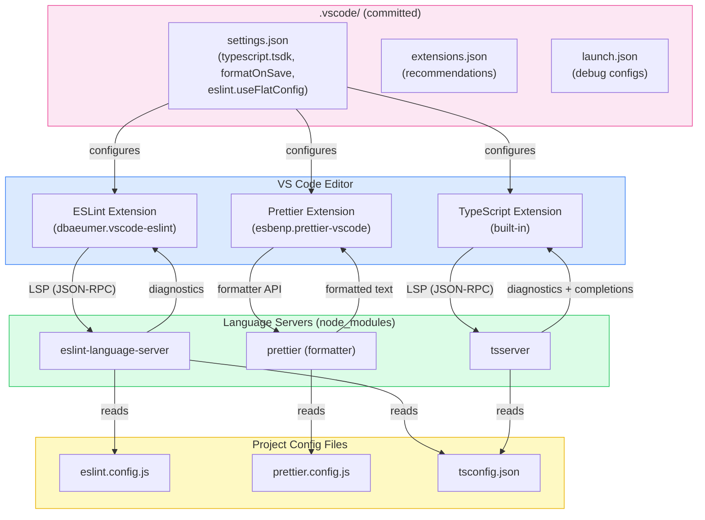

# Editor & IDE Integration

An editor that surfaces type errors, lint violations, and formatting problems in real time eliminates an entire class of feedback-loop latency. The developer sees the problem as they type, not at CI time. This is not convenience — it is a structural shift in when errors are caught and how expensive they are to fix.

The challenge is consistency. Without committed configuration, two developers on the same project may see entirely different diagnostics: one has `typescript.tsdk` pointing to a global TypeScript 4.9 install while the project runs 5.4; another has format-on-save disabled so their commits trigger Prettier failures. The editor becomes an unreliable signal, and developers stop trusting it.

The modern editor integration story has a principled architecture. Every major language tool — TypeScript, ESLint, Prettier — now exposes its functionality through the Language Server Protocol. The VS Code extension for each tool is a thin LSP client; the actual intelligence lives in the language server process spawned from the project's own `node_modules`. This architecture means that editor integration is not a VS Code-specific concern — the same language servers power JetBrains IDEs, Neovim, Zed, and any other LSP-capable editor. The configuration committed to the repository works across all of them.

## Design Thinking

### Language Server Protocol: why editor integration is now portable

Before LSP, every editor had to implement its own TypeScript parser, its own ESLint runner, its own Prettier formatter. The VS Code TypeScript integration was a VS Code artifact; the WebStorm TypeScript integration was a JetBrains artifact. They diverged in behavior and were expensive to maintain.

LSP, introduced by Microsoft in 2016, inverts this model. A language server is an independent process that speaks a JSON-RPC protocol. The editor is a client that speaks the same protocol. TypeScript ships `tsserver`, which is an LSP server. The VS Code ESLint extension runs ESLint analysis in a background process — effectively acting as a language server, even if it doesn't expose a standalone `eslint-language-server` binary in older versions. The `@eslint/language-server` package formalizes this as a proper LSP server in ESLint's 2024+ roadmap. Prettier integration works similarly through a language server adapter.

The consequence for project configuration is significant: the language server reads the project's own config files — `tsconfig.json`, `eslint.config.js`, `prettier.config.js` — and uses the project's own installed version from `node_modules`. The editor extension does not contain intelligence; it contains a client. This is why `typescript.tsdk` matters: it tells the TypeScript LSP client where to find the language server binary. Point it at `node_modules/typescript/lib` and the editor uses the same TypeScript the build uses.

The portability implication: when a developer switches from VS Code to Zed or WebStorm, they bring the same language servers and the same project config. The diagnostics are consistent. The committed configuration does not need to be replicated per editor — the LSP layer abstracts it.

### Which settings belong in the repo vs. global user config

The boundary between project settings and personal settings is not arbitrary — it follows a clear principle: settings that affect code output belong in the project; settings that affect the developer's personal experience belong in user config.

Settings that belong in `.vscode/settings.json` (committed):
- `editor.formatOnSave` — whether code is formatted on save determines whether committed code is formatted
- `editor.defaultFormatter` — which formatter is used determines whether committed formatting matches CI
- `editor.codeActionsOnSave` — which ESLint fixes are applied on save determines whether lint violations appear in commits
- `typescript.tsdk` — which TypeScript version is used for type checking determines whether editor diagnostics match CI
- `eslint.useFlatConfig` — whether the ESLint extension uses flat config determines whether it finds `eslint.config.js`
- `files.eol` — line ending normalization prevents cross-platform diff noise

Settings that belong in personal user config (not committed):
- `editor.fontSize`, `editor.fontFamily`, `editor.lineHeight` — personal preference, no effect on code
- `editor.colorTheme`, `workbench.colorTheme` — personal preference
- `editor.minimap.enabled` — personal preference

When in doubt: ask whether a different setting value would cause a CI failure or a code review comment. If yes, it belongs in the repo.

### VS Code workspace trust and extension activation

VS Code's workspace trust model, introduced in 2021, prevents extensions from running automatically in untrusted workspaces. When a developer clones a repository for the first time, VS Code prompts them to trust the workspace before extensions like ESLint and Prettier activate.

This is a security boundary: a malicious repository could include an `.eslintrc` that runs arbitrary code via a custom plugin. Workspace trust gates this. The practical consequence: if a developer opens a project in restricted mode or declines the trust prompt, ESLint and Prettier will not run in the editor, and format-on-save will silently do nothing.

Teams should document this in onboarding: after cloning, trust the workspace. The trust prompt appears once per workspace path. For monorepos, trust applies to the root — nested packages inherit the root's trust status.

This is also why `.vscode/extensions.json` matters beyond convenience: it gives developers an explicit signal of which extensions the project expects, making it clear what should be activated.

### JetBrains and WebStorm: the same LSP layer, different UI

WebStorm (and the broader JetBrains IDEs with the TypeScript plugin) uses the same `tsserver` and `eslint-language-server` processes. The configuration files are the same: `tsconfig.json` drives TypeScript, `eslint.config.js` drives ESLint, `prettier.config.js` drives Prettier. There is no JetBrains-specific config to commit.

The differences are in the UI surface and default behavior. WebStorm enables ESLint and Prettier integration automatically when it detects the relevant config files — there is no need to configure `eslint.useFlatConfig` in an IDE settings file, because WebStorm reads `eslint.config.js` directly. Format-on-save in WebStorm is configured in Settings > Languages & Frameworks > JavaScript > Prettier (for Prettier) and the Reformat Code action. The `.vscode/` folder is ignored by JetBrains IDEs.

For teams where some developers use VS Code and others use WebStorm, the committed configuration strategy is: commit `.vscode/` for VS Code users; rely on WebStorm's auto-detection for JetBrains users. The underlying project config — `tsconfig.json`, `eslint.config.js`, `prettier.config.js` — is the shared source of truth for both. The `.vscode/` settings are not duplicated into a JetBrains-specific format; they are VS Code-specific conveniences layered on top of the project config that both editors read.

## Best Practices

**MUST set `typescript.tsdk` to `node_modules/typescript/lib` in `.vscode/settings.json` and commit this file.** VS Code ships with a bundled TypeScript that is often behind the version declared in the project's `devDependencies`, causing diagnostic inconsistencies where the editor does not show errors that the project's TypeScript version introduces. Setting `typescript.enablePromptUseWorkspaceTsdk: true` alongside `typescript.tsdk` causes VS Code to prompt developers to activate workspace TypeScript on first open, ensuring the committed version is used without any manual setup step.

**MUST configure `editor.formatOnSave: true`, `editor.defaultFormatter` pointing to Prettier, and `editor.codeActionsOnSave` with `"source.fixAll.eslint": "explicit"` in `.vscode/settings.json`.** Per-language overrides for TypeScript and TypeScript React MUST be included as safety valves to override any conflicting global user settings. The `"explicit"` value for the ESLint code action MUST be used instead of `true` so that ESLint auto-fix runs only on manual saves and not on every auto-save event.

**MUST commit a `.vscode/extensions.json` file with a minimal, curated list of recommended extensions.** The minimum set for a TypeScript project includes the ESLint language server client, the Prettier formatter extension, GitLens for blame and history, and Error Lens for inline error display. Teams MUST keep this list small because every added recommendation is an install prompt to every developer; experimental or team-specific extensions SHOULD be placed in `unwantedRecommendations` instead.

**SHOULD commit a `.vscode/launch.json` with ready-to-use debug configurations for the project's test runner and server.** A working debug configuration is a force multiplier: developers can step through failing tests or attach to a running server process immediately without any configuration research. For Vitest projects, the configuration SHOULD include both a full test suite launcher and a current-file launcher using `--pool=forks`, which runs tests in a single process that VS Code's Node.js debugger can attach to with reliable breakpoint resolution.

**SHOULD document equivalent WebStorm settings for teams with mixed editor environments.** WebStorm detects ESLint, Prettier, and TypeScript automatically from project config files and requires no workspace settings file; developers SHOULD set ESLint to "Automatic ESLint configuration", Prettier to "Automatic Prettier configuration" with run-on-save enabled, and the TypeScript service to "TypeScript from node_modules". The underlying `tsconfig.json`, `eslint.config.js`, and `prettier.config.js` serve as the shared source of truth for both editors.

## Visual

### Editor Integration Architecture

The following diagram shows how VS Code editor plugins communicate with language servers, which read project configuration files and return diagnostics.



## Example

### Three Committed .vscode Configuration Files

The following three files form a complete, committed editor configuration for a TypeScript project using ESLint flat config, Prettier, Vitest, and Next.js.

**`.vscode/settings.json`**

```json
{
  // TypeScript: use project TypeScript, not VS Code bundled version
  "typescript.tsdk": "node_modules/typescript/lib",
  "typescript.enablePromptUseWorkspaceTsdk": true,

  // Formatting: Prettier on save for all file types
  "editor.formatOnSave": true,
  "editor.defaultFormatter": "esbenp.prettier-vscode",
  "[typescript]": {
    "editor.defaultFormatter": "esbenp.prettier-vscode"
  },
  "[typescriptreact]": {
    "editor.defaultFormatter": "esbenp.prettier-vscode"
  },
  "[javascript]": {
    "editor.defaultFormatter": "esbenp.prettier-vscode"
  },
  "[javascriptreact]": {
    "editor.defaultFormatter": "esbenp.prettier-vscode"
  },
  "[json]": {
    "editor.defaultFormatter": "esbenp.prettier-vscode"
  },

  // ESLint: enable flat config support and run auto-fix on save
  "eslint.useFlatConfig": true,
  "eslint.validate": [
    "javascript",
    "javascriptreact",
    "typescript",
    "typescriptreact"
  ],
  "editor.codeActionsOnSave": {
    "source.fixAll.eslint": "explicit"
  },

  // Line endings: LF on all platforms to prevent diff noise
  "files.eol": "\n",

  // Search: exclude build artifacts from workspace search
  "search.exclude": {
    "**/node_modules": true,
    "**/.next": true,
    "**/dist": true,
    "**/.turbo": true
  }
}
```

**`.vscode/extensions.json`**

```json
{
  "recommendations": [
    "dbaeumer.vscode-eslint",
    "esbenp.prettier-vscode",
    "eamodio.gitlens",
    "usernamehw.errorlens",
    "streetsidesoftware.code-spell-checker"
  ]
}
```

**`.vscode/launch.json`**

```json
{
  "version": "0.2.0",
  "configurations": [
    {
      "name": "Debug Vitest Tests",
      "type": "node",
      "request": "launch",
      "runtimeExecutable": "pnpm",
      "runtimeArgs": ["exec", "vitest", "--run", "--reporter=verbose", "--pool=forks"],
      "console": "integratedTerminal",
      "internalConsoleOptions": "neverOpen",
      "skipFiles": ["<node_internals>/**"]
    },
    {
      "name": "Debug Vitest: Current File",
      "type": "node",
      "request": "launch",
      "runtimeExecutable": "pnpm",
      "runtimeArgs": [
        "exec",
        "vitest",
        "--run",
        "--reporter=verbose",
        "--pool=forks",
        "${relativeFile}"
      ],
      "console": "integratedTerminal",
      "internalConsoleOptions": "neverOpen",
      "skipFiles": ["<node_internals>/**"]
    },
    {
      "name": "Debug Next.js Server",
      "type": "node",
      "request": "launch",
      "runtimeExecutable": "pnpm",
      "runtimeArgs": ["next", "dev"],
      "env": {
        "NODE_OPTIONS": "--inspect"
      },
      "console": "integratedTerminal",
      "internalConsoleOptions": "neverOpen",
      "skipFiles": ["<node_internals>/**"]
    }
  ]
}
```

> This configuration covers server-side Node.js debugging (API routes, Server Actions, middleware). For client-side browser debugging, add a separate `launch` or `attach` configuration targeting Chrome using the `pwa-chrome` type.

### What Each Setting Does

`typescript.tsdk` combined with `typescript.enablePromptUseWorkspaceTsdk` ensures every developer uses the same TypeScript version as CI. On first open, VS Code displays: "This workspace contains a TypeScript version. Do you want to use the workspace TypeScript version?" Selecting "Use Workspace Version" activates the project TypeScript.

`eslint.useFlatConfig: true` is required when the project uses `eslint.config.js` (ESLint v9 flat config format). Without this flag, the ESLint extension looks for `.eslintrc.*` files and silently finds nothing — ESLint diagnostics do not appear in the editor. With this flag, the extension reads `eslint.config.js` correctly.

`"source.fixAll.eslint": "explicit"` in `codeActionsOnSave` applies ESLint auto-fixes on every manual save. Fixable rules include import ordering (if configured), removal of unused imports (with the `eslint-plugin-unused-imports` plugin), and many `@typescript-eslint` fixable rules. Non-fixable violations remain as diagnostic squiggles.

The launch configurations use `runtimeExecutable: "pnpm"` — adapt to `"npm"` or `"npx"` depending on the project's package manager. `skipFiles: ["<node_internals>/**"]` prevents the debugger from stepping into Node.js internals, keeping the step-through experience focused on application code.

## Common Mistakes

### format-on-save set globally but overridden locally

A developer has `"editor.formatOnSave": true` in their global user settings but `"editor.defaultFormatter": "esbenp.vscode-eslint"` (a non-existent or incorrect formatter) in a personal workspace override. Formatting silently does nothing for TypeScript files.

The workspace-committed `.vscode/settings.json` takes precedence over user settings for workspace-level settings. However, language-specific settings in user config (`"[typescript]": { "editor.defaultFormatter": "..." }`) can still override workspace-level general settings. To prevent this, commit explicit language-specific formatter overrides in `.vscode/settings.json` as shown in the Example section above.

## Related FEEs

- [FEE-1600 — Developer Experience & Tooling Overview](./1600.md) — Category context: editor integration is the real-time feedback layer of the DX lifecycle
- [FEE-1601 — Linting & Static Analysis](./1601.md) — ESLint language server is the backend for in-editor lint diagnostics; `eslint.useFlatConfig` connects the extension to `eslint.config.js`
- [FEE-1602 — Code Formatting & EditorConfig](./1602.md) — Prettier is the formatter behind `editor.formatOnSave`; EditorConfig sets baseline whitespace rules read by both VS Code and WebStorm
- [FEE-1605 — TypeScript Configuration](./1605.md) — `typescript.tsdk` ensures the editor uses the same `tsconfig.json` and TypeScript version as CI

## References

- [VS Code workspace settings documentation](https://code.visualstudio.com/docs/getstarted/settings)
- [VS Code extensions.json — workspace recommendations](https://code.visualstudio.com/docs/editor/extension-marketplace#_workspace-recommended-extensions)
- [ESLint VS Code extension — flat config support](https://marketplace.visualstudio.com/items?itemName=dbaeumer.vscode-eslint)
- [Language Server Protocol specification](https://microsoft.github.io/language-server-protocol/)
- [VS Code workspace trust](https://code.visualstudio.com/docs/editor/workspace-trust)
- [VS Code debugging — launch.json reference](https://code.visualstudio.com/docs/editor/debugging#_launch-configurations)
