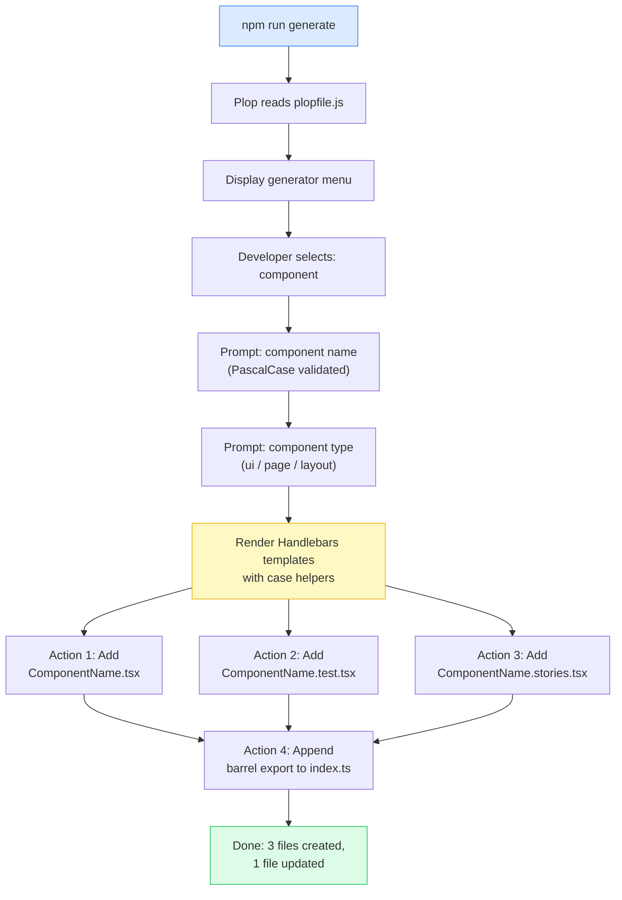

# [FEE-1607] Scaffolding & Code Generation

:::info
Copying an existing component and renaming it is how most teams create new files, and it is also how outdated conventions spread: the copy carries forward whatever the source file's structure happened to be, not whatever the team's current standards are. A code generator replaces that copy-paste step with an executable specification of what a new file should look like, so every generated file matches today's conventions instead of an arbitrary sample from the codebase's history. Plop remains the actively maintained standalone tool for this in 2026; Hygen, once its natural counterpart, has not shipped a release since 2022. Monorepo build tools now offer their own generator support, so the right tool for a given project depends on whether it already uses Turborepo or Nx.
:::

## Context

Every time a developer creates a new component by duplicating an existing file and editing the name, they are doing two things at once: creating a new component, and drifting from the team's current conventions. The file they copied might already be out of date. The test file structure may have changed since it was written, or the import ordering convention may have been updated since. The moment of file creation is when convention drift begins. It is also the cheapest moment to prevent it.

Code generators solve this by codifying conventions at creation time. A generator is an executable specification of what a new file of a given type should look like, derived from the team's current standards. When conventions change, the generator changes with them, and every file created after that change inherits the updated pattern automatically, without relying on developers to remember the update or find the right file to copy.

Plop and Hygen are the two most commonly cited generator tools in the frontend ecosystem, but by 2026 only one of them is a going concern. Plop is config-driven: all generator definitions live in a single `plopfile.js` file that is easy to audit, review, and understand in one read, and it remains actively maintained. Hygen is file-based: generators live in a `_templates/` directory as individual files, an approach that scales well when a team has many generators to manage. Hygen has shipped no release since 2022 (its last npm publish was September 2022), and Snyk rates its maintenance as Inactive; its own documentation site currently does not load over HTTPS. For most frontend teams, Plop's single-file model is simpler to maintain and easier to onboard new developers into.

## Visual

### Plop Execution Flow

The following diagram shows the full execution flow from `npm run generate` through file creation and barrel export update. The story-file action and the barrel-export action assume the project has an actively maintained Storybook and an established barrel-export convention already in place; skip both steps if either assumption does not hold (see Best Practices below).



## Example

### Setup

Install Plop as a dev dependency and expose it through a `package.json` script:

```bash
npm i -D plop
```

```json
{
  "scripts": {
    "generate": "plop"
  }
}
```

`npm run generate` (or `pnpm generate`) now runs Plop, which reads `plopfile.js` from the project root.

### Complete Plop Setup: plopfile.js and Handlebars Templates

The following example is a complete, runnable Plop setup for a React component generator. It produces three files per component (`.tsx`, `.test.tsx`, `.stories.tsx`) and appends a barrel export to `src/components/index.ts`. As with the diagram above, the story file and the barrel export assume an actively maintained Storybook and an established barrel-export convention. If either isn't true for a given project, drop the corresponding action; the component file and the test file alone are the minimum viable set.

**`plopfile.js`** (project root, ESM format, Plop v3+)

```js
export default function (plop) {
  plop.setGenerator('component', {
    description: 'Generate a React component with test and story files',
    prompts: [
      {
        type: 'input',
        name: 'name',
        message: 'Component name (PascalCase):',
        validate: (value) => {
          if (/^[A-Z][A-Za-z0-9]+$/.test(value)) return true;
          return 'Component name must be PascalCase (e.g. UserProfile, ButtonGroup)';
        },
      },
      {
        type: 'list',
        name: 'type',
        message: 'Component type:',
        choices: ['ui', 'page', 'layout'],
        default: 'ui',
      },
    ],
    actions: [
      {
        type: 'add',
        path: 'src/components/{{properCase name}}/{{properCase name}}.tsx',
        templateFile: 'plop-templates/component.tsx.hbs',
      },
      {
        type: 'add',
        path: 'src/components/{{properCase name}}/{{properCase name}}.test.tsx',
        templateFile: 'plop-templates/component.test.tsx.hbs',
      },
      {
        type: 'add',
        path: 'src/components/{{properCase name}}/{{properCase name}}.stories.tsx',
        templateFile: 'plop-templates/component.stories.tsx.hbs',
      },
      {
        type: 'append',
        path: 'src/components/index.ts',
        template:
          "export { {{properCase name}} } from './{{properCase name}}/{{properCase name}}';",
      },
    ],
  });
}
```

**`plop-templates/component.tsx.hbs`**

```hbs
import type { FC } from 'react';

interface {{properCase name}}Props {
  children?: React.ReactNode;
}

export const {{properCase name}}: FC<{{properCase name}}Props> = ({ children }) => {
  return (
    <div data-testid="{{kebabCase name}}">
      {children}
    </div>
  );
};
```

**`plop-templates/component.test.tsx.hbs`**

```hbs
import { render, screen } from '@testing-library/react';
import { {{properCase name}} } from './{{properCase name}}';

describe('{{properCase name}}', () => {
  it('renders without crashing', () => {
    render(<{{properCase name}} />);
    expect(screen.getByTestId('{{kebabCase name}}')).toBeInTheDocument();
  });

  it('renders children', () => {
    render(<{{properCase name}}>hello world</{{properCase name}}>);
    expect(screen.getByText('hello world')).toBeInTheDocument();
  });
});
```

**`plop-templates/component.stories.tsx.hbs`**

```hbs
import type { Meta, StoryObj } from '@storybook/react';
import { {{properCase name}} } from './{{properCase name}}';

const meta = {
  title: '{{properCase type}}/{{properCase name}}',
  component: {{properCase name}},
  tags: ['autodocs'],
} satisfies Meta<typeof {{properCase name}}>;

export default meta;
type Story = StoryObj<typeof meta>;

export const Default: Story = {
  args: {},
};
```

**Running the generator:**

```bash
npm run generate
# or
pnpm generate
```

Plop prompts for the component name and type, then writes three files and appends the barrel export. The result is a correctly named, correctly structured component that passes lint on the first commit.

### What Each Part Does

The `plopfile.js` `validate` function on the name prompt catches non-PascalCase input at the prompt stage, before any files are written. The error message includes an example, which is the fastest way to communicate the expected format to a developer unfamiliar with the convention.

The `properCase` helper in action `path` values ensures the output file path uses the canonical PascalCase name regardless of what the developer typed; if the validator is bypassed, the path is still correct. The `kebabCase` helper in the template produces the `data-testid` attribute in the CSS-friendly kebab format, matching the project's attribute convention without requiring the developer to manually derive it.

The `append` action adds the barrel export non-destructively: it appends to the existing `index.ts` rather than replacing it. The format matches whatever pattern the existing file uses (named export, path relative to the `src/components/` root).

## Best Practices

**MUST limit generator output to the minimum viable file set and remove any file that developers routinely delete.** The calibration test is: "If we ran this generator today, would a developer delete any generated file before their first commit?" If the answer is yes, that file MUST be removed from the generator. For a React component generator, the minimum viable set is the component file and the test file; story files MUST NOT be included unless the project has an active Storybook with consistent story maintenance, and barrel exports MUST NOT be generated unless the project has a consistently maintained barrel pattern.

**MUST derive all naming variants from a single PascalCase input using Plop's built-in case helpers.** The `properCase` helper produces the component display name and function name; `camelCase` produces test description prefixes; `kebabCase` produces CSS class names and directory names. The Plop prompt MUST validate that the input is PascalCase before any files are written, catching incorrect inputs at entry time with an immediate and actionable error message rather than generating files with inconsistent names.

**MUST expose the generator via a `package.json` script and document it in the project README.** A new developer scanning `package.json` for available scripts will find `generate` there; they will not think to look for a global `plop` binary or read `plopfile.js` on their own. Wrapping the generator in a script named `generate` puts it where developers already look. The README MUST include a one-line invocation example in the onboarding section so the question "how do I create a new component?" is answered before a new developer needs to ask.

**MUST update generator templates in the same PR as any convention change that affects generated file structure.** Generator templates are executable documentation and MUST be treated as first-class artifacts requiring the same review attention as source code. Code reviewers SHOULD verify that template files are updated whenever convention-changing files (ESLint config, TypeScript config, test utilities) are modified in the same PR. When stale templates are discovered, they MUST be fixed immediately.

**SHOULD use committed generators for file structure and AI assistance for business logic within those generated files, not as a replacement for generators.** AI code generation does not know the project's current conventions and will produce components using outdated import paths, wrong naming conventions, or superseded framework patterns. A committed generator enforces today's conventions regardless of when it was last used; AI assistance SHOULD be applied within the generated skeleton to write the implementation logic that benefits from intelligent suggestion.

## Design Thinking

### The value is consistency at creation time

The cost of convention drift compounds over time. A component built under an earlier test file structure becomes a reference point that new developers copy when they need something similar, and each copy propagates the outdated pattern to one more file. Catching convention drift at code review costs reviewer time and author frustration. Catching it in CI costs pipeline time. Catching it at creation time, via a generator, costs nothing beyond the initial investment in writing the generator.

A generator prompt is answered in seconds. A code review comment about file structure costs a round trip through author and reviewer: someone has to notice the drift, write the comment, and wait for the fix.

The secondary value is onboarding. A new developer who runs `npm run generate` and gets a correctly structured component file does not need to ask "how are test files organized?" or "do we write stories for every component?" The generator answers those questions implicitly by producing the expected structure.

### Generator maintenance: the silent failure mode

The most dangerous state for a generator is one where it exists but is out of date. Developers assume the generator matches current conventions, so its output gets merged without the scrutiny a hand-copied file would get. The result is a batch of files that conform to an older pattern, created with confidence, and the drift only surfaces weeks later when a code review catches the inconsistency.

The fix is a process constraint: treat generator templates as source of truth. When a convention changes, the template change is part of the same diff. This is not obvious to teams that think of generators as tooling rather than documentation. Reframing generators as "executable documentation of current conventions" makes the maintenance obligation clear.

Stale generators are also a signal. If a generator has gone untouched while the codebase around it keeps evolving, the gap is worth auditing: compare the files the generator would produce today against what developers are actually shipping by hand. A recurring generator review, on whatever cadence fits the team's release rhythm, catches the gap before it turns into maintenance debt.

### Plop vs. Hygen: trade-offs

Both tools produce files from templates and prompts. The architectural difference is in where generator definitions live.

**Plop** consolidates all generators in `plopfile.js`. Every generator's name, prompts, and actions are visible in one file, which makes auditing straightforward: a single file review reveals the full picture of what generators exist, what they prompt for, and what they produce. Plop uses Handlebars as its template language, with built-in case helpers (`properCase`, `camelCase`, `kebabCase`) that derive all naming variants from a single input. ESM plopfiles (`export default function`, shown throughout this article) have been supported since Plop v3 (2021). Plop also finds a `plopfile.ts` automatically (since v4.0.2, 2025), but Plop does not transpile TypeScript itself: a TypeScript plopfile runs on Node 22+'s built-in type stripping, or on older Node via a loader such as tsx.

**Hygen** places each generator in its own subdirectory under `_templates/`. This structure scales better when there are many generators: each generator is a self-contained directory rather than an entry in a growing file. Hygen templates use EJS syntax (embedded JavaScript), and discoverability requires navigating a directory tree rather than reading one file. Hygen has had no release since 2022 (see above), so treat this description as an account of its design, not a recommendation to adopt it for a new project.

For a single package or a small number of apps, Plop's single-file model wins on simplicity: a plopfile stays easy to review as long as its generator list fits on one screen. Once the project is a monorepo with several packages that each need their own generators, standalone Plop and Hygen both stop being the natural fit, and a monorepo build tool's own generator support (see below) is the better next step. The choice of scaffolding tool should be made once and committed. Switching mid-project is a migration cost that rarely pays for itself.

### Monorepo-native alternatives

Standalone Plop and Hygen predate monorepo build tools that ship generator support of their own. Turborepo's `turbo gen` uses Plop's own configuration format for custom generators, defined in `turbo/generators/config.ts`; a project already using the plopfile shown in this article can carry its prompts and actions into a `turbo gen` config with little change. Nx workspaces use local generators instead, defined against Nx's own generator API rather than Plop's. For a project already split into packages under Turborepo or Nx, reach for the build tool's own generator support before adding a second, unrelated code-generation dependency. Standalone Plop remains the right choice for a single-package project, or for one not using either build tool. Yeoman, an older project-scaffolding tool, predates all of these and is rarely reached for on new projects today; scaffdog is a smaller file-based alternative, but its last release was September 2024 and Snyk also rates its maintenance as Inactive, so it does not escape the abandonment risk that rules out Hygen.

### When a shell script is enough

Not every generation task warrants Plop or Hygen. A shell script that creates a directory and copies a template file is appropriate when:

- The generator is one-time (project scaffolding, not recurring file creation)
- There are no prompts — the output is always the same
- The team has no plans to evolve the template

When a template needs prompts, case transformations (PascalCase name in file content, kebab-case in the filename), or will be updated as conventions evolve, a proper generator tool pays for itself immediately. The investment in a `plopfile.js` is small compared to what it replaces: a script prone to breakage, and an informal template file that no one remembers to update.

## Failure Modes

### Not documenting the generator

If the README does not mention `npm run generate`, a new developer has no way to discover the generator exists. In established projects, the onboarding documentation is the primary discovery mechanism; without an entry there, a new developer will find an existing component, copy it, and edit it by hand, reintroducing the exact convention drift the generator was built to prevent.

Document the generator in three places:
1. The project README: one sentence in the setup or development section.
2. The CONTRIBUTING guide (if it exists): the convention for creating new files.
3. A comment in `plopfile.js`: each generator description string is shown in the Plop menu.

The Plop description string is visible when a developer runs `npm run generate` and sees the generator list. A good description, such as "Generate a React component with test and story files," communicates what the generator does without requiring the developer to open `plopfile.js`.

### Stale templates

The second common failure mode is a generator that still runs but no longer matches current conventions. See "Generator maintenance: the silent failure mode" in Design Thinking above for the mechanism and the fix.

## Related Topics

- [Developer Experience & Tooling Overview](/en/Developer%20Experience%20and%20Tooling/1600): scaffolding is the creation-time layer of the DX lifecycle; this article covers one step of the broader tooling picture.
- [Component Composition Patterns](/en/Component%20Architecture%20and%20Design%20Patterns/501): generators enforce the file structure that component composition patterns depend on, and the generator template is the executable form of that convention.
- [Component Testing with Testing Library](/en/Testing%20Strategies/1102): generated test files follow Testing Library patterns; the test template is the canonical form of the team's test structure.

## References

- Plop.js, "Getting Started," Plop.js Documentation (2026). https://plopjs.com/documentation/
- Plop.js, "plop," GitHub (2026). https://github.com/plopjs/plop
- Snyk, "hygen," Snyk Vulnerability Database (2026). https://security.snyk.io/package/npm/hygen
- jondot, "hygen: The simple, fast, and scalable code generator that lives in your project," GitHub (2026). https://github.com/jondot/hygen
- Chris Coyier, "File Scaffolding With Hygen," CSS-Tricks (2021). https://css-tricks.com/file-scaffolding-with-hygen/
- Turborepo, "Generating Code," Turborepo Documentation (2026). https://turborepo.dev/docs/guides/generating-code
- Nx, "Local Generators," Nx Documentation (2026). https://nx.dev/docs/kb/local-generators
- Handlebars.js, "Language Guide," Handlebars.js Documentation (2026). https://handlebarsjs.com/guide/
- Testing Library, "React Testing Library," Testing Library Documentation (2026). https://testing-library.com/docs/react-testing-library/intro/
