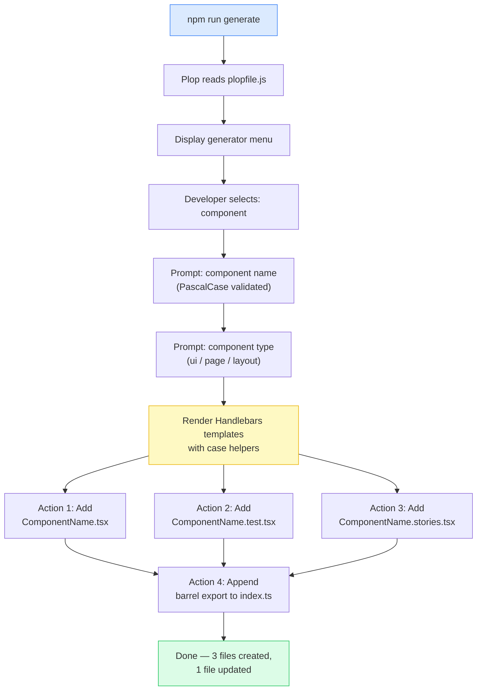

# Scaffolding & Code Generation

Every time a developer creates a new component by duplicating an existing file and doing a find-and-replace on the name, they are doing two things at once: creating a new component and drifting from the team's current conventions. The duplicate they copied may be three months old. The test file structure may have changed since then. The import ordering convention may have been updated. The moment of file creation is when convention drift begins — and it is also the cheapest moment to prevent it.

Code generators solve this by codifying conventions at creation time. A generator is an executable specification of what a new file of a given type should look like, derived from the team's current standards. When conventions change, the generator changes with them. Every file created after that change inherits the updated pattern automatically, without relying on developers to remember the update or find the right file to copy.

Plop and Hygen are the two dominant generator tools in the frontend ecosystem. Plop is config-driven: all generator definitions live in a single `plopfile.js` file that is easy to audit, review, and understand in one read. Hygen is file-based: generators live in a `_templates/` directory as individual files, which scales better for large numbers of generators. For most frontend teams — fewer than ten generator types, fewer than twenty developers — Plop's single-file model is simpler to maintain and easier to onboard.

## Design Thinking

### The value is consistency at creation time

The cost of convention drift compounds over time. A component created six months ago with the old test file structure is not just wrong — it becomes a reference point that new developers copy when they need a similar component. Each copied file propagates the outdated pattern to one more file. Catching convention drift at code review costs reviewer time and author frustration. Catching it in CI costs pipeline time. Catching it at creation time, via a generator, costs nothing beyond the initial investment in writing the generator.

This is the fundamental case for generators: the moment a file is created is the moment when enforcement is free. A generator prompt takes two seconds. A code review comment about file structure takes two minutes per occurrence across the review, author revision, and re-review cycle. At scale — ten developers creating components daily — the saved time is not negligible.

The secondary value is onboarding. A new developer who runs `npm run generate` and gets a correctly structured component file does not need to ask "how are test files organized?" or "do we write stories for every component?" The generator answers those questions implicitly by producing the expected structure.

### Generator maintenance: the silent failure mode

The most dangerous state for a generator is one where it exists but is out of date. Developers trust generators to reflect current conventions. A generator that produces outdated structure is trusted wrongly. The result is a batch of files that conform to last quarter's patterns, created with confidence, merged without scrutiny, and discovered weeks later when a code review catches the inconsistency.

The fix is a process constraint: treat generator templates as source of truth. When a convention changes, the template change is part of the same diff. This is not obvious to teams that think of generators as tooling rather than documentation. Reframing generators as "executable documentation of current conventions" makes the maintenance obligation clear.

Stale generators are also a signal. If a generator has not been touched in six months but the codebase has evolved significantly, it is worth auditing the template against current file patterns. Schedule a quarterly generator review — look at recently created files and compare them to what the generator would produce. Any gap is a maintenance debt.

### Plop vs. Hygen: trade-offs

Both tools produce files from templates and prompts. The architectural difference is in where generator definitions live.

**Plop** consolidates all generators in `plopfile.js`. Every generator — its name, prompts, and actions — is visible in one file. This makes auditing straightforward: a single file review reveals the full picture of what generators exist, what they prompt for, and what they produce. Plop uses Handlebars as its template language, with built-in case helpers (`properCase`, `camelCase`, `kebabCase`) that derive all naming variants from a single input. Plop v4+ uses ESM format (`export default function`).

**Hygen** places each generator in its own subdirectory under `_templates/`. This structure scales better when there are many generators — each generator is a self-contained directory rather than an entry in a growing file. Hygen templates use EJS syntax (embedded JavaScript). The trade-off: discoverability requires navigating a directory tree rather than reading one file.

For most frontend projects, Plop's single-file model wins on simplicity. For platform teams managing twenty or more generators, Hygen's directory structure may be the better fit. The choice should be made once and committed — switching generator tools mid-project is a migration cost that rarely justifies itself.

### When a shell script is enough

Not every generation task warrants Plop or Hygen. A shell script that creates a directory and copies a template file is appropriate when:

- The generator is one-time (project scaffolding, not recurring file creation)
- There are no prompts — the output is always the same
- The team has no plans to evolve the template

When a template needs prompts, case transformations (PascalCase name in file content, kebab-case in the filename), or will be updated as conventions evolve, a proper generator tool pays for itself immediately. The investment in `plopfile.js` is thirty lines of configuration that replaces a script prone to breakage and an informal template file that no one remembers to update.

## Best Practices

**MUST limit generator output to the minimum viable file set and remove any file that developers routinely delete.** The calibration test is: "If we ran this generator today, would a developer delete any generated file before their first commit?" If the answer is yes, that file MUST be removed from the generator. For a React component generator, the minimum viable set is the component file and the test file; story files MUST NOT be included unless the project has an active Storybook with consistent story maintenance, and barrel exports MUST NOT be generated unless the project has a consistently maintained barrel pattern.

**MUST derive all naming variants from a single PascalCase input using Plop's built-in case helpers.** The `properCase` helper produces the component display name and function name; `camelCase` produces test description prefixes; `kebabCase` produces CSS class names and directory names. The Plop prompt MUST validate that the input is PascalCase before any files are written, catching incorrect inputs at entry time with an immediate and actionable error message rather than generating files with inconsistent names.

**MUST expose the generator via a `package.json` script and document it in the project README.** A generator that requires knowing the underlying tool to invoke is a generator that new developers will not discover; wrapping it in a script named `generate` makes it discoverable in the project's script list without knowledge of Plop. The README MUST include a one-line invocation example in the onboarding section so the question "how do I create a new component?" is answered before a new developer needs to ask.

**MUST update generator templates in the same PR as any convention change that affects generated file structure.** Generator templates are executable documentation and MUST be treated as first-class artifacts requiring the same review attention as source code. Code reviewers SHOULD verify that template files are updated whenever convention-changing files — ESLint config, TypeScript config, test utilities — are modified in the same PR. When stale templates are discovered, they MUST be fixed immediately.

**SHOULD use committed generators for file structure and AI assistance for business logic within those generated files, not as a replacement for generators.** AI code generation does not know the project's current conventions and will produce components using outdated import paths, wrong naming conventions, or superseded framework patterns. A committed generator enforces today's conventions regardless of when it was last used; AI assistance SHOULD be applied within the generated skeleton to write the implementation logic that benefits from intelligent suggestion.

## Visual

### Plop Execution Flow

The following diagram shows the full execution flow from `npm run generate` through file creation and barrel export update.



## Example

### Complete Plop Setup: plopfile.js and Handlebars Templates

The following example is a complete, runnable Plop setup for a React component generator. It produces three files per component (`.tsx`, `.test.tsx`, `.stories.tsx`) and appends a barrel export to `src/components/index.ts`.

**`plopfile.js`** (project root, ESM format, Plop v4+)

```js
export default function (plop) {
  plop.setGenerator('component', {
    description: 'Generate a React component with test and story files',
    prompts: [
      {
        type: 'input',
        name: 'name',
        message: 'Component name (PascalCase):',
        validate: (value) => {
          if (/^[A-Z][A-Za-z0-9]+$/.test(value)) return true;
          return 'Component name must be PascalCase (e.g. UserProfile, ButtonGroup)';
        },
      },
      {
        type: 'list',
        name: 'type',
        message: 'Component type:',
        choices: ['ui', 'page', 'layout'],
        default: 'ui',
      },
    ],
    actions: [
      {
        type: 'add',
        path: 'src/components/{{properCase name}}/{{properCase name}}.tsx',
        templateFile: 'plop-templates/component.tsx.hbs',
      },
      {
        type: 'add',
        path: 'src/components/{{properCase name}}/{{properCase name}}.test.tsx',
        templateFile: 'plop-templates/component.test.tsx.hbs',
      },
      {
        type: 'add',
        path: 'src/components/{{properCase name}}/{{properCase name}}.stories.tsx',
        templateFile: 'plop-templates/component.stories.tsx.hbs',
      },
      {
        type: 'append',
        path: 'src/components/index.ts',
        template:
          "export { {{properCase name}} } from './{{properCase name}}/{{properCase name}}';",
      },
    ],
  });
}
```

**`plop-templates/component.tsx.hbs`**

```hbs
import type { FC } from 'react';

interface {{properCase name}}Props {
  children?: React.ReactNode;
}

export const {{properCase name}}: FC<{{properCase name}}Props> = ({ children }) => {
  return (
    <div data-testid="{{kebabCase name}}">
      {children}
    </div>
  );
};
```

**`plop-templates/component.test.tsx.hbs`**

```hbs
import { render, screen } from '@testing-library/react';
import { {{properCase name}} } from './{{properCase name}}';

describe('{{properCase name}}', () => {
  it('renders without crashing', () => {
    render(<{{properCase name}} />);
    expect(screen.getByTestId('{{kebabCase name}}')).toBeInTheDocument();
  });

  it('renders children', () => {
    render(<{{properCase name}}>hello world</{{properCase name}}>);
    expect(screen.getByText('hello world')).toBeInTheDocument();
  });
});
```

**`plop-templates/component.stories.tsx.hbs`**

```hbs
import type { Meta, StoryObj } from '@storybook/react';
import { {{properCase name}} } from './{{properCase name}}';

const meta = {
  title: '{{properCase type}}/{{properCase name}}',
  component: {{properCase name}},
  tags: ['autodocs'],
} satisfies Meta<typeof {{properCase name}}>;

export default meta;
type Story = StoryObj<typeof meta>;

export const Default: Story = {
  args: {},
};
```

**Running the generator:**

```bash
npm run generate
# or
pnpm generate
```

Plop prompts for the component name and type, then writes three files and appends the barrel export. The entire interaction takes about ten seconds. The result is a correctly named, correctly structured component that passes lint on the first commit.

### What Each Part Does

The `plopfile.js` `validate` function on the name prompt catches non-PascalCase input at the prompt stage, before any files are written. The error message includes an example, which is the fastest way to communicate the expected format to a developer unfamiliar with the convention.

The `properCase` helper in action `path` values ensures the output file path uses the canonical PascalCase name regardless of what the developer typed — if the validator is bypassed, the path is still correct. The `kebabCase` helper in the template produces the `data-testid` attribute in the CSS-friendly kebab format, matching the project's attribute convention without requiring the developer to manually derive it.

The `append` action adds the barrel export non-destructively — it appends to the existing `index.ts` rather than replacing it. The format matches whatever pattern the existing file uses (named export, path relative to the `src/components/` root).

## Common Mistakes

### Not documenting the generator

A generator that developers do not know about solves nothing. In established projects, the onboarding documentation is the primary discovery mechanism. If the README does not mention `npm run generate`, new developers will not find it — they will discover an existing component, copy it, and manually edit it, reintroducing the convention drift the generator was built to prevent.

Document the generator in three places:
1. The project README — one sentence in the setup or development section
2. The CONTRIBUTING guide (if it exists) — the convention for creating new files
3. A comment in `plopfile.js` — each generator description string is shown in the Plop menu

The Plop description string is visible when a developer runs `npm run generate` and sees the generator list. A good description — "Generate a React component with test and story files" — communicates what the generator does without requiring the developer to open `plopfile.js`.

## Related FEEs

- [FEE-1600 — Developer Experience & Tooling Overview](./1600.md) — Scaffolding is the creation-time layer of the DX lifecycle; this article covers one step of the broader tooling picture
- [FEE-501 — Component Composition Patterns](../Component%20Architecture%20and%20Patterns/501.md) — Generators enforce the file structure that component composition patterns depend on; the generator template is the executable form of the component structure convention
- [FEE-1102 — Component Testing with Testing Library](../Testing/1102.md) — Generated test files use Testing Library patterns; the test template is the canonical form of the team's test structure

## References

- [Plop.js documentation — Getting Started](https://plopjs.com/documentation/)
- [Plop.js GitHub — v4 ESM format and built-in helpers](https://github.com/plopjs/plop)
- [Hygen documentation — Quick Start](https://www.hygen.io/docs/quick-start)
- [Comparing Plop and Hygen for frontend scaffolding (LogRocket Blog)](https://blog.logrocket.com/hygen-vs-plop-which-is-best-for-your-team/)
- [Handlebars.js template language documentation](https://handlebarsjs.com/guide/)
- [Testing Library — React Testing Library](https://testing-library.com/docs/react-testing-library/intro/)
