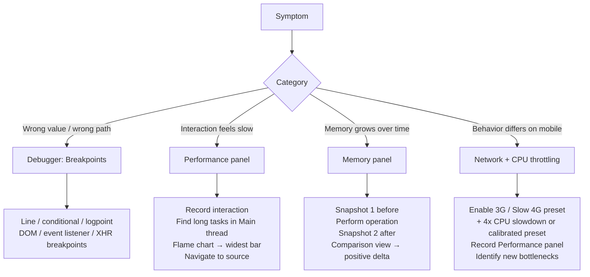

# [FEE-1608] Debugging Workflows & DevTools Profiling

:::info
Debugging is the process of forming a hypothesis about a defect, gathering evidence to test it, and narrowing the evidence until the root cause is located. Most developers spend a disproportionate share of that time in the evidence-gathering phase: adding a `console.log` statement, refreshing the page, reading the output, and adding more statements. Browser DevTools replace that cycle with interactive breakpoints, conditional stops, expression watchers, memory snapshots, and performance flame charts. This article covers breakpoints and their variants, the Performance panel's flame chart workflow, the Memory panel's heap snapshot workflow, and network and CPU throttling for mobile simulation.
:::

## Context

Before DevTools matured, most JavaScript debugging happened through `console.log`: insert a print statement, reload, read the output, and repeat until the failure is isolated. That workflow still works for small, low-frequency problems, but it does not scale well to a problem that depends on execution frequency, such as a value that is only wrong on the hundredth iteration of a loop. Chrome DevTools, and the equivalent panels in Firefox and Safari, close that gap with three purpose-built tools: a debugger for logic errors, a Performance panel for timing errors, and a Memory panel for allocation errors.

Debuggers, the Performance panel, and the Memory panel answer different classes of question. Which one to open first depends on the symptom. A debugger finds logic errors, for instance a loop condition that should become true on the hundredth iteration but never does. The Performance panel finds timing errors: a function that takes 200ms when it should take 20, or a task long enough to block the next input from being handled. The Memory panel finds allocation errors, for example event listeners that accumulate because a component never removes them.

Network throttling extends the same idea to the network layer. Application behavior on a fast local connection often differs from behavior on a throttled mobile connection, and DevTools throttling simulates that gap without leaving the development environment, making it possible to reproduce and diagnose behavior that only manifests for users on slower connections.

## Visual



## Example

```typescript
// Example: diagnosing a slow list filter with the Performance panel.
// This function is the hypothesized bottleneck — but the flame chart
// may reveal the actual cost is in a different place.

// BEFORE profiling: naive filter + re-render on every keystroke
function handleSearchInput(query: string): void {
  // If profiling shows this is the hot path, consider:
  // 1. Debouncing the input event
  // 2. Moving filtering to a Web Worker for large lists
  // 3. Using a virtualized list to reduce DOM nodes rendered
  const filtered = allItems.filter(
    (item) =>
      item.name.toLowerCase().includes(query.toLowerCase()) ||
      item.description.toLowerCase().includes(query.toLowerCase()),
  );
  renderList(filtered);
}

// Recommended debugging workflow for the above:
// 1. Open DevTools → Performance panel
// 2. Click record
// 3. Type a character in the search input
// 4. Stop recording
// 5. In the Main thread row, find the long task triggered by 'keydown'
// 6. Expand the task in the flame chart
// 7. Look for the widest bar in the call stack (may not be handleSearchInput)
// 8. Check Bottom-Up view sorted by Self Time to find the true hot function
//
// Common findings:
// - The toLowerCase() + includes() loop is measurably slow on 10k+ items
// - The renderList() DOM diffing is slower than the filter itself
// - A third-party analytics event fires synchronously on every keydown
```

## Best Practices

**SHOULD** begin debugging with a specific hypothesis about the root cause rather than adding exploratory `console.log` statements. The hypothesis determines which DevTools panel and breakpoint type is appropriate; exploratory logging produces large, unstructured output that slows the feedback loop.

**SHOULD** set a conditional breakpoint rather than a line breakpoint when
the code path being debugged executes frequently and the condition of interest
is rare. Pausing manually on every iteration of a loop is a significant time
cost that conditional breakpoints eliminate.

**SHOULD** use logpoints as a replacement for `console.log` debugging. Logpoints
do not modify source code, are not accidentally committed, and can be set
and cleared without reloading the page.

**MUST** record a Performance panel profile before optimizing any code that
is perceived as slow. The flame chart frequently reveals that the performance
problem is in a different part of the call stack than expected. Optimizing
the wrong function wastes time without improving the perceived slowness.

**SHOULD** take two heap snapshots in sequence, one before and one after the
suspected leaking operation, and use the Comparison view to identify objects
with a positive delta whose count should not grow. Do not diagnose memory
leaks from a single snapshot.

**SHOULD** run the Performance panel with both network throttling (3G or
Slow 4G) and CPU throttling (a 4x slowdown, or a calibrated mid-tier mobile
preset) to simulate the experience of a real mobile user before releasing
any performance-sensitive feature.

**MUST NOT** use a logpoint or conditional breakpoint expression to print
secrets, auth tokens, or other sensitive data during a screen-shared or
recorded debugging session. Logpoints never enter source control; they live
only in the DevTools session. Their console output is still visible to
anyone watching the screen or reviewing a session recording, so treat it
with the same care as a `console.log` that prints the same value.

## Deep Dive

### Breakpoints: types and when to use each

Line breakpoints are the most familiar type. Set by clicking a line number
in the Sources panel, they pause execution when that line is about to run.
Line breakpoints are effective when the approximate location of the problem
is known. For problems with an unknown location, such as an unexpected state
change or an event firing at the wrong time, they require many breakpoints
spread across candidate locations.

Conditional breakpoints extend line breakpoints with a JavaScript expression.
The debugger only pauses when the expression evaluates to truthy. Setting a
conditional breakpoint on a function called in a loop with the condition
`index === 99` pauses only on the hundredth iteration, skipping 99 pauses
that would require manual continuation. Conditional breakpoints are set by
right-clicking a line number and selecting "Add conditional breakpoint".

Logpoints are non-pausing breakpoints that print an expression to the console.
They are set by right-clicking a line number and selecting "Add logpoint".
A logpoint `'user:', user.id, 'action:', action.type` prints the values of
those expressions at that line without modifying source code and without
stopping execution. Logpoints replace `console.log` in the most common use
case, adding a log statement to see a value, without the risk of accidentally
committing a debug log. Because a logpoint lives only in the DevTools session
and never touches a file on disk, it cannot appear in a diff, a commit, or a
code review.

DOM breakpoints pause execution when the DOM is mutated in a specified way.
Right-clicking a DOM node in the Elements panel and selecting "Break on"
offers three types: subtree modifications (child nodes added or removed),
attribute modifications (attributes changed), and node removal. DOM breakpoints
are effective for tracing which JavaScript code is modifying the DOM in a way
that produces an unexpected visual result.

Event listener breakpoints pause on all events of a given type across the
entire page. In the Sources panel under the "Event Listener Breakpoints"
section, enabling "Mouse → click" pauses on every click event handler across
all attached listeners. This is useful for tracing which code handles a user
interaction when the call origin is not known.

XHR/Fetch breakpoints pause when a network request URL matches a pattern.
In the Sources panel, the "XHR/Fetch Breakpoints" section allows adding URL
patterns. The debugger pauses when a fetch or XHR is initiated with a matching
URL, exposing the call stack at the point where the request was made. This
is useful for tracing which code path triggers an unexpected API call.

Stepping controls are the base operations for working inside a paused
breakpoint. "Step Into" enters the function called on the current line.
"Step Over" executes the current line without entering any function it calls.
"Step Out" finishes the current function and returns to its caller; once a
function is confirmed not to be the problem, "Step Out" is faster than
repeatedly pressing "Step Over" through the rest of its body. Clicking a
specific frame in the Call Stack panel jumps directly to that frame's
execution context instead of stepping through to reach it, and the Scope
panel updates to show every variable visible at that frame, which is the
fastest way to inspect how state moved across a function boundary.

### Performance panel: flame chart workflow

The flame chart is the primary visualization in the Performance panel. It
represents time on the horizontal axis and call stack depth on the vertical
axis. Each colored bar is a function call; the bar width represents the
function's self time plus the time spent in all its callees. Long horizontal
bars at the top of a call stack represent functions that take a long time
to return, often because they call many sub-functions that together consume
significant time.

The workflow for diagnosing a slow interaction is: perform the interaction
inside a recording, identify the long tasks in the Main thread row, click the
task to expand it, find the widest bar in the call stack, and navigate to
the source location. The widest bar identifies the function consuming the
most time at that position in the stack. That function is often buried a few
levels deep inside a top-level handler whose own total duration looks
unremarkable.

The "Total time" and "Self time" columns in the Bottom-Up view distinguish
between time spent in a function and time attributed to its callees. A function
with high total time but low self time is a coordinator: it calls other
functions that do the actual work. A function with high self time is doing
direct work that is potentially optimizable. The Bottom-Up view, sorted by
self time descending, surfaces the most expensive self-cost functions across
the recording.

The Activity tab and Call Tree tab offer alternative aggregations. The Call
Tree shows a tree of the call stack from the root to leaves, useful for
understanding the full path from event dispatch to expensive work. The Activity
tab groups all function calls by category (scripting, rendering, painting) and
shows the total time in each category, giving a high-level view of where time
is spent across the recording.

Long tasks in the Main thread row are tasks that exceed 50ms. Chrome DevTools
renders them with a red triangle in the corner to indicate they block the main
thread long enough to cause perceptible input latency. For INP (Interaction
to Next Paint, the Core Web Vital for input responsiveness) optimization,
the goal is to break these tasks into smaller pieces or move work off the
main thread entirely. The Performance panel does not prescribe the fix, but
it identifies where to look.

User Timing marks add application-defined annotations to the flame chart.
Calling `performance.mark('start')` and `performance.mark('end')` around a
code path under investigation places two point markers on the timeline, but
a mark alone does not produce an interval. Calling
`performance.measure('search-filter', 'start', 'end')` after the two marks
creates the labeled span that appears in the Performance panel's Timings
row, with its width proportional to the duration between the marks, which
keeps the analysis focused on a specific business operation instead of the
surrounding framework activity.
This is useful when profiling a React or Vue update cycle: reconciliation
logic produces many bars in the flame chart on its own, and a User Timing
mark isolates the application code from that framework overhead.

### Memory panel: heap snapshot workflow

A heap snapshot captures the entire JavaScript object graph at a point in
time: every object in memory, its size, its references to other objects, and
its references from other objects (retainers). The snapshot is a static view;
it does not show allocation events over time. Two snapshots compared using
the "Comparison" view reveal objects that were created between the two snapshots
and have not been garbage collected.

The comparison view is the primary workflow for diagnosing memory leaks. The
pattern is: take a snapshot (Snapshot 1), perform the suspected leaking
operation, take another snapshot (Snapshot 2), select Snapshot 2, and switch
to "Comparison" view against Snapshot 1. The Delta column shows the net count
of new objects by constructor name. A positive delta in a class that should
not grow, such as `EventListener`, `IntersectionObserver`, or `WebSocket`,
indicates objects from that class are being created without being released.
Repeating the suspected leaking operation a fixed, distinctive number of
times before the second snapshot, for example exactly seven times, makes a
real leak easier to separate from normal allocation noise: an object count
that lands on or near a multiple of seven in the Delta column is a strong
signal, where a single-repetition comparison can leave the count ambiguous.

The "Retained size" column in the Summary view shows how much total memory
would be freed if an object were garbage collected, including all objects it
exclusively retains. A small object with a large retained size is retaining
a large object tree; that object is the "retainer root" that prevents garbage
collection of everything it holds. Finding and releasing the retainer root
frees the entire retained tree.

Detached DOM nodes are a common memory leak category in single-page
applications. A detached DOM node is a node that has been removed from the
document but is still referenced by JavaScript. It cannot be garbage collected
because the JavaScript reference prevents it. In the heap snapshot, filtering
for "Detached" in the filter box surfaces all detached DOM nodes and their
retaining paths: the JavaScript objects that hold references to them.

The Allocation timeline is a separate Memory panel view that records object
allocation over time rather than a static snapshot. It shows which function
allocated an object, when the allocation happened, and which allocations are
still unreleased at the end of the recording. For a high-frequency allocation
problem, such as many short-lived objects allocated on every frame, the
Allocation timeline is more useful than snapshot comparison because it also
captures objects that were created and already collected between two
snapshots. Those objects never show up in a Delta column, but the allocation
pressure they cause can still trigger the garbage collection pauses that show
up as "Minor GC" or "Major GC" events in the Performance panel flame chart.

### Network throttling for mobile simulation

The Network panel's throttling dropdown offers three connection presets,
"Fast 4G", "Slow 4G", and "3G", plus an "Offline" option. Chrome DevTools
renamed these presets in Chrome 127 (2024) to match Lighthouse's naming: the
old "Fast 3G" preset became "Slow 4G", and the old "Slow 3G" preset became
"3G". The applied values are:

- **Fast 4G**: 165ms round-trip time (RTT), roughly 9Mbps download
- **Slow 4G** (formerly "Fast 3G"): 562.5ms RTT, roughly 1.6Mbps download / 750Kbps upload
- **3G** (formerly "Slow 3G"): 2,000ms RTT, 400Kbps download and upload

These presets affect all network requests made by the page, including API
calls, asset requests, and third-party scripts.

Throttling reveals several categories of problems invisible on fast local
networks: assets that are large enough to block rendering on slow connections,
API call waterfalls that are tolerable at 5ms per request but severe at
2 seconds per request under the "3G" preset, and loading state UI that
flashes so briefly on a fast connection that it appears broken on slow
connections.

The Performance panel can run under network throttling at the same time as
CPU throttling. CPU throttling applies a multiplier to slow down JavaScript
execution. Lighthouse's default is a fixed 4x slowdown, which its own
documentation describes as moving a typical run from the high-end desktop
bracket into the mid-tier mobile bracket. Chrome DevTools now also offers
calibrated CPU throttling: clicking "Calibrate" in Settings → Throttling
measures the page's actual performance on low-tier and mid-tier mobile rates
using the current machine, and builds a "low-tier mobile" / "mid-tier mobile"
preset from that measurement. A calibrated preset is more accurate than a
fixed multiplier because it accounts for the tester's own hardware. Running
the Performance panel with both network and CPU throttling active simulates
a mobile user on a congested network; the combination reveals performance
problems that stay invisible when either throttle is tested alone.

Custom throttling profiles can be added in the Network panel's throttling
dropdown under "Add custom profile". A custom profile for a specific use
case (for example, the typical connection speed of users in a specific
geographic market) can be saved and reused across sessions, making it easy
to test against a reproducible baseline.

Network and CPU throttling only cover timing. DevTools' Device Toolbar adds
the other half of mobile simulation: it emulates a target screen size and
substitutes touch events for mouse events. UI interactions that depend on
pointer position, such as hover effects or drag operations, can hide problems
that only appear under touch input, and testing in Device Toolbar mode
surfaces those before they reach a real device. Combining network and CPU
throttling with Device Toolbar mode is the closest desktop approximation of
a real mobile user, but it does not fully replace testing on physical
hardware: GPU rendering pipelines and garbage collection behavior under real
memory pressure are only reliably reproduced on the actual device.

## Common Mistakes

- Using `console.log` exclusively when logpoints and conditional breakpoints
  would be faster and produce no source code modifications.
- Opening the Performance panel and recording an entire page load when the
  problem is a specific interaction: long recordings produce large traces
  that are hard to navigate, so record only the specific interaction instead.
- Diagnosing memory leaks from a single heap snapshot: a single snapshot
  shows the current heap but cannot distinguish between expected memory and
  a leak, so only the Comparison view between two snapshots reveals net growth.
- Profiling with DevTools open and CPU throttling off: DevTools itself has
  performance overhead, so for accurate measurements enable CPU throttling
  to simulate real hardware.
- Testing performance only on the development machine: DevTools and
  Lighthouse model a mid-tier phone as roughly a 4x CPU slowdown from a
  high-end desktop, so validate with CPU throttling, or a calibrated mobile
  preset, before shipping performance-sensitive features.
- Not using the "Coverage" tab before optimizing bundle size: the Coverage
  tab shows which JavaScript was executed during a recording, revealing
  unused code that can be split into separate chunks.

## Related Topics

- [FEE-1403: Logging & Structured Logging](/en/Observability%20and%20Error%20Tracking/1403)
- [FEE-1404: Performance Monitoring & Tracing](/en/Observability%20and%20Error%20Tracking/1404)
- [FEE-1609: Local Development Environment Setup](/en/Developer%20Experience%20and%20Tooling/1609)

## References

- Chrome DevTools team, "Breakpoints in Sources panel," Chrome for Developers. https://developer.chrome.com/docs/devtools/javascript/breakpoints/
- Chrome DevTools team, "Performance panel," Chrome for Developers. https://developer.chrome.com/docs/devtools/performance/
- Chrome DevTools team, "Fix memory problems," Chrome for Developers. https://developer.chrome.com/docs/devtools/memory-problems/
- web.dev, "Manually diagnose slow interactions in the lab," web.dev. https://web.dev/articles/manually-diagnose-slow-interactions-in-the-lab
- Chrome DevTools team, "Network features reference: Throttling," Chrome for Developers. https://developer.chrome.com/docs/devtools/network/reference/#throttling
- Chrome DevTools team, "Simulate mobile devices, network throttling, and CPU throttling," Chrome for Developers. https://developer.chrome.com/docs/devtools/settings/throttling
- Chrome DevTools team, "What's new in DevTools, Chrome 127," Chrome for Developers (2024). https://developer.chrome.com/blog/new-in-devtools-127
- Google Chrome Lighthouse team, "Throttling," GoogleChrome/lighthouse, GitHub. https://github.com/GoogleChrome/lighthouse/blob/main/docs/throttling.md
- DebugBear, "Network Throttling in Chrome DevTools," debugbear.com. https://www.debugbear.com/blog/chrome-devtools-network-throttling
- Nolan Lawson, "Fixing memory leaks in web applications," Read the Tea Leaves (2020). https://nolanlawson.com/2020/02/19/fixing-memory-leaks-in-web-applications/
- web.dev, "User Timing API," web.dev. https://web.dev/usertiming/
- Mozilla, "Debugger," Firefox Source Docs. https://firefox-source-docs.mozilla.org/devtools-user/debugger/index.html
