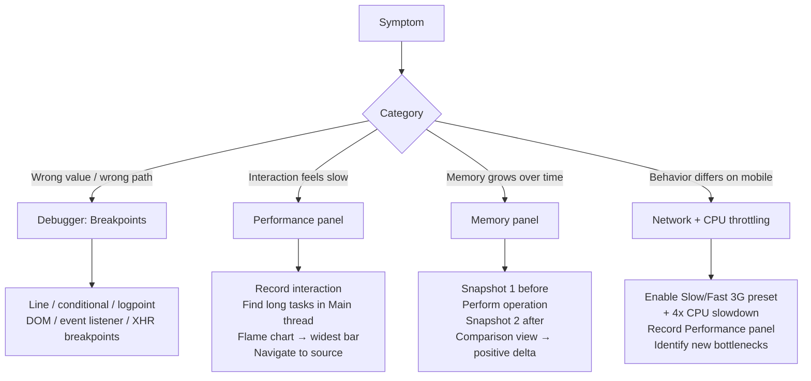

# Debugging Workflows & DevTools Profiling

Debugging is the process of forming a hypothesis about a defect, gathering
evidence to test it, and narrowing the evidence until the root cause is
located. Most developers spend a disproportionate amount of debugging time
in the evidence-gathering phase — adding `console.log` statements, refreshing,
reading output, adding more statements. The browser's DevTools provide a
substantially more powerful alternative: interactive breakpoints, conditional
stops, expression watchers, memory snapshots, and detailed performance flame
charts. The tooling cost is learning the workflow; the productivity return
is eliminating most log-and-refresh cycles.

The Performance panel and Memory panel represent a separate class of tooling
from debuggers. Debuggers help find logic errors — incorrect values, missing
conditions, unexpected code paths. The Performance panel helps find timing
errors — slow functions, long tasks, rendering bottlenecks. The Memory panel
helps find allocation errors — object accumulation, detached DOM trees, closure
leaks. These tools answer different questions, and the choice of which tool to
open first depends on the symptom, not a preference for one tool over another.

Network throttling is the bridge between developer environments and real-world
conditions. Application behavior on a fast local network frequently differs
from behavior on a 4G mobile connection with 150ms latency and 10Mbps
throughput. Throttling in DevTools simulates these conditions without leaving
the development environment, making it possible to reproduce and diagnose
behavior that only manifests for users on slower connections.

This article covers breakpoints and their variants, the Performance panel
flame chart workflow, the Memory panel heap snapshot workflow, and network
throttling for mobile simulation.

## Design Thinking

### Breakpoints: types and when to use each

Line breakpoints are the most familiar type. Set by clicking a line number
in the Sources panel, they pause execution when that line is about to run.
Line breakpoints are effective when the approximate location of the problem
is known. For problems with unknown location — an unexpected state change,
an event firing at the wrong time — they require many breakpoints spread
across candidate locations.

Conditional breakpoints extend line breakpoints with a JavaScript expression.
The debugger only pauses when the expression evaluates to truthy. Setting a
conditional breakpoint on a function called in a loop with the condition
`index === 99` pauses only on the hundredth iteration, skipping 99 pauses
that would require manual continuation. Conditional breakpoints are set by
right-clicking a line number and selecting "Add conditional breakpoint".

Logpoints are non-pausing breakpoints that print an expression to the console.
They are set by right-clicking a line number and selecting "Add logpoint".
A logpoint `'user:', user.id, 'action:', action.type` prints the values of
those expressions at that line without modifying source code and without
stopping execution. Logpoints replace `console.log` in the most common use
case — adding a log statement to see a value — without the risk of
accidentally committing a debug log.

DOM breakpoints pause execution when the DOM is mutated in a specified way.
Right-clicking a DOM node in the Elements panel and selecting "Break on"
offers three types: subtree modifications (child nodes added or removed),
attribute modifications (attributes changed), and node removal. DOM breakpoints
are effective for tracing which JavaScript code is modifying the DOM in a way
that produces an unexpected visual result.

Event listener breakpoints pause on all events of a given type across the
entire page. In the Sources panel under the "Event Listener Breakpoints"
section, enabling "Mouse → click" pauses on every click event handler across
all attached listeners. This is useful for tracing which code handles a user
interaction when the call origin is not known.

XHR/Fetch breakpoints pause when a network request URL matches a pattern.
In the Sources panel, the "XHR/Fetch Breakpoints" section allows adding URL
patterns. The debugger pauses when a fetch or XHR is initiated with a matching
URL, exposing the call stack at the point where the request was made. This
is useful for tracing which code path triggers an unexpected API call.

### Performance panel: flame chart workflow

The flame chart is the primary visualization in the Performance panel. It
represents time on the horizontal axis and call stack depth on the vertical
axis. Each colored bar is a function call; the bar width represents the
function's self time plus the time spent in all its callees. Long horizontal
bars at the top of a call stack represent functions that take a long time
to return, often because they call many sub-functions that together consume
significant time.

The workflow for diagnosing a slow interaction is: perform the interaction
inside a recording, identify the long tasks in the Main thread row, click the
task to expand it, find the widest bar in the call stack, and navigate to
the source location. The widest bar is the function consuming the most time
relative to its position in the stack — not necessarily the top-level function
with the longest total duration, but the specific function inside the stack
where time is actually spent.

The "Total time" and "Self time" columns in the Bottom-Up view distinguish
between time spent in a function and time attributed to its callees. A function
with high total time but low self time is a coordinator — it calls other
functions that do the actual work. A function with high self time is doing
direct work that is potentially optimizable. The Bottom-Up view, sorted by
self time descending, surfaces the most expensive self-cost functions across
the recording.

The Activity tab and Call Tree tab offer alternative aggregations. The Call
Tree shows a tree of the call stack from the root to leaves, useful for
understanding the full path from event dispatch to expensive work. The Activity
tab groups all function calls by category (scripting, rendering, painting) and
shows the total time in each category, giving a high-level view of where time
is spent across the recording.

Long tasks in the Main thread row are tasks that exceed 50ms. Chrome DevTools
renders them with a red triangle in the corner to indicate they block the main
thread long enough to cause perceptible input latency. For INP optimization,
the goal is to break these tasks into smaller pieces or move work off the
main thread entirely. The Performance panel does not prescribe the fix, but
it identifies where to look.

### Memory panel: heap snapshot workflow

A heap snapshot captures the entire JavaScript object graph at a point in
time: every object in memory, its size, its references to other objects, and
its references from other objects (retainers). The snapshot is a static view;
it does not show allocation events over time. Two snapshots compared using
the "Comparison" view reveal objects that were created between the two snapshots
and have not been garbage collected.

The comparison view is the primary workflow for diagnosing memory leaks. The
pattern is: take a snapshot (Snapshot 1), perform the suspected leaking
operation, take another snapshot (Snapshot 2), select Snapshot 2, and switch
to "Comparison" view against Snapshot 1. The Delta column shows the net count
of new objects by constructor name. A positive delta in a class that should
not grow — `EventListener`, `IntersectionObserver`, `WebSocket` — indicates
objects from that class are being created without being released.

The "Retained size" column in the Summary view shows how much total memory
would be freed if an object were garbage collected, including all objects it
exclusively retains. A small object with a large retained size is retaining
a large object tree — it is the "retainer root" that prevents garbage
collection of everything it holds. Finding and releasing the retainer root
frees the entire retained tree.

Detached DOM nodes are a common memory leak category in single-page
applications. A detached DOM node is a node that has been removed from the
document but is still referenced by JavaScript. It cannot be garbage collected
because the JavaScript reference prevents it. In the heap snapshot, filtering
for "Detached" in the filter box surfaces all detached DOM nodes and their
retaining paths — the JavaScript objects that hold references to them.

### Network throttling for mobile simulation

The Network panel's throttling presets — "Slow 3G", "Fast 3G", "4G" —
simulate bandwidth and latency conditions of mobile networks. "Slow 3G"
applies approximately 400ms RTT and 400Kbps throughput. "Fast 3G" applies
approximately 100ms RTT and 1.5Mbps throughput. These presets affect all
network requests made by the page, including API calls, asset requests, and
third-party scripts.

Throttling reveals several categories of problems invisible on fast local
networks: assets that are large enough to block rendering on slow connections,
API call waterfalls that are tolerable at 5ms per request but severe at 100ms
per request, and loading state UI that flashes so briefly on a fast connection
that it appears broken on slow connections.

The Performance panel can be run under network throttling simultaneously by
enabling CPU throttling in addition to network throttling. CPU throttling
applies a multiplier to slow down JavaScript execution: a 4x CPU slowdown
simulates the performance of a mid-range Android device. Running the
Performance panel with both network and CPU throttling active simulates
the complete environment of a real mobile user on a congested network —
the combination often reveals performance problems that are invisible in
either isolation.

Custom throttling profiles can be added in the Network panel's throttling
dropdown under "Add custom profile". A custom profile for a specific use
case — for example, the typical connection speed of users in a specific
geographic market — can be saved and reused across sessions, making it
easy to test against a reproducible baseline.

## Best Practices

**SHOULD** begin debugging with a specific hypothesis about the root cause rather than adding exploratory `console.log` statements. The hypothesis determines which DevTools panel and breakpoint type is appropriate; exploratory logging produces large, unstructured output that slows the feedback loop.

**SHOULD** set a conditional breakpoint rather than a line breakpoint when
the code path being debugged executes frequently and the condition of interest
is rare. Pausing manually on every iteration of a loop is a significant time
cost that conditional breakpoints eliminate.

**SHOULD** use logpoints as a replacement for `console.log` debugging. Logpoints
do not modify source code, are not accidentally committed, and can be set
and cleared without reloading the page.

**MUST** record a Performance panel profile before optimizing any code that
is perceived as slow. The flame chart frequently reveals that the performance
problem is in a different part of the call stack than expected — optimizing
the wrong function wastes time without improving the perceived slowness.

**SHOULD** take two heap snapshots in sequence — before and after the suspected
leaking operation — and use the Comparison view to identify objects with a
positive delta whose count should not grow. Do not diagnose memory leaks from
a single snapshot.

**SHOULD** run the Performance panel with both network throttling (Fast 3G or
similar) and CPU throttling (4x slowdown) to simulate the experience of a real
mobile user before releasing any performance-sensitive feature.

**MUST NOT** commit logpoints or conditional breakpoints to source control.
Logpoints that print sensitive data in browser DevTools may expose it to
developers with access to the repository history.

## Visual



## Example

```typescript
// Example: diagnosing a slow list filter with the Performance panel.
// This function is the hypothesized bottleneck — but the flame chart
// may reveal the actual cost is in a different place.

// BEFORE profiling: naive filter + re-render on every keystroke
function handleSearchInput(query: string): void {
  // If profiling shows this is the hot path, consider:
  // 1. Debouncing the input event
  // 2. Moving filtering to a Web Worker for large lists
  // 3. Using a virtualized list to reduce DOM nodes rendered
  const filtered = allItems.filter(
    (item) =>
      item.name.toLowerCase().includes(query.toLowerCase()) ||
      item.description.toLowerCase().includes(query.toLowerCase()),
  );
  renderList(filtered);
}

// Recommended debugging workflow for the above:
// 1. Open DevTools → Performance panel
// 2. Click record
// 3. Type a character in the search input
// 4. Stop recording
// 5. In the Main thread row, find the long task triggered by 'keydown'
// 6. Expand the task in the flame chart
// 7. Look for the widest bar in the call stack (may not be handleSearchInput)
// 8. Check Bottom-Up view sorted by Self Time to find the true hot function
//
// Common findings:
// - The toLowerCase() + includes() loop is measurably slow on 10k+ items
// - The renderList() DOM diffing is slower than the filter itself
// - A third-party analytics event fires synchronously on every keydown
```

## Common Mistakes

- Using `console.log` exclusively when logpoints and conditional breakpoints
  would be faster and produce no source code modifications
- Opening the Performance panel and recording an entire page load when the
  problem is a specific interaction — long recordings produce large traces
  that are hard to navigate; record only the specific interaction
- Diagnosing memory leaks from a single heap snapshot — single snapshots
  show the current heap but cannot distinguish between expected memory and
  a leak; only the Comparison view between two snapshots reveals net growth
- Profiling with DevTools open and CPU throttling off — DevTools has its
  own performance overhead; for accurate performance measurements, enable
  CPU throttling to account for the overhead and simulate real hardware
- Testing performance only on the development machine — a 2023 MacBook Pro
  is 5–10x faster than a mid-range Android phone; always validate with
  CPU throttling before shipping performance-sensitive features
- Not using the "Coverage" tab before optimizing bundle size — the Coverage
  tab shows which JavaScript was executed during a recording, revealing
  unused code that can be split into separate chunks

## Related FEEs

- FEE-1403: Error Tracking & Source Maps
- FEE-1404: Performance Monitoring & Tracing
- FEE-1609: Local Development Environment Setup

## References

- [Chrome DevTools: Breakpoints documentation](https://developer.chrome.com/docs/devtools/javascript/breakpoints/)
- [Chrome DevTools: Performance panel](https://developer.chrome.com/docs/devtools/performance/)
- [Chrome DevTools: Memory panel](https://developer.chrome.com/docs/devtools/memory-problems/)
- [web.dev: Diagnose slow interactions in the lab](https://web.dev/diagnose-slow-interactions-in-the-lab/)
- [Chrome DevTools: Network throttling](https://developer.chrome.com/docs/devtools/network/reference/#throttling)
- [Firefox Developer Tools: Debugger](https://firefox-source-docs.mozilla.org/devtools-user/debugger/index.html)
