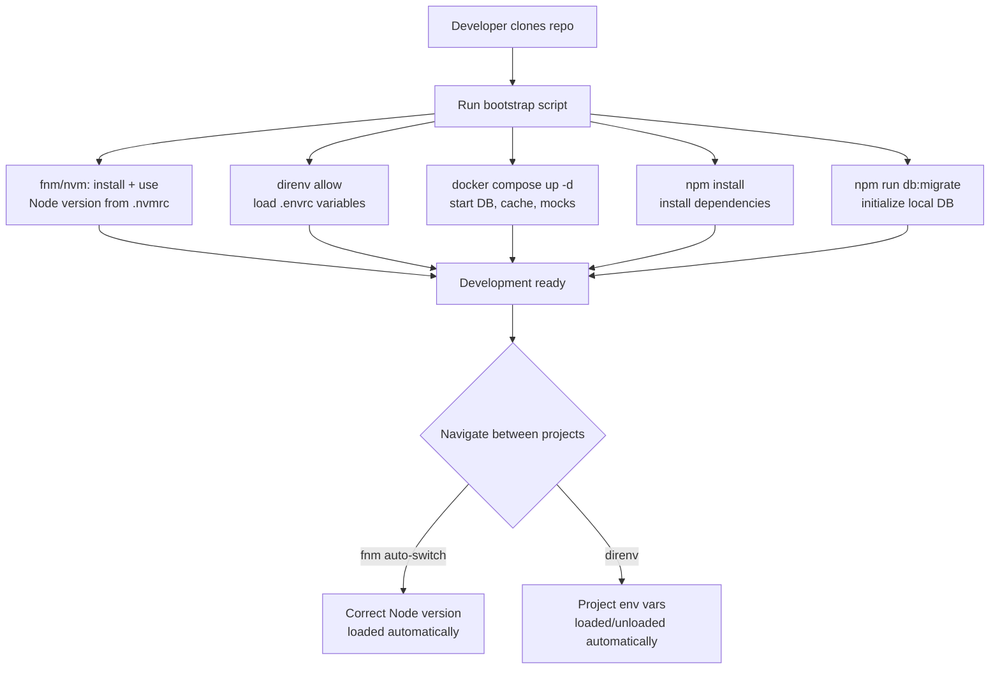

# Local Development Environment Setup

The local development environment is the context in which every line of
application code is first written. It determines how fast developers
iterate, how closely development behavior matches production, and how
long it takes a new team member to become productive. Environments that
work well are invisible — they get out of the way and let developers focus
on the problem. Environments that work poorly impose a constant tax: version
conflicts, environment-specific bugs, setup steps that only work on one
person's machine, and onboarding sessions that span multiple days.

The reproducibility of a local environment is its most important property.
An environment is reproducible if any developer, on any supported machine,
can follow a defined setup procedure and arrive at an environment that
behaves identically to all other developers' environments and to the CI
environment. Reproducibility is not a goal that is achieved once — it is
a property that must be maintained as dependencies change, tooling evolves,
and the team grows.

Most environment inconsistencies in frontend development trace to three
sources: different versions of Node.js across developers, different
environment variables that are assumed to be present but not consistently
defined, and local services (databases, message queues, third-party API
mocks) that are configured differently on different machines. Each of these
has a standard solution: Node version managers for runtime pinning, `direnv`
for per-project environment variable injection, and Docker Compose for
local service orchestration.

This article covers `nvm` and `fnm` for Node version management, `direnv`
for per-project environment variable injection, Docker-based local services,
and practices for making onboarding reproducible.

## Principle

The Node.js version used in development MUST be pinned to the same version
used in CI and production, and MUST be committed to the repository so all
developers use the same version automatically. Per-project environment
variables SHOULD be managed with `direnv` and an `.envrc` file committed
to the repository, with secrets sourced from a secrets manager rather than
committed in plain text. Local services SHOULD be orchestrated with Docker
Compose to eliminate manual installation steps and ensure service versions
match the production configuration. Onboarding MUST be automatable to a
single command or a linear sequence of commands that a new developer can
follow without asking for help.

## Design Thinking

### Node version management: nvm and fnm

Node.js has no stable LTS indefinitely — major versions transition through
active support, maintenance, and end-of-life. A frontend project started
on Node 18 that runs CI on Node 20 while developers have Node 16 installed
locally will produce inconsistent behavior in package resolution, crypto
APIs, and test results. The inconsistency may not produce obvious errors —
subtly different behavior between Node versions is common in areas like
timers, process signal handling, and native module bindings.

`nvm` (Node Version Manager) is the established tool for managing multiple
Node.js installations on a single machine. `nvm use` reads the `.nvmrc` file
in the current directory and switches to the specified version, installing
it if not present. The `.nvmrc` file contains a single version string:
`20.11.0` or `lts/iron`. Committing `.nvmrc` to the repository ensures all
developers use the same version.

`fnm` (Fast Node Manager) is a newer alternative written in Rust, with
significantly faster version switching (under 1 second versus several seconds
for nvm). `fnm` supports automatic version switching: with `fnm env --use-on-cd`
added to the shell profile, `fnm` reads `.node-version` or `.nvmrc` on every
directory change and switches Node versions without requiring a manual
`fnm use` command. Automatic switching is the highest-fidelity guarantee
that the correct Node version is active — it removes the possibility of
forgetting to switch after pulling changes that update the version pin.

The `.nvmrc` file should specify a full patch version (`20.11.0`) rather than
a major or minor version alias (`20` or `20.x`). Aliases resolve to different
patch versions over time as new releases are published, reintroducing version
drift. Pinning to a full patch version ensures that all developers and CI
use exactly the same binary, including the same V8 version and any
version-specific package resolution behavior.

Updating the Node version is a deliberate act: bump the version in `.nvmrc`,
update the CI configuration to match, test the upgrade, and communicate the
change to the team. All three — `.nvmrc`, CI, and production runtime — must
be updated together. A version that works in CI but is not yet in `.nvmrc`
will produce version skew the next time a developer switches to the project.

### direnv: per-project environment variable injection

Environment variables are a standard mechanism for configuration that changes
between environments — local, staging, and production. The challenge in local
development is that different projects require different variable values, and
a developer working on multiple projects simultaneously needs each project to
have its own variable context without manual switching.

`direnv` is a shell extension that hooks into the `cd` command (or any
directory traversal) and loads or unloads environment variables based on
an `.envrc` file in the current directory. When a developer navigates into
a project directory, the variables in `.envrc` are injected into the shell
session. When they navigate out, the variables are removed. This is automatic
and project-scoped.

The `.envrc` file is committed to the repository with non-secret values — API
base URLs, feature flag defaults, service hostnames pointing to local Docker
services. Secret values — API keys for third-party services, database
credentials for staging environments — MUST NOT be committed. Instead,
`.envrc` sources secrets from a secrets manager or from a gitignored
`.envrc.local` file that each developer creates locally from a committed
template (`.envrc.local.example`).

`direnv allow` is required the first time `.envrc` is used in a directory
and whenever `.envrc` changes. This explicit approval step prevents
automatically executing arbitrary code from a new repository that was just
cloned. The trust model is that a developer reviews the `.envrc` before
approving it — the same way they would review other configuration files.

A common pattern is `.envrc` + `.envrc.local`:

```
# .envrc (committed)
source_env_if_exists .envrc.local
export API_BASE_URL=http://localhost:3001
export FEATURE_FLAGS_KEY=local-dev-key
export DB_HOST=localhost
export DB_PORT=5432

# .envrc.local (gitignored, created by each developer)
export THIRD_PARTY_API_KEY=<developer's personal key>
export STAGING_DB_PASSWORD=<developer's personal staging credential>
```

### Docker-based local services

Applications that depend on databases, message queues, caches, or third-party
API mocks need those services to be running locally for development. Manual
installation of services — installing PostgreSQL, Redis, and RabbitMQ via
Homebrew and managing their versions separately — produces brittle environments:
service versions drift from production, startup commands differ between
developers, and services conflict with each other or with system services
on the same ports.

Docker Compose eliminates this by defining all services in a declarative
`docker-compose.yml` file. Running `docker compose up -d` starts all services
in the correct versions, on the configured ports, with the correct initial
configuration. Running `docker compose down` stops them. The configuration
is committed to the repository, so all developers use the same service versions
and the same port mappings.

Service versions in `docker-compose.yml` should be pinned to the same major
version used in production. A local PostgreSQL 15 environment testing code
that runs against PostgreSQL 16 in production may pass all local tests while
a production-only query plan difference causes a performance regression. Pinning
to the production major version narrows this gap.

Health checks in `docker-compose.yml` allow dependent services to wait for
their dependencies to be ready before starting. A service that starts before
its database is accepting connections will fail to initialize; Docker Compose
health checks delay the dependent service's start until the database responds
to a health check query. This prevents the "race to ready" problem that
requires developers to manually wait for services and re-run startup commands.

For APIs that are not owned by the team — third-party payment gateways, email
delivery services, SMS providers — local development can use mock servers.
WireMock, Mockoon, and MSW (Mock Service Worker) provide different levels
of API mocking: WireMock is a standalone server that can be run as a Docker
container; MSW intercepts requests in the browser and in Node.js test
environments without requiring a running server. Configuring the API base
URL through environment variables (loaded by `direnv`) means switching between
the local mock and the staging service is a change to `.envrc.local` only.

### Making onboarding reproducible

A new developer's first experience with the codebase sets the tone for their
relationship with the development environment. An onboarding process that
requires asking three senior developers for help with undocumented steps is
a signal that the environment is not reproducible. An onboarding process
that works from a single README section or a bootstrap script is a signal
that the team treats environment setup as a first-class concern.

The bootstrap script pattern codifies the entire setup procedure as a shell
script: install the correct Node version, install `direnv`, copy `.envrc.local.example`
to `.envrc.local`, run `npm install`, run `docker compose up -d`, and run
database migrations. A new developer runs one script. If it completes without
errors, the environment is ready. If it fails at a step, the failure message
is specific enough to diagnose without senior help.

The script must be tested. The most reliable test is to run it on a fresh
machine or in a fresh container with no pre-existing setup. CI can provide
this: a nightly job that builds a clean Docker image and runs the bootstrap
script from scratch verifies that the setup procedure remains functional
as dependencies change.

Documentation should record the why, not just the what. A new developer who
knows only "run `nvm use`" before starting will be confused when their version
changes automatically if they later switch to `fnm`. A brief explanation of
why a Node version manager is needed and what `.nvmrc` does builds a mental
model that survives tooling changes.

## Best Practices

**MUST** commit a `.nvmrc` (or `.node-version`) file that specifies the
exact Node.js patch version used in CI and production. Leaving Node version
selection to individual developer preference produces version skew that
manifests as subtle test and build differences.

**MUST NOT** commit secrets — API keys, database passwords, third-party
service credentials — to the repository in any file, including `.envrc`.
Store secrets in a secrets manager or in a gitignored `.envrc.local` file,
with a committed `.envrc.local.example` template that documents which
secrets are required and where to obtain them.

**SHOULD** use `fnm` with automatic version switching enabled (`fnm env --use-on-cd`)
to eliminate the need for manual `nvm use` or `fnm use` after directory changes.
Automatic switching is a stronger guarantee than documentation that says
"remember to run `nvm use`".

**SHOULD** pin Docker Compose service versions to the same major version
as production. Version mismatches between local and production services
produce local-only test passes for behavior that fails in production.

**SHOULD** write and maintain a bootstrap script that sets up the complete
development environment from scratch. Test the script periodically on clean
machines or containers to verify it remains current.

**SHOULD** document the purpose of each tool and configuration file in the
repository, not only the commands. Developers who understand why `.nvmrc`
exists are more likely to maintain it correctly than developers who know
only to run `nvm use`.

## Visual



## Example

```bash
#!/usr/bin/env bash
# scripts/bootstrap.sh
# Sets up the complete development environment from scratch.
# Run once after cloning the repository.

set -euo pipefail

echo "==> Checking prerequisites..."
command -v fnm >/dev/null || { echo "fnm not found. Install: https://github.com/Schniz/fnm"; exit 1; }
command -v direnv >/dev/null || { echo "direnv not found. Install: https://direnv.net"; exit 1; }
command -v docker >/dev/null || { echo "docker not found. Install Docker Desktop."; exit 1; }

echo "==> Installing Node.js version from .nvmrc..."
fnm install
fnm use

echo "==> Installing npm dependencies..."
npm ci

echo "==> Setting up environment variables..."
if [ ! -f .envrc.local ]; then
  cp .envrc.local.example .envrc.local
  echo "Created .envrc.local from template."
  echo "IMPORTANT: Review .envrc.local and fill in your personal credentials."
fi
direnv allow .

echo "==> Starting local services (PostgreSQL, Redis)..."
docker compose up -d
echo "Waiting for services to be healthy..."
docker compose wait db cache 2>/dev/null || sleep 5

echo "==> Running database migrations..."
npm run db:migrate

echo ""
echo "Bootstrap complete. Run 'npm run dev' to start the development server."
```

## Common Mistakes

- Not committing `.nvmrc` — each developer uses whatever Node version they
  happen to have installed, producing version skew in builds and tests
- Committing secrets to `.envrc` or any other repository file — even if the
  repository is private, rotating compromised credentials requires a full
  git history rewrite
- Using `latest` or `lts` version tags in `.nvmrc` or Docker Compose service
  images — tags resolve to different versions over time, reintroducing drift
- Not testing the bootstrap script on a clean machine — bootstrap scripts
  that work for existing developers often fail for new developers due to
  undocumented local dependencies that existing developers have installed
  for other projects
- Keeping local service configuration only in developer memories or Slack
  threads rather than in `docker-compose.yml` — new developers cannot
  replicate an environment that is not documented
- Using different environment variable names in `.envrc`, in the application
  code, and in CI — inconsistent naming requires every developer to maintain
  their own mental mapping between configuration keys and their application
  equivalents

## Related FEEs

- FEE-1502: Build Pipelines: Lint, Type-Check, Test & Build
- FEE-1603: Git Hooks & Pre-commit Automation
- FEE-1608: Debugging Workflows & DevTools Profiling

## References

- [nvm: Node Version Manager](https://github.com/nvm-sh/nvm)
- [fnm: Fast Node Manager](https://github.com/Schniz/fnm)
- [direnv documentation](https://direnv.net/docs/installation.html)
- [Docker Compose documentation](https://docs.docker.com/compose/)
- [The Twelve-Factor App: Config](https://12factor.net/config)
- [MSW: Mock Service Worker](https://mswjs.io/)
