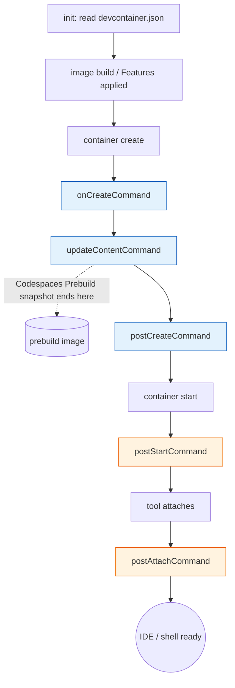

# [FEE-1612] Development Containers (`devcontainer.json`) for Reproducible Environments

:::info
A development container is a container described by `devcontainer.json` that can host an editing session, a teammate's editing session, and a CI run from the same image. The Development Containers Specification at containers.dev defines the file format, the lifecycle hooks, and the reusable Features mechanism, and it is implemented by the VS Code Dev Containers extension, JetBrains IDEs, GitHub Codespaces, DevPod, and the open-source `@devcontainers/cli`. When the same `devcontainer.json` drives local IDE, Codespaces, and CI, "works on my machine" stops being a class of failure, because the machine is the same artifact in all three places.
:::

## Context

The Development Containers Specification is "an open specification for enriching containers with development specific content and settings" published at [containers.dev](https://containers.dev/) and maintained in [`devcontainers/spec`](https://github.com/devcontainers/spec). The spec deliberately does not replace existing container orchestration formats; it adds a layer of dev-time metadata on top, and it offers a "simplified, un-orchestrated single container option" for projects that do not need full orchestration. The configuration file, `devcontainer.json`, is JSON with Comments (jsonc) and lives at `.devcontainer/devcontainer.json`, `.devcontainer.json`, or `.devcontainer/<folder>/devcontainer.json`, per the [implementor's spec](https://containers.dev/implementors/spec/).

The same artifact powers three runtimes: the application, the toolchain isolation layer, and CI. The spec describes a dev container as something that "can be used to run an application, to separate tools, libraries, or runtimes needed for working with a codebase, and to aid in continuous integration and testing." On the IDE side, the [VS Code Dev Containers extension](https://code.visualstudio.com/docs/devcontainers/containers) treats `devcontainer.json` as the contract for "how to access (or create) a development container," and [JetBrains IDEs read the same file format](https://www.jetbrains.com/help/idea/connect-to-devcontainer.html) so a single config covers VS Code and IntelliJ users on one project. Beyond the IDE, [DevPod](https://devpod.sh/docs/what-is-devpod) is an open-source client that "reuses the open DevContainer standard to create a consistent developer experience no matter what backend you want to use" — local Docker, remote SSH, or cloud — giving the same `devcontainer.json` portable cloud execution.

## Scenario

A frontend team has six engineers working on a Next.js app backed by Postgres and Redis. Onboarding a new hire takes about a day: install the right Node major, install pnpm at the right version via Corepack, install Postgres locally, install Redis, copy `.env.example` to `.env`, run migrations, seed the database, fight with `node-gyp` and Xcode Command Line Tools on a fresh M-series Mac. Once that is done, the new hire still cannot reproduce a flaky test that only one teammate sees, because that teammate has Node 20.11 and everyone else upgraded to 20.12 last week.

CI is a separate animal. The GitHub Actions workflow has its own `actions/setup-node@v4` step, its own service-container block for Postgres, and bespoke shell scripts to install pnpm and run migrations. When a dependency changes Node major, two systems need updating — local READMEs and the CI workflow — and they drift. "Works on my machine" failures are common, and so are "works in CI but not locally" failures, which are the same failure with the actors reversed.

A `devcontainer.json` collapses both setups into one file: a base image plus a `node:1` Feature pins the runtime, `forwardPorts` makes Postgres and Redis reachable, `postCreateCommand: "pnpm install"` does the deps step once, and the `devcontainers/ci` GitHub Action runs the same container in CI. Onboarding becomes "open the repo in your IDE and click Reopen in Container," and CI becomes "build and run the same dev container the humans use."

## Best Practices

- **MUST** keep secrets out of `containerEnv`. The spec defines `containerEnv` as "a set of name-value pairs that sets or overrides environment variables for the container; all processes spawned in the container will have access to it," whereas `remoteEnv` "sets or overrides environment variables for the `devcontainer.json` supporting service / tool (or sub-processes) but not the container as a whole." Anything baked into `containerEnv` is visible to every process in the container including ones started by other tools; route per-user secrets through `remoteEnv` plus the host secret store instead.
- **MUST** pin Feature versions to at least a major tag. The [`devcontainers/features`](https://github.com/devcontainers/features) repository publishes Features as OCI artifacts with tags such as `:1`, `:1.0`, `:1.0.0`. An unpinned reference (`ghcr.io/devcontainers/features/node`) resolves to `:latest` and silently picks up new Node majors; use at minimum the major tag (`:1`).
- **SHOULD** keep `postCreateCommand` idempotent. It runs once when the container is created, but humans re-run it when iterating on the config, and Codespaces re-runs it when rebuilding a codespace. `pnpm install` and `npm ci` already are; avoid one-shot commands like `git init` that fail on a second invocation.
- **SHOULD** drive prebuilds and CI through `@devcontainers/cli` rather than ad-hoc `docker build`. The [reference CLI](https://github.com/devcontainers/cli) exposes `devcontainer up`, `devcontainer build`, `devcontainer exec`, and `devcontainer run-user-commands`. The last "runs lifecycle commands like `postCreateCommand`," which is the verb a human would otherwise have to reimplement in shell.
- **MAY** use `cacheFrom` against a registry image rather than a local Docker layer cache. The `devcontainers/ci` Action accepts a registry reference for `cacheFrom`, which gives a second runner or a teammate's machine the same cache hit a previous build produced.

## Design Thinking

The central trade-off is image size versus setup speed. A fully-baked image (Node, pnpm, build tools, language servers, Playwright browsers, Chromium dependencies) starts the container in seconds but bloats the registry artifact and bloats the Codespace cold-start. A minimal image with `postCreateCommand` doing all the install work is small but slow to first usable IDE. Features split the difference: each Feature is a self-contained installation unit that can be composed onto a thin base, and because Features carry their own metadata, they can be cached by the Action's `cacheFrom` mechanism. The registry stores the post-Features image, and the application's `postCreateCommand` only runs the cheap, repo-specific step (`pnpm install` against a populated lockfile).

The calibration question is therefore "what belongs in the image versus in `postCreateCommand`?" Things that change rarely and are expensive to install (Node, the Postgres client, system libraries) belong in the image (or in a Feature, which becomes part of the image). Things that change every PR (the dependency graph) belong in `postCreateCommand`, which is fast on a warm cache and acceptable on a cold one. Things that depend on per-user or per-codespace credentials belong even later in the lifecycle — see Deep Dive.

## Deep Dive

The [JSON reference](https://containers.dev/implementors/json_reference/) defines five distinct command hooks. Three run once, when the container is created, in this order:

1. `onCreateCommand` — "the first of three (along with `updateContentCommand` and `postCreateCommand`) that finalizes container setup when a dev container is created."
2. `updateContentCommand` — runs immediately after `onCreateCommand` to refresh content that changes per source-tree state.
3. `postCreateCommand` — runs after the previous two and is the conventional place for `npm ci` / `pnpm install` / `bundle install`.

Two run repeatedly:

4. `postStartCommand` — "a command to run each time the container is successfully started."
5. `postAttachCommand` — "a command to run each time a tool has successfully attached to the container."

The split between `onCreateCommand` + `updateContentCommand` and `postCreateCommand` is the load-bearing distinction for prebuilds. [Codespaces Prebuilds](https://docs.github.com/en/codespaces/prebuilding-your-codespaces/about-github-codespaces-prebuilds) explicitly stops at `updateContentCommand`: "GitHub creates a temporary codespace, performing setup operations up to and including any `onCreateCommand` and `updateContentCommand` commands in the `devcontainer.json` file." That snapshot is then reused for every codespace created from the prebuild. Anything that depends on per-codespace credentials (a token issued for the specific codespace, a per-user GitHub App installation, a remote secret pulled from the user's host secret store via `remoteEnv`) must move to `postCreateCommand`, `postStartCommand`, or `postAttachCommand`. Anything that runs `onCreateCommand` cannot assume those credentials exist yet, because at prebuild time, "the user" is GitHub itself.

## Visual



## Example

A minimal `.devcontainer/devcontainer.json` for the scenario above:

```jsonc
// .devcontainer/devcontainer.json
{
  "name": "fee-app",
  "image": "mcr.microsoft.com/devcontainers/base:ubuntu-22.04",

  "features": {
    "ghcr.io/devcontainers/features/node:1": {
      "version": "20"
    }
  },

  "forwardPorts": [3000, 5432, 6379],

  "containerEnv": {
    "NODE_ENV": "development",
    "PNPM_HOME": "/home/vscode/.local/share/pnpm"
  },

  "remoteEnv": {
    "GITHUB_TOKEN": "${localEnv:GITHUB_TOKEN}"
  },

  "postCreateCommand": "corepack enable && pnpm install --frozen-lockfile"
}
```

What each piece does, traced to the spec:

- `image` provides the base; an alternative is `"build": { "dockerfile": "Dockerfile" }` for repo-owned Dockerfiles.
- `features` pulls the Node Feature from `ghcr.io/devcontainers/features/node:1`. Per the [Features repo](https://github.com/devcontainers/features), Features are "self-contained units of installation code and development container configuration" designed to "install atop a wide-range of base container images"; the `:1` tag pins to the major.
- `forwardPorts` makes ports 3000 (Next.js), 5432 (Postgres), and 6379 (Redis) reachable on the host. The JSON reference defines this as "an array of port numbers or host:port values that should always be forwarded from inside the primary container to the local machine." The supporting tool watches the list and re-establishes forwards when the container restarts.
- `containerEnv` sets `NODE_ENV` and `PNPM_HOME` for every process in the container; both are non-secret and benefit from being globally visible.
- `remoteEnv` injects the host's `GITHUB_TOKEN` only for the supporting tool's processes (e.g., the VS Code server). The secret stays invisible to arbitrary processes inside the container.
- `postCreateCommand` runs once after creation; using `--frozen-lockfile` makes it deterministic and idempotent against a populated lockfile.

A teammate cloning this repo and running "Reopen in Container" gets the same Node 20, the same pnpm, the same forwarded ports, and the same dependency graph, without installing any of it on their host.

## CI Integration

The same `devcontainer.json` powers GitHub Codespaces and GitHub Actions, which is the entire point of the format. [GitHub's introduction to dev containers](https://docs.github.com/en/codespaces/setting-up-your-project-for-codespaces/adding-a-dev-container-configuration/introduction-to-dev-containers) is explicit: "When you work in a codespace, the environment you are working in is created using a development container, or dev container, hosted on a virtual machine. The primary file in a dev container configuration is the `devcontainer.json` file." So Codespaces is, in effect, a dev container hosted on a VM by GitHub.

For CI, the [`devcontainers/ci`](https://github.com/devcontainers/ci) Action runs the repo's dev container in a workflow, building the same image and executing arbitrary commands in it via `runCmd`. The Action's `imageName` + `cacheFrom` + `push` triplet enables a prebuild-once, reuse-everywhere pattern, which the Action's README spells out: if "you have a separate workflow … to pre-build your container image, you can reference it here to speed up your application build workflows as well." The shape is three workflows:

1. **Scheduled main-branch image build** — pushes the dev container image to the registry on a cron and on `main` updates.
2. **PR workflow** — runs tests inside the dev container, with `cacheFrom` pointing at the pushed image so it skips the build.
3. **Codespaces Prebuilds (optional)** — applies the same caching idea at the platform level for human devs.

The build-and-push workflow:

```yaml
# .github/workflows/devcontainer-build.yml
name: Build dev container image
on:
  push:
    branches: [main]
    paths: ['.devcontainer/**']
  schedule:
    - cron: '0 6 * * 1' # weekly Monday 06:00 UTC

jobs:
  build:
    runs-on: ubuntu-latest
    permissions:
      contents: read
      packages: write
    steps:
      - uses: actions/checkout@v4
      - uses: docker/login-action@v3
        with:
          registry: ghcr.io
          username: ${{ github.actor }}
          password: ${{ secrets.GITHUB_TOKEN }}
      - name: Build and push
        uses: devcontainers/ci@v0.3
        with:
          imageName: ghcr.io/${{ github.repository }}/devcontainer
          cacheFrom: ghcr.io/${{ github.repository }}/devcontainer
          push: always
```

The PR workflow that consumes the cached image:

```yaml
# .github/workflows/test.yml
name: Test
on: pull_request

jobs:
  test:
    runs-on: ubuntu-latest
    steps:
      - uses: actions/checkout@v4
      - name: Run tests in dev container
        uses: devcontainers/ci@v0.3
        with:
          imageName: ghcr.io/${{ github.repository }}/devcontainer
          cacheFrom: ghcr.io/${{ github.repository }}/devcontainer
          push: never
          runCmd: pnpm test
```

For Codespaces Prebuilds, GitHub "creates a temporary codespace, performing setup operations up to and including any `onCreateCommand` and `updateContentCommand` commands in the `devcontainer.json` file," then snapshots the result. Creating a codespace from that prebuild "can be substantially quicker than creating one without a prebuild," because cloning, image fetch, and the early lifecycle hooks are already done. The cost is the prebuild minutes; the design constraint is the lifecycle split called out in Deep Dive, where anything credential-bound stays in `postCreateCommand` or later.

## Internal References

- [FEE-1609 Local Development Environment Setup](/en/Developer%20Experience%20and%20Tooling/1609) — Docker Compose patterns for orchestrating backing services; complements `devcontainer.json` when the project needs multi-container orchestration beyond the single-container option.
- [FEE-1613 mise](/en/Developer%20Experience%20and%20Tooling/1613) — polyglot tool version manager for projects where a full container is overkill and a hostside `.tool-versions`-style pin is enough.
- [FEE-1614 Corepack](/en/Developer%20Experience%20and%20Tooling/1614) — per-Node-project package manager pinning that complements container-level pinning, so the dev container's Node Feature and the project's Corepack pin agree on pnpm/yarn versions.

## References

- Development Containers, "Development Containers Specification," containers.dev (2024). https://containers.dev/
- Development Containers, "devcontainer.json reference," containers.dev (2024). https://containers.dev/implementors/json_reference/
- Development Containers, "Implementor's specification," containers.dev (2024). https://containers.dev/implementors/spec/
- devcontainers, "Development Containers Specification (repo)," GitHub (2024). https://github.com/devcontainers/spec
- devcontainers, "@devcontainers/cli," GitHub (2024). https://github.com/devcontainers/cli
- devcontainers, "Dev Container Features," GitHub (2024). https://github.com/devcontainers/features
- devcontainers, "Dev Container Build and Run Action (`devcontainers/ci`)," GitHub (2024). https://github.com/devcontainers/ci
- Microsoft, "Developing inside a Container," Visual Studio Code Docs (2024). https://code.visualstudio.com/docs/devcontainers/containers
- JetBrains, "Connect to a Dev Container," IntelliJ IDEA Help (2024). https://www.jetbrains.com/help/idea/connect-to-devcontainer.html
- Loft Labs, "What is DevPod?," DevPod Documentation (2024). https://devpod.sh/docs/what-is-devpod
- GitHub, "Introduction to dev containers," GitHub Codespaces Documentation (2024). https://docs.github.com/en/codespaces/setting-up-your-project-for-codespaces/adding-a-dev-container-configuration/introduction-to-dev-containers
- GitHub, "About GitHub Codespaces prebuilds," GitHub Codespaces Documentation (2024). https://docs.github.com/en/codespaces/prebuilding-your-codespaces/about-github-codespaces-prebuilds
