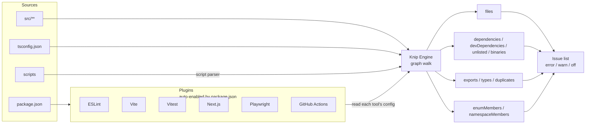

# [FEE-1615] Knip — Unused Files, Exports, and Dependency Detection

:::info
Knip is a project-graph linter that finds and fixes unused dependencies, exports, and files in JavaScript and TypeScript projects. It surfaces a typed taxonomy of issue kinds (files, dependencies, exports, types, `enumMembers`, `namespaceMembers`, duplicates, and more), auto-enables plugins from `package.json`, and exposes a CI-friendly exit-code contract. With ts-prune, depcheck, unimported, and tsr archived, Knip has become the consolidated successor for project-wide dead-code and dead-dependency detection.
:::

## Context

Three predecessors carved the space before Knip: ts-prune searched TypeScript projects for unreferenced exports (Vanderkam, "Finding dead code (and dead types) in TypeScript," 2020); depcheck inspected `package.json` for unused or unlisted dependencies; unimported looked for files no entry point reaches. Each saw one slice. All three are now archived, alongside the more recent tsr, and their authors point to Knip as the successor (Knip docs, "Comparison and migration"). Knip's stated mission is to find and fix "unused dependencies, exports and files" together so that "less code and dependencies lead to improved performance, less maintenance and easier refactorings" (webpro-nl/knip README). The unification matters because the four detection axes are coupled: removing an unused export often reveals a now-unused file, which in turn drops a dependency. A single analysis pass refines all four.

The gap Knip fills is cross-file. ESLint's `no-unused-vars` sees one file at a time, so an export that no other module consumes still looks used from inside its own file. A bundler's tree-shaker drops dead code from the compiled bundle at build time, but it produces no report: a file whose last import was deleted months ago keeps shipping through source control and `package.json` untouched, because nothing tells the team it is safe to delete. Knip closes that gap by walking the whole import graph from declared entry points and marking every file, export, and dependency it reaches; anything left unmarked is dead. Dan Vanderkam, who recommended ts-prune for the same job before Knip existed, describes both tools as running "the same sort of mark-and-sweep algorithm" (Vanderkam, "Use knip to detect dead code and types," 2023).

Knip publishes its issue taxonomy as a set of rule keys: `files`, `dependencies`, `devDependencies`, `optionalPeerDependencies`, `unlisted`, `binaries`, `unresolved`, `exports`, `types`, `enumMembers`, `namespaceMembers`, `duplicates`, `catalog`, and `cycles` (Knip docs, "Rules and filters"). `catalog` covers pnpm, Yarn, and Bun workspace catalogs: the centralized dependency-version tables declared in `pnpm-workspace.yaml`, `.yarnrc.yml`, or `package.json`. The issue fires when a catalog entry is defined but no workspace references it through the `catalog:` protocol, and it is auto-fixable (Knip docs, "Catalogs"; "Reference: issue types"). `cycles` flags circular imports and defaults to `warn` rather than `error` (Knip docs, "Rules and filters"), so a cycle prints without failing CI until a team opts it up. Two more keys, `nsExports` and `nsTypes`, cover namespace-level exports and types but ship off by default. The taxonomy is the configuration surface: every kind has an `error` / `warn` / `off` knob. This article walks through how Knip composes that surface, how its plugin model auto-discovers tools you already use, and where the configuration footguns live, especially in monorepos.

## Visual



The four detection axes (files, dependencies, exports, members) converge into a single issue list. Plugins act as antennae: each one reads its tool's own config to translate "you are using Vitest" into the entry files, referenced packages, and project globs Vitest implies.

## Example

A Next.js application with Vitest tests. The repo's `knip.json` looks like this:

```json
{
  "$schema": "https://unpkg.com/knip@5/schema.json",
  "entry": ["src/app/**/page.{ts,tsx}", "src/app/**/layout.{ts,tsx}", "src/middleware.ts"],
  "project": ["src/**/*.{ts,tsx}"],
  "ignoreExportsUsedInFile": true,
  "rules": {
    "files": "error",
    "dependencies": "error",
    "devDependencies": "error",
    "exports": "warn",
    "types": "warn",
    "enumMembers": "warn",
    "duplicates": "error"
  }
}
```

The `next` and `vitest` plugins auto-enable because both packages appear in `package.json` (Knip docs, "Plugins"). The Next.js plugin contributes `pages/**/*.{js,jsx,ts,tsx}` as additional entries; the Vitest plugin contributes `*.test.ts` patterns and recognises coverage-provider packages like `@vitest/coverage-istanbul`. The team did not have to spell any of that out.

`package.json` carries one script:

```json
{
  "scripts": {
    "knip": "knip"
  }
}
```

The CI workflow runs Knip in production mode and emits GitHub Actions annotations:

```yaml
- name: Knip
  run: pnpm knip --production --reporter github-actions
```

In CI the exit code is the gating contract: 0 keeps the build green, 1 fails it on lint issues, 2 fails it on Knip's own internal error (Knip docs, "CLI"). For a soft-launch period, a team can add `--no-exit-code` to publish annotations without failing the build:

```yaml
- name: Knip (advisory)
  run: pnpm knip --production --reporter github-actions --no-exit-code
```

Once the queue is at zero on the `error`-level rules, drop `--no-exit-code` to lock the gate.

## Best Practices

- **MUST** declare `entry` and `project` correctly before tuning anything else. `entry` lists the import-graph roots; `project` lists which files count as in-scope source. Mis-specifying these is the dominant cause of false positives (Knip docs, "Configuration").
- **SHOULD** rely on plugins rather than hand-listing config files. Plugins auto-enable based on `package.json` membership and read each tool's own configuration. For example, the ESLint plugin parses `.eslintrc.json`, the Vitest plugin returns `@vitest/coverage-istanbul` as a referenced dep, the Next.js plugin adds `pages/**/*.{js,jsx,ts,tsx}` as entries, the Playwright plugin reads `testDir`/`testMatch`, the Angular plugin parses `angular.json`, and the GitHub Actions plugin parses workflow YAML (Knip docs, "Plugins"). Plugins ship for ESLint, Vite, Vitest, Next.js, Storybook, Playwright, Angular, GitHub Actions, webpack, and dozens more.
- **SHOULD** tune severity per rule with the three-level model: `error` is printed and counted toward the exit code, `warn` is printed faded but not counted, `off` is suppressed entirely (Knip docs, "Rules and filters"). New adopters often start every rule at `warn`, then graduate ones to `error` as the codebase reaches zero on that axis.
- **MUST** treat the CLI exit codes as a CI gating contract: 0 means clean, 1 means at least one lint issue, 2 means Knip itself failed (bad input or internal error) (Knip docs, "CLI"). A pipeline that conflates 1 and 2 will fail loudly when Knip crashes and silently when the codebase regresses.
- **SHOULD** run `--production` in CI and reserve the default mode for local triage. `--production` excludes test files, configuration files, Storybook stories, and devDependencies. `--strict` adds workspace isolation (consider only direct dependencies) and implies production mode (Knip docs, "CLI").
- **MAY** set `ignoreExportsUsedInFile: true` (root-only) to suppress reports for exports that are only consumed inside their own file. This is appropriate when an internal helper is exported for testability but never imported elsewhere (Knip docs, "Handling issues").
- **SHOULD** pick a reporter that matches the consumer. Available reporters are `symbols` (default), `compact`, `codeowners`, `json`, `codeclimate`, `markdown`, `disclosure`, and `github-actions` (Knip docs, "CLI"). A GitHub Actions job benefits from `--reporter github-actions` for inline annotations; a CodeClimate-driven dashboard wants `--reporter codeclimate`.

## Design Thinking

The unification is the design choice. ts-prune knew about exports and refused to look at `package.json`. depcheck knew about `package.json` and could not see exports. Unimported knew which files were orphaned but had no opinion on what was inside them. A team adopting all three paid the integration cost three times (three configs, three CI steps, three sets of false positives) and still missed the cross-axis edges (an unused file holds the only consumer of a dependency, so the dependency is also unused). Knip trades that against a heavier configuration surface: one tool, one config, one pass, all four axes refined together. The cost is an `entry` / `project` model the user must understand before output is trustworthy. The benefit is that the four axes converge in a single graph walk and the auto-fix path can act on all of them safely.

A second trade-off lives in the rule levels. Three states (`error` / `warn` / `off`) instead of two acknowledge that an established codebase cannot reach zero on every axis on day one. `warn` lets a team print findings without failing CI while they work down the queue, and `off` lets them mute axes that are not yet a priority without losing the rest of the report. The cost is that `warn` is silently tolerated forever in some teams; the discipline of graduating rules to `error` is on the team, not the tool.

## Deep Dive

**Entry-file exports.** Exports that live in entry files are ignored by default. Knip assumes an entry is consumed externally and cannot prove its public surface is dead. Opt in with `--include-entry-exports` to also report unused exports in entry files. Enums exported from entry files are similarly skipped by default, including their members (Knip docs, "Handling issues"). Forgetting this leads to the inverse of a false positive: real dead code in entry files going unreported.

**Auto-fix scope.** `--fix` removes the `export` keyword for unused exports, re-exports, and exported types; removes unused `export default` keywords; strips unused enum and namespace members; and removes unused `dependencies`, `devDependencies`, and catalog entries from `package.json` (Knip docs, "Auto-fix"). File deletion is a separate opt-in: add `--allow-remove-files` to also delete files nothing imports. `--fix` does **not** add unlisted dependencies or binaries (those require human intent: was that an accidental import or a real one?) and does not fix duplicate exports. The asymmetry is by design: dropping safe, adding requires intent.

**`--workspace` semantics.** Targeting a workspace also lints its ancestors, its dependencies, and its dependents. Ancestor workspaces may declare dependencies the target workspace uses, dependency workspaces may provide configuration or source the target relies on, and dependent workspaces may import the target's exports (Knip docs, "Monorepos and workspaces"). Treat `--workspace` as "this and the slice of the graph it depends on" rather than a strict filter.

**Script parser.** Knip statically parses `package.json` `scripts` and CLI arguments to detect inputs without executing them. The first positional argument is treated as an entry file, `-c`/`--config` as a config file, and `--require`/`--loader`/`--import` as runtime dependencies (Knip docs, "Script parser"). This is how Knip recognises that `node --require ./register.js src/main.ts` references both `./register.js` and `src/main.ts` without spawning Node.

## Configuration Anatomy

Knip's configuration is a layered model: root → workspaces → plugins → entry/project globs. Each layer has a precise role.

**Root.** The root `knip.json` (or `knip.config.ts`, etc.) carries a small set of root-only options that apply across the whole project: `exclude`, `include`, `ignoreExportsUsedInFile`, `ignoreWorkspaces`, `workspaces`, plus the rules block. These do not have per-workspace equivalents; they shape the whole run.

**Entry vs project.** The two foundational glob arrays answer different questions. `entry` declares the roots of the import graph: the files Knip starts walking from. `project` declares which files count as in-scope source and are therefore eligible to be flagged as unused if no entry reaches them. A pattern prefixed with `!` negates (Knip docs, "Configuration"). A common mistake is to put everything in `entry`; doing so makes Knip treat every file as a graph root and report nothing as unused.

**Plugins.** Plugins layer on top of `entry` / `project` and contribute additional entries, project globs, and referenced dependencies based on tool configs they read. They auto-enable when the related package appears in `package.json`'s dependency list, and they parse each tool's own config to find referenced dependencies and determine unused and unlisted ones (Knip docs, "Plugins"). A team that already configured ESLint, Vite, Vitest, Next.js, Storybook, Playwright, Angular, GitHub Actions, or webpack gets that configuration honored without restating it.

**Workspaces (monorepo footgun).** In a monorepo, the root-level `entry` and `project` options are **ignored**. The workspace named `"."` carries them. Workspaces are discovered from `package.json#workspaces`, `pnpm-workspace.yaml`, or Knip's own `workspaces` config; each workspace inherits the same default configuration (Knip docs, "Monorepos and workspaces"). A monorepo `knip.json`:

```json
{
  "$schema": "https://unpkg.com/knip@5/schema.json",
  "ignoreExportsUsedInFile": true,
  "workspaces": {
    ".": {
      "entry": ["scripts/**/*.ts"],
      "project": ["scripts/**/*.ts"]
    },
    "apps/web": {
      "entry": ["src/app/**/page.tsx", "src/middleware.ts"],
      "project": ["src/**/*.{ts,tsx}"]
    },
    "packages/ui": {
      "entry": ["src/index.ts"],
      "project": ["src/**/*.{ts,tsx}"]
    }
  }
}
```

A team that puts `entry` and `project` at the root of a workspaced project will silently get nothing analyzed at the root level: the options exist on the schema but are ignored at that position. The `"."` key is the fix.

**Targeting one workspace.** `--workspace apps/web` runs against `apps/web` plus its ancestors and dependents, because ancestor workspaces may declare dependencies the linted workspace uses (Knip docs, "Monorepos and workspaces"). It is not a strict filter.

**Entry-file exports.** Exports living in entry files are ignored by default. Add `--include-entry-exports` (or set the equivalent in config) to also report them; this is the right call once a codebase is otherwise clean and the team wants to surface dead public surface area in entries (Knip docs, "Handling issues").

## Related Topics

- [FEE-705 Code Splitting, Lazy Loading & Tree Shaking](/en/Performance/705) — bundler-time tree-shaking eliminates dead code from build output; Knip is the project-graph counterpart that reports dead code at the source level so it can be deleted.
- [FEE-1601 Linting & Static Analysis](/en/Developer%20Experience%20and%20Tooling/1601) — ESLint and TypeScript see inside one file at a time; Knip walks the whole project graph, which is why `no-unused-vars` cannot replace it.
- [FEE-1602 Code Formatting & EditorConfig](/en/Developer%20Experience%20and%20Tooling/1602) — adjacent code-hygiene tooling that runs in the same pre-commit / CI lane as Knip.

## References

- webpro-nl, "Knip — Find unused files, dependencies, and exports," GitHub README (2026). https://github.com/webpro-nl/knip
- Knip, "Configuration," Knip documentation (2026). https://knip.dev/reference/configuration
- Knip, "CLI," Knip documentation (2026). https://knip.dev/reference/cli
- Knip, "Reference: issue types," Knip documentation (2026). https://knip.dev/reference/issue-types
- Knip, "Rules and filters," Knip documentation (2026). https://knip.dev/features/rules-and-filters
- Knip, "Plugins," Knip documentation (2026). https://knip.dev/explanations/plugins
- Knip, "Monorepos and workspaces," Knip documentation (2026). https://knip.dev/features/monorepos-and-workspaces
- Knip, "Catalogs," Knip documentation (2026). https://knip.dev/features/catalogs
- Knip, "Auto-fix," Knip documentation (2026). https://knip.dev/features/auto-fix
- Knip, "Script parser," Knip documentation (2026). https://knip.dev/features/script-parser
- Knip, "Handling issues," Knip documentation (2026). https://knip.dev/guides/handling-issues
- Knip, "Comparison and migration," Knip documentation (2026). https://knip.dev/explanations/comparison-and-migration
- Dan Vanderkam, "Finding dead code (and dead types) in TypeScript," Effective TypeScript (2020). https://effectivetypescript.com/2020/10/20/tsprune/
- Dan Vanderkam, "Use knip to detect dead code and types," Effective TypeScript (2023). https://effectivetypescript.com/2023/07/29/knip/
