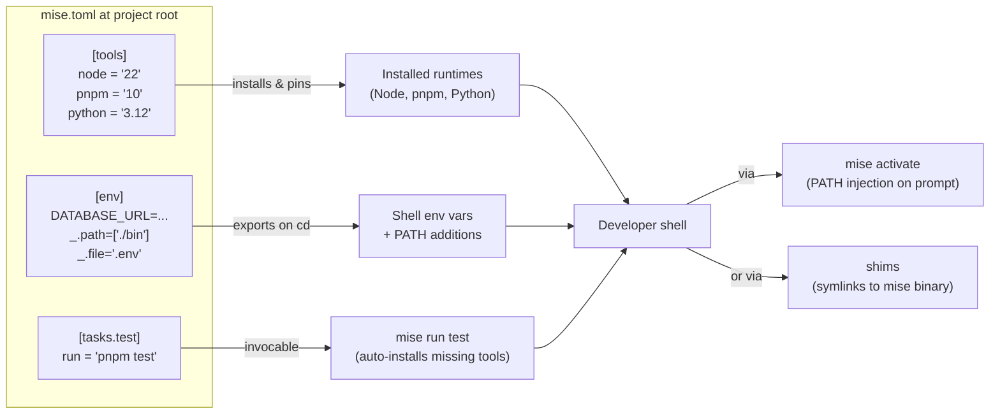

# [FEE-1613] mise (and asdf) for Polyglot Tool and Env Version Management

:::info
`mise` is a polyglot CLI that manages dev tools, environment variables, and project tasks from a single `mise.toml` file, replacing the stack of `nvm` + `pyenv` + `tfenv` + `direnv` + a script runner that most repos accumulate. It installs and switches between hundreds of runtimes (Node, Python, CMake, Terraform, and more) and prepares the environment before each command runs. This article covers how `mise.toml` is structured, when to prefer `mise activate` over shims, how `mise` differs from `asdf` and `nvm`/`fnm`, and how to pin floating versions for reproducible checkouts.
:::

## Context

Frontend repos rarely live on Node alone. A typical product checkout pulls in a Node runtime, a package manager, a Python toolchain for codegen, and an IaC binary such as Terraform or `kubectl`. Historically each runtime came with its own version manager: `nvm` or `fnm` for Node, `pyenv` for Python, `tfenv` for Terraform, plus `direnv` for per-directory environment variables. `asdf` (asdf-vm.com) consolidated the version-manager layer in 2014 by introducing a plugin model and the `.tool-versions` file, but it remained a runtime-only tool. Env vars and task running stayed elsewhere.

`mise` (jdx/mise) is a Rust rewrite that takes the consolidation further. The project description names three responsibilities in one CLI: "Dev tools, env vars, and tasks in one CLI," and the runtime model is "`mise` prepares your development environment before each command runs." Configuration lives in `mise.toml`, whose three first-class sections (`[tools]`, `[env]`, and `[tasks.*]`) replace the four-tool stack above with one file the team commits to the repo.

## Scenario

Two repositories sit side by side in a monorepo umbrella. The web app needs Node 22 + pnpm 10. The legacy admin console is stuck on Node 20 + Yarn. A shared `infra/` directory needs Python 3.12 for codegen and Terraform for deploys. The team currently asks every new hire to install `nvm`, `fnm` (because someone preferred it), `pyenv`, `tfenv`, and a `.envrc` loader, then remember which directory triggers which manager. Onboarding takes half a day and the README has a "if `node` resolves to the wrong version, run …" troubleshooting section.

A `mise.toml` checked in at each project root replaces the lot. `[tools]` pins the runtime versions per directory; `mise` auto-switches as the developer `cd`s between repos because `mise.toml` is hierarchical: the configuration in a directory closer to CWD overrides parent-directory configuration. `[env]` exports the per-project DATABASE_URL and PATH additions that previously lived in `.envrc`. `[tasks.*]` replaces the Makefile or top-level `package.json` script aliases. New hires install one binary; the four version managers go away.

## Best Practices

- **MUST** commit `mise.toml` at every project root that needs reproducible runtimes; rely on its hierarchical resolution (child directories override parents) so a monorepo can pin Node 22 at the web-app root and Node 20 at the admin-console root without conflict.
- **MUST** pin floating aliases before committing. `mise use --pin node@lts` writes the resolved exact version into `mise.toml` (e.g., `node = "22.11.0"` rather than `node = "lts"`), so every checkout installs the same runtime. Set `MISE_PIN=1` to make pinning the default for `mise use`.
- **SHOULD** use `mise activate` (PATH injection on every prompt) for interactive shells rather than the shim mode. The maintainer states this directly: shims break the unix `which` command (it points to the shim, not the real executable), env vars defined in `mise` are only available to mise tools, and most shell hooks won't trigger under shims.
- **SHOULD** define repeated commands as `[tasks.*]` entries instead of npm scripts when they cross runtimes. Tasks launched with `mise` "include the mise environment — your tools and env vars defined in `mise.toml`," and `mise` auto-installs missing tools before running, which makes the same task command portable from a laptop to CI without a separate setup script.
- **SHOULD** put per-project secrets and DATABASE_URL-style variables under `[env]` and let `mise` load them on `cd` rather than running a separate `direnv`. With `mise` activated, "it will automatically set environment variables in the current shell session when you `cd` into a directory," covering direnv's primary use case.
- **MAY** keep an existing `.tool-versions` or `.nvmrc` while migrating. `mise` reads both, but treat this as a transition aid; the maintainer states "in general compatibility with asdf is no longer a design goal," so don't plan around long-term plugin parity.

## Design Thinking

The most consequential design choice in `mise` is how it intercepts a tool invocation. Two mechanisms exist and they trade against each other:

**Shim mode** places small executable shims in a directory on `PATH`. When you run `node`, the shim runs, asks `mise` which version this project wants, then execs the real `node`. Shims work universally — any shell, any IDE, any subprocess — because they're plain executables on `PATH`. The cost is visible plumbing: `which node` now resolves to the shim path and obscures the real binary, environment variables defined in `mise` are only injected for mise-managed tools (so a Python script invoked via shim sees the right `python` but not the `[env]` block), and most shell hooks (`chpwd`, prompt hooks, completion triggers) don't fire because the shim is a one-shot exec, not an interactive event.

**`mise activate` (PATH-injection) mode** hooks the shell prompt: every time the prompt redraws, `mise` re-evaluates the project's `mise.toml` and rewrites `PATH` and the environment for the current shell. `which` stays accurate, the `[env]` block applies to every command in the session (not just mise-managed tools), and shell hooks fire normally because no shim sits between the user and the executable. The cost is that activation is shell-specific: you add one line to `.zshrc` or `.bashrc`, and non-interactive contexts (a CI runner spawning `node` directly, a GUI launcher, an IDE that doesn't source the shell rc) see nothing.

The maintainer's recommendation aligns with this trade: PATH (`mise activate`) for interactive shells, shims for everywhere else. Most teams want both: `mise activate` in `.zshrc` and shims on `PATH` as a fallback for IDEs and GUI launchers.

## Deep Dive

**Two activation modes, side by side.** A `mise activate` invocation adds a hook that "updates environment variables every time the prompt is displayed. In particular, it updates the `PATH` environment variable" so the right runtime resolves first. Shim mode instead places "small executables (`shims`) in a directory that is included in your `PATH`." Each shim is a thin wrapper that re-execs `mise` to resolve the right binary. Both can run simultaneously; they're not mutually exclusive.

**Auto-reshim.** Shims have a reputation in the `asdf` world for needing manual `asdf reshim` after every install. `mise` rejects that ergonomic: "`mise` already runs a reshim anytime a tool is installed/updated/removed." Manual `mise reshim` is a repair command for when `~/.local/share/mise/shims` falls out of sync, not a step in the install flow. New users coming from `asdf` typically skip the manual reshim and find things still work.

**Task runner internals.** `mise tasks` is more than a script alias. The runner supports "building dependencies in parallel — by default with no configuration required" via a per-task `depends` list, and "last-modified checking to avoid rebuilding when there are no changes — requires minimal config" via `sources` and `outputs` declarations. The combination turns `mise.toml` into a small Make-equivalent: `[tasks.build]` with `sources = ["src/**/*.ts"]` and `outputs = ["dist/**"]` skips re-execution when no source changed, and `depends = ["compile-protos"]` lets independent dependencies fan out across cores without a separate orchestrator.

## Visual



## Example

A real `mise.toml` for a frontend service with Python codegen:

```toml
[tools]
node = "lts"
pnpm = "10"
python = "3.12"
terraform = "1.9"

[env]
DATABASE_URL = "postgres://localhost/dev"
NODE_ENV = "development"
_.path = ["./bin"]
_.file = ".env"

[tasks.test]
run = "pnpm test"

[tasks.build]
depends = ["codegen"]
sources = ["src/**/*.ts"]
outputs = ["dist/**"]
run = "pnpm build"

[tasks.codegen]
run = "python scripts/codegen.py"
```

Three things are worth calling out:

1. `_.path = ["./bin"]` extends `PATH` with the project's `./bin` directory; relative paths resolve against `config_root`, so a developer running from a subdirectory still gets the project-root `./bin` on `PATH`.
2. `_.file = ".env"` loads dotenv-style variables from `.env` into the session, replacing a separate `direnv` setup.
3. `node = "lts"` is a floating alias. To make checkouts reproducible, run `mise use --pin node@lts` once. The command resolves the alias to an exact version (e.g., `22.11.0`) and rewrites the line: `node = "22.11.0"`. Commit the change. From now on every developer and every CI runner installs the same Node, even after a new LTS lands upstream.

The same `mise.toml` works in CI: a single `mise install` step replaces the matrix of Node + Python + Terraform setup actions. Tasks ("`mise run build`") inherit the same environment, so the CI invocation is byte-identical to what a developer types locally.

## mise vs asdf vs nvm/fnm

| Dimension | mise | asdf | nvm / fnm |
|-----------|------|------|-----------|
| Scope | Polyglot (Node, Python, Terraform, CMake, hundreds more) | Polyglot via plugins | Node only |
| Config file | `mise.toml` (also reads `.tool-versions`, `.nvmrc`, `.node-version`) | `.tool-versions` | `.nvmrc` (nvm), `.nvmrc` / `.node-version` (fnm) |
| Env-var injection | First-class `[env]` section, auto-loads on `cd` | None (use `direnv`) | None (use `direnv`) |
| Task runner | Built-in `[tasks.*]` with parallelism + last-modified gating | None | None |
| Backend / plugin model | Prefers aqua, ubi, npm, cargo, pipx, go; asdf plugins accepted but mostly rejected for new tools on supply-chain grounds | asdf-plugin Git repos, one per tool | Hardcoded Node distribution downloads |

A few notes the table can't carry:

- `mise` is documented as "a drop-in replacement for `nvm`": it reads `.nvmrc` and `.node-version` files in addition to `mise.toml`, so a repo can adopt `mise` without forcing every contributor to migrate `.nvmrc` immediately.
- `mise` reads `asdf`'s `.tool-versions` files, but the maintainer states asdf compatibility is "no longer a design goal." Treat `.tool-versions` support as a migration aid, not a long-term contract.
- New `asdf` and `vfox` plugins are "almost never accepted for supply-chain security reasons." The recommended backends are `aqua` (most features and security, no plugins required), `ubi`, `npm`, `cargo`, `pipx`, and `go`. Migrating from `asdf` therefore means re-pointing each tool to a non-asdf backend, not copying plugin URLs across.

## Internal References

- [Local Development Environment Setup](/en/Developer%20Experience%20and%20Tooling/1609) — the broader local-dev surface that `mise` slots into; FEE-1609 covers the `nvm`/`fnm` baseline that `mise` replaces.
- [Corepack](/en/Developer%20Experience%20and%20Tooling/1614) — `packageManager` field in `package.json` pins the package manager version; `mise` pins runtimes. The two compose: `mise` for Node/pnpm install, Corepack for the active package-manager version.
- [Development Containers](/en/Developer%20Experience%20and%20Tooling/1612) — when reproducibility needs OS-level isolation (system libs, services), reach for a devcontainer; `mise` covers the runtime + env-var layer without a container boundary.

## References

- jdx, "mise — Dev tools, env vars, and tasks in one CLI," GitHub (2026). https://github.com/jdx/mise
- jdx, "Configuration | mise," mise documentation (2026). https://mise.jdx.dev/configuration.html
- jdx, "Node.js | mise," mise documentation (2026). https://mise.jdx.dev/lang/node.html
- jdx, "Shims | mise," mise documentation (2026). https://mise.jdx.dev/dev-tools/shims.html
- jdx, "Environments | mise," mise documentation (2026). https://mise.jdx.dev/environments/
- jdx, "Tasks | mise," mise documentation (2026). https://mise.jdx.dev/tasks/
- jdx, "Registry | mise," mise documentation (2026). https://mise.jdx.dev/registry.html
- jdx, "FAQ | mise," mise documentation (2026). https://mise.jdx.dev/faq.html
- jdx, "`mise use` | mise," mise documentation (2026). https://mise.jdx.dev/cli/use.html
- asdf contributors, "asdf — Manage multiple runtime versions with a single CLI tool," asdf-vm.com (2026). https://asdf-vm.com/
