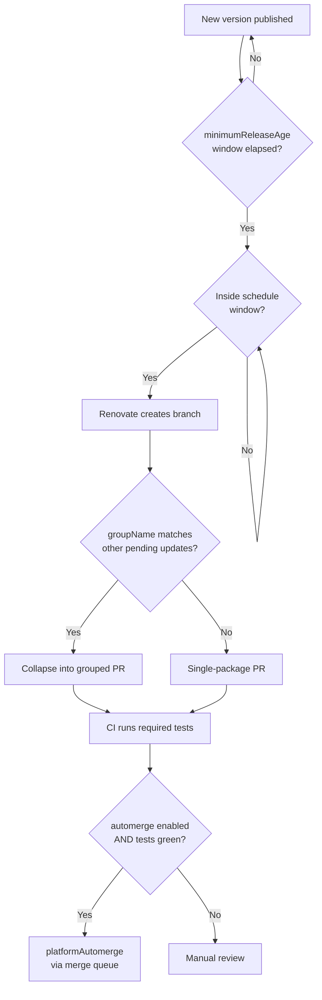

# [FEE-1616] Renovate Configuration for Frontend Repositories

:::info
Renovate is an automated dependency-update bot that opens PRs across 90+ package managers, including npm, pnpm, Yarn, GitHub Actions, and Docker. A frontend repository typically receives dozens of update PRs per week; without grouping, scheduling, and gated automerge the review queue becomes unworkable. This article shows how to configure Renovate for a typical frontend monorepo or single-package webapp using `config:recommended`, `packageRules`, `schedule`, `lockFileMaintenance`, `minimumReleaseAge`, and automerge so the bot stays useful instead of becoming noise.
:::

## Context

Renovate is a long-running open-source project that "helps to update dependencies in your code without needing to do it manually," supports "over 90 different package managers," and "delivers update PRs directly to your repo" (renovatebot/renovate README). The configuration model is JSON (or JSON5/JavaScript) and is composed via shareable presets: the `extends` array references named presets so a repository can inherit a canonical baseline instead of redefining options. The current canonical baseline is `config:recommended`, which on its own bundles a Dependency Dashboard issue, semantic-prefix commits, ignored modules and tests, `group:monorepos`, `group:recommended`, age-confidence badges, and digest changelog helpers. Earlier articles and Renovate examples reference `config:base`; that name is legacy and `config:recommended` supersedes it. Similarly, the older `stabilityDays` option has been renamed to `minimumReleaseAge`; new configurations should use the new name.

## Scenario

A four-engineer team owns a Vite + React webapp with a shared `pnpm-workspace.yaml` and three internal packages. They have Dependabot enabled with weekly checks. Every Monday morning the queue holds roughly 30 open PRs: one PR per ESLint plugin patch, one per `@types/*` bump, one per Storybook addon, and a handful of GitHub Actions digests. Reviewers triage the stack manually, and CI minutes are spent re-running the same workflow on near-identical diffs. The team wants three things: (a) related dependencies grouped into one PR (one for ESLint, one for Storybook, one for `@types/*`); (b) PRs created off-hours so morning review focuses on humans, not bots; (c) automerge for low-risk devDependency updates so engineers only see PRs that need judgement. Renovate's `groupName`, `schedule`, `minimumReleaseAge`, and gated `automerge` together cover this profile.

## Best Practices

- **MUST** start every config with `extends: ["config:recommended"]`. The preset enables the Dependency Dashboard, semantic commits, `group:monorepos`, `group:recommended`, and ignored test/module folders; re-deriving these by hand wastes time and drifts from upstream.
- **MUST** pick the right webapp/library preset. Use `config:js-app` for application repositories (it adds `:pinAllExceptPeerDependencies`, so apps run against pinned versions); use `config:js-lib` for libraries (it adds `:pinOnlyDevDependencies`, leaving runtime ranges loose for downstream consumers).
- **SHOULD** use `groupName` in `packageRules` to collapse related updates. Group `eslint*`, `@typescript-eslint/*`, `storybook*`, `@types/*`, and `vite*` plugin clusters into one PR each. Renovate ships `group:recommended` and `group:monorepos` out of the box, but custom groups capture project-specific clusters.
- **SHOULD** set a `schedule` window (e.g., `"before 5am on monday"`) so PRs land outside review hours. Renovate accepts natural-language windows like `"every weekend"` or `"after 10pm and before 5am every weekday"`.
- **SHOULD** enable `lockFileMaintenance` on its own schedule. Renovate's npm manager refreshes `package-lock.json`, `pnpm-lock.yaml`, and `yarn.lock`, picking up transitive security fixes that no top-level `dependencies` change would surface.
- **SHOULD** set `minimumReleaseAge` to `"3 days"` or `"5 days"` for non-trivial production dependencies. The option suppresses PR creation for the configured window after a release ships, so a freshly-published malicious or broken version has time to be discovered and yanked before the bot opens a PR.
- **SHOULD** gate `automerge` on required tests. Renovate "will wait for the required tests to pass before it automerges," and by default it uses GitHub's native merge queue via `platformAutomerge`.
- **SHOULD** enable `automerge` for devDependencies non-major and require strong test coverage before extending it to production dependencies. The Renovate docs put it directly: automerge "often works well for `devDependencies`. It can work for production `dependencies` too, but your project should have good test coverage."
- **MAY** rely on Renovate's npm manager to surface `packageManager` updates. When Renovate detects a `packageManager` setting for Yarn in `package.json`, it uses Corepack to install the correct Yarn version — coordinating with the Corepack toolchain instead of fighting it.

## Design Thinking

The central calibration is review burden vs supply-chain risk. Pulling every patch in immediately, with full automerge, minimizes lag at the cost of accepting a malicious or broken release into production within minutes of publication. Manual review of every patch eliminates that window but produces unsustainable PR volume — the Monday-morning scenario above.

`minimumReleaseAge` plus gated automerge for non-major devDependencies is the standard balance. The release-age window relies on the community to detect bad publishes (yanked versions, GitHub issues, advisories) before the bot proposes the upgrade; gated automerge requires the project's own CI to certify that nothing breaks before the PR lands. For production dependencies, the trade tightens: automerge requires test coverage strong enough to catch a regression, and many teams keep production-major updates fully manual on principle. Grouping (`groupName`) and scheduling (`schedule`) are independent levers; they reduce noise without changing the safety posture.

## Deep Dive

`rangeStrategy` controls how Renovate rewrites range constraints in `package.json`. The allowed values are `auto`, `bump`, `extend`, `pin`, `replace`, `widen`. `auto` lets Renovate choose per-manager defaults; `pin` collapses ranges to exact versions (paired with `config:js-app`); `bump` raises the lower bound while preserving range semantics; `widen` expands the upper bound (useful for peer-dependency-style ranges); `replace` substitutes the existing range; `extend` widens only when needed. Library authors typically combine `config:js-lib` with a `widen` or `bump` strategy on `peerDependencies` to keep downstream compatibility wide.

The npm manager has two interactions worth naming. First, the `packageManager` field is treated as a dependency type in its own right, so Renovate opens PRs for `packageManager: "yarn@4.5.1"` bumps the same way it opens PRs for `react`. Second, "if Renovate detects a `packageManager` setting for Yarn in `package.json` then it will use Corepack to install Yarn." The Renovate runner does not assume a global Yarn install. This makes Renovate compatible with Corepack-driven monorepos out of the box (see [FEE-1614 Corepack](/en/Developer Experience and Tooling/corepack)). For pnpm the manager updates `pnpm-lock.yaml` generically; the npm manager documentation does not claim version-specific awareness beyond standard lock-file refresh.

## Visual



## Example

A literal `renovate.json` for the scenario team's frontend webapp:

```json
{
  "$schema": "https://docs.renovatebot.com/renovate-schema.json",
  "extends": [
    "config:recommended",
    "config:js-app"
  ],
  "schedule": ["before 5am on monday"],
  "timezone": "UTC",
  "minimumReleaseAge": "3 days",
  "lockFileMaintenance": {
    "enabled": true,
    "schedule": ["before 5am on monday"]
  },
  "packageRules": [
    {
      "matchPackagePatterns": ["^eslint", "^@typescript-eslint/"],
      "groupName": "eslint"
    },
    {
      "matchPackagePatterns": ["^@types/"],
      "groupName": "type definitions"
    },
    {
      "matchPackagePatterns": ["^storybook", "^@storybook/"],
      "groupName": "storybook"
    },
    {
      "matchDepTypes": ["devDependencies"],
      "matchUpdateTypes": ["minor", "patch"],
      "automerge": true
    },
    {
      "matchManagers": ["github-actions"],
      "matchUpdateTypes": ["digest", "minor", "patch"],
      "automerge": true
    },
    {
      "matchDepTypes": ["dependencies"],
      "matchUpdateTypes": ["major"],
      "dependencyDashboardApproval": true
    }
  ]
}
```

What this configuration does, walked through against the findings:

1. `extends` pulls in `config:recommended` (Dependency Dashboard, semantic commits, monorepo grouping, recommended grouping) and `config:js-app` (`:pinAllExceptPeerDependencies`, so the application's `package.json` ranges are pinned to exact versions).
2. `schedule` restricts branch and PR creation to early Monday — no PR noise during weekdays.
3. `minimumReleaseAge: "3 days"` blocks Renovate from proposing a release until it has been published for three days, mitigating the freshly-published-malicious-package risk.
4. `lockFileMaintenance` runs on the same Monday window to refresh `pnpm-lock.yaml` (and any sibling `package-lock.json` / `yarn.lock`) for transitive updates.
5. The first three `packageRules` use `groupName` to collapse ESLint, `@types/*`, and Storybook updates each into a single PR.
6. The fourth rule enables `automerge` for non-major devDependency updates; Renovate waits for required tests to pass before merging.
7. The fifth rule extends automerge to GitHub Actions digest, minor, and patch bumps. Pinned-digest action updates are low-risk and benefit from staying current.
8. The final rule pins major production dependency updates behind `dependencyDashboardApproval`, forcing a human checkbox in the dashboard issue before the PR is opened.

`packageRules` is "an array of objects that allows you to apply conditional configuration"; the match attributes used here (`matchPackagePatterns`, `matchDepTypes`, `matchUpdateTypes`, `matchManagers`) are documented match keys, and the allowed `matchUpdateTypes` values are `["major", "minor", "patch", "pin", "digest"]`.

## Renovate vs Dependabot

Renovate and Dependabot solve the same surface problem with different defaults. Renovate publishes its own canonical comparison; the table below summarizes the dimensions that matter for a frontend repo, anchored in that comparison and in Dependabot's own configuration documentation.

| Dimension                  | Renovate                                                                                  | Dependabot (GitHub)                                                                              |
| -------------------------- | ----------------------------------------------------------------------------------------- | ------------------------------------------------------------------------------------------------ |
| Dependency grouping        | Out of the box via `group:recommended` / `group:monorepos`; custom `groupName` per rule.  | Supported, but "you must set your own groups first" — no community presets.                      |
| Monorepo support           | `group:monorepos` preset upgrades common monorepo packages (e.g., Babel, Jest) in one PR. | No equivalent monorepo preset; each package version bump is its own PR unless manually grouped.  |
| Dependency Dashboard       | Enabled by default — single issue lists every pending and rate-limited update.            | No dashboard issue; status surfaces only as PRs and the Insights tab.                            |
| Schedule granularity       | Per-dependency, per-manager, or global; natural-language windows ("before 5am on monday").| `daily` (Mon-Fri), `weekly` (default Monday), or `monthly` (first of the month).                 |
| Open-PR limit              | Configurable via `prConcurrentLimit` / `prHourlyLimit`.                                   | Default cap is 5; "if five pull requests with version updates are open, no further PRs" open.    |
| Platform support           | GitHub, GitLab, Bitbucket, Azure DevOps, Gitea, and others.                               | GitHub-only. Requires app installation or self-hosting on other platforms.                       |
| Package manager coverage   | 90+ managers including npm, pnpm, Yarn, Bun, Docker, GitHub Actions, Helm, Terraform, etc.| `npm`, `bun`, `yarn`, `docker`, `github-actions`, plus other ecosystems via the `dependabot.yml`.|

The decision is rarely either-or on capability. Teams that already live inside GitHub and have only one repo with a low patch frequency often run Dependabot fine. Teams that operate a frontend monorepo, want one PR per ESLint or Storybook bump cluster, or need a single dashboard issue to triage rate-limited updates land on Renovate.

## Internal References

- [FEE-1205 Supply Chain Security](/en/Performance and Security/supply-chain-security) — vulnerability scanning is a distinct concern; Renovate updates dependencies but does not itself audit advisories.
- [FEE-1507 Release Automation](/en/Developer Experience and Tooling/release-automation) — semver and changelog generation are outside Renovate's scope; Renovate touches semver only via `rangeStrategy` and grouping on the consumer side.
- [FEE-1614 Corepack](/en/Developer Experience and Tooling/corepack) — Renovate's npm manager invokes Corepack to install Yarn when it detects a `packageManager` field, so Corepack-driven repos work without extra runner configuration.

## References

- Renovate maintainers, "renovatebot/renovate README," GitHub (2026). https://github.com/renovatebot/renovate
- Renovate maintainers, "Configuration Options," Renovate Docs (2026). https://docs.renovatebot.com/configuration-options/
- Renovate maintainers, "Configuration Presets," Renovate Docs (2026). https://docs.renovatebot.com/presets-config/
- Renovate maintainers, "Automerge," Renovate Docs (2026). https://docs.renovatebot.com/key-concepts/automerge/
- Renovate maintainers, "Bot Comparison," Renovate Docs (2026). https://docs.renovatebot.com/bot-comparison/
- Renovate maintainers, "npm Manager," Renovate Docs (2026). https://docs.renovatebot.com/modules/manager/npm/
- GitHub, "Configuration options for the dependabot.yml file," GitHub Docs (2026). https://docs.github.com/en/code-security/dependabot/dependabot-version-updates/configuration-options-for-the-dependabot.yml-file
