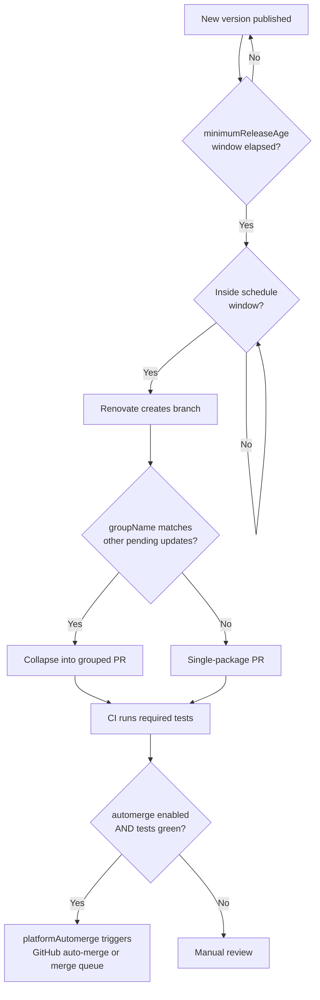

# [FEE-1616] Renovate Configuration for Frontend Repositories

:::info
Renovate is an automated dependency-update bot that opens PRs across 90+ package managers, including npm, pnpm, Yarn, GitHub Actions, and Docker. A frontend repository typically receives dozens of update PRs per week; without grouping, scheduling, and gated automerge the review queue becomes unworkable. This article shows how to configure Renovate for a typical frontend monorepo or single-package webapp using `config:recommended`, `packageRules`, `schedule`, `lockFileMaintenance`, `minimumReleaseAge`, and automerge, calibrated so the weekly PR count stays close to the number of decisions a human actually needs to make.
:::

## Context

Renovate is a long-running open-source project that "helps to update dependencies in your code without needing to do it manually," supports "over 90 different package managers," and "delivers update PRs directly to your repo" (renovatebot/renovate README). The configuration model is JSON (or JSON5/JavaScript) and is composed via shareable presets: the `extends` array references named presets so a repository can inherit a canonical baseline instead of redefining options. The current canonical baseline is `config:recommended`, which on its own bundles a Dependency Dashboard (a single bot-maintained GitHub issue that lists every pending, rate-limited, and approval-gated update, with checkboxes to trigger or approve them), semantic-prefix commits, ignored modules and tests, `group:monorepos`, `group:recommended`, age-confidence badges, and digest changelog helpers. Earlier articles and Renovate examples reference `config:base`; that name is legacy and `config:recommended` supersedes it. Similarly, the older `stabilityDays` option has been renamed to `minimumReleaseAge`; new configurations should use the new name.

Renovate is consumed one of two ways. Most GitHub-hosted repositories install the free Mend-hosted Renovate GitHub App, which runs the bot against the org's repos on Mend's infrastructure; no CI job or runner is needed on the repository side. Repositories that need network access to an internal registry, run on GitLab or Bitbucket, or want the CI system itself to own execution self-host Renovate instead, using `npx renovate`, the official `renovatebot/github-action`, or a scheduled GitLab CI job. Whichever runner executes it, the runner reads the same `renovate.json` from the repository root; the Example below is that file, and it applies unchanged under either runner.

Both Renovate and Dependabot default to opening one PR per dependency update, and both bound the resulting volume for exactly that reason. Dependabot caps open version-update PRs at 5 by default; once five are open, it stops creating more until some are closed or merged. Renovate exposes `prHourlyLimit` and `prConcurrentLimit` to throttle branch and PR creation for the same underlying reason. Grouping (`groupName`), scheduling (`schedule`), and gated automerge exist because ungrouped update volume is a documented failure mode for both tools: a frontend repository with a shared `pnpm-workspace.yaml` and several devDependency-heavy tooling packages (ESLint plugins, `@types/*`, Storybook addons) produces one PR per patch release unless those PRs are grouped, which is the profile this article configures for.

## Visual



## Example

A literal `renovate.json` for a frontend webapp with a shared `pnpm-workspace.yaml`:

```json
{
  "$schema": "https://docs.renovatebot.com/renovate-schema.json",
  "extends": [
    "config:recommended",
    "config:js-app"
  ],
  "schedule": ["before 5am on monday"],
  "timezone": "UTC",
  "minimumReleaseAge": "3 days",
  "lockFileMaintenance": {
    "enabled": true,
    "schedule": ["before 5am on monday"]
  },
  "packageRules": [
    {
      "matchPackageNames": ["eslint**", "@typescript-eslint/**"],
      "groupName": "eslint"
    },
    {
      "matchPackageNames": ["@types/**"],
      "groupName": "type definitions"
    },
    {
      "matchPackageNames": ["storybook**", "@storybook/**"],
      "groupName": "storybook"
    },
    {
      "matchDepTypes": ["devDependencies"],
      "matchUpdateTypes": ["minor", "patch"],
      "automerge": true
    },
    {
      "matchManagers": ["github-actions"],
      "matchUpdateTypes": ["digest", "minor", "patch"],
      "automerge": true
    },
    {
      "matchDepTypes": ["dependencies"],
      "matchUpdateTypes": ["major"],
      "dependencyDashboardApproval": true
    }
  ]
}
```

What this configuration does, walked through against the findings:

1. `extends` pulls in `config:recommended` (Dependency Dashboard, semantic commits, monorepo grouping, recommended grouping) and `config:js-app` (`:pinAllExceptPeerDependencies`, so the application's `package.json` ranges are pinned to exact versions).
2. `schedule` restricts branch and PR creation to early Monday. Weekday mornings see no bot PRs.
3. `minimumReleaseAge: "3 days"` blocks Renovate from proposing a release until it has been published for three days, mitigating the freshly-published-malicious-package risk.
4. `lockFileMaintenance` runs on the same Monday window to refresh `pnpm-lock.yaml` (and any sibling `package-lock.json` / `yarn.lock`) for transitive updates.
5. The first three `packageRules` use `matchPackageNames` glob patterns plus `groupName` to collapse ESLint, `@types/*`, and Storybook updates each into a single PR.
6. The fourth rule enables `automerge` for non-major devDependency updates; Renovate waits for required tests to pass before merging.
7. The fifth rule extends automerge to GitHub Actions digest, minor, and patch bumps. Pinned-digest action updates are low-risk and benefit from staying current.
8. The final rule pins major production dependency updates behind `dependencyDashboardApproval`, forcing a human checkbox in the dashboard issue before the PR is opened.

`packageRules` applies conditional configuration to matching packages; the match attributes used here (`matchPackageNames`, `matchDepTypes`, `matchUpdateTypes`, `matchManagers`) are documented match keys. `matchPackageNames` accepts exact names, glob patterns, and `/regex/` patterns in the same array; it absorbed the older `matchPackagePatterns` option, which Renovate's config migration now rewrites automatically into `matchPackageNames`. The `matchUpdateTypes` values used here (`major`, `minor`, `patch`, `digest`) are a subset of the documented enum, which also includes `pin`, `pinDigest`, `lockFileMaintenance`, `rollback`, `bump`, and `replacement`.

## Best Practices

- **MUST** start every config with `extends: ["config:recommended"]`. The preset enables the Dependency Dashboard, semantic commits, `group:monorepos`, `group:recommended`, and ignored test/module folders; re-deriving these by hand wastes time and drifts from upstream.
- **MUST** pick the right webapp/library preset. Use `config:js-app` for application repositories (it adds `:pinAllExceptPeerDependencies`, so apps run against pinned versions); use `config:js-lib` for libraries (it adds `:pinOnlyDevDependencies`, leaving runtime ranges loose for downstream consumers).
- **SHOULD** use `groupName` in `packageRules` to collapse related updates. Group `eslint*`, `@typescript-eslint/*`, `storybook*`, `@types/*`, and `vite*` plugin clusters into one PR each. Renovate ships `group:recommended` and `group:monorepos` out of the box, but custom groups capture project-specific clusters.
- **SHOULD** set a `schedule` window (e.g., `"before 5am on monday"`) so PRs land outside review hours. Renovate accepts natural-language windows like `"every weekend"` or `"after 10pm and before 5am every weekday"`.
- **SHOULD** enable `lockFileMaintenance` on its own schedule. Renovate's npm manager refreshes `package-lock.json`, `pnpm-lock.yaml`, and `yarn.lock`, picking up transitive security fixes that no top-level `dependencies` change would surface.
- **SHOULD** set `minimumReleaseAge` to `"3 days"` or `"5 days"` for non-trivial production dependencies. The option suppresses PR creation for the configured window after a release ships, so a freshly-published malicious or broken version has time to be discovered and yanked before the bot opens a PR.
- **SHOULD** gate `automerge` on required tests. Renovate "will wait for the required tests to pass before it automerges." By default, `platformAutomerge` delegates the merge to GitHub's native auto-merge once required checks pass; if the repository uses a merge queue, the PR enters the queue instead of merging directly.
- **SHOULD** enable `automerge` for devDependencies non-major and require strong test coverage before extending it to production dependencies. The Renovate docs put it directly: automerge "often works well for `devDependencies`. It can work for production `dependencies` too, but your project should have good test coverage."
- **MAY** rely on Renovate's npm manager to surface `packageManager` updates. When Renovate detects a `packageManager` setting for Yarn in `package.json`, it uses Corepack to install the Yarn version pinned there.
- **MAY** extend `config:best-practices` instead of `config:recommended` for a stricter baseline. The preset layers `docker:pinDigests`, `helpers:pinGitHubActionDigests`, `:configMigration`, `:pinDevDependencies`, `abandonments:recommended`, `security:minimumReleaseAgeNpm`, and `:maintainLockFilesWeekly` on top of `config:recommended`. It pins GitHub Actions and Docker images to digests, which is what makes the digest-automerge rule in the Example above meaningful, and it folds in an npm-specific minimum-release-age default instead of requiring the `minimumReleaseAge` line configured by hand here.

## Design Thinking

The central calibration is review burden vs supply-chain risk. Pulling every patch in immediately, with full automerge, minimizes lag at the cost of accepting a malicious or broken release into production within minutes of publication. Manual review of every patch eliminates that window but produces unsustainable PR volume: one PR per dependency update per release, the same growth that Dependabot's 5-PR cap and Renovate's `prHourlyLimit` / `prConcurrentLimit` exist to bound.

`minimumReleaseAge` plus gated automerge for non-major devDependencies is the standard balance. The release-age window relies on the community to detect bad publishes (yanked versions, GitHub issues, advisories) before the bot proposes the upgrade; gated automerge requires the project's own CI to certify that nothing breaks before the PR lands. For production dependencies, the trade tightens: automerge requires test coverage strong enough to catch a regression, and many teams keep production-major updates fully manual on principle. Grouping (`groupName`) and scheduling (`schedule`) are independent levers; they reduce noise without changing the safety posture.

In September 2025, a compromised maintainer account was used to publish malicious versions of widely-depended-on npm packages including `chalk` and `debug`; a separate self-replicating campaign, dubbed Shai-Hulud, then stole and reused npm publish tokens to compromise more than 500 packages (CISA alert, September 2025). In both waves, individual malicious versions were typically identified and removed from the registry within hours to days of publication. A 2026 analysis of cooldowns cites a study of ten historical supply-chain attacks in which eight had exposure windows under a week, concluding that a seven-day cooldown would have blocked most of the ten from reaching end users (Nesbitt, 2026). The same incidents drove cooldown adoption across the ecosystem: Dependabot shipped a configurable `cooldown` block in July 2025 and made a 3-day cooldown the default in July 2026, and pnpm ships an equivalent `minimumReleaseAge` setting at the package-manager layer (default one day). Since the malicious versions in the September 2025 waves were typically removed within hours to days of publication, a three to five day window already covers most of that same exposure.

Renovate's `vulnerabilityAlerts` and `osvVulnerabilityAlerts` options add a second, independent channel on top of this. They raise PRs from GitHub security alerts and OSV lookups respectively, and they are not subject to the `minimumReleaseAge` wait, because a version already known to be vulnerable does not benefit from waiting.

## Deep Dive

`rangeStrategy` controls how Renovate rewrites range constraints in `package.json`. The allowed values are `auto`, `pin`, `bump`, `replace`, `widen`, `update-lockfile`, and `in-range-only`. `auto` lets Renovate choose per-manager defaults; `pin` collapses ranges to exact versions (paired with `config:js-app`); `bump` raises the lower bound while preserving range semantics; `widen` expands the upper bound (useful for peer-dependency-style ranges); `replace` swaps the range only when the new version falls outside the existing range; `update-lockfile` bumps only the locked version for in-range updates and falls back to `replace` when the new version is outside the existing range; `in-range-only` never proposes a version outside the existing range at all, discarding updates that would require a `package.json` change. Library authors typically combine `config:js-lib` with a `widen` or `bump` strategy on `peerDependencies` to keep downstream compatibility wide.

The npm manager has two interactions worth naming. First, the `packageManager` field is treated as a dependency type in its own right, so Renovate opens PRs for `packageManager: "yarn@4.5.1"` bumps the same way it opens PRs for `react`. Second, "if Renovate detects a `packageManager` setting for Yarn in `package.json` then it will use Corepack to install Yarn." The Renovate runner does not assume a global Yarn install. This makes Renovate compatible with Corepack-driven monorepos out of the box (see [FEE-1614 Corepack](/en/Developer Experience and Tooling/corepack)). For pnpm specifically, the npm manager understands `pnpm-workspace.yaml` and treats pnpm catalogs and `pnpm.overrides` as first-class dependency types it updates directly, in addition to refreshing `pnpm-lock.yaml` through `lockFileMaintenance`. pnpm also has its own `minimumReleaseAge` setting at the package-manager layer; on by default in pnpm v11, it can independently delay a version Renovate has already proposed from actually resolving during install.

## Renovate vs Dependabot

Renovate and Dependabot solve the same surface problem with different defaults. Renovate publishes its own canonical comparison; the table below summarizes the dimensions that matter for a frontend repo, anchored in that comparison, in Dependabot's own configuration documentation, and in an independent third-party comparison published in 2026.

| Dimension                  | Renovate                                                                                   | Dependabot (GitHub)                                                                               |
| --------------------------- | -------------------------------------------------------------------------------------------| ----------------------------------------------------------------------------------------------- |
| Dependency grouping        | Out of the box via `group:recommended` / `group:monorepos`; custom `groupName` per rule, matched with `matchPackageNames` globs or regex. | Supported via hand-written `groups`, including `multi-ecosystem-groups`; no community preset library ships by default. |
| Monorepo support           | `group:monorepos` preset upgrades common monorepo packages (e.g., Babel, Jest) in one PR without extra config. | No preset; a `directories` glob plus hand-written `groups` can approximate the same effect, but each combination is authored manually. |
| Dependency Dashboard       | Enabled by default. Single issue lists every pending, rate-limited, and approval-gated update. | No dashboard issue; status surfaces only as PRs and the Insights tab.                            |
| Schedule granularity       | Per-dependency, per-manager, or global; natural-language windows ("before 5am on monday"). | `daily`, `weekly`, `monthly`, `quarterly`, `semiannually`, `yearly`, or a `cron` expression.       |
| Release-age delay          | `minimumReleaseAge` blocks a version from being proposed until it has been published for a configured duration. | `cooldown` block (configurable since July 2025; a 3-day cooldown is the default since July 2026) delays PRs by semver level. Security updates bypass it. |
| Open-PR limit               | Configurable via `prConcurrentLimit` / `prHourlyLimit`.                                    | Default cap is 5; "if five pull requests with version updates are open, no further PRs" open.    |
| Platform support            | GitHub, GitLab, Bitbucket, Azure DevOps, Gitea, and others.                                | Officially GitHub and Azure DevOps (per Renovate's bot comparison); GitLab, Bitbucket, and AWS CodeCommit only via self-hosted `dependabot-core` (community tooling). |
| Package manager coverage    | 90+ managers including npm, pnpm, Yarn, Bun, Docker, GitHub Actions, Helm, Terraform, etc. | `npm`, `bun`, `yarn`, `docker`, `github-actions`, plus other ecosystems via the `dependabot.yml`.  |

The decision is rarely either-or on capability. Teams that already live inside GitHub and have only one repo with a low patch frequency often run Dependabot fine. Teams that operate a frontend monorepo, want one PR per ESLint or Storybook bump cluster, or need a single dashboard issue to triage rate-limited updates land on Renovate.

## Related Topics

- [FEE-1205 Supply Chain Security](/en/Performance and Security/supply-chain-security). Renovate can raise advisory-driven PRs via `vulnerabilityAlerts` and `osvVulnerabilityAlerts` (GitHub security alerts and OSV lookups, respectively), and it can surface a vulnerability summary on the Dependency Dashboard. Scanning and policy enforcement themselves are covered in FEE-1205, not by Renovate.
- [FEE-1507 Release Automation](/en/Developer Experience and Tooling/release-automation). Semver and changelog generation are outside Renovate's scope. Renovate touches semver only through `rangeStrategy` and grouping on the consumer side.
- [FEE-1614 Corepack](/en/Developer Experience and Tooling/corepack). Renovate's npm manager invokes Corepack to install Yarn when it detects a `packageManager` field, so Corepack-driven repos work without extra runner configuration.

## References

- Renovate maintainers, "renovatebot/renovate README," GitHub (2026). https://github.com/renovatebot/renovate
- Renovate maintainers, "Configuration Options," Renovate Docs (2026). https://docs.renovatebot.com/configuration-options/
- Renovate maintainers, "Configuration Presets," Renovate Docs (2026). https://docs.renovatebot.com/presets-config/
- Renovate maintainers, "Upgrade Best Practices," Renovate Docs (2026). https://docs.renovatebot.com/upgrade-best-practices/
- Renovate maintainers, "Automerge," Renovate Docs (2026). https://docs.renovatebot.com/key-concepts/automerge/
- Renovate maintainers, "Bot Comparison," Renovate Docs (2026). https://docs.renovatebot.com/bot-comparison/
- Renovate maintainers, "npm Manager," Renovate Docs (2026). https://docs.renovatebot.com/modules/manager/npm/
- GitHub, "Configuration options for the dependabot.yml file," GitHub Docs (2026). https://docs.github.com/en/code-security/dependabot/dependabot-version-updates/configuration-options-for-the-dependabot.yml-file
- GitHub, "Dependabot supports configuration of a minimum package age," GitHub Changelog (2025). https://github.blog/changelog/2025-07-01-dependabot-supports-configuration-of-a-minimum-package-age/
- GitHub, "Dependabot version updates introduce default package cooldown," GitHub Changelog (2026). https://github.blog/changelog/2026-07-14-dependabot-version-updates-introduce-default-package-cooldown/
- CISA, "Widespread Supply Chain Compromise Impacting npm Ecosystem," Cybersecurity Advisory (2025). https://www.cisa.gov/news-events/alerts/2025/09/23/widespread-supply-chain-compromise-impacting-npm-ecosystem
- Andrew Nesbitt, "Package Managers Need to Cool Down," nesbitt.io (2026). https://nesbitt.io/2026/03/04/package-managers-need-to-cool-down.html
- pnpm maintainers, "Mitigating Supply Chain Attacks," pnpm Docs (2026). https://pnpm.io/supply-chain-security
- 友田陽大, "Dependabot vs Renovate: a tech-selection guide," tomodahinata.com (2026). https://tomodahinata.com/en/blog/dependabot-vs-renovate-comparison-guide
