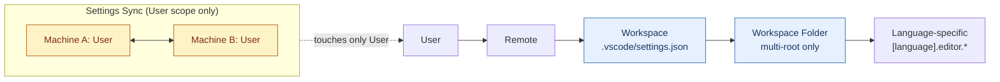

# [FEE-1617] Shared VS Code Workspace Settings and `extensions.json` Recommendations

:::info
Visual Studio Code splits configuration into User scope (the per-developer profile) and Workspace scope (the per-project `.vscode/` folder committed to version control). Workspace scope covers four canonical files — `settings.json`, `extensions.json`, `launch.json`, `tasks.json` — plus an optional `*.code-workspace` for multi-root setups. Treating `.vscode/` as a committed contract eliminates the "works on my editor" class of failures: every clone gets the same formatter, the same recommended extensions, the same debug entry points, and the same task graph. This article describes that contract, the precedence rules behind it, and what each file should and should not contain.
:::

## Context

VS Code separates two storage locations for configuration. User settings "apply globally to any instance of VS Code you open"; Workspace settings are "stored inside your workspace and only apply when the workspace is opened" ([VS Code, "User and Workspace Settings"](https://code.visualstudio.com/docs/configure/settings)). The workspace file is on disk at a fixed path: "VS Code stores workspace settings at the root of the project in a `.vscode` folder" (same source). This split is what makes a repository self-describing: a teammate cloning the project inherits the workspace configuration without copying anything from another developer's profile.

Extensions follow the same pattern. The marketplace docs note that "a good set of extensions can make working with a particular workspace or programming language more productive and you'd often like to share this list with your team or colleagues," and the `Extensions: Configure Recommended Extensions (Workspace Folder)` command "creates an `extensions.json` file located in the workspace `.vscode` folder where you can add a list of extensions identifiers (`{publisherName}.{extensionName}`)" ([VS Code, "Extension Marketplace"](https://code.visualstudio.com/docs/configure/extensions/extension-marketplace)). When a workspace is opened for the first time, VS Code prompts the user to install the recommendations.

The `.vscode/` folder thus acts as a committed contract: it encodes the project's editor expectations alongside its source code, which means it travels through code review and respects branch history. The remaining files in the folder (`launch.json` for debugger entry points and `tasks.json` for build/test orchestration) extend the same contract to debugging and task automation.

## Scenario

A new engineer joins a team and opens the repo in VS Code. Before realizing the project standardizes on Biome, they install five overlapping extensions (ESLint, Prettier, two import sorters, and a JSON validator), every one of which fights Biome's formatter on save. Two days later, a different engineer pushes a commit that breaks ESLint for everyone else: their User-scope `eslint.options` had silently overridden the workspace setting, so their local builds passed while CI failed.

Both failure modes share a root cause: the team had no committed editor contract. The fix is the same in both cases. Add `.vscode/extensions.json` with `recommendations: ["biomejs.biome"]` and `unwantedRecommendations: ["dbaeumer.vscode-eslint", "esbenp.prettier-vscode"]` so the first developer is steered toward Biome and warned away from the conflicting tools. Add `.vscode/settings.json` pinning the formatter and language overrides at workspace scope, so any User-scope drift on the second developer's machine is overridden the moment the workspace opens. The committed `.vscode/` contract turns these from recurring incidents into a one-time setup.

## Best Practices

- **MUST** commit `.vscode/settings.json`, `.vscode/extensions.json`, `.vscode/launch.json`, and `.vscode/tasks.json` to version control when they encode team-wide expectations: each file lives at "the root of the project in a `.vscode` folder" precisely so it can travel with the repo ([VS Code, "User and Workspace Settings"](https://code.visualstudio.com/docs/configure/settings)).
- **MUST NOT** attempt to commit application-wide settings (updates, telemetry, security): "application-wide settings related to updates and security can not be overridden by Workspace settings... For enhanced security, such settings can only be defined in user settings and not at workspace scope" (same source). Putting them in `.vscode/settings.json` is silently ignored at best.
- **MUST NOT** rely on Settings Sync to coordinate team configuration. Settings Sync covers "Settings, Keyboard shortcuts, User snippets, User tasks, UI State, Extensions, Profiles" — all User scope ([VS Code, "Settings Sync"](https://code.visualstudio.com/docs/configure/settings-sync)). Workspace files (`.vscode/*`, `*.code-workspace`) are committed via VCS, never synced.
- **SHOULD** curate `recommendations` per repo so first-time openers see a focused prompt: VS Code "prompts a user to install the recommended extensions when a workspace is opened for the first time" ([VS Code, "Extension Marketplace"](https://code.visualstudio.com/docs/configure/extensions/extension-marketplace)). A list of 30 recommendations trains developers to dismiss the prompt; a list of 3-7 they install.
- **SHOULD** populate `unwantedRecommendations` for extensions that conflict with the project's chosen tools, suppressing VS Code's own marketplace suggestions for the workspace ([microsoft/vscode `extensionsFileTemplate.ts`](https://github.com/microsoft/vscode/blob/main/src/vs/workbench/contrib/extensions/common/extensionsFileTemplate.ts)).
- **SHOULD** remember that precedence cascades User → Remote → Workspace → Workspace Folder → Language-specific, where "later scopes override earlier scopes" ([VS Code, "User and Workspace Settings"](https://code.visualstudio.com/docs/configure/settings)). Workspace settings deliberately win over a developer's User scope for project-relevant keys.
- **MAY** use a `*.code-workspace` file for multi-repo or monorepo setups when several folders need to open as one logical workspace ([VS Code, "Multi-root Workspaces"](https://code.visualstudio.com/docs/editing/workspaces/multi-root-workspaces)).

## Design Thinking

The single calibration that organizes everything else in this article is the User-vs-Workspace boundary. Workspace files ride with VCS and reach every clone; User files ride with Settings Sync and reach every machine of one developer. The two transports never overlap, and pretending they do is what produces inconsistent teams.

That boundary forces three concrete trade-offs:

1. *Reach vs. autonomy.* Pinning a formatter at workspace scope guarantees consistency across the team but takes a setting out of each developer's User scope control. The workspace wins ties on shared keys; that is the point.
2. *Strictness vs. portability.* Application-wide and security-scope settings cannot be set at workspace scope at all, so any "lock down telemetry for the team" wish must be enforced outside VS Code (org policy, MDM). This boundary is intentional: workspace files are repo content and must not be allowed to weaken host security.
3. *Recommendation breadth vs. signal.* `recommendations` is a soft prompt, not a requirement; over-stuffing it weakens the signal and trains developers to dismiss the install dialog. A short, curated list does the work that a long list undoes.

The Settings Sync surface is a useful negative example. It deliberately syncs User scope only (Workspace and machine-overridable settings are out of band) because syncing repo content across machines would override what the repo itself says. The split is the contract.

## Deep Dive

**Object merge vs. primitive override.** When the same key is set at multiple scopes, "values with primitive types and Array types are overridden, meaning a configured value in a scope that takes precedence over another scope is used instead of the value in the other scope. But, values with Object types are merged" ([VS Code, "User and Workspace Settings"](https://code.visualstudio.com/docs/configure/settings)). In practice this means a User-scope `editor.tokenColorCustomizations` object is *merged* with a Workspace-scope object key by key, while a User-scope `eslint.validate` array is *replaced* wholesale by the Workspace array. Mistaking one for the other produces silent drift.

**Compound launch configurations.** A single `Run` action can start multiple debug sessions: "you can define compound launch configurations in the `compounds` property in the `launch.json` file" ([VS Code, "Debugging Configuration"](https://code.visualstudio.com/docs/debugtest/debugging-configuration)). The typical use is a Node server plus a frontend dev server attached as one logical session.

**Task composition.** Tasks "compose tasks out of simpler tasks with the `dependsOn` property." Two semantics matter: "if you list more than one task in the `dependsOn` property, they are executed in parallel by default" and "if you specify `\"dependsOrder\": \"sequence\"`, then your task dependencies are executed in the order they are listed in `dependsOn`" ([VS Code, "Tasks"](https://code.visualstudio.com/docs/debugtest/tasks)). The default is parallel; serial composition is opt-in. Build pipelines that mistakenly assume serial-by-default produce non-deterministic failures the first time the parallel branches race on a shared output.

**Multi-root precedence.** Inside a `*.code-workspace`, "global Workspace settings override User settings and folder settings can override Workspace or User settings," but "only resource (file, folder) settings are applied when using a multi-root workspace. Settings that affect the entire editor (for example, UI layout) are ignored" at folder scope ([VS Code, "Multi-root Workspaces"](https://code.visualstudio.com/docs/editing/workspaces/multi-root-workspaces)). Folder-level overrides target file-resource settings; window-level UI settings stay at the workspace root.

## Visual

The settings precedence ladder, with the Settings Sync transport shown as a parallel arrow that touches User scope only.



Reading the ladder: each step on the left-to-right chain overrides the one before it. Workspace scope (committed to VCS) overrides User scope (synced via Settings Sync), which is the entire point of the `.vscode/` folder. Language-specific blocks override their non-language-specific counterparts even when the non-language scope is otherwise narrower.

## Example

A minimal but realistic `.vscode/` for a Node + TypeScript project using Biome.

`.vscode/extensions.json`:

```json
{
  "recommendations": [
    "biomejs.biome",
    "ms-vscode.vscode-typescript-next",
    "vitest.explorer"
  ],
  "unwantedRecommendations": [
    "dbaeumer.vscode-eslint",
    "esbenp.prettier-vscode"
  ]
}
```

The `recommendations` array uses `${publisher}.${extension}` IDs, exactly as documented for the marketplace ([VS Code, "Extension Marketplace"](https://code.visualstudio.com/docs/configure/extensions/extension-marketplace)). `unwantedRecommendations` suppresses VS Code's own suggestions for ESLint and Prettier in this workspace, per the schema in [microsoft/vscode `extensionsFileTemplate.ts`](https://github.com/microsoft/vscode/blob/main/src/vs/workbench/contrib/extensions/common/extensionsFileTemplate.ts).

`.vscode/settings.json`:

```json
{
  "editor.tabSize": 2,
  "editor.defaultFormatter": "biomejs.biome",
  "editor.formatOnSave": true,
  "[typescript]": {
    "editor.defaultFormatter": "biomejs.biome"
  },
  "[json]": {
    "editor.defaultFormatter": "biomejs.biome"
  }
}
```

Language-specific blocks override the non-language defaults for `.ts` and `.json` files even when a User-scope setting would otherwise win.

`.vscode/launch.json`:

```json
{
  "version": "0.2.0",
  "configurations": [
    {
      "type": "node",
      "request": "launch",
      "name": "Debug server",
      "program": "${workspaceFolder}/src/index.ts",
      "runtimeArgs": ["--import", "tsx"],
      "console": "integratedTerminal"
    }
  ]
}
```

The required `type`, `request`, and `name` keys, with `version: "0.2.0"`, follow the documented schema ([VS Code, "Debugging Configuration"](https://code.visualstudio.com/docs/debugtest/debugging-configuration)).

`.vscode/tasks.json`:

```json
{
  "version": "2.0.0",
  "tasks": [
    {
      "label": "build",
      "type": "shell",
      "command": "pnpm",
      "args": ["build"]
    },
    {
      "label": "test",
      "type": "shell",
      "command": "pnpm",
      "args": ["test"]
    },
    {
      "label": "ci",
      "dependsOn": ["build", "test"],
      "dependsOrder": "sequence"
    }
  ]
}
```

The `ci` task runs `build` then `test` serially because `dependsOrder` is set to `"sequence"`; without it, the two would run in parallel ([VS Code, "Tasks"](https://code.visualstudio.com/docs/debugtest/tasks)).

## .vscode/ File Reference

Per-file purpose, schema source, and the failure mode of putting the wrong content in each.

| File | Purpose | Schema source | What NOT to put here |
| --- | --- | --- | --- |
| `.vscode/settings.json` | Workspace-scope editor and language settings that apply when the workspace is opened. | [VS Code, "User and Workspace Settings"](https://code.visualstudio.com/docs/configure/settings) | Application-wide settings (updates, telemetry, security) — they cannot be overridden at workspace scope and are ignored. Machine-scope settings — they belong in User scope. Personal preferences (font family, color theme) — keep in User scope so they don't override teammates. |
| `.vscode/extensions.json` | Per-workspace extension recommendations and the workspace's list of VS-Code-suggested extensions to suppress. | [VS Code, "Extension Marketplace"](https://code.visualstudio.com/docs/configure/extensions/extension-marketplace); `unwantedRecommendations` from [microsoft/vscode `extensionsFileTemplate.ts`](https://github.com/microsoft/vscode/blob/main/src/vs/workbench/contrib/extensions/common/extensionsFileTemplate.ts) | A grab-bag of every editor extension a developer likes — the prompt is dismissed when it's noisy. Vendor-specific extensions for tools the project doesn't actually use. |
| `.vscode/launch.json` | Debugger configurations under `version: "0.2.0"`, with required `type`, `request`, and `name` per entry, plus optional `compounds`. | [VS Code, "Debugging Configuration"](https://code.visualstudio.com/docs/debugtest/debugging-configuration) | Absolute paths from one developer's machine — use `${workspaceFolder}` and other variables. Secrets (tokens, passwords) — `launch.json` is checked in. |
| `.vscode/tasks.json` | Workspace-scoped task graph: shell or process tasks composable via `dependsOn` with optional `dependsOrder`. | [VS Code, "Tasks"](https://code.visualstudio.com/docs/debugtest/tasks) | Personal shell aliases or ad-hoc commands — those belong in User tasks. Tasks assuming `dependsOn` is serial — it is parallel by default; set `"dependsOrder": "sequence"` when order matters. |
| `*.code-workspace` | Multi-root workspace descriptor: `folders`, `settings`, and `extensions` keys describing several folders opened as one workspace. | [VS Code, "Multi-root Workspaces"](https://code.visualstudio.com/docs/editing/workspaces/multi-root-workspaces) | UI-layout settings at folder scope — they are ignored; only resource settings apply per folder. Absolute folder paths if the file ships in a repo — prefer relative paths so the workspace is portable. |

## Internal References

- [Editor & IDE Integration (LSP)](/en/Developer%20Experience%20and%20Tooling/1606) — covers the broader LSP and extension surface; this article narrows to the *committed* `.vscode/` repo contract that overlays it.
- [Code Formatting & EditorConfig](/en/Developer%20Experience%20and%20Tooling/1602) — `.vscode/settings.json` and `.editorconfig` overlap on formatter behavior; the EditorConfig file is the cross-editor floor, while `.vscode/settings.json` adds VS-Code-specific overrides on top.

## References

- Microsoft, "User and Workspace Settings," VS Code Documentation (n.d.). https://code.visualstudio.com/docs/configure/settings
- Microsoft, "Extension Marketplace," VS Code Documentation (n.d.). https://code.visualstudio.com/docs/configure/extensions/extension-marketplace
- Microsoft, "Debugging Configuration," VS Code Documentation (n.d.). https://code.visualstudio.com/docs/debugtest/debugging-configuration
- Microsoft, "Tasks in Visual Studio Code," VS Code Documentation (n.d.). https://code.visualstudio.com/docs/debugtest/tasks
- Microsoft, "Workspaces in Visual Studio Code," VS Code Documentation (n.d.). https://code.visualstudio.com/docs/editing/workspaces/workspaces
- Microsoft, "Multi-root Workspaces," VS Code Documentation (n.d.). https://code.visualstudio.com/docs/editing/workspaces/multi-root-workspaces
- Microsoft, "Settings Sync," VS Code Documentation (n.d.). https://code.visualstudio.com/docs/configure/settings-sync
- Microsoft, "extensionsFileTemplate.ts," microsoft/vscode (GitHub source). https://github.com/microsoft/vscode/blob/main/src/vs/workbench/contrib/extensions/common/extensionsFileTemplate.ts
