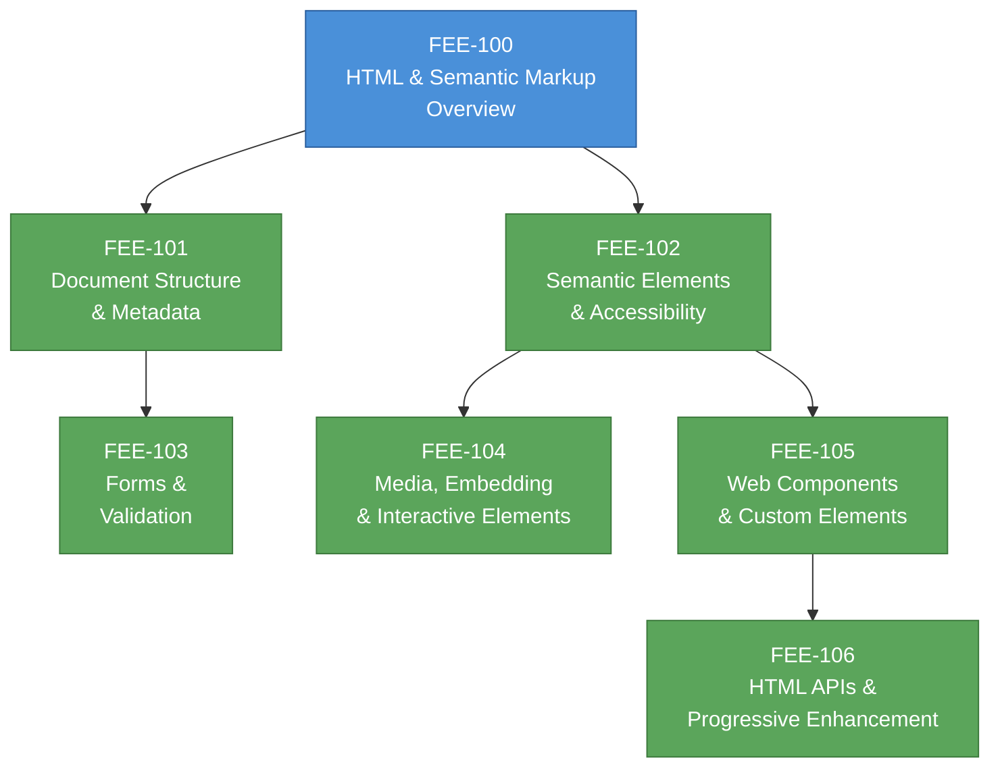

# [FEE-100] HTML & Semantic Markup Overview

:::info
This category covers HTML as the structural and semantic foundation of the web -- from document structure and metadata through semantic elements, forms, media, Web Components, and progressive enhancement via HTML APIs.
:::

## Context

HTML (HyperText Markup Language) is the web's foundational markup language. Every web page, regardless of which framework or build tool produced it, is ultimately an HTML document that the browser parses into a DOM tree. HTML defines what the content *is* -- headings, paragraphs, navigation, forms, images -- before CSS styles it and JavaScript adds behavior.

### Origins

Tim Berners-Lee invented the World Wide Web at CERN in 1989 and wrote the first HTML specification in 1991. The original language had roughly 20 tags, most borrowed from SGML, and was designed for a single purpose: linking scientific documents across networks. The first browser, "WorldWideWeb" (later renamed Nexus), was both a viewer and an editor -- Berners-Lee envisioned the web as a read-write medium from the start.

### Evolution

| Era | Year(s) | What changed |
|-----|---------|-------------|
| **HTML 1.0** | 1991 | Berners-Lee's original 20-tag draft. Links, headings, lists, paragraphs. |
| **HTML 2.0** | 1995 | First formal IETF standard (RFC 1866). Added forms and basic interactivity. |
| **HTML 3.2 / 4.01** | 1997-1999 | W3C Recommendations. Tables, scripts, stylesheets, internationalization. HTML 4.01 introduced strict/transitional/frameset doctypes. |
| **XHTML 1.0** | 2000 | HTML reformulated as XML. Strict syntax rules. Gained traction but XML error handling proved impractical for the web. |
| **HTML5** | 2008-2014 | WHATWG began work in 2004. New semantic elements, native audio/video, Canvas, localStorage, Web Workers. W3C published as a Recommendation in 2014. |
| **HTML Living Standard** | 2019+ | WHATWG and W3C agreed on a single "Living Standard" maintained by WHATWG. No more version numbers -- HTML is continuously updated. |

### The Living Standard

Since 2019, there is one authoritative HTML specification: the WHATWG HTML Living Standard. The "living" model means the spec is never frozen; new features are added, bugs are fixed, and browser implementors work directly on the specification. There is no "HTML6" -- HTML is simply HTML, continuously evolving.

This is a deliberate departure from the traditional standards model of numbered versions. The rationale: the web never stops evolving, so a specification that claims to be "finished" is immediately outdated. The living standard reflects what browsers actually implement, not an aspirational document that may never ship.

### Why HTML matters for frontend engineers

Modern frameworks generate HTML. React's JSX, Vue's templates, and Angular's component templates all compile down to HTML elements in the DOM. When accessibility audits fail, when screen readers misbehave, when SEO rankings drop, or when a form does not validate -- the root cause is almost always in the HTML layer. Engineers who understand HTML semantics write markup that works correctly with browsers, assistive technologies, and search engines without extra effort.

## Scenario

You are reviewing a pull request where a junior developer has built a feature entirely with `
` and `` elements. Screen readers announce the content as an undifferentiated wall of text, and automated accessibility audits report zero landmark regions. The core issue is not a styling problem — it is a structural one. HTML's semantic elements exist precisely to solve this: they communicate meaning to browsers, assistive technologies, and search engines without requiring additional attributes or JavaScript.

## Design Thinking

### Why HTML is separate from CSS and JavaScript

The web platform is built on a deliberate **separation of concerns**:

- **HTML** declares structure and semantics (what the content *is*)
- **CSS** declares presentation (how the content *looks*)
- **JavaScript** declares behavior (how the content *responds*)

This separation was not inevitable. Early web proposals (including some by Microsoft and Netscape) mixed structure and presentation into a single language. The W3C and the web community chose separation for practical reasons:

1. **Accessibility.** When structure is expressed semantically, assistive technologies (screen readers, braille displays, voice controllers) can interpret and navigate content without relying on visual cues. A `<nav>` element communicates "navigation" to any consumer of the document, not just sighted users.

2. **Portability.** The same HTML document can be rendered by a desktop browser, a mobile browser, a screen reader, a search engine crawler, a read-it-later app, or a printer -- each applying its own styles and ignoring those that do not apply. This only works if the document's meaning is independent of its presentation.

3. **Maintainability.** Separation means a designer can restyle a site without touching the markup, and a developer can restructure the markup without rewriting the CSS. In practice this ideal is imperfect, but it remains the guiding principle.

4. **Progressive enhancement.** HTML is the baseline that works everywhere. CSS enhances the experience visually; JavaScript enhances it interactively. If CSS or JS fails to load, a well-structured HTML document is still usable. This resilience is only possible because HTML carries meaning on its own.

### The document vs. application tension

HTML was designed for documents: articles, reports, specifications. The modern web also builds applications: spreadsheets, video editors, chat clients. This creates a fundamental tension:

- **Document-oriented HTML** emphasizes semantic structure: headings, paragraphs, lists, landmarks. The browser provides built-in behavior (scrolling, text selection, link navigation, form submission).
- **Application-oriented HTML** often treats the DOM as a rendering target, using generic `
` containers styled and scripted into custom UI. The browser's built-in semantics may conflict with the application's own interaction model.

The best frontend engineering navigates this tension rather than choosing one extreme. Even in complex applications, using semantic elements where they fit (buttons for actions, links for navigation, form elements for input) reduces code, improves accessibility, and leverages browser optimizations. The articles in this category (FEE-101 through FEE-106) build the judgment to make these tradeoffs well.

## Visual

**Reading order:** Start with document structure (101) and semantic elements (102) -- these are the foundation. Forms (103) builds on document structure knowledge. Media and embedding (104) and Web Components (105) extend semantic concepts. HTML APIs and progressive enhancement (106) ties everything together and connects forward to JavaScript (FEE-300).

## Related FEEs

| FEE | Relationship |
|-----|-------------|
| [FEE-200 CSS & Layout Systems](../CSS%20and%20Layout%20Systems/200.md) | CSS styles the structure that HTML provides. Understanding semantic HTML helps you write selectors that are meaningful and maintainable. |
| [FEE-300 JavaScript Core & Runtime](../JavaScript%20Core%20and%20Runtime/300.md) | JavaScript manipulates the DOM that HTML creates. HTML APIs (FEE-106) bridge into the JavaScript runtime. |
| [FEE-500 Component Architecture](../Component%20Architecture%20and%20Design%20Patterns/500.md) | Component models (Web Components, React, Vue) generate HTML. Understanding native HTML semantics is essential for building accessible components. |

## References

- [WHATWG HTML Living Standard](https://html.spec.whatwg.org/) -- The single authoritative HTML specification, continuously maintained by the WHATWG
- [WHATWG HTML Living Standard -- Introduction](https://html.spec.whatwg.org/dev/introduction.html) -- The spec's own introduction explaining scope, design principles, and the living standard model
- [MDN: HTML -- HyperText Markup Language](https://developer.mozilla.org/en-US/docs/Web/HTML) -- Comprehensive reference and learning resource for all HTML elements, attributes, and APIs
- [MDN: Semantic HTML (Curriculum)](https://developer.mozilla.org/en-US/curriculum/core/semantic-html/) -- MDN's structured curriculum module on semantic HTML best practices
- [W3C: A History of HTML](https://www.w3.org/People/Raggett/book4/ch02.html) -- Dave Raggett's account of HTML's development from CERN to W3C standardization
- [Tim Berners-Lee: A Short History of the Web](https://www.w3.org/People/Berners-Lee/ShortHistory.html) -- The inventor's own account of the Web's origins and design goals
