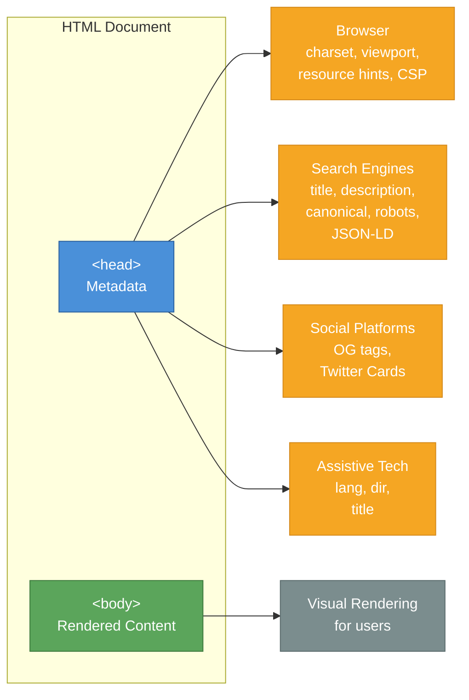
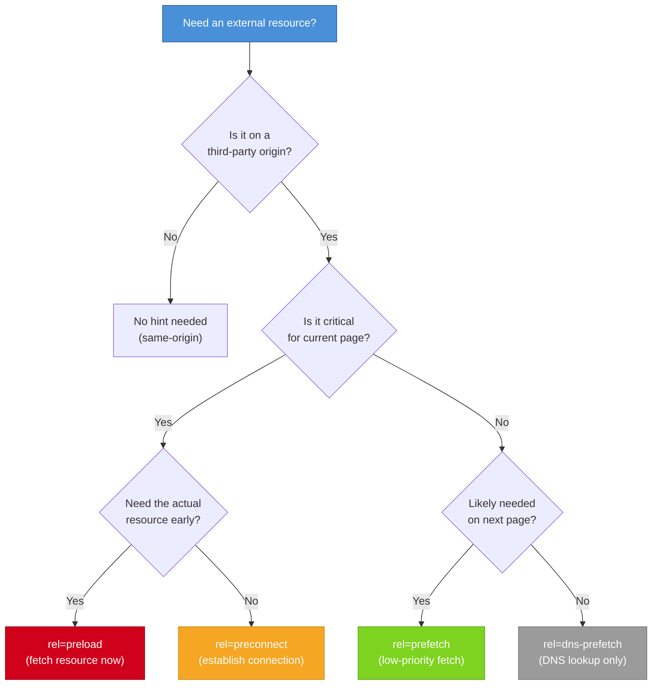

# [FEE-101] Document Structure & Metadata

:::info
Every HTML document begins with a predictable skeleton -- DOCTYPE, `<html>`, `<head>`, `<body>` -- and carries metadata that browsers, search engines, social platforms, and assistive technologies consume before a single pixel is painted. Getting this foundation right affects performance, SEO, accessibility, and social sharing.
:::

## Context

An HTML document is not just what users see. Before the browser renders any content, it reads the document's metadata: character encoding, viewport configuration, page title, resource hints, and structured data. These invisible declarations determine how the page is parsed, displayed, indexed, shared, and announced to assistive technologies.

The HTML Living Standard specifies a clear content model for the `<head>` element: it MUST contain a `<title>` (except in certain iframe contexts), it SHOULD declare the character encoding in the first 1024 bytes, and it MAY contain any number of `<meta>`, `<link>`, `<style>`, `<script>`, and `<base>` elements. No rendered content belongs in `<head>` -- that is what `<body>` is for.

### The document skeleton

Every HTML document follows this structure:

```html
<!DOCTYPE html>
<html lang="en" dir="ltr">
  <head>
    <meta charset="utf-8" />
    <meta name="viewport" content="width=device-width, initial-scale=1" />
    <title>Page Title</title>
    <!-- other metadata, resource hints, styles, scripts -->
  </head>
  <body>
    <!-- rendered content -->
  </body>
</html>
```

**`<!DOCTYPE html>`** -- Tells the browser to use standards mode rather than quirks mode. Without it, browsers fall back to legacy rendering behaviors that differ across vendors.

**`<html lang="en" dir="ltr">`** -- The root element. The `lang` attribute declares the document's primary language (BCP 47 code), which screen readers use for pronunciation, browsers use for hyphenation and spell-checking, and search engines use for language detection. The `dir` attribute declares text direction (`ltr` or `rtl`).

**`<head>`** -- Contains machine-readable metadata. Nothing inside `<head>` is rendered to the page.

**`<body>`** -- Contains all rendered content.

## Scenario

You are preparing a marketing landing page for international launch. The design is complete, but the page renders incorrectly in some browsers — the viewport is not respected on mobile, the language is not declared, and social media link previews show no image or title. Each of these problems traces to a missing or misconfigured element in the document `<head>`. The document `<head>` is invisible to users but controls how every browser, crawler, and platform interprets and presents the page.

## Design Thinking

### Why `<head>` exists: metadata consumers

The separation of `<head>` and `<body>` reflects a fundamental design principle: a document carries information for multiple consumers, not just human readers. The `<head>` exists to serve four distinct audiences:



Each consumer reads different metadata:

| Consumer | Reads | Purpose |
|----------|-------|---------|
| **Browser** | charset, viewport, CSP, resource hints, theme-color | Parsing, rendering, security, performance |
| **Search engines** | title, description, canonical, robots, JSON-LD | Indexing, ranking, rich results |
| **Social platforms** | OG tags, Twitter Cards | Link preview cards |
| **Assistive tech** | lang, dir, title | Language switching, reading direction, page identification |

### Ordering matters inside `<head>`

The browser processes `<head>` elements in document order. The recommended ordering:

1. `<meta charset>` -- MUST be in the first 1024 bytes
2. `<meta name="viewport">` -- before any CSS to avoid layout thrashing
3. `<title>` -- required by the spec
4. `<meta name="description">` -- for search engines
5. `<link rel="preconnect">` / `<link rel="dns-prefetch">` -- early connections
6. `<link rel="stylesheet">` -- render-blocking CSS
7. `<link rel="preload">` -- critical resources not yet discovered
8. `<script>` (with `defer` or `async`) -- non-blocking scripts
9. Open Graph / Twitter Card meta tags
10. JSON-LD structured data
11. `<link rel="icon">` / `<link rel="manifest">` -- favicons and PWA

### Framework metadata patterns

Modern frameworks abstract `<head>` management because SPA route changes do not trigger full page loads. Each framework provides a different API, but the underlying problem is the same: keeping document metadata in sync with the current route.

**Next.js (App Router)** -- `generateMetadata` async function or static `metadata` export:

```tsx
// app/about/page.tsx
export const metadata = {
  title: 'About Us',
  description: 'Learn about our team',
  openGraph: { title: 'About Us', images: ['/og-about.png'] },
};
```

**Nuxt 3** -- `useHead()` and `useSeoMeta()` composables:

```vue
<script setup>
useSeoMeta({
  title: 'About Us',
  description: 'Learn about our team',
  ogTitle: 'About Us',
  ogImage: '/og-about.png',
});
</script>
```

**Astro** -- frontmatter props passed to a `<head>` in the layout:

```astro
---
// src/layouts/Base.astro
const { title, description } = Astro.props;
---
<html lang="en">
  <head>
    <meta charset="utf-8" />
    <meta name="viewport" content="width=device-width, initial-scale=1" />
    <title>{title}</title>
    <meta name="description" content={description} />
  </head>
  <body><slot /></body>
</html>
```

**SvelteKit** -- `svelte:head` special element:

```svelte
<svelte:head>
  <title>About Us</title>
  <meta name="description" content="Learn about our team" />
</svelte:head>
```

**Remix** -- `meta` export function:

```tsx
export const meta = () => [
  { title: 'About Us' },
  { name: 'description', content: 'Learn about our team' },
  { property: 'og:title', content: 'About Us' },
];
```

The common pattern: frameworks let you declare metadata per route, then handle the DOM mutations (inserting, updating, or removing `<head>` elements) on navigation.

## Best Practices

**MUST declare `charset` and `viewport` as the first two meta tags.** Every HTML document MUST include `<meta charset="utf-8">` within the first 1024 bytes and `<meta name="viewport" content="width=device-width, initial-scale=1">` before any CSS. Without `charset`, the browser guesses the encoding and can produce garbled text. Without `viewport`, mobile browsers render at desktop width and scale down, making text and touch targets unusable.

**MUST include `lang` (and `dir` where applicable) on the `<html>` element.** Always declare the document's primary language using a BCP 47 tag on the root element. For right-to-left languages, also add `dir="rtl"`. Screen readers rely on `lang` to select the correct voice profile; search engines use it for language indexing; browsers use it for hyphenation and spell-checking. Omitting `lang` forces every consumer to guess.

**SHOULD follow the recommended `<head>` element ordering.** Place `<meta charset>` first, `<meta name="viewport">` second, then `<title>`, description, resource hints, stylesheets, preloads, scripts, social tags, and JSON-LD in that order. The browser processes `<head>` elements in document order, so placing `charset` and `viewport` late can cause encoding ambiguity or layout thrashing before CSS loads.

**SHOULD use resource hints for critical third-party origins.** Use `<link rel="preconnect">` for third-party origins needed on the current page (font CDNs, API endpoints) and `<link rel="dns-prefetch">` for less critical ones. Preconnect performs DNS lookup, TCP handshake, and TLS negotiation early, saving 100–500 ms on the critical path. Avoid applying `preconnect` indiscriminately -- each open connection consumes browser resources.

**MUST specify the `as` attribute when using `<link rel="preload">`.** Always include the correct `as` value (`font`, `script`, `style`, `image`, etc.) and `crossorigin` when preloading fonts. Without `as`, the browser cannot set the correct fetch priority or apply CSP checks, and most browsers will double-fetch the resource -- once from preload and once from the element that actually uses it.

**AVOID placing rendered content inside `<head>`.** Keep only metadata elements (`<meta>`, `<title>`, `<link>`, `<style>`, `<script>`, `<base>`, `<noscript>`) inside `<head>`. When the parser encounters flow content (such as `<p>`) inside `<head>`, it implicitly closes `<head>` and opens `<body>`, causing any metadata declared after that point to be ignored -- leading to missing stylesheets and broken resource hints.

**SHOULD use framework-provided metadata APIs in SPAs rather than manually setting `document.title`.** Single-page applications do not trigger full page reloads on navigation, so `document.title` set once on initial load becomes stale. Use the framework's declarative API (Next.js `metadata` export, Nuxt `useSeoMeta`, SvelteKit `svelte:head`, etc.) to keep the title, description, and Open Graph tags synchronized with the current route.

## Visual

### Resource hint decision flow



### Resource hints reference

| Hint | What it does | `as` required? | Use case |
|------|-------------|----------------|----------|
| `preconnect` | DNS + TCP + TLS | No | Critical third-party origins (font CDN, API) |
| `dns-prefetch` | DNS lookup only | No | Less critical origins, broad browser support |
| `preload` | Fetches the resource | Yes | Late-discovered critical resources (fonts, hero images) |
| `prefetch` | Low-priority fetch for future navigation | Optional | Resources for the next likely page |
| `modulepreload` | Fetches + parses + compiles JS module | No | ES module dependencies in the module graph |

## Example

### 1. Complete HTML skeleton with essential metadata

```html
<!DOCTYPE html>
<html lang="en" dir="ltr">
  <head>
    <!-- Character encoding: MUST be in first 1024 bytes -->
    <meta charset="utf-8" />

    <!-- Viewport: MUST for responsive design -->
    <meta name="viewport" content="width=device-width, initial-scale=1" />

    <!-- Document title -->
    <title>Machine Learning Workshop - Spring 2026</title>

    <!-- SEO description -->
    <meta name="description"
          content="A hands-on workshop covering supervised learning, neural networks, and model deployment. April 15-17, 2026." />

    <!-- Canonical URL -->
    <link rel="canonical" href="https://example.com/workshops/ml-spring-2026" />

    <!-- Resource hints -->
    <link rel="preconnect" href="https://fonts.googleapis.com" />
    <link rel="preconnect" href="https://fonts.gstatic.com" crossorigin />
    <link rel="dns-prefetch" href="https://analytics.example.com" />

    <!-- Stylesheets -->
    <link rel="stylesheet" href="/css/main.css" />

    <!-- Preload critical font -->
    <link rel="preload" href="/fonts/inter-var.woff2"
          as="font" type="font/woff2" crossorigin />

    <!-- Theme color for browser chrome -->
    <meta name="theme-color" content="#1a73e8" />

    <!-- Favicon -->
    <link rel="icon" href="/favicon.svg" type="image/svg+xml" />

    <!-- PWA manifest -->
    <link rel="manifest" href="/manifest.json" />
  </head>
  <body>
    <h1>Machine Learning Workshop</h1>
    <!-- page content -->
  </body>
</html>
```

### 2. Open Graph and Twitter Card metadata

```html
<head>
  <!-- ... charset, viewport, title ... -->

  <!-- Open Graph -->
  <meta property="og:type" content="website" />
  <meta property="og:url" content="https://example.com/workshops/ml-spring-2026" />
  <meta property="og:title" content="Machine Learning Workshop - Spring 2026" />
  <meta property="og:description"
        content="A hands-on workshop covering supervised learning, neural networks, and model deployment." />
  <meta property="og:image" content="https://example.com/images/ml-workshop-og.png" />
  <meta property="og:image:alt" content="Workshop participants working on neural network diagrams" />
  <meta property="og:image:width" content="1200" />
  <meta property="og:image:height" content="630" />

  <!-- Twitter Card -->
  <meta name="twitter:card" content="summary_large_image" />
  <meta name="twitter:site" content="@exampleorg" />
  <meta name="twitter:title" content="Machine Learning Workshop - Spring 2026" />
  <meta name="twitter:description"
        content="A hands-on workshop covering supervised learning, neural networks, and model deployment." />
  <meta name="twitter:image" content="https://example.com/images/ml-workshop-og.png" />
  <meta name="twitter:image:alt" content="Workshop participants working on neural network diagrams" />
</head>
```

### 3. JSON-LD structured data

```html
<head>
  <!-- ... other metadata ... -->

  <script type="application/ld+json">
  {
    "@context": "https://schema.org",
    "@type": "Event",
    "name": "Machine Learning Workshop - Spring 2026",
    "description": "A hands-on workshop covering supervised learning, neural networks, and model deployment.",
    "startDate": "2026-04-15T09:00:00-07:00",
    "endDate": "2026-04-17T17:00:00-07:00",
    "location": {
      "@type": "Place",
      "name": "Tech Hub Conference Center",
      "address": {
        "@type": "PostalAddress",
        "streetAddress": "123 Innovation Drive",
        "addressLocality": "San Francisco",
        "addressRegion": "CA",
        "postalCode": "94105"
      }
    },
    "organizer": {
      "@type": "Organization",
      "name": "Example Corp",
      "url": "https://example.com"
    },
    "offers": {
      "@type": "Offer",
      "url": "https://example.com/workshops/ml-spring-2026/register",
      "price": "299",
      "priceCurrency": "USD",
      "availability": "https://schema.org/InStock"
    }
  }
  </script>
</head>
```

JSON-LD (JavaScript Object Notation for Linked Data) is the format recommended by Google for structured data. It is embedded in a `<script type="application/ld+json">` tag, typically in `<head>` (though it is valid anywhere in the document). Search engines use structured data to generate rich results -- event cards, recipe carousels, FAQ accordions, and more.

### 4. The `<base>` element

```html
<head>
  <base href="https://cdn.example.com/assets/" target="_blank" />
</head>
<body>
  <!-- This resolves to https://cdn.example.com/assets/images/logo.png -->
  
</body>
```

The `<base>` element sets the base URL for all relative URLs in the document and optionally a default `target` for links. There can be at most one `<base>` element. Use it sparingly -- it affects every relative URL in the document, including anchor links (`#section`), which can cause unexpected behavior in SPAs.

## Deep Dive

### HTML parsing and document readiness

The browser's HTML parser is synchronous by default. When it encounters a `<script>` tag without `defer` or `async`, it stops parsing, downloads the script, executes it, then resumes. This is called a **parser-blocking script**. A parser-blocking script in `<head>` delays the construction of the entire DOM -- meaning nothing below it renders until the script finishes.

**The two document readiness events** mark different milestones in this process:

- **`DOMContentLoaded`** fires when the HTML has been fully parsed and the DOM tree is built. At this point, stylesheets may still be loading and images have not necessarily downloaded. Scripts with `defer` have run; scripts with `async` may or may not have run.
- **`load`** fires when the page and all its dependent resources (stylesheets, images, iframes, fonts) have fully loaded. This is always later than `DOMContentLoaded` and can be significantly delayed on pages with large images or slow third-party resources.

Most DOM manipulation should target `DOMContentLoaded`, not `load`. Waiting for `load` is unnecessarily slow for interactive initialization.

**Script loading strategies** control when scripts execute relative to parsing:

| Strategy | Parsing blocks? | Executes when | Order guaranteed? |
|----------|----------------|---------------|-------------------|
| `<script>` (inline, no attr) | Yes | Immediately, in-order | Yes |
| `<script src>` (no attr) | Yes | After download, in-order | Yes |
| `<script src defer>` | No | After DOM parsed, before `DOMContentLoaded` | Yes |
| `<script src async>` | No | As soon as downloaded | No |
| `<script type="module">` | No | Like `defer` by default | Yes |

**Practical guidance:**

- Place `<script>` tags with `defer` in `<head>` rather than at the end of `<body>`. Defer starts downloading immediately while parsing continues, whereas end-of-body delays the download until the parser reaches it.
- Use `async` only for scripts with no dependencies and no order requirements (e.g., analytics).
- Inline scripts in `<head>` are parser-blocking; keep them minimal or move initialization into `defer`-ed external scripts.
- `<link rel="stylesheet">` is render-blocking but not parser-blocking. It does not stop the HTML parser, but it does prevent the browser from painting until the stylesheet loads.

## Common Mistakes

### 1. Duplicate or stale title on route changes (SPA)

```js
// WRONG: setting document.title only on initial load
// Title stays "Home" when navigating to /about
document.title = 'Home - My App';
```

**Impact.** Browser tabs show the wrong title. Bookmarks save incorrect names. Screen readers announce the wrong page. Search engines may index stale titles for client-rendered pages.

**Fix.** Use framework-provided metadata APIs (see Design Thinking section) or update `document.title` on every route change:

```js
router.afterEach((to) => {
  document.title = to.meta.title || 'My App';
});
```

## Related FEEs

| FEE | Relationship |
|-----|-------------|
| [FEE-100 HTML & Semantic Markup Overview](./100.md) | Parent overview. Document structure is the foundation for all HTML topics. |
| [FEE-102 Semantic Elements & Accessibility](./102.md) | Semantic elements build on top of the document skeleton established here. The `lang` and `dir` attributes introduced in this article are critical for accessibility. |
| [FEE-106 HTML APIs & Progressive Enhancement](./106.md) | Resource hints and metadata connect to browser APIs for performance optimization. The `<base>` element and `<meta http-equiv>` bridge into programmatic browser behavior. |

## References

- [WHATWG HTML Living Standard -- Document Metadata](https://html.spec.whatwg.org/dev/semantics.html) -- The authoritative specification for `<head>`, `<title>`, `<meta>`, `<link>`, and `<base>` elements
- [MDN: What's in the head? Webpage metadata](https://developer.mozilla.org/en-US/docs/Learn_web_development/Core/Structuring_content/Webpage_metadata) -- Comprehensive learning guide to HTML metadata
- [MDN: The `<meta>` element](https://developer.mozilla.org/en-US/docs/Web/HTML/Element/meta) -- Reference for all meta element attributes and standard metadata names
- [web.dev: Metadata (Learn HTML)](https://web.dev/learn/html/metadata/) -- Practical guide covering charset, viewport, OG tags, Twitter Cards, and theme-color
- [web.dev: Document Structure (Learn HTML)](https://web.dev/learn/html/document-structure) -- Guide to DOCTYPE, html, head, and body elements
- [web.dev: Resource Hints (Learn Performance)](https://web.dev/learn/performance/resource-hints) -- Performance guide for preconnect, dns-prefetch, preload, and prefetch
- [web.dev: Preconnect and dns-prefetch](https://web.dev/articles/preconnect-and-dns-prefetch) -- Deep dive into early connection establishment for third-party origins
- [Google: Structured Data Guidelines](https://developers.google.com/search/docs/appearance/structured-data/sd-policies) -- Google's policies and best practices for JSON-LD structured data
- [Schema.org](https://schema.org/) -- The collaborative vocabulary for structured data on the web
- [Google: Intro to Structured Data](https://developers.google.com/search/docs/appearance/structured-data/intro-structured-data) -- Getting started with JSON-LD and rich results
