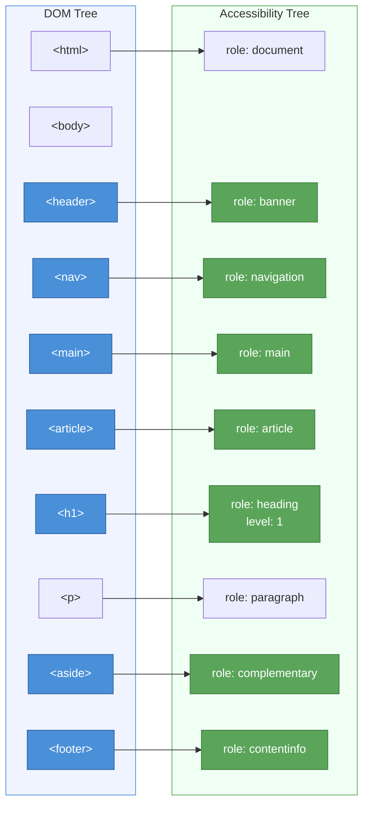
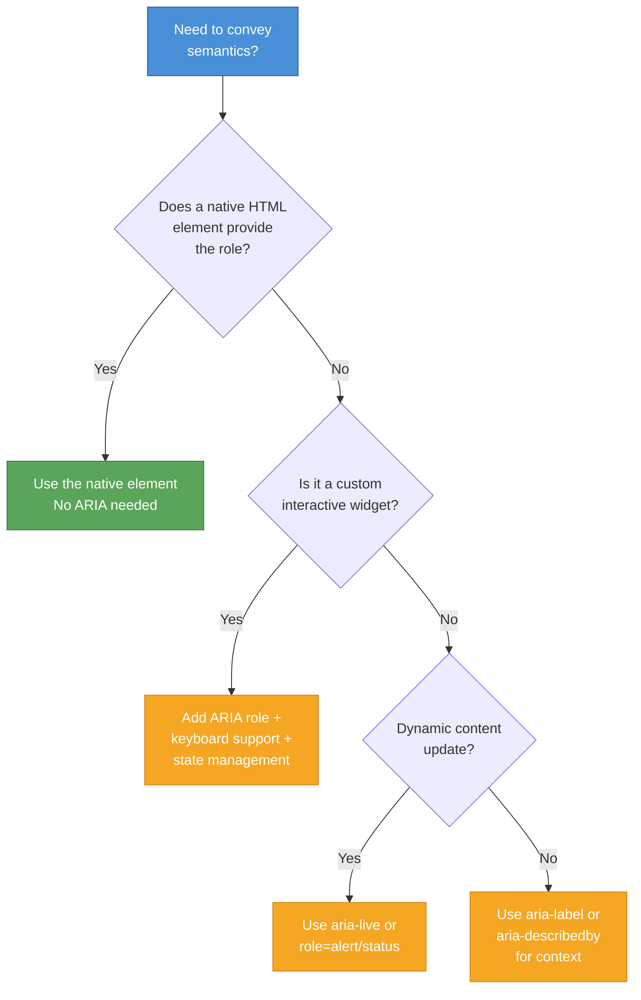

# [FEE-102] Semantic Elements & Accessibility

:::info
HTML provides over 100 elements, each carrying specific meaning. When you choose `<nav>` over `<div>`, you are not styling -- you are communicating intent to browsers, screen readers, search engines, and reading modes. Semantic markup is the foundation of web accessibility: it lets machines understand what humans see at a glance.
:::

## Context

The web was designed as a document platform. HTML elements like `<h1>`, `<p>`, and `<blockquote>` carry meaning -- they describe **what** content is, not **how** it looks. CSS handles presentation; HTML handles semantics.

When a browser parses the DOM, it builds a parallel structure called the **accessibility tree** (AOM). This tree strips away visual styling and exposes each element's **role**, **name**, **state**, and **value** to assistive technologies. A `<nav>` element automatically receives the `navigation` landmark role. A `<button>` gets the `button` role with built-in keyboard interaction. A `<div>` gets nothing -- it is semantically invisible.

The consequence: every `<div>` or `<span>` used where a semantic element exists is information lost. Screen readers cannot announce a `<div>` as a navigation region. Search engines cannot identify a `<div>` as the main content. Reader modes cannot extract an `<article>` from a page full of `<div>` elements.

ARIA (Accessible Rich Internet Applications) exists to fill gaps where HTML has no native semantic. But ARIA only modifies the accessibility tree -- it adds no behavior. A `<div role="button">` looks like a button to a screen reader but has no keyboard support, no focus management, and no form submission. The native `<button>` provides all of that for free.

### Semantic sectioning elements

HTML5 introduced sectioning elements that replace generic `<div>` containers:

| Element | Implicit ARIA Role | Purpose |
|---------|-------------------|---------|
| `<header>` | `banner` (when top-level) | Introductory content, navigation aids, logo, search |
| `<nav>` | `navigation` | Major navigation blocks |
| `<main>` | `main` | Primary content of the document (one per page) |
| `<article>` | `article` | Self-contained composition (blog post, comment, widget) |
| `<section>` | `region` (when labeled) | Thematic grouping with a heading |
| `<aside>` | `complementary` | Tangentially related content (sidebar, pull quote) |
| `<footer>` | `contentinfo` (when top-level) | Footer information, copyright, contact links |

When `<header>` or `<footer>` is nested inside `<article>`, `<aside>`, `<nav>`, or `<section>`, it loses its landmark role and becomes a generic container within that section.

### Text-level semantics

Beyond sectioning, HTML provides elements for inline meaning:

| Element | Purpose | Example |
|---------|---------|---------|
| `<h1>`-`<h6>` | Heading hierarchy (document outline) | `<h1>Page Title</h1>` |
| `<p>` | Paragraph of text | `<p>A paragraph.</p>` |
| `<blockquote>` | Extended quotation from another source | `<blockquote cite="...">` |
| `<cite>` | Title of a referenced work | `<cite>HTML Living Standard</cite>` |
| `<abbr>` | Abbreviation or acronym | `<abbr title="World Wide Web">WWW</abbr>` |
| `<time>` | Machine-readable date/time | `<time datetime="2026-04-09">April 9</time>` |
| `<mark>` | Highlighted/relevant text | `<mark>important</mark>` |
| `<code>` | Fragment of computer code | `<code>const x = 1</code>` |
| `<em>` | Stress emphasis (not just italic) | `<em>really</em> important` |
| `<strong>` | Strong importance (not just bold) | `<strong>Warning:</strong>` |

## Principle

The following principles use RFC 2119 keywords.

### MUST: Use semantic elements over generic containers

Authors **MUST** use the most specific semantic HTML element available for the content's purpose, rather than a generic `<div>` or `<span>` with CSS styling or ARIA roles.

**Rationale.** Semantic elements provide implicit ARIA roles, keyboard behavior, and browser-native features (focus management, form submission, validation) at zero cost. Using a `<div>` and recreating this behavior with JavaScript and ARIA is error-prone and incomplete. The WebAIM Million analysis found that pages with ARIA present averaged 70% more detected accessibility errors than those without -- not because ARIA is harmful, but because developers use ARIA to patch what semantic HTML would have provided natively.

### SHOULD NOT: Add ARIA when a native element provides the same role

Authors **SHOULD NOT** add ARIA roles, states, or properties to elements that already expose the same semantics natively. This is the first rule of ARIA: "If you can use a native HTML element or attribute with the semantics and behavior you require already built in, instead of re-purposing an element and adding an ARIA role, state or property to make it accessible, then do so."

**Rationale.** Redundant ARIA (e.g., `<nav role="navigation">`) is harmless but noisy -- it signals the developer does not understand the native semantics and may be applying ARIA incorrectly elsewhere. Worse, incorrect ARIA overrides native semantics: `<nav role="banner">` changes the element's role from navigation to banner, breaking the accessibility tree.

### MUST: Maintain heading level hierarchy

Authors **MUST** maintain a logical heading hierarchy (`<h1>` through `<h6>`) without skipping levels. Every page **SHOULD** have exactly one `<h1>`.

**Rationale.** Screen reader users navigate by heading level. Skipping from `<h2>` to `<h4>` creates a gap that implies a missing subsection. Heading structure is the primary navigation mechanism for screen reader users -- 67.7% of screen reader users navigate by headings, according to WebAIM's screen reader user survey.

### MUST: Provide accessible names for interactive elements

Every interactive element **MUST** have an accessible name. For form controls, use `<label>`. For other interactive elements, use visible text content, `aria-label`, or `aria-labelledby`.

**Rationale.** An interactive element without an accessible name is announced by screen readers only by its role (e.g., "button" with no label). The user has no way to know what the button does.

## Design Thinking

### Why semantics matter: three audiences beyond humans

Semantic markup serves machines that interpret your page:

1. **Screen readers** traverse the accessibility tree, announcing roles and names. A `<nav>` is announced as "navigation landmark"; a `<div>` is silent.
2. **Search engines** use semantic structure to understand content hierarchy, identify main content, and extract structured information for rich results.
3. **Reader modes** (Safari Reader, Firefox Reader View) strip away navigation and ads by identifying `<article>`, `<main>`, and heading hierarchy.

The DOM is what you write. The accessibility tree is what assistive technologies read. Semantic HTML ensures these two structures align.

### The accessibility tree: from DOM to AOM

When the browser parses HTML, it creates the DOM tree. From the DOM, it builds the **accessibility tree** (also called the Accessibility Object Model, or AOM). Each node in the accessibility tree exposes four properties:

- **Role** -- what the element is (button, navigation, heading)
- **Name** -- what the element is called (button label, heading text)
- **State** -- current condition (checked, expanded, disabled)
- **Value** -- current value (input text, slider position)

Semantic elements map to roles automatically. ARIA can override or supplement these mappings, but ARIA never adds behavior -- only semantics.

### Framework mapping: where "div soup" comes from

Modern frameworks encourage component composition, which can lead to excessive `<div>` wrappers:

**React fragments** -- `<React.Fragment>` (or `<>...</>`) renders no DOM node at all. Use fragments when you need a wrapper for JSX but have no semantic reason for a DOM element. This is semantically neutral -- the right choice when no semantic element applies.

**Vue template roots** -- Vue 3 supports multiple root elements in a template, reducing the need for wrapper `<div>` elements. When a wrapper is needed, choose a semantic element (`<section>`, `<article>`) over `<div>`.

**Web Components slots** -- The `<slot>` element in Shadow DOM preserves the semantic structure of slotted content. Light DOM content retains its roles and names in the accessibility tree, even when rendered inside a shadow root.

**The "div soup" temptation** -- In JSX/TSX, it is easy to wrap everything in `<div>` because it has no visual side effects. But each unnecessary `<div>` dilutes the accessibility tree. Before writing `<div>`, ask: "Does a semantic element describe this content?"

### Accessible names: how elements get their labels

Assistive technologies need a text label for every interactive element. The browser computes the **accessible name** using this priority order (simplified from the accessible name computation algorithm):

1. `aria-labelledby` -- references another element's text content
2. `aria-label` -- a string directly on the element
3. Native labeling -- `<label>` for form controls, `alt` for images, text content for buttons/links
4. `title` attribute (lowest priority, inconsistent support)

**`<label>`** -- The standard way to name form controls. Use `for`/`id` association or wrap the control inside the label:

```html
<!-- Explicit association -->
<label for="email">Email address</label>
<input id="email" type="email" />

<!-- Implicit association -->
<label>
  Email address
  <input type="email" />
</label>
```

**`aria-label`** -- Provides an accessible name when visible text is not appropriate (e.g., icon buttons):

```html
<button aria-label="Close dialog">
  <svg><!-- X icon --></svg>
</button>
```

**`aria-labelledby`** -- References one or more elements whose text content forms the accessible name. Useful for complex labels:

```html
<h2 id="billing">Billing Address</h2>
<form aria-labelledby="billing">
  <!-- form fields -->
</form>
```

**`aria-describedby`** -- Adds a supplementary description (announced after the name and role). Use for help text, error messages, or additional context:

```html
<label for="pw">Password</label>
<input id="pw" type="password" aria-describedby="pw-hint" />
<p id="pw-hint">Must be at least 12 characters with one number.</p>
```

### Live regions: announcing dynamic updates

When content changes without a page reload (notifications, form validation, chat messages), screen readers need to be told. ARIA live regions solve this:

- **`aria-live="polite"`** -- waits for the screen reader to finish its current announcement before reading the new content. Use for non-urgent updates (status messages, search result counts).
- **`aria-live="assertive"`** -- interrupts the current announcement immediately. Reserve for urgent messages (errors, alerts).
- **`role="status"`** -- implicit `aria-live="polite"`. Use for status messages.
- **`role="alert"`** -- implicit `aria-live="assertive"`. Use for important, time-sensitive messages.

The element with `aria-live` must exist in the DOM **before** the content changes. If you dynamically insert the container and its content at the same time, the screen reader may not detect the change.

### Document outline (conceptual)

The HTML5 outline algorithm -- where nested `<section>` elements could each start with `<h1>` and the browser would compute the correct heading level -- was never implemented by any browser or assistive technology. It was formally removed from the HTML specification.

**In practice:** treat headings as a flat hierarchy. Use `<h1>` once for the page title, `<h2>` for major sections, `<h3>` for subsections, and so on. Do not rely on sectioning elements to adjust heading levels.

## Visual

### DOM to accessibility tree transformation



Each semantic HTML element on the left automatically creates a meaningful node in the accessibility tree on the right. A `<div>` in the same position would create no accessible role -- it would be invisible to assistive technologies.

### ARIA decision flowchart



## Example

### 1. Page with semantic sectioning

```html
<!DOCTYPE html>
<html lang="en">
<head>
  <meta charset="utf-8" />
  <meta name="viewport" content="width=device-width, initial-scale=1" />
  <title>Tech Blog - Latest Articles</title>
</head>
<body>

  <header>
    <a href="/" aria-label="Tech Blog home">
      
    </a>
    <nav aria-label="Primary">
      <ul>
        <li><a href="/articles">Articles</a></li>
        <li><a href="/tutorials">Tutorials</a></li>
        <li><a href="/about">About</a></li>
      </ul>
    </nav>
  </header>

  <main>
    <h1>Latest Articles</h1>

    <article>
      <h2>
        <a href="/articles/web-components">Understanding Web Components</a>
      </h2>
      <p>
        Published on
        <time datetime="2026-04-01">April 1, 2026</time>
        by <span>Jane Doe</span>
      </p>
      <p>Web Components provide a standard way to create
         reusable custom elements...</p>
    </article>

    <article>
      <h2>
        <a href="/articles/css-nesting">CSS Nesting Is Here</a>
      </h2>
      <p>
        Published on
        <time datetime="2026-03-28">March 28, 2026</time>
        by <span>John Smith</span>
      </p>
      <p>Native CSS nesting reduces preprocessor dependency...</p>
    </article>
  </main>

  <aside aria-label="Related topics">
    <h2>Popular Tags</h2>
    <ul>
      <li><a href="/tags/javascript">JavaScript</a></li>
      <li><a href="/tags/css">CSS</a></li>
      <li><a href="/tags/accessibility">Accessibility</a></li>
    </ul>
  </aside>

  <footer>
    <p>&copy; 2026 Tech Blog. All rights reserved.</p>
    <nav aria-label="Footer">
      <a href="/privacy">Privacy Policy</a>
      <a href="/terms">Terms of Service</a>
    </nav>
  </footer>

</body>
</html>
```

This page uses `<header>`, `<nav>`, `<main>`, `<article>`, `<aside>`, and `<footer>` -- all with implicit ARIA roles. Screen readers can jump directly to any landmark. The two `<nav>` elements are distinguished by `aria-label` ("Primary" vs "Footer").

### 2. ARIA live region for notifications

```html
<!-- The container MUST exist in the DOM before content is injected -->
<div id="notifications" aria-live="polite" aria-relevant="additions">
  <!-- JS will insert messages here -->
</div>

<!-- For urgent alerts, use role="alert" -->
<div id="error-banner" role="alert">
  <!-- Empty until an error occurs -->
</div>

<script>
  // Polite notification: announced after current speech finishes
  function showNotification(message) {
    const container = document.getElementById('notifications');
    const note = document.createElement('p');
    note.textContent = message;
    container.appendChild(note);

    // Remove after 5 seconds (visually; screen reader already read it)
    setTimeout(() => note.remove(), 5000);
  }

  // Assertive alert: interrupts immediately
  function showError(message) {
    const banner = document.getElementById('error-banner');
    banner.textContent = message;
  }

  // Usage
  showNotification('Your changes have been saved.');
  showError('Session expired. Please log in again.');
</script>
```

Key points: the live region container exists in the DOM at page load. Content is injected into it dynamically. `aria-live="polite"` waits; `role="alert"` (implicit `aria-live="assertive"`) interrupts.

### 3. Accessible form with label association

```html
<form aria-labelledby="contact-heading">
  <h2 id="contact-heading">Contact Us</h2>

  <!-- Explicit label association via for/id -->
  <div>
    <label for="name">Full name</label>
    <input id="name" type="text" required
           autocomplete="name" />
  </div>

  <!-- Label with aria-describedby for help text -->
  <div>
    <label for="email">Email address</label>
    <input id="email" type="email" required
           autocomplete="email"
           aria-describedby="email-hint" />
    <p id="email-hint">We will never share your email.</p>
  </div>

  <!-- Error message pattern -->
  <div>
    <label for="message">Message</label>
    <textarea id="message" required
              aria-describedby="message-error"
              aria-invalid="true"></textarea>
    <p id="message-error" role="alert">
      Please enter a message.
    </p>
  </div>

  <button type="submit">Send message</button>
</form>
```

Every form control has a visible `<label>`. Help text uses `aria-describedby` so it is announced after the field name and role. The error message uses `role="alert"` to interrupt the screen reader when validation fails. `aria-invalid="true"` tells the user the field has an error.

## Common Mistakes

### 1. Using `<div>` for everything ("div soup")

```html
<!-- WRONG: no semantic meaning -->
<div class="header">
  <div class="nav">
    <div class="nav-item"><a href="/">Home</a></div>
  </div>
</div>
<div class="main-content">
  <div class="article">
    <div class="title">My Article</div>
    <div class="body">Content here...</div>
  </div>
</div>
```

**Impact.** Screen readers see no landmarks, no headings, no structure. Users cannot navigate by landmark or heading. Search engines and reader modes cannot extract meaningful content.

**Fix.** Replace with semantic elements:

```html
<header>
  <nav>
    <ul><li><a href="/">Home</a></li></ul>
  </nav>
</header>
<main>
  <article>
    <h1>My Article</h1>
    <p>Content here...</p>
  </article>
</main>
```

### 2. Skipping heading levels

```html
<!-- WRONG: jumps from h1 to h4 -->
<h1>Dashboard</h1>
<h4>Recent Activity</h4>
<h4>Notifications</h4>
```

**Impact.** Screen reader users navigating by heading level expect `<h2>` after `<h1>`. Skipping to `<h4>` implies three missing levels of hierarchy. Users may think content is missing or misunderstand the page structure.

**Fix.** Use sequential heading levels:

```html
<h1>Dashboard</h1>
<h2>Recent Activity</h2>
<h2>Notifications</h2>
```

### 3. Redundant ARIA on semantic elements

```html
<!-- WRONG: redundant roles -->
<nav role="navigation">
  <ul role="list">
    <li role="listitem"><a href="/" role="link">Home</a></li>
  </ul>
</nav>
```

**Impact.** While not breaking the page, redundant ARIA signals misunderstanding and clutters the code. It risks actual harm when developers later override native roles by accident. The `role="list"` on `<ul>` is particularly unnecessary.

**Fix.** Let native semantics work:

```html
<nav>
  <ul>
    <li><a href="/">Home</a></li>
  </ul>
</nav>
```

### 4. Missing `aria-live` for dynamic content updates

```html
<!-- WRONG: screen reader never learns about new results -->
<div id="search-results">
  <!-- JS replaces content here on each keystroke -->
</div>
```

**Impact.** Sighted users see search results update in real time. Screen reader users hear nothing -- the DOM change is invisible to them.

**Fix.** Add a live region for the status update:

```html
<div id="search-results">
  <!-- JS replaces content here -->
</div>
<div aria-live="polite" role="status" id="result-count">
  <!-- JS updates: "12 results found" -->
</div>
```

### 5. `<section>` without a heading

```html
<!-- WRONG: section has no heading -->
<section>
  <p>Some content grouped for styling purposes.</p>
</section>
```

**Impact.** The HTML spec states that a `<section>` should have a heading. Without one, the section is an unnamed region in the accessibility tree -- users cannot identify its purpose. If you only need a styling wrapper, use `<div>`.

**Fix.** Either add a heading or switch to `<div>`:

```html
<!-- Option A: add a heading -->
<section>
  <h2>Key Features</h2>
  <p>Some content about features.</p>
</section>

<!-- Option B: use div for pure styling -->
<div class="content-block">
  <p>Some content grouped for styling purposes.</p>
</div>
```

## Related FEEs

| FEE | Relationship |
|-----|-------------|
| [FEE-100 HTML & Semantic Markup Overview](./100.md) | Parent overview. This article covers the core semantic principles introduced in the overview. |
| [FEE-101 Document Structure & Metadata](./101.md) | Document skeleton. The `lang` and `dir` attributes on `<html>` are critical for accessibility. Semantic elements build on this foundation. |
| [FEE-103 Forms & Validation](./103.md) | Form accessibility. Label association, error handling, and ARIA patterns for forms are expanded there. |
| [FEE-1000 Accessibility](./1000.md) | Comprehensive accessibility guide. This article covers semantic foundations; FEE-1000 covers WCAG compliance, testing, and advanced patterns. |

## References

- [WHATWG HTML Living Standard -- Sections](https://html.spec.whatwg.org/dev/sections.html) -- The authoritative specification for sectioning elements (header, nav, main, article, section, aside, footer)
- [W3C WAI -- Using ARIA](https://www.w3.org/TR/using-aria/) -- The rules of ARIA use, including the first rule: "don't use ARIA" when native HTML suffices
- [W3C WAI-ARIA Authoring Practices Guide (APG)](https://www.w3.org/WAI/ARIA/apg/) -- Patterns, practices, and examples for building accessible widgets with ARIA
- [MDN: ARIA](https://developer.mozilla.org/en-US/docs/Web/Accessibility/ARIA) -- Comprehensive reference for ARIA roles, states, and properties
- [MDN: WAI-ARIA basics](https://developer.mozilla.org/en-US/docs/Learn_web_development/Core/Accessibility/WAI-ARIA_basics) -- Learning guide for when and how to use ARIA
- [web.dev: Semantic HTML (Learn HTML)](https://web.dev/learn/html/semantic-html) -- Practical guide to choosing semantic elements and understanding the accessibility tree
- [web.dev: ARIA and HTML (Learn Accessibility)](https://web.dev/learn/accessibility/aria-html) -- How ARIA interacts with HTML semantics, the five rules of ARIA
- [web.dev: Headings and Sections (Learn HTML)](https://web.dev/learn/html/headings-and-sections) -- Heading hierarchy, sectioning elements, and document outline
- [WebAIM: Introduction to ARIA](https://webaim.org/techniques/aria/) -- Practical introduction to ARIA with common patterns and mistakes
- [Scott O'Hara: ARIA in HTML](https://www.scottohara.me/blog/2021/07/07/aria-in-html.html) -- Expert analysis of the relationship between ARIA roles and HTML element semantics
