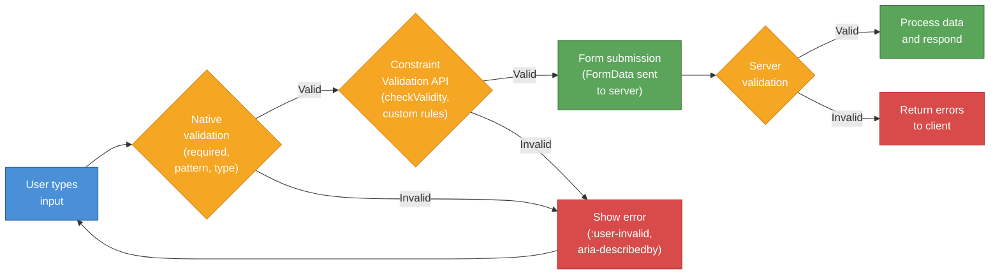

# [FEE-103] Forms & Validation

:::info
HTML forms are the web's primary mechanism for collecting user input. The platform provides declarative validation, accessible labeling, and structured submission -- all before a single line of JavaScript runs. Understanding native form capabilities is essential because every framework-level form abstraction ultimately renders to these primitives.
:::

## Context

The `<form>` element has been part of HTML since the beginning. It defines a region of the page that collects user input and submits it to a server. Unlike most HTML elements, forms are **interactive by default** -- they accept input, validate it, and trigger navigation, all with zero JavaScript.

HTML provides a rich vocabulary of form controls:

| Element | Purpose |
|---------|---------|
| `<form>` | Container that groups controls and defines submission behavior |
| `<input>` | The most versatile control -- 22+ types (text, email, number, date, checkbox, radio, file, range, color, etc.) |
| `<textarea>` | Multi-line text input |
| `<select>` + `<option>` | Dropdown selection list |
| `<datalist>` + `<option>` | Autocomplete suggestion list bound to an `<input>` via the `list` attribute |
| `<output>` | Result of a calculation or user action (e.g., live total) |
| `<button>` | Submit, reset, or generic button (prefer over `<input type="submit">`) |
| `<fieldset>` + `<legend>` | Groups related controls with a caption |
| `<label>` | Accessible name for a form control |
| `<progress>` | Progress indicator |
| `<meter>` | Scalar measurement within a known range |

### Input types

Each `type` value changes the control's behavior, mobile keyboard, and built-in validation:

| Type | Keyboard | Built-in validation |
|------|----------|-------------------|
| `text` | Standard | None (unless `pattern` is set) |
| `email` | Email layout (@ key) | Must match email format |
| `url` | URL layout | Must match URL format |
| `tel` | Numeric dialpad | None (patterns vary by country) |
| `number` | Numeric | Must be a number within `min`/`max`/`step` |
| `date` | Date picker | Must be a valid date |
| `search` | Standard + clear button | None |
| `password` | Obscured input | None (use `minlength`/`pattern`) |
| `file` | File picker | `accept` filters file types |
| `checkbox` | Toggle | `required` means must be checked |
| `radio` | Single-select within group | `required` on one means group must have selection |
| `range` | Slider | Constrained to `min`/`max`/`step` |
| `color` | Color picker | Must be a valid hex color |

### Form submission attributes

The `<form>` element controls how data is sent:

- **`action`** -- URL to submit to. Defaults to the current page URL.
- **`method`** -- `GET` (data in URL query string) or `POST` (data in request body). `dialog` closes a `<dialog>` parent.
- **`enctype`** -- Encoding for `POST`: `application/x-www-form-urlencoded` (default), `multipart/form-data` (required for file uploads), `text/plain`.
- **`novalidate`** -- Disables native validation on submission.

Individual submit buttons can override these with `formaction`, `formmethod`, `formenctype`, and `formnovalidate`:

```html
<form action="/save" method="POST">
  <!-- Fields here -->
  <button type="submit">Save Draft</button>
  <button type="submit" formaction="/publish" formmethod="POST">Publish</button>
</form>
```

## Principle

The following principles use RFC 2119 keywords.

### MUST: Associate every input with a label

Every form control **MUST** have a visible `<label>` associated via `for`/`id` or by nesting the control inside the `<label>`.

**Rationale.** A label does three things: (1) it provides an accessible name announced by screen readers, (2) it expands the clickable area (clicking the label focuses the control), and (3) it tells the user what data is expected. The `placeholder` attribute is not a substitute -- it disappears when the user types, has insufficient contrast in most browsers, and is not reliably announced by all screen readers.

### SHOULD: Use native validation before JavaScript

Authors **SHOULD** use HTML validation attributes (`required`, `pattern`, `min`, `max`, `minlength`, `maxlength`, `type`) before implementing JavaScript validation.

**Rationale.** Native validation is declarative, requires no JavaScript, works with progressive enhancement, and is integrated with the browser's accessibility infrastructure. The browser announces validation errors to screen readers and prevents submission of invalid data without any custom code. JavaScript validation should supplement native validation for complex rules -- not replace it.

### MUST: Validate on the server

Authors **MUST** validate all form data on the server, regardless of client-side validation.

**Rationale.** Client-side validation is a UX convenience, not a security boundary. Any user can disable JavaScript, modify the DOM, or submit data directly to the endpoint. Server validation is the only validation that can be trusted.

### SHOULD: Use fieldset and legend for grouped inputs

Authors **SHOULD** group related controls (radio buttons, checkboxes, address fields) inside `<fieldset>` with a descriptive `<legend>`.

**Rationale.** Screen readers announce the legend text before each control in the group. Without a fieldset, a radio button labeled "Yes" is ambiguous -- the user does not know what question "Yes" answers. With `<fieldset><legend>Subscribe to newsletter?</legend>`, the screen reader announces "Subscribe to newsletter? Yes, radio button."

### SHOULD: Provide autocomplete attributes

Authors **SHOULD** add the `autocomplete` attribute to form controls that accept personal data (name, email, address, credit card).

**Rationale.** The `autocomplete` attribute enables the browser's autofill, reducing user effort and input errors. It is required for WCAG 2.1 Success Criterion 1.3.5 (Identify Input Purpose) at Level AA.

## Design Thinking

### Why HTML has native validation

HTML validation is **declarative** -- you describe constraints in markup, and the browser enforces them. This design has three advantages:

1. **Progressive enhancement.** Forms work without JavaScript. If JS fails to load, native validation still prevents invalid submissions.
2. **Accessibility built in.** Browsers announce validation errors to screen readers. The `:invalid` and `:user-invalid` pseudo-classes enable visual feedback without JS state management.
3. **Less code to maintain.** A `required` attribute replaces a JavaScript event listener, a state variable, conditional rendering of an error message, and an ARIA attribute. Native validation is a single source of truth.

The limitation: native validation UI is not customizable. The browser's error tooltip cannot be styled, its text varies across browsers, and its positioning is fixed. This tension drives frameworks to reimplement validation in JavaScript.

### The framework forms landscape

Modern frameworks take different approaches to form handling, each balancing DX, progressive enhancement, and accessibility:

**React: controlled vs. uncontrolled.** Controlled components bind every input to React state via `value` + `onChange`, giving full control but requiring more code. Uncontrolled components use `ref` and let the DOM own the state -- closer to native forms. React 19+ introduced **Server Actions** with the `action` prop on `<form>`, allowing server-side form processing with progressive enhancement: forms work as standard HTML submissions when JS is unavailable.

**Vue: v-model.** Vue's `v-model` directive provides two-way data binding between form controls and component state. It handles the value/event wiring automatically for `<input>`, `<textarea>`, and `<select>`. Validation is typically handled by libraries like VeeValidate or FormKit.

**SvelteKit: form actions.** SvelteKit's form actions are the strongest progressive enhancement story. Forms submit as standard HTTP `POST` requests. Server-side `actions` functions process the submission. The `use:enhance` directive progressively upgrades to AJAX when JS is available -- no page reload, but the same server action handles both cases. This means forms work without JavaScript by design.

**Remix / React Router: loader + action.** Similar to SvelteKit, Remix uses server-side `action` functions that process standard form submissions. The `<Form>` component upgrades to fetch-based submission with JS. Progressive enhancement is a core design principle.

**Conform + Zod.** Conform is a form validation library designed for progressive enhancement with React Server Actions, Remix, and Next.js. It pairs with Zod schemas to define validation rules once and apply them on both client and server. This "validate once, run everywhere" approach eliminates the common mistake of divergent client/server validation.

### The tension: native vs. framework validation

Native HTML validation is accessible and requires no JavaScript, but:
- Error messages cannot be styled or positioned
- Complex rules (cross-field validation, async checks) are not expressible
- Error UX varies across browsers

Framework validation is flexible but must recreate what the browser provides for free:
- Error messages must be wired to `aria-describedby` or live regions
- Focus must be managed (move focus to the first invalid field)
- Submission prevention must be reimplemented
- Screen reader announcements must be explicitly coded

The best approach combines both: use native attributes (`required`, `type="email"`, `pattern`) for baseline validation, then layer framework validation for complex rules. Use `novalidate` on the `<form>` only when your JS validation fully replaces the native UX, and ensure your replacement is accessible.

## Visual

### Form lifecycle



The form lifecycle flows from user input through three validation layers: native HTML constraints checked by the browser, the Constraint Validation API for custom JavaScript rules, and server-side validation as the final authority. Errors at any stage redirect the user back to correct their input.

## Example

### 1. Form with native validation and :user-valid styling

```html
<style>
  /* Only show validation styles after user interaction */
  input:user-valid,
  select:user-valid,
  textarea:user-valid {
    border-color: #2e7d32;
    outline-color: #2e7d32;
  }

  input:user-invalid,
  select:user-invalid,
  textarea:user-invalid {
    border-color: #c62828;
    outline-color: #c62828;
  }

  /* Fallback for older browsers */
  @supports not selector(:user-valid) {
    input:valid:not(:placeholder-shown) {
      border-color: #2e7d32;
    }
    input:invalid:not(:placeholder-shown):not(:focus) {
      border-color: #c62828;
    }
  }
</style>

<form action="/register" method="POST">
  <fieldset>
    <legend>Create Account</legend>

    <div>
      <label for="username">Username</label>
      <input id="username" name="username" type="text"
             required minlength="3" maxlength="20"
             pattern="[a-zA-Z0-9_]+"
             autocomplete="username"
             placeholder=" " />
    </div>

    <div>
      <label for="user-email">Email</label>
      <input id="user-email" name="email" type="email"
             required
             autocomplete="email"
             placeholder=" " />
    </div>

    <div>
      <label for="user-password">Password</label>
      <input id="user-password" name="password" type="password"
             required minlength="12"
             autocomplete="new-password"
             placeholder=" " />
    </div>

    <div>
      <label for="user-role">Role</label>
      <select id="user-role" name="role" required>
        <option value="">-- Select a role --</option>
        <option value="developer">Developer</option>
        <option value="designer">Designer</option>
        <option value="manager">Manager</option>
      </select>
    </div>

    <button type="submit">Create Account</button>
  </fieldset>
</form>
```

The `:user-valid` and `:user-invalid` pseudo-classes only apply after the user has interacted with the field -- no red borders on page load. The `@supports` block provides a fallback using the `:placeholder-shown` trick for older browsers.

### 2. FormData API extraction

```html
<form id="contact-form" action="/contact" method="POST">
  <label for="contact-name">Name</label>
  <input id="contact-name" name="name" type="text" required />

  <label for="contact-email">Email</label>
  <input id="contact-email" name="email" type="email" required />

  <label for="contact-subject">Subject</label>
  <select id="contact-subject" name="subject">
    <option value="support">Support</option>
    <option value="feedback">Feedback</option>
    <option value="other">Other</option>
  </select>

  <label for="contact-message">Message</label>
  <textarea id="contact-message" name="message" required></textarea>

  <button type="submit">Send</button>
</form>

<script>
  const form = document.getElementById('contact-form');

  form.addEventListener('submit', async (event) => {
    event.preventDefault();

    // FormData reads all named controls automatically
    const formData = new FormData(form);

    // Access individual values
    const name = formData.get('name');       // string
    const email = formData.get('email');      // string

    // Convert to a plain object
    const data = Object.fromEntries(formData);
    // { name: "Alice", email: "alice@example.com", subject: "support", message: "..." }

    // Submit as JSON
    const response = await fetch('/api/contact', {
      method: 'POST',
      headers: { 'Content-Type': 'application/json' },
      body: JSON.stringify(data),
    });

    if (!response.ok) {
      // Handle server validation errors
    }
  });
</script>
```

`FormData` reads all named form controls without manually querying each one. It works with all form control types, including file inputs (`formData.get('file')` returns a `File` object). For multipart submissions (file uploads), pass `FormData` directly as the fetch body without setting `Content-Type` -- the browser sets the correct boundary.

### 3. Accessible error messaging with Constraint Validation API

```html
<form id="signup-form" action="/signup" method="POST" novalidate>
  <div>
    <label for="signup-email">Email address</label>
    <input id="signup-email" name="email" type="email" required
           autocomplete="email"
           aria-describedby="email-error" />
    <p id="email-error" role="alert" hidden></p>
  </div>

  <div>
    <label for="signup-age">Age</label>
    <input id="signup-age" name="age" type="number"
           min="13" max="120" required
           aria-describedby="age-error" />
    <p id="age-error" role="alert" hidden></p>
  </div>

  <button type="submit">Sign Up</button>
</form>

<script>
  const form = document.getElementById('signup-form');

  function showError(input, message) {
    const errorEl = document.getElementById(
      input.getAttribute('aria-describedby')
    );
    errorEl.textContent = message;
    errorEl.hidden = false;
    input.setAttribute('aria-invalid', 'true');
  }

  function clearError(input) {
    const errorEl = document.getElementById(
      input.getAttribute('aria-describedby')
    );
    errorEl.textContent = '';
    errorEl.hidden = true;
    input.removeAttribute('aria-invalid');
  }

  function validateField(input) {
    // Use the Constraint Validation API
    if (input.validity.valueMissing) {
      showError(input, `${input.labels[0].textContent} is required.`);
      return false;
    }
    if (input.validity.typeMismatch) {
      showError(input, 'Please enter a valid email address.');
      return false;
    }
    if (input.validity.rangeUnderflow) {
      showError(input, `Must be at least ${input.min}.`);
      return false;
    }
    if (input.validity.rangeOverflow) {
      showError(input, `Must be at most ${input.max}.`);
      return false;
    }

    // Custom async-style validation
    input.setCustomValidity('');
    clearError(input);
    return true;
  }

  // Validate on blur for immediate feedback
  form.querySelectorAll('input').forEach((input) => {
    input.addEventListener('blur', () => validateField(input));
    input.addEventListener('input', () => {
      if (input.getAttribute('aria-invalid')) {
        validateField(input);
      }
    });
  });

  form.addEventListener('submit', (event) => {
    event.preventDefault();

    const inputs = [...form.querySelectorAll('input')];
    const firstInvalid = inputs.find((input) => !validateField(input));

    if (firstInvalid) {
      // Focus management: move focus to the first invalid field
      firstInvalid.focus();
      return;
    }

    // All valid -- submit
    const data = new FormData(form);
    fetch('/api/signup', { method: 'POST', body: data });
  });
</script>
```

Key accessibility patterns in this example:

- **`aria-describedby`** links each input to its error message. Screen readers announce the error after the field name and role.
- **`aria-invalid="true"`** tells assistive technology the field has an error.
- **`role="alert"`** on the error element causes screen readers to announce the error immediately when it appears.
- **Focus management** moves focus to the first invalid field on submission, so keyboard users are directed to the problem.
- **`hidden`** attribute keeps error elements in the DOM but invisible until needed.

The `validity` object (from the Constraint Validation API) exposes granular states: `valueMissing`, `typeMismatch`, `patternMismatch`, `tooLong`, `tooShort`, `rangeUnderflow`, `rangeOverflow`, `stepMismatch`, `badInput`, and `customError`. This lets you write custom messages for each failure type while leveraging the browser's built-in validation logic.

## Common Mistakes

### 1. Missing label (placeholder is not a label)

```html
<!-- WRONG: placeholder disappears on input, no accessible name -->
<input type="email" placeholder="Email address" />
```

**Impact.** Screen readers may not announce the field's purpose. Sighted users lose context once they start typing. Users with cognitive disabilities cannot refer back to the instruction.

**Fix.** Always provide a visible `<label>`:

```html
<label for="email">Email address</label>
<input id="email" type="email" placeholder="e.g. alice@example.com" />
```

### 2. Client-only validation

```html
<!-- WRONG: only validated in JavaScript, server trusts input blindly -->
<form onsubmit="return validateForm()">
  <input name="age" type="text" />
</form>
```

**Impact.** Any user can bypass JavaScript validation. Malicious input reaches the server unvalidated. This is a security vulnerability, not just a UX issue.

**Fix.** Always validate on the server. Use native HTML validation as a first layer:

```html
<form action="/submit" method="POST">
  <input name="age" type="number" min="0" max="150" required />
  <button type="submit">Submit</button>
</form>
<!-- Server MUST validate age is a number between 0 and 150 -->
```

### 3. div + click handler instead of button type="submit"

```html
<!-- WRONG: not focusable, no keyboard support, no form submission -->
<div class="btn" onclick="submitForm()">Submit</div>
```

**Impact.** The `<div>` has no `button` role in the accessibility tree, is not keyboard focusable, does not respond to Enter/Space, and does not trigger native form submission or validation.

**Fix.** Use a native `<button>`:

```html
<button type="submit">Submit</button>
```

### 4. No fieldset/legend for grouped inputs

```html
<!-- WRONG: radio buttons without group context -->
<p>Preferred contact method:</p>
<label><input type="radio" name="contact" value="email" /> Email</label>
<label><input type="radio" name="contact" value="phone" /> Phone</label>
```

**Impact.** A screen reader announces "Email, radio button" without context. The user does not know what "Email" refers to -- is it a contact method, a notification preference, or something else?

**Fix.** Wrap in `<fieldset>` with `<legend>`:

```html
<fieldset>
  <legend>Preferred contact method</legend>
  <label><input type="radio" name="contact" value="email" /> Email</label>
  <label><input type="radio" name="contact" value="phone" /> Phone</label>
</fieldset>
```

### 5. Missing autocomplete attribute

```html
<!-- WRONG: no autocomplete, user must type everything manually -->
<label for="cc">Credit card number</label>
<input id="cc" name="cc" type="text" inputmode="numeric" />
```

**Impact.** Users with motor disabilities must type every character. Users on mobile miss the benefit of autofill. The form fails WCAG 2.1 SC 1.3.5 (Identify Input Purpose) at Level AA.

**Fix.** Add the appropriate `autocomplete` value:

```html
<label for="cc">Credit card number</label>
<input id="cc" name="cc" type="text" inputmode="numeric"
       autocomplete="cc-number" />
```

Common autocomplete values: `name`, `email`, `tel`, `street-address`, `postal-code`, `country`, `cc-number`, `cc-exp`, `cc-csc`, `username`, `new-password`, `current-password`.

## Related FEEs

| FEE | Relationship |
|-----|-------------|
| [FEE-100 HTML & Semantic Markup Overview](./100.md) | Parent overview. Forms are one of the key interactive areas of HTML covered in the overview. |
| [FEE-102 Semantic Elements & Accessibility](./102.md) | Accessibility foundations. Label association, ARIA live regions for error announcements, and accessible name computation are covered there. |
| [FEE-106 HTML APIs & Progressive Enhancement](./106.md) | Progressive enhancement. SvelteKit form actions and framework approaches to forms that work without JS are expanded there. |

## References

- [WHATWG HTML Living Standard -- Forms](https://html.spec.whatwg.org/dev/forms.html) -- The authoritative specification for form elements, input types, validation constraints, and submission
- [WHATWG HTML Living Standard -- Constraint Validation](https://html.spec.whatwg.org/multipage/form-control-infrastructure.html#constraints) -- Specification for the Constraint Validation API (checkValidity, reportValidity, setCustomValidity, ValidityState)
- [MDN: Web Forms Guide](https://developer.mozilla.org/en-US/docs/Learn_web_development/Extensions/Forms) -- Comprehensive learning guide covering form structure, validation, styling, and accessibility
- [MDN: Constraint Validation](https://developer.mozilla.org/en-US/docs/Web/HTML/Constraint_validation) -- Reference for HTML validation attributes and the Constraint Validation API
- [MDN: FormData API](https://developer.mozilla.org/en-US/docs/Web/API/FormData) -- Reference for the FormData interface used to construct key/value pairs from form controls
- [MDN: :user-valid](https://developer.mozilla.org/en-US/docs/Web/CSS/:user-valid) -- Reference for the :user-valid pseudo-class that matches after user interaction
- [web.dev: Learn Forms](https://web.dev/learn/forms) -- Practical course on form design, validation, accessibility, and security
- [web.dev: :user-valid and :user-invalid pseudo-classes](https://web.dev/articles/user-valid-and-user-invalid-pseudo-classes) -- Explanation of interaction-gated validation styling
- [W3C WAI: Accessible Forms](https://www.w3.org/WAI/tutorials/forms/) -- Tutorial on building accessible forms with labels, grouping, instructions, and error handling
- [SvelteKit Docs: Form Actions](https://svelte.dev/docs/kit/form-actions) -- SvelteKit's progressive enhancement approach to form handling
