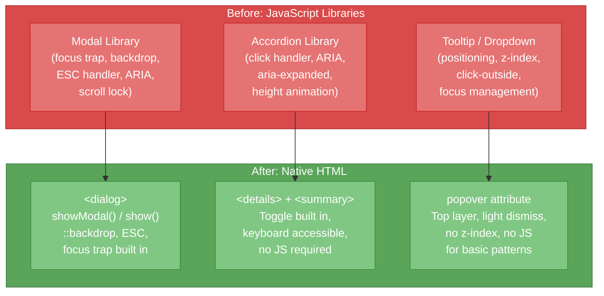

# [FEE-104] Media, Embedding & Interactive Elements

:::info
HTML provides native elements for images, audio, video, embedded content, and interactive UI patterns. These built-in primitives handle responsive image delivery, media playback with captions, secure embedding via sandboxed iframes, and interactive disclosure and dialog patterns, all without requiring JavaScript. Modern frameworks build their media and interaction abstractions on top of these same elements, so understanding the native behavior comes first.
:::

## Context

The web began as a text-only medium. Images arrived in 1993, when Marc Andreessen proposed the `` tag on the www-talk mailing list and the NCSA team, Andreessen and Eric Bina, shipped it weeks later in Mosaic 0.10 (Andreessen, 1993; The History of the Web, n.d.). Audio and video required plugins such as RealPlayer and Flash for years afterward; native `<video>` and `<audio>` arrived in the late 2000s and were standardized when HTML5 reached W3C Recommendation in 2014. Interactive patterns like modals, accordions, and tooltips were built entirely in JavaScript until the platform added `<dialog>`, `<details>`/`<summary>`, and the Popover API.

### Media elements

| Element | Purpose |
|---------|---------|
| `` | Raster or vector image with `srcset`/`sizes` for responsive delivery |
| `<picture>` | Art direction wrapper -- selects among `<source>` elements by media query or format |
| `<video>` | Native video playback with controls, poster, and multiple sources |
| `<audio>` | Native audio playback with controls and multiple sources |
| `<source>` | Declares a media resource for `<video>`, `<audio>`, or `<picture>` |
| `<track>` | Timed text tracks (captions, subtitles, descriptions) for `<video>` and `<audio>` |
| `<canvas>` | 2D/3D drawing surface driven by JavaScript (Canvas API, WebGL, WebGPU) |
| `<svg>` | Scalable vector graphics -- inline or referenced, styleable with CSS |

### Embedding elements

| Element | Purpose |
|---------|---------|
| `<iframe>` | Embeds another HTML document with security controls (sandbox, allow, CSP) |
| `<embed>` | Generic external content (legacy, rarely needed today) |
| `<object>` | Embeds external resources (legacy, replaced by iframe/video/audio in practice) |

### Interactive elements

| Element / API | Purpose |
|---------------|---------|
| `<dialog>` | Modal or non-modal dialog box with built-in focus trap, backdrop, ESC dismiss |
| `<details>` + `<summary>` | Disclosure widget -- native accordion without JavaScript |
| `popover` attribute | Popover behavior on any element -- tooltip, dropdown, toast patterns |

### Responsive images: srcset, sizes, and picture

Responsive images solve a fundamental problem: a single image file cannot serve every device optimally. A 2000px hero image wastes bandwidth on a 375px phone; a 375px image looks blurry on a 4K display.

**`srcset` with width descriptors** tells the browser which image files are available and their intrinsic widths:

```html

```

The `sizes` attribute tells the browser how wide the image will be displayed at each breakpoint. The browser combines `srcset` widths with `sizes` layout widths and the device pixel ratio to pick the file. That selection happens before CSS loads, so the image request never waits on stylesheet parsing.

**`<picture>` for art direction and format selection:**

```html
<picture>
  <source media="(max-width: 600px)" srcset="hero-portrait.avif" type="image/avif" />
  <source media="(max-width: 600px)" srcset="hero-portrait.webp" type="image/webp" />
  <source srcset="hero-landscape.avif" type="image/avif" />
  <source srcset="hero-landscape.webp" type="image/webp" />
  
</picture>
```

### Image performance attributes

- **`loading="lazy"`**: Defers loading until the image approaches the viewport. Use only for below-fold images.
- **`fetchpriority="high"`**: Tells the browser to fetch the image at high priority. Use for the LCP (Largest Contentful Paint) image.
- **`decoding="async"`**: Allows the browser to decode the image off the main thread. Suitable for non-critical images.

### Video and audio

```html
<video controls width="640" poster="poster.jpg" preload="metadata">
  <source src="video.mp4" type="video/mp4" />
  <source src="video.webm" type="video/webm" />
  <track kind="captions" src="captions-en.vtt" srclang="en" label="English" default />
  <track kind="captions" src="captions-zh.vtt" srclang="zh" label="Chinese" />
  <p>Your browser does not support HTML video. <a href="video.mp4">Download</a>.</p>
</video>
```

The `<track>` element provides WebVTT captions for accessibility. Without captions, video content is inaccessible to deaf and hard-of-hearing users and fails WCAG 1.2.2 (Captions - Prerecorded).

### Format negotiation vs. adaptive delivery

A common assumption is that `<video>` with multiple `<source>` elements works like `<picture>`: give the browser several files and it picks the best one for the current device and connection. It does not. A single `<video src="demo.mp4">` loads its full 80 MB file regardless of screen size or connection speed, and adding `<source>` elements does not fix that by itself.

Two attributes on `<source>` do two different, narrower jobs. `type` negotiates format: the browser plays the first source whose codec and container it can decode, such as WebM over MP4. `media` negotiates viewport: the browser plays the first source whose media query matches, the same art-direction mechanism `<picture>` uses for images. `media` on video sources has an unusual history. It shipped early, was removed from the HTML spec in 2014 in favor of adaptive-streaming alternatives, and for years worked only in Safari (Ctrl.blog, 2021). Firefox and Chrome restored support in late 2023, so as of 2026 all three engines honor it again (Jehl, 2023).

Neither attribute reacts to network conditions. A `<source media="(min-width: 800px)">` breakpoint downloads the same file for every viewer above that width, whether they are on fiber or throttled mobile data. Adapting bitrate to measured bandwidth mid-playback, the way streaming services do, needs Media Source Extensions (MSE): a JavaScript API that feeds a `<video>` element chunked, variable-bitrate segments pulled from a manifest, over a protocol such as HLS or DASH. Libraries like hls.js and dash.js implement the client side; native HTML has no built-in equivalent.

Two native primitives still help with the 80 MB problem, neither of which is format or viewport negotiation. `preload="none"` or `preload="metadata"` defers fetching the full file until playback starts; that is why the `<video>` example above uses `preload="metadata"` rather than the default. `loading="lazy"` is not a substitute for this: it is an ``/`<iframe>` attribute, and although Chrome shipped an implementation for `<video>` in 2026, Safari and Firefox have not, so it cannot yet be relied on. For seeking without a full re-fetch, a Media Fragment URI such as `video.mp4#t=10,20` requests a specific time range directly.

### iframe sandboxing

The `sandbox` attribute restricts what embedded content can do:

```html
<iframe
  src="https://third-party-widget.example.com"
  sandbox="allow-scripts allow-same-origin"
  allow="camera; microphone"
  loading="lazy"
  title="Customer support chat"
></iframe>
```

Without `sandbox`, an iframe has full access to JavaScript, forms, popups, and navigation. The attribute creates a restrictive default and requires explicit opt-in:

| Token | Allows |
|-------|--------|
| `allow-scripts` | JavaScript execution |
| `allow-same-origin` | Treat content as same origin (needed for cookies/storage) |
| `allow-forms` | Form submission |
| `allow-popups` | `window.open()` and `target="_blank"` links |
| `allow-top-navigation` | Navigate the top-level browsing context |
| `allow-modals` | `alert()`, `confirm()`, `prompt()` |

The `allow` attribute controls Permissions Policy (formerly Feature Policy), gating access to device APIs like camera, microphone, geolocation, and fullscreen.

**Content Security Policy (CSP)** complements iframe sandboxing at the HTTP header level. The `frame-src` directive controls which origins can be embedded:

```
Content-Security-Policy: frame-src 'self' https://trusted-cdn.example.com;
```

### Canvas and SVG

**Canvas** provides a pixel-based drawing surface driven by JavaScript. It excels at real-time rendering (games, data visualizations, image processing) but its content is not part of the DOM and is inaccessible to screen readers without explicit fallback content.

**SVG** is a vector format that integrates with the DOM. SVG elements can be styled with CSS, animated, and made accessible with `<title>` and `<desc>` elements. Inline SVG is preferred for icons and illustrations because it avoids extra network requests and is fully styleable.

## Visual

### Native elements replacing JavaScript libraries



The shift from JavaScript libraries to native HTML elements reduces bundle size, improves accessibility by default, and eliminates entire categories of bugs such as z-index stacking, focus-trap edge cases, and scroll-lock conflicts. a11y-dialog, a widely used accessible-modal library, ships at 1.7 KB minified and gzipped for exactly the focus-trap, backdrop, and ARIA wiring that `<dialog>` now provides natively (Giraudel, 2026).

## Example

### 1. Responsive image with picture + srcset

```html
<picture>
  <!-- Art direction: different crop for mobile -->
  <source
    media="(max-width: 768px)"
    srcset="hero-mobile-400.avif 400w, hero-mobile-800.avif 800w"
    sizes="100vw"
    type="image/avif"
  />
  <source
    media="(max-width: 768px)"
    srcset="hero-mobile-400.webp 400w, hero-mobile-800.webp 800w"
    sizes="100vw"
    type="image/webp"
  />

  <!-- Desktop: landscape crop with format fallback -->
  <source
    srcset="hero-desktop-800.avif 800w, hero-desktop-1600.avif 1600w"
    sizes="(max-width: 1200px) 100vw, 1200px"
    type="image/avif"
  />
  <source
    srcset="hero-desktop-800.webp 800w, hero-desktop-1600.webp 1600w"
    sizes="(max-width: 1200px) 100vw, 1200px"
    type="image/webp"
  />

  <!-- Fallback for browsers that do not support avif/webp -->
  
</picture>
```

This example combines art direction (different crops for mobile vs. desktop), format negotiation (AVIF, WebP, JPEG fallback), and performance optimization (`fetchpriority="high"` for the LCP image, explicit `width`/`height` to prevent layout shift).

### 2. Native dialog modal

```html
<button id="open-dialog" type="button">Open Settings</button>

<dialog id="settings-dialog">
  <form method="dialog">
    <h2>Settings</h2>

    <label for="theme-select">Theme</label>
    <select id="theme-select" name="theme">
      <option value="light">Light</option>
      <option value="dark">Dark</option>
      <option value="system">System</option>
    </select>

    <label for="notifications">
      <input id="notifications" name="notifications" type="checkbox" checked />
      Enable notifications
    </label>

    <div>
      <button type="submit" value="save">Save</button>
      <button type="submit" value="cancel">Cancel</button>
    </div>
  </form>
</dialog>

<script>
  const dialog = document.getElementById('settings-dialog');
  const openBtn = document.getElementById('open-dialog');

  openBtn.addEventListener('click', () => {
    dialog.showModal(); // Opens as modal with focus trap and backdrop
  });

  dialog.addEventListener('close', () => {
    if (dialog.returnValue === 'save') {
      const formData = new FormData(dialog.querySelector('form'));
      console.log('Theme:', formData.get('theme'));
      console.log('Notifications:', formData.get('notifications'));
    }
  });
</script>

<style>
  dialog::backdrop {
    background: rgba(0, 0, 0, 0.5);
    backdrop-filter: blur(4px);
  }

  dialog[open] {
    animation: slide-in 200ms ease-out;
  }

  @keyframes slide-in {
    from {
      opacity: 0;
      transform: translateY(-20px);
    }
    to {
      opacity: 1;
      transform: translateY(0);
    }
  }
</style>
```

The `method="dialog"` form closes the dialog on submit without a page reload. The `value` attribute on each submit button becomes `dialog.returnValue`, allowing different close actions. The browser handles focus trap, ESC dismiss, backdrop, and `aria-modal` automatically.

### 3. Popover attribute

```html
<!-- Declarative popover: no JavaScript required -->
<button popovertarget="menu-popover" type="button">
  Open Menu
</button>

<div id="menu-popover" popover>
  <nav>
    <ul>
      <li><a href="/profile">Profile</a></li>
      <li><a href="/settings">Settings</a></li>
      <li><a href="/logout">Log out</a></li>
    </ul>
  </nav>
</div>

<style>
  [popover] {
    /* Positioned in the top layer -- no z-index needed */
    border: 1px solid #ccc;
    border-radius: 8px;
    padding: 0.5rem;
    box-shadow: 0 4px 12px rgba(0, 0, 0, 0.15);
  }

  /* Entry and exit animations */
  [popover]:popover-open {
    animation: fade-in 150ms ease-out;
  }

  @keyframes fade-in {
    from { opacity: 0; transform: scale(0.95); }
    to { opacity: 1; transform: scale(1); }
  }
</style>
```

The `popover` attribute (equivalent to `popover="auto"`) provides auto-dismiss behavior: clicking outside the popover, pressing ESC, or opening another `auto` popover closes it. The browser handles dismissal and top-layer stacking (a browser paint layer that sits above all page content), so a basic popover needs no script and no z-index. The `popovertarget` attribute on the button declaratively connects it to the popover element.

## Best Practices

**Always provide descriptive alt text on images.** Every `` MUST have an `alt` attribute. Use a meaningful description of the image's content and purpose for informative images. Use `alt=""` only for purely decorative images that add no information; omitting the attribute entirely causes screen readers to announce the filename, which is meaningless to users.

**Use `<picture>` and `srcset` to serve the right image for each device.** You SHOULD provide multiple image sources with width descriptors (`400w`, `800w`, `1600w`) and accurate `sizes` values so the browser can select the optimal file before CSS loads. For above-fold hero images, AVOID `loading="lazy"` and instead use `fetchpriority="high"` to prevent delays to the Largest Contentful Paint score.

**Apply `loading="lazy"` only to below-fold images.** Browser-native lazy loading is a powerful performance tool, but MUST be reserved for images that are not immediately visible on page load. Applying `loading="lazy"` to the LCP image or any above-fold content adds latency that harms Core Web Vitals.

**Add `<track>` captions to every video with meaningful audio.** All `<video>` elements containing speech or significant audio MUST include at least one `<track kind="captions">` with a WebVTT file. Omitting captions excludes deaf and hard-of-hearing users and fails WCAG 1.2.2 (Captions - Prerecorded) at Level A.

**Sandbox all third-party iframes and grant only necessary permissions.** Every `<iframe>` loading external content MUST carry the `sandbox` attribute, which defaults to maximum restriction. You SHOULD then add only the tokens required for the widget to function (e.g., `allow-scripts`), and AVOID granting `allow-same-origin` together with `allow-scripts` on untrusted content, as that combination can allow the embedded page to remove the sandbox.

**Prefer `<details>`/`<summary>` for progressive disclosure patterns.** When content can be shown or hidden on demand (FAQs, expandable sections, secondary information), Authors SHOULD use the native disclosure widget rather than building a custom accordion. The native elements provide keyboard interaction, accessibility announcements, and toggle semantics with zero JavaScript, eliminating an entire class of focus-management bugs.

## Design Thinking

### Why the platform added native interactive elements

For years, the web lacked native UI patterns for common interactions. Developers built modals, accordions, and tooltips entirely in JavaScript. Hundreds of libraries reimplemented the same behaviors, each with its own quality and accessibility trade-offs. The platform responded by adding native elements that provide these patterns with built-in accessibility, keyboard support, and focus management.

**`<dialog>` replaced modal libraries.** Before `<dialog>`, creating a modal required: a JavaScript library to manage open/close state, a focus trap to keep keyboard focus inside the modal, an event listener for ESC to dismiss, a backdrop overlay with click-to-dismiss, `aria-modal="true"` and role management, and scroll lock on the body. The native `<dialog>` element, which reached Baseline (the Web Platform signal that a feature works consistently across the major browser engines) in March 2022, provides all of this declaratively:

- `.showModal()` opens as a modal with a built-in focus trap
- `.show()` opens as a non-modal dialog
- The `::backdrop` pseudo-element styles the overlay
- ESC dismisses the dialog by default; the `closedby` attribute can loosen or tighten that behavior, but as of 2026 it ships only in Chrome, Edge, and Firefox with no Safari support, so treat it as progressive enhancement rather than a cross-browser default
- The browser manages `aria-modal` and focus restoration automatically

**`<details>`/`<summary>` replaced accordion JavaScript.** Disclosure widgets previously required click handlers, ARIA attributes (`aria-expanded`, `aria-controls`), height animations, and state management. The native elements handle toggle behavior, keyboard interaction, and accessibility announcements with zero JavaScript.

**The Popover API replaced tooltip and dropdown libraries.** The `popover` attribute reached Baseline in 2024 and provides:

- Top-layer rendering above page content (no z-index battles)
- Light dismiss on outside click
- Focus management
- Nesting support
- No JavaScript required for basic show/hide

### Framework media abstractions

Modern frameworks wrap native image elements to automate responsive image optimization:

**Next.js Image** (`next/image`) automatically generates `srcset` with optimized widths, serves modern formats (WebP, AVIF) via content negotiation, applies `loading="lazy"` by default, provides blur-up placeholder during loading, and enforces width/height to prevent Cumulative Layout Shift (CLS).

**Nuxt Image** (`nuxt/image`) provides a `<NuxtImg>` component with similar automatic srcset generation, provider integrations (Cloudinary, imgix, Vercel), and format optimization.

**Astro Image** (`astro:assets`) optimizes images at build time, generates multiple sizes, converts to modern formats, and integrates with the Astro build pipeline for zero-runtime-cost optimization.

These abstractions exist because correct responsive image markup is verbose and error-prone. A single responsive image can require 5-10 `<source>` elements with format and size combinations. Frameworks automate this, but the generated HTML still uses the same ``, `srcset`, `sizes`, and `<picture>` primitives.

## Footgun Matrix

| Footgun | What goes wrong | Fix |
|---------|------------------|-----|
| `loading="lazy"` on the LCP image | Defers the largest above-fold image instead of prioritizing it, delaying Largest Contentful Paint | Reserve `loading="lazy"` for below-fold images; use `fetchpriority="high"` on the LCP image |
| `sandbox="allow-scripts allow-same-origin"` on untrusted content | The two tokens combined let the embedded page treat itself as same-origin while still running scripts, which lets it strip its own sandbox restrictions | Never grant both tokens to an iframe you do not control; grant only the tokens the widget needs |
| `<video>` without a `<track kind="captions">` | Deaf and hard-of-hearing users cannot access the audio content; the page fails WCAG 1.2.2 (Captions - Prerecorded) at Level A | Ship a WebVTT caption track with every video that carries speech or meaningful audio |
| Assuming `<source>` adapts video to bandwidth | `type` negotiates codec/container and `media` negotiates viewport width; neither reacts to a slow connection, so a phone on mobile data downloads the same file as one on fiber | Use Media Source Extensions (MSE) with HLS/DASH for real bitrate adaptation |
| Reaching for `loading="lazy"` to defer a `<video>` | Support is Chrome-only as of 2026 and not Baseline, so Safari and Firefox users get no deferral at all | Use `preload="none"` or `preload="metadata"` to defer video loading instead |
| Relying on `closedby` for a consistent dismiss experience | Chrome, Edge, and Firefox support it, but Safari does not (as of 2026), so behavior diverges across browsers | Treat `closedby` as progressive enhancement; do not depend on it as the only way to dismiss a dialog |

## Related Topics

- [HTML & Semantic Markup Overview](/en/HTML%20and%20Semantic%20Markup/100)
- [Semantic Elements & Accessibility](/en/HTML%20and%20Semantic%20Markup/102)
- [Responsive Design & Container Queries](/en/CSS%20and%20Layout%20Systems/204)
- [Accessibility Overview](/en/Accessibility/1000)

## References

- WHATWG, "HTML Living Standard: Embedded Content," WHATWG (2026). https://html.spec.whatwg.org/multipage/embedded-content.html
- WHATWG, "HTML Living Standard: Interactive Elements," WHATWG (2026). https://html.spec.whatwg.org/multipage/interactive-elements.html
- WHATWG, "HTML Living Standard: The iframe Element," WHATWG (2026). https://html.spec.whatwg.org/dev/iframe-embed-object.html
- MDN contributors, "The Dialog Element," MDN Web Docs (2026). https://developer.mozilla.org/en-US/docs/Web/HTML/Reference/Elements/dialog
- MDN contributors, "Popover API," MDN Web Docs (2026). https://developer.mozilla.org/en-US/docs/Web/API/Popover_API
- MDN contributors, "Responsive Images," MDN Web Docs (2026). https://developer.mozilla.org/en-US/docs/Learn/HTML/Multimedia_and_embedding/Responsive_images
- MDN contributors, "The iframe Element," MDN Web Docs (2026). https://developer.mozilla.org/en-US/docs/Web/HTML/Reference/Elements/iframe
- MDN contributors, "Media Source Extensions API," MDN Web Docs (2026). https://developer.mozilla.org/en-US/docs/Web/API/Media_Source_Extensions_API
- W3C, "Media Fragments URI 1.0 (basic)," W3C Recommendation (2012). https://www.w3.org/TR/media-frags/
- Scott Jehl, "We're Bringing Responsive Video Back!," scottjehl.com (2023). https://scottjehl.com/posts/responsive-video/
- Ctrl.blog, "The HTML video element needs to go back on the drawing board," Ctrl.blog (2021). https://www.ctrl.blog/entry/html-responsive-video.html
- The History of the Web, "The Origin of the IMG Tag," The History of the Web (n.d.). https://thehistoryoftheweb.com/the-origin-of-the-img-tag/
- Marc Andreessen, "NCSA Mosaic for X 0.10 released," WWW-Talk mailing list archive (1993). http://1997.webhistory.org/www.lists/www-talk.1993q1/0262.html
- web.dev, "Responsive Images," web.dev (2026). https://web.dev/learn/design/responsive-images
- web.dev, "Browser-level Image Lazy Loading," web.dev (2026). https://web.dev/articles/browser-level-image-lazy-loading
- web.dev, "Popover and Dialog," web.dev (2026). https://web.dev/learn/css/popover-and-dialog
- Can I Use, "dialog," caniuse.com (2026). https://caniuse.com/dialog
- Can I Use, "popover," caniuse.com (2026). https://caniuse.com/mdn-api_htmlelement_popover
- Web Platform DX, "dialog closedby," Web Features Explorer (2026). https://web-platform-dx.github.io/web-features-explorer/features/dialog-closedby/
- Kitty Giraudel, "a11y-dialog," GitHub (2026). https://github.com/KittyGiraudel/a11y-dialog
- Next.js, "Image Component," Next.js Documentation (2026). https://nextjs.org/docs/app/api-reference/components/image
