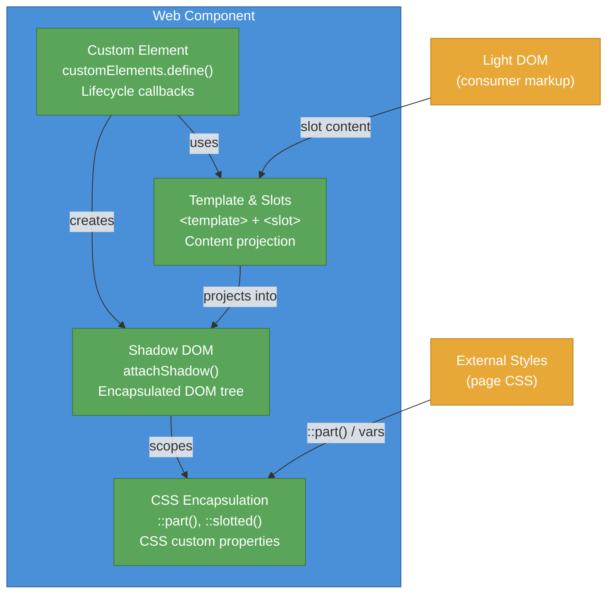

# [FEE-105] Web Components & Custom Elements

:::info
Web Components are a set of browser-native APIs that let you define reusable, encapsulated HTML elements. Custom Elements, Shadow DOM, HTML Templates, and Slots work together to provide component-based development without any framework dependency. They are the platform's answer to component architecture, and every major framework now offers interop with them.
:::

## Context

The idea of reusable UI components predates the web. Desktop toolkits such as Tk, MFC, and Swing shipped component models in the 1990s, and on the web the pattern first appeared through jQuery plugins. AngularJS (2010), React (2013), and Vue (2014) each later shipped their own component model, but a component built for one framework was not portable to another without a wrapper, and most sites at each point in this history used none of these frameworks at all: server-rendered HTML without any component library remained the majority track. The web platform responded by standardizing a native component model that any framework, or no framework, could target: a design-system team can ship a `<date-picker>` once as a Custom Element and reuse it across React, Vue, Angular, and plain-HTML applications instead of maintaining a separate port for each.

The key specifications:

| API | Purpose | Spec |
|-----|---------|------|
| **Custom Elements** | Define new HTML tags with lifecycle callbacks | WHATWG HTML Living Standard |
| **Shadow DOM** | Encapsulated DOM subtree with scoped styles | WHATWG DOM Standard |
| **HTML Templates** | Inert markup fragments via `<template>` | WHATWG HTML Living Standard |
| **Slots** | Content projection from light DOM into shadow DOM | WHATWG HTML / DOM Standard |

Light DOM here means the ordinary markup a consumer nests inside the custom element's tags, as distinct from the encapsulated tree inside the shadow root.

### Timeline

| Year | Milestone |
|------|-----------|
| 2011 | Alex Russell proposes Web Components at Fronteers conference |
| 2013 | Chrome ships Custom Elements v0 and Shadow DOM v0 behind flags |
| 2014 | Polymer 0.5, Google's library built on Web Components |
| 2016 | Custom Elements v1 and Shadow DOM v1 specifications finalized |
| 2018 | Firefox ships Custom Elements v1 and Shadow DOM v1 |
| 2020 | Edge (Chromium) ships full Web Components support; all major browsers aligned |
| 2023 | Declarative Shadow DOM ships in Chrome, Safari; `shadowrootmode` attribute standardized |
| 2024 | Declarative Shadow DOM reaches Baseline (Firefox ships support); Lit 3.x stable |

Baseline, used in the row above, is the web platform's interoperability signal, defined by the WebDX Community Group: a feature reaches Baseline once every major browser engine, Chromium, Firefox, and WebKit, ships support for it.

## Visual

### Web Component anatomy



A Web Component combines four platform APIs into a single reusable element. The Custom Element defines the tag and its behavior. The Shadow DOM provides an encapsulated DOM subtree with scoped styles. Templates and Slots enable content projection from the consumer's light DOM into the component's shadow DOM. CSS encapsulation keeps styles isolated while `::part()`, `::slotted()`, and CSS custom properties provide controlled styling hooks for consumers.

## Example

### Custom element basics

Custom Elements let you register new HTML tags. **Autonomous custom elements** extend `HTMLElement` and define entirely new behavior, as in the examples below. **Customized built-in elements** extend an existing element, such as `HTMLButtonElement`, through the `is` attribute; browser support is inconsistent, Safari does not implement them, so most libraries avoid them.

Every custom element passes through up to five lifecycle callbacks:

| Callback | When it fires |
|----------|---------------|
| `constructor()` | Element created or upgraded. Call `super()` first. Do not touch attributes or children. |
| `connectedCallback()` | Element inserted into the DOM. Safe to read attributes, fetch data, set up event listeners. |
| `disconnectedCallback()` | Element removed from the DOM. Clean up listeners, observers, timers. |
| `attributeChangedCallback(name, oldValue, newValue)` | An observed attribute changed. Requires static `observedAttributes` getter. |
| `adoptedCallback()` | Element moved to a new document (e.g., via `document.adoptNode()`). Rare in practice. |

The examples below put these callbacks to work.

### 1. Basic custom element with Shadow DOM

`attachShadow({ mode: 'open' })` creates an isolated DOM subtree, the shadow root, attached to the element (the shadow host). Styles inside the shadow root do not leak out, and external page styles do not leak in, with exceptions for inherited properties and CSS custom properties. `open` mode lets external JavaScript read the shadow root through `element.shadowRoot`; `closed` mode makes that property return `null`. In practice `open` is almost always the right choice: `closed` breaks DevTools inspection and provides no real security, since shadow content still renders and is still reachable through other APIs.

```html
<user-badge name="Alice" role="admin"></user-badge>

<script>
class UserBadge extends HTMLElement {
  static observedAttributes = ['name', 'role'];

  constructor() {
    super();
    this.attachShadow({ mode: 'open' });
  }

  connectedCallback() {
    this.render();
  }

  attributeChangedCallback() {
    // Re-render when observed attributes change
    if (this.shadowRoot) this.render();
  }

  render() {
    const name = this.getAttribute('name') || 'Unknown';
    const role = this.getAttribute('role') || 'user';
    this.shadowRoot.innerHTML = `
      <style>
        :host {
          display: inline-flex;
          align-items: center;
          gap: 0.5rem;
          padding: 0.25rem 0.75rem;
          border-radius: 9999px;
          font-family: system-ui, sans-serif;
          font-size: 0.875rem;
          border: 1px solid #ccc;
        }
        :host([role="admin"]) {
          border-color: #4A90D9;
          background: #EBF3FB;
        }
        .dot {
          width: 8px;
          height: 8px;
          border-radius: 50%;
          background: #5BA55B;
        }
        span { font-weight: 600; }
      </style>
      <span class="dot" part="indicator"></span>
      <span part="name">${name}</span>
      <small>(${role})</small>
    `;
  }
}
customElements.define('user-badge', UserBadge);
</script>
```

This example demonstrates: registering a custom element with `customElements.define()`, using `observedAttributes` with `attributeChangedCallback` for reactive attribute changes, Shadow DOM for style encapsulation, `:host()` for conditional host styling, and `part` attributes for external styling hooks.

### Styling the shadow DOM from outside

The `part` attributes used above (`part="indicator"`, `part="name"`) are one of six mechanisms for styling a shadow tree from outside the component:

| Mechanism | What it styles | Example |
|-----------|---------------|---------|
| CSS custom properties | Inherited into shadow DOM | `my-card { --card-bg: #fff; }` |
| `::part()` | Elements with `part` attribute inside shadow DOM | `my-card::part(header) { color: blue; }` |
| `::slotted()` | Slotted light DOM children (top-level only) | `::slotted(h2) { font-size: 1.5rem; }` |
| `:host` | The shadow host from inside | `:host { display: block; }` |
| `:host()` | Conditional host styling | `:host([disabled]) { opacity: 0.5; }` |
| `:host-context()` | Host based on ancestor context | `:host-context(.dark) { background: #333; }` |

### 2. Content projection with slots

The `<template>` element holds inert HTML that is not rendered until cloned via JavaScript. Named slots project specific children; the default, unnamed, slot receives all unassigned children.

```html
<template id="info-panel-template">
  <style>
    :host {
      display: block;
      border: 1px solid #ddd;
      border-radius: 8px;
      overflow: hidden;
      font-family: system-ui, sans-serif;
    }
    header {
      background: #f5f5f5;
      padding: 0.75rem 1rem;
      border-bottom: 1px solid #ddd;
    }
    .body { padding: 1rem; }
    footer {
      background: #fafafa;
      padding: 0.5rem 1rem;
      border-top: 1px solid #ddd;
      font-size: 0.875rem;
      color: #666;
    }
    ::slotted(h2) { margin: 0; font-size: 1.125rem; }
    ::slotted(p) { margin: 0.5rem 0 0; }
  </style>
  <header><slot name="header"></slot></header>
  <div class="body"><slot></slot></div>
  <footer><slot name="footer">Default footer text</slot></footer>
</template>

<script>
class InfoPanel extends HTMLElement {
  constructor() {
    super();
    const template = document.getElementById('info-panel-template');
    this.attachShadow({ mode: 'open' })
        .appendChild(template.content.cloneNode(true));
  }
}
customElements.define('info-panel', InfoPanel);
</script>

<!-- Usage -->
<info-panel>
  <h2 slot="header">Server Status</h2>
  <p>All systems operational.</p>
  <p>Last checked: 2 minutes ago.</p>
  <span slot="footer">Updated every 60 seconds</span>
</info-panel>
```

This example demonstrates: using `<template>` for component markup, named slots (`header`, `footer`) and a default slot for content projection, `::slotted()` for styling projected content, and fallback content inside a `<slot>` element ("Default footer text" shows when no content is assigned).

### 3. Form-associated custom element with ElementInternals

By default, custom elements do not participate in form submission, validation, or reset. The `ElementInternals` API changes this. `attachInternals()` returns an object that provides `setFormValue(value)` to set the submission value, `setValidity(flags, message, anchor)` for custom validation through the constraint validation API, `reportValidity()` to trigger the browser's validation UI, ARIA delegation properties such as `internals.role` and `internals.ariaLabel`, and custom states through `internals.states.add('checked')`, exposed to CSS as the `:state(checked)` pseudo-class.

```html
<form id="demo-form">
  <star-rating name="rating" required>Rating</star-rating>
  <button type="submit">Submit</button>
</form>

<script>
class StarRating extends HTMLElement {
  static formAssociated = true;
  static observedAttributes = ['value'];

  constructor() {
    super();
    this.internals = this.attachInternals();
    this.attachShadow({ mode: 'open' });
    this._value = 0;
  }

  connectedCallback() {
    this.shadowRoot.innerHTML = `
      <style>
        :host { display: inline-flex; align-items: center; gap: 0.5rem; }
        .stars { display: inline-flex; cursor: pointer; }
        .star { font-size: 1.5rem; color: #ccc; transition: color 0.15s; }
        .star.active { color: #f5a623; }
        .star:hover, .star:hover ~ .star { color: #f5c66a; }
        label { font-size: 0.875rem; font-family: system-ui, sans-serif; }
        :host(:state(invalid)) .stars { outline: 2px solid red; border-radius: 4px; }
      </style>
      <label><slot></slot></label>
      <span class="stars" role="radiogroup">${
        [1, 2, 3, 4, 5].map(n =>
          `<span class="star" role="radio" aria-label="${n} star${n > 1 ? 's' : ''}" data-value="${n}">&#9733;</span>`
        ).join('')
      }</span>
    `;

    this.shadowRoot.querySelector('.stars').addEventListener('click', (e) => {
      const star = e.target.closest('.star');
      if (!star) return;
      this.value = Number(star.dataset.value);
    });

    // Set initial validity
    if (this.hasAttribute('required')) {
      this.internals.setValidity(
        { valueMissing: true },
        'Please select a rating.',
        this.shadowRoot.querySelector('.stars')
      );
    }
  }

  get value() { return this._value; }

  set value(v) {
    this._value = v;
    this.internals.setFormValue(v > 0 ? String(v) : null);
    // Update validity
    if (this.hasAttribute('required') && v === 0) {
      this.internals.setValidity(
        { valueMissing: true },
        'Please select a rating.',
        this.shadowRoot.querySelector('.stars')
      );
      this.internals.states.delete('valid');
      this.internals.states.add('invalid');
    } else {
      this.internals.setValidity({});
      this.internals.states.delete('invalid');
      this.internals.states.add('valid');
    }
    // Update visual state
    this.shadowRoot.querySelectorAll('.star').forEach((star, i) => {
      star.classList.toggle('active', i < v);
      star.setAttribute('aria-checked', i < v ? 'true' : 'false');
    });
  }

  formResetCallback() {
    this.value = 0;
  }

  formStateRestoreCallback(state) {
    this.value = Number(state) || 0;
  }
}
customElements.define('star-rating', StarRating);

document.getElementById('demo-form').addEventListener('submit', (e) => {
  e.preventDefault();
  const data = new FormData(e.target);
  console.log('Rating:', data.get('rating')); // "1" through "5"
});
</script>
```

This example demonstrates: `static formAssociated = true` to opt into form participation, `attachInternals()` for form integration, `setFormValue()` to set the submission value, `setValidity()` with custom validation messages, custom states via `internals.states` exposed as `:state(invalid)` in CSS, and form lifecycle callbacks (`formResetCallback`, `formStateRestoreCallback`).

### 4. Sharing styles across instances with adoptedStyleSheets

Every example above injects a `<style>` tag into `shadowRoot.innerHTML`, which means the browser parses that stylesheet once per element instance. `adoptedStyleSheets` (constructable stylesheets) parses a `CSSStyleSheet` once and shares it across every shadow root that adopts it:

```js
const cardStyles = new CSSStyleSheet();
cardStyles.replaceSync(`
  :host { display: block; border: 1px solid #ccc; border-radius: 8px; padding: 1rem; }
  :host([variant="highlight"]) { border-color: #4A90D9; }
`);

class MyCard extends HTMLElement {
  constructor() {
    super();
    const shadow = this.attachShadow({ mode: 'open' });
    shadow.adoptedStyleSheets = [cardStyles];
    shadow.innerHTML = '<slot></slot>';
  }
}
customElements.define('my-card', MyCard);
```

For 200 `<my-card>` instances, this is one parse of `cardStyles` shared across all 200 shadow roots, instead of 200 separate parses of an identical `<style>` block. `adoptedStyleSheets` also accepts multiple sheets, and a component can update every instance at once by mutating the shared `CSSStyleSheet`, for example by calling `cardStyles.replace(newCss)`.

## Best Practices

**Tag names MUST contain a hyphen.** Every custom element name must include at least one hyphen (e.g., `my-button`, `app-header`). This is a hard browser requirement that separates custom elements from built-in HTML elements. AVOID single-word names; the browser will silently treat them as unknown built-ins rather than custom elements.

**Declare `observedAttributes` for every attribute that drives rendering.** The static `observedAttributes` getter is the contract between the element and the browser's attribute change notification system. MUST declare all reactive attributes here; `attributeChangedCallback` will only fire for listed names. SHOULD keep the list minimal: only include attributes whose changes require a DOM or state update.

**Decide Shadow DOM boundaries deliberately before shipping.** Shadow DOM is a one-way door: adding or removing it later is a breaking change for consumers using CSS selectors or JavaScript that traverses your element's internals. SHOULD use Shadow DOM for self-contained components with no external styling requirements. SHOULD expose styling surface through CSS custom properties and `::part()` for components that belong to a design system. AVOID `closed` mode; it breaks DevTools inspection without providing real security.

**Use `ElementInternals` for any element that participates in a form.** Custom elements do not participate in form submission, validation, or reset by default. MUST set `static formAssociated = true` and call `attachInternals()` to opt in. SHOULD implement `formResetCallback` and `formStateRestoreCallback` to match native input behavior. AVOID intercepting `submit` events as a substitute for proper form association.

**Keep slot composition shallow and explicit.** Named slots (`slot="header"`, `slot="footer"`) make the element's composition API explicit and prevent accidental content projection. SHOULD use named slots for distinct content areas and a single unnamed default slot for body content. AVOID nesting slots more than one level deep; slotted content is styled with `::slotted()`, which only matches top-level slotted children, not their descendants.

## Design Thinking

### Why the platform standardized components

Each of the frameworks in the timeline above invented its own component model, and none of those models were portable to another framework. Web Components give frameworks a shared baseline rather than replacing them: a custom element registered with `customElements.define()` works in any context that renders HTML, including React, Vue, Angular, Svelte, server-rendered HTML, CMS themes, email templates, or a plain `.html` file with no build step.

### Coexistence with frameworks

Web Components and frameworks are not competing technologies. They occupy different niches:

**Lit** (Google, ~5KB) is a thin wrapper around the native APIs, adding reactive properties, declarative templates with tagged template literals, and efficient DOM updates. Lit components *are* custom elements: they extend `LitElement`, which extends `HTMLElement`.

**Stencil** (Ionic) is a compiler that produces standard custom elements from a TypeScript + JSX authoring format. The output is framework-free.

**Vue** provides `defineCustomElement()` to wrap any Vue component as a custom element, including SFC styles and slot mapping.

**Angular Elements** wraps Angular components as custom elements using `createCustomElement()`.

**React** has historically had limited Web Components support: React 18 and earlier set unrecognized props as string attributes rather than object properties, and could not bind custom events, which forced ref-based wrappers. React 19 fixed both, adding client- and server-side property setting plus native `on<EventName>` custom event listeners, and now passes the full Custom Elements Everywhere test suite.

### When to use Web Components

Web Components excel at **horizontal sharing**: components used across different frameworks or outside any framework.

| Use case | Web Components | Framework components |
|----------|----------------|---------------------|
| **Design systems** shared across teams using different frameworks | Preferred, works everywhere | Each team needs framework-specific wrappers |
| **Micro-frontends** | Good fit, each micro-frontend can use any internal technology | Requires runtime-specific shell |
| **CMS widgets, embeddable components** | Ideal, no framework dependency for consumers | Requires bundling the framework runtime |
| **Application internals** (routing, state, complex UIs) | Overkill, frameworks provide better DX | Preferred, reactive state, tooling, ecosystem |
| **Performance-critical lists, tables** | Neutral: per-instance Shadow DOM overhead is avoidable with `adoptedStyleSheets` (Example 4) | Framework virtual DOM can batch updates |

The decision is context-dependent. A design system team building components for five teams using three different frameworks has a strong case for Web Components. A product team building a single React application does not.

## Deep Dive

### The custom element upgrade lifecycle

When the HTML parser encounters an unknown tag like `<my-badge>`, it creates a plain `HTMLElement` instance with no custom behavior. The element exists in the DOM but is in the **undefined** state: it has no registered class, so no lifecycle callbacks run and it has no shadow root.

`customElements.define('my-badge', MyBadge)` transitions the registry from undefined to **defined**. The browser then runs the **upgrade algorithm** synchronously on every matching element already present in the DOM. During upgrade, the element's prototype chain is swapped to the registered class, the `constructor` body runs (with the constraint that attributes and children already exist on the element), and the element enters the **upgraded** state.

`connectedCallback` fires **after** upgrade completes, not when the parser first encounters the tag. This distinction matters: if the script that calls `customElements.define()` loads asynchronously (as a deferred or dynamically imported module), there is a window during which the element is in the DOM but has no custom behavior. Users may see unstyled or empty content during this window.

For server-rendered HTML (SSR), this timing is central to the rendering model. The server emits the element's markup, the browser parses and displays it (potentially with Declarative Shadow DOM providing the initial visual structure), and the custom element class upgrades the element when the script arrives. The element renders before JavaScript loads: upgrade happens asynchronously relative to parsing.

**`customElements.whenDefined()`** is the correct pattern for any code that depends on an element being upgraded before running:

```js
// Waits until 'user-badge' is defined (upgrade of existing elements is synchronous with define()), then resolves
await customElements.whenDefined('user-badge');
const badges = document.querySelectorAll('user-badge');
badges.forEach(badge => badge.refresh());
```

The method returns a Promise that resolves to the constructor once `customElements.define()` has been called. This is safer than `DOMContentLoaded` (which fires before deferred scripts execute) and more precise than a global `load` event. Use it when orchestrating page initialization logic that depends on custom element behavior being available.

These four conceptual lifecycle stages are: **undefined** (parser encounters unknown tag) → **defined** (class registered) → **upgraded** (upgrade algorithm runs, `constructor` executes) → **connected** (`connectedCallback` fires after insertion). Note: the HTML spec does not distinguish "defined" and "upgraded" as separate observable states; the upgrade runs synchronously as part of `define()`. Understanding these stages prevents bugs where code reads element properties or calls element methods before the element has been upgraded.

### Declarative Shadow DOM

Shadow DOM traditionally requires JavaScript to call `attachShadow()`. Declarative Shadow DOM (DSD) attaches a shadow root from static HTML instead, using a `<template>` with a `shadowrootmode` attribute:

```html
<my-card>
  <template shadowrootmode="open">
    <style>
      :host { display: block; border: 1px solid #ccc; padding: 1rem; }
    </style>
    <slot></slot>
  </template>
  <p>This content is projected into the slot.</p>
</my-card>
```

DSD is essential for server-rendered Web Components. Without it, shadow DOM content cannot be part of the initial HTML payload; the page has to wait for JavaScript to run before the component renders.

### Scoped Custom Element Registries

Two independently-versioned component libraries sharing a page can both try to define `<x-button>`. By default, the second `customElements.define()` call throws, because the registry is global to the document. Scoped Custom Element Registries solve this by letting a shadow root attach to its own registry instead of the global one:

```js
const registry = new CustomElementRegistry();
registry.define('x-button', XButtonV2);

const shadow = host.attachShadow({
  mode: 'open',
  customElementRegistry: registry,
});
```

Elements rendered inside that shadow root resolve `<x-button>` against the scoped registry, so a v2 component can coexist with a v1 `<x-button>` defined globally or in another scoped registry elsewhere on the page. This removes the name-collision constraint that previously forced teams sharing a page to coordinate custom element names, or version them as `x-button-v2`, across every library. Scoped registries shipped by default in Chrome and Edge 146 (March 2026); a polyfill covers browsers without native support.

### Custom Elements Manifest

The Custom Elements Manifest (`custom-elements.json`) is a community standard file format that describes a package's custom elements: their attributes, properties, methods, events, slots, CSS custom properties, and CSS parts. The schema is at version 2.1.0.

Tools consume the manifest for:

- **IDE support**: autocompletion, hover documentation, unknown-tag warnings in HTML and template syntaxes
- **Documentation generation**: Storybook, API docs viewers
- **Framework wrappers**: automated React/Vue/Angular wrapper generation

The `@custom-elements-manifest/analyzer` (from Open Web Components) generates the manifest from source code. Packages declare the manifest location in `package.json`:

```json
{
  "customElements": "custom-elements.json"
}
```

## Common Mistakes

### 1. Not calling super() in constructor

```js
// WRONG: missing super() call
class MyElement extends HTMLElement {
  constructor() {
    this.data = [];
  }
}
```

**Impact.** The browser throws a `ReferenceError`: "Must call super constructor in derived class before accessing 'this'". The element cannot be instantiated.

**Fix.** Always call `super()` as the first statement in the constructor:

```js
class MyElement extends HTMLElement {
  constructor() {
    super();
    this.data = [];
  }
}
```

### 2. DOM manipulation in constructor

```js
// WRONG: accessing attributes and children in constructor
class MyElement extends HTMLElement {
  constructor() {
    super();
    this.textContent = this.getAttribute('label'); // attribute may not exist yet
    this.appendChild(document.createElement('div')); // throws in some upgrade scenarios
  }
}
```

**Impact.** When the parser creates the element, attributes and children may not yet be available. The `createElement` path and the parser upgrade path behave differently, leading to inconsistent results. The spec explicitly forbids inspecting attributes or adding children in the constructor.

**Fix.** Defer DOM work to `connectedCallback()`:

```js
class MyElement extends HTMLElement {
  constructor() {
    super();
    this.attachShadow({ mode: 'open' }); // attachShadow is allowed in constructor
  }

  connectedCallback() {
    const label = this.getAttribute('label') || 'Default';
    this.shadowRoot.innerHTML = `<span>${label}</span>`;
  }
}
```

### 3. Forgetting customElements.define()

```html
<!-- WRONG: class defined but never registered -->
<my-widget>Content here</my-widget>
<script>
  class MyWidget extends HTMLElement {
    connectedCallback() {
      this.textContent = 'Widget loaded';
    }
  }
  // Missing: customElements.define('my-widget', MyWidget);
</script>
```

**Impact.** The browser treats `<my-widget>` as an `HTMLUnknownElement`. No lifecycle callbacks fire. The element appears in the DOM but has no custom behavior. There are no errors in the console; it fails silently.

**Fix.** Always register the element after defining the class:

```js
customElements.define('my-widget', MyWidget);
```

Note: the tag name must contain a hyphen (`-`) to distinguish custom elements from built-in HTML elements.

### 4. Assuming ARIA ID references cross the shadow boundary

```html
<!-- WRONG: #hint lives in the light DOM; the element that -->
<!-- references it lives inside the component's shadow root -->
<my-input>
  <span id="hint">Must be 8+ characters</span>
</my-input>

<script>
class MyInput extends HTMLElement {
  connectedCallback() {
    this.attachShadow({ mode: 'open' }).innerHTML = `
      <input aria-describedby="hint" />
    `;
  }
}
customElements.define('my-input', MyInput);
</script>
```

**Impact.** `aria-describedby`, like `aria-labelledby` and `aria-activedescendant`, resolves its id reference within a single tree scope. `#hint` lives in the light DOM, a different tree scope from the shadow root that contains the `<input>`, so assistive technology treats the reference as if the id does not exist, and the description is silently dropped. This is the best-known Shadow DOM accessibility footgun, and it directly affects the form-control use case in Example 3: `ElementInternals` sets the host's role and accessible name, but it does not make an id in one tree scope resolvable from another.

**Fix.** Move the referenced element inside the same shadow root as the element that references it. Where that is not possible, reflect the relationship through an element-reflection property where supported (`internals.ariaDescribedByElements = [hintElement]`) instead of an id string, or track the Reference Target proposal (`shadowrootreferencetarget`), which is experimental and being prototyped in Chromium and WebKit as of 2026. Until one of these lands broadly, keep IDREF-based ARIA relationships within a single tree scope.

## Related Topics

- [HTML & Semantic Markup Overview](/en/HTML%20and%20Semantic%20Markup/100)
- [Semantic Elements & Accessibility](/en/HTML%20and%20Semantic%20Markup/102)
- [CSS Architecture & Scoping Strategies](/en/CSS%20and%20Layout%20Systems/css-architecture-scoping-strategies)
- [Component Architecture & Design Patterns Overview](/en/Component%20Architecture%20and%20Design%20Patterns/500)

## References

- [WHATWG HTML Living Standard -- Custom Elements](https://html.spec.whatwg.org/multipage/custom-elements.html) -- Authoritative specification for custom element definition, lifecycle callbacks, form-associated custom elements, and the CustomElementRegistry API
- [MDN: Web Components](https://developer.mozilla.org/en-US/docs/Web/API/Web_components) -- Comprehensive reference and guides for Custom Elements, Shadow DOM, Templates, and Slots
- [MDN: Using Custom Elements](https://developer.mozilla.org/en-US/docs/Web/API/Web_components/Using_custom_elements) -- Practical guide to defining and using autonomous and customized built-in elements
- [MDN: Using Shadow DOM](https://developer.mozilla.org/en-US/docs/Web/API/Web_components/Using_shadow_DOM) -- Guide to attachShadow(), open vs closed mode, and shadow DOM concepts
- [MDN: Using Templates and Slots](https://developer.mozilla.org/en-US/docs/Web/API/Web_components/Using_templates_and_slots) -- Guide to template element and named/default slot content projection
- [MDN: ElementInternals](https://developer.mozilla.org/en-US/docs/Web/API/ElementInternals) -- API reference for form association, custom validation, ARIA delegation, and custom states
- [web.dev: Custom Elements v1](https://web.dev/articles/custom-elements-v1) -- Practical guide to custom element authoring with examples and best practices
- [web.dev: Declarative Shadow DOM](https://web.dev/articles/declarative-shadow-dom) -- Guide to server-side rendering Web Components with the shadowrootmode attribute
- [Lit Documentation](https://lit.dev/docs/) -- Documentation for Lit, a lightweight library for building Web Components with reactive properties and declarative templates
- [Custom Elements Manifest](https://github.com/webcomponents/custom-elements-manifest) -- Community standard schema (v2.1.0) for describing custom elements metadata in custom-elements.json
- [WebKit: ElementInternals and Form-Associated Custom Elements](https://webkit.org/blog/13711/elementinternals-and-form-associated-custom-elements/) -- WebKit's explanation of the ElementInternals API and form participation
- [Nolan Lawson: Shadow DOM and Accessibility -- The Trouble with ARIA](https://nolanlawson.com/2022/11/28/shadow-dom-and-accessibility-the-trouble-with-aria/) -- Explains why ARIA IDREF attributes cannot cross shadow tree boundaries and surveys mitigations
- [Igalia: Solving Cross-root ARIA Issues in Shadow DOM](https://blogs.igalia.com/mrego/solving-cross-root-aria-issues-in-shadow-dom/) -- Status of the Reference Target proposal for cross-shadow-root ARIA relationships
- [Chrome for Developers: Make Custom Elements Behave with Scoped Registries](https://developer.chrome.com/blog/scoped-registries) -- Introduces the CustomElementRegistry-per-shadow-root API and the name-collision problem it solves
- [Frontend Masters: Constructable Stylesheets and adoptedStyleSheets -- One Parse, Every Shadow Root](https://frontendmasters.com/blog/constructable-stylesheets-and-adoptedstylesheets-one-parse-every-shadow-root/) -- How adoptedStyleSheets shares a single parsed stylesheet across every shadow root instance
- [Custom Elements Everywhere](https://custom-elements-everywhere.com/) -- Compatibility test results tracking custom element property and event support across frameworks, including React
- [React Blog: React v19](https://react.dev/blog/2024/12/05/react-19) -- Release notes covering custom element property and event handling changes in React 19
