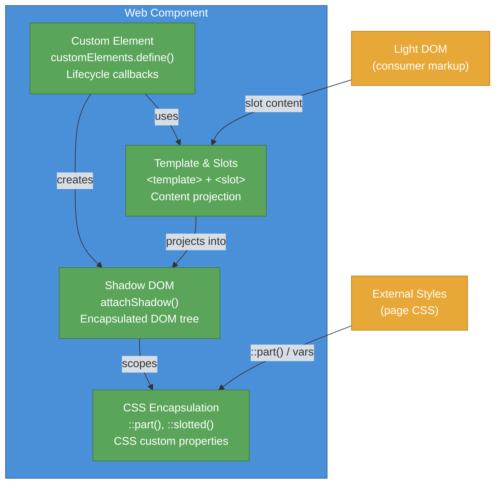

# [FEE-105] Web Components & Custom Elements

:::info
Web Components are a set of browser-native APIs that let you define reusable, encapsulated HTML elements. Custom Elements, Shadow DOM, HTML Templates, and Slots work together to provide component-based development without any framework dependency. Understanding these APIs is essential because they are the platform's answer to component architecture -- and every major framework now offers interop with them.
:::

## Context

The idea of reusable UI components predates the web. Desktop toolkits (Tk, MFC, Swing) shipped component models in the 1990s. On the web, the concept emerged through jQuery plugins, then crystallized with frameworks: AngularJS (2010), React (2013), Vue (2014). Each framework invented its own component model, but none were interoperable -- a React component cannot be used inside Angular without a wrapper.

The web platform responded by standardizing a native component model. The key specifications:

| API | Purpose | Spec |
|-----|---------|------|
| **Custom Elements** | Define new HTML tags with lifecycle callbacks | WHATWG HTML Living Standard |
| **Shadow DOM** | Encapsulated DOM subtree with scoped styles | WHATWG DOM Standard |
| **HTML Templates** | Inert markup fragments via `<template>` | WHATWG HTML Living Standard |
| **Slots** | Content projection from light DOM into shadow DOM | WHATWG HTML / DOM Standard |

### Timeline

| Year | Milestone |
|------|-----------|
| 2011 | Alex Russell proposes Web Components at Fronteers conference |
| 2013 | Chrome ships Custom Elements v0 and Shadow DOM v0 behind flags |
| 2014 | Polymer 0.5 -- Google's library built on Web Components |
| 2016 | Custom Elements v1 and Shadow DOM v1 specifications finalized |
| 2018 | Firefox ships Custom Elements v1 and Shadow DOM v1 |
| 2020 | Edge (Chromium) ships full Web Components support; all major browsers aligned |
| 2023 | Declarative Shadow DOM ships in Chrome, Safari; `shadowrootmode` attribute standardized |
| 2024 | Declarative Shadow DOM reaches Baseline (Firefox ships support); Lit 3.x stable |

### Custom Elements

Custom Elements let you register new HTML tags. There are two kinds:

**Autonomous custom elements** extend `HTMLElement` and define entirely new behavior:

```js
class MyAlert extends HTMLElement {
  constructor() {
    super();
  }
  connectedCallback() {
    this.textContent = 'Hello from <my-alert>!';
  }
}
customElements.define('my-alert', MyAlert);
```

**Customized built-in elements** extend existing HTML elements (e.g., `HTMLButtonElement`) using the `is` attribute. Browser support is inconsistent -- Safari does not implement them -- so most libraries avoid them.

### Lifecycle callbacks

| Callback | When it fires |
|----------|---------------|
| `constructor()` | Element created or upgraded. Call `super()` first. Do not touch attributes or children. |
| `connectedCallback()` | Element inserted into the DOM. Safe to read attributes, fetch data, set up event listeners. |
| `disconnectedCallback()` | Element removed from the DOM. Clean up listeners, observers, timers. |
| `attributeChangedCallback(name, oldValue, newValue)` | An observed attribute changed. Requires static `observedAttributes` getter. |
| `adoptedCallback()` | Element moved to a new document (e.g., via `document.adoptNode()`). Rare in practice. |

### Shadow DOM

Shadow DOM provides DOM and style encapsulation. A shadow root is an isolated subtree attached to an element (the "shadow host"). Styles inside the shadow root do not leak out, and external styles do not leak in (with specific exceptions like inherited properties and CSS custom properties).

```js
class MyCard extends HTMLElement {
  constructor() {
    super();
    const shadow = this.attachShadow({ mode: 'open' });
    shadow.innerHTML = `
      <style>
        :host { display: block; border: 1px solid #ccc; border-radius: 8px; padding: 1rem; }
        :host([variant="highlight"]) { border-color: #4A90D9; }
        ::slotted(h2) { margin-top: 0; }
      </style>
      <slot></slot>
    `;
  }
}
customElements.define('my-card', MyCard);
```

**Mode:** `open` allows external JavaScript to access the shadow root via `element.shadowRoot`. `closed` hides it (returns `null`). In practice, `open` is almost always preferred -- `closed` provides a false sense of security and breaks developer tools.

### Styling the shadow DOM from outside

| Mechanism | What it styles | Example |
|-----------|---------------|---------|
| CSS custom properties | Inherited into shadow DOM | `my-card { --card-bg: #fff; }` |
| `::part()` | Elements with `part` attribute inside shadow DOM | `my-card::part(header) { color: blue; }` |
| `::slotted()` | Slotted light DOM children (top-level only) | `::slotted(h2) { font-size: 1.5rem; }` |
| `:host` | The shadow host from inside | `:host { display: block; }` |
| `:host()` | Conditional host styling | `:host([disabled]) { opacity: 0.5; }` |
| `:host-context()` | Host based on ancestor context | `:host-context(.dark) { background: #333; }` |

### HTML Templates and Slots

The `<template>` element holds inert HTML that is not rendered until cloned via JavaScript:

```html
<template id="card-template">
  <style>
    .card { border: 1px solid #ccc; padding: 1rem; }
  </style>
  <div class="card">
    <slot name="header"></slot>
    <slot></slot>
    <slot name="footer"></slot>
  </div>
</template>
```

**Named slots** project specific children; the **default slot** (unnamed) receives all unassigned children:

```html
<my-card>
  <h2 slot="header">Title</h2>
  <p>Main content goes into the default slot.</p>
  <footer slot="footer">Footer content</footer>
</my-card>
```

### Declarative Shadow DOM

Traditionally, Shadow DOM requires JavaScript to call `attachShadow()`. Declarative Shadow DOM (DSD) enables shadow roots in static HTML using a `<template>` with the `shadowrootmode` attribute:

```html
<my-card>
  <template shadowrootmode="open">
    <style>
      :host { display: block; border: 1px solid #ccc; padding: 1rem; }
    </style>
    <slot></slot>
  </template>
  <p>This content is projected into the slot.</p>
</my-card>
```

DSD is essential for server-side rendering (SSR) of Web Components. Without it, shadow DOM content cannot be included in the initial HTML payload -- the page must wait for JavaScript to execute before the component renders. DSD reached Baseline status across all major browsers in 2024.

### Form-associated custom elements

By default, custom elements do not participate in form submission. The `ElementInternals` API changes this:

```js
class MyInput extends HTMLElement {
  static formAssociated = true;

  constructor() {
    super();
    this.internals = this.attachInternals();
    this.attachShadow({ mode: 'open' });
  }

  connectedCallback() {
    this.shadowRoot.innerHTML = `
      <label><slot></slot></label>
      <input type="text" />
    `;
    const input = this.shadowRoot.querySelector('input');
    input.addEventListener('input', (e) => {
      this.internals.setFormValue(e.target.value);
    });
  }

  // Form lifecycle callbacks
  formResetCallback() {
    this.shadowRoot.querySelector('input').value = '';
    this.internals.setFormValue('');
  }

  formStateRestoreCallback(state) {
    this.shadowRoot.querySelector('input').value = state;
    this.internals.setFormValue(state);
  }
}
customElements.define('my-input', MyInput);
```

`ElementInternals` provides:

- **`setFormValue(value)`** -- Sets the element's submission value
- **`setValidity(flags, message, anchor)`** -- Custom validation with constraint validation API
- **`reportValidity()`** -- Triggers the browser's validation UI
- **ARIA delegation** -- `internals.role`, `internals.ariaLabel`, etc.
- **Custom states** -- `internals.states.add('checked')` exposes `:state(checked)` pseudo-class

### Custom Elements Manifest

The Custom Elements Manifest (`custom-elements.json`) is a community standard file format that describes a package's custom elements -- their attributes, properties, methods, events, slots, CSS custom properties, and CSS parts. The current schema version is 2.1.0.

Tools consume the manifest for:

- **IDE support** -- Autocompletion, hover documentation, unknown-tag warnings in HTML and template syntaxes
- **Documentation generation** -- Storybook, API docs viewers
- **Framework wrappers** -- Automated React/Vue/Angular wrapper generation

The `@custom-elements-manifest/analyzer` (from Open Web Components) generates the manifest from source code. Packages should declare the manifest location in `package.json`:

```json
{
  "customElements": "custom-elements.json"
}
```

## Design Thinking

### Why the platform standardized components

Frameworks invented the component model for the web. AngularJS (2010) introduced directives that extended HTML. React (2013) introduced JSX and a virtual DOM. Vue (2014) introduced single-file components. Each solved the same problem -- reusable, encapsulated UI units -- but created mutually incompatible ecosystems.

The platform standardized Web Components not to replace frameworks but to provide a **framework-agnostic baseline**. A custom element registered with `customElements.define()` works in any context that renders HTML: React, Vue, Angular, Svelte, server-rendered HTML, CMS themes, email templates, or a plain `.html` file with no build step.

### Coexistence with frameworks

Web Components and frameworks are not competing technologies. They occupy different niches:

**Lit** (Google, ~5KB) is a thin wrapper around the native APIs, adding reactive properties, declarative templates with tagged template literals, and efficient DOM updates. Lit components *are* custom elements -- they extend `LitElement` which extends `HTMLElement`.

**Stencil** (Ionic) is a compiler that produces standard custom elements from a TypeScript + JSX authoring format. The output is framework-free.

**Vue** provides `defineCustomElement()` to wrap any Vue component as a custom element, including SFC styles and slot mapping.

**Angular Elements** wraps Angular components as custom elements using `createCustomElement()`.

**React** has historically had limited Web Components support (string-only attribute setting, no event listener binding). React 19 improved this with better custom element property handling, but the integration remains less seamless than Vue or Angular.

### When to use Web Components

Web Components excel at **horizontal sharing** -- components used across different frameworks or outside any framework:

| Use case | Web Components | Framework components |
|----------|----------------|---------------------|
| **Design systems** shared across teams using different frameworks | Preferred -- works everywhere | Each team needs framework-specific wrappers |
| **Micro-frontends** | Good fit -- each micro-frontend can use any internal technology | Requires runtime-specific shell |
| **CMS widgets, embeddable components** | Ideal -- no framework dependency for consumers | Requires bundling the framework runtime |
| **Application internals** (routing, state, complex UIs) | Overkill -- frameworks provide better DX | Preferred -- reactive state, tooling, ecosystem |
| **Performance-critical lists, tables** | Neutral -- Shadow DOM has overhead per instance | Framework virtual DOM can batch updates |

The decision is context-dependent. A design system team building components for five teams using three different frameworks has a strong case for Web Components. A product team building a single React application does not.

## Best Practices

**Tag names MUST contain a hyphen.** Every custom element name must include at least one hyphen (e.g., `my-button`, `app-header`). This is a hard browser requirement that separates custom elements from built-in HTML elements. AVOID single-word names; the browser will silently treat them as unknown built-ins rather than custom elements.

**Declare `observedAttributes` for every attribute that drives rendering.** The static `observedAttributes` getter is the contract between the element and the browser's attribute change notification system. MUST declare all reactive attributes here; `attributeChangedCallback` will only fire for listed names. SHOULD keep the list minimal -- only include attributes whose changes require a DOM or state update.

**Decide Shadow DOM boundaries deliberately before shipping.** Shadow DOM is a one-way door: adding or removing it later is a breaking change for consumers using CSS selectors or JavaScript that traverses your element's internals. SHOULD use Shadow DOM for self-contained components with no external styling requirements. SHOULD expose styling surface through CSS custom properties and `::part()` for components that belong to a design system. AVOID `closed` mode -- it breaks DevTools inspection without providing real security.

**Use `ElementInternals` for any element that participates in a form.** Custom elements do not participate in form submission, validation, or reset by default. MUST set `static formAssociated = true` and call `attachInternals()` to opt in. SHOULD implement `formResetCallback` and `formStateRestoreCallback` to match native input behavior. AVOID intercepting `submit` events as a substitute for proper form association.

**Keep slot composition shallow and explicit.** Named slots (`slot="header"`, `slot="footer"`) make the element's composition API explicit and prevent accidental content projection. SHOULD use named slots for distinct content areas and a single unnamed default slot for body content. AVOID nesting slots more than one level deep -- slotted content is styled with `::slotted()` which only matches top-level slotted children, not their descendants.

## Visual

### Web Component anatomy



A Web Component combines four platform APIs into a single reusable element. The Custom Element defines the tag and its behavior. The Shadow DOM provides an encapsulated DOM subtree with scoped styles. Templates and Slots enable content projection from the consumer's light DOM into the component's shadow DOM. CSS encapsulation keeps styles isolated while `::part()`, `::slotted()`, and CSS custom properties provide controlled styling hooks for consumers.

## Example

### 1. Basic custom element with Shadow DOM

```html
<user-badge name="Alice" role="admin"></user-badge>

<script>
class UserBadge extends HTMLElement {
  static observedAttributes = ['name', 'role'];

  constructor() {
    super();
    this.attachShadow({ mode: 'open' });
  }

  connectedCallback() {
    this.render();
  }

  attributeChangedCallback() {
    // Re-render when observed attributes change
    if (this.shadowRoot) this.render();
  }

  render() {
    const name = this.getAttribute('name') || 'Unknown';
    const role = this.getAttribute('role') || 'user';
    this.shadowRoot.innerHTML = `
      <style>
        :host {
          display: inline-flex;
          align-items: center;
          gap: 0.5rem;
          padding: 0.25rem 0.75rem;
          border-radius: 9999px;
          font-family: system-ui, sans-serif;
          font-size: 0.875rem;
          border: 1px solid #ccc;
        }
        :host([role="admin"]) {
          border-color: #4A90D9;
          background: #EBF3FB;
        }
        .dot {
          width: 8px;
          height: 8px;
          border-radius: 50%;
          background: #5BA55B;
        }
        span { font-weight: 600; }
      </style>
      <span class="dot" part="indicator"></span>
      <span part="name">${name}</span>
      <small>(${role})</small>
    `;
  }
}
customElements.define('user-badge', UserBadge);
</script>
```

This example demonstrates: registering a custom element with `customElements.define()`, using `observedAttributes` with `attributeChangedCallback` for reactive attribute changes, Shadow DOM for style encapsulation, `:host()` for conditional host styling, and `part` attributes for external styling hooks.

### 2. Content projection with slots

```html
<template id="info-panel-template">
  <style>
    :host {
      display: block;
      border: 1px solid #ddd;
      border-radius: 8px;
      overflow: hidden;
      font-family: system-ui, sans-serif;
    }
    header {
      background: #f5f5f5;
      padding: 0.75rem 1rem;
      border-bottom: 1px solid #ddd;
    }
    .body { padding: 1rem; }
    footer {
      background: #fafafa;
      padding: 0.5rem 1rem;
      border-top: 1px solid #ddd;
      font-size: 0.875rem;
      color: #666;
    }
    ::slotted(h2) { margin: 0; font-size: 1.125rem; }
    ::slotted(p) { margin: 0.5rem 0 0; }
  </style>
  <header><slot name="header"></slot></header>
  <div class="body"><slot></slot></div>
  <footer><slot name="footer">Default footer text</slot></footer>
</template>

<script>
class InfoPanel extends HTMLElement {
  constructor() {
    super();
    const template = document.getElementById('info-panel-template');
    this.attachShadow({ mode: 'open' })
        .appendChild(template.content.cloneNode(true));
  }
}
customElements.define('info-panel', InfoPanel);
</script>

<!-- Usage -->
<info-panel>
  <h2 slot="header">Server Status</h2>
  <p>All systems operational.</p>
  <p>Last checked: 2 minutes ago.</p>
  <span slot="footer">Updated every 60 seconds</span>
</info-panel>
```

This example demonstrates: using `<template>` for component markup, named slots (`header`, `footer`) and a default slot for content projection, `::slotted()` for styling projected content, and fallback content inside a `<slot>` element ("Default footer text" shows when no content is assigned).

### 3. Form-associated custom element with ElementInternals

```html
<form id="demo-form">
  <star-rating name="rating" required>Rating</star-rating>
  <button type="submit">Submit</button>
</form>

<script>
class StarRating extends HTMLElement {
  static formAssociated = true;
  static observedAttributes = ['value'];

  constructor() {
    super();
    this.internals = this.attachInternals();
    this.attachShadow({ mode: 'open' });
    this._value = 0;
  }

  connectedCallback() {
    this.shadowRoot.innerHTML = `
      <style>
        :host { display: inline-flex; align-items: center; gap: 0.5rem; }
        .stars { display: inline-flex; cursor: pointer; }
        .star { font-size: 1.5rem; color: #ccc; transition: color 0.15s; }
        .star.active { color: #f5a623; }
        .star:hover, .star:hover ~ .star { color: #f5c66a; }
        label { font-size: 0.875rem; font-family: system-ui, sans-serif; }
        :host(:state(invalid)) .stars { outline: 2px solid red; border-radius: 4px; }
      </style>
      <label><slot></slot></label>
      <span class="stars" role="radiogroup">${
        [1, 2, 3, 4, 5].map(n =>
          `<span class="star" role="radio" aria-label="${n} star${n > 1 ? 's' : ''}" data-value="${n}">&#9733;</span>`
        ).join('')
      }</span>
    `;

    this.shadowRoot.querySelector('.stars').addEventListener('click', (e) => {
      const star = e.target.closest('.star');
      if (!star) return;
      this.value = Number(star.dataset.value);
    });

    // Set initial validity
    if (this.hasAttribute('required')) {
      this.internals.setValidity(
        { valueMissing: true },
        'Please select a rating.',
        this.shadowRoot.querySelector('.stars')
      );
    }
  }

  get value() { return this._value; }

  set value(v) {
    this._value = v;
    this.internals.setFormValue(v > 0 ? String(v) : null);
    // Update validity
    if (this.hasAttribute('required') && v === 0) {
      this.internals.setValidity(
        { valueMissing: true },
        'Please select a rating.',
        this.shadowRoot.querySelector('.stars')
      );
      this.internals.states.delete('valid');
      this.internals.states.add('invalid');
    } else {
      this.internals.setValidity({});
      this.internals.states.delete('invalid');
      this.internals.states.add('valid');
    }
    // Update visual state
    this.shadowRoot.querySelectorAll('.star').forEach((star, i) => {
      star.classList.toggle('active', i < v);
      star.setAttribute('aria-checked', i < v ? 'true' : 'false');
    });
  }

  formResetCallback() {
    this.value = 0;
  }

  formStateRestoreCallback(state) {
    this.value = Number(state) || 0;
  }
}
customElements.define('star-rating', StarRating);

document.getElementById('demo-form').addEventListener('submit', (e) => {
  e.preventDefault();
  const data = new FormData(e.target);
  console.log('Rating:', data.get('rating')); // "1" through "5"
});
</script>
```

This example demonstrates: `static formAssociated = true` to opt into form participation, `attachInternals()` for form integration, `setFormValue()` to set the submission value, `setValidity()` with custom validation messages, custom states via `internals.states` exposed as `:state(invalid)` in CSS, and form lifecycle callbacks (`formResetCallback`, `formStateRestoreCallback`).

## Deep Dive

### The custom element upgrade lifecycle

When the HTML parser encounters an unknown tag like `<my-badge>`, it creates a plain `HTMLElement` instance with no custom behavior. The element exists in the DOM but is in the **undefined** state -- it has no class, no lifecycle callbacks, and no shadow root.

`customElements.define('my-badge', MyBadge)` transitions the registry from undefined to **defined**. The browser then runs the **upgrade algorithm** synchronously on every matching element already present in the DOM. During upgrade, the element's prototype chain is swapped to the registered class, the `constructor` body runs (with the constraint that attributes and children already exist on the element), and the element enters the **upgraded** state.

`connectedCallback` fires **after** upgrade completes, not when the parser first encounters the tag. This distinction matters: if the script that calls `customElements.define()` loads asynchronously (as a deferred or dynamically imported module), there is a window during which the element is in the DOM but has no custom behavior. Users may see unstyled or empty content during this window.

For server-rendered HTML (SSR), this timing is central to the rendering model. The server emits the element's markup, the browser parses and displays it (potentially with Declarative Shadow DOM providing the initial visual structure), and the custom element class upgrades the element when the script arrives. The element renders before JavaScript loads -- upgrade is asynchronous relative to parsing.

**`customElements.whenDefined()`** is the correct pattern for any code that depends on an element being upgraded before running:

```js
// Waits until 'user-badge' is defined and upgraded, then resolves
await customElements.whenDefined('user-badge');
const badges = document.querySelectorAll('user-badge');
badges.forEach(badge => badge.refresh());
```

The method returns a Promise that resolves to the constructor once `customElements.define()` has been called. This is safer than `DOMContentLoaded` (which fires before deferred scripts execute) and more precise than a global `load` event. Use it when orchestrating page initialization logic that depends on custom element behavior being available.

The complete state sequence is: **undefined** (parser encounters unknown tag) → **defined** (class registered) → **upgraded** (upgrade algorithm runs, `constructor` executes) → **connected** (`connectedCallback` fires after insertion). Understanding this sequence prevents bugs where code reads element properties or calls element methods before the element has been upgraded.

## Common Mistakes

### 1. Not calling super() in constructor

```js
// WRONG: missing super() call
class MyElement extends HTMLElement {
  constructor() {
    this.data = [];
  }
}
```

**Impact.** The browser throws a `ReferenceError`: "Must call super constructor in derived class before accessing 'this'". The element cannot be instantiated.

**Fix.** Always call `super()` as the first statement in the constructor:

```js
class MyElement extends HTMLElement {
  constructor() {
    super();
    this.data = [];
  }
}
```

### 2. DOM manipulation in constructor

```js
// WRONG: accessing attributes and children in constructor
class MyElement extends HTMLElement {
  constructor() {
    super();
    this.textContent = this.getAttribute('label'); // attribute may not exist yet
    this.appendChild(document.createElement('div')); // throws in some upgrade scenarios
  }
}
```

**Impact.** When the parser creates the element, attributes and children may not yet be available. The `createElement` path and the parser upgrade path behave differently, leading to inconsistent results. The spec explicitly forbids inspecting attributes or adding children in the constructor.

**Fix.** Defer DOM work to `connectedCallback()`:

```js
class MyElement extends HTMLElement {
  constructor() {
    super();
    this.attachShadow({ mode: 'open' }); // attachShadow is allowed in constructor
  }

  connectedCallback() {
    const label = this.getAttribute('label') || 'Default';
    this.shadowRoot.innerHTML = `<span>${label}</span>`;
  }
}
```

### 3. Forgetting customElements.define()

```html
<!-- WRONG: class defined but never registered -->
<my-widget>Content here</my-widget>
<script>
  class MyWidget extends HTMLElement {
    connectedCallback() {
      this.textContent = 'Widget loaded';
    }
  }
  // Missing: customElements.define('my-widget', MyWidget);
</script>
```

**Impact.** The browser treats `<my-widget>` as an `HTMLUnknownElement`. No lifecycle callbacks fire. The element appears in the DOM but has no custom behavior. There are no errors in the console -- it fails silently.

**Fix.** Always register the element after defining the class:

```js
customElements.define('my-widget', MyWidget);
```

Note: the tag name must contain a hyphen (`-`) to distinguish custom elements from built-in HTML elements.

## Related FEEs

| FEE | Relationship |
|-----|-------------|
| [FEE-100 HTML & Semantic Markup Overview](./100.md) | Parent overview covering the full HTML category including Web Components as a sub-topic. |
| [FEE-102 Semantic Elements & Accessibility](./102.md) | Slots preserve semantic structure -- slotted content remains in the accessibility tree. ARIA roles and properties apply to custom elements via ElementInternals. |
| [FEE-205 CSS Scoping & Encapsulation](../CSS%20and%20Layout%20Systems/205.md) | Shadow DOM CSS scoping rules, `::part()`, `::slotted()`, CSS custom properties crossing shadow boundaries. |
| [FEE-500 Component Architecture](../Component%20Architecture%20and%20Design%20Patterns/500.md) | Web Components are the platform's component model. Framework component models (React, Vue, Angular) coexist with and can wrap or consume custom elements. |

## References

- [WHATWG HTML Living Standard -- Custom Elements](https://html.spec.whatwg.org/multipage/custom-elements.html) -- Authoritative specification for custom element definition, lifecycle callbacks, form-associated custom elements, and the CustomElementRegistry API
- [MDN: Web Components](https://developer.mozilla.org/en-US/docs/Web/API/Web_components) -- Comprehensive reference and guides for Custom Elements, Shadow DOM, Templates, and Slots
- [MDN: Using Custom Elements](https://developer.mozilla.org/en-US/docs/Web/API/Web_components/Using_custom_elements) -- Practical guide to defining and using autonomous and customized built-in elements
- [MDN: Using Shadow DOM](https://developer.mozilla.org/en-US/docs/Web/API/Web_components/Using_shadow_DOM) -- Guide to attachShadow(), open vs closed mode, and shadow DOM concepts
- [MDN: Using Templates and Slots](https://developer.mozilla.org/en-US/docs/Web/API/Web_components/Using_templates_and_slots) -- Guide to template element and named/default slot content projection
- [MDN: ElementInternals](https://developer.mozilla.org/en-US/docs/Web/API/ElementInternals) -- API reference for form association, custom validation, ARIA delegation, and custom states
- [web.dev: Custom Elements v1](https://web.dev/articles/custom-elements-v1) -- Practical guide to custom element authoring with examples and best practices
- [web.dev: Declarative Shadow DOM](https://web.dev/articles/declarative-shadow-dom) -- Guide to server-side rendering Web Components with the shadowrootmode attribute
- [Lit Documentation](https://lit.dev/docs/) -- Documentation for Lit, a lightweight library for building Web Components with reactive properties and declarative templates
- [Custom Elements Manifest](https://github.com/webcomponents/custom-elements-manifest) -- Community standard schema (v2.1.0) for describing custom elements metadata in custom-elements.json
- [WebKit: ElementInternals and Form-Associated Custom Elements](https://webkit.org/blog/13711/elementinternals-and-form-associated-custom-elements/) -- WebKit's explanation of the ElementInternals API and form participation
