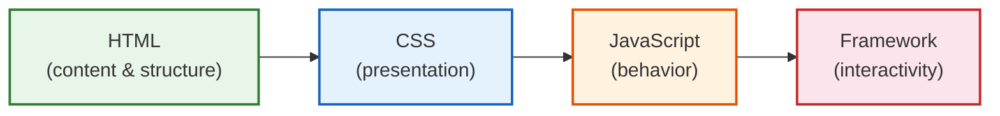

# [FEE-106] HTML APIs & Progressive Enhancement

:::info
HTML provides built-in interactivity, navigation, form processing, and resource loading: a runtime that works before any JavaScript executes. Progressive enhancement is the design philosophy that starts with this HTML baseline and layers CSS and JavaScript on top. Understanding HTML's native APIs and the progressive enhancement model matters because it produces websites that are faster, more accessible, more resilient, and more SEO-friendly than JavaScript-first alternatives.
:::

## Context

The web was designed as a document platform. The first web browser was also an editor. Links navigated. Forms submitted. Content was readable without scripts. That was the web's original architecture, not a later limitation.

As JavaScript gained capabilities through DHTML (1997), Ajax (2005), and single-page applications (2010s), developers increasingly moved core functionality from HTML to JavaScript. The result: websites that show blank pages when scripts fail, forms that cannot submit without a 200 KB bundle, and navigation that breaks the back button.

Progressive enhancement pushes back against this trend. The term was coined by Steve Champeon in 2003, but the underlying principle predates the web: graceful degradation in engineering means a system continues to operate when components fail. Progressive enhancement inverts the perspective: instead of building the full experience and degrading, you build the baseline and enhance.

A concrete case: an FAQ section for a support page draws significant traffic from users on corporate networks and low-powered devices, some of whom have JavaScript disabled by policy. The design calls for expandable answer panels, a modal confirmation before a destructive action, and a floating notification badge, all of which the team has been building in JavaScript. Building them JavaScript-first means users without it see broken UI or nothing at all. HTML's `<details>`, `<dialog>`, and `popover` APIs implement all three patterns natively; adding JavaScript on top enhances them for capable environments without forking the codebase. The "HTML-Driven Interactivity" section below walks through all three, plus the newer `command`/`commandfor` invoker attributes that extend the same pattern.

## Visual

### The Enhancement Layers



Each layer adds capability but is not required for the previous layers to function:

| Layer | What it provides | Works without JS? |
|-------|-----------------|-------------------|
| **HTML** | Content, links, forms, media, structure | Yes |
| **CSS** | Layout, color, typography, animation, responsive design | Yes |
| **JavaScript** | DOM manipulation, fetch, validation, real-time updates | N/A |
| **Framework** | Components, state management, routing, hydration | No |

### Timeline of HTML Interactive Features

Baseline is the Web Platform Baseline status: a feature counts as Baseline once it works across the current versions of all core browsers (Chrome, Edge, Firefox, and Safari), not just the first engine that ships it. The table below distinguishes "ships in Chrome" (a single-engine milestone) from "reaches Baseline" (cross-engine availability), because the gap between the two can be a year or more.

| Year | Feature | Spec |
|------|---------|------|
| 1993 | `<a href>` -- hyperlink navigation | HTML 1.0 |
| 1995 | `<form>` submission with `action` and `method` | HTML 2.0 |
| 1998 | `<details>` / `<summary>` proposed (shipped much later) | -- |
| 2006 | `contenteditable` attribute | WHATWG HTML |
| 2011 | `<details>` / `<summary>` ships in Chrome | WHATWG HTML |
| 2014 | `draggable` attribute and Drag & Drop API | WHATWG HTML |
| 2017 | `loading="lazy"` proposed | WHATWG HTML |
| 2019 | `loading="lazy"` ships in Chrome | WHATWG HTML |
| 2022 | Navigation API ships in Chrome (Chrome 102) | WHATWG HTML |
| 2023 | `inert` attribute reaches Baseline (Firefox 112) | WHATWG HTML |
| 2023 | View Transitions API (same-document) ships in Chrome | W3C CSS WG / WHATWG |
| 2024 | `fetchpriority` attribute reaches Baseline | WHATWG HTML |
| 2024 | Cross-document View Transitions ship in Chrome | W3C CSS WG / WHATWG |
| 2025 | Same-document View Transitions reach Baseline (Firefox 144) | W3C CSS WG / WHATWG |
| 2026 | Navigation API reaches Baseline (Firefox 147, Safari 26.2) | WHATWG HTML |

## Best Practices

**Use feature detection, not user-agent sniffing.** MUST check for the presence of a specific API (e.g., `if (!document.startViewTransition)`) rather than inspecting `navigator.userAgent`. Feature detection is reliable across browser versions and prevents false negatives when vendors update their UA strings. AVOID branching on UA strings for any progressive enhancement decision.

**Build in layers: HTML baseline first, then CSS, then JavaScript.** SHOULD design every interactive flow so that the HTML layer alone delivers usable functionality: a form that submits, a link that navigates, content that is readable. CSS SHOULD then add layout and visual polish. JavaScript SHOULD add richer behavior on top without removing access to the HTML-layer path. Functionality that exists only in the JS layer is invisible to users when scripts fail or are blocked.

**Prefer `<dialog>` over custom modal implementations.** SHOULD use the native `<dialog>` element with `showModal()` rather than building modals from `<div>` overlays. `<dialog>` provides focus trapping, Escape-key dismissal, the `::backdrop` pseudo-element, and the correct ARIA `dialog` role for free. Custom implementations MUST manually replicate all of these behaviors and commonly miss edge cases. Combine `<dialog>` with the `inert` attribute on background content for defense-in-depth focus management.

**Apply progressive enhancement to the View Transitions API.** MUST guard all uses of `document.startViewTransition()` with a feature-detection check and MUST perform the DOM update in the fallback path so the page remains functional in browsers without support. AVOID making the View Transitions API a hard dependency: the transition is a visual enhancement, not a functional requirement.

**Use the Popover API for non-modal overlays.** SHOULD use the declarative `popover` attribute and `popovertarget` for tooltips, menus, and non-blocking overlays rather than building these in JavaScript. The Popover API provides top-layer rendering, light-dismiss behavior (click outside or Escape to close), and correct accessibility semantics with zero script for the toggle itself. Reserve `<dialog>` with `showModal()` for flows that require the user to respond before proceeding.

## Design Thinking

### Why HTML-First Matters

**Works without JavaScript.** A 2013 study of gov.uk users found that 1.1% did not receive JavaScript enhancements: about 0.2% had JavaScript disabled or used a browser that did not support it, and the remaining 0.9% had JavaScript enabled but it failed to load, for reasons such as corporate network blocking, browser/script errors, or failed page loads. The figure is over a decade old and specific to one government site, so treat it as directional rather than a current, universal percentage: a meaningful slice of real traffic never receives JavaScript, for reasons outside a team's control. A form with `action="/submit" method="POST"` submits even with JavaScript disabled; a form whose submit handler only calls `fetch()` does not.

**Faster first render.** HTML streams. The browser can render content as it arrives, before CSS or JavaScript has loaded. A server-rendered page with `<a>` links is interactive at first byte. A JavaScript-rendered page is interactive only after the bundle downloads, parses, compiles, and executes: a cost that grows with bundle size and is heaviest on low-end mobile CPUs.

**Accessible by default.** Native HTML elements carry implicit ARIA roles, keyboard behavior, and focus management. A `<button>` is focusable, activatable via Enter and Space, and announced as "button" by screen readers. A `<div onclick>` has none of these properties without manual remediation.

**SEO-friendly.** Search engines index HTML content reliably. While Googlebot can execute JavaScript, it does so in a deferred rendering queue. HTML content is indexed immediately.

### Framework Progressive Enhancement

Many modern frameworks share a common pattern: render HTML on the server and let JavaScript enhance it. The spectrum:

**SvelteKit form actions.** SvelteKit's `use:enhance` directive progressively enhances native forms. Without JavaScript, the form submits via standard HTTP POST. With JavaScript, SvelteKit intercepts the submission, sends it via `fetch`, and updates the page without a full reload. The same `+page.server.ts` action handles both cases.

**Remix philosophy.** Remix models data flow as `request -> loader -> render -> action -> revalidate`. Forms use native `<form>` with `action` and `method`. The `<Form>` component (capital F) adds client-side enhancement but falls back to native behavior. Remix's guiding principle: "Use the platform."

**Astro Islands.** Astro renders pages as static HTML by default, shipping zero JavaScript. Interactive components are explicitly marked with `client:*` directives (`client:load`, `client:visible`, `client:idle`), creating "islands" of interactivity in a sea of static HTML. Components from any framework (React, Vue, Svelte, Solid) can coexist on the same page.

**Next.js Server Components.** React Server Components (RSC) run on the server and produce HTML with zero client-side JavaScript for the component itself. Client components are explicitly marked with `"use client"`. This creates a spectrum: pages can be entirely server-rendered, entirely client-rendered, or anywhere in between.

**React Server Actions.** Server Actions allow forms to call server functions directly. The `action` prop on `<form>` accepts an async server function. Without JavaScript, the form falls back to standard POST submission with a full page reload.

### The SSR / Hydration Spectrum

```
Static HTML ──> SSR ──> Selective Hydration ──> Full SPA
     │              │              │                   │
     │              │              │                   └─ All JS ships,
     │              │              │                      client renders everything
     │              │              └─ Server-rendered HTML,
     │              │                 only interactive parts hydrate
     │              └─ Server renders full HTML,
     │                 client re-renders to attach event handlers
     └─ No JavaScript at all,
        pure HTML/CSS
```

A wave of newer meta-frameworks, including Astro, Qwik, and Fresh, push toward less client JavaScript and more HTML, though most existing production apps remain client-rendered SPAs. React (via Server Components) and Next.js (via the App Router) also ship less JavaScript to the client than their predecessors, without abandoning client rendering entirely.

## HTML-Driven Interactivity (No JS Required)

### Link Navigation

The `<a>` element is the web's original interactive element. It handles navigation, history management, focus, and accessibility without any JavaScript:

```html
<!-- Basic navigation -- works everywhere -->
<nav>
  <a href="/products">Products</a>
  <a href="/about">About Us</a>
  <a href="#pricing">Jump to Pricing</a>
  <a href="mailto:support@example.com">Email Support</a>
</nav>
```

### Form Submission

Forms process user input and submit data to servers using only HTML:

```html
<!-- Search form -- works without JavaScript -->
<form action="/search" method="GET">
  <label for="q">Search</label>
  <input id="q" name="q" type="search" required />
  <button type="submit">Search</button>
</form>
```

The browser handles serialization (`q=term`), HTTP method, encoding, redirect following, and error display, all without scripts.

### Details Disclosure

The `<details>` / `<summary>` pair provides native expand/collapse:

```html
<details>
  <summary>Shipping Information</summary>
  <p>We ship to 40 countries. Standard delivery takes 5-7 business days.</p>
  <p>Express delivery is available for an additional fee.</p>
</details>
```

The browser handles toggle state, keyboard activation (Enter/Space), and ARIA `expanded` state. No JavaScript required.

### Popover Notifications

The `popover` attribute and `popovertarget` create a floating overlay that opens, closes, and dismisses itself without a script:

```html
<button popovertarget="save-notice">Save</button>

<div id="save-notice" popover>
  Changes saved.
</div>
```

Clicking the button toggles the `[popover]` element open. The browser renders it in the top layer, above other page content, and closes it automatically on an outside click or the Escape key (light-dismiss). Keyboard focus and ARIA semantics are handled natively; no `click` listener is required for the toggle itself.

### Invoker Commands (`command` / `commandfor`)

The `command` and `commandfor` attributes extend the same declarative-invocation pattern to `<dialog>` as well as popover elements, not just the popovers that `popovertarget` already handles:

```html
<button commandfor="confirm-dialog" command="show-modal">Delete Account</button>

<dialog id="confirm-dialog">
  <p>This action cannot be undone.</p>
  <button commandfor="confirm-dialog" command="close">Cancel</button>
</dialog>
```

`commandfor` points at the target element by `id`; `command` names the action. `show-modal` and `close` mirror the `HTMLDialogElement` methods of the same name, and `toggle-popover` / `show-popover` / `hide-popover` do the equivalent for popovers. The attributes shipped in Chrome 135 (2025) and reached Baseline Newly Available in December 2025. No `click` listener or JavaScript is required to open or close the dialog.

## Content Attributes as API

HTML attributes are a declarative API surface. They configure behavior without scripts:

### data-* Attributes

Custom data attributes store element-specific metadata accessible via `element.dataset`:

```html
<button data-action="delete" data-item-id="42">Delete</button>

<script>
  // Enhancement: read data attributes for delegation
  document.addEventListener('click', (e) => {
    const btn = e.target.closest('[data-action]');
    if (!btn) return;
    const action = btn.dataset.action;   // "delete"
    const id = btn.dataset.itemId;       // "42" (camelCase conversion)
    handleAction(action, id);
  });
</script>
```

### contenteditable

Makes any element editable in-place:

```html
<div contenteditable="true" role="textbox" aria-label="Notes">
  Click to edit this text.
</div>
```

The `contenteditable="plaintext-only"` value (Baseline 2025) restricts input to plain text, preventing rich formatting issues.

### draggable

Enables native drag-and-drop:

```html
<div draggable="true" data-task-id="1">Task: Review PR #42</div>
```

The Drag and Drop API (`dragstart`, `dragover`, `drop` events) builds on this attribute to create reorderable lists, file upload zones, and kanban boards.

### inert

The `inert` attribute makes an element and all its descendants non-interactive:

```html
<!-- Content behind a modal is inert -->
<main inert>
  <h1>Page Content</h1>
  <p>This content cannot be focused, clicked, or selected while inert.</p>
</main>

<dialog open>
  <h2>Confirm Action</h2>
  <p>Are you sure you want to proceed?</p>
  <button>Cancel</button>
  <button>Confirm</button>
</dialog>
```

When `inert` is set:
- The element and descendants are removed from the tab order
- Click events are ignored (`pointer-events: none` behavior)
- Text selection is disabled (`user-select: none` behavior)
- The element is hidden from assistive technology (accessibility tree)
- Find-in-page (Ctrl+F) skips inert content

### autofocus

Moves focus to an element when it is inserted into the DOM:

```html
<dialog>
  <h2>Delete Item</h2>
  <p>This cannot be undone.</p>
  <button>Cancel</button>
  <button autofocus>Delete</button>
</dialog>
```

Use `autofocus` sparingly. It is appropriate for dialogs and modals, but problematic on page load (it disrupts screen reader reading order) and especially harmful on SPA route changes, where it can move focus unexpectedly.

## Declarative Features

### loading="lazy"

Defers loading of images and iframes until they approach the viewport:

```html

<iframe src="https://maps.example.com/embed" loading="lazy"></iframe>
```

Always specify `width` and `height` (or use CSS `aspect-ratio`) to prevent layout shift. Do not lazy-load above-the-fold images; they should load immediately.

### fetchpriority

Hints the browser about relative download priority:

```html
<!-- LCP image: load as soon as possible -->


<!-- Below-the-fold image: lower priority -->


<!-- Critical CSS or script -->
<link rel="preload" href="/fonts/Inter.woff2" as="font" fetchpriority="high" crossorigin />
```

Values: `high`, `low`, `auto` (default). The browser uses these hints alongside its own heuristics. Setting `fetchpriority="high"` on the LCP image can meaningfully improve Largest Contentful Paint by requesting that image ahead of lower-priority resources; the exact improvement depends on network conditions, server response time, and what else is competing for bandwidth.

### View Transitions API

The View Transitions API provides animated transitions between DOM states. Same-document transitions reached Baseline in October 2025, when Firefox 144 added support. Cross-document transitions (MPA) shipped in Chrome and are still progressing toward Baseline in other browsers.

```html
<!-- Opt in to cross-document view transitions in CSS -->
<style>
  @view-transition {
    navigation: auto;
  }
</style>
```

```js
// Same-document view transition (SPA)
function navigateTo(newContent) {
  if (!document.startViewTransition) {
    // Fallback: just update the DOM
    updateDOM(newContent);
    return;
  }

  document.startViewTransition(() => {
    updateDOM(newContent);
  });
}
```

Elements can be tagged for matched-element transitions using `view-transition-name`:

```css
.hero-image {
  view-transition-name: hero;
}
```

The API is a progressive enhancement by design: if the browser does not support it, the DOM update happens instantly without animation.

## Navigation API

The Navigation API shipped in Chrome 102 in 2022 but did not reach Baseline until January 2026, when Firefox 147 (2026-01-13) and Safari 26.2 (2025-12-12) added support. It provides a modern replacement for `history.pushState` / `popstate`, integrates with the platform's navigation model, and supports view transitions:

```js
navigation.addEventListener('navigate', (event) => {
  // Only handle same-origin navigations
  if (!event.canIntercept) return;

  const url = new URL(event.destination.url);

  event.intercept({
    handler: async () => {
      const content = await fetchPageContent(url.pathname);
      document.querySelector('main').innerHTML = content;
    },
  });
});
```

Framework routers (React Router, Vue Router, SvelteKit) now build on or align with the Navigation API. The API provides:

- `navigation.navigate()`: programmatic navigation
- `navigation.back()` / `navigation.forward()`: history traversal
- `NavigateEvent.intercept()`: client-side route handling
- `navigation.currentEntry`: current history entry with state
- Integration with the View Transitions API via `NavigateEvent.intercept({ handler })` returning view transitions

Before shipping any Navigation API code, verify current support against the timeline above; a page that assumed Baseline availability in 2024 or 2025 would have broken navigation for every Firefox user until January 2026 and every Safari user until Safari 26.2 shipped in December 2025.

## Examples

### 1. Form That Works Without JS, Enhanced With JS

This example demonstrates the core progressive enhancement pattern: a form that works with standard HTTP submission, enhanced with `fetch` and a pending-state UI when JavaScript is available.

```html
<!-- Baseline: works without JavaScript -->
<form id="contact-form" action="/api/contact" method="POST">
  <label for="name">Name</label>
  <input id="name" name="name" type="text" required />

  <label for="email">Email</label>
  <input id="email" name="email" type="email" required />

  <label for="message">Message</label>
  <textarea id="message" name="message" required></textarea>

  <button type="submit">Send Message</button>
  <output name="status" aria-live="polite"></output>
</form>

<!-- Enhancement: fetch + pending-state UI -->
<script>
  const form = document.getElementById('contact-form');
  const statusOutput = form.querySelector('output[name="status"]');

  form.addEventListener('submit', async (event) => {
    event.preventDefault();

    const submitBtn = form.querySelector('button[type="submit"]');
    const originalText = submitBtn.textContent;

    // Pending state: disable the button while the request is in flight
    submitBtn.disabled = true;
    submitBtn.textContent = 'Sending...';
    statusOutput.textContent = '';

    try {
      const response = await fetch(form.action, {
        method: form.method,
        body: new FormData(form),
      });

      if (!response.ok) throw new Error('Submission failed');

      statusOutput.textContent = 'Message sent successfully!';
      form.reset();
    } catch (error) {
      statusOutput.textContent = 'Failed to send. Please try again.';
    } finally {
      submitBtn.disabled = false;
      submitBtn.textContent = originalText;
    }
  });
</script>
```

Without JavaScript: the form submits via HTTP POST, the server processes it, and returns a response page. With JavaScript: the form intercepts submission, sends via `fetch`, shows a pending-state UI while the request is in flight, and updates the page without a full reload. The same `action` URL and `method` are used in both paths.

### 2. Inert Attribute for Dialog Backdrop

```html
<body>
  <main id="page-content">
    <h1>Application</h1>
    <p>Main page content with interactive elements.</p>
    <button id="open-dialog">Open Settings</button>
  </main>

  <dialog id="settings-dialog">
    <h2>Settings</h2>
    <form method="dialog">
      <label>
        <input type="checkbox" name="notifications" />
        Enable notifications
      </label>
      <menu>
        <button value="cancel">Cancel</button>
        <button value="save" autofocus>Save</button>
      </menu>
    </form>
  </dialog>

  <script>
    const pageContent = document.getElementById('page-content');
    const dialog = document.getElementById('settings-dialog');
    const openBtn = document.getElementById('open-dialog');

    openBtn.addEventListener('click', () => {
      pageContent.inert = true;
      dialog.showModal();
    });

    dialog.addEventListener('close', () => {
      pageContent.inert = false;
      openBtn.focus();
    });
  </script>
</body>
```

The `<dialog>` element with `showModal()` already traps focus within the dialog. Adding `inert` to the background content provides defense-in-depth: even if focus escapes the dialog (edge cases in some assistive technologies), the background remains non-interactive. When the dialog closes, `inert` is removed and focus returns to the trigger button.

### 3. View Transition API Trigger

```html
<style>
  /* Define transition names for matched animations */
  .page-title {
    view-transition-name: page-title;
  }
  .page-content {
    view-transition-name: page-content;
  }

  /* Customize the transition animation */
  ::view-transition-old(page-content) {
    animation: fade-out 0.2s ease-out;
  }
  ::view-transition-new(page-content) {
    animation: fade-in 0.3s ease-in;
  }

  @keyframes fade-out {
    from { opacity: 1; }
    to { opacity: 0; }
  }
  @keyframes fade-in {
    from { opacity: 0; }
    to { opacity: 1; }
  }
</style>

<h1 class="page-title">Current Page</h1>
<div class="page-content">
  <p>Page content here.</p>
  <a href="#" id="nav-link">Go to next page</a>
</div>

<script>
  document.getElementById('nav-link').addEventListener('click', async (e) => {
    e.preventDefault();

    // Feature detection -- graceful fallback
    if (!document.startViewTransition) {
      updateContent();
      return;
    }

    const transition = document.startViewTransition(() => {
      updateContent();
    });

    // Optional: wait for transition to finish
    await transition.finished;
  });

  function updateContent() {
    document.querySelector('.page-title').textContent = 'Next Page';
    document.querySelector('.page-content p').textContent =
      'New content loaded with a smooth transition.';
  }
</script>
```

The View Transitions API is progressive enhancement by design: the `if (!document.startViewTransition)` check ensures the DOM update happens regardless of browser support. In supported browsers, the transition animates. In unsupported browsers, the update is instant.

## Common Mistakes

### 1. Not Testing With JavaScript Disabled

**Impact.** Developers rarely disable JavaScript during testing, so they miss that core flows (navigation, form submission, content visibility) require scripts. This affects users on slow connections (where scripts timeout), corporate environments (where scripts are blocked), and search engine crawlers.

**Fix.** Add "JavaScript disabled" to your testing checklist. In Chrome DevTools, open the Command Palette (Ctrl+Shift+P) and type "Disable JavaScript". Verify that:
- Core content is visible
- Navigation links work
- Forms submit and return meaningful responses
- No blank pages or loading spinners persist

### 2. Overusing data-* as State Management

```html
<!-- WRONG: using data attributes as a reactive state store -->
<div id="app"
  data-user-name="Alice"
  data-user-role="admin"
  data-cart-count="3"
  data-theme="dark"
  data-sidebar-open="true"
  data-modal-active="false">
</div>
```

**Impact.** `data-*` attributes are not reactive. Changes to `dataset` do not trigger re-renders, updates to dependent elements, or notify observers. Reading `dataset` on every interaction is slower than reading a JavaScript variable. The DOM becomes a makeshift store, mixing content with application state.

**Fix.** Use `data-*` for static metadata that configures behavior (e.g., `data-action="delete"`, `data-item-id="42"`). For dynamic application state, use JavaScript variables, stores (Svelte stores, Zustand, signals), or the component state model of your framework.

### 3. autofocus on SPA Route Changes

```jsx
// WRONG: autofocus on every page component
function ProductPage() {
  return (
    <main>
      <input type="search" autoFocus placeholder="Search products..." />
      {/* ... */}
    </main>
  );
}
```

**Impact.** On SPA route changes, `autofocus` forces focus to the search input, overriding the user's expected focus position. Screen reader users lose their place. Users navigating with a keyboard are teleported away from the navigation. On mobile, the virtual keyboard opens unexpectedly.

**Fix.** On route changes, move focus to the page heading or a skip link, not an input. Use `autofocus` only for dialogs, modals, or the single primary input on a dedicated page (e.g., a search page):

```jsx
function ProductPage() {
  const headingRef = useRef(null);

  useEffect(() => {
    // Move focus to heading on route change
    headingRef.current?.focus();
  }, []);

  return (
    <main>
      <h1 ref={headingRef} tabIndex={-1}>Products</h1>
      <input type="search" placeholder="Search products..." />
    </main>
  );
}
```

## Related Topics

- [FEE-100 HTML & Semantic Markup Overview](./100.md): Parent overview. Progressive enhancement is a foundational principle of the HTML category.
- [FEE-103 Forms & Validation](./103.md): Forms are the primary vehicle for progressive enhancement. Form `action`/`method`, the Constraint Validation API, and SvelteKit form actions connect directly.
- [FEE-105 Web Components & Custom Elements](./105.md): Declarative Shadow DOM enables server-rendered Web Components. Custom elements can be designed for progressive enhancement with fallback content in light DOM.
- [FEE-703 Hydration & Partial Hydration](../Rendering%20and%20Performance/703.md): The SSR/hydration spectrum, island architecture, and framework rendering strategies covered here connect to the broader rendering-performance topic.

## References

- [WHATWG HTML Living Standard -- Interaction](https://html.spec.whatwg.org/dev/interaction.html) -- Authoritative specification for `inert`, `contenteditable`, `draggable`, `autofocus`, and focus management
- [WHATWG HTML Living Standard -- Navigation and Session History](https://html.spec.whatwg.org/dev/nav-history-apis.html) -- Specification for the Navigation API, `navigation.navigate()`, and `NavigateEvent`
- [MDN: Progressive Enhancement](https://developer.mozilla.org/en-US/docs/Glossary/Progressive_Enhancement) -- Glossary definition and conceptual overview of progressive enhancement
- [MDN: HTMLElement.inert](https://developer.mozilla.org/en-US/docs/Web/API/HTMLElement/inert) -- Reference for the `inert` attribute and its effects on focus, interaction, and accessibility
- [MDN: View Transition API](https://developer.mozilla.org/en-US/docs/Web/API/View_Transition_API) -- Reference for same-document and cross-document view transitions, including Baseline status
- [MDN: Navigation API](https://developer.mozilla.org/en-US/docs/Web/API/Navigation_API) -- Reference for the Navigation API including `NavigateEvent.intercept()`, `navigation.currentEntry`, and Baseline status
- [MDN: Invoker Commands API](https://developer.mozilla.org/en-US/docs/Web/API/Invoker_Commands_API) -- Reference for the `command` and `commandfor` attributes that open or close a dialog or popover with zero JavaScript
- [Chrome for Developers: Same-document view transitions for single-page applications](https://developer.chrome.com/docs/web-platform/view-transitions/same-document) -- Practitioner guide from the Chrome team on implementing same-document View Transitions
- [web.dev: Baseline](https://web.dev/baseline/overview) -- Definition and criteria for the Web Platform Baseline status used throughout this article
- [GDS: How many people are missing out on JavaScript enhancement?](https://gds.blog.gov.uk/2013/10/21/how-many-people-are-missing-out-on-javascript-enhancement/) -- 2013 study of gov.uk users; 1.1% did not receive JavaScript enhancements (0.2% disabled/unsupported, 0.9% enabled but failed to load). Cited as directional evidence, not a current measurement
- [web.dev: What is progressive enhancement and why does it matter?](https://web.dev/articles/progressively-enhance-your-pwa) -- Practical guide to progressive enhancement in modern web development
- [Resilient Web Design (Jeremy Keith)](https://resilientwebdesign.com/) -- Free online book arguing for building on the web's resilient foundation of HTML
- [SvelteKit Docs: Form Actions](https://svelte.dev/docs/kit/form-actions) -- SvelteKit's progressive enhancement approach to form handling with `use:enhance`
- [Remix Docs: Philosophy](https://remix.run/docs/en/main/discussion/philosophy) -- Remix's "use the platform" philosophy and progressive enhancement model
- [Astro Docs: Islands Architecture](https://docs.astro.build/en/concepts/islands/) -- Astro's approach to partial hydration with zero-JS default
- [web.dev: Optimize Largest Contentful Paint](https://web.dev/articles/optimize-lcp) -- Using `fetchpriority` and `loading` attributes to improve LCP
