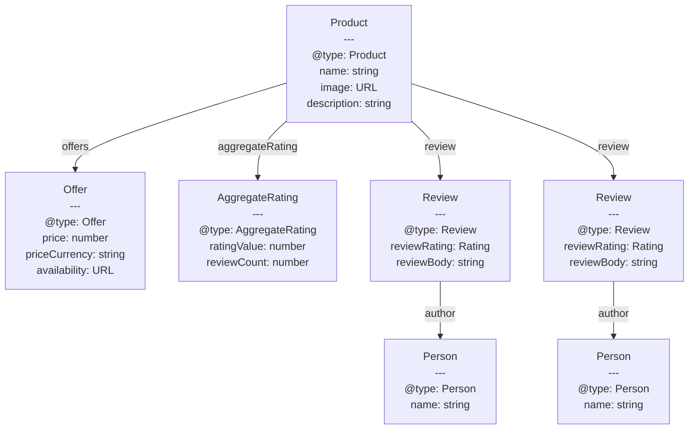

# Structured Data & Schema.org

Structured data is machine-readable markup embedded in HTML that communicates the semantic meaning of a page's content to search engines, social platforms, and automated crawlers. Where plain HTML tells a browser how to render text and images, structured data tells a crawler what that content represents: a product with a price and review score, a recipe with ingredients and cook time, an article with an author name and publication date. Without structured data, a search engine must infer these meanings from prose, which is error-prone and inconsistent.

Three formats exist for embedding structured data in web pages: JSON-LD, Microdata, and RDFa. JSON-LD has become the dominant standard because it separates the structured data payload from visible HTML entirely. A single `<script type="application/ld+json">` block in the document head carries the full data graph as a JSON object, independent of how the page's HTML is structured or styled. Microdata and RDFa annotate structured data directly onto HTML elements using special attributes, which means layout refactors can silently break the structured data. JSON-LD avoids this coupling. Google recommends JSON-LD for all new implementations.

Search engines use structured data to generate rich results: star ratings displayed in search snippets, recipe cards with ingredient and time summaries, FAQ accordions that expand inline, event listings with date and venue, sitelinks search boxes, and more. These rich results increase click-through rates and improve the presentation of your content in search. The benefit is conditional on accuracy: structured data that correctly reflects the page content earns rich results, while fabricated or misleading structured data is subject to manual penalties that can remove rich results across an entire site.

Single-page applications introduce a critical constraint. Search engine crawlers that do not execute JavaScript will not find structured data that is injected into the page after the initial HTML response. If a React or Vue SPA adds a `<script type="application/ld+json">` element via `document.createElement` during component mount, that data is invisible to any crawler that processes only the static HTML. For structured data to be reliably indexed, it must be present in the server-rendered HTML response, either through server-side rendering, static site generation, or pre-rendering. Structured data also carries a maintenance dimension that is easy to underestimate: a product page that launches with accurate JSON-LD can become inaccurate as prices change, reviews accumulate, or inventory shifts. The implementation architecture must treat structured data with the same discipline as any other data layer, generated programmatically and kept synchronized with the source of truth.

## Context

Your company blog appears in Google Search but shows only a URL and title. It is missing the publication date, author, and star rating, despite the page containing all of that information. Search engines read HTML for text content but cannot reliably infer semantic meaning from visual layout. Adding JSON-LD structured data with Schema.org vocabulary tells search engines exactly what type of content the page contains and which elements represent which properties, enabling rich results without changing the visible page.

## Design Thinking

### JSON-LD vs. Microdata vs. RDFa

JSON-LD won the format competition for practical engineering reasons. Microdata requires structured data to be woven into the HTML markup itself using `itemprop`, `itemscope`, and `itemtype` attributes on visible elements. This means the HTML structure drives the structured data structure. When a designer refactors a product card from a `<div>` tree to a `<article>` with nested `<section>` elements, the `itemprop` annotations may shift, split, or vanish, silently breaking the structured data without any test catching it. RDFa has the same fundamental problem: it binds structured data to HTML element attributes.

JSON-LD externalizes the structured data into a self-contained JSON object. The HTML can be refactored arbitrarily without affecting the JSON-LD block. The JSON-LD can be generated programmatically from a data model in a build step or at render time, making it straightforward to keep structured data synchronized with the actual data that populates the page. For a product page rendered from a database record, the same record object that populates `<h1>`, `<span class="price">`, and the review carousel can also generate the JSON-LD payload, eliminating the possibility of drift between visible content and structured data. Google's official documentation recommends JSON-LD. Bing, Yahoo, and other major crawlers follow the same recommendation.

A single page can contain multiple `<script type="application/ld+json">` blocks. This is useful when a page represents more than one entity: an article page might carry an `Article` block and a `BreadcrumbList` block as separate scripts, or a local business page might carry both an `Organization` block and a `LocalBusiness` block. Alternatively, multiple entities can be expressed in a single JSON-LD document using the `@graph` array, which holds an array of entity objects. Both approaches are valid. The `@graph` form keeps all structured data in one block, which can be easier to audit and test as a unit.

### Schema.org Vocabulary Depth

The Schema.org vocabulary defines hundreds of types, but most web applications need fewer than ten to cover the vast majority of their structured data needs. The most commonly used types are: `WebPage` and its subtypes, `Article` (with `NewsArticle` and `BlogPosting` subtypes), `Product`, `Offer`, `Review`, `AggregateRating`, `BreadcrumbList`, `FAQPage`, `Organization`, `Person`, `LocalBusiness`, and `Event`.

Types nest. A `Product` entity embeds an `AggregateRating` object that summarizes all reviews, and that `AggregateRating` can reference individual `Review` objects, each of which has an `author` property pointing to a `Person`. This nesting is expressed in JSON-LD using object literals: the `aggregateRating` property of the `Product` is set to an object with `"@type": "AggregateRating"`. The Schema.org documentation for each type lists its expected properties, whether they are required or recommended by Google's rich results guidelines, and the value types (text, number, URL, or nested type). Engineers SHOULD consult the Google rich results documentation rather than the raw Schema.org spec alone, because Google documents precisely which properties it uses for which rich result types, and required properties are different from recommended properties in terms of penalty risk.

### Structured Data in SSR and SPAs

Server-rendered frameworks handle structured data injection cleanly. In Next.js App Router, structured data is added via the `<script>` tag in a `layout.tsx` or `page.tsx` file using <code v-pre>dangerouslySetInnerHTML={{ __html: JSON.stringify(jsonLd) }}</code>, which produces the script tag in the server-rendered HTML. In Nuxt, the `useHead` composable or the `<Head>` component in a page adds the script to the rendered HTML. Astro provides a `<script type="application/ld+json" set:html={JSON.stringify(jsonLd)} />` pattern in `.astro` files. All of these approaches ensure the structured data is present in the initial HTML response that crawlers receive.

One important detail with `JSON.stringify` and inline JSON-LD: the output must not contain `</script>` as a literal string within the JSON values, because HTML parsers interpret the first `</script>` as closing the script element, truncating the JSON. This is an XSS vector if user-controlled content is included in structured data. The safest practice is to escape forward slashes in the JSON output (replacing `/` with `\/`) or use a dedicated JSON-LD serializer that handles this automatically. Most framework-provided patterns handle this correctly, but custom implementations are prone to this error.

SPAs that rely entirely on client-side rendering present a problem. A Vue or React SPA that fetches product data from an API and then calls `document.head.appendChild(script)` in a lifecycle hook produces structured data that is invisible to crawlers that do not execute JavaScript. The correct mitigation is to pre-render pages that require structured data. Frameworks like Next.js and Nuxt support static site generation (SSG) and incremental static regeneration (ISR), both of which produce server-rendered HTML. For SPAs that cannot adopt SSR, a pre-rendering proxy or build-time pre-rendering tool (such as Prerender.io or a custom Puppeteer pipeline) can generate the HTML with structured data embedded.

Dynamic structured data (product prices that change frequently, event pages with upcoming and past dates, inventory availability) requires careful cache management. A statically generated page with JSON-LD embedded at build time will contain stale price or availability data if the build has not run recently. ISR (Incremental Static Regeneration in Next.js, stale-while-revalidate in Nuxt) allows pages to be regenerated automatically at a configured interval, keeping structured data fresh without requiring a full site rebuild. For pricing data that changes multiple times per day, full SSR with a short-lived cache is more appropriate than SSG.

### BreadcrumbList and Site-Wide Structured Data

`BreadcrumbList` is one of the most broadly applicable structured data types because almost every page that is more than one level deep in a site hierarchy has a breadcrumb trail. Unlike product or recipe structured data that applies to specific page types, `BreadcrumbList` applies to nearly every content page. Implementing it correctly produces breadcrumb display in Google Search results, replacing the URL with a readable path like `AudioStore > Headphones > Wireless`. Each `ListItem` in the list carries a `position` (integer starting at 1), an `item` (URL of that breadcrumb level), and a `name` (display label). The breadcrumb levels in the JSON-LD must match the actual navigation path to the page. Fabricating breadcrumb levels, or using a hierarchy that differs from the actual URL structure, violates Google's policies.

`FAQPage` structured data enables FAQ rich results in which individual question-answer pairs expand inline within search results. This type applies only when the page genuinely contains a list of questions with their answers. Each question is a `Question` entity with `name` (the question text) and `acceptedAnswer` containing an `Answer` entity with `text` (the answer text, which may include limited HTML). The FAQ rich result significantly increases the vertical space a listing occupies in search results. Google limits this feature to authoritative sources and may revoke it from pages that use it inappropriately.

### Validation and Monitoring

Two primary validation tools exist. The Google Rich Results Test (https://search.google.com/test/rich-results) fetches a URL or accepts pasted HTML and shows which rich result types it detects, which properties are present, and which are missing or invalid. The Schema Markup Validator (https://validator.schema.org) validates against the full Schema.org vocabulary without applying Google's additional rich results requirements, which is useful for checking correctness independently of any single search engine's requirements.

Both tools should be integrated into the development workflow. A practical CI approach is to run `schema-dts` or a JSON Schema validator against the JSON-LD payloads generated by the application at build time, before deployment. The `schema-dts` TypeScript type definitions package provides compile-time type checking for Schema.org types, catching property name typos and type mismatches before they reach production. Google Search Console's Rich Results report provides production monitoring: it shows which pages have been indexed with structured data, which rich result types are active, and which pages have errors or warnings. Engineers SHOULD monitor this report after deploying structured data changes and after major site migrations.

Structured data validation should also be included in end-to-end test suites. A Playwright or Cypress test can extract the JSON-LD from a rendered page, parse it, and assert that required properties are present and that values match expected formats. This closes the gap between build-time validation (which tests the template logic) and runtime validation (which catches cases where data passed to the template is null, empty, or out of range). For example, an `AggregateRating` with a `ratingValue` outside the `worstRating` to `bestRating` range is technically valid JSON-LD but may cause Google to skip the rich result.

When Google Search Console reports a structured data error on a page, the remediation workflow has three steps: fix the markup error, request re-indexing via the URL Inspection tool, and then wait for the Rich Results report to confirm the error is resolved. Re-indexing a single URL typically takes hours to a few days; the Rich Results report can take longer to reflect the corrected status because it aggregates indexing signals across multiple crawls. Teams that skip the re-indexing request after fixing a structured data error may wait weeks for organic re-crawl to restore their rich results.

Structured data monitoring is more complex for sites with dynamic content or personalization. A product page that shows different prices to different users, or a news article page that varies the content by locale, may produce different structured data depending on who requests it. From a monitoring perspective, treating these as a single URL is misleading: the validator and Search Console both operate on a single-response basis. The practical strategy is to instrument the structured data generation code with observability: emit metrics or log events when the JSON-LD generation path is called, when properties are conditionally omitted (such as `aggregateRating` when review count is zero), and when the generated payload fails internal validation. This gives teams a production signal independent of external crawl timing.

A less obvious monitoring gap is structured data on paginated sequences. A product with many reviews may paginate them across multiple URLs. Each paginated page may carry the same `Product` JSON-LD but with a `review` array that represents only the current page's subset. Google does not treat review arrays on paginated pages as additive; it evaluates each URL's structured data independently. If the structured data on page 2 omits `aggregateRating` or carries a partial review list, that data is evaluated on its own merits. The recommended approach for paginated review content is to include `aggregateRating` on every paginated URL, generated from the full review dataset, and to include only the reviews that are visible on the current page in the `review` array. This ensures each URL independently qualifies for rich results without misrepresenting the total review population.

Testing structured data across paginated sequences requires that the test suite covers at minimum the first page, a middle page, and the last page of each paginated content type. Structured data bugs in paginated sequences are often introduced silently during performance optimizations. For example, an engineer might optimize the data-fetching query to return only the visible page's reviews rather than the full aggregate, forgetting that the review count and aggregate rating still need to be fetched from the full dataset for the JSON-LD payload.

### Generating JSON-LD in Server-Rendered Frameworks

In Next.js App Router, JSON-LD is injected into the server-rendered HTML by rendering a `<script>` element with the `dangerouslySetInnerHTML` prop set to `{ __html: JSON.stringify(jsonLd) }`. This pattern ensures the structured data is present in the HTML the server delivers, not added by a client-side lifecycle hook. The same principle applies to Nuxt (via `useHead` or the `<Head>` component) and Astro (via `set:html` on a `<script>` element) with minor syntax differences.

The `schema-dts` package provides TypeScript types for all Schema.org entities. Wrapping the JSON-LD object with the `WithContext<T>` type adds the `@context` property to the standard type definition, giving compile-time checking for property names and value shapes. This catches typos and structural mismatches before the code reaches production.

For properties whose presence depends on runtime data (notably `aggregateRating`), the recommended pattern is a conditional guard: if `reviewCount` is zero, the `aggregateRating` property is omitted from the object entirely rather than emitting an `AggregateRating` with zero reviews. Emitting a zero-review `AggregateRating` violates Google's structured data policies and may cause the rich result to be suppressed.

A utility function that accepts the page data object and returns a `WithContext<Product>` node concentrates the structured data logic in a single testable location. The function uses a conditional spread to include `aggregateRating` only when the product has a minimum number of reviews, preventing erroneous structured data from being published for new products.

In Next.js App Router, the structured data node is typically returned from the page's async component and serialized inside a `<script type="application/ld+json">` element rendered during SSR, making it present in the initial HTML without any client-side hydration step. In Nuxt, `useSchemaOrg` composables from the `nuxt-schema-org` module provide a reactive, declarative API that generates JSON-LD in the SSR pass. Astro's static generation model naturally includes structured data in every generated page, with no additional configuration required when the JSON-LD script is embedded in the page's `<head>` template. The choice of implementation varies by framework, but the invariant is the same: the JSON-LD content must exist in the HTML delivered by the server, not appended by JavaScript after the page loads.

Regardless of framework, the testing strategy follows the same pattern: a unit test that calls the utility function with known input and asserts the shape of the returned JSON-LD object, and an integration test that renders a full page and extracts the `<script type="application/ld+json">` element from the document head to verify its content. This two-layer approach catches both logic errors in the data transformation and configuration errors that might prevent the script from reaching the head at all. Testing the raw JSON-LD value as a string is less reliable than parsing it back to an object and asserting individual properties, because string comparison is fragile against formatting changes such as key ordering or whitespace differences introduced by different versions of `JSON.stringify`.

Teams migrating from a client-side SPA to SSR specifically for structured data indexing should audit all structured data injection points before migration and confirm, using the Google Rich Results Test against the post-migration staging environment, that every type that previously appeared only in the client DOM is now present in the raw HTML response. A common migration gap is a secondary entity (such as a `BreadcrumbList` added in a layout component) that is already SSR-rendered in the new framework but was previously missing in the SPA, making it easy to overlook in pre-launch review.

When evaluating which framework feature to use for JSON-LD injection, prefer the mechanism that keeps the JSON-LD closest to the page's data-fetching code. In Next.js App Router, co-locating the JSON-LD generation with the `async` component that fetches the page data makes it clear that the two are coupled and must be updated together. In Nuxt, placing the `useSchemaOrg` call inside the same composable that fetches product or article data achieves the same coupling. This co-location discipline is more important than any implementation detail: it ensures that when the data changes, the structured data changes with it.

Framework choice does not change the contract with search engines. Only the syntax changes.

## Best Practices

**MUST use JSON-LD as the structured data format and embed it in server-rendered HTML.** Place `<script type="application/ld+json">` in the document `<head>` during server-side rendering or static generation. Crawlers that do not execute JavaScript will not find structured data added by client-side scripts after the initial HTML response, making JSON-LD injection in `useEffect`, `onMounted`, or equivalent client lifecycle hooks unreliable for indexing purposes.

**MUST keep structured data accurate and synchronized with visible page content.** Generate JSON-LD programmatically from the same data source that populates the visible page. If a product's price is stored in a database record, the JSON-LD `offers.price` MUST be read from the same record, not hardcoded or copied separately. Structured data that contradicts the visible page content (different prices, different review counts, different author names) violates Google's policies and may trigger manual penalties.

**MUST NOT add structured data types to pages that do not semantically match the type's definition.** Marking up a blog post as a `Product`, adding `AggregateRating` to a page with no user reviews, or claiming a `FAQPage` type for a page with no FAQ content confuses crawlers and is treated as spam by search engine quality reviewers. Each structured data type carries a semantic contract: the page must actually be what the structured data claims it is.

**SHOULD validate structured data in CI before deploying changes.** Use the Schema Markup Validator API or a JSON Schema validator against generated JSON-LD payloads as part of the build pipeline. Required properties for Google rich results (such as `offers.price` and `offers.priceCurrency` on a `Product`) can be verified automatically. Catching missing required properties before deployment prevents rich result loss in production.

**SHOULD use `BreadcrumbList` structured data on all content pages that are more than one level deep in the site hierarchy.** Breadcrumb structured data enables Google to display the navigation path in search results instead of the raw URL, improving click-through rate and giving users a clearer preview of where the page sits within the site. The breadcrumb levels in the JSON-LD should correspond to the actual navigation hierarchy. Fabricating breadcrumb levels or misrepresenting the URL hierarchy violates Google's structured data policies.

**MUST ensure each `ListItem` in a `BreadcrumbList` carries an accurate `position` integer and `name` string.** The `position` value starts at 1 for the root level and increments by one for each deeper level. The `name` must match the visible label used in the on-page breadcrumb navigation, and the `item` URL must resolve to the actual page at that hierarchy level. Inaccurate `position` values or names that differ from visible navigation constitute misrepresentation under Google's structured data policies.

**SHOULD test rich result eligibility in CI by running the Schema Markup Validator API against staged pages before each production deployment.** Rich result eligibility is lost silently: the page loads normally, traffic arrives as expected, but the enhanced search appearance disappears until the markup error is corrected and Google re-crawls the page. A CI check that validates structured data markup against the Schema Markup Validator JSON API catches missing required properties, malformed date strings, and invalid enumeration values before they reach production. The validation payload is the page's JSON-LD content; the API returns a list of errors and warnings that map to specific schema.org properties.

## Visual



## Example

```html
<!DOCTYPE html>
<html lang="en">
<head>
  <meta charset="UTF-8" />
  <meta name="viewport" content="width=device-width, initial-scale=1.0" />
  <title>Wireless Noise-Cancelling Headphones – AudioStore</title>

  <!-- Structured data: Product with AggregateRating -->
  <script type="application/ld+json">
  {
    "@context": "https://schema.org",
    "@type": "Product",
    "name": "Wireless Noise-Cancelling Headphones Pro 500",
    "image": [
      "https://example.com/images/headphones-front.jpg",
      "https://example.com/images/headphones-side.jpg"
    ],
    "description": "Over-ear wireless headphones with active noise cancellation, 30-hour battery life, and foldable design for travel.",
    "sku": "HP-PRO-500",
    "brand": {
      "@type": "Brand",
      "name": "AudioStore"
    },
    "offers": {
      "@type": "Offer",
      "url": "https://example.com/products/headphones-pro-500",
      "priceCurrency": "USD",
      "price": "249.99",
      "priceValidUntil": "2026-12-31",
      "itemCondition": "https://schema.org/NewCondition",
      "availability": "https://schema.org/InStock",
      "seller": {
        "@type": "Organization",
        "name": "AudioStore"
      }
    },
    "aggregateRating": {
      "@type": "AggregateRating",
      "ratingValue": "4.6",
      "reviewCount": "312",
      "bestRating": "5",
      "worstRating": "1"
    },
    "review": [
      {
        "@type": "Review",
        "reviewRating": {
          "@type": "Rating",
          "ratingValue": "5",
          "bestRating": "5"
        },
        "name": "Exceptional noise cancellation",
        "reviewBody": "I use these on daily commutes. The ANC blocks out subway noise completely. Battery life matches the claimed 30 hours in my testing.",
        "author": {
          "@type": "Person",
          "name": "Maria Chen"
        },
        "datePublished": "2026-03-15"
      },
      {
        "@type": "Review",
        "reviewRating": {
          "@type": "Rating",
          "ratingValue": "4",
          "bestRating": "5"
        },
        "name": "Great sound, slightly tight fit",
        "reviewBody": "Sound quality is excellent across all frequencies. Clamping force is a bit strong for extended sessions, but it loosens up after a week of use.",
        "author": {
          "@type": "Person",
          "name": "James Okafor"
        },
        "datePublished": "2026-02-28"
      }
    ]
  }
  </script>
</head>
<body>
  <main>
    <h1>Wireless Noise-Cancelling Headphones Pro 500</h1>
    <p>$249.99</p>
    <p>Rated 4.6 out of 5 — 312 reviews</p>
    <!-- visible page content matches the structured data above -->
  </main>
</body>
</html>
```

The `@context` declares the vocabulary namespace. Every nested object with `@type` uses Schema.org types. The `offers.price` and `offers.priceCurrency` are required properties for Google's Product rich result. The `aggregateRating.reviewCount` must reflect the actual number of reviews on the page or be sourced from the same data pipeline, not a hardcoded number that drifts over time.

Notice that `offers.price` is a string rather than a number in the example. Google's documentation accepts both, but string representation avoids floating-point serialization edge cases (e.g., `249.9900000001`). The `priceValidUntil` property signals to search engines that the price information has an expiry date, which can affect whether the offer is shown in rich results for searches after that date. Always set this to a date in the future or update it on a schedule. The `itemCondition` and `availability` values are schema.org URLs, not free-form strings; using the wrong format (e.g., `"new"` instead of `"https://schema.org/NewCondition"`) will cause the property to be ignored by validators.

For sites with product variants (different colors, sizes, or configurations each at different prices), best practice is to mark up the specific variant the user is viewing rather than the product family as a whole. Each variant page should carry an `Offer` with the specific variant's price and availability, not an average or range. If the page shows a price range across variants, use `lowPrice` and `highPrice` on a single `AggregateOffer` type instead of a single `Offer` with an ambiguous price.

The `datePublished` values on each `Review` object in the example use ISO 8601 date format (`YYYY-MM-DD`). Google's validators accept this format; using locale-specific formats such as `03/15/2026` or `15-Mar-2026` will cause the date property to fail validation and be ignored. The same ISO 8601 requirement applies to `priceValidUntil` on `Offer` and `dateModified` on `Article`. Any date property in structured data should use the ISO 8601 format to ensure consistent parsing across validators and crawlers.

## Common Mistakes

### Placing JSON-LD in the Body Instead of the Head

Google's documentation states that `<script type="application/ld+json">` can appear in either `<head>` or `<body>`, and both are processed. However, placing it in `<body>` creates a practical risk: certain middleware, CDN edge functions, and HTML transformation pipelines strip or modify `<script>` tags found in the body as a security measure while leaving head scripts untouched. Placing structured data in `<head>` alongside other metadata is the safer convention and is consistent with how all major frameworks generate structured data in SSR output. It also makes the data easier to locate during debugging and code review.

### Refactoring HTML While Using Microdata

Teams that chose Microdata because it seemed simpler discover the coupling cost during the first design refresh. A card component that carries `itemscope itemtype="https://schema.org/Product"` and distributes `itemprop="name"`, `itemprop="price"`, and `itemprop="description"` across nested elements will break the structured data silently when a designer restructures the card's HTML. No tests catch this because the page still renders correctly. Only the structured data graph breaks, and that breakage surfaces in Google Search Console days or weeks later as a drop in rich results. The fix is to migrate to JSON-LD, where the data structure is independent of the HTML structure.

### Injecting JSON-LD via Client-Side JavaScript in SPAs

A common mistake in React and Vue SPAs is adding structured data in a component lifecycle hook: calling `document.head.appendChild(scriptEl)` in `useEffect` or `onMounted`. The structured data appears in the DOM when the page is viewed in a browser, so it looks correct in manual inspection. However, crawlers that do not execute JavaScript (including Googlebot in certain crawl budget scenarios) receive the initial HTML without the script tag. The structured data is effectively invisible to those crawlers. The correct approach is to generate the JSON-LD at build time (SSG) or render time (SSR) so it is present in the HTML that the server delivers.

### Omitting Required Properties

The Google rich results documentation specifies required and recommended properties for each type. For `Product`, `offers.price` and `offers.priceCurrency` are required for rich result eligibility. For `AggregateRating`, `ratingValue` and `reviewCount` (or `ratingCount`) are required. Omitting required properties does not cause a validation error in the Schema Markup Validator, because the vocabulary itself treats most properties as optional. It still causes Google to withhold the rich result for that page. Engineers who validate only against Schema.org without consulting Google's rich results requirements miss these gaps.

### Hardcoding Aggregate Ratings That Drift From Actual Data

An aggregate rating that is hardcoded in a template will diverge from reality as reviews accumulate. A page that launched with 47 reviews and a 4.8 rating might have 312 reviews and a 4.6 rating six months later, but the hardcoded JSON-LD still says 47 and 4.8. Google's algorithms detect when structured data contradicts observable page content. The correct implementation generates `ratingValue` and `reviewCount` dynamically from the same data source that populates the visible review summary on the page.

### Embedding User-Controlled Content in JSON-LD Without Escaping

When structured data includes user-generated content (review text, product descriptions submitted by sellers, FAQ answers written by support staff), that content must be treated as untrusted input. If a product description contains `</script>`, the HTML parser closes the script element early, breaking the JSON-LD. If an attacker can inject structured data properties through a CMS or API that does not sanitize input, they can potentially craft a payload that causes unexpected behavior. Always pass user-generated strings through a JSON serializer rather than template string interpolation, and ensure the serialized JSON escapes `<`, `>`, and `&` within string values when embedding in HTML.

## Related FEEs

| FEE | Relationship |
|-----|-------------|
| [FEE-100 HTML & Semantic Markup Overview](./100.md) | Parent overview for this category. Structured data is one of the core reasons semantic HTML matters beyond accessibility. |
| [FEE-101 Document Structure & Metadata](./101.md) | The `<head>` element, `<meta>` tags, and document metadata provide the foundation into which structured data `<script>` blocks are inserted. |
| [FEE-108 HTML Security Attributes](./108.md) | JSON-LD blocks use `type="application/ld+json"`, which is not executable JavaScript, but security reviews of `<script>` tags in `<head>` apply to them. |
| [FEE-701 Rendering Strategies: CSR, SSR, SSG & Streaming](../Rendering%20and%20Performance/701.md) | Server rendering is a prerequisite for reliable structured data indexing. The rendering strategy chosen for a page determines whether crawlers will find its structured data. |

## References

- [Google Structured Data Developer Guide](https://developers.google.com/search/docs/appearance/structured-data/intro-structured-data) — Google's authoritative documentation on structured data formats, supported types, and rich result requirements
- [schema.org](https://schema.org) — The Schema.org vocabulary, type hierarchy, and property definitions
- [Google Rich Results Test](https://search.google.com/test/rich-results) — Interactive tool to validate and preview rich results from a URL or HTML snippet
- [Schema Markup Validator](https://validator.schema.org) — Validates JSON-LD, Microdata, and RDFa against the full Schema.org vocabulary
- [JSON-LD 1.1 Specification](https://www.w3.org/TR/json-ld11/) — W3C specification for the JSON-LD format, including `@context`, `@type`, and graph nesting semantics
- [Google Search Central: Product structured data](https://developers.google.com/search/docs/appearance/structured-data/product) — Required and recommended properties for Product rich results, including `offers`, `aggregateRating`, and `review`
- [Google Search Central: Structured data quality guidelines](https://developers.google.com/search/docs/appearance/structured-data/sd-policies) — Policies on accuracy, relevance, and prohibited practices that lead to manual actions
- [MDN: JSON-LD](https://developer.mozilla.org/en-US/docs/Glossary/JSON-LD) — Glossary definition and introductory explanation of JSON-LD in the context of the web platform
- [Next.js Docs: JSON-LD](https://nextjs.org/docs/app/building-your-application/optimizing/metadata#json-ld) — Next.js App Router pattern for embedding JSON-LD in server-rendered pages using `dangerouslySetInnerHTML`
