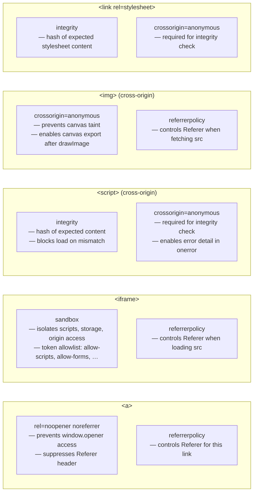

# HTML Security Attributes

Several HTML attributes exist specifically to constrain what cross-origin content can do: `crossorigin`, `referrerpolicy`, `sandbox`, `rel="noopener noreferrer"`, and `integrity`. These are not about appearance or functionality — they control the security properties of embedded content, external links, and cross-origin resource loads. Understanding them is not optional for production web applications; it is part of the baseline competence required to ship pages that do not inadvertently compromise users.

Most of these attributes are additive: adding them restricts behavior that would otherwise be unrestricted. A `<a target="_blank">` without `rel="noopener"` gives the opened page access to the opener's `window` object. An `<iframe>` without `sandbox` runs scripts in the embedding page's origin. A `<script src="cdn.example.com/lib.js">` without `integrity` executes whatever the CDN serves, even if that content changes after deployment. In each case, the default browser behavior is the permissive one, and the developer must opt into restriction.

Browser defaults are permissive for historical compatibility reasons. Features that would today be considered unsafe were standardized before the threat model was well understood, and changing the defaults retroactively would break the existing web. The burden therefore falls on developers to add restrictions explicitly. Security-aware HTML authoring means knowing which attributes to add to which elements, not waiting for browsers to enforce safety on your behalf.

This article covers the five most important HTML security attributes as a group, explains the threat each one mitigates, and gives rules for when each is required. Subresource Integrity (`integrity`) is introduced here with enough detail to use correctly; its full treatment, including hash generation workflows and CSP integration, is in FEE-1208.

## Design Thinking

Each HTML security attribute addresses a distinct attack surface. `crossorigin` governs whether the browser enters CORS mode for resource fetches and whether credentials accompany the request. `referrerpolicy` controls information leakage through the `Referer` header. `sandbox` enforces capability restrictions on embedded documents. `rel="noopener"` severs the cross-document communication channel that `target="_blank"` opens. `integrity` locks a resource to a specific known-good version by hash. Treating these as five unrelated attributes misses the pattern: they are all mechanisms for reducing the implicit trust that HTML extends to external resources, and they each require explicit opt-in from the page author.

The common thread across all five attributes is the direction of trust: they each restrict what the page extends outward, not what it accepts inward. This contrasts with server-side security headers — `Content-Security-Policy`, `Strict-Transport-Security`, `X-Frame-Options` — which restrict what the browser accepts on behalf of the page. Both layers are necessary, but they are conceptually different: server headers control the page's defensive posture toward content it might receive, while HTML security attributes control the page's posture toward content it actively embeds or links to. A mental model that separates these two layers makes it easier to reason about which control to apply when a new embedding or link pattern is introduced.

The five attributes are also distinct in how they degrade when omitted. Omitting `rel="noopener"` silently leaves `window.opener` accessible — the page functions normally in all other respects and the vulnerability is invisible until exploited. Omitting `sandbox` on an iframe similarly produces no visible symptom; the iframe loads and behaves as expected, but the capability constraints that should limit it are absent. Omitting `crossorigin` on a CDN script produces an error-reporting gap, not a load failure. Only `integrity` violations produce a visible, immediate failure — the resource is blocked and an error is logged. This asymmetry matters for prioritizing security audits: the attributes whose omission is invisible are the ones most likely to be silently missing in legacy codebases.

The invisible nature of most security attribute omissions is also why automated enforcement — lint rules, template defaults, and CI checks — is more reliable than code review alone. Code review surfaces novel patterns and architectural concerns, but it is a poor mechanism for catching the absence of boilerplate attributes that should appear on every instance of a given element type. Lint rules that flag `<a target="_blank">` without `rel="noopener"` or cross-origin `<script>` without `integrity` provide enforcement that scales with the codebase without increasing review burden.

### crossorigin on Resource Elements

The `crossorigin` attribute appears on ``, `<script>`, `<link>`, `<audio>`, and `<video>` elements. It controls whether the browser includes credentials (cookies, TLS client certificates) when making a cross-origin request for the resource, and whether the response must carry CORS headers to be usable.

The two values are `anonymous` (the default when the attribute is present with no value) and `use-credentials`. With `anonymous`, the request is made without credentials; the server must respond with `Access-Control-Allow-Origin: *` or `Access-Control-Allow-Origin: <origin>` for the browser to accept the response for CORS-sensitive operations. With `use-credentials`, the request carries cookies and the server must respond with the specific origin and `Access-Control-Allow-Credentials: true`.

Three scenarios require `crossorigin` on resource elements. The first is `<canvas>` operations on cross-origin images: drawing a cross-origin image onto a canvas without `crossorigin="anonymous"` taints the canvas, after which `toDataURL()` and `getImageData()` throw security errors. The second is error reporting on cross-origin scripts: a `<script>` loaded from a third-party CDN without `crossorigin` will report only `"Script error."` to `window.onerror`, stripping the message, filename, and line number. This stripping is intentional — the browser prevents cross-origin information leakage by default — but it makes production error monitoring unreliable for CDN-hosted code. The third is Subresource Integrity: the `integrity` attribute on a cross-origin `<script>` or `<link>` requires `crossorigin="anonymous"` to work, because the browser must be able to inspect the response body for hashing.

The `crossorigin` attribute is frequently omitted because the page appears to work without it. The consequence is invisible: canvas operations fail only when the user tries to export, error reports lose detail that engineers rely on in production, and integrity checks silently skip or fail. Treat `crossorigin="anonymous"` as mandatory on any cross-origin `<script>` or `<link>` that carries an `integrity` attribute, and on any `` used as a canvas source.

One subtlety worth noting: setting `crossorigin="use-credentials"` is rarely correct for public CDN assets. A CDN that responds with `Access-Control-Allow-Origin: *` will reject credentialed requests — the wildcard origin is not permitted alongside `Access-Control-Allow-Credentials: true`. Use `use-credentials` only when the resource endpoint explicitly requires cookies for authorization, such as an authenticated avatar API or a private asset CDN with per-user access control. For all public CDN scripts and stylesheets, `anonymous` is correct.

Browser support for `crossorigin` is universal in all modern browsers and has been stable since IE 11. The attribute can be safely applied to all cross-origin resource elements without polyfill or feature detection. For projects that must support Internet Explorer 11, the attribute is supported but the behavior of the canvas taint protection and SRI check has subtle differences; testing against the exact browser matrix is advisable before relying on SRI in IE 11.

When auditing an existing codebase for `crossorigin` coverage, look for any `<script>` or `<link>` tag whose `src` or `href` begins with a different domain from the document origin, and any `` that is drawn onto a `<canvas>`. These are the elements where missing `crossorigin` has concrete security or operational consequences. A quick lint rule or a grep for cross-origin `src` attributes without `crossorigin` can serve as an initial audit step before more thorough security review tooling is introduced.

### referrerpolicy

The `referrerpolicy` attribute controls what information the browser sends in the `Referer` header when a user navigates to or loads a resource from the element. It applies to `<a>`, `<area>`, ``, `<iframe>`, `<script>`, `<link>`, and `<form>`. The `Referer` header tells the destination server which page the user was on when they triggered the request, which has legitimate uses (analytics, spam prevention, access control) but also leaks information about the user's current URL to third parties.

Eight policy values are defined. `no-referrer` sends nothing. `no-referrer-when-downgrade` sends the full URL for same-protocol navigations and nothing for HTTPS-to-HTTP downgrades. `origin` sends only the scheme and host. `origin-when-cross-origin` sends the full URL for same-origin and only the origin for cross-origin. `same-origin` sends the full URL for same-origin and nothing for cross-origin. `strict-origin` sends only the origin for same-protocol and nothing for downgrades. `strict-origin-when-cross-origin` sends the full URL for same-origin, only the origin for cross-origin same-protocol, and nothing for downgrades. `unsafe-url` always sends the full URL including path, query, and fragment to every destination regardless of protocol.

`strict-origin-when-cross-origin` is the modern browser default and the correct baseline for most pages. It gives cross-origin destinations enough context to distinguish traffic sources without exposing full URL paths. The legacy default was `no-referrer-when-downgrade`, which sent the full URL cross-origin as long as both ends were HTTPS; this was changed in major browsers between 2019 and 2021 precisely because it exposed too much path information to analytics and ad-tech third parties.

Per-element `referrerpolicy` overrides the document-level policy set by `<meta name="referrer">`. This is useful for links from pages that contain sensitive information in the URL — authenticated dashboards, admin tools, pages with session tokens in query parameters, or search results pages where the query string contains personally identifying terms. On those pages, set `referrerpolicy="no-referrer"` on individual outbound links or set `<meta name="referrer" content="no-referrer">` in the document head to apply it globally. The per-element override allows a page with a strict document-level policy to relax it for specific links where referrer information aids the user experience — for example, a "back to search results" link that uses the referrer to reconstruct context. A page whose URL encodes session state MUST NOT leak that URL to external destinations under any referrer policy that includes the full path.

One common confusion is the distinction between `rel="noopener"` and `rel="noreferrer"`. `noopener` only prevents `window.opener` access; it does not affect the `Referer` header. `noreferrer` implies `noopener` and additionally suppresses the `Referer` header. Writing `rel="noopener noreferrer"` rather than just `rel="noreferrer"` is redundant but harmless, and it makes the intent explicit when reading the HTML: the `noopener` token makes the opener-prevention intent visible without requiring knowledge that `noreferrer` implies it. Style guides that enforce both tokens produce code that is clearer under review.

The `referrerpolicy` attribute can also be set on `<form>` elements, controlling what referrer information is sent when the form is submitted cross-origin. This matters for login and registration forms hosted on a subdomain that submit to an API on a different subdomain, and for any form on a sensitive page (a checkout page, a profile settings page) that submits to a third-party payment processor or analytics endpoint. Setting `referrerpolicy="origin"` on the form sends only the origin, not the full URL, which prevents the checkout page's path — which may contain order IDs or product identifiers — from appearing in the request headers received by the processor.

### sandbox on iframes

The `sandbox` attribute on `<iframe>` enables a permissions model where all capabilities are denied by default and each must be granted explicitly via a token. An `<iframe sandbox>` with no token value denies: JavaScript execution, form submission, pointer lock, popups, modals, orientation lock, presentation, downloads, same-origin access, and top-level navigation. Tokens re-enable specific capabilities: `allow-scripts` re-enables JavaScript, `allow-forms` re-enables form submission, `allow-popups` re-enables popups, `allow-same-origin` grants the frame the ability to read its own origin's storage and cookies, `allow-top-navigation` allows the frame to navigate the top-level browsing context, and `allow-popups-to-escape-sandbox` allows popups opened by the iframe to exist outside the sandbox.

The anti-pattern is `sandbox="allow-scripts allow-same-origin"`. When a frame has both tokens, JavaScript running inside the frame can access the iframe's own DOM, read the `sandbox` attribute from the element, and call `removeAttribute("sandbox")` on it. Removing the attribute causes the browser to treat the frame as unsandboxed, restoring all capabilities. The protection is gone. This combination MUST be avoided whenever the iframe content is untrusted, which it almost always is for third-party embeds. The spec authors documented this vulnerability explicitly; it is not a browser bug but a consequence of the sandbox design when these two grants are combined.

Content Security Policy's `frame-src` directive is complementary to `sandbox`, not a substitute. `frame-src` controls which URLs may be loaded in iframes; `sandbox` controls what those loaded URLs can do. A full defense uses both: `frame-src` restricts the source to a known allowlist, and `sandbox` restricts the capability to a minimum token set, so even if an attacker finds a way to load an unexpected URL, the capability restrictions still apply. Neither attribute alone is sufficient for untrusted embed content.

Common embed scenarios and their minimum token sets: a third-party video player needs `allow-scripts allow-same-origin allow-presentation`; a payment widget needs `allow-scripts allow-forms`; a static HTML document preview needs no tokens (bare `sandbox`); a cross-origin interactive widget that opens popups needs `allow-scripts allow-popups`. For payment and authentication embeds, the token list should be reviewed with the provider's integration documentation; providers sometimes add `allow-top-navigation` to enable post-authentication redirects, which is a significant capability grant that warrants explicit consideration.

The `sandbox` attribute behaves differently depending on whether the iframe's `src` is same-origin or cross-origin. For a same-origin iframe, `sandbox` without `allow-same-origin` causes the frame to behave as if it came from a null origin, losing access to cookies, `localStorage`, and the embedding page's DOM. This is useful for isolating a section of the same site — such as an HTML email preview, a user-generated content renderer, or a legacy micro-frontend — from the main page's context. The key insight is that `sandbox` can be used not only for third-party content but also for same-origin content that should be run with reduced trust, and the null-origin assignment from removing `allow-same-origin` makes this effective.

Two sandbox tokens warrant special mention for interactive embeds: `allow-modals` and `allow-top-navigation-by-user-activation`. Without `allow-modals`, `alert()`, `confirm()`, and `prompt()` calls inside the frame are silently ignored, which breaks embeds that use these dialogs for confirmation workflows. `allow-top-navigation-by-user-activation` is a safer alternative to `allow-top-navigation`; it permits the frame to navigate the top-level browsing context, but only in response to a direct user gesture — a click or key press — preventing programmatic navigation that could be used to redirect the user to phishing pages without interaction.

The `allow-downloads` token, added in the Fetch Living Standard, controls whether the frame is permitted to trigger file downloads via `<a download>` or a `Content-Disposition: attachment` response. Without `allow-downloads`, clicking a download link inside a sandboxed iframe does nothing. This is relevant for embeds that display downloadable documents — a PDF viewer widget, a report export button, a file attachment preview. Add `allow-downloads` only when the embed's core functionality requires it; it is absent from the default sandbox denial list in older documentation because it was added later than the other tokens, and is therefore more likely to be overlooked when consulting older sandbox references.

### integrity (SRI Preview)

The `integrity` attribute specifies a cryptographic hash of the expected resource content for `<script>` and `<link rel="stylesheet">` elements. The format is `<hash-algorithm>-<base64-encoded-hash>`, for example `sha384-oqVuAfXRKap7fdgcCY5uykM6+R9GqQ8K/uxy9rx7HNQlGYl1kPzQho1wx4JwY8wC`. If the resource the browser downloads does not produce the same hash, the browser blocks the resource from executing or applying and logs a net::ERR_SRI_FAILURE error to the console. The load itself counts as a network failure from the application's perspective.

SRI is specifically designed to protect against CDN compromise. A widely used JavaScript library served from a CDN is a high-value attack target: if the CDN is breached or the CDN account is hijacked, the attacker can replace the library with a version that exfiltrates credentials or injects malicious scripts to millions of pages simultaneously. SRI means that even if the CDN serves a modified file, the browser rejects it because the hash does not match the one embedded in the HTML. This turns a CDN compromise from a silent supply-chain attack into a detectable, visible failure.

`integrity` applies only to cross-origin resources. The attribute has no effect on same-origin resources because Same-Origin Policy already gives the page full control over resources it serves. The attribute also requires `crossorigin="anonymous"` on the same element; without it the browser cannot read the response body to compute the hash, and the integrity check either silently passes without verifying or fails entirely depending on browser implementation. This pairing requirement means that enabling SRI on a CDN resource also opts that resource into CORS mode, which requires the CDN to serve appropriate `Access-Control-Allow-Origin` headers. Most major CDNs do this by default for public assets; private or custom CDNs may need configuration.

One operational consideration: when a CDN library is updated to a new version, the hash changes. The HTML must be updated to reference the new version's hash before or simultaneously with the CDN update, or every page will start blocking the resource. Automated tooling (npm scripts, build plugins, or CI checks that generate and embed integrity values) is the only sustainable approach for projects that use SRI at scale. Manual hash management across multiple files is error-prone and leads to broken deployments. Hash generation is covered fully in FEE-1208. The short version: use `sha384` as the algorithm (stronger than `sha256`, not yet as widely required as `sha512`), generate hashes at build time from the actual files being served, and store them as attributes on the elements. Tools like `openssl dgst -sha384 -binary file.js | openssl base64 -A` generate the correct value. Many CDN documentation pages publish `integrity` values alongside their `<script>` tags; use those values when loading well-known libraries.

Multiple hash values can be supplied in a single `integrity` attribute by separating them with whitespace: `integrity="sha384-<hash1> sha512-<hash2>"`. The browser will accept the resource if any of the provided hashes match. This is useful during CDN migrations where you are transitioning from one hash algorithm to another, or when you need to allow two versions of a library during a rolling deployment window before the old version is retired. The browser attempts the strongest algorithm it supports first; if it supports both `sha512` and `sha384`, it uses `sha512` for the check.

SRI failures can be reported to a monitoring endpoint using Content Security Policy's `report-uri` or `report-to` directives alongside the `require-sri-for` CSP directive. When a resource fails its integrity check, the browser generates a CSP violation report that includes the resource URL and the document URL where the violation occurred. Feeding these reports into a security monitoring pipeline gives teams visibility into supply-chain integrity failures across a site's production traffic, rather than relying on user-reported symptoms or manual page audits to detect compromised CDN assets.

Taken together, these five attributes form a layered defense at the HTML markup level. They do not replace server-side security headers such as Content Security Policy, Strict Transport Security, or Permissions Policy, but they operate at a different layer: the element level rather than the document level. Element-level restrictions are more granular and can be tuned per-element based on the specific trust level of each resource, while document-level headers apply uniformly across the entire page. A mature security posture uses both layers: document-level headers establish the baseline, and element-level attributes enforce the specific restrictions each resource requires.

## Best Practices

**MUST add `rel="noopener noreferrer"` to every `<a target="_blank">` element regardless of whether the destination is same-origin or cross-origin.** Reverse tabnapping requires only that `window.opener` be accessible to the opened page. Making this a universal rule removes the judgment call about which links are "safe enough" — that judgment is expensive, error-prone, and unnecessary. Linters such as eslint-plugin-jsx-a11y and standard HTML linters can enforce this rule automatically; add the lint rule so that the enforcement is not reliant on code review attention.

**MUST set `sandbox` on every `<iframe>` embedding third-party content, specifying only the minimum tokens required.** Start with bare `sandbox` (all restrictions active) and add tokens only when the embed demonstrably fails to function without them. Each additional token expands the attack surface of the embed. Document the reason each token is present as a comment adjacent to the element so that reviewers and future maintainers understand why the capability was granted and can re-evaluate it if requirements change.

**MUST NOT combine `sandbox="allow-scripts allow-same-origin"` on a single `<iframe>`.** A script in a same-origin sandboxed iframe can access and remove its own `sandbox` attribute, negating all restrictions. This is a well-documented anti-pattern; security review tools and CSP evaluators flag it. If an embedded widget requires both scripting and same-origin access to function, that widget MUST be hosted at a separate subdomain so that `allow-same-origin` does not grant access to the embedding page's origin.

**SHOULD set `crossorigin="anonymous"` on `<script>` elements loaded from cross-origin CDNs when `integrity` is also set.** Without the `crossorigin` attribute, the browser loads the script without CORS mode and the integrity check cannot be performed, allowing the resource to load unverified. The combination of `integrity` without `crossorigin` provides no protection and may silently succeed depending on the browser, creating a false impression of security. Both attributes SHOULD always be written together on the same element.

**SHOULD set `referrerpolicy="no-referrer"` on links from pages containing sensitive information** such as authenticated URLs, internal tool paths, or personally identifying query parameters. Pages whose URLs encode session state should apply strict referrer policies to prevent that state from leaking to third-party destinations. Apply this as a `<meta name="referrer" content="no-referrer">` element in the document head to set a document-wide policy, then use per-element `referrerpolicy` attributes on internal links where a more permissive policy is acceptable. Prefer explicit policy setting over relying on the browser default, even when the default would produce the same behavior, because the default has changed across browser versions and the explicit attribute documents intent.

**SHOULD add `integrity` and `crossorigin="anonymous"` to every `<link rel="stylesheet">` loaded from a third-party CDN**, applying the same discipline as CDN scripts. Stylesheets can execute arbitrary JavaScript via `expression()` in certain legacy browsers and can redirect navigation via `@import` rules, and in all browsers they can exfiltrate information through CSS attribute selectors and `url()` values pointing to attacker-controlled endpoints. A compromised CDN stylesheet is as dangerous as a compromised CDN script. The `integrity` attribute blocks the load if the hash does not match, providing the same supply-chain protection for styles as for scripts. Hash the stylesheet file at build time or use the hash published by the CDN documentation.

## Visual



## Example

```html
<!DOCTYPE html>
<html lang="en">
<head>
  <meta charset="UTF-8" />
  <meta name="viewport" content="width=device-width, initial-scale=1.0" />
  <!--
    Document-level referrer policy: sends only the origin to cross-origin
    destinations and the full URL within the same origin.
    Individual elements can override with their own referrerpolicy attribute.
  -->
  <meta name="referrer" content="strict-origin-when-cross-origin" />
  <title>Security Attributes – Correct Usage</title>

  <!--
    Cross-origin stylesheet with Subresource Integrity.
    integrity: sha384 hash of the file at the time the hash was generated.
    crossorigin="anonymous": required for the browser to perform the hash check.
    If the CDN serves a modified file, the browser blocks it and logs an error.
  -->
  <link
    rel="stylesheet"
    href="https://cdn.example.com/styles/framework-v2.3.1.css"
    integrity="sha384-Li9vy3DqF8tnTXuiaAJuML3ky+er10rcgNR+CI6TXn3e/zfKBVfMjYzMXiFHJeE9"
    crossorigin="anonymous"
  />
</head>
<body>

  <!--
    External link with target="_blank".
    rel="noopener": prevents the opened page from accessing window.opener.
    rel="noreferrer": suppresses the Referer header (implies noopener).
    Both are written explicitly so intent is clear in code review.
    referrerpolicy="no-referrer" adds redundant suppression at the attribute level
    for older browsers that do not read noreferrer as a referrer policy.
  -->
  <a
    href="https://external.example.com/article"
    target="_blank"
    rel="noopener noreferrer"
    referrerpolicy="no-referrer"
  >
    Read the article (opens in new tab)
  </a>

  <!--
    Third-party widget embedded in a sandboxed iframe.
    sandbox="allow-scripts allow-forms": grants only what the payment widget needs.
    allow-same-origin is intentionally absent — the widget is cross-origin,
    so same-origin is not needed, and including it with allow-scripts would be
    the self-removal anti-pattern if ever changed to a same-origin embed.
    The comment documents why each token is present.
  -->
  <iframe
    src="https://payments.example.com/widget"
    title="Payment form"
    sandbox="allow-scripts allow-forms"
    width="400"
    height="300"
  >
    <!-- allow-scripts: widget requires JavaScript to function -->
    <!-- allow-forms: widget submits a payment form -->
    <!-- allow-same-origin: intentionally omitted — cross-origin widget -->
  </iframe>

  <!--
    Cross-origin script from CDN with Subresource Integrity.
    integrity: sha384 hash generated from the exact file at build time.
    crossorigin="anonymous": required; without it the browser cannot read
    the response body to verify the hash and the check is skipped.
    If the CDN file has changed (upgrade, compromise, or corruption),
    the browser blocks execution and reports a net::ERR_SRI_FAILURE error.
  -->
  <script
    src="https://cdn.example.com/lib/utility-v1.4.2.min.js"
    integrity="sha384-oqVuAfXRKap7fdgcCY5uykM6+R9GqQ8K/uxy9rx7HNQlGYl1kPzQho1wx4JwY8wC"
    crossorigin="anonymous"
    defer
  ></script>

  <!--
    Cross-origin image used as a canvas source.
    crossorigin="anonymous": required to prevent canvas taint.
    Without it, calling canvas.toDataURL() or ctx.getImageData() after
    ctx.drawImage(img, …) throws a SecurityError.
    The CDN must respond with Access-Control-Allow-Origin: * or the specific origin.
  -->
  

  <canvas id="avatar-canvas" width="64" height="64"></canvas>
  <script>
    // This works only because crossorigin="anonymous" is set on the img above.
    const img = document.getElementById('avatar-img');
    const canvas = document.getElementById('avatar-canvas');
    const ctx = canvas.getContext('2d');
    img.onload = () => {
      ctx.drawImage(img, 0, 0, 64, 64);
      // toDataURL() would throw SecurityError without crossorigin on the img
      const dataUrl = canvas.toDataURL();
      console.log('Avatar as data URL length:', dataUrl.length);
    };
  </script>

</body>
</html>
```

The example demonstrates four distinct security patterns in a single realistic page. The `<meta name="referrer">` in the head sets the document-level referrer policy as a baseline. The `<a>` element uses both `rel="noopener noreferrer"` and a per-element `referrerpolicy` — the per-element attribute provides belt-and-suspenders coverage for browsers that interpret `noreferrer` differently from a referrer policy directive. The `<iframe>` sandbox includes only the two tokens the payment widget requires and documents them inline. The `<script>` and `` both use `crossorigin="anonymous"`, enabling SRI on the script and preventing canvas taint on the image.

Notice that the example uses `defer` on the cross-origin script. This is standard practice for any non-critical script but it also ensures the DOM is fully parsed before the script executes, which is important when the script relies on elements rendered below it in the document. The `integrity` and `defer` attributes are fully compatible; the browser still checks the hash before executing the deferred script. If the hash does not match, the deferred execution is cancelled and the error is reported.

## Common Mistakes

### `<a target="_blank">` Without `rel="noopener"`

An anchor element that opens a new tab without `rel="noopener"` sets `window.opener` in the new page to the original page's `window` object. The opened page can call `window.opener.location.replace("https://phishing.example.com")`, silently redirecting the user's original tab to a phishing page while the user is reading the new tab. This is reverse tabnapping. The user sees the original page's URL change to a phishing domain while they are not looking. Modern browsers have patched the default for `target="_blank"` in newer specification versions, but the explicit attribute is the only safe universal practice. Linters can enforce this; add `"react/jsx-no-target-blank": "error"` or the equivalent to the project's lint configuration.

### `sandbox="allow-scripts allow-same-origin"`

This combination defeats the sandbox entirely for any iframe that happens to have same-origin access. The script inside the frame can call `document.querySelector('iframe').removeAttribute('sandbox')` on the parent's iframe element (if the frame has access to the parent's DOM via same-origin) or on itself via `window.frameElement.removeAttribute('sandbox')`. Once the attribute is removed, the browser treats the frame as unsandboxed and reloads it with full capabilities. The combination should never appear in code. If a third-party widget requires both scripting and same-origin storage access, it should be served from a separate subdomain so that `allow-same-origin` grants it access only to its own subdomain, not the embedding page's origin.

### Setting `integrity` Without `crossorigin` (or Vice Versa) on CDN Scripts

An `integrity` attribute on a cross-origin `<script>` without `crossorigin="anonymous"` does not perform the hash check in all browsers. The resource loads without verification, and the developer believes they have SRI protection when they do not. The reverse problem — setting `crossorigin="anonymous"` without `integrity` — causes an unnecessary CORS preflight and fails if the CDN does not send CORS headers, breaking the script load entirely. The two attributes are a matched pair on any cross-origin resource that requires integrity verification. Always write them together and verify that the CDN serves the appropriate `Access-Control-Allow-Origin` header.

### Using `sandbox` but Forgetting `allow-forms`

An iframe embed that contains a form — a payment widget, a newsletter signup, a login prompt — will silently fail to submit if `allow-forms` is not in the sandbox token list. The form will render, the user will fill it out, and the submit button will do nothing. This is a common integration bug when sandbox is applied as a security hardening step after the initial embed is working (without sandbox), because form submission is one of the capabilities that bare `sandbox` disables. Test sandboxed iframes with the full user interaction flow, not just visual rendering.

### Stripping Security Attributes During Framework Migration or Template Refactor

A less visible but frequent source of regressions is the removal of security attributes during component migrations. When a team refactors a link component from plain HTML to a React or Vue component, or migrates a template from one framework to another, the `rel="noopener noreferrer"` attribute is sometimes omitted from the new implementation because it was not mentioned in the component's documentation or design spec. The component renders correctly in visual review, passes all functional tests, and ships without the attribute. The same risk applies to `sandbox` on `<iframe>` wrapper components: a component that renders an iframe may add the standard HTML attributes for dimensions, title, and `src`, but forget `sandbox`. Automating security attribute requirements through lint rules and component prop defaults is the only reliable way to prevent this class of regression.

### Omitting Security Attributes on Same-Origin Links Under the Assumption They Are Safe

A common rationalization is that `rel="noopener noreferrer"` is only needed on links to untrusted external sites, and same-origin or "known safe" external links can be omitted. This is incorrect for two reasons. First, a site that is safe today can be compromised tomorrow; a stored XSS or supply-chain compromise of a trusted domain can turn a previously safe link into a reverse tabnapping vector without any change to your HTML. Second, the mental overhead of deciding which links need the attribute is higher than the overhead of applying it universally. Code review that checks "does this `target="_blank"` have `rel="noopener"`" is a simple mechanical check; code review that checks "is this destination safe enough to omit `rel="noopener"`" requires judgment that varies by reviewer and by day. Universal application removes the category of error entirely.

### Applying `referrerpolicy` Only at the Page Level Without Auditing Per-Link Needs

Setting `<meta name="referrer" content="no-referrer">` for a sensitive page is correct, but omitting the per-element override on internal navigation links can break features. If a page with `no-referrer` contains a link back to an internal search page that reconstructs context from the `Referer` header, that feature stops working silently. The correct approach is to audit each link category: external links to third parties use the strict document policy, internal links where referrer aids the user experience use an explicit `referrerpolicy="same-origin"` or `referrerpolicy="origin"` override to restore the header for the specific link. Document-level policies are defaults, not absolute constraints — per-element overrides exist precisely for this purpose.

Reviewing the security attributes on a page is a concrete, mechanical task suitable for inclusion in a pre-deployment checklist or security review template. For each `<a target="_blank">`, verify `rel="noopener noreferrer"` is present. For each `<iframe>`, verify `sandbox` is set and `allow-scripts allow-same-origin` is not combined. For each cross-origin `<script>` or `<link>`, verify `integrity` and `crossorigin="anonymous"` are both present. For pages whose URLs contain sensitive information, verify a `referrerpolicy` is set. This checklist requires no tooling and can be completed by reading the HTML source.

## Related FEEs

| FEE | Relationship |
|-----|-------------|
| [FEE-100 HTML & Semantic Markup Overview](./100.md) | Parent category overview. Security attributes are part of correct HTML authoring, not an advanced add-on. |
| [FEE-1200 Security Overview](../Security/1200.md) | The broader security category from which this article draws its threat model context. |
| [FEE-1201 Content Security Policy](../Security/1201.md) | CSP `frame-src` restricts which URLs may load in iframes; pairs with `sandbox` for full iframe hardening. |
| [FEE-1208 Subresource Integrity](../Security/1208.md) | Full treatment of the `integrity` attribute: hash generation workflows, tooling, CSP `require-sri-for`, and upgrade paths. |

## References

- MDN: rel=noopener — https://developer.mozilla.org/en-US/docs/Web/HTML/Attributes/rel/noopener
- MDN: iframe sandbox — https://developer.mozilla.org/en-US/docs/Web/HTML/Element/iframe#sandbox
- MDN: crossorigin attribute — https://developer.mozilla.org/en-US/docs/Web/HTML/Attributes/crossorigin
- MDN: referrerpolicy — https://developer.mozilla.org/en-US/docs/Web/HTML/Attributes/referrerpolicy
- OWASP: Reverse Tabnapping — https://owasp.org/www-community/attacks/Reverse_Tabnabbing
- W3C Subresource Integrity — https://www.w3.org/TR/SRI/
