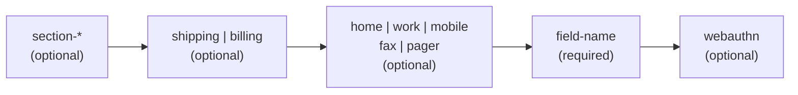

# [FEE-113] Autocomplete Attribute Token Reference

:::info
The HTML `autocomplete` attribute accepts a space-separated list of tokens drawn from a strict ordered grammar: optional `section-*`, optional `shipping` or `billing`, optional contact type, a required field-name, and an optional `webauthn` credential hint. Only the field-name token is mandatory; the others, when present, MUST appear in the prescribed order. Adding `webauthn` alongside `username` turns an `<input>` into an entry point for passkey Conditional UI when paired with `navigator.credentials.get({ mediation: 'conditional' })`. This reference catalogs every field-name token, explains the grouping prefixes, and documents the passkey integration.
:::

## Context

The WHATWG HTML Living Standard defines `autocomplete` as a space-separated token list with a strict ordering: `[section-*] [shipping|billing] [home|work|mobile|fax|pager] field-name [webauthn]`. The spec states the structure as "Optional section prefix: `section-*`; Optional mode: `shipping` or `billing`; Optional contact type: `home`, `work`, `mobile`, `fax`, or `pager`; Field name (required); Optional credential type: `webauthn`."

Tokens written out of order fall outside the grammar and the browser treats the attribute as autofill-unspecified, silently losing the semantic hints. The field-name token carries the meaningful signal; the surrounding tokens refine which address, which phone, or which account context the field belongs to.

## Visual

| Position | Token family | Required | Allowed values |
| --- | --- | --- | --- |
| 1 | Section prefix | No | Any `section-*` token (case-insensitive; suffix is arbitrary) |
| 2 | Address mode | No | `shipping`, `billing` |
| 3 | Contact type | No | `home`, `work`, `mobile`, `fax`, `pager` |
| 4 | Field name | Yes | One token from the field-name catalog (see Token Reference) |
| 5 | Credential type | No | `webauthn` |



## Example

A minimal single-field autofill hint uses only the field-name token:

```html
<label>
  First name
  <input type="text" name="first" autocomplete="given-name" />
</label>
```

A grouped form uses the `section-*` prefix so the browser can keep two address blocks distinct on the same page, combined with a mode qualifier:

```html
<fieldset>
  <legend>Primary billing address</legend>
  <input autocomplete="section-user1 billing postal-code" name="billing-zip" />
  <input autocomplete="section-user1 billing country" name="billing-country" />
</fieldset>

<fieldset>
  <legend>Secondary billing address</legend>
  <input autocomplete="section-user2 billing postal-code" name="alt-billing-zip" />
  <input autocomplete="section-user2 billing country" name="alt-billing-country" />
</fieldset>
```

A sign-in field that participates in passkey Conditional UI carries both `username` and `webauthn`, then the page calls `navigator.credentials.get()` with conditional mediation so the request stays pending until the user picks a credential from the autofill menu:

```html
<form id="login">
  <label>
    Username
    <input name="username" autocomplete="username webauthn" />
  </label>
  <label>
    Password
    <input name="password" type="password" autocomplete="current-password" />
  </label>
</form>
```

```js
if (window.PublicKeyCredential &&
    PublicKeyCredential.isConditionalMediationAvailable) {
  const available = await PublicKeyCredential.isConditionalMediationAvailable();
  if (available) {
    const credential = await navigator.credentials.get({
      mediation: 'conditional',
      publicKey: {
        challenge: new Uint8Array(challengeFromServer),
        // allowCredentials left empty for discoverable credentials
      },
    });
    // The promise stays pending until the user picks a passkey in the autofill sheet.
    verifyOnServer(credential);
  }
}
```

## Best Practices

- **MUST** pair `autocomplete="username"` on the identifier field with `autocomplete="current-password"` on the password field for sign-in forms. web.dev documents that `username` is the token password managers recognize on email-shaped identifier fields in modern browsers, and `current-password` is the pair on the password input.
- **MUST** use `autocomplete="new-password"` on signup and password-change fields so password managers suggest generated credentials and avoid autofilling the current password. MDN: "A new password. When creating a new account or changing passwords, this should be used for an 'Enter your new password' or 'Confirm new password' field."
- **SHOULD** prefer `autocomplete="new-password"` over `autocomplete="off"` when suppressing autofill on an admin-sets-other-user-password page. MDN's security guide notes: "If you are defining a user management page where a user can specify a new password for another person, and therefore, you want to prevent autofilling of password fields, you can use `autocomplete=\"new-password\"`."
- **SHOULD** treat `autocomplete="off"` as a non-binding request on credential fields. MDN states: "If a site sets `autocomplete=\"off\"` on a `<form>` element and the form includes username and password input fields, the browser will still offer to remember this login." Password managers deliberately override `off` on login flows, so relying on `off` for security is not workable.
- **MAY** combine the `section-*`, `shipping` or `billing`, and contact-type tokens to distinguish multiple address blocks or phone slots within the same page.

## Deep Dive

Tokens are only one of the signals a browser consults. Safari in particular layers heuristics over the input's `name`, `placeholder`, and `label` in that order. Cloudfour's autofill writeup records: "Safari uses heuristics to detect what autofill values to use and it's very aggressive in doing so. Rather than simply relying on standardized attributes, Safari evaluates the input's attributes in this order: name, placeholder, and label."

The practical consequence: a field with `autocomplete="one-time-code"` but `name="email"` can still trigger email autofill in Safari, because the heuristic outranks the token. Defensive authors keep `name` attributes semantically aligned with the field-name token (`name="otp"` for `autocomplete="one-time-code"`, `name="current-password"` for `autocomplete="current-password"`), and avoid placeholders that describe a different field than the token declares.

## Token Reference

The field-name token is drawn from the WHATWG catalog. The following tables group the tokens by domain. Every token is case-insensitive and appears in MDN's reference list.

### Identity

| Token | Expected format | Notes |
| --- | --- | --- |
| `name` | Full legal name | Prefer split name tokens where possible |
| `honorific-prefix` | "Mr.", "Ms.", "Dr." | |
| `given-name` | First name | |
| `additional-name` | Middle name | |
| `family-name` | Last name | |
| `honorific-suffix` | "Jr.", "III", "PhD" | |
| `nickname` | Display name | |
| `username` | Account identifier | Pair with `current-password` for login; required for passkey Conditional UI |
| `organization-title` | Job title | |
| `organization` | Company name | |

### Credentials

| Token | Expected format | Notes |
| --- | --- | --- |
| `new-password` | Plaintext password | Used for signup and password-change flows; also the recommended suppression hint |
| `current-password` | Plaintext password | Login flows; pair with `username` |
| `one-time-code` | Numeric OTP | iOS/macOS Safari 12+ parses incoming SMS and offers the code as a keyboard suggestion; Android Chrome uses the separate WebOTP API |

### Contact

| Token | Expected format | Notes |
| --- | --- | --- |
| `tel` | Full phone number | Combine with `home`/`work`/`mobile`/`fax`/`pager` to qualify |
| `tel-country-code` | "+1", "+44" | |
| `tel-national` | National-format phone | |
| `tel-area-code` | Area code | |
| `tel-local` | Local portion | |
| `tel-extension` | Extension digits | |
| `email` | Email address | Combine with `home`/`work` to qualify |
| `impp` | Instant-messaging URL | |
| `url` | Homepage URL | |
| `photo` | Avatar URL | |

### Postal address

| Token | Expected format | Notes |
| --- | --- | --- |
| `street-address` | Multi-line street address | |
| `address-line1` | First street line | |
| `address-line2` | Second street line | |
| `address-line3` | Third street line | |
| `address-level4` | Finest administrative level | |
| `address-level3` | Third-level administrative area | |
| `address-level2` | City or locality | |
| `address-level1` | State or province | |
| `country` | ISO 3166-1 alpha-2 country code | |
| `country-name` | Human-readable country name | |
| `postal-code` | ZIP or postal code | |

### Payment

| Token | Expected format | Notes |
| --- | --- | --- |
| `cc-name` | Name on card | |
| `cc-given-name` | First name on card | |
| `cc-additional-name` | Middle name on card | |
| `cc-family-name` | Last name on card | |
| `cc-number` | Card number | |
| `cc-exp` | Expiration in `MM/YY` or `MM/YYYY` | |
| `cc-exp-month` | Expiration month digits | |
| `cc-exp-year` | Expiration year digits | |
| `cc-csc` | Card security code | |
| `cc-type` | Card network name | |

### Transaction

| Token | Expected format | Notes |
| --- | --- | --- |
| `transaction-currency` | ISO 4217 currency code | |
| `transaction-amount` | Decimal amount | |

### Demographics

| Token | Expected format | Notes |
| --- | --- | --- |
| `bday` | `YYYY-MM-DD` | |
| `bday-day` | Day digits | |
| `bday-month` | Month digits | |
| `bday-year` | Year digits | |
| `sex` | Free-form string | |
| `language` | BCP 47 language tag | |

The `section-*`, `shipping`, `billing`, and contact-type tokens do not replace field-name tokens; they layer on top. MDN describes the section token as "A token whose first eight characters are the string 'section-', case-insensitive, followed by additional characters. All form controls that start with the same token belong to the named group." The mode tokens bind what follows: "`shipping`: The field identified by subsequent tokens is part of the shipping address or contact information. `billing`: The field identified by subsequent tokens is part of the billing address or contact information." The contact-type tokens (`home`, `work`, `mobile`, `fax`, `pager`) qualify telephone and email fields.

## Passkey Conditional UI (`webauthn` token)

The `webauthn` token is the trailing credential hint in the grammar. The WHATWG spec describes it as "Optionally, a token...for the string 'webauthn', meaning the user agent should show public key credentials available via conditional mediation...webauthn is only valid for input and textarea elements." In practice the token matters only on `<input>`, because Conditional UI surfaces passkeys alongside the standard autofill menu for username fields.

When to use it: any sign-in or account-recovery page that supports passkeys. The integration is two-part. The HTML carries both tokens, space-separated:

```html
<input name="username" autocomplete="username webauthn" />
```

The script calls `navigator.credentials.get()` with `mediation: 'conditional'`. web.dev documents the behavior: "The `navigator.credentials.get()` call with `mediation: 'conditional'` remains pending and does not show any UI on its own." The promise resolves only when the user selects a passkey from the autofill sheet; until then the page remains ready to accept a typed username and password instead.

Limitations and browser support:

- `webauthn` has no effect on `<textarea>` per the spec, even though the grammar technically accepts both element types.
- The token is ignored when paired with `one-time-code`, because an OTP field is not a credential-carrying field.
- Firefox added explicit recognition of the `webauthn` autocomplete token in version 122 (January 2024). Chrome, Edge, and Safari support Conditional UI as of 2025.
- Feature-detect with `PublicKeyCredential.isConditionalMediationAvailable()` before calling `navigator.credentials.get()`, so older browsers fall through to the username+password flow without a runtime error.

## Related Topics

- [Forms & Validation](/en/HTML%20and%20Semantic%20Markup/103)
- [HTML Security Attributes](/en/HTML%20and%20Semantic%20Markup/108)

## References

- WHATWG, "HTML Living Standard — Autofill," https://html.spec.whatwg.org/multipage/form-control-infrastructure.html#autofill
- MDN, "HTML attribute: autocomplete," https://developer.mozilla.org/en-US/docs/Web/HTML/Reference/Attributes/autocomplete
- MDN, "Turning off form autocompletion," https://developer.mozilla.org/en-US/docs/Web/Security/Practical_implementation_guides/Turning_off_form_autocompletion
- web.dev, "Sign-in form best practices," https://web.dev/articles/sign-in-form-best-practices
- web.dev, "Sign in with a passkey through form autofill," https://web.dev/articles/passkey-form-autofill
- web.dev, "SMS OTP form best practices," https://web.dev/articles/sms-otp-form
- Cloudfour, "Autofill: What web devs should know, but don't," https://cloudfour.com/thinks/autofill-what-web-devs-should-know-but-dont/
- Corbado, "WebAuthn autocomplete and Conditional UI," https://www.corbado.com/blog/webauthn-autocomplete
