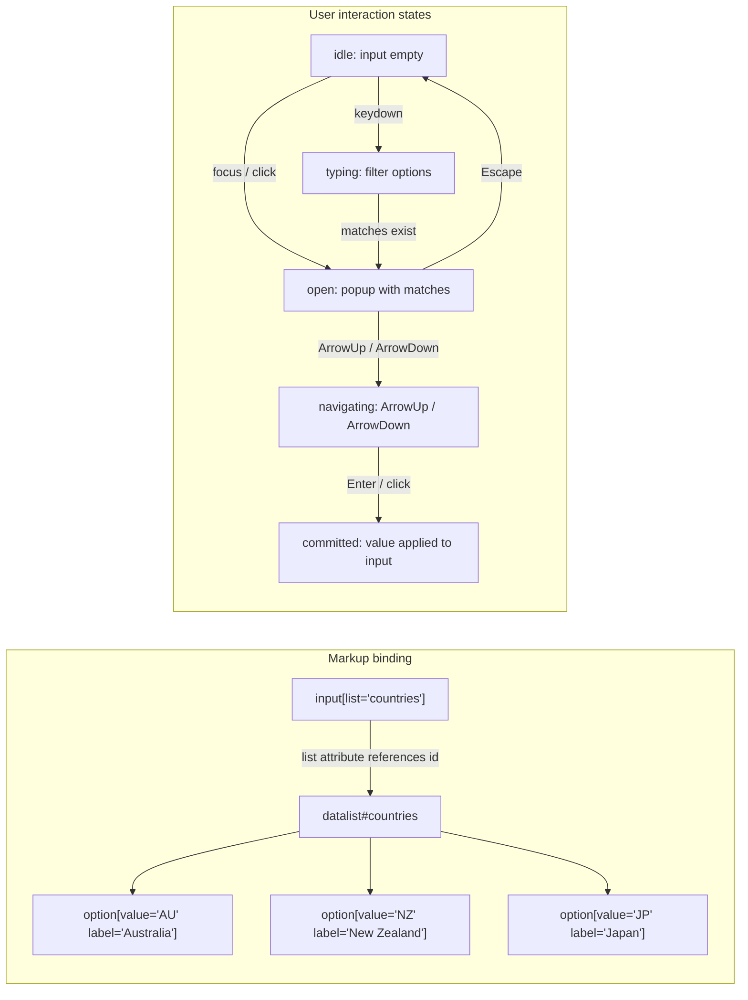

# [FEE-116] `<datalist>` and the Native Combobox Pattern

:::info
`<datalist>` pairs with an `<input>` to render a filter-as-you-type suggestion popup without any JavaScript. The HTML Standard defines it as a container of `<option>` elements that an input references through its `list` attribute, and the element doubles as a WAI-ARIA combobox pattern the platform wires up for you. The control still accepts any value that passes validation, which separates the use case from `<select>`. Before reaching for a hand-rolled ARIA combobox, know where datalist wins (zero-JS, semantic simplicity) and where it breaks (zoom, screen-reader support, cross-browser rendering quirks).
:::

## Context

The HTML Standard defines `<datalist>` as "a set of `option` elements that represent predefined options for other controls." The element is a container for suggestions, never itself an input. Authors do not submit datalist values directly; they supply candidates that an associated form control can render in a popup.

Binding happens through the input's `list` attribute, which "is hooked up to an `input` element using the `list` attribute on the `input` element." Assign the datalist an `id`, then set `list="that-id"` on the input. The relationship is one-to-many: multiple inputs can reference the same datalist.

MDN draws the line against `<select>` plainly: "`<datalist>` is not a replacement for `<select>`. A `<datalist>` does not represent an input itself; it is a list of suggested values for an associated control. The control can still accept any value that passes validation, even if it is not in this suggestion list." A `<select>` restricts the submitted value to one of its `<option>`s; a datalist-backed input accepts free-form text (subject to validation attributes such as `pattern`, `min`, `max`, `required`).

## Visual



## Example

Three input types wired to the same markup shape but with distinct UI treatments.

```html
<!-- Text input: filter-as-you-type dropdown -->
<label for="country">Country code</label>
<input id="country" name="country" list="country-codes" autocomplete="off" />

<datalist id="country-codes">
  <option value="AU" label="Australia"></option>
  <option value="JP" label="Japan"></option>
  <option value="NZ" label="New Zealand"></option>
  <option value="SG" label="Singapore"></option>
  <option value="TW" label="Taiwan"></option>
</datalist>
```

```html
<!-- Range input: datalist options render as tick marks -->
<label for="volume">Volume</label>
<input id="volume" type="range" min="0" max="100" step="1" list="volume-marks" />

<datalist id="volume-marks">
  <option value="0"></option>
  <option value="25"></option>
  <option value="50"></option>
  <option value="75"></option>
  <option value="100"></option>
</datalist>
```

```html
<!-- Color input: datalist options surface as swatches in the native picker -->
<label for="accent">Brand accent</label>
<input id="accent" type="color" list="brand-swatches" />

<datalist id="brand-swatches">
  <option value="#0f62fe"></option>
  <option value="#24a148"></option>
  <option value="#da1e28"></option>
  <option value="#f1c21b"></option>
  <option value="#8a3ffc"></option>
</datalist>
```

Per MDN: "Recommended values in types text, search, url, tel, email and number, are displayed in a drop-down menu when user clicks or double-clicks on the control." For `range`, "they will be shown as a series of tick marks that the user can easily select." For `color`, "The color type can show predefined colors in a browser-provided interface."

## Best Practices

- **MUST** set `<option value>` to the value you want submitted, and use `label` (or inner text) for the human display string when they differ. MDN documents the split: "Each `<option>` element should have a `value` attribute, which represents a suggestion to be entered into the input. It can also have a `label` attribute, or, missing that, some text content, which may be displayed by the browser instead of `value` (Firefox), or in addition to `value` (Chrome and Safari, as supplemental text)." Be aware Firefox shows label instead of value while Chrome and Safari show both.
- **MUST NOT** add `role="combobox"` or `aria-expanded` to an `<input list>`. The native datalist already implements the combobox role; MDN's combobox reference describes the built-in pairing as "an editable single-line text field (using an `<input>` element, similar to one with a `<datalist>`)." Adding ARIA duplicates semantics and can confuse assistive technology.
- **MUST** verify zoom and screen-reader behavior on critical flows before shipping datalist as the sole entry for a field. MDN warns that "The font size of the data list's options does not zoom, always remaining the same size," which affects low-vision users. The a11ysupport.io tech report records that on NVDA with Firefox "all options are announced as 'blank'" and on VoiceOver with macOS Safari it is "not possible to navigate to datalist and suggestions are not announced."
- **SHOULD** treat the datalist popup as visually unstylable. MDN: "As targeting the list of options with CSS is very limited to non-existent, rendering can not be styled for high-contrast mode." If brand-exact option styling or high-contrast parity is a requirement, do not use datalist.
- **SHOULD** prefer a hand-rolled ARIA combobox when any of the following apply (from Adrian Roselli's inventory): the field must work as more than a text box in Firefox on Android, options must be reachable in landscape mode in Chrome on Android, users need to zoom option text, voice control must target options, you must style options, or the submitted `value` differs from the visible node text.
- **MAY** share one `<datalist>` across multiple inputs by referencing the same `id`. This is a direct consequence of Claim 2's binding model and keeps markup small when several fields draw from a common list (for example, country codes in billing and shipping forms).

## Design Thinking

The WAI-ARIA Authoring Practices define combobox succinctly: "A combobox is an input widget that has an associated popup. The popup enables users to choose a value for the input from a collection." The `<input list>` + `<datalist>` pair satisfies this definition without author-written ARIA. The browser owns the expanded/collapsed state, the filtering, the keyboard model, and the focus choreography.

Web Axe describes the trade the native element asks you to accept: "The beauty of the datalist element is simplicity. Straight forward, semantic, and simple HTML - and no JavaScript needed!" That simplicity is the design lever. A hand-rolled ARIA combobox requires correct roles (`combobox`, `listbox`, `option`), `aria-controls`, `aria-activedescendant` (or roving tabindex), `aria-expanded`, keyboard handlers for Home/End/PageUp/PageDown/Escape/Enter, screen-reader announcements on open and on filter, and focus return on close. Each piece is a place a bug can live.

Datalist concedes control over presentation and some accessibility edges in return for eliminating that surface area. The right way to choose between them is to map product requirements against the Roselli checklist above: if none apply, native datalist is the least-risk implementation; if any apply, the native element will not meet the bar and an ARIA combobox becomes justified work.

## Deep Dive

**Dynamic option updates.** The spec supports adding and removing `<option>` children at runtime. Firefox has at least two live bugs that make this fragile. Bugzilla #1351483 ("dynamically added datalist does not show when appened after the input its assigned to already has a value") documents one class: if the datalist is appended to the DOM after the input already holds a value, the popup only appears after the user clears the value and starts typing again. Reports on the same bug also note that Firefox's autocomplete controller can retain prior filter results after option arrays are swapped, surfacing stale suggestions. Defensive patterns: render the full datalist on first paint if possible, or, when options must be fetched, rebuild the entire datalist element (remove and re-add) rather than mutating children in place, and blur/refocus the input after replacement.

**Firefox width truncation.** Bugzilla #1106946 records that Firefox truncates datalist option text with an ellipsis at the width of the input: "datalist options should not be truncated to the width of the input." Chrome and Edge let the popup grow to fit the longest option. CSS cannot override this because datalist rendering is outside the author stylable surface (see Claim 9). For long labels (addresses, full product names), either widen the input, split into two fields, or switch to an ARIA combobox.

## Input Type Compatibility Matrix

Per MDN: "It is valid on `text`, `search`, `url`, `tel`, `email`, `date`, `month`, `week`, `time`, `datetime-local`, `number`, `range`, and `color`." And: "Per the specifications, the `list` attribute is not supported by the `hidden`, `password`, `checkbox`, `radio`, `file`, or any of the button types."

| Input type        | `list` supported | UI treatment                                       |
|-------------------|------------------|----------------------------------------------------|
| `text`            | Yes              | Filter-as-you-type dropdown                        |
| `search`          | Yes              | Filter-as-you-type dropdown                        |
| `url`             | Yes              | Filter-as-you-type dropdown                        |
| `tel`             | Yes              | Filter-as-you-type dropdown                        |
| `email`           | Yes              | Filter-as-you-type dropdown                        |
| `number`          | Yes              | Filter-as-you-type dropdown                        |
| `date`            | Yes              | Suggestions surface in the native date picker      |
| `month`           | Yes              | Suggestions surface in the native month picker     |
| `week`            | Yes              | Suggestions surface in the native week picker      |
| `time`            | Yes              | Suggestions surface in the native time picker      |
| `datetime-local`  | Yes              | Suggestions surface in the native datetime picker  |
| `range`           | Yes              | Tick marks on the slider track                     |
| `color`           | Yes              | Swatches inside the native color picker            |
| `hidden`          | No               | `list` ignored (per spec)                          |
| `password`        | No               | `list` ignored (per spec)                          |
| `checkbox`        | No               | `list` ignored (per spec)                          |
| `radio`           | No               | `list` ignored (per spec)                          |
| `file`            | No               | `list` ignored (per spec)                          |
| `button` types    | No               | `list` ignored on `submit`, `reset`, `button`, `image` |

The split tracks a clean rule: any input whose value is meaningfully free-form (text-like) or numerically bounded (`range`, `number`) or a selection from a large space (dates, `color`) can benefit from suggestions; toggles, buttons, and opaque controls (`hidden`, `password`, `file`) cannot.

## Related Topics

- [Forms & Validation](/en/HTML%20and%20Semantic%20Markup/103)
- [Autocomplete Attribute Token Reference](/en/HTML%20and%20Semantic%20Markup/autocomplete-token-reference)

## References

- WHATWG, "The `datalist` element," HTML Living Standard. https://html.spec.whatwg.org/multipage/form-elements.html#the-datalist-element
- MDN, "`<datalist>`: The HTML Data List element." https://developer.mozilla.org/en-US/docs/Web/HTML/Reference/Elements/datalist
- MDN, "`<input>`: The HTML Input element." https://developer.mozilla.org/en-US/docs/Web/HTML/Reference/Elements/input
- MDN, "`<option>`: The HTML Option element." https://developer.mozilla.org/en-US/docs/Web/HTML/Reference/Elements/option
- W3C WAI, "Combobox Pattern," ARIA Authoring Practices Guide. https://www.w3.org/WAI/ARIA/apg/patterns/combobox/
- MDN, "ARIA: combobox role." https://developer.mozilla.org/en-US/docs/Web/Accessibility/ARIA/Reference/Roles/combobox_role
- a11ysupport.io, "HTML `datalist` element support." https://a11ysupport.io/tech/html/datalist_element
- Adrian Roselli, "Under-Engineered Comboboxen?" (2023). https://adrianroselli.com/2023/06/under-engineered-comboboxen.html
- Web Axe, "Datalist over ARIA combobox." https://www.webaxe.org/datalist-over-aria-combobox/
- Mozilla Bugzilla #1351483, "dynamically added datalist does not show when appened after the input its assigned to already has a value." https://bugzilla.mozilla.org/show_bug.cgi?id=1351483
- Mozilla Bugzilla #1106946, "datalist options should not be truncated to the width of the input." https://bugzilla.mozilla.org/show_bug.cgi?id=1106946
