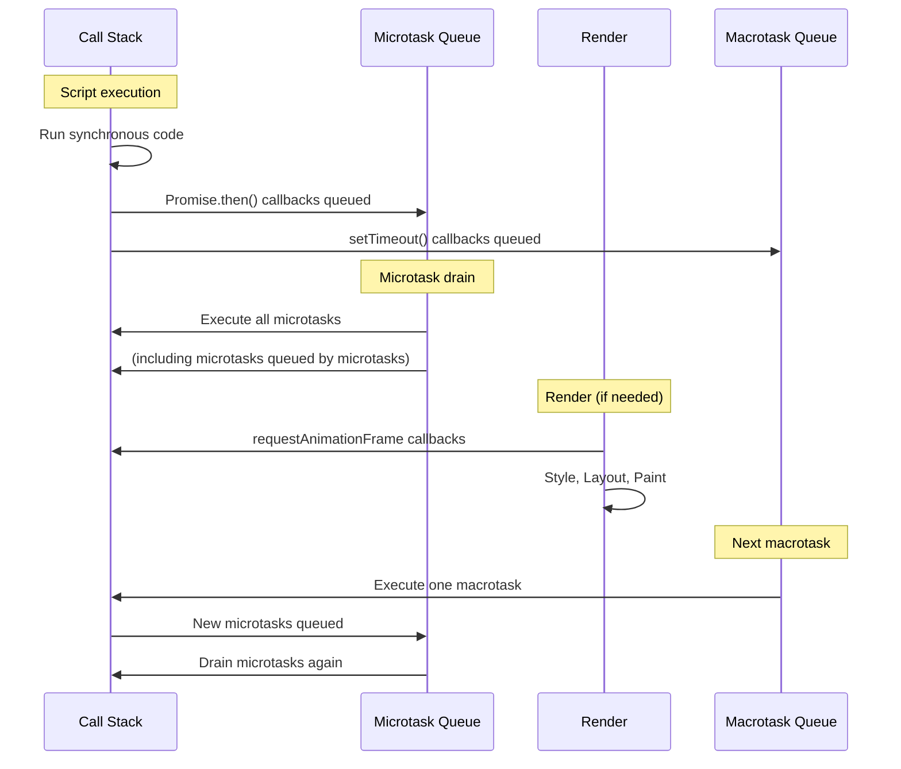

# [FEE-301] Event Loop & Async Model

:::info
JavaScript executes on a single thread. The event loop is the mechanism that coordinates execution of synchronous code, microtasks (Promises), macrotasks (setTimeout, I/O), and rendering updates.
:::

## Context

Browsers run JavaScript on a single main thread that also handles layout, paint, and user input. Understanding the event loop is critical because it determines when your code runs relative to rendering and user interaction. Misunderstanding task scheduling leads to janky UIs, race conditions, and subtle bugs that are hard to reproduce.

## Principle

Engineers MUST understand the distinction between microtasks and macrotasks, and how they interleave with rendering.

**Execution order per event loop iteration:**

1. Execute the current synchronous call stack to completion
2. Drain the microtask queue (Promise callbacks, queueMicrotask, MutationObserver)
3. If it is time to render: run requestAnimationFrame callbacks, then layout and paint
4. Pick the next macrotask from the queue (setTimeout, setInterval, MessageChannel, I/O)
5. Repeat

Engineers SHOULD prefer `queueMicrotask()` or Promise resolution when work must complete before the next render. Engineers SHOULD use `requestAnimationFrame()` for visual updates. Engineers SHOULD NOT use `setTimeout(fn, 0)` as a generic "defer" mechanism -- it schedules a macrotask, which runs after rendering.

## Visual



## Example

```js
console.log('1: synchronous');

setTimeout(() => {
  console.log('5: macrotask');
}, 0);

Promise.resolve().then(() => {
  console.log('3: microtask');
}).then(() => {
  console.log('4: chained microtask');
});

console.log('2: synchronous');

// Output order: 1, 2, 3, 4, 5
```

**Why this order matters:** The synchronous code (1, 2) runs first as part of the current call stack. Promise `.then()` callbacks (3, 4) are microtasks -- they drain before the event loop moves on. `setTimeout` (5) is a macrotask -- it waits for the next iteration.

## Common Mistakes

**Blocking the main thread with synchronous work.** Long-running synchronous operations (large array processing, complex calculations) block rendering and input. Move heavy computation to Web Workers or break it into chunks with `scheduler.yield()` or `requestIdleCallback()`.

**Assuming setTimeout(fn, 0) runs "immediately."** It schedules a macrotask. An entire microtask queue drain and a potential render can happen before it executes. Use `queueMicrotask()` if you need to defer to after the current task but before rendering.

**Infinite microtask loops.** A microtask that queues another microtask will starve rendering. The microtask queue must drain completely before the browser can paint. Always ensure microtask chains terminate.

**Mixing async patterns inconsistently.** Combining callbacks, Promises, and async/await without understanding their scheduling behavior leads to unpredictable execution order. Prefer async/await for readability, but understand it desugars to Promise microtasks.

## Related FEEs

- [FEE-300](300.md) JavaScript Core & Runtime Overview
- [FEE-302](302.md) Closures & Scope Chain

## References

- [HTML Living Standard: Event loops](https://html.spec.whatwg.org/multipage/webappapis.html#event-loops)
- [MDN: Event loop](https://developer.mozilla.org/en-US/docs/Web/JavaScript/Event_loop)
- [MDN: queueMicrotask](https://developer.mozilla.org/en-US/docs/Web/API/queueMicrotask)
- [Jake Archibald: Tasks, microtasks, queues and schedules](https://jakearchibald.com/2015/tasks-microtasks-queues-and-schedules/)
